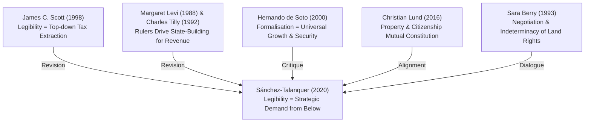

# One-Eyed State: The Politics of Legibility and Property Taxation

**Author**: Mariano Sánchez-Talanquer  
**Year**: 2020  
**Journal**: *Latin American Politics and Society*, 62(3), 65–93  
**DOI**: [10.1017/lap.2020.7](https://doi.org/10.1017/lap.2020.7)  
**Source File**: [One-Eyed State_ The Politics of Legibility and Property Taxation.md](file:///Users/dineshmahapatra/Library/CloudStorage/GoogleDrive-dineshmahapatra123@gmail.com/My%20Drive/PhD/9%20-%20Knowledge_base/sources/One-Eyed%20State_%20The%20Politics%20of%20Legibility%20and%20Property%20Taxation.md)  
**Master Note**: [One-Eyed State_ The Politics of Legibility and Property Taxation.md](file:///Users/dineshmahapatra/Library/CloudStorage/GoogleDrive-dineshmahapatra123@gmail.com/My%20Drive/PhD/2%20-%20Notes/Papers/One-Eyed%20State_%20The%20Politics%20of%20Legibility%20and%20Property%20Taxation.md)

---

## 1. Core Argument

Sánchez-Talanquer challenges the traditional supply-side, state-centric theories of state-building, which hold that rulers pursue land legibility (registration and mapping) to extract revenue, causing landowners to resist registration. The paper argues that under redistributive threats (such as land reform), landowners actively seek inscription in state cadasters to obtain legal validation and state enforcement of their property claims. However, to minimize the resulting tax liabilities, they exploit weak state administrative capacity to capture the valuation process, keeping their land systematically undervalued.

The result is a **"One-Eyed State"**—a state that has high informational visibility regarding *who* owns *what* (to protect elite property claims), but remains structurally blind and weak regarding *fiscal extraction* (its ability to tax that wealth).

> [!NOTE]
> **Defining Quote:**  
> *"Overall, the theoretical argument holds that challenged propertied actors can assert their interests by rendering the state’s vision selective in two respects. First, in who is registered (and thus more likely to be legally recognized as a property owner) and who is overlooked (and thus maintained in a state of informality). Second, in what should be seen and what should not—namely, (some) property holders but not the actual value of their property. In short, landowners’ interest lies in the rise of a 'one-eyed' state."* (p. 67)

---

## 2. Conceptual Architecture

The paper disassembles "state capacity" and "legibility" into highly strategic, demand-driven concepts:

*   **Selective Legibility**: The strategic manipulation of state visibility. Elites actively choose what the state records (boundaries, ownership) and what it does not (actual market values, subaltern claims, informal partitions).
*   **Legibility as a Legal Shield**: Contrary to James C. Scott's framing of legibility as a top-down tool of state control, legibility is a resource that social actors can demand and appropriate from below to secure their property rights against squatters, tenants, or redistributive reforms.
*   **Act of Adjudication**: Constructing a cadaster is not a neutral, administrative description of reality. Listing a name in a public registry is a political act backed by the state's monopoly on violence, which actively *creates* and privileges one owner while legally excluding competing claimants.
*   **Bifurcated State Capacity**: The divergence between the state's capacity to register/track ownership and its capacity to extract taxes. Functional layers of the state (cadastral registration vs. fiscal valuation) do not co-evolve; they are shaped by distinct distributive conflicts.
*   **The Disjointed State**: A state characterized by selective subnational vision and uneven fiscal strength, produced by historical partisan fractures and elite networks capturing local institutions.

---

## 3. Empirical Terrain

### Historical Setting & Cases
The paper tests its hypotheses using municipal-level data from Colombia across two major attempts at agrarian reform led by the Liberal Party:
1.  **Law 200 of 1936**: Spearheaded by Alfonso López Pumarejo, which defined "the social function of property," granted rights to productive settlers (colonos), and established specialized land tribunals.
2.  **Law 135 of 1961**: Passed at the beginning of the power-sharing National Front period to mediate disputes, allocate state lands, and redistribute large estates.

### Data & Methodology
*   **Dataset**: Newly compiled municipal-level longitudinal data from 1915 to 1966, covering registered properties per capita, official cadastral valuations, municipal tax revenues, 1930 and 1958 partisan voting histories, and geographic/socioeconomic controls.
*   **Methodological Design**: A Difference-in-Differences (DiD) statistical analysis tracking changes in registration and tax extraction in historically Conservative municipalities (where landowners faced the highest redistributive threat from Liberal-led reforms) vs. non-threatened Liberal municipalities.

### Key Empirical Findings
1.  **Spikes in Registration**: Following land reforms, land property registration spiked disproportionately in threatened Conservative municipalities. Under the 1936 reform, Conservative municipalities saw an extra increase in registration that was roughly **80% larger** than in Liberal municipalities.
2.  **Valuation & Fiscal Stagnation**: Despite the massive increase in registered land properties, official property values in Conservative areas did not rise proportionately, and municipal tax revenues stagnated or lagged. Under the 1961 reform, land tax revenue growth per capita was **3.5% lower** in Conservative municipalities.
3.  **Local Capture of Valuation**: Qualitative archives demonstrate that landholders strategically captured local valuation boards (especially after Decree 259 of 1954, which allowed landowners to self-declare property values), keeping official tax liabilities near zero while retaining the legal benefits of registration.

---

## 4. Theoretical Lineage

Sánchez-Talanquer positions his work at the crossroads of, and in tension with, several major state-building and property-rights frameworks:

*   **James C. Scott (*Seeing Like a State*)**: Sánchez-Talanquer accepts Scott's premise that the cadaster is a constitutive technology of state legibility. However, he reverses the agency: instead of society fleeing the state's sight, propertied elites run *toward* state visibility to lock in ownership claims.
*   **Margaret Levi (*Of Rule and Revenue*) & Charles Tilly**: Revision of the "stationary bandit" model. Information systems do not automatically expand state fiscal capacity; elites can selectively build the administrative components they need (recognition) while starving the ones they oppose (taxation).
*   **Hernando de Soto & New Institutional Economics**: Critiques the idea that land registration is a neutral, pareto-optimal "tide that lifts all boats." Inscription in the cadaster is a highly unequal instrument that excludes marginal claimants and formalizes elite capture.
*   **Christian Lund (*Rule and Rupture*)**: Aligns with the concept that cadastral entry is an "act of adjudication" that co-produces property claims and state authority.
*   **Sara Berry (*No Condition Is Permanent*)**: Supplements Berry's concept of fluid agrarian claims by showing that entering formal records is a strategic move to freeze negotiations in the elites' favor.

---

## 5. The Quote Bank

Here is a themed selection of 33 load-bearing quotes extracted from the text, complete with page locations and analytical glosses mapping them to the PhD thesis.

### Theme A: The Double-Edged Sword of Legibility & Property Rights
1.  **On Informational Foundations:**
    > *"The use and production of standardized information to govern territory and society is a distinctive characteristic of the modern state (Lee and Zhang 2017; Scott 1998)."* (p. 65)  
    *Gloss for Ch. 2.1*: Frames the core rationale of DILRMP as an informational project of state building.
2.  **On the Tripartite Role of Cadasters:**
    > *"Prominent among its tools of 'legibility' is the land cadaster, a streamlined register of real estate property that helps control the physical landscape, regulate property, and above all, extract taxes."* (p. 65)  
    *Gloss for Ch. 2.1*: Disaggregates what a cadaster actually does, warning against collapsing mapping, land administration, and tax extraction into a single technical progress indicator.
3.  **On the Conventional Tax Narrative:**
    > *"There is a considerable consensus among scholars that 'the driving logic behind the [cadastral] map is to create a manageable and reliable format for taxation' (Scott 1998, 36)."* (p. 65)  
    *Gloss for Ch. 1.2 / 3.1*: Highlights the standard supply-side assumption that digitisation is driven solely by state fiscal interest, which the thesis will complicate.
4.  **On Demand-Side Reorientation:**
    > *"Where the legal system is an important arena of adjudication, landholders facing redistributive threats mounted by political opponents, such as land reform programs, have incentives to enter the state’s purview, as a means to defend property claims."* (pp. 65–66)  
    *Gloss for Ch. 3.4*: Introduces the "demand-side" model: why landholders in Odisha might rush to update their Record of Rights (RoR) on Bhulekh when facing land acquisition or family disputes.
5.  **On Registration as a Legal Shield:**
    > *"For rightful owners, registration in the state’s land cadaster adds a layer of legal protection in the face of threat and bolsters demands for state enforcement of property rights."* (p. 66)  
    *Gloss for Ch. 5.6*: Explains why rural elites place immense value on the physical paper copy of the RoR (Patta) despite its presumptive status under Indian law.
6.  **On Legalising Land Grabs:**
    > *"For land grabbers, it can be part of a strategy to legalize current or past confiscation."* (p. 66)  
    *Gloss for Ch. 5.5 / 5.7*: Crucial for analysing how illegal encroachments on village commons (Gochar/Anabadi) are strategically mutated into private holdings during digitisation.
7.  **On Blocking Reform from Below:**
    > *"In all, incorporation into the cadaster helps access state protection, justify private evictions, counter mobilization from below in the legal arena, and overall, block attempts at land reform to redress rural grievances."* (p. 66)  
    *Gloss for Ch. 4.1*: The cadaster is not just a database; it is an instrument of socio-legal domination used to suppress subaltern claims.
8.  **On the Desire to be Recognized:**
    > *"The key point is that incentives exist for threatened landholders to be seen, listed, noted by the public power—in a word, to be recognized by the state and detected by its registering devices."* (p. 66)  
    *Gloss for Ch. 1.1*: Directly counters the James C. Scott thesis of state evasion. High-status actors seek visibility to capture state protection.
9.  **On the Risk-Benefit Trade-Off:**
    > *"Registration, however, is a double-edged sword. As emphasized by the literature, it carries permanent taxpaying responsibilities for landowners..."* (p. 66)  
    *Gloss for Ch. 3.2*: Explains why landowners in a functioning tax state might hesitate to register, but under Odisha's low land revenue regime, the risk is almost zero, making registration pure benefit.
10. **On the Axiom of Legibility vs. Property:**
    > *"legibility risks taxation but enables property rights."* (p. 69)  
    *Gloss for Ch. 1.1*: The most concise formulation of the paper's core trade-off.
11. **On the Constitutive Nature of Records:**
    > *"Cadastral maps and property registers do not merely codify the underlying social and physical world but actively constitute it (Scott 1998, 37)."* (p. 69)  
    *Gloss for Ch. 4.3 / 6.2*: Load-bearing quote for the thesis: digital databases like Bhulekh do not "discover" rights; they actively crystallize a new digital reality that overrides physical ground possession.
12. **On Presumptive Registry as Adjudication:**
    > *"When a name is listed in the public cadaster, an ownership claim is recognized in an official document backed by the state’s coercive power. Even if tacitly, it is an act of adjudication."* (p. 69)  
    *Gloss for Ch. 2.4*: Directly maps to the Indian system where the RoR is technically presumptive, yet in practice, revenue offices and local police treat it as conclusive proof of ownership.
13. **On the Rationality of remaining Unseen:**
    > *"Absent disputes over land or credible threats of expropriation, remaining undetected and unlisted in the state’s registering instruments is optimal..."* (pp. 69–70)  
    *Gloss for Ch. 5.5*: Explains why co-sharers in Odisha villages let land remain under joint ancestral Khata (and do not register individual partitions) until a dispute, sale, or acquisition occurs.

### Theme B: The Valuation/Taxation Split & Valuation Capture
14. **On the Subversion of Information:**
    > *"This consists in having cadastral records themselves misrepresent a second key piece of information: the value of land property."* (p. 67)  
    *Gloss for Ch. 3.4 / 5.7*: Illustrates how information systems can be manipulated selectively: accurate on boundaries (to protect claims) but distorted on details that carry obligations (value/taxes).
15. **On the Leverage of Valuations:**
    > *"Because property taxes are levied on the value of land property as registered by the state... cadastral assessments directly determine the weight of the fiscal burden."* (p. 67)  
    *Gloss for Ch. 2.1*: Establishes the fiscal link: if you control the valuation office, you control your tax liability.
16. **On Administrative Capture:**
    > *"In developing contexts, where cadastral authorities often lack autonomy and administrative capacity, landholders can capture or undermine the assessment process to keep official land values down."* (p. 67)  
    *Gloss for Ch. 4.2 / 5.7*: Connects to the local rent-seeking and capture of the Revenue Inspector (RI) and Amin in Odisha who control local land value class assessments.
17. **On the Superiority of Undervaluation:**
    > *"Ensuring that property remains undervalued is a superior alternative to hoping for failures in collection... maintaining property undervalued in cadastral records keeps the tax burden low while averting costs for nonpayment."* (p. 72)  
    *Gloss for Ch. 3.4*: Landowners prefer to capture the record itself rather than simply evade taxes post-hoc. The record is the site of struggle.

### Theme C: Disaggregating State Capacity & Spatial Divergence
18. **On the Spatial-Fiscal Divergence:**
    > *"Such a defensive strategy spawned uneven territorial patterns of legibility and taxation, which conventional theories that expect these two dimensions of state building to go together cannot explain."* (p. 68)  
    *Gloss for Ch. 4.5*: A key theoretical tool to explain why Bhulekh can show 100% digitised registration, while actual ground dispute resolution and land tax extraction remain completely flat.
19. **On Strategic Institutional Splitting:**
    > *"They do so by engaging strategically with different state institutions, like tax authorities, land-surveying agencies, or courts, to advance their interests. These interests do not involve rejecting the state altogether."* (p. 68)  
    *Gloss for Ch. 3.4 / 4.2*: Odisha landholders do not reject the state; they bribe the Amin to survey their boundaries, utilize the Tehsildar to register mutations, but ignore the Gram Panchayat for property taxes.
20. **On the Limits of State Enforcement Assumptions:**
    > *"First, they underemphasize the influence of demand-side forces in statemaking; second, they rest on assumptions about officials’ ability to enforce legislation that are problematic in many developing contexts."* (p. 69)  
    *Gloss for Ch. 3.1*: Critiques the technocratic design of DILRMP, which assumes a highly capable, automated, neutral administrative state that does not exist in rural India.
21. **On the Role of the Judiciary:**
    > *"The legal benefits of registration, in contrast, are potentially large in regimes with binding legal constraints on executives, multiple formal and informal veto points, and complex bureaucratic procedures that limit rapid or arbitrary change."* (p. 70)  
    *Gloss for Ch. 2.4 / 4.1*: Highlights how the hyper-legalistic nature of Indian land disputes makes even presumptive records highly valuable as instruments to freeze disputes in civil courts.
22. **On Inefficiency as Elite Infrastructure:**
    > *"checks and balances, along with legal formalities, may play into the hands of landowners and limit redistribution under democracy"* (p. 70)  
    *Gloss for Ch. 4.1 / 4.2*: A counterintuitive but critical insight: democratic legal procedures and revenue administrative delays are utilized by wealthy elites to tie up land disputes and block landless claimants.
23. **On the Frictional Reality of State Surveying:**
    > *"Accurately surveying land, determining its value, and updating records throughout vast territories is no mean feat. Practical difficulties in implementation can easily play into the hands of landholders."* (p. 72)  
    *Gloss for Ch. 4.3 / 6.2*: Applies directly to the failure of resurveys in Odisha (only 6% completed under DILRMP). Administrative friction is an opportunity for elite capture.
24. **On Malleability of Records vs. Agrarian Structures:**
    > *"cadastral records are more malleable than agrarian structures."* (pp. 77–78)  
    *Gloss for Ch. 6.2*: Excellent quote to describe how the digital databases of Bhulekh are easily updated, modified, and cleaned to show "success" while the physical fields on the ground remain highly fragmented and disputed.
25. **On Disaggregating State Capacity:**
    > *"because different types of state capacity have distinct distributional consequences, we must disaggregate state building in two respects simultaneously: geographically and functionally (Soifer 2016)."* (p. 89)  
    *Gloss for Ch. 1.1 / 3.2*: Methodological warrant for the thesis: we must study the progress of digital land records by dividing it into functional parts (digitisation, map linking, mutation speed, dispute settlement) rather than using a single aggregate index.
26. **On the "Disjointed" State:**
    > *"Colombia’s deep historical partisan divide engendered a “disjointed” state, with selective vision and uneven fiscal strength."* (p. 90)  
    *Gloss for Ch. 3.4 / 4.5*: Parallels the Odisha context where the revenue state is a "disjointed" entity—highly visible via online Bhulekh portals but structurally blind to ground-level sharecropping or possession.

### Theme D: Distributive Consequences & Subaltern Exclusion
27. **On the Probative Value of Tax Receipts:**
    > *"Ultimately, if no title was presented and the commission could not verify 'material possession' by any of the claiming parties, regulations held that 'whoever has been paying the property tax will be presumed to be the owner'"* (pp. 73–74)  
    *Gloss for Ch. 2.3.3*: Highlights the historical transition where paying land revenue (Lagan) became the primary administrative proof of possession and ownership in India.
28. **On the Subaltern appropriation of records:**
    > *"peasant settlers sometimes 'begged municipal authorities to inscribe their names on tax lists, hoping in this way to reinforce their claims to the land'"* (p. 74)  
    *Gloss for Ch. 5.8*: Shows that vulnerable actors also seek legibility. In Odisha, sharecroppers try to get their names recorded on crop procurement portals (like PACS) to prove tenancy.
29. **On the Power of Elite Capture:**
    > *"However, in most cases, peasants and tenants had considerably less leverage over authorities than did landed elites."* (p. 74)  
    *Gloss for Ch. 5.7*: Points to the unequal capacity to bribe or influence the RI/Amin, ensuring the digital record reflects elite boundaries.
30. **On the One-Eyed State's Vision:**
    > *"the state 'recognizes ownership claims but not actual property values.'"* (p. 84)  
    *Gloss for Ch. 3.4*: Core empirical summary of the asymmetric state.
31. **On Wealth Defence:**
    > *"selective legibility is a weapon in the politics of wealth defense, one that social actors may deploy to crystallize their property and tax interests in the law."* (p. 88)  
    *Gloss for Ch. 3.1*: Defines the political-economic function of selective record keeping.
32. **On the Invisibility of the Poor:**
    > *"It is the poorest citizens who typically live in informal settlements, fall outside official registers, and lack property rights—who are “unseen” by the state."* (p. 88)  
    *Gloss for Ch. 5.4 / 5.8*: Vital for analyzing the exclusion of landless Scheduled Caste (Dalit) households living in informal bastis on village commons.
33. **On the State "Winking":**
    > *"through the cadastral register, the prime technology to observe land property, the Colombian state recognized the property claims of some but winked at the actual value of their land."* (p. 89)  
    *Gloss for Ch. 3.4*: Poetic critique of how the state colludes with elite interests.

---

## 6. Internal Tensions and Silences

While the paper is theoretically and empirically robust, it exhibits several omissions and structural constraints that the thesis can address:

1.  **Direct Observation of Valuation Capture**: The paper relies on OLS models of municipal-level aggregates to infer capture (more registration + stagnant tax revenues = undervaluation). However, the micro-political processes—how landowners bribe, intimidate, or negotiate with individual assessors on the ground—remain a "black box." The thesis can resolve this via institutional ethnography of the Tehsil office.
2.  **Thin Treatment of Subaltern Agency**: The paper's analytical lens is focused almost exclusively on elite propertied strategy. Subaltern actors (peasants, colonos) appear only as the external "threat" or as passive victims. The brief mention of settlers "begging to be put on tax lists" is left untheorized. The thesis can explore how marginalized groups in Odisha actively use alternative documentary traces (voter cards, ration cards, electricity bills, crop sale receipts) to contest the digital RoR.
3.  **The Democracy Scope Condition**: The author asserts that this strategy of defensive formalisation is only effective in constitutional democracies with binding judicial constraints. However, he does not empirically test this against autocracies (keeping Colombia constant).
4.  **No Gender Analysis**: The paper treats "landowners" as a gender-neutral class, completely ignoring how cadastral systems selectively recognize male heads of household while rendering women's inheritance and customary rights systematically invisible.
5.  **Applicability beyond Property Tax**: In Odisha, the primary "obligations" of land ownership are not property taxes (which are negligible). Instead, the trade-off is between the benefits of registration (access to credit, cash transfers CM-Kisan/PM-Kisan, compensation during land acquisition) and the risks of visibility (family disputes, boundary challenges, state acquisition). The thesis must extend the "one-eyed state" framework to reflect these modern welfare/regulatory dynamics.

---

## 7. Thesis Relevance (PHD_LENS Filter)

This paper passes all three tests of the [PHD_LENS.md](file:///Users/dineshmahapatra/Library/CloudStorage/GoogleDrive-dineshmahapatra123@gmail.com/My%20Drive/PhD/9%20-%20Knowledge_base/PHD_LENS.md) filter and is highly load-bearing for the dissertation.

### Test 1: Research Question Link
*   **RQ1 (DILRMP Progress)**: Directly links. Explains why DILRMP's progress should not be measured in aggregate database coverage (e.g., "100% digitisation") but disaggregated by functional capacity.
*   **RQ2 & RQ5 (Harmony of Design/Outcomes & Technocratic Modernisation)**: Directly links. Shows that computerising records does not resolve ground disputes; it merely restates them digitally, often freezing existing inequalities and elite capture into an authoritative database.
*   **RQ4 (Disjuncture between Records and Ground Reality)**: Directly links. The gap is not merely a technical delay; it is a politically produced "selective legibility" where owners update only the information that benefits them.

### Test 2: Geographic & Institutional Grounding
*   While set in Colombia, the paper's *institutional mechanism* is highly portable. Both Colombia and India share a colonial administrative legacy where land records were originally designed as revenue cadasters but gradually acquired immense property-recognition and legal-probative functions, operating under conditions of high rural inequality and weak local administrative capacity.

### Test 3: Chapter Mapping
*   **Chapter 1.1 & 1.2 (Conceptual Framework & Literature Review)**: Integrates *selective legibility* and *the one-eyed state* alongside James C. Scott, Christian Lund, and Sara Berry.
*   **Chapter 3.4 (Technocratic Reforms)**: Provides the core theoretical framework for the critique of DILRMP: digitisation extends *informational visibility* without resolving *structural inaccuracy* or *distributional equity*.
*   **Chapter 5.5 & 5.7 (Village Ground Realities)**: Guides the empirical analysis of who is registered on Bhulekh (patrilineal, upper-caste landowners) and who remains informal or invisible (women, Scheduled Caste tenants, common-land occupants).
*   **Chapter 6 (Parcel-Level Findings)**: Provides the analytical scaffold for showing that "authoritative inaccuracy" is a structured political product, not an accidental technical bug.

### Active Debates Engaged (from PHD_LENS.md)
*   **Debate 2 (Formalisation as Growth vs. Dispossession)**: The paper shows that registration secures property *selectively* for those who already hold power, often enabling the eviction or exclusion of marginal claimants.
*   **Debate 3 (Technocratic Modernisation vs. Political Economy)**: Central engagement. Incomplete or inaccurate records are a political equilibrium, not a technical failure.
*   **Debate 4 (Colonial Revenue Record → Postcolonial Title Document)**: Shows how a fiscal-cadastral tool is strategically converted into a property shield without achieving the administrative completeness of conclusive titling.
*   **Debate 8 (Ownership vs. Possession)**: Recorded ownership is actively updated and protected precisely to override and delegitimize competing, unrecorded possessory claims.

---

## 8. Ideas and Questions Sparked

### 1. The Selective-Legibility Parcel Matrix (For Chapter 6)
For the 15 sample parcels per study village, the thesis can map exactly what the digital state "sees" vs. what it is "blind" to. This operationalizes the one-eyed state concept at the plot level:

| Parcel ID | Textual Owner (Bhulekh) | Spatial Polygon (Bhunaksha) | Ground Possessor | Ground Cultivator / Tenant | Informal Subdivisions / Partitions | Unrecorded Heirs (Women) | Discrepancy Type |
|---|---|---|---|---|---|---|---|
| *E.g., Plot 101* | Registered (Male Head) | Registered (Outdated 1962 boundary) | Co-sharer (Brother) | Informal Tenant | Yes (3 oral shares) | Yes (2 sisters excluded) | *Selective Inaccuracy* (boundary stale, tenant invisible, sisters excluded) |

### 2. Interview Questions for Fieldwork (For Chapter 5)
*   **To Landholders**: *"When you mutated your land record on Bhulekh after your father's death, why did you choose not to register the formal partition between your brothers? Did leaving it as a joint ancestral Khata help you prevent boundary challenges from neighbors or state acquisition?"*
*   **To Tenants/Sharecroppers**: *"Have you ever tried to get your name registered in the revenue record? Did the landowner object? How do you prove your cultivation status to receive PACS crop-procurement benefits if you are invisible on Bhulekh?"*
*   **To Revenue Officials (Tehsildars/Amins)**: *"Why is the online Bhulekh database updated daily, while the cadastral maps (Bhunaksha) have not been resurveyed since the 1960s? Who benefits from keeping the textual database separated from the actual spatial boundaries on the ground?"*

### 3. Typology of the Record-Reality Gap
The thesis can synthesize three distinct sources of the gap between records and ground reality, positioning Sánchez-Talanquer's contribution:
1.  **Passive/Technical Gap (Wadhwa)**: Staff shortages, administrative delay, and obsolete surveying technology.
2.  **Social/Fluid Gap (Berry)**: Ongoing negotiations, oral agreements, and the deliberate flexibility of family land claims.
3.  **Selective/Strategic Gap (Sánchez-Talanquer)**: Elites actively updating records when it brings benefits (welfare transfers, legal security) but capturing or disabling updating mechanisms when it brings obligations (taxation, land ceilings, tenancy protections).

---

## 9. Companion Quote Bank Request

> [!TIP]
> A comprehensive review of the paper has been compiled. If you require a separate, extensively structured **Companion Quote Bank** organized by thesis chapters, active debates, and core concepts (saved as `1 - Rough/Review/Codex/SanchezTalanquer2020_OneEyedState_quotes.md` to match the other papers), please let me know.
