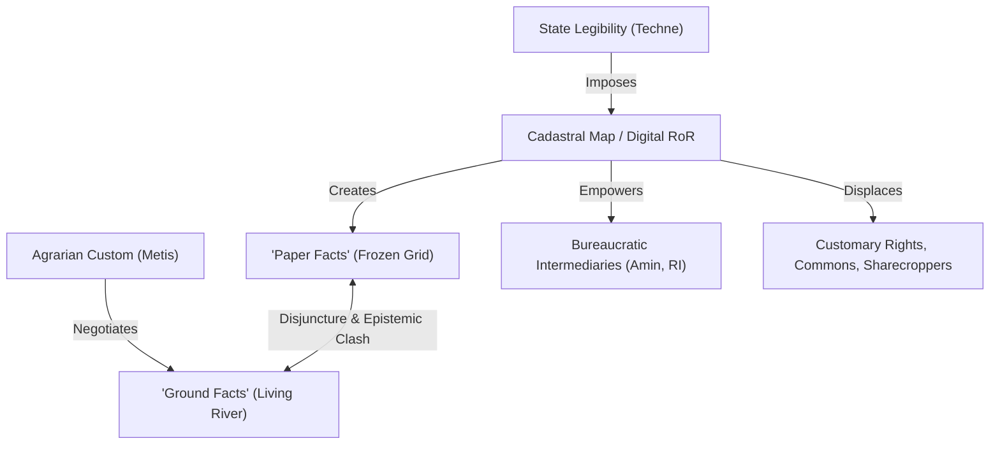

# Seeing Like a State — Pages 33–52: Land, Legibility, and the Cadastral Grid

## 1. Core Argument

In this pivotal section of *Seeing Like a State* (pages 33–52), James C. Scott shifts his analytical focus from the natural world (scientific forestry) to the social and administrative landscape of **land tenure**. His central argument is that customary land tenure systems, which are highly complex, multi-layered, and locally negotiated, present an existential challenge to the modernizing state because they are **fiscally and administratively illegible** from the center.

To overcome this "illegibility," the modern state does not simply map existing custom; rather, it uses state power to aggressively simplify, standardize, and reconstruct property relations. Through the imposition of **individual freehold tenure** and its crowning technocratic instrument—the **cadastral map**—the state strips away the dense, qualitative, and ecological realities of land use to create a uniform, mappable grid of taxable assets. 

Scott demonstrates that this cadastral grid is not a neutral, descriptive tool. By a "fiscal Heisenberg principle," the state's shorthand administrative representations actively **remake social reality**, legally obliterating customary safety nets, communal rights, and shared commons, while shifting power toward literate legal intermediaries who can navigate the state's new, abstract property code.

### Defining Quote
> "The state's case against communal forms of land tenure, however, was based on the correct observation that it was fiscally illegible and hence fiscally less productive. Rather than trying, like the hapless Lalouette, to bring the map into line with reality, the historical resolution has generally been for the state to impose a property system in line with its fiscal grid... The cadastral map is active: in portraying one reality, as in the settlement of the new world or in India, it helps obliterate the old." (pp. 39, 48)

---

## 2. Conceptual Architecture

*   **Customary Land Tenure (as "Living Tissue")**: Customary property relations are localized, plastic, and multi-layered webs of rights (usufruct, gleaning, grazing, tree-ownership vs. land-ownership) that adjust dynamically to ecological, social, and demographic shifts. It is perfectly legible from within to local actors but behaves like a highly complex "property hieroglyph" to outsiders.
*   **The Cadastral Map (as "Thin Simplification")**: An abstract, geometric survey of landholdings mapped to a uniform scale (e.g., 1:2,880). It is a "thin" representation because it purposefully ignores soil quality, crop rotations, and qualitative social values, focusing strictly on defining boundaries and linking numbered lots to individual taxpayers.
*   **Fiscal Feudalism**: The premodern state's reliance on communities or aristocratic intermediaries to deliver lump-sum taxes. This collective taxation was structurally plagued by deliberate misrepresentation, as local elites systematically hid population, profits, and land to minimize their fiscal burden.
*   **The Stolypin/Witte Land Consolidation**: A massive, top-down high-modernist state project in late Imperial Russia designed to dismantle the "illegible" open-field interstripping system (*mir*) and forcibly consolidate land into individual, western-style freehold farmsteads (*khutor* and *otrub*).
*   **The "Heisenberg Principle of Statecraft"**: The phenomenon whereby a state's narrow administrative categories and shorthand measurement formulas actively reshape and transform the human behavior and physical realities they seek to observe.
*   **Paper Facts vs. Ground Facts**: The permanent structural divergence between the state's official, static records (the "paper" reality) and the living, dynamic, and often informal property practices (squatting, unrecorded inheritance, paper consolidations) that actually occur on the ground.
*   **The Torrens System**: A highly standardized, presurveyed, lithographed land titling grid developed in 1860s Australia to rapidly package, register, and market homogeneous units of land on a first-come, first-served basis, completely detached from topographical realities.

---

## 3. Empirical & Evidence Terrain

### A. The Customary Tenure Model (Javanese Proverb: *Negara mawi tata, desa mawi cara*)
Scott constructs a hypothetical (but highly realistic) agrarian community to illustrate the multi-layered complexity of customary land tenure:
*   *Seasonal usufruct*: Families hold temporary rights to cropland during the main season, which are redistributed every seven years based on family size and labor capacity.
*   *Post-harvest reversion*: Cropland reverts to common land for gleaning, grazing, and dry-season cropping.
*   *Separation of land and assets*: Trees planted belong to the planter, but fallen fruit belongs to anyone, and branches or tops are distributed to neighbors and the poor according to strict micro-rules.
*   *Famine safety nets*: Resource sharing and emergency rationing are socially negotiated, demonstrating that custom is a "living, negotiated tissue of practices" rather than frozen positive law.

### B. The Stalemate of the French *Code Rural* (1803–1807)
*   Postrevolutionary French reformers attempted to draft a unified rural code. 
*   *Lalouette's populist project* attempted to systematically gather, classify, and codify all local practices. It failed because:
    1.  Codifying "infinite diversity" is deeply political; it freezes a dynamic process, favoring local elites while stripping the poor of flexible customary assertions.
    2.  It represented a mortal threat to centralizers and economic modernizers who demanded a single, uniform, national property regime as a precondition for market progress.

### C. The Stolypin Reforms in Russia (Novoselok & Khotynitsa Villages)
Scott utilizes detailed comparative maps of two Russian villages before and after the Stolypin Reforms (1906) to analyze the visual aesthetics of state-enforced order:
*   *Before the Reform*: Peasants utilized "interstripping" (narrow, parallel strips spread across dozens of ecological microclimates to distribute climatic risks). To surveyors, this looked like an "irrational," chaotic maze. In reality, it was incredibly elegant and simple for local use (adjusted via wooden stakes without calculating surface area).
*   *After the Reform*: The state forced the consolidation of these strips into compact, geometrically regular individual plots (*khutor*).
*   *The Outcome*: The neat, geometric maps published by the state were a facade. Peasants intensely resisted the reform through "paper consolidations" (registering individual plots on paper but continuing to farm in communal interstrips on the ground). Because the state lacked actual, accurate ground-level knowledge, its wartime grain procurement policies during World War I and War Communism were ruinous and blind.

### D. Historical Laboratories of Cadastral Mapping
*   **The Netherlands**: Pioneer of early land mapping due to early commercialization and capital investments in draining land, where speculators demanded precise, abstract, presurveyed allotments.
*   **Ireland (The Petty Survey of 1679)**: Ireland was mapped earlier and more thoroughly than metropolitan England. William Petty's survey under Oliver Cromwell serves as a clear historical law: *cadastral mapping occurs earlier, more comprehensively, and more violently in conquered colonies where a powerful state operates on a prostrate civil society.*
*   **Thomas Jefferson's American West Grid**: A massive grid of square townships and ten-mile "hundreds" projected onto the American West, ignoring topographical features and indigenous common-property regimes to facilitate rapid, distant land commoditization and taxation.
*   **The Torrens System in Australia**: Standardized lithographed grids that accelerated real estate markets but ran into severe topographical friction (e.g., planning roads on paper that ran straight over cliffs and gullies, completely precluding actual locomotion).

---

## 4. The Quote Bank (verbatim from Pages 33–52)

### Theme A: Customary Tenure vs. State Standardization

1. **On the nature of customary property practices**:
   > "Customs are better understood as a living, negotiated tissue of practices which are continually being adapted to new ecological and social circumstances—including, of course, power relations." (p. 34)
   *Gloss*: Custom is a dynamic process, not a frozen set of rules. Codification inevitably kills this adaptability, transforming organic negotiation into rigid administrative positive law.

2. **On the illegibility of local practice to the state**:
   > "Like the 'exotic' units of weights and measures, local land tenure practice is perfectly legible to all who live within it from day to day... State officials, on the other hand, cannot be expected to decipher and then apply a new set of property hieroglyphs for each jurisdiction. Indeed, the very concept of the modern state presupposes a vastly simplified and uniform property regime that is legible and hence manipulable from the center." (p. 35)
   *Gloss*: Establishes the core epistemic conflict at the heart of land administration: what is transparent to a villager is a "property hieroglyph" to the bureaucrat, and the state’s survival requires the violent elimination of this local opacity.

3. **On freehold tenure as the "Normalbaum" of society**:
   > "Just as the flora of the forest were reduced to Normalbaume, so the complex tenure arrangements of customary practice are reduced to freehold, transferrable title. In an agrarian setting, the administrative landscape is blanketed with a uniform grid of homogeneous land, each parcel of which has a legal person as owner and hence taxpayer." (p. 36)
   *Gloss*: A direct theoretical bridge between scientific forestry and land registration. The "Normalbaum" (standard commercial tree) is the structural equivalent of the "unmarked freehold parcel." Both are radical, state-imposed simplifications.

4. **On the fiscal drive against the commons**:
   > "The state's case against communal forms of land tenure, however, was based on the correct observation that it was fiscally illegible and hence fiscally less productive. Rather than trying, like the hapless Lalouette, to bring the map into line with reality, the historical resolution has generally been for the state to impose a property system in line with its fiscal grid." (p. 39)
   *Gloss*: States do not destroy commons because they are ecologically unsustainable; they destroy them because they cannot easily tax common-property resources or monitor communal incomes.

### Theme B: The Epistemology of the Cadastral Map

5. **On the "thinness" of cadastral surveys**:
   > "The value of the cadastral map to the state lies in its abstraction and universality... The completeness of the cadastral map depends, in a curious way, on its abstract sketchiness, its lack of detail—its thinness." (p. 44)
   *Gloss*: The power of the database lies in what it leaves out. By reducing land to purely geometric coordinates, the state gains a synoptic view at the cost of total blindness to ecological and social complexity.

6. **On the map as a tool of distant mastery**:
   > "A plot rightly drawne by true information, discribeth so the lively image of a manor... as the lord sitting in his chayre, may see what he hath, and where and how he lyeth, and in whose use and occupation of every particular is upon suddaine view." (p. 45, quoting John Norden, 1607)
   *Gloss*: Captures the rise of "synoptic vision" and the "God's-eye view" of property, allowing distant landlords and centralized state tax collectors to govern territories they have never physically set foot on.

7. **On the static nature of property registers**:
   > "The cadastral map is very much like a still photograph of the current in a river. It represents the parcels of land as they were arranged and owned at the moment the survey was conducted. But the current is always moving..." (p. 46)
   *Gloss*: Highlights the built-in path dependency and rapid obsolescence of digital land registers. Real-world land mutations, partitions, and inheritances move like a river, while the state's record remains frozen in a static snapshot.

### Theme C: Power, Resistance, and the Heisenberg Principle

8. **On the Heisenberg Principle of modern statecraft**:
   > "The shorthand formulas through which tax officials must apprehend reality are not mere tools of observation. By a kind of fiscal Heisenberg principle, they frequently have the power to transform the facts they take note of." (p. 47)
   *Gloss*: Focuses on how state indicators and algorithms act as active interventions. Once the state measures a phenomenon (like windows or land parcels), society reorganizes itself to fit or exploit the indicator.

9. **On the rise of legal intermediaries and power shifts**:
   > "They faced powerful new specialists in the form of land clerks, surveyors, judges, and lawyers whose rules of procedure and decisions were unfamiliar... whatever their conduct, their fluency in a language of tenure specifically designed to be legible and transparent to administrators, coupled with the illiteracy of the rural population to whom the new tenure was indecipherable, brought about a momentous shift in power relations." (p. 48)
   *Gloss*: Explains how land modernization creates a new class of rent-seeking bureaucratic intermediaries (like the *Amin*, *RI*, or deed writers in Odisha) who exploit their database literacy to dispossess traditional, illiterate cultivators.

10. **On the structural divergence of paper and ground**:
    > "We must keep in mind not only the capacity of state simplifications to transform the world but also the capacity of the society to modify, subvert, block, and even overturn the categories imposed upon it. Here it is useful to distinguish what might be called facts on paper from facts on the ground." (p. 49)
    *Gloss*: The ultimate theoretical justification for village-level empirical fieldwork. The researcher must never conflate the state's clean digital database with the messy, negotiated, de facto property relations operating on the ground.

11. **On colonies as administrative laboratories**:
    > "It followed from the same logic that conquered colonies ruled by fiat would often be cadastrally mapped before the metropolitan nation that ordered it. Ireland may have been the first... surveyed... to facilitate the rape of that nation by the English..." (p. 49)
    *Gloss*: Connects cadastral mapping directly to state violence, colonial extraction, and conquest. Colonies represent "leveled terrains" where states can experiment with radical simplifications without the drag of domestic democratic negotiation.

---

## 5. Thesis Relevance & Inclusion Filter (PHD_LENS.md Calibration)

*Seeing Like a State* (Pages 33–52) provides the foundational, load-bearing theoretical framework for a dissertation on **Land Records Modernisation in Odisha (DILRMP)**.

### A. RQ Alignment (Direct Mapping)
*   **RQ2 & RQ4 (Disjuncture between Records and Ground Reality)**: Scott’s "still photograph of the current in a river" (p. 46) is the precise conceptual vocabulary needed to explain why Odisha's online *Bhulekh* portal diverges so drastically from actual village possession. The digital RoR is a static "paper fact," while actual agrarian relations (inheritance, partition, oral tenancy) operate as a dynamic, living "ground fact."
*   **RQ5 (Technocratic Reforms as Conflict Restatements)**: The push under DILRMP to resolve land disputes through GIS mapping, ULPIN, and automated e-mutations is exposed as a classic **high-modernist technocratic trap**. By attempting to bypass the local "art of the village" with a muscle-bound algorithm, the state does not resolve conflicts; it merely translates them into an elite-dominated digital code, reinforcing existing inequalities.
*   **RQ1 & RQ6 (Alternative Methods vs. Survey & Settlement)**: Scott's analysis of the failure of Witte and Stolypin's land reforms demonstrates that administrative maps created from a distance, without local *metis* and actual ground-level adjudication, lead to systemic blindness and ruinous administrative failures. 

### B. Geographic & Institutional Grounding (Test 2)
*   Scott’s analysis of the European transition (from Danish *ejerlav* and Norwegian *gard* communal shares to freehold title) serves as the exact historical-comparative benchmark for reading the British imposition of the **1793 Permanent Settlement** in Bengal/Odisha, and the postcolonial state's continuation of this path-dependent legacy. 
*   His analysis of how colonial intermediaries (e.g., Vietnamese interpreters in the Mekong Delta) amassed fortunes by exploiting their literacy in the state's new tenure codes directly maps to the historical and contemporary role of the **revenue hierarchy in Odisha (Tehsildar, RI, Amin)**.

### C. Active Debates (Thesis Context)
*   **Debate 1: Presumptive vs. Conclusive Title**: Scott explains why India's land title remains presumptive after 230 years. The state’s "thin simplifications" have never successfully captured the dense "thick" reality of village land relations, making a transition to conclusive titling a dangerous high-modernist fantasy.
*   **Debate 3: Technocratic Modernisation vs. Political Economy**: Scott’s critique of "Lalouette's code" and the Stolypin reforms proves that land registries are intensely political. Digitisation is not a neutral administrative upgrade; it is a strategy of state centralization that consolidates power for elites while dispossessing informal, oral, and common-property claimants.
*   **Debate 8: Ownership vs. Possession**: Scott’s "facts on paper vs. facts on the ground" provides the definitive theoretical grounding for Chapter 5 and 6 of the thesis, validating the use of Gunter's chain to physically map the divergence between *Bhunaksha* spatial data and actual village possession.

---

## 6. Ideas & Questions Sparked (Generative Hooks)

1.  **The Digital *Patwari* as the Death of *Metis***: Historically, the local *patwari* or *Amin* possessed situated, local knowledge of village genealogies, boundaries, and historical compromises (*metis*). Does the complete computerisation of land records under DILRMP represent a violent attempt by the state to replace this situated, negotiable *metis* with a centralized, rigid, and blind digital *techne*?
2.  **ULPIN as the "Normalbaum" of Odisha**: The Unique Land Parcel Identification Number (ULPIN), dubbed the "Aadhaar for land," aims to reduce every plot to a single, 14-digit alphanumeric code. How does ULPIN act as the ultimate "thin simplification," erasing multi-owner records, shared boundaries, and gendered usufruct rights to create a frictionless, market-ready asset?
3.  **The *Sahi* and the Commons: Legibility as Exclusion**: In Nayagarh, Odisha, rural neighborhoods are organized by caste *sahis* and utilize communal lands (*gochar*, *anabadi*) through highly localized customary norms. When DILRMP digitizes these tracts, they are mathematically classified as "State Land" (obliterating customary grazing access). This is a direct realization of Scott’s warning that *whatever is unmappable under private freehold is aggressively claimed by the state* (p. 367n82).
4.  **"Paper Mutating" the River**: In Odisha, hundreds of thousands of land sales and partitions occur informally through *hata-patta* (hand-written agreements) or oral family partitions. Villagers delay official mutations due to high transaction costs and bureaucratic rent-seeking. How can we analyze these informal networks as a vibrant, defensive agrarian *metis* that intentionally keeps land relations "illegible" to protect them from state taxation and market-driven alienation?
