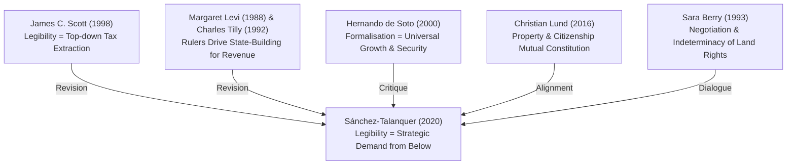

APA Citation from Zotero: Sánchez-Talanquer, M.. (2020). One-Eyed State: The Politics of Legibility and Property Taxation. Latin American Politics and Society, 62(3), 65–93. https://doi.org/10.1017/lap.2020.7

Tags: 

## Highlights
Imp: 
Theories of the rise of the modern state hold that central rulers make land property “legible” to extract revenue, leading landholders to oppose state registration. ==This study revises this logic and argues that when land ownership is disputed, landholders use inscription into state records to secure legal property rights.== 

Gist: Conventional theories suggest that modern states try to make land property "legible" (registered and documented) to extract taxes, which usually causes landowners to oppose registration. This study argues that when land ownership is disputed, wealthy landowners actually _use_ state registration to secure their legal property rights.
*we learnt from Appu that after independence people deleberately fudged records and the condition of records deteriorated so that legibility as an issue persists and *

To minimize resulting tax liabilities, propertied interests may exploit opportunities to manipulate land valuations.

Difference-in-differences analyses of two critical attempts at land reform, led by the Liberal Party, show that land property registration spiked disproportionately in threatened Conservative municipalities, where tax revenues lagged behind nonetheless, due to systematic undervaluation of property. The study concludes that landholders’ selective subversion of state building may disrupt the assumed link between legibility and taxation.

gist: we assume legibility -> taxation but the evidence is: 

we have long assumed that when a state successfully maps and registers a society (makes it "legible"), it automatically becomes stronger and collects more taxes.

This study proves that link can be broken. Elites don't just blindly resist the state; they **selectively subvert** it. They will use the state's tools when it benefits them (protecting their property) while simultaneously crippling the state's tools when it hurts them (dodging taxes).

Imp: They allowed (and even rushed) the mapping part because it served their immediate need for legal protection against radical land reforms. However, they choked off the fiscal part ...one-eyed state.

The use and production of standardized information to govern territory and society is a distinctive characteristic of the modern state (Lee and Zhang 2017; Scott 1998). Prominent among its tools of “legibility” is the land cadaster, a streamlined register of real estate property that helps control the physical landscape, regulate property, and above all, extract taxes. The first cadastral surveys originated in rulers’ drive to increase the tax yield from land, the primary factor of production and the main source of wealth and status in agrarian societies (D’Arcy and Nistotskaya 2017; Kain and Baigent 1992). There is a considerable consensus among scholars that “the driving logic behind the [cadastral] map is to create a manageable and reliable format for taxation” (Scott 1998, 36). 

Land is a ready target for state efforts to extract revenues because, unlike other assets, it cannot be moved or hidden from authorities. This premise underlies a distinguished research tradition that singles out landowner fear of redistribution as an obstacle to democracy (Acemoglu and Robinson 2006; Boix 2003; Ziblatt 2008). 

gist: Concentrated landownership → greater fear of redistribution → stronger elite resistance to democracy.

T he same line of reasoning expects recalcitrant landholder opposition to state efforts to survey, register, map, and measure land property, especially under high inequality. As the primary instrument to render the agrarian landscape “legible” and hence taxable, the land cadaster is at the core of the politics of state building, democracy, and redistribution.

It argues that under certain circumstances, landowners embrace, rather than resist, registration into state cadastral records, a basic form of legibility. Where the legal system is an important arena of adjudication, landholders facing redistributive threats mounted by political opponents, such as land reform programs, have incentives to enter the state’s purview, as a means to defend property claims. 

For rightful owners, registration in the state’s land cadaster adds a layer of legal protection in the face of threat and bolsters demands for state enforcement of property rights. For land grabbers, it can be part of a strategy to legalize current or past confiscation. In all, incorporation into the cadaster helps access state protection, justify private evictions, counter mobilization from below in the legal arena, and overall, block attempts at land reform to redress rural grievances. The key point is that incentives exist for threatened landholders to be seen, listed, noted by the public power.

T his article contends, first, that landholders’ willingness to bear some tax cost increases with the perceived level of threat to property claims, provided that registration can bring potential legal advantages. Who controls the executive and leads land reform projects is crucial. In general, those who stand in opposition to the party in power logically perceive greater vulnerability; therefore, they are more likely to formalize property in the cadaster as a preemptive strategy.  

Second, tolerance of registration in state records varies inversely with the actual weight of the tax burden, itself a function of tax regulations and opportunities for evasion. This study focuses on one major mechanism through which propertied interests mitigate the trade-off between inscription in the cadaster and the attendant taxpaying obligations.

Gist: 
They give the state accurate information about **ownership and boundaries** to legally lock down their property claims against reform.
They feed the state false or highly deflated information about **property value** to keep their taxes near zero.

At least since Adam Smith observed that “land is a subject which cannot be removed” or hidden ([1776] 1981, 848), political economists have argued that landowners are distinctly vulnerable to heavy taxation. Arguments that link agrarian inequality with authoritarianism are premised on the notion that landowners block democracy out of the fear of redistributive measures that would be inescapable, due to the nature of land as a fixed, visible, and hence, readily taxable asset (Ansell and Samuels 2014; Boix 2003; Ziblatt 2008). Because state legibility over land is a precondition for taxation, these influential arguments lead us to expect landowners to nip its development in the bud. Influential models of state building and contractarian approaches to the state, which work from the assumption of self-interested rulers maximizing extraction (Levi 1988; Tilly 1992), produce similar expectations. In this tradition, revenuedriven rulers, as rational, stationary bandits, develop measurement techniques and information systems to increase their tax intake. Society strives to hold back the inherently standardizing and extractive modern state (Scott 1998). Some groups escape its grip, fleeing to remote areas and adapting their behavior to remain unseen and hence, ungoverned (Scott 2009). Over the long run, captive taxpayers who lack an exit option negotiate compensation in the form of rights and public goods (Levi 1988; Tilly 2007). Any given landholder, however, would rationally prefer to freeride and elude the state’s sight. ==T he state’s “crowning artifact” to develop legibility over land is the modern cadaster (Scott 1998, 36), whose “essential feature is that it identifies property owners, usually by linking properties in a map to a written register on which details of the property . . . are recorded” (Kain and Baigent 1992, xviii).== Cadastral records are the key informational tool employed by political elites to govern the agrarian landscape and exact revenues from landed wealth.

Yet as insightful and parsimonious as such models of state building and regime change are, this study argues that they have two main problems. First, they under emphasize the influence of demand-side forces in statemaking; second, they rest on assumptions about officials’ ability to enforce legislation that are problematic in many developing contexts. The result is that they leave relevant empirical patterns unexplained and paint an incomplete picture of the ways landowners have shaped the territorial development of the modern state

Demand-side forces matter for state-building outcomes because certain state interventions can be advantageous to propertied interests. For one, when land property becomes recognizable to the state, owners become subject to taxation but also obtain validation of their property claims from the dominant coercive actor—to the exclusion of the claims of others. This is the centerpiece of the theoretical argument developed in this article: legibility risks taxation but enables property rights.

Overall, the incentives for landholders to tolerate or seek inscription into state cadastral records therefore depend on three main factors: a.  The perception of threat over property claims, itself a function of the partisanship of the executive and its adoption of redistributive projects like land reform b. The degree to which registration can afford legal and other benefits in terms of the definition and protection of property rights c.  The expected tax costs of registration into the land cadaster 

 The possibility of instrumentalizing registration to assert private property rights (factor b) depends on the extent to which the executive can act arbitrarily or is subject to laws, judicial decisions, and predefined, impersonal procedures. If those in power are wholly unconstrained, as in the most arbitrary forms of authoritarian rule, the strategy is ineffectual—and the specific case is outside the scope of this article’s theory. The legal benefits of registration, in contrast, are potentially large in regimes with binding legal constraints on executives, multiple formal and informal veto points, and complex bureaucratic procedures that limit rapid or arbitrary change.  T he potential for unilateral change varies along a continuum, but a basic dichotomous distinction can be drawn between autocracies and constitutional democracies. 

Pace Adam Smith’s claim that “the quantity and value of the land which any man possesses can never be a secret, and can always be ascertained with great exactness” ([1776] 1981, 848)—the keystone of theories of systematic landowner opposition to democracy and property registers—there are major hurdles to doing so. Accurately surveying land, determining its value, and updating records throughout vast territories is no mean feat. Practical difficulties in implementation can easily play into the hands of landholders.  Moreover, property owners have strong incentives to undermine or capture the institutions and surveyors responsible for value assessments, in order to have cadastral records misrepresent the actual value of land property. Ensuring that property remains undervalued is a superior alternative to hoping for failures in collection, for two main reasons. First, proof of compliance with property tax obligations is often a requirement to formalize land transactions or to use land as a collateral. Second, even if the state systematically fails to collect today, unmet tax payments remain attached to the property and may become a problem tomorrow

---

## AI Primer

# Review 1

Here is an elaborate, comprehensive review of the paper **"One-Eyed State: The Politics of Legibility and Property Taxation"** by Mariano Sánchez-Talanquer.

---

## 1. Executive Summary & Core Thesis

The paper challenges a foundational axiom in political economy and historical sociology: the idea that state efforts to map and register society (**state legibility**) automatically translate into increased fiscal extraction (**taxation capacity**).

The author argues that instead of blindly resisting state-building, wealthy elites and large landholders strategically split this process. When threatened by redistributive policies (like land reform), landowners **actively rush to register their property boundaries** to secure legal protection from the state. However, they simultaneously use their local political power to **systematically undervalue their land**, crippling the state's ability to collect property taxes.

The result is a **"One-Eyed State"**—a government that possesses high informational legibility regarding _who owns what_, but remains structurally blind and weak regarding _fiscal extraction_.

---

## 2. Theoretical Framework: Subverting the Standard Model

### The Traditional View (The "Package Deal")

Scholars like James C. Scott (_Seeing Like a State_) and fiscal sociologists have long argued that state-building is driven by a top-down need for revenue. The state creates cadasters (land registries) to tax assets. Because land is immobile and cannot be hidden, landowners are assumed to fiercely resist registration to evade taxes, making land ownership a historical flashpoint that blocks both state penetration and democracy (_Acemoglu & Robinson 2006; Boix 2003_).

### The "One-Eyed State" Revision

Sánchez-Talanquer introduces two critical modifications to this theory:

1. **Legibility as a Legal Shield:** Registration is a double-edged sword. While it risks taxation, it also grants the owner an official, state-sanctioned title backed by the state's monopoly on violence. This title legally excludes competing claims from peasant squatters or rival elites.
    
2. **The Information Split:** Elites do not just accept or reject the state; they manage a trade-off. They give the state accurate **geographic/ownership data** to protect their property, but feed the state fraudulent **valuation data** to neutralize the tax burden.
    

---

## 3. The Core Hypotheses

- **Hypothesis 1 (The Threat Dynamic):** A landholder’s willingness to register their property increases with the level of perceived threat to their land claims. Crucially, those who belong to the **political opposition** to the ruling executive feel the most vulnerable and are the most likely to preemptively formalize their land as a defensive strategy.
    
- **Hypothesis 2 (The Institutional Condition):** This strategy only works if there are **binding institutional constraints** (like an independent judiciary or bureaucratic veto points). In a raw autocracy, registration is useless because the dictator can ignore the registry and seize the land anyway. In a constitutional framework, a formal title allows elites to tie up land reform efforts in court for years.
    
- **Hypothesis 3 (Administrative Exploitation):** Landowners tolerate registration because they exploit the weak administrative capacity of developing states, ensuring that independent, accurate property assessments never actually take place.
    

---

## 4. Empirical Evidence: The Colombian Case Studies

The paper tests this theory using historical data from **Colombia**, focusing on two major attempts at land reform led by the **Liberal Party** in the 20th century (specifically looking at the political dynamics between the reformist Liberals and the landholding Conservatives).

### The Methodology

The author utilizes a **Difference-in-Differences (DiD)** statistical analysis. It tracks changes in land registration and tax revenues in municipalities heavily controlled by the opposition (Conservative areas under threat of Liberal land reform) versus non-threatened areas, before and after the reforms.

### Key Evidence & Findings:

- **Spikes in Registration:** Following the threat of Liberal land reforms, land registration **spiked disproportionately in threatened Conservative municipalities**. Landowners did not hide; they flooded the cadasters to lock down their legal titles before the reform laws could take effect.
    
- **Lagging Fiscal Revenue:** Despite the massive influx of mapped land, property tax revenues in these exact same municipalities **stagnated or lagged behind**.
    
- **Systemic Undervaluation:** Historical cadastral archives reveal that landowners manipulated local land assessment boards. They registered millions of hectares but valued them at a fraction of their market price, effectively keeping their tax liabilities close to zero.
    

---

## 5. Key Concepts to Remember

- **Cadaster:** The official public registry defining the boundaries, ownership, and value of land parcels.
    
- **Preemptive Formalization:** The strategic decision by property owners to register their assets with the state _before_ an expected political threat or asset seizure occurs.
    
- **Act of Adjudication:** The concept that a state registry doesn't just record reality; the state's coercive power actively _creates_ and enforces the legal right of the owner over all other local claimants.
    
- **Bifurcated State Capacity:** A state that develops high capacity in one administrative branch (informational/judicial tracking) while remaining completely underdeveloped in another (fiscal extraction).
    

---

## 6. Conclusion & Academic Contribution

The paper dramatically shifts how we think about inequality and state-building. It proves that **elite capture of the state does not require dismantling state institutions.** Instead, wealthy interests can actively build up the parts of the state they find useful (property rights enforcement) while intentionally starving the parts they dislike (tax collection). This creates an uneven, structurally warped state apparatus designed to protect concentrated wealth.

# Review 2

## Review: Mariano Sánchez-Talanquer, "One-Eyed State: The Politics of Legibility and Property Taxation" (2020)

_Latin American Politics and Society_, 62(3): 64–93

---

## I. Précis and Central Argument

Sánchez-Talanquer's paper enters the state-building literature through a targeted intervention against one of its foundational assumptions: that landowners resist legibility because the cadastre is the state's primary instrument for extracting revenue from landed wealth. Drawing on longitudinal municipal-level data from Colombia across two Liberal land reform episodes (1936 and 1961), he argues the reverse can hold — that threatened landowners _embrace_ cadastral registration as a strategy to defend property claims, while simultaneously manipulating the value-assessment process to minimise tax liabilities. The result is a structurally asymmetric state he calls "one-eyed": it can _see_ ownership but is deliberately blinded to value.

The central theoretical reorientation is from supply-side to demand-side: rather than rulers driving legibility through a hunger for revenue, propertied interests themselves shape cadastral development when registration confers legal advantages — principally, the state's coercive endorsement of their ownership claims — in the context of redistributive threat.

The empirical finding is stark. Conservative municipalities registered significantly more land properties than Liberal ones following both reform episodes, yet this expansion in cadastral coverage did not produce a commensurate increase in fiscal capacity. The gap in tax extraction across the partisan divide either remained as large as before the land reforms or actually widened. The mechanism is property undervaluation: because property taxes are levied on the value of land as registered by the state rather than actual market value, cadastral assessments directly determine the fiscal burden, and in developing contexts where cadastral authorities lack autonomy and administrative capacity, landholders can capture or undermine the assessment process to keep official land values down.

The paper's titular concept encapsulates the outcome: landowners assert their interests by rendering the state's vision selective in two respects — first, in who is registered (legally recognised as a property owner) and who is overlooked (maintained in informality), and second, in what should be seen and what should not: property holders, but not the actual value of their property.

---

## II. Theoretical Architecture: Engagement with Scott and Beyond

The paper is fundamentally a revision of the Scott-Levi-Tilly tradition. The conventional argument holds that the cadastre is the "crowning artifact" in the development of legibility over land, and that propertied interests should therefore resist its expansion as a pillar of the tax state. Sánchez-Talanquer identifies two problems with this: it underweights demand-side forces, and it assumes enforcement capacity that weak states in the Global South rarely possess.

His key theoretical move — that the same process that incorporates a taxpayer also "creates" a property owner, and that cadastral maps and property registers do not merely codify the underlying social and physical world but actively constitute it — is drawn directly from Scott (1998, 37), but deployed against Scott's own predominant interpretation. Where Scott sees legibility as a state project against which society strives, Sánchez-Talanquer shows that propertied society can _appropriate_ legibility for its own ends.

Three conditions jointly determine landowner willingness to tolerate or pursue cadastral registration: the perception of threat to property claims (a function of the partisanship of the executive and its redistributive agenda); the degree to which registration can afford legal and other benefits in terms of the definition and protection of property rights; and the expected tax costs of registration.

He further argues that landholders' inclination to use cadastral inscription to defend property is larger under democracy than under autocracy, and more generally when effective constraints on arbitrary decision-making by a redistributive government are in place. This is a significant and somewhat counterintuitive claim for your purposes — that liberal-democratic institutional frameworks can actually serve as infrastructure for elite land defence.

---

## III. Conceptual Contributions: What the Paper Actually Offers

### "Selective Legibility" as a Weapon of Wealth Defence

The paper's most generalisable concept is _selective legibility_ — the strategic manipulation of cadastral visibility to serve propertied interests rather than the state. Selective legibility is a weapon in the politics of wealth defence, one that social actors may deploy to crystallise their property and tax interests in the law. This is not non-compliance or evasion in the ordinary sense; it is the active _engineering_ of what the state records and what it does not.

### The Decoupling of Legibility and Fiscal Capacity

The empirical and theoretical centrepiece is the demonstration that legibility and fiscal capacity do not necessarily co-evolve. Rather than greater legibility translating into greater taxation, the gap in tax extraction across the partisan divide either remained as large as before or widened, consistent with local landholders strategically distorting the state's vision to protect property claims while escaping the fiscal burden — visibility without taxation.

### Disaggregating State Capacity

The paper makes an important methodological and theoretical argument about _how_ to study state building. Because different types of state capacity have distinct distributional consequences, we must disaggregate state building in two respects simultaneously: geographically and functionally. This is directed at the tendency in the state-building literature to treat legibility and fiscal capacity as co-constitutive, when in reality they can diverge sharply and along predictable political lines.

### Historical Partisan Fracture and "Disjointed" State Formation

Colombia's deep historical partisan divide engendered what Harbers and Steele call a "disjointed" state — with selective vision and uneven fiscal strength. Historical domestic cleavages shape the reach of the state because they organise efforts at both state-building and state-deflecting.

---

## IV. The Colombian Evidence

The historical evidence is richly documented. Municipal governments controlled cadastral records until the Liberal centralising reform of 1935, and the process was captured by local landed elites. An international expert mission in 1930 reported that the process of conforming municipal cadasters was full of "local intrigues and influences," that technical procedures were wholly lacking, and that "political and personal reasons" determined property value assessments.

Even after centralisation, implementation failed. The responsible office was underfunded and understaffed, and property taxes were still calculated based on old municipal records which were little more than a notebook where taxpayers were listed in alphabetical order, without any explanation for why a particular name or property was assessed at a given value.

The paradox reached its nadir when, in 1954, responsibility for cadastral assessments returned to local councils controlled by mayors and the powerful landowners' association, with landholders themselves declaring the value of their property for council validation, while registered values remained well below market. Land in Colombia became an attractive asset to "hide wealth from the state."

The quantitative results are consistent across both reform episodes. Conservative municipalities are always associated with larger increases in property registration after the passage of land reforms, such larger increases in registration do not produce higher tax revenues in Conservative areas, and neither does the official value of all land property in Conservative municipalities increase in proportion to the increase in registration — consistent with the development of a "one-eyed" state that recognises ownership claims but not actual property values.

---

## V. Critical Assessment

### Theoretical Strengths

The paper's core contribution is genuine. By locating _demand_ for legibility among the propertied rather than treating legibility as solely a state project, Sánchez-Talanquer opens a new analytical register for thinking about cadastral politics. The concept of "selective legibility" is analytically crisp and empirically tractable. The two-dimensional disaggregation — geographic _and_ functional — of state capacity is methodologically important and underutilised in the literature.

The historical mechanism through which tax receipts acquired probative value in property disputes is particularly well-documented, and the anecdotal evidence — settlers begging to be put on tax lists, the American Colombian Corporation using tax receipts in court — is both vivid and theoretically load-bearing.

### Silences and Limitations

**On agency from below.** The paper's analytical frame is overwhelmingly about elite propertied actors. Peasant settlers, colonos, and indigenous communities appear only as the passive objects of legibility politics — entities kept off the register, made informal, rendered "unseen." It is the poorest citizens who typically live in informal settlements, fall outside official registers, and lack property rights — who are "unseen" by the state. But this observation, while important, is not theorised. The paper offers no systematic account of how subaltern actors themselves navigate, contest, or attempt to appropriate the cadastral apparatus. The anecdote about settlers begging to be placed on tax lists is treated as illustration rather than as the opening for a theory of popular legibility politics.

**On gender.** There is no engagement with how cadastral registration is gendered — how women's land rights are differentially excluded from the processes described, how widowhood or customary tenure interact with formal registration, or how the "one-eyed state" is also gender-selective in whose ownership it recognises. This is a structural silence in a paper about the social constitution of property.

**On the value-assessment mechanism.** The paper documents _that_ undervaluation occurs and demonstrates its fiscal effects, but the micro-political sociology of _how_ landholders capture the assessment process is underdeveloped. We know surveyors faced pressure and that local councils validated self-declared values, but the internal bureaucratic and social mechanisms of this capture — the networks, the relationships between assessors and the assessed, the career incentives of revenue officials — remain a black box.

**On the democracy assumption.** The claim that legibility strategies are more available under democracy than under autocracy is theoretically important but empirically untested in this paper. The Colombian case is held constant as a democracy throughout; there is no comparative test of the autocracy/democracy distinction the theory implies.

**On time and path-dependence.** The paper demonstrates durable effects of two reform episodes across decades, but says relatively little about _why_ such patterns become locked in — whether through institutional path-dependence, persistent elite networks, or the simple stickiness of once-recorded cadastral values.

---

## VI. Dissertation Relevance Matrix

This paper is directly and multiply useful to your dissertation on DILRMP and Odisha. Let me map it precisely.

### Chapter 2 — History and Evolution of Land Records

The paper's engagement with Scott's legibility framework and its revision provides a theoretical counterweight for §2.5 on DILRMP. The conventional narrative of DILRMP is that it extends legibility in the Scottian sense — the state making land _more_ visible to extract rent and facilitate markets. Sánchez-Talanquer's intervention allows you to problematise this: digitisation under DILRMP may extend _selective_ legibility rather than comprehensive legibility, with the question being _whose_ ownership claims are recognised and whose are excluded.

The paper's historical discussion of cadastral reform cycles — centralisation, capture, decentralisation, capture again — maps with uncomfortable precision onto India's own oscillation between settlement-era decentralised recording and DILRMP's attempted re-centralisation via ULPIN/Bhu-Aadhaar. The observation that cadastral records are "more malleable than agrarian structures" is a key theoretical point for your argument about authoritative inaccuracy.

### Chapter 3 — Political Economy of DILRMP

The paper's demand-side theory of legibility is directly applicable here. DILRMP's political economy has been analysed primarily from the supply side — the state's interest in formalising property for revenue, credit, and market facilitation (the de Soto framework). Sánchez-Talanquer opens the question of _which_ actors demand digitisation of records and _why_. In Odisha, one might ask: who benefits from having their land holdings registered under DILRMP, and who is systematically kept in informality or recorded inaccurately? The paper's framework suggests that politically influential landowning groups may be _more_ likely to have their claims accurately registered, while adivasi communities with Forest Rights Act or PESA-derived rights — which lack documentary title in the Revenue Department's preferred format — are effectively maintained "unseen."

The concept of the "one-eyed state" translates directly into your concept of "authoritative inaccuracy." Where Sánchez-Talanquer's one-eyed state sees ownership but not value, your authoritative inaccuracy thesis can argue that DILRMP sees _some_ ownerships and not others, and that what it sees it records with an official authority that forecloses challenge. The selectivity is structural, not accidental.

### Chapter 4 — Evolution of Land Rights in Odisha

The Colombian evidence of local elite capture of cadastral authorities maps directly onto the patwari/amin system in Odisha, where revenue functionaries have historically operated at the interface between landed interests and the state. The paper's description of Colombian municipal cadasters as notebooks kept without methodological principle, subject to "local intrigues," captures something essential about the pre-DILRMP Odisha land records system that your dissertation will need to characterise — and the question is whether digitalisation has genuinely displaced these dynamics or merely moved them upstream to data-entry and verification processes.

### Chapter 5 — Village Ethnography

The paper's anecdotal register — settlers begging to be put on tax lists, peasants and tenants having "considerably less leverage over authorities than landed elites" — can orient your village-level fieldwork questions. Key questions the paper suggests: Do economically and socially marginal households in your study villages have _less accurate_ Records of Rights than politically connected or upper-caste households? Is there a systematic relationship between social power and the accuracy of digitised records? Do households know that having the Bhulekh entry in their name carries some documentary probative value, and do they act on that knowledge?

### Chapter 6 — Parcel-Level Forensic Cadastral Analysis

This is where the paper is most directly applicable. The core empirical method of the paper — tracking divergence between cadastral registration and actual value across political divisions — suggests a methodology for your forensic analysis. You cannot replicate the DiD design without large-N longitudinal data, but the logic informs your parcel-level analysis: you might systematically examine whether parcels held by adivasi households, women, or economically marginal cultivators show higher rates of inaccuracy, missing data, or disputed entry compared to parcels held by politically connected, upper-caste, or large landholding households. If your forensic analysis finds such a pattern, Sánchez-Talanquer's framework helps you theorise it as _structural selective inaccuracy_ rather than administrative incompetence.

---

## VII. Positioning in Your Theoretical Framework

The paper sits at the intersection of several traditions your dissertation already engages, and it adds a dimension that is currently undertheorised in your framework: the _politics of demand_ for legibility.

**In relation to Scott**: Sánchez-Talanquer operates squarely within the legibility framework but problematises its assumed directionality. He accepts that the cadastre constitutes rather than describes property (Scott 1998, 37), but shows that constitution can serve propertied interests as much as the state. This is a productive tension for your colonial continuity thesis: if the Permanent Settlement created rather than described property rights (your Guha reading), then DILRMP's digitisation project _re-constitutes_ those rights in digital form — with the question being whose claims it constitutes and whose it writes out.

**In relation to Lund**: Sánchez-Talanquer's mutual-constitution logic — the cadastre co-produces property and state authority simultaneously — is consistent with Lund's argument about property and citizenship. But Sánchez-Talanquer adds a distributional and political-partisan dimension that Lund's more abstract theorisation of "rule and rupture" does not foreground. The combination of the two suggests that the mutual constitution thesis operates differentially across social groups and political alignments — something highly relevant for Odisha's tribal and non-tribal populations.

**In relation to your techno-patrimonialism framework**: This paper usefully supplements the governmentality analytics that Foucault offers. Governmentality explains DILRMP's design intention — the rationalisation of the agrarian landscape as a legible, governable domain. But Sánchez-Talanquer's framework explains why, _in practice_, technically designed legibility systems produce selective outcomes: because the propertied interests who have most to gain from selective registration also have most leverage over the bureaucratic apparatus that implements it. This is your patrimonial register in operation. Where Foucault's governmentality stops at the apparatus design, Sánchez-Talanquer's demand-side theory explains the bureaucratic sociology that makes authoritative inaccuracy not just possible but structurally predictable.

---

## VIII. Key Concepts for Direct Deployment in Your Dissertation

From this paper, the following formulations are most useful for your own argumentative architecture:

**"Selective legibility"** as the strategic engineering of what the state records and what it does not — applicable to DILRMP's differential treatment of tribal land rights versus revenue department-recognised patta ownership.

**"Visibility without taxation" / "recognition without protection"** — adaptable for Odisha: DILRMP produces _digital visibility without tenure security_ for adivasi households whose records are inaccurately entered or whose FRA rights are not reflected in the digitised RoR.

**The decoupling of legibility and its intended outcomes** — the paper's central empirical finding that more registration does not produce more fiscal extraction maps onto your argument that more digitisation does not produce more tenure security. The apparatus expands while its claimed benefits for the vulnerable do not materialise.

**The constitutional function of the cadastre** — that records do not describe but _create_ property, a logic your dissertation extends by arguing that digitised records create a new authoritative version of inaccuracy that is harder to challenge than the manuscript version.

**Demand-side shaping of legibility** — applicable to your analysis of who pushed for DILRMP's specific design features (ULPIN, Bhunaksha, AgriStack integration) and whose interests those features serve.

---

## IX. Overall Assessment

This is a theoretically sophisticated and empirically rigorous paper that makes a genuine contribution to the state-building and legibility literatures. Its core reorientation — from state-driven legibility to demand-driven selective legibility — is directly applicable to your dissertation and partially fills a gap in your existing theoretical architecture. The concept of the "one-eyed state" is both analytically precise and rhetorically powerful, and it translates naturally into the Indian digital land governance context you are studying.

Its primary limitations — thin theorisation of subaltern agency, absence of gender analysis, and a somewhat underspecified account of the internal bureaucratic mechanics of capture — are precisely the spaces where your Odisha fieldwork and forensic cadastral analysis can make an original contribution. Where Sánchez-Talanquer works from aggregate municipal-level data across the partisan divide, your parcel-level, ethnographically grounded analysis can open the black box of _how_ selective legibility is produced at the interface of revenue functionary, landholder, and digital data-entry system.

For your Chapter 2, this paper belongs in a theoretical section on the politics of cadastral legibility, read in dialogue with Scott and against the de Soto/NIE framework's assumption that formalisation is tenure-security-positive for all. For Chapters 3 and 6, it provides the analytical scaffold for your authoritative inaccuracy argument: that DILRMP produces not a comprehensive, accurate digital record but a politically and socially structured selective one — and that the selectivity is not bureaucratic failure but political product.

# Review 3

## General Review

Mariano Sánchez-Talanquer’s “One-Eyed State” offers a powerful political-economy framework for understanding land-records modernisation. Its central insight is that greater cadastral visibility does not necessarily produce accurate records, stronger taxation, fairer administration, or more secure rights for everyone. Land records can become more complete in one dimension while remaining deliberately weak in others.

### Central Argument

Conventional state-building theories assume that governments survey and register land to increase taxation, while landowners resist registration to avoid fiscal obligations. Sánchez-Talanquer revises this argument.

When ownership is threatened by land reform, occupation, or competing claims, landholders may actively seek registration because an official cadastral entry:

- validates their ownership claim;
- supplies evidence in legal disputes;
- facilitates state enforcement and eviction;
- weakens competing or informal claims.

Registration nevertheless creates tax exposure. Influential landholders therefore seek a compromise: they register ownership but manipulate or weaken property valuation. The state sees the owner but not the property’s actual value. Sánchez-Talanquer calls this a **“one-eyed state.”**

### Evidence

The paper studies two Liberal-led land-reform episodes in Colombia, in 1936 and 1961. Using historical cadastral, fiscal, electoral, and agrarian data, it compares Conservative and Liberal municipalities before and after these reforms.

Three findings support the argument:

1. Cadastral registration increased more sharply in Conservative municipalities threatened by Liberal reform.
2. Recorded property values did not increase proportionately.
3. Property-tax revenue did not rise with the expanded cadastral base.

The evidence suggests that landholders obtained the legal benefits of visibility while limiting its fiscal costs through systematic undervaluation.

## Contextualising Land-Records Modernisation

The paper is especially useful because it challenges the tendency to measure modernisation through simple indicators such as:

- percentage of records computerised;
- number of parcels registered;
- extent of map digitisation;
- database coverage;
- number of unique parcel identifiers generated.

These indicators measure whether a record exists, but not what that record accurately represents.

A land-record system may identify a named owner while remaining inaccurate or silent about:

- actual possession;
- tenants and sharecroppers;
- inheritance and oral partitions;
- women’s unrecorded claims;
- parcel boundaries and subdivisions;
- encumbrances and litigation;
- land-use changes;
- customary and common-property rights.

Modernisation must therefore be disaggregated into different capacities: registration, spatial accuracy, continuous updating, recognition of competing claims, valuation, adjudication, correction and enforcement.

### Relevance to DILRMP

Applied to India’s DILRMP, the paper raises an important question: does modernisation reconcile the record with social and physical reality, or merely strengthen the administrative visibility of existing record-holders?

Bhulekh may make an owner’s RoR digitally accessible while:

- Bhunaksha continues to reproduce an obsolete cadastral map;
- possession differs from recorded ownership;
- inheritance or partition remains unmutated;
- tenants and cultivators remain invisible;
- map correction requires a separate process;
- welfare systems nevertheless treat the recorded entry as authoritative.

In this situation, digitisation has increased the authority and circulation of the record without necessarily increasing its accuracy. The system becomes more administratively powerful while retaining selective blindness.

## Contribution to the Literature

The paper usefully connects several theoretical traditions.

**James C. Scott:** Scott explains how states simplify land and society to make them legible. Sánchez-Talanquer adds that social actors can strategically influence what the state sees.

**Christian Lund:** Cadastral entry is a form of institutional recognition. Even where a record is not conclusive title, it can privilege one claimant and weaken another.

**Sara Berry:** Berry shows that land rights remain socially negotiated after formalisation. Sánchez-Talanquer explains why powerful actors may nevertheless seek formal recognition when it strengthens their bargaining position.

**Property-rights formalisation literature:** The paper qualifies the claim that clearer records automatically improve tenure security and development. Security may increase primarily for established record-holders, while informal claimants become more vulnerable.

## Strengths

The paper’s principal strength is conceptual precision. It does not classify a state simply as strong or weak, legible or illegible. It shows that state capacity varies:

- across geographical areas;
- across administrative functions;
- across social groups;
- across different fields within the same record.

The combination of archival evidence, historical interpretation and quantitative analysis also makes the argument more persuasive than a purely theoretical critique of cadastral modernisation.

## Limitations

The statistical evidence is consistent with strategic undervaluation, but it does not directly observe every act of landholder manipulation. Uneven administrative capacity, local conflict, land quality or differences in tax collection could also contribute to the pattern.

Colombia’s partisan history cannot be transferred directly to India or Odisha. The transferable contribution is the institutional mechanism, not the specific Conservative-Liberal relationship.

Property valuation is also less central to the Odisha problem than it is to the Colombian case. In Odisha, selective blindness is more likely to concern possession, tenancy, inheritance, boundaries, subdivisions, land use and competing claims.

## Overall Assessment

“One-Eyed State” is an important corrective to technocratic accounts of land-records modernisation. It demonstrates that incomplete or uneven records need not result only from poor technology, weak staffing or administrative delay. They may reflect the unequal incentives and political power of the people represented in those records.

Its central lesson for land-records modernisation is:

> The relevant question is not simply whether land has become more visible to the state, but which property relations have become visible, whose claims receive recognition, and which facts remain institutionally unseen.

Modernisation should therefore be evaluated through substantive reconciliation among textual records, cadastral maps, possession, cultivation and legitimate claims, rather than through digitisation or registration coverage alone.

# Review 4

Sánchez-Talanquer challenges the traditional supply-side, state-centric theories of state-building, which hold that rulers pursue land legibility (registration and mapping) to extract revenue, causing landowners to resist registration. The paper argues that under redistributive threats (such as land reform), landowners actively seek inscription in state cadasters to obtain legal validation and state enforcement of their property claims. However, to minimize the resulting tax liabilities, they exploit weak state administrative capacity to capture the valuation process, keeping their land systematically undervalued.

The result is a **"One-Eyed State"**—a state that has high informational visibility regarding *who* owns *what* (to protect elite property claims), but remains structurally blind and weak regarding *fiscal extraction* (its ability to tax that wealth).

> [!NOTE]
> **Defining Quote:**  
> *"Overall, the theoretical argument holds that challenged propertied actors can assert their interests by rendering the state’s vision selective in two respects. First, in who is registered (and thus more likely to be legally recognized as a property owner) and who is overlooked (and thus maintained in a state of informality). Second, in what should be seen and what should not—namely, (some) property holders but not the actual value of their property. In short, landowners’ interest lies in the rise of a 'one-eyed' state."* (p. 67)

---

## 2. Conceptual Architecture

The paper disassembles "state capacity" and "legibility" into highly strategic, demand-driven concepts:

*   **Selective Legibility**: The strategic manipulation of state visibility. Elites actively choose what the state records (boundaries, ownership) and what it does not (actual market values, subaltern claims, informal partitions).
*   **Legibility as a Legal Shield**: Contrary to James C. Scott's framing of legibility as a top-down tool of state control, legibility is a resource that social actors can demand and appropriate from below to secure their property rights against squatters, tenants, or redistributive reforms.
*   **Act of Adjudication**: Constructing a cadaster is not a neutral, administrative description of reality. Listing a name in a public registry is a political act backed by the state's monopoly on violence, which actively *creates* and privileges one owner while legally excluding competing claimants.
*   **Bifurcated State Capacity**: The divergence between the state's capacity to register/track ownership and its capacity to extract taxes. Functional layers of the state (cadastral registration vs. fiscal valuation) do not co-evolve; they are shaped by distinct distributive conflicts.
*   **The Disjointed State**: A state characterized by selective subnational vision and uneven fiscal strength, produced by historical partisan fractures and elite networks capturing local institutions.

---

## 3. Empirical Terrain

### Historical Setting & Cases
The paper tests its hypotheses using municipal-level data from Colombia across two major attempts at agrarian reform led by the Liberal Party:
1.  **Law 200 of 1936**: Spearheaded by Alfonso López Pumarejo, which defined "the social function of property," granted rights to productive settlers (colonos), and established specialized land tribunals.
2.  **Law 135 of 1961**: Passed at the beginning of the power-sharing National Front period to mediate disputes, allocate state lands, and redistribute large estates.

### Data & Methodology
*   **Dataset**: Newly compiled municipal-level longitudinal data from 1915 to 1966, covering registered properties per capita, official cadastral valuations, municipal tax revenues, 1930 and 1958 partisan voting histories, and geographic/socioeconomic controls.
*   **Methodological Design**: A Difference-in-Differences (DiD) statistical analysis tracking changes in registration and tax extraction in historically Conservative municipalities (where landowners faced the highest redistributive threat from Liberal-led reforms) vs. non-threatened Liberal municipalities.

### Key Empirical Findings
1.  **Spikes in Registration**: Following land reforms, land property registration spiked disproportionately in threatened Conservative municipalities. Under the 1936 reform, Conservative municipalities saw an extra increase in registration that was roughly **80% larger** than in Liberal municipalities.
2.  **Valuation & Fiscal Stagnation**: Despite the massive increase in registered land properties, official property values in Conservative areas did not rise proportionately, and municipal tax revenues stagnated or lagged. Under the 1961 reform, land tax revenue growth per capita was **3.5% lower** in Conservative municipalities.
3.  **Local Capture of Valuation**: Qualitative archives demonstrate that landholders strategically captured local valuation boards (especially after Decree 259 of 1954, which allowed landowners to self-declare property values), keeping official tax liabilities near zero while retaining the legal benefits of registration.

---

## 4. Theoretical Lineage

Sánchez-Talanquer positions his work at the crossroads of, and in tension with, several major state-building and property-rights frameworks:

*   ==**James C. Scott (*Seeing Like a State*)**: Sánchez-Talanquer accepts Scott's premise that the cadaster is a constitutive technology of state legibility. However, he reverses the agency: instead of society fleeing the state's sight, propertied elites run *toward* state visibility to lock in ownership claims.==
*   ==**Margaret Levi (*Of Rule and Revenue*) & Charles Tilly**: Revision of the "stationary bandit" model. Information systems do not automatically expand state fiscal capacity; elites can selectively build the administrative components they need (recognition) while starving the ones they oppose (taxation).==
*   ==**Hernando de Soto & New Institutional Economics**: Critiques the idea that land registration is a neutral, pareto-optimal "tide that lifts all boats." Inscription in the cadaster is a highly unequal instrument that excludes marginal claimants and formalizes elite capture.==
*   ==**Christian Lund (*Rule and Rupture*)**: Aligns with the concept that cadastral entry is an "act of adjudication" that co-produces property claims and state authority.==
*   ==**Sara Berry (*No Condition Is Permanent*)**: Supplements Berry's concept of fluid agrarian claims by showing that entering formal records is a strategic move to freeze negotiations in the elites' favor.==

---

## 5. The Quote Bank

Here is a themed selection of 33 load-bearing quotes extracted from the text, complete with page locations and analytical glosses mapping them to the PhD thesis.

### Theme A: The Double-Edged Sword of Legibility & Property Rights
1.  **On Informational Foundations:**
    > *"The use and production of standardized information to govern territory and society is a distinctive characteristic of the modern state (Lee and Zhang 2017; Scott 1998)."* (p. 65)  
    *Gloss for Ch. 2.1*: Frames the core rationale of DILRMP as an informational project of state building.
2.  **On the Tripartite Role of Cadasters:**
    > *"Prominent among its tools of 'legibility' is the land cadaster, a streamlined register of real estate property that helps control the physical landscape, regulate property, and above all, extract taxes."* (p. 65)  
    *Gloss for Ch. 2.1*: Disaggregates what a cadaster actually does, warning against collapsing mapping, land administration, and tax extraction into a single technical progress indicator.
3.  **On the Conventional Tax Narrative:**
    > *"There is a considerable consensus among scholars that 'the driving logic behind the [cadastral] map is to create a manageable and reliable format for taxation' (Scott 1998, 36)."* (p. 65)  
    *Gloss for Ch. 1.2 / 3.1*: Highlights the standard supply-side assumption that digitisation is driven solely by state fiscal interest, which the thesis will complicate.
4.  **On Demand-Side Reorientation:**
    > *"Where the legal system is an important arena of adjudication, landholders facing redistributive threats mounted by political opponents, such as land reform programs, have incentives to enter the state’s purview, as a means to defend property claims."* (pp. 65–66)  
    *Gloss for Ch. 3.4*: Introduces the "demand-side" model: why landholders in Odisha might rush to update their Record of Rights (RoR) on Bhulekh when facing land acquisition or family disputes.
5.  **On Registration as a Legal Shield:**
    > *"For rightful owners, registration in the state’s land cadaster adds a layer of legal protection in the face of threat and bolsters demands for state enforcement of property rights."* (p. 66)  
    *Gloss for Ch. 5.6*: Explains why rural elites place immense value on the physical paper copy of the RoR (Patta) despite its presumptive status under Indian law.
6.  **On Legalising Land Grabs:**
    > *"For land grabbers, it can be part of a strategy to legalize current or past confiscation."* (p. 66)  
    *Gloss for Ch. 5.5 / 5.7*: Crucial for analysing how illegal encroachments on village commons (Gochar/Anabadi) are strategically mutated into private holdings during digitisation.
7.  **On Blocking Reform from Below:**
    > *"In all, incorporation into the cadaster helps access state protection, justify private evictions, counter mobilization from below in the legal arena, and overall, block attempts at land reform to redress rural grievances."* (p. 66)  
    *Gloss for Ch. 4.1*: The cadaster is not just a database; it is an instrument of socio-legal domination used to suppress subaltern claims.
8.  **On the Desire to be Recognized:**
    > *"The key point is that incentives exist for threatened landholders to be seen, listed, noted by the public power—in a word, to be recognized by the state and detected by its registering devices."* (p. 66)  
    *Gloss for Ch. 1.1*: Directly counters the James C. Scott thesis of state evasion. High-status actors seek visibility to capture state protection.
9.  **On the Risk-Benefit Trade-Off:**
    > *"Registration, however, is a double-edged sword. As emphasized by the literature, it carries permanent taxpaying responsibilities for landowners..."* (p. 66)  
    *Gloss for Ch. 3.2*: Explains why landowners in a functioning tax state might hesitate to register, but under Odisha's low land revenue regime, the risk is almost zero, making registration pure benefit.
10. **On the Axiom of Legibility vs. Property:**
    > *"legibility risks taxation but enables property rights."* (p. 69)  
    *Gloss for Ch. 1.1*: The most concise formulation of the paper's core trade-off.
11. **On the Constitutive Nature of Records:**
    > *"Cadastral maps and property registers do not merely codify the underlying social and physical world but actively constitute it (Scott 1998, 37)."* (p. 69)  
    *Gloss for Ch. 4.3 / 6.2*: Load-bearing quote for the thesis: digital databases like Bhulekh do not "discover" rights; they actively crystallize a new digital reality that overrides physical ground possession.
12. **On Presumptive Registry as Adjudication:**
    > *"When a name is listed in the public cadaster, an ownership claim is recognized in an official document backed by the state’s coercive power. Even if tacitly, it is an act of adjudication."* (p. 69)  
    *Gloss for Ch. 2.4*: Directly maps to the Indian system where the RoR is technically presumptive, yet in practice, revenue offices and local police treat it as conclusive proof of ownership.
13. **On the Rationality of remaining Unseen:**
    > *"Absent disputes over land or credible threats of expropriation, remaining undetected and unlisted in the state’s registering instruments is optimal..."* (pp. 69–70)  
    *Gloss for Ch. 5.5*: Explains why co-sharers in Odisha villages let land remain under joint ancestral Khata (and do not register individual partitions) until a dispute, sale, or acquisition occurs.

### Theme B: The Valuation/Taxation Split & Valuation Capture
14. **On the Subversion of Information:**
    > *"This consists in having cadastral records themselves misrepresent a second key piece of information: the value of land property."* (p. 67)  
    *Gloss for Ch. 3.4 / 5.7*: Illustrates how information systems can be manipulated selectively: accurate on boundaries (to protect claims) but distorted on details that carry obligations (value/taxes).
15. **On the Leverage of Valuations:**
    > *"Because property taxes are levied on the value of land property as registered by the state... cadastral assessments directly determine the weight of the fiscal burden."* (p. 67)  
    *Gloss for Ch. 2.1*: Establishes the fiscal link: if you control the valuation office, you control your tax liability.
16. **On Administrative Capture:**
    > *"In developing contexts, where cadastral authorities often lack autonomy and administrative capacity, landholders can capture or undermine the assessment process to keep official land values down."* (p. 67)  
    *Gloss for Ch. 4.2 / 5.7*: Connects to the local rent-seeking and capture of the Revenue Inspector (RI) and Amin in Odisha who control local land value class assessments.
17. **On the Superiority of Undervaluation:**
    > *"Ensuring that property remains undervalued is a superior alternative to hoping for failures in collection... maintaining property undervalued in cadastral records keeps the tax burden low while averting costs for nonpayment."* (p. 72)  
    *Gloss for Ch. 3.4*: Landowners prefer to capture the record itself rather than simply evade taxes post-hoc. The record is the site of struggle.

### Theme C: Disaggregating State Capacity & Spatial Divergence
18. **On the Spatial-Fiscal Divergence:**
    > *"Such a defensive strategy spawned uneven territorial patterns of legibility and taxation, which conventional theories that expect these two dimensions of state building to go together cannot explain."* (p. 68)  
    *Gloss for Ch. 4.5*: A key theoretical tool to explain why Bhulekh can show 100% digitised registration, while actual ground dispute resolution and land tax extraction remain completely flat.
19. **On Strategic Institutional Splitting:**
    > *"They do so by engaging strategically with different state institutions, like tax authorities, land-surveying agencies, or courts, to advance their interests. These interests do not involve rejecting the state altogether."* (p. 68)  
    *Gloss for Ch. 3.4 / 4.2*: Odisha landholders do not reject the state; they bribe the Amin to survey their boundaries, utilize the Tehsildar to register mutations, but ignore the Gram Panchayat for property taxes.
20. **On the Limits of State Enforcement Assumptions:**
    > *"First, they underemphasize the influence of demand-side forces in statemaking; second, they rest on assumptions about officials’ ability to enforce legislation that are problematic in many developing contexts."* (p. 69)  
    *Gloss for Ch. 3.1*: Critiques the technocratic design of DILRMP, which assumes a highly capable, automated, neutral administrative state that does not exist in rural India.
21. **On the Role of the Judiciary:**
    > *"The legal benefits of registration, in contrast, are potentially large in regimes with binding legal constraints on executives, multiple formal and informal veto points, and complex bureaucratic procedures that limit rapid or arbitrary change."* (p. 70)  
    *Gloss for Ch. 2.4 / 4.1*: Highlights how the hyper-legalistic nature of Indian land disputes makes even presumptive records highly valuable as instruments to freeze disputes in civil courts.
22. **On Inefficiency as Elite Infrastructure:**
    > *"checks and balances, along with legal formalities, may play into the hands of landowners and limit redistribution under democracy"* (p. 70)  
    *Gloss for Ch. 4.1 / 4.2*: A counterintuitive but critical insight: democratic legal procedures and revenue administrative delays are utilized by wealthy elites to tie up land disputes and block landless claimants.
23. **On the Frictional Reality of State Surveying:**
    > *"Accurately surveying land, determining its value, and updating records throughout vast territories is no mean feat. Practical difficulties in implementation can easily play into the hands of landholders."* (p. 72)  
    *Gloss for Ch. 4.3 / 6.2*: Applies directly to the failure of resurveys in Odisha (only 6% completed under DILRMP). Administrative friction is an opportunity for elite capture.
24. **On Malleability of Records vs. Agrarian Structures:**
    > *"cadastral records are more malleable than agrarian structures."* (pp. 77–78)  
    *Gloss for Ch. 6.2*: Excellent quote to describe how the digital databases of Bhulekh are easily updated, modified, and cleaned to show "success" while the physical fields on the ground remain highly fragmented and disputed.
25. **On Disaggregating State Capacity:**
    > *"because different types of state capacity have distinct distributional consequences, we must disaggregate state building in two respects simultaneously: geographically and functionally (Soifer 2016)."* (p. 89)  
    *Gloss for Ch. 1.1 / 3.2*: Methodological warrant for the thesis: we must study the progress of digital land records by dividing it into functional parts (digitisation, map linking, mutation speed, dispute settlement) rather than using a single aggregate index.
26. **On the "Disjointed" State:**
    > *"Colombia’s deep historical partisan divide engendered a “disjointed” state, with selective vision and uneven fiscal strength."* (p. 90)  
    *Gloss for Ch. 3.4 / 4.5*: Parallels the Odisha context where the revenue state is a "disjointed" entity—highly visible via online Bhulekh portals but structurally blind to ground-level sharecropping or possession.

### Theme D: Distributive Consequences & Subaltern Exclusion
27. **On the Probative Value of Tax Receipts:**
    > *"Ultimately, if no title was presented and the commission could not verify 'material possession' by any of the claiming parties, regulations held that 'whoever has been paying the property tax will be presumed to be the owner'"* (pp. 73–74)  
    *Gloss for Ch. 2.3.3*: Highlights the historical transition where paying land revenue (Lagan) became the primary administrative proof of possession and ownership in India.
28. **On the Subaltern appropriation of records:**
    > *"peasant settlers sometimes 'begged municipal authorities to inscribe their names on tax lists, hoping in this way to reinforce their claims to the land'"* (p. 74)  
    *Gloss for Ch. 5.8*: Shows that vulnerable actors also seek legibility. In Odisha, sharecroppers try to get their names recorded on crop procurement portals (like PACS) to prove tenancy.
29. **On the Power of Elite Capture:**
    > *"However, in most cases, peasants and tenants had considerably less leverage over authorities than did landed elites."* (p. 74)  
    *Gloss for Ch. 5.7*: Points to the unequal capacity to bribe or influence the RI/Amin, ensuring the digital record reflects elite boundaries.
30. **On the One-Eyed State's Vision:**
    > *"the state 'recognizes ownership claims but not actual property values.'"* (p. 84)  
    *Gloss for Ch. 3.4*: Core empirical summary of the asymmetric state.
31. **On Wealth Defence:**
    > *"selective legibility is a weapon in the politics of wealth defense, one that social actors may deploy to crystallize their property and tax interests in the law."* (p. 88)  
    *Gloss for Ch. 3.1*: Defines the political-economic function of selective record keeping.
32. **On the Invisibility of the Poor:**
    > *"It is the poorest citizens who typically live in informal settlements, fall outside official registers, and lack property rights—who are “unseen” by the state."* (p. 88)  
    *Gloss for Ch. 5.4 / 5.8*: Vital for analyzing the exclusion of landless Scheduled Caste (Dalit) households living in informal bastis on village commons.
33. **On the State "Winking":**
    > *"through the cadastral register, the prime technology to observe land property, the Colombian state recognized the property claims of some but winked at the actual value of their land."* (p. 89)  
    *Gloss for Ch. 3.4*: Poetic critique of how the state colludes with elite interests.

---

## 6. Internal Tensions and Silences

While the paper is theoretically and empirically robust, it exhibits several omissions and structural constraints that the thesis can address:

1.  **Direct Observation of Valuation Capture**: The paper relies on OLS models of municipal-level aggregates to infer capture (more registration + stagnant tax revenues = undervaluation). However, the micro-political processes—how landowners bribe, intimidate, or negotiate with individual assessors on the ground—remain a "black box." The thesis can resolve this via institutional ethnography of the Tehsil office.
2.  **Thin Treatment of Subaltern Agency**: The paper's analytical lens is focused almost exclusively on elite propertied strategy. Subaltern actors (peasants, colonos) appear only as the external "threat" or as passive victims. The brief mention of settlers "begging to be put on tax lists" is left untheorized. The thesis can explore how marginalized groups in Odisha actively use alternative documentary traces (voter cards, ration cards, electricity bills, crop sale receipts) to contest the digital RoR.
3.  **The Democracy Scope Condition**: The author asserts that this strategy of defensive formalisation is only effective in constitutional democracies with binding judicial constraints. However, he does not empirically test this against autocracies (keeping Colombia constant).
4.  **No Gender Analysis**: The paper treats "landowners" as a gender-neutral class, completely ignoring how cadastral systems selectively recognize male heads of household while rendering women's inheritance and customary rights systematically invisible.
5.  **Applicability beyond Property Tax**: In Odisha, the primary "obligations" of land ownership are not property taxes (which are negligible). Instead, the trade-off is between the benefits of registration (access to credit, cash transfers CM-Kisan/PM-Kisan, compensation during land acquisition) and the risks of visibility (family disputes, boundary challenges, state acquisition). The thesis must extend the "one-eyed state" framework to reflect these modern welfare/regulatory dynamics.

---

## 7. Thesis Relevance (PHD_LENS Filter)

This paper passes all three tests of the [PHD_LENS.md](file:///Users/dineshmahapatra/Library/CloudStorage/GoogleDrive-dineshmahapatra123@gmail.com/My%20Drive/PhD/9%20-%20Knowledge_base/PHD_LENS.md) filter and is highly load-bearing for the dissertation.

### Test 1: Research Question Link
*   **RQ1 (DILRMP Progress)**: Directly links. Explains why DILRMP's progress should not be measured in aggregate database coverage (e.g., "100% digitisation") but disaggregated by functional capacity.
*   **RQ2 & RQ5 (Harmony of Design/Outcomes & Technocratic Modernisation)**: Directly links. Shows that computerising records does not resolve ground disputes; it merely restates them digitally, often freezing existing inequalities and elite capture into an authoritative database.
*   **RQ4 (Disjuncture between Records and Ground Reality)**: Directly links. The gap is not merely a technical delay; it is a politically produced "selective legibility" where owners update only the information that benefits them.

### Test 2: Geographic & Institutional Grounding
*   While set in Colombia, the paper's *institutional mechanism* is highly portable. Both Colombia and India share a colonial administrative legacy where land records were originally designed as revenue cadasters but gradually acquired immense property-recognition and legal-probative functions, operating under conditions of high rural inequality and weak local administrative capacity.

### Test 3: Chapter Mapping
*   **Chapter 1.1 & 1.2 (Conceptual Framework & Literature Review)**: Integrates *selective legibility* and *the one-eyed state* alongside James C. Scott, Christian Lund, and Sara Berry.
*   **Chapter 3.4 (Technocratic Reforms)**: Provides the core theoretical framework for the critique of DILRMP: digitisation extends *informational visibility* without resolving *structural inaccuracy* or *distributional equity*.
*   **Chapter 5.5 & 5.7 (Village Ground Realities)**: Guides the empirical analysis of who is registered on Bhulekh (patrilineal, upper-caste landowners) and who remains informal or invisible (women, Scheduled Caste tenants, common-land occupants).
*   **Chapter 6 (Parcel-Level Findings)**: Provides the analytical scaffold for showing that "authoritative inaccuracy" is a structured political product, not an accidental technical bug.

### Active Debates Engaged (from PHD_LENS.md)
*   **Debate 2 (Formalisation as Growth vs. Dispossession)**: The paper shows that registration secures property *selectively* for those who already hold power, often enabling the eviction or exclusion of marginal claimants.
*   **Debate 3 (Technocratic Modernisation vs. Political Economy)**: Central engagement. Incomplete or inaccurate records are a political equilibrium, not a technical failure.
*   **Debate 4 (Colonial Revenue Record → Postcolonial Title Document)**: Shows how a fiscal-cadastral tool is strategically converted into a property shield without achieving the administrative completeness of conclusive titling.
*   **Debate 8 (Ownership vs. Possession)**: Recorded ownership is actively updated and protected precisely to override and delegitimize competing, unrecorded possessory claims.

---

## 8. Ideas and Questions Sparked

### 1. The Selective-Legibility Parcel Matrix (For Chapter 6)
For the 15 sample parcels per study village, the thesis can map exactly what the digital state "sees" vs. what it is "blind" to. This operationalizes the one-eyed state concept at the plot level:

| Parcel ID | Textual Owner (Bhulekh) | Spatial Polygon (Bhunaksha) | Ground Possessor | Ground Cultivator / Tenant | Informal Subdivisions / Partitions | Unrecorded Heirs (Women) | Discrepancy Type |
|---|---|---|---|---|---|---|---|
| *E.g., Plot 101* | Registered (Male Head) | Registered (Outdated 1962 boundary) | Co-sharer (Brother) | Informal Tenant | Yes (3 oral shares) | Yes (2 sisters excluded) | *Selective Inaccuracy* (boundary stale, tenant invisible, sisters excluded) |

### 2. Interview Questions for Fieldwork (For Chapter 5)
*   **To Landholders**: *"When you mutated your land record on Bhulekh after your father's death, why did you choose not to register the formal partition between your brothers? Did leaving it as a joint ancestral Khata help you prevent boundary challenges from neighbors or state acquisition?"*
*   **To Tenants/Sharecroppers**: *"Have you ever tried to get your name registered in the revenue record? Did the landowner object? How do you prove your cultivation status to receive PACS crop-procurement benefits if you are invisible on Bhulekh?"*
*   **To Revenue Officials (Tehsildars/Amins)**: *"Why is the online Bhulekh database updated daily, while the cadastral maps (Bhunaksha) have not been resurveyed since the 1960s? Who benefits from keeping the textual database separated from the actual spatial boundaries on the ground?"*

### 3. Typology of the Record-Reality Gap
The thesis can synthesize three distinct sources of the gap between records and ground reality, positioning Sánchez-Talanquer's contribution:
1.  **Passive/Technical Gap (Wadhwa)**: Staff shortages, administrative delay, and obsolete surveying technology.
2.  **Social/Fluid Gap (Berry)**: Ongoing negotiations, oral agreements, and the deliberate flexibility of family land claims.
3.  **Selective/Strategic Gap (Sánchez-Talanquer)**: Elites actively updating records when it brings benefits (welfare transfers, legal security) but capturing or disabling updating mechanisms when it brings obligations (taxation, land ceilings, tenancy protections).

---

## 9. Companion Quote Bank Request

> [!TIP]
> A comprehensive review of the paper has been compiled. If you require a separate, extensively structured **Companion Quote Bank** organized by thesis chapters, active debates, and core concepts (saved as `1 - Rough/Review/Codex/SanchezTalanquer2020_OneEyedState_quotes.md` to match the other papers), please let me know.
