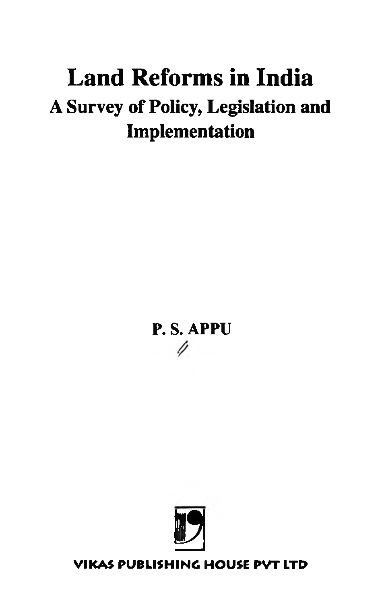

## Land Reforms in India

### A Survey of Policy, Legislation and Implementation

##### P. S. APPU

B

VIKAS PUBLISHINC HOUSE PVT LTD

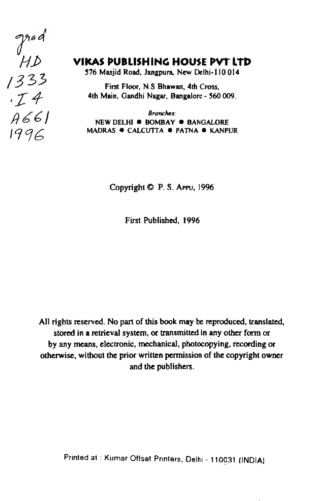

# 7

4

###### HJ> VIKAS PUBLISHING HOUSE PVT LTD

576 Masjid Road, Jangpura, New Delhi-110 014

¡3 33

First Floor, N.S Bhawan, 4th Cross, 4th Main, Gandhi Nagar, Bangalore - 560 009.

• I *

Branches:

ft <o & I

NEW DELHI • BOMBAY • BANGALORE MADRAS • CALCUTTA • PATNA • KANPUR

19*16

Copyright © P. S. Appu, 19%

First Published, 1996

All rights reserved. No part of this book may be reproduced, translated, stored in a retrieval system, or transmitted in any other form or by any means, electronic, mechanical, photocopying, recording or otherwise, without the prior written permission of the copyright owner and the publishers.

Printed at : Kumar Offset Printers, Delhi - 110031 (INDIA)

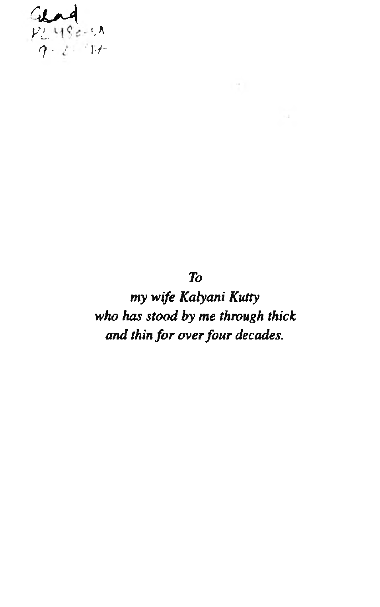

riJL*A

PL ‘- A

q - ■ ■ ■i-y-

To my wife Kalyani Kutty who has stood by me through thick and thin for over four decades.

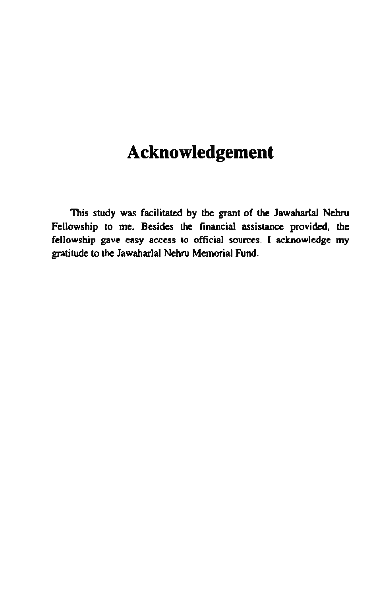

### Acknowledgement

This study was facilitated by the grant of the Jawaharlal Nehru Fellowship to me. Besides the financial assistance provided, the fellowship gave easy access to official sources. I acknowledge my gratitude to the Jawaharlal Nehru Memorial Fund.

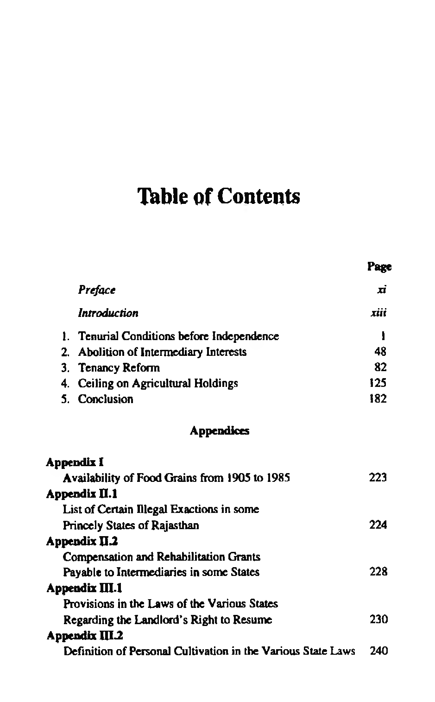

### Table of Contents

###### Page

Preface xi Introduction xiii

- 1. Tenurial Conditions before Independence 1
- 2. Abolition of Intermediary Interests 48
- 3. Tenancy Reform 82
- 4. Ceiling on Agricultural Holdings 125
- 5. Conclusion 182

Appendices

Appendix I

Availability of Food Grains from 1905 to 1985 223

Appendix 11.1 List of Certain Illegal Exactions in some Princely States of Rajasthan 224

Appendix H.2 Compensation and Rehabilitation Grants Payable to Intermediaries in some States 228

Appendix m .1 Provisions in the Laws of the Various States Regarding the Landlord's Right to Resume 230

###### Appendix HI.2

Definition of Personal Cultivation in the Various State Laws 240

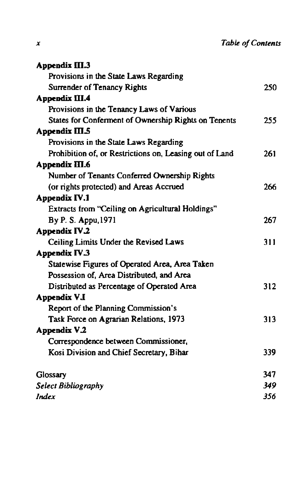

X Table of Contents

Appendix DIJ Provisions in the State Laws Regarding Surrender of Tenancy Rights

250

Appendix OI.4 Provisions in the Tenancy Laws of Various States for Conferment of Ownership Rights on Tenents

255

- Appendix III.5 Provisions in the State Laws Regarding Prohibition of, or Restrictions on, Leasing out of Land
- Appendix III.6 Number of Tenants Conferred Ownership Rights (or rights protected) and Areas Accrued

261

- 266
- 267

Appendix IV.1 Extracts from “Ceiling on Agricultural Holdings” By P. S. Appu,1971

- Appendix IV .2 Ceiling Limits Under the Revised Laws

- Appendix IV 3 Statewise Figures of Operated Area, Area Taken Possession of, Area Distributed, and Area Distributed as Percentage of Operated Area
- Appendix V i Report of the Planning Commission’s Task Force on Agrarian Relations, 1973

- Appendix V.2 Correspondence between Commissioner, Kosi Division and Chief Secretary, Bihar

- 311
- 312
- 313

339

347 349 356

Glossary Select Bibliography

Index

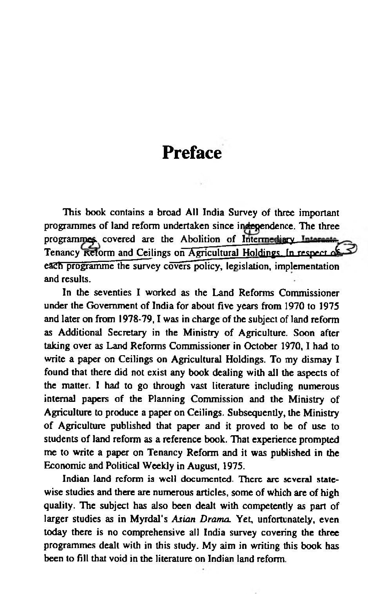

### Preface

This book contains a broad All India Survey of three important programmes of land reform undertaken since independence. The three programme^. covered are the Abolition of Intenr'^iary Tenancy reform and Ceilings on Agricultural Holdings fn rp-spp-rt rk each programme the survey covers policy, legislation, implementation and results.

In the seventies I worked as the Land Reforms Commissioner under the Government of India for about five years from 1970 to 1975 and later on from 1978-79,1 was in charge of the subject of land reform as Additional Secretary in the Ministry of Agriculture. Soon after taking over as Land Reforms Commissioner in October 1970,1 had to write a paper on Ceilings on Agricultural Holdings. To my dismay I found that there did not exist any book dealing with all the aspects of the matter. I had to go through vast literature including numerous internal papers of the Planning Commission and the Ministry of Agriculture to produce a paper on Ceilings. Subsequently, the Ministry of Agriculture published that paper and it proved to be of use to students of land reform as a reference book. That experience prompted me to write a paper on Tenancy Reform and it was published in the Economic and Political Weekly in August, 1975.

Indian land reform is well documented. There are several statewise studies and there are numerous articles, some of which are of high quality. The subject has also been dealt with competently as part of larger studies as in Myrdal’s Asian Drama. Yet, unfortunately, even today there is no comprehensive all India survey covering the three programmes dealt with in this study. My aim in writing this book has been to fill that void in the literature on Indian land reform.

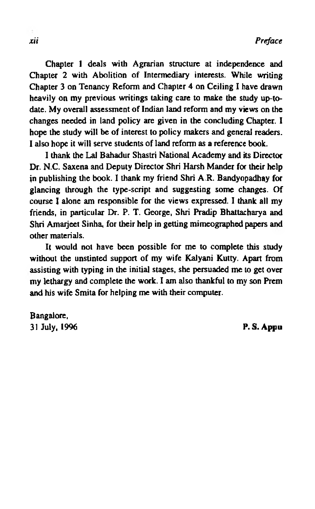

xii Preface

Chapter 1 deals with Agrarian structure at independence and

- Chapter 2 with Abolition of Intermediary interests. While writing
- Chapter 3 on Tenancy Reform and Chapter 4 on Ceiling I have drawn heavily on my previous writings taking care to make the study up-todate. My overall assessment of Indian land reform and my views on the changes needed in land policy are given in the concluding Chapter. I hope the study will be of interest to policy makers and general readers. I also hope it will serve students of land reform as a reference book.

I thank the Lai Bahadur Shastri National Academy and its Director Dr. N.C. Saxena and Deputy Director Shri Harsh Mander for their help in publishing the book. I thank my friend Shri A.R. Bandyopadhay for glancing through the type-script and suggesting some changes. Of course I alone am responsible for the views expressed. I thank all my friends, in particular Dr. P. T. George, Shri Pradip Bhattacharya and Shri Amaijeet Sinha, for their help in getting mimeographed papers and other materials.

It would not have been possible for me to complete this study without the unstinted support of my wife Kalyani Kutty. Apart from assisting with typing in the initial stages, she persuaded me to get over my lethargy and complete the work. I am also thankful to my son Prem and his wife Smita for helping me with their computer.

Bangalore, 31 July, 1996 P. S. Appu

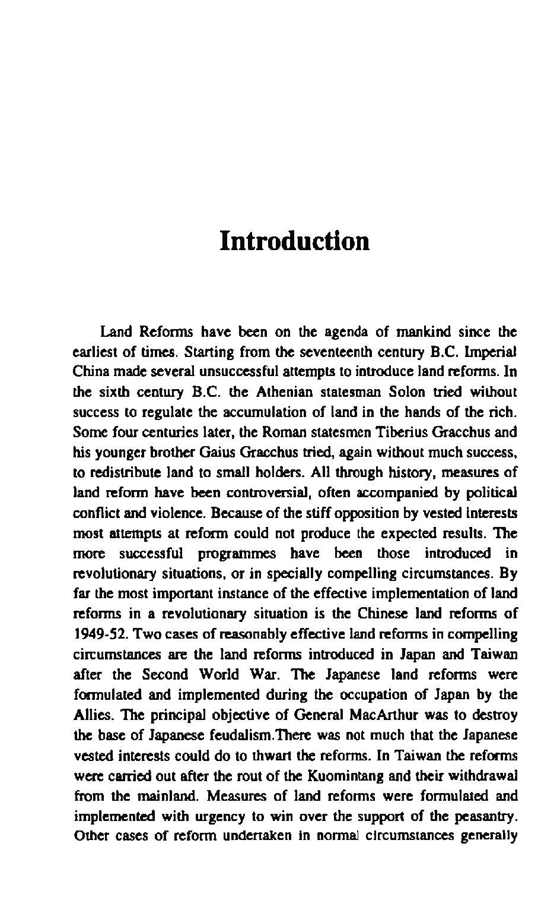

### Introduction

Land Reforms have been on the agenda of mankind since the earliest of times. Starting from the seventeenth century B.C. Imperial China made several unsuccessful attempts to introduce land reforms. In the sixth century B.C. the Athenian statesman Solon tried without success to regulate the accumulation of land in the hands of the rich. Some four centuries later, the Roman statesmen Tiberius Gracchus and his younger brother Gaius Gracchus tried, again without much success, to redistribute land to small holders. All through history, measures of land reform have been controversial, often accompanied by political conflict and violence. Because of the stiff opposition by vested interests most attempts at reform could not produce the expected results. The more successful programmes have been those introduced in revolutionary situations, or in specially compelling circumstances. By far the most important instance of the effective implementation of land reforms in a revolutionary situation is the Chinese land reforms of 1949-52. Two cases of reasonably effective land reforms in compelling circumstances are the land reforms introduced in Japan and Taiwan after the Second World War. The Japanese land reforms were formulated and implemented during the occupation of Japan by the Allies. The principal objective of General Mac Arthur was to destroy the base of Japanese feudalism.There was not much that the Japanese vested interests could do to thwart the reforms. In Taiwan the reforms were carried out after the rout of the Kuomintang and their withdrawal from the mainland. Measures of land reforms were formulated and implemented with urgency to win over the support of the peasantry. Other cases of reform undertaken in norma] circumstances generally

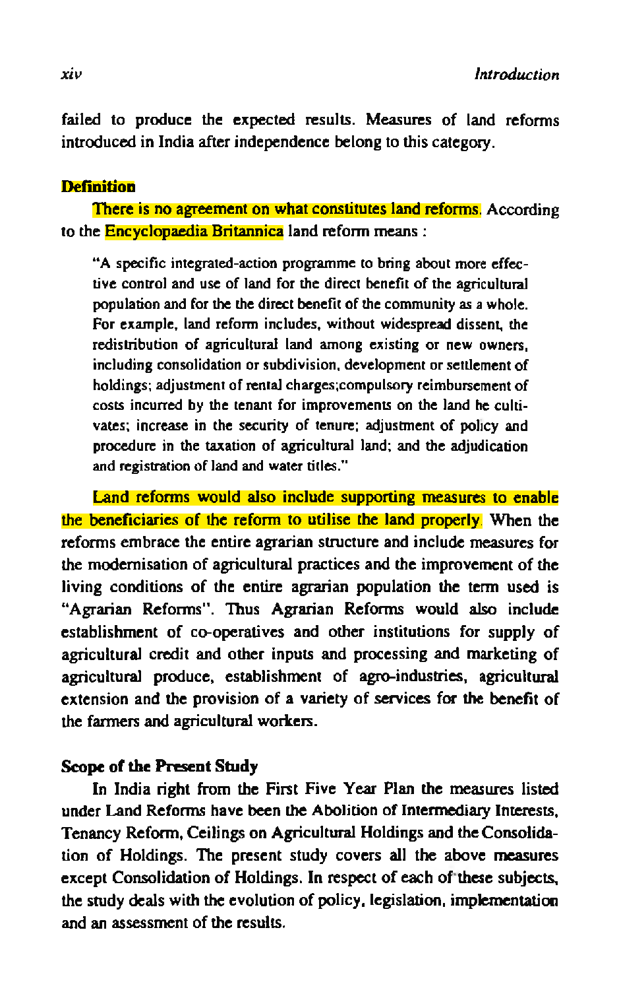

###### xiv Introduction

failed to produce the expected results. Measures of land reforms introduced in India after independence belong to this category.

###### Definition

There is no agreement on what constitutes land reforms. According to the Encyclopaedia Britannica land reform means :

“A specific integrated-action programme to bring about more effective control and use of land for the direct benefit of the agricultural population and for the the direct benefit of the community as a whole. For example, land reform includes, without widespread dissent, the redistribution of agricultural land among existing or new owners, including consolidation or subdivision, development or settlement of holdings; adjustment of rental charges¡compulsory reimbursement of costs incurred by the tenant for improvements on the land he cultivates; increase in the security of tenure; adjustment of policy and procedure in the taxation of agricultural land; and the adjudication and registration of land and water titles.”

Land reforms would also include supporting measures to enable the beneficiaries of the reform to utilise the land properly. When the reforms embrace the entire agrarian structure and include measures for the modernisation of agricultural practices and the improvement of the living conditions of the entire agrarian population the term used is “Agrarian Reforms1*. Thus Agrarian Reforms would also include establishment of co-operatives and other institutions for supply of agricultural credit and other inputs and processing and marketing of agricultural produce, establishment of agro-industries, agricultural extension and the provision of a variety of services for the benefit of the farmers and agricultural workers.

###### Scope of the Present Study

In India right from the First Five Year Plan the measures listed under Land Reforms have been the Abolition of Intermediary Interests, Tenancy Reform, Ceilings on Agricultural Holdings and the Consolidation of Holdings. The present study covers all the above measures except Consolidation of Holdings. In respect of each of these subjects, the study deals with the evolution of policy, legislation, implementation and an assessment of the results.

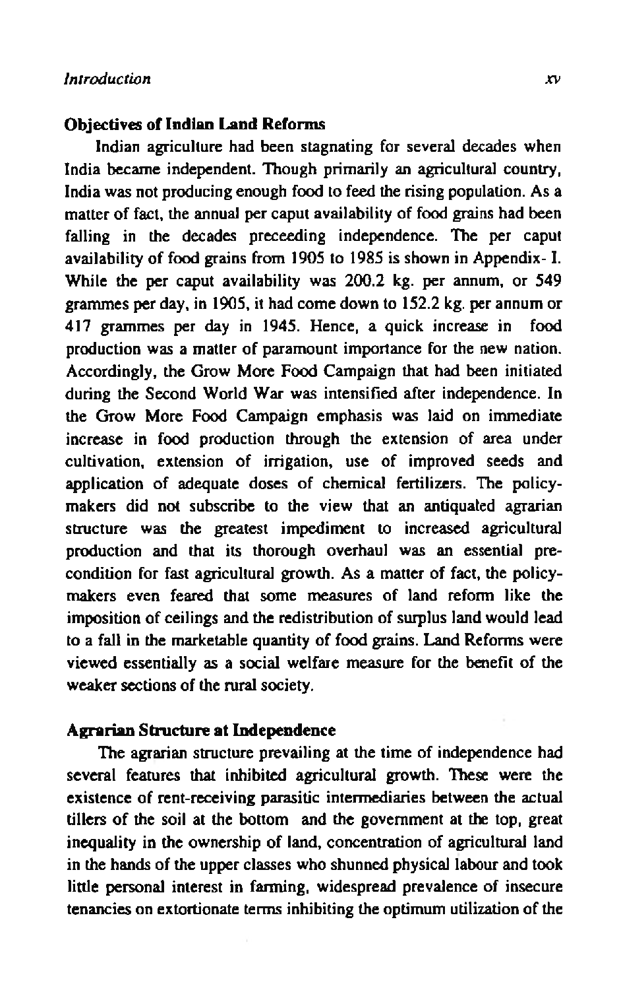

Introduction XV

###### Objectives of Indian Land Reforms

Indian agriculture had been stagnating for several decades when India became independent. Though primarily an agricultural country, India was not producing enough food to feed the rising population. As a matter of fact, the annual per caput availability of food grains had been falling in the decades preceeding independence. The per caput availability of food grains from 1905 to 1985 is shown in Appendix-1. While the per caput availability was 200.2 kg. per annum, or 549 grammes per day, in 1905, it had come down to 152.2 kg. per annum or 417 grammes per day in 1945. Hence, a quick increase in food production was a matter of paramount importance for the new nation. Accordingly, the Grow More Food Campaign that had been initiated during the Second World War was intensified after independence. In the Grow More Food Campaign emphasis was laid on immediate increase in food production through the extension of area under cultivation, extension of irrigation, use of improved seeds and application of adequate doses of chemical fertilizers. The policymakers did not subscribe to the view that an antiquated agrarian structure was the greatest impediment to increased agricultural production and that its thorough overhaul was an essential precondition for fast agricultural growth. As a matter of fact, the policymakers even feared that some measures of land reform like the imposition of ceilings and the redistribution of surplus land would lead to a fall in the marketable quantity of food grains. Land Reforms were viewed essentially as a social welfare measure for the benefit of the weaker sections of the rural society.

###### Agrarian Structure at Independence

The agrarian structure prevailing at the time of independence had several features that inhibited agricultural growth. These were the existence of rent-receiving parasitic intermediaries between the actual tillers of the soil at the bottom and the government at the top, great inequality in the ownership of land, concentration of agricultural land in the hands of the upper classes who shunned physical labour and took little personal interest in farming, widespread prevalence of insecure tenancies on extortionate terms inhibiting the optimum utilization of the

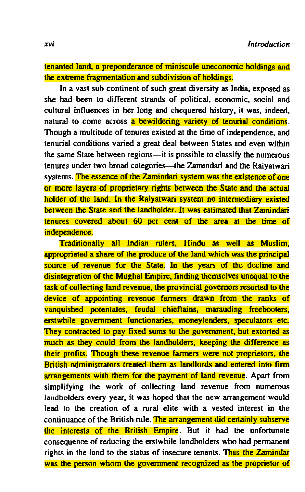

###### xvi Introduction

tenanted land, a preponderance of miniscule uneconomic holdings and the extreme fragmentation and subdivision of holdings.

In a vast sub-continent of such great diversity as India, exposed as she had been to different strands of political, economic, social and cultural influences in her long and chequered history, it was, indeed, natural to come across a bewildering variety of tenurial conditions. Though a multitude of tenures existed at the time of independence, and tenurial conditions varied a great deal between States and even within the same State between regions—it is possible to classify the numerous tenures under two broad categories—the Zamindari and the Raiyatwari systems. The essence of the Zamindari system was the existence of one or more layers of proprietary rights between the State and the actual holder of the land. In the Raiyatwari system no intermediary existed between the State and the landholder. It was estimated that Zamindari tenures covered about 60 per cent of the area at the time of independence.

Traditionally all Indian rulers, Hindu as well as Muslim, appropriated a share of the produce of the land which was the principal source of revenue for the State. In the years of the decline and disintegration of the Mughal Empire, finding themselves unequal to the task of collecting land revenue, the provincial governors resorted to the device of appointing revenue farmers drawn from the ranks of vanquished potentates, feudal chieftains, marauding freebooters, erstwhile government functionaries, moneylenders, speculators etc. They contracted to pay fixed sums to the government, but extorted as much as they could from the landholders, keeping the difference as their profits. Though these revenue farmers were not proprietors, the British administrators treated them as landlords and entered into firm arrangements with them for the payment of land revenue. Apart from simplifying the work of collecting land revenue from numerous landholders every year, it was hoped that the new arrangement would lead to the creation of a rural elite with a vested interest in the continuance of the British rule. The arrangement did certainly subserve the interests of the British Empire. But it had the unfortunate consequence of reducing the erstwhile landholders who had permanent rights in the land to the status of insecure tenants. Thus the Zamindar was the person whom the government recognized as the proprietor of

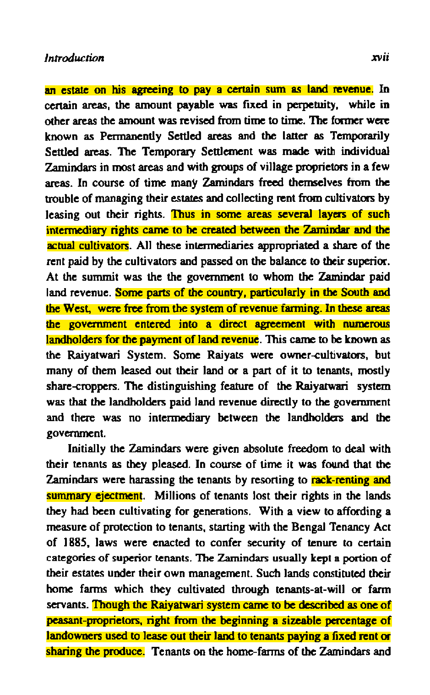

Introduction xv ii

an estate on his agreeing to pay a certain sum as land revenue. In certain areas, the amount payable was fixed in perpetuity, while in other areas the amount was revised from time to time. The former were known as Permanently Settled areas and the latter as Temporarily Settled areas. The Temporary Settlement was made with individual Zamindars in most areas and with groups of village proprietors in a few areas. In course of time many Zamindars freed themselves from the trouble of managing their estates and collecting rent from cultivators by leasing out their rights. Thus in some areas several layers of such intermediary rights came to be created between the Zamindar and the actual cultivators. All these intermediaries appropriated a share of the rent paid by the cultivators and passed on the balance to their superior. At the summit was the the government to whom the Zamindar paid land revenue. Some parts of the country, particularly in the South and the West, were free from the system of revenue farming. In these areas the government entered into a direct agreement with numerous landholders for the payment of land revenue. This came to be known as the Raiyatwari System. Some Raiyats were owner-cultivators, but many of them leased out their land or a part of it to tenants, mostly share-croppers. The distinguishing feature of the Raiyatwari system was that the landholders paid land revenue directly to the government and there was no intermediary between the landholders and the government.

Initially the Zamindars were given absolute freedom to deal with their tenants as they pleased. In course of time it was found that the Zamindars were harassing the tenants by resorting to rack-renting and summary ejectment. Millions of tenants lost their rights in the lands they had been cultivating for generations. With a view to affording a measure of protection to tenants, starting with the Bengal Tenancy Act of 1885, laws were enacted to confer security of tenure to certain categories of superior tenants. The Zamindars usually kept a portion of their estates under their own management. Such lands constituted their home farms which they cultivated through tenants-at-will or farm servants. Though the Raiyatwari system came to be described as one of peasant-proprietors, right from the beginning a sizeable percentage of landowners used to lease out their land to tenants paying a fixed rent or sharing the produce. Tenants on the home-farms of the Zamindars and

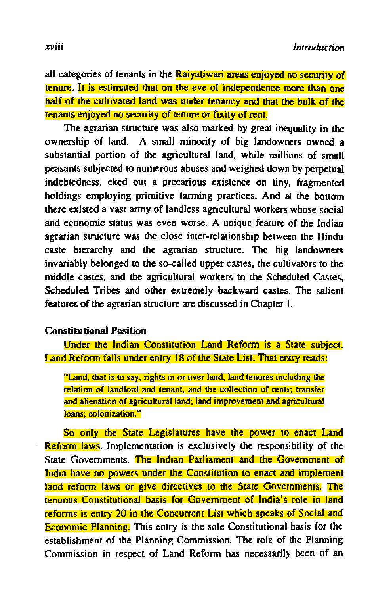

###### xviii Introduction

all categories of tenants in the Raiyatiwari areas enjoyed no security of tenure. It is estimated that on the eve of independence more than one half of the cultivated land was under tenancy and that the bulk of the tenants enjoyed no security of tenure or fixity of rent.

The agrarian structure was also marked by great inequality in the ownership of land. A small minority of big landowners owned a substantial portion of the agricultural land, while millions of small peasants subjected to numerous abuses and weighed down by perpetual indebtedness, eked out a precarious existence on tiny, fragmented holdings employing primitive farming practices. And at the bottom there existed a vast army of landless agricultural workers whose social and economic status was even worse. A unique feature of the Indian agrarian structure was the close inter-relationship between the Hindu caste hierarchy and the agrarian structure. The big landowners invariably belonged to the so-called upper castes, the cultivators to the middle castes, and the agricultural workers to the Scheduled Castes, Scheduled Tribes and other extremely backward castes. The salient features of the agrarian structure are discussed in Chapter I.

###### Constitutional Position

Under the Indian Constitution Land Reform is a State subject. Land Reform falls under entry 18 of the State List. That entry reads:

“Land, that is to say, rights in or over land, land tenures including the relation of landlord and tenant, and the collection of rents; transfer and alienation of agricultural land; land improvement and agricultural loans; colonization.”

So only the State Legislatures have the power to enact Land Reform laws. Implementation is exclusively the responsibility of the State Governments. The Indian Parliament and the Government of India have no powers under the Constitution to enact and implement land reform laws or give directives to the State Governments. The tenuous Constitutional basis for Government of India’s role in land reforms is entry 20 in the Concurrent List which speaks of Social and Economic Planning. This entry is the sole Constitutional basis for the establishment of the Planning Commission. The role of the Planning Commission in respect of Land Reform has necessarily been of an

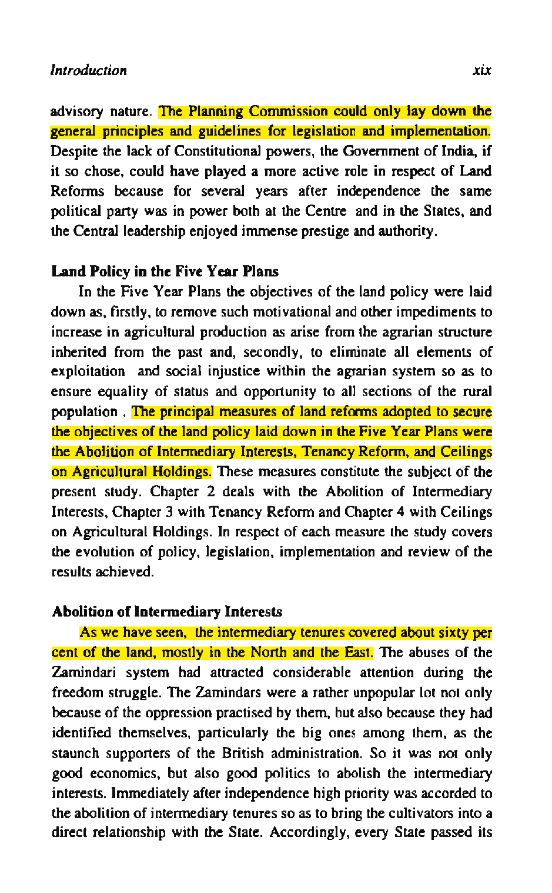

Introduction xix

advisory nature. The Planning Commission could only lay down the general principles and guidelines for legislation and implementation. Despite the lack of Constitutional powers, the Government of India, if it so chose, could have played a more active role in respect of Land Reforms because for several years after independence the same political party was in power both at the Centre and in the States, and the Central leadership enjoyed immense prestige and authority.

###### Land Policy in the Five Year Plans

In the Five Year Plans the objectives of the land policy were laid down as, firstly, to remove such motivational and other impediments to increase in agricultural production as arise from the agrarian structure inherited from the past and, secondly, to eliminate all elements of exploitation and social injustice within the agrarian system so as to ensure equality of status and opportunity to all sections of the rural population . The principal measures of land reforms adopted to secure the objectives of the land policy laid down in the Five Year Plans were the Abolition of Intermediary Interests, Tenancy Reform, and Ceilings on Agricultural Holdings. These measures constitute the subject of the present study. Chapter 2 deals with the Abolition of Intermediary Interests, Chapter 3 with Tenancy Reform and Chapter 4 with Ceilings on Agricultural Holdings. In respect of each measure the study covers the evolution of policy, legislation, implementation and review of the results achieved.

###### Abolition of Intermediary Interests

As we have seen, the intermediary tenures covered about sixty per cent of the land, mostly in the North and the East. The abuses of the Zamindari system had attracted considerable attention during the freedom struggle. The Zamindars were a rather unpopular lot not only because of the oppression practised by them, but also because they had identified themselves, particularly the big ones among them, as the staunch supporters of the British administration. So it was not only good economics, but also good politics to abolish the intermediary interests. Immediately after independence high priority was accorded to the abolition of intermediary tenures so as to bring the cultivators into a direct relationship with the State. Accordingly, every State passed its

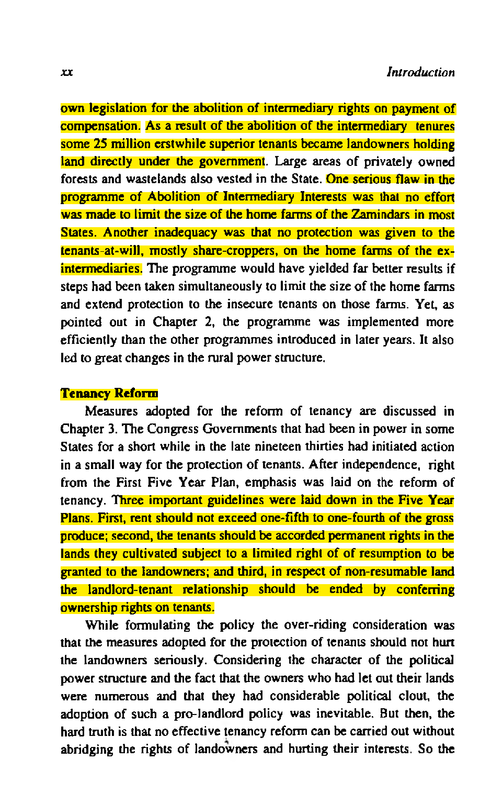

XX Introduction

own legislation for the abolition of intermediary rights on payment of compensation. As a result of the abolition of the intermediary tenures some 25 million erstwhile superior tenants became landowners holding land directly under the government. Large areas of privately owned forests and wastelands also vested in the State. One serious flaw in the programme of Abolition of Intermediary Interests was that no effort was made to limit the size of the home farms of the Zamindars in most States. Another inadequacy was that no protection was given to the tenants-at-will, mostly share-croppers, on the home farms of the exintermediaries. The programme would have yielded far better results if steps had been taken simultaneously to limit the size of the home farms and extend protection to the insecure tenants on those farms. Yet, as pointed out in Chapter 2, the programme was implemented more efficiently than the other programmes introduced in later years. It also led to great changes in the rural power structure.

###### Tenancy Reform

Measures adopted for the reform of tenancy are discussed in Chapter 3. The Congress Governments that had been in power in some States for a short while in the late nineteen thirties had initiated action in a small way for the protection of tenants. After independence, right from the First Five Year Plan, emphasis was laid on the reform of tenancy. Three important guidelines were laid down in the Five Year Plans. First, rent should not exceed one-fifth to one-fourth of the gross produce; second, the tenants should be accorded permanent rights in the lands they cultivated subject to a limited right of of resumption to be granted to the landowners; and third, in respect of non-resumable land the landlord-tenant relationship should be ended by conferring ownership rights on tenants.

While formulating the policy the over-riding consideration was that the measures adopted for the protection of tenants should not hurt the landowners seriously. Considering the character of the political power structure and the fact that the owners who had let out their lands were numerous and that they had considerable political clout, the adoption of such a pro-landlord policy was inevitable. But then, the hard truth is that no effective tenancy reform can be carried out without abridging the rights of landowners and hurting their interests. So the

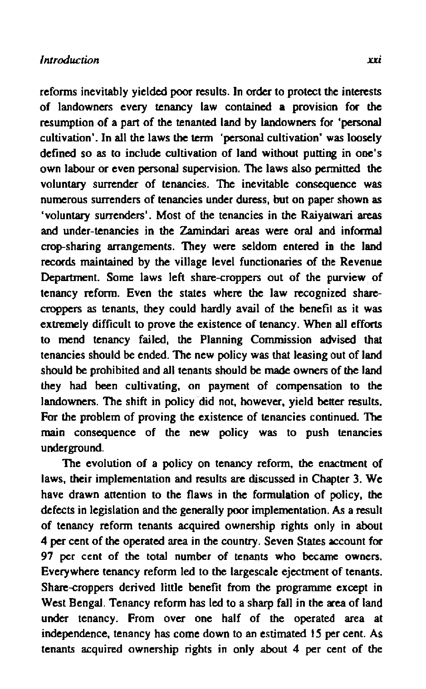

Introduction xxi

reforms inevitably yielded poor results. In order to protect the interests of landowners every tenancy law contained a provision for the resumption of a part of the tenanted land by landowners for ‘personal cultivation*. In all the laws the term ‘personal cultivation* was loosely defined so as to include cultivation of land without putting in one’s own labour or even personal supervision. The laws also permitted the voluntary surrender of tenancies. The inevitable consequence was numerous surrenders of tenancies under duress, but on paper shown as Voluntary surrenders’. Most of the tenancies in the Raiyalwari areas and under-tenancies in the Zamindari areas were oral and informal crop-sharing arrangements. They were seldom entered in the land records maintained by the village level functionaries of the Revenue Department. Some laws left share-croppers out of the purview of tenancy reform. Even the states where the law recognized sharecroppers as tenants, they could hardly avail of the benefit as it was extremely difficult to prove the existence of tenancy. When all efforts to mend tenancy failed, the Planning Commission advised that tenancies should be ended. The new policy was that leasing out of land should be prohibited and all tenants should be made owners of the land they had been cultivating, on payment of compensation to the landowners. The shift in policy did not, however, yield better results. For the problem of proving the existence of tenancies continued. The main consequence of the new policy was to push tenancies underground.

The evolution of a policy on tenancy reform, the enactment of laws, their implementation and results are discussed in Chapter 3. We have drawn attention to the flaws in the formulation of policy, the defects in legislation and the generally poor implementation. As a result of tenancy reform tenants acquired ownership rights only in about

- 4 per cent of the operated area in the country. Seven States account for 97 per cent of the total number of tenants who became owners. Everywhere tenancy reform led to the largescale ejectment of tenants. Share-croppers derived little benefit from the programme except in West Bengal. Tenancy reform has led to a sharp fall in the area of land under tenancy. From over one half of the operated area at independence, tenancy has come down to an estimated 15 per cent. As tenants acquired ownership rights in only about 4 per cent of the

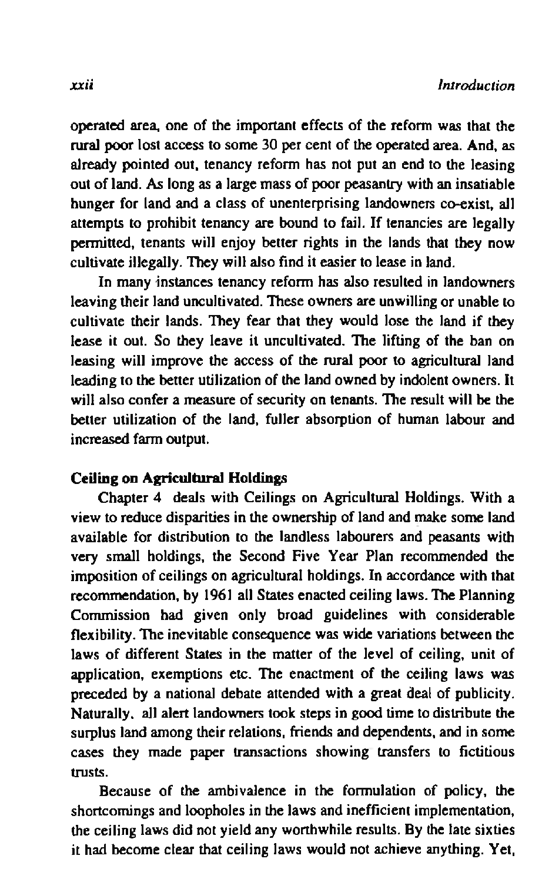

xxii Introduction

operated area, one of the important effects of the reform was that the rural poor lost access to some 30 per cent of the operated area. And, as already pointed out, tenancy reform has not put an end to the leasing out of land. As long as a large mass of poor peasantry with an insatiable hunger for land and a class of unenterprising landowners co-exist, all attempts to prohibit tenancy are bound to fail. If tenancies are legally permitted, tenants will enjoy better rights in the lands that they now cultivate illegally. They will also find it easier to lease in land.

In many instances tenancy reform has also resulted in landowners leaving their land uncultivated. These owners are unwilling or unable to cultivate their lands. They fear that they would lose the land if they lease it out. So they leave it uncultivated. The lifting of the ban on leasing will improve the access of the rural poor to agricultural land leading to the better utilization of the land owned by indolent owners. It will also confer a measure of security on tenants. The result will be the better utilization of the land, fuller absorption of human labour and increased farm output.

###### Ceiling on Agricultural Holdings

Chapter 4 deals with Ceilings on Agricultural Holdings. With a view to reduce disparities in the ownership of land and make some land available for distribution to the landless labourers and peasants with very small holdings, the Second Five Year Plan recommended the imposition of ceilings on agricultural holdings. In accordance with that recommendation, by 1961 all States enacted ceiling laws. The Planning Commission had given only broad guidelines with considerable flexibility. The inevitable consequence was wide variations between the laws of different States in the matter of the level of ceiling, unit of application, exemptions etc. The enactment of the ceiling laws was preceded by a national debate attended with a great deal of publicity. Naturally, all alert landowners took steps in good time to distribute the surplus land among their relations, friends and dependents, and in some cases they made paper transactions showing transfers to fictitious trusts.

Because of the ambivalence in the formulation of policy, the shortcomings and loopholes in the laws and inefficient implementation, the ceiling laws did not yield any worthwhile results. By the late sixties it had become clear that ceiling laws would not achieve anything. Yet,

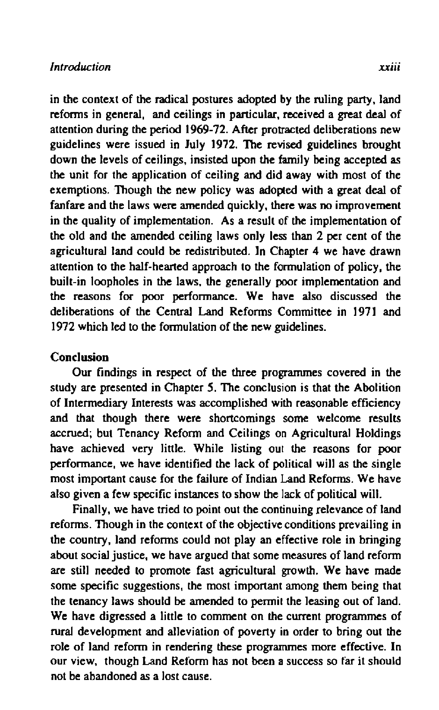

Introduction xxiii

in the context of the radical postures adopted by the ruling party, land reforms in general, and ceilings in particular, received a great deal of attention during the period 1969-72. After protracted deliberations new guidelines were issued in July 1972. The revised guidelines brought down the levels of ceilings, insisted upon the family being accepted as the unit for the application of ceiling and did away with most of the exemptions. Though the new policy was adopted with a great deal of fanfare and the laws were amended quickly, there was no improvement in the quality of implementation. As a result of the implementation of the old and the amended ceiling laws only less than 2 per cent of the agricultural land could be redistributed. In Chapter 4 we have drawn attention to the half-hearted approach to the formulation of policy, the built-in loopholes in the laws, the generally poor implementation and the reasons for poor performance. We have also discussed the deliberations of the Central Land Reforms Committee in 1971 and 1972 which led to the formulation of the new guidelines.

###### Conclusion

Our findings in respect of the three programmes covered in the study are presented in Chapter 5. The conclusion is that the Abolition of Intermediary Interests was accomplished with reasonable efficiency and that though there were shortcomings some welcome results accrued; but Tenancy Reform and Ceilings on Agricultural Holdings have achieved very little. While listing out the reasons for poor performance, we have identified the lack of political will as the single most important cause for the failure of Indian Land Reforms. We have also given a few specific instances to show the lack of political will.

Finally, we have tried to point out the continuing relevance of land reforms. Though in the context of the objective conditions prevailing in the country, land reforms could not play an effective role in bringing about social justice, we have argued that some measures of land reform are still needed to promote fast agricultural growth. We have made some specific suggestions, the most important among them being that the tenancy laws should be amended to permit the leasing out of land. We have digressed a little to comment on the current programmes of rural development and alleviation of poverty in order to bring out the role of land reform in rendering these programmes more effective. In our view, though Land Reform has not been a success so far it should not be abandoned as a lost cause.

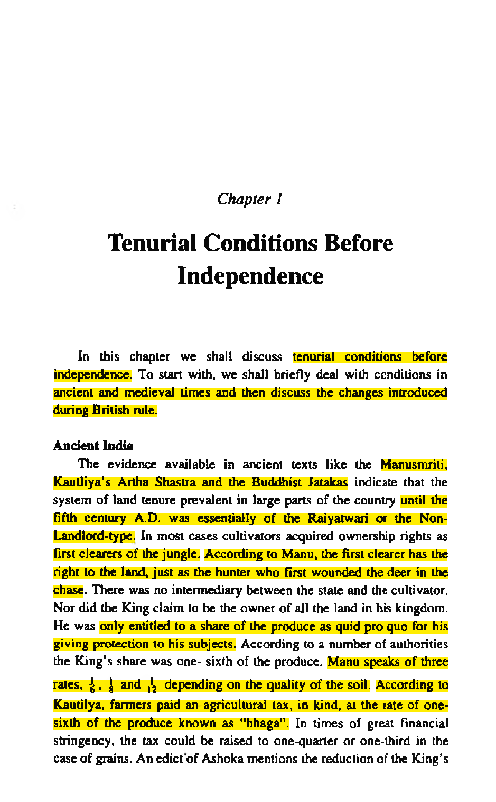

Chapter 1

### Tenurial Conditions Before Independence

In this chapter we shall discuss tenurial conditions before independence. To start with, we shall briefly deal with conditions in ancient and medieval times and then discuss the changes introduced during British rule.

###### Ancient India

The evidence available in ancient texts like the Manusmriti, Kautliya’s Artha Shastra and the Buddhist Jatakas indicate that the system of land tenure prevalent in large parts of the country until the fifth century A.D. was essentially of the Raiyatwari or the NonLandlord-type. In most cases cultivators acquired ownership rights as first clearers of the jungle. According to Manu, the first clearer has the right to the land, just as the hunter who first wounded the deer in the chase. There was no intermediary between the state and the cultivator. Nor did the King claim to be the owner of all the land in his kingdom. He was only entitled to a share of the produce as quid pro quo for his giving protection to his subjects. According to a number of authorities the King’s share was one- sixth of the produce. Manu speaks of three rates, £, J and ,l2 depending on the quality of the soil. According to Kautilya, farmers paid an agricultural tax, in kind, at the rate of onesixth of the produce known as “bhaga”. In times of great financial stringency, the tax could be raised to one-quarter or one-third in the case of grains. An edict of Ashoka mentions the reduction of the King’s

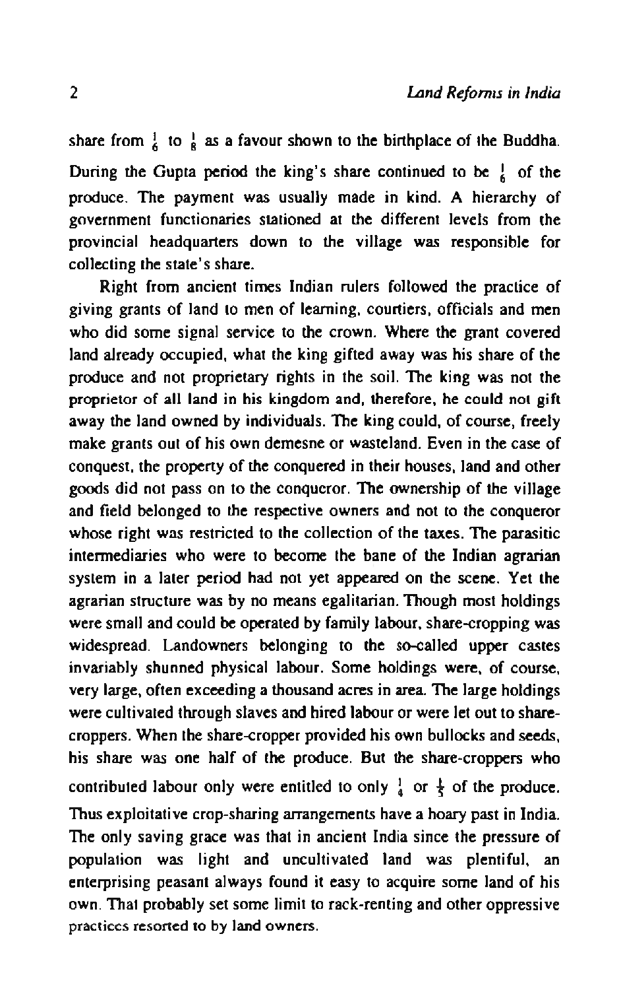

###### 2 Land Reforms in India

share from £ to ^ as a favour shown to the birthplace of the Buddha. During the Gupta period the king’s share continued to be J of the produce. The payment was usually made in kind. A hierarchy of government functionaries stationed at the different levels from the provincial headquarters down to the village was responsible for collecting the state’s share.

Right from ancient times Indian rulers followed the practice of giving grants of land to men of learning, courtiers, officials and men who did some signal service to the crown. Where the grant covered land already occupied, what the king gifted away was his share of the produce and not proprietary rights in the soil. The king was not the proprietor of all land in his kingdom and, therefore, he could not gift away the land owned by individuals. The king could, of course, freely make grants out of his own demesne or wasteland. Even in the case of conquest, the property of the conquered in their houses, land and other goods did not pass on to the conqucror. The ownership of the village and field belonged to the respective owners and not to the conqueror whose right was restricted to the collection of the taxes. The parasitic intermediaries who were to become the bane of the Indian agrarian system in a later period had not yet appeared on the scene. Yet the agrarian structure was by no means egalitarian. Though most holdings were small and could be operated by family labour, share-cropping was widespread. Landowners belonging to the so-called upper castes invariably shunned physical labour. Some holdings were, of course, very large, often exceeding a thousand acres in area. The large holdings were cultivated through slaves and hired labour or were let out to sharecroppers. When the share-cropper provided his own bullocks and seeds, his share was one half of the produce. But the share-croppers who contributed labour only were entitled to only \ or \ of the produce. Thus exploitative crop-sharing arrangements have a hoary past in India. The only saving grace was that in ancient India since the pressure of population was light and uncultivated land was plentiful, an enterprising peasant always found it easy to acquire some land of his own. That probably set some limit to rack-renting and other oppressive practiccs resorted to by land owners.

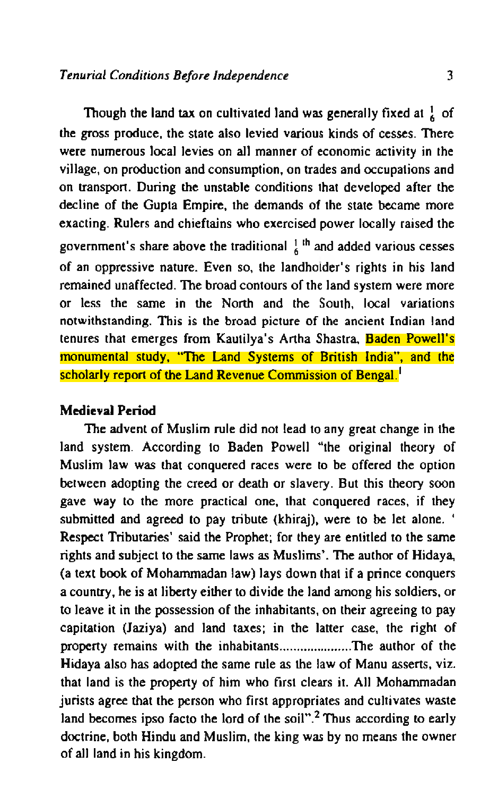

###### Tenurial Conditions Before Independence 3

Though the land tax on cultivated land was generally fixed at ]b of the gross produce, the state also levied various kinds of cesses. There were numerous local levies on all manner of economic activity in the village, on production and consumption, on trades and occupations and on transport. During the unstable conditions that developed after the decline of the Gupta Empire, the demands of the state became more exacting. Rulers and chieftains who exercised power locally raised the government’s share above the traditional ]6 thand added various cesses of an oppressive nature. Even so, the landholder’s rights in his land remained unaffected. The broad contours of the land system were more or less the same in the North and the South, local variations notwithstanding. This is the broad picture of the ancient Indian land tenures that emerges from Kautilya’s Artha Shastra, Baden Powell’s monumental study, “The Land Systems of British India”, and the scholarly report of the Land Revenue Commission of Bengal.1

###### Medieval Period

The advent of Muslim rule did not lead to any great change in the land system. According to Baden Powell “the original theory of Muslim law was that conquered races were to be offered the option between adopting the creed or death or slavery. But this theory soon gave way to the more practical one, that conquered races, if they submitted and agreed to pay tribute (khiraj), were to be let alone. ‘ Respect Tributaries’ said the Prophet; for they are entitled to the same rights and subject to the same laws as Muslims’. The author of Hidaya, (a text book of Mohammadan law) lays down that if a prince conquers a country, he is at liberty either to divide the land among his soldiers, or to leave it in the possession of the inhabitants, on their agreeing to pay capitation (Jaziya) and land taxes; in the latter case, the right of property remains with the inhabitants.....................The author of the Hidaya also has adopted the same rule as the law of Manu asserts, viz. that land is the property of him who first clears it. All Mohammadan jurists agree that the person who first appropriates and cultivates waste land becomes ipso facto the lord of the soil”.2 Thus according to early doctrine, both Hindu and Muslim, the king was by no means the owner of all land in his kingdom.

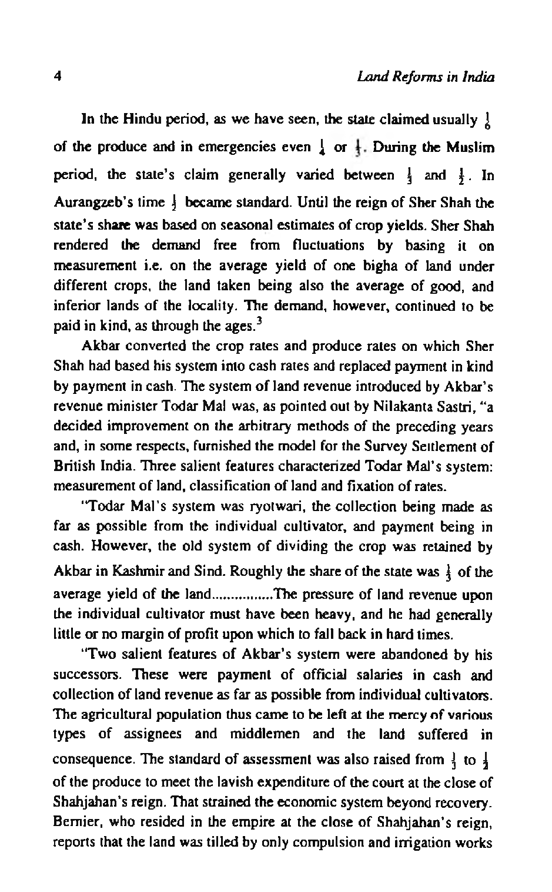

###### 4 Land Reforms in India

In the Hindu period, as we have seen, the state claimed usually £ of the produce and in emergencies even [ or During the Muslim period, the state’s claim generally varied between \ and £. In Aurangzeb’s time \ became standard. Until the reign of Sher Shah the state’s share was based on seasonal estimates of crop yields. Sher Shah rendered the demand free from fluctuations by basing it on measurement i.e. on the average yield of one bigha of land under different crops, the land taken being also the average of good, and inferior lands of the locality. The demand, however, continued to be paid in kind, as through the ages.3

Akbar converted the crop rates and produce rates on which Sher Shah had based his system into cash rates and replaced payment in kind by payment in cash. The system of land revenue introduced by Akbar’s revenue minister Todar Mai was, as pointed out by Nilakanta Sastri, “a decided improvement on the arbitrary methods of the preceding years and, in some respects, furnished the model for the Survey Settlement of British India. Three salient features characterized Todar Mai’s system: measurement of land, classification of land and fixation of rates.

‘Todar Mai’s system was ryotwari, the collection being made as far as possible from the individual cultivator, and payment being in cash. However, the old system of dividing the crop was retained by Akbar in Kashmir and Sind. Roughly the share of the state was \ of the average yield of the land................The pressure of land revenue upon the individual cultivator must have been heavy, and he had generally little or no margin of profit upon which to fall back in hard times.

“Two salient features of Akbar’s system were abandoned by his successors. These were payment of official salaries in cash and collection of land revenue as far as possible from individual cultivators. The agricultural population thus came to be left at the mercy of various types of assignees and middlemen and the land suffered in consequence. The standard of assessment was also raised from \ to \

of the produce to meet the lavish expenditure of the court at the close of Shahjahan’s reign. That strained the economic system beyond recovery. Bernier, who resided in the empire at the close of Shahjahan’s reign, reports that the land was tilled by only compulsion and irrigation works

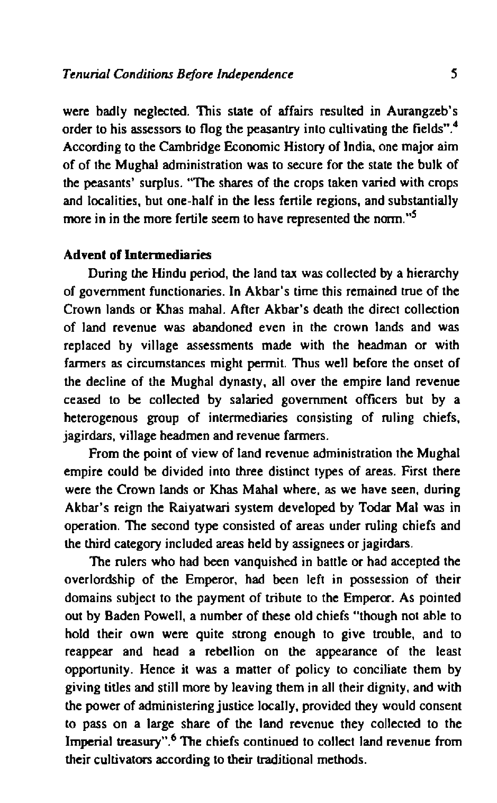

###### Tenurial Conditions Before Independence 5

were badly neglected. This state of affairs resulted in Aurangzeb’s order to his assessors to flog the peasantry into cultivating the fields”.4 According to the Cambridge Economic History of India, one major aim of of the Mughal administration was to secure for the state the bulk of the peasants’ surplus. “The shares of the crops taken varied with crops and localities, but one-half in the less fertile regions, and substantially more in in the more fertile seem to have represented the norm.”5

###### Advent of Intermediaries

During the Hindu period, the land tax was collected by a hierarchy of government functionaries. In Akbar’s time this remained true of the Crown lands or Khas mahal. After Akbar’s death the direct collection of land revenue was abandoned even in the crown lands and was replaced by village assessments made with the headman or with farmers as circumstances might permit. Thus well before the onset of the decline of the Mughal dynasty, all over the empire land revenue ceased to be collected by salaried government officers but by a heterogenous group of intermediaries consisting of ruling chiefs, jagirdars, village headmen and revenue farmers.

From the point of view of land revenue administration the Mughal empire could be divided into three distinct types of areas. First there were the Crown lands or Khas Mahal where, as we have seen, during Akbar’s reign the Raiyatwari system developed by Todar Mai was in operation. The second type consisted of areas under ruling chiefs and the third category included areas held by assignees or jagirdars.

The rulers who had been vanquished in battle or had accepted the overlordship of the Emperor, had been left in possession of their domains subject to the payment of tribute to the Emperor. As pointed out by Baden Powell, a number of these old chiefs “though not able to hold their own were quite strong enough to give trouble, and to reappear and head a rebellion on the appearance of the least opportunity. Hence it was a matter of policy to conciliate them by giving titles and still more by leaving them in all their dignity, and with the power of administering justice locally, provided they would consent to pass on a large share of the land revenue they collected to the Imperial treasury”.6 The chiefs continued to collect land revenue from their cultivators according to their traditional methods.

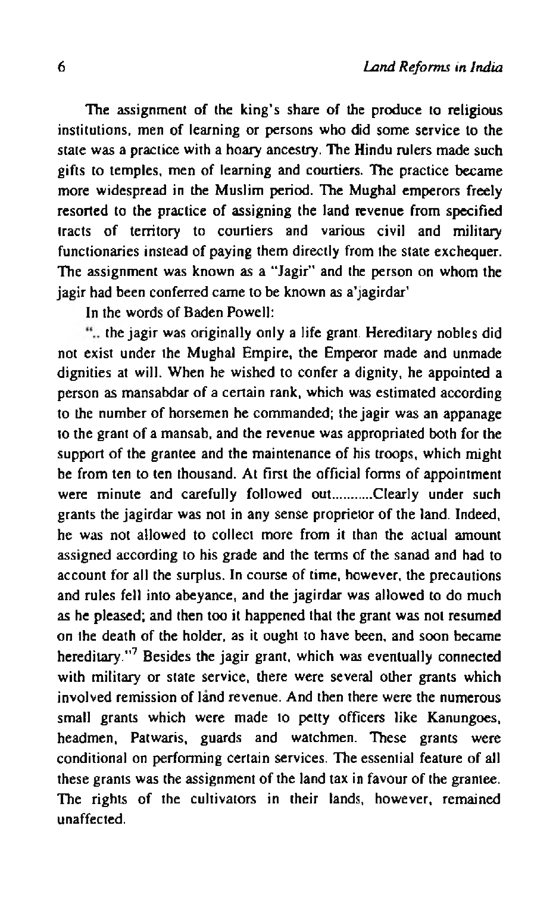

###### 6 Land Reforms in India

The assignment of the king’s share of the produce to religious institutions, men of learning or persons who did some service to the state was a practice with a hoary ancestry. The Hindu rulers made such gifts to temples, men of learning and courtiers. The practice became more widespread in the Muslim period. The Mughal emperors freely resorted to the practice of assigning the land revenue from specified tracts of territory to courtiers and various civil and military functionaries instead of paying them directly from the state exchequer. The assignment was known as a “Jagir” and the person on whom the jagir had been conferred came to be known as a’jagirdar’

In the words of Baden Powell:

the jagir was originally only a life grant. Hereditary nobles did not exist under the Mughal Empire, the Emperor made and unmade dignities at will. When he wished to confer a dignity, he appointed a person as mansabdar of a certain rank, which was estimated according to the number of horsemen he commanded; the jagir was an appanage to the grant of a mansab, and the revenue was appropriated both for the support of the grantee and the maintenance of his troops, which might be from ten to ten thousand. At first the official forms of appointment were minute and carefully followed out..........Clearly under such grants the jagirdar was not in any sense proprietor of the land. Indeed, he was not allowed to collect more from it than the actual amount assigned according to his grade and the terms of the sanad and had to account for all the surplus. In course of time, however, the precautions and rules fell into abeyance, and the jagirdar was allowed to do much as he pleased; and then too it happened that the grant was not resumed on the death of the holder, as it ought to have been, and soon became hereditary.”7 Besides the jagir grant, which was eventually connected with military or state service, there were several other grants which involved remission of land revenue. And then there were the numerous small grants which were made to petty officers like Kanungoes, headmen, Patwaris, guards and watchmen. These grants were conditional on performing certain services. The essential feature of all these grants was the assignment of the land tax in favour of the grantee. The rights of the cultivators in their lands, however, remained unaffected.

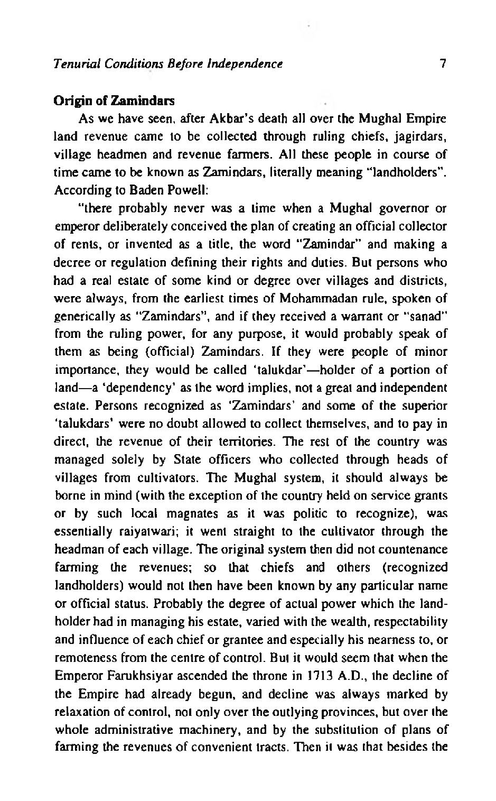

###### Tenurial Conditions Before Independence 7

###### Origin of Zamindars

As we have seen, after Akbar’s death all over the Mughal Empire land revenue came to be collected through ruling chiefs, jagirdars, village headmen and revenue farmers. All these people in course of time came to be known as Zamindars, literally meaning “landholders”. According to Baden Powell:

“there probably never was a time when a Mughal governor or emperor deliberately conceived the plan of creating an official collector of rents, or invented as a title, the word “Zamindar” and making a decree or regulation defining their rights and duties. But persons who had a real estate of some kind or degree over villages and districts, were always, from the earliest times of Mohammadan rule, spoken of generically as “Zamindars”, and if they received a warrant or “sanad” from the ruling power, for any purpose, it would probably speak of them as being (official) Zamindars. If they were people of minor importance, they would be called ‘talukdar’—holder of a portion of land—a ‘dependency’ as the word implies, not a great and independent estate. Persons recognized as ‘Zamindars’ and some of the superior ‘talukdars’ were no doubt allowed to collect themselves, and to pay in direct, the revenue of their territories. The rest of the country was managed solely by State officers who collected through heads of villages from cultivators. The Mughal system, it should always be borne in mind (with the exception of the country held on service grants or by such local magnates as it was politic to recognize), was essentially raiyatwari; it went straight to the cultivator through the headman of each village. The original system then did not countenance farming the revenues; so that chiefs and others (recognized landholders) would not then have been known by any particular name or official status. Probably the degree of actual power which the landholder had in managing his estate, varied with the wealth, respectability and influence of each chief or grantee and especially his nearness to, or remoteness from the centre of control. But it would seem that when the Emperor Farukhsiyar ascended the throne in 1713 A.D., the decline of the Empire had already begun, and decline was always marked by relaxation of control, not only over the outlying provinces, but over the whole administrative machinery, and by the substitution of plans of farming the revenues of convenient tracts. Then it was that besides the

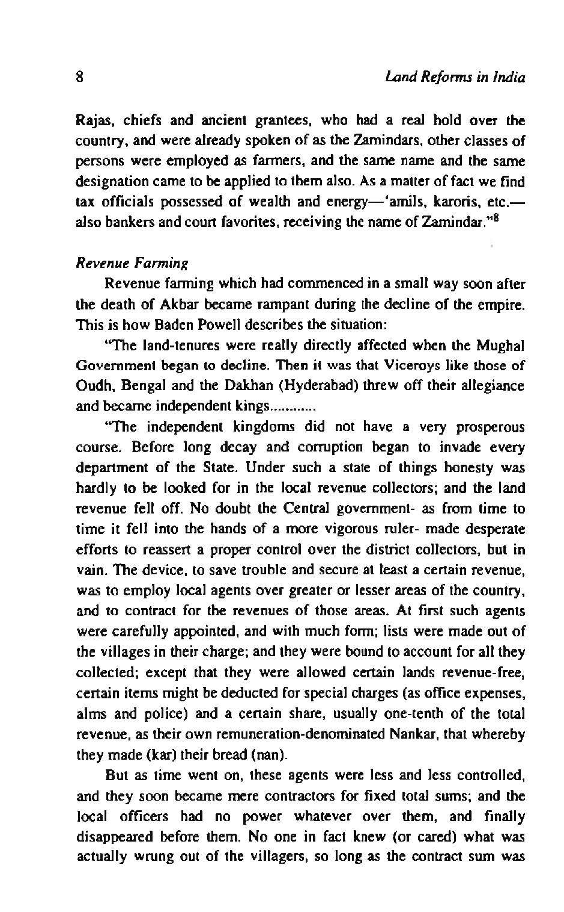

###### 8 Land Reforms in India

Rajas, chiefs and ancient grantees, who had a real hold over the country, and were already spoken of as the Zamindars, other classes of persons were employed as farmers, and the same name and the same designation came to be applied to them also. As a matter of fact we find tax officials possessed of wealth and energy—‘amils, karoris, etc.also bankers and court favorites, receiving the name of Zamindar.”8

Revenue Farming

Revenue fanning which had commenced in a small way soon after the death of Akbar became rampant during the decline of the empire. This is how Baden Powell describes the situation:

“The land-tenures were really directly affected when the Mughal Government began to decline. Then it was that Viceroys like those of Oudh, Bengal and the Dakhan (Hyderabad) threw off their allegiance and became independent kings............

“The independent kingdoms did not have a very prosperous course. Before long decay and corruption began to invade every department of the State. Under such a state of things honesty was hardly to be looked for in the local revenue collectors; and the land revenue fell off. No doubt the Central government- as from time to time it fell into the hands of a more vigorous ruler- made desperate efforts to reassert a proper control over the district collectors, but in vain. The device, to save trouble and secure at least a certain revenue, was to employ local agents over greater or lesser areas of the country, and to contract for the revenues of those areas. At first such agents were carefully appointed, and with much form; lists were made out of the villages in their charge; and they were bound to account for all they collected; except that they were allowed certain lands revenue-free, certain items might be deducted for special charges (as office expenses, alms and police) and a certain share, usually one-tenth of the total revenue, as their own remuneration-denominated Nankar, that whereby they made (kar) their bread (nan).

But as time went on, these agents were less and less controlled, and they soon became mere contractors for fixed total sums; and the local officers had no power whatever over them, and finally disappeared before them. No one in fact knew (or cared) what was actually wrung out of the villagers, so long as the contract sum was

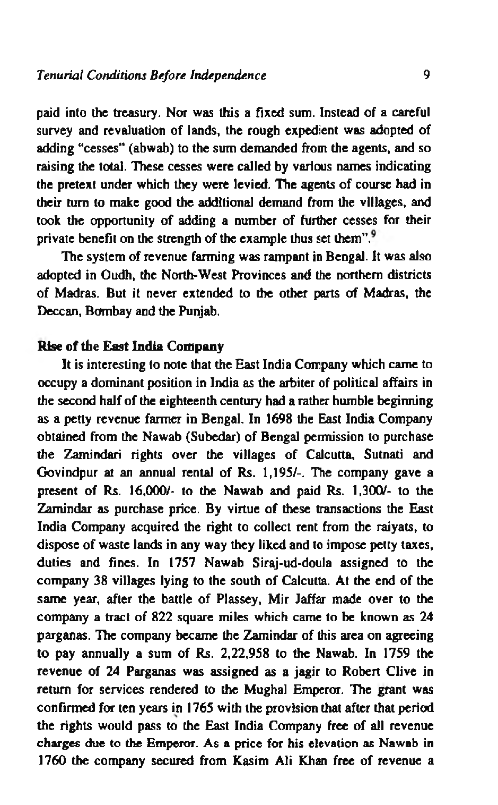

###### Tenurial Conditions Before Independence 9

paid into the treasury. Nor was this a fixed sum. Instead of a careful survey and revaluation of lands, the rough expedient was adopted of adding “cesses” (abwab) to the sum demanded from the agents, and so raising the total. These cesses were called by various names indicating the pretext under which they were levied. The agents of course had in their turn to make good the additional demand from the villages, and took the opportunity of adding a number of further cesses for their private benefit on the strength of the example thus set them”.

The system of revenue farming was rampant in Bengal. It was also adopted in Oudh, the North-West Provinces and the northern districts of Madras. But it never extended to the other parts of Madras, the Deccan, Bombay and the Punjab.

###### Rise of the East India Company

It is interesting to note that the East India Company which came to occupy a dominant position in India as the arbiter of political affairs in the second half of the eighteenth century had a rather humble beginning as a petty revenue farmer in Bengal. In 1698 the East India Company obtained from the Nawab (Subedar) of Bengal permission to purchase the Zamindari rights over the villages of Calcutta, Sutnati and Govindpur at an annual rental of Rs. 1,195/-. The company gave a present of Rs. 16,000/- to the Nawab and paid Rs. 1,300/- to the Zamindar as purchase price. By virtue of these transactions the East India Company acquired the right to collect rent from the raiyats, to dispose of waste lands in any way they liked and to impose petty taxes, duties and fines. In 1757 Nawab Siraj-ud-doula assigned to the company 38 villages lying to the south of Calcutta. At the end of the same year, after the battle of Plassey, Mir Jaffar made over to the company a tract of 822 square miles which came to be known as 24 parganas. The company became the Zamindar of this area on agreeing to pay annually a sum of Rs. 2,22,958 to the Nawab. In 1759 the revenue of 24 Parganas was assigned as a jagir to Robert Clive in return for services rendered to the Mughal Emperor. The grant was confirmed for ten years in 1765 with the provision that after that period the rights would pass to the East India Company free of all revenue charges due to the Emperor. As a price for his elevation as Nawab in 1760 the company secured from Kasim Ali Khan free of revenue a

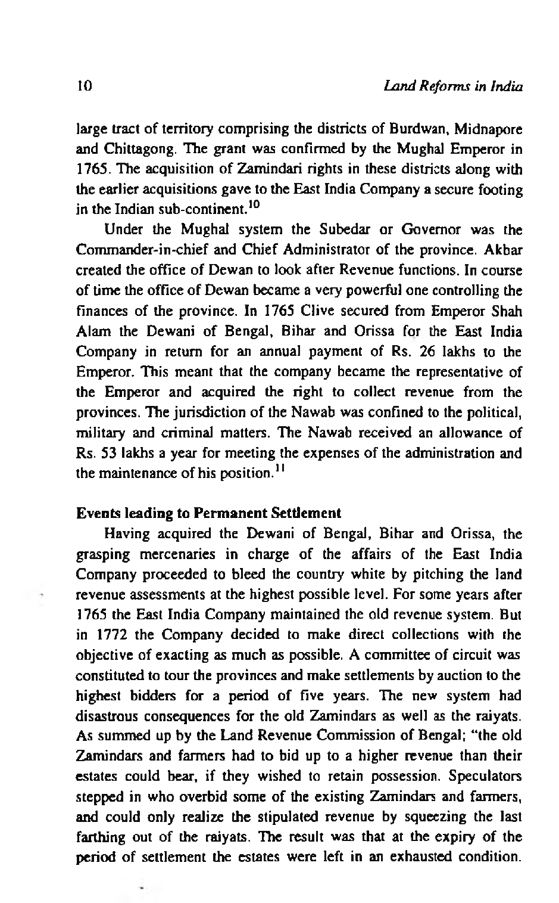

###### 10 Land Reforms in India

large tract of territory comprising the districts of Burdwan, Midnapore and Chittagong. The grant was confirmed by the Mughal Emperor in 1765. The acquisition of Zamindari rights in these districts along with the earlier acquisitions gave to the East India Company a secure footing in the Indian sub-continent.10

Under the Mughal system the Subedar or Governor was the Commander-in-chief and Chief Administrator of the province. Akbar created the office of Dewan to look after Revenue functions. In course of time the office of Dewan became a very powerful one controlling the finances of the province. In 1765 Clive secured from Emperor Shah Alam the Dewani of Bengal, Bihar and Orissa for the East India Company in return for an annual payment of Rs. 26 lakhs to the Emperor. This meant that the company became the representative of the Emperor and acquired the right to collect revenue from the provinces. The jurisdiction of the Nawab was confined to the political, military and criminal matters. The Nawab received an allowance of Rs. 53 lakhs a year for meeting the expenses of the administration and the maintenance of his position.11

###### Events leading to Permanent Settlement

Having acquired the Dewani of Bengal, Bihar and Orissa, the grasping mercenaries in charge of the affairs of the East India Company proceeded to bleed the country white by pitching the land revenue assessments at the highest possible level. For some years after 1765 the East India Company maintained the old revenue system. But in 1772 the Company decided to make direct collections with the objective of exacting as much as possible. A committee of circuit was constituted to tour the provinces and make settlements by auction to the highest bidders for a period of five years. The new system had disastrous consequences for the old Zamindars as well as the raiyats. As summed up by the Land Revenue Commission of Bengal; “the old Zamindars and farmers had to bid up to a higher revenue than their estates could bear, if they wished to retain possession. Speculators stepped in who overbid some of the existing Zamindars and farmers, and could only realize the stipulated revenue by squeezing the last farthing out of the raiyats. The result was that at the expiry of the period of settlement the estates were left in an exhausted condition.

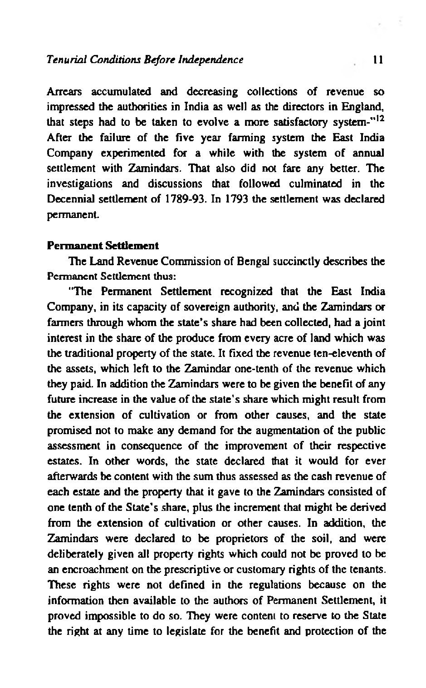

###### Tenurial Conditions Before Independence 11

Arrears accumulated and decreasing collections of revenue so impressed the authorities in India as well as the directors in England, that steps had to be taken to evolve a more satisfactory system-’*12 After the failure of the five year farming system the East India Company experimented for a while with the system of annual settlement with Zamindars. That also did not fare any better. The investigations and discussions that followed culminated in the Decennial settlement of 1789-93. In 1793 the settlement was declared permanent.

###### Permanent Settlement

The Land Revenue Commission of Bengal succinctly describes the Permanent Settlement thus:

“The Permanent Settlement recognized that the East India Company, in its capacity of sovereign authority, and the Zamindars or farmers through whom the state’s share had been collected, had a joint interest in the share of the produce from every acre of land which was the traditional property of the state. It fixed the revenue ten-eleventh of the assets, which left to the Zamindar one-tenth of the revenue which they paid. In addition the Zamindars were to be given the benefit of any future increase in the value of the state’s share which might result from the extension of cultivation or from other causes, and the state promised not to make any demand for the augmentation of the public assessment in consequence of the improvement of their respective estates. In other words, the state declared that it would for ever afterwards be content with the sum thus assessed as the cash revenue of each estate and the property that it gave to the Zamindars consisted of one tenth of the State’s share, plus the increment that might be derived from the extension of cultivation or other causes. In addition, the Zamindars were declared to be proprietors of the soil, and were deliberately given all property rights which could not be proved to be an encroachment on the prescriptive or customary rights of the tenants. These rights were not defined in the regulations because on the information then available to the authors of Permanent Settlement, it proved impossible to do so. They were content to reserve to the State the right at any time to legislate for the benefit and protection of the

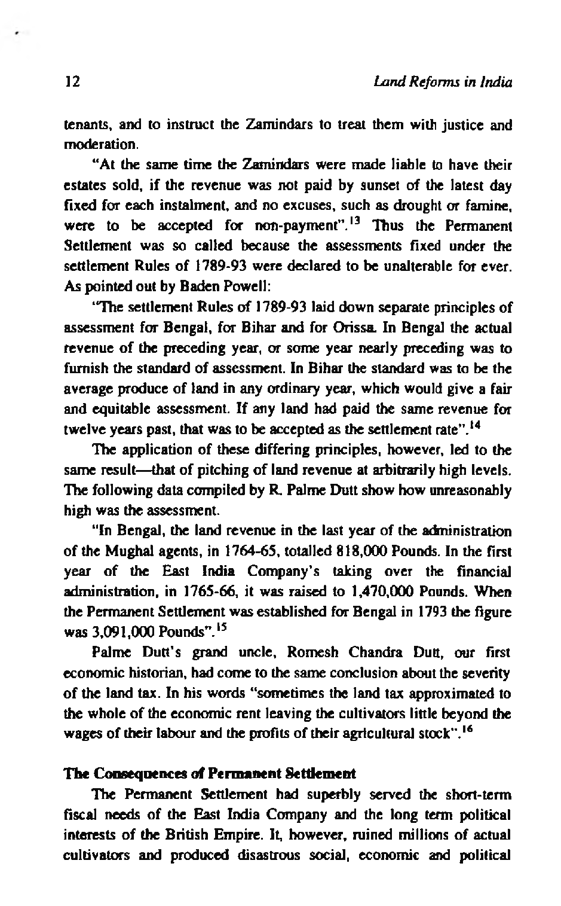

###### 12 Land Reforms in India

tenants, and to instruct the Zamindars to treat them with justice and moderation.

“At the same time the Zamindars were made liable to have their estates sold, if the revenue was not paid by sunset of the latest day fixed for each instalment, and no excuses, such as drought or famine, were to be accepted for non-payment”.13 Thus the Permanent Settlement was so called because the assessments fixed under the settlement Rules of 1789-93 were declared to be unalterable for ever. As pointed out by Baden Powell:

“The settlement Rules of 1789-93 laid down separate principles of assessment for Bengal, for Bihar and for Orissa. In Bengal the actual revenue of the preceding year, or some year nearly preceding was to furnish the standard of assessment. In Bihar the standard was to be the average produce of land in any ordinary year, which would give a fair and equitable assessment. If any land had paid the same revenue for twelve years past, that was to be accepted as the settlement rate”.14

The application of these differing principles, however, led to the same result—that of pitching of land revenue at arbitrarily high levels. The following data compiled by R. Palme Dutt show how unreasonably high was the assessment.

“In Bengal, the land revenue in the last year of the administration of the Mughal agents, in 1764-65, totalled 818,000 Pounds. In the first year of the East India Company’s taking over the financial administration, in 1765-66, it was raised to 1,470,000 Pounds. When the Permanent Settlement was established for Bengal in 1793 the figure was 3,091,000 Pounds”.15

Palme Dutt’s grand uncle, Romesh Chandra Dutt, our first economic historian, had come to the same conclusion about the severity of the land tax. In his words “sometimes the land tax approximated to the whole of the economic rent leaving the cultivators little beyond the wages of their labour and the profits of their agricultural stock”.16

###### The Consequences of Permanent Settlement

The Permanent Settlement had superbly served the short-term fiscal needs of the East India Company and the long term political interests of the British Empire. It, however, ruined millions of actual cultivators and produced disastrous social, economic and political

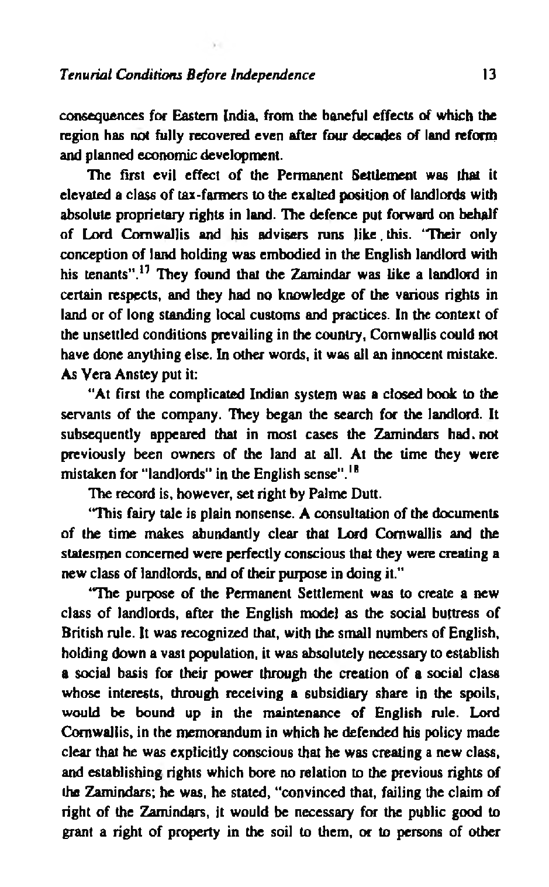

###### Tenurial Conditions Before Independence 13

consequences for Eastern India, from the baneful effects of which the region has not fully recovered even after four decades of land reform and planned economic development.

The first evil effect of the Permanent Settlement was that it elevated a class of tax-farmers to the exalted position of landlords with absolute proprietary rights in land. The defence put forward on behalf of Lord Cornwallis and his advisers runs like.this. “Their only conception of land holding was embodied in the English landlord with his tenants’*.17 They found that the Zamindar was like a landlord in certain respects, and they had no knowledge of the various rights in land or of long standing local customs and practices. In the context of the unsettled conditions prevailing in the country, Cornwallis could not have done anything else. In other words, it was all an innocent mistake. As Vera Anstey put it:

“At first the complicated Indian system was a closed book to the servants of the company. They began the search for the landlord. It subsequently appeared that in most cases the Zamindars had. not previously been owners of the land at all. At the time they were mistaken for “landlords’* in the English sense”.18

The record is, however, set right by Palme Dutt. “This fairy tale is plain nonsense. A consultation of the documents of the time makes abundantly clear that Lord Cornwallis and the statesmen concerned were perfectly conscious that they were creating a new class of landlords, and of their purpose in doing it.**

“The purpose of the Permanent Settlement was to create a new class of landlords, after the English model as the social buttress of British rule. It was recognized that, with the small numbers of English, holding down a vast population, it was absolutely necessary to establish a social basis for their power through the creation of a social class whose interests, through receiving a subsidiary share in the spoils, would be bound up in the maintenance of English rule. Lord Cornwallis, in the memorandum in which he defended his policy made clear that he was explicitly conscious that he was creating a new class, and establishing rights which bore no relation to the previous rights of the Zamindars; he was, he stated, “convinced that, failing the claim of right of the Zamindars, it would be necessary for the public good to grant a right of property in the soil to them, or to persons of other

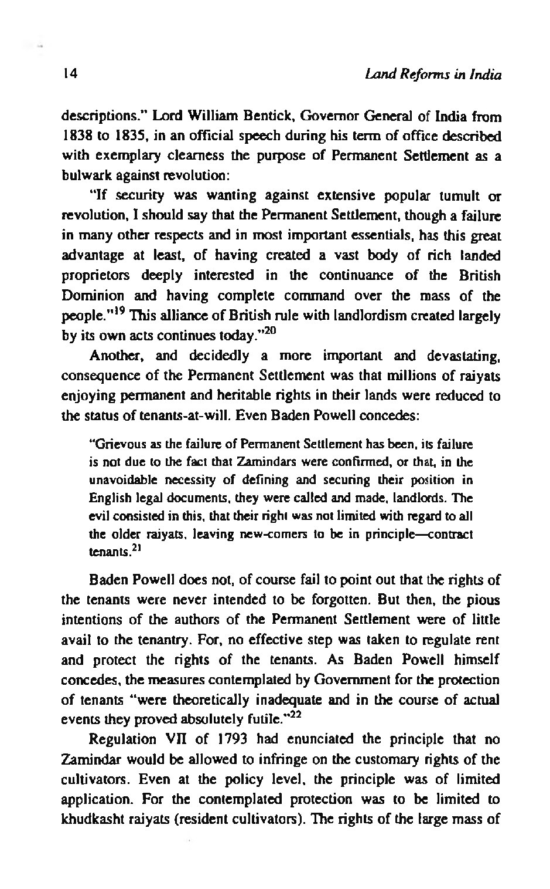

###### 14 Land Reforms in India

descriptions.” Lord William Bentick, Governor General of India from 1838 to 1835, in an official speech during his term of office described with exemplary clearness the purpose of Permanent Settlement as a bulwark against revolution:

“If security was wanting against extensive popular tumult or revolution, I should say that the Permanent Settlement, though a failure in many other respects and in most important essentials, has this great advantage at least, of having created a vast body of rich landed proprietors deeply interested in the continuance of the British Dominion and having complete command over the mass of the people.”19 This alliance of British rule with landlordism created largely by its own acts continues today.”20

Another, and decidedly a more important and devastating, consequence of the Permanent Settlement was that millions of raiyats enjoying permanent and heritable rights in their lands were reduced to the status of tenants-at-will. Even Baden Powell concedes:

“Grievous as the failure of Permanent Settlement has been, its failure is not due to the fact that Zamindars were confirmed, or that, in the unavoidable necessity of defining and securing their position in English legal documents, they were called and made, landlords. The evil consisted in this, that their right was not limited with regard to all the older raiyats, leaving new-comers to be in principle—contract tenants.21

Baden Powell does not, of course fail to point out that the rights of the tenants were never intended to be forgotten. But then, the pious intentions of the authors of the Permanent Settlement were of little avail to the tenantry. For, no effective step was taken to regulate rent and protect the rights of the tenants. As Baden Powell himself concedes, the measures contemplated by Government for the protection of tenants “were theoretically inadequate and in the course of actual events they proved absolutely futile.”22

Regulation VII of 1793 had enunciated the principle that no Zamindar would be allowed to infringe on the customary rights of the cultivators. Even at the policy level, the principle was of limited application. For the contemplated protection was to be limited to khudkasht raiyats (resident cultivators). The rights of the large mass of

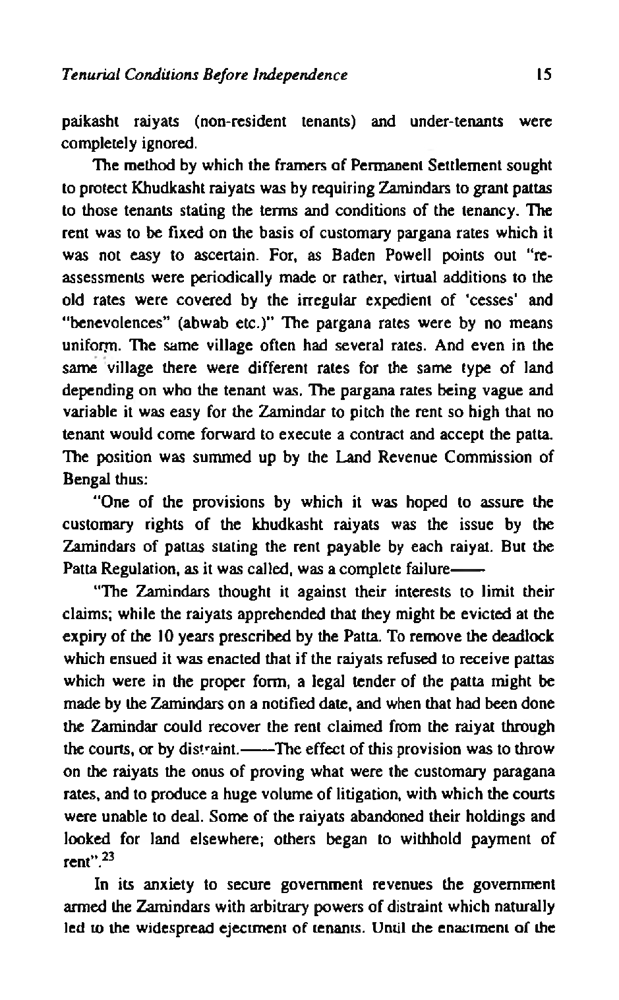

###### Tenurial Conditions Before Independence 15

paikasht raiyats (non-resident tenants) and under-tenants were completely ignored.

The method by which the framers of Permanent Settlement sought to protect Khudkasht raiyats was by requiring Zamindars to grant pattas to those tenants stating the terms and conditions of the tenancy. The rent was to be fixed on the basis of customary pargana rates which it was not easy to ascertain. For, as Baden Powell points out “reassessments were periodically made or rather, virtual additions to the old rates were covered by the irregular expedient of ‘cesses’ and “benevolences” (abwab etc.)” The pargana rates were by no means uniform. The same village often had several rates. And even in the same village there were different rates for the same type of land depending on who the tenant was. The pargana rates being vague and variable it was easy for the Zamindar to pitch the rent so high that no tenant would come forward to execute a contract and accept the patta. The position was summed up by the Land Revenue Commission of Bengal thus:

“One of the provisions by which it was hoped to assure the customary rights of the khudkasht raiyats was the issue by the Zamindars of pattas stating the rent payable by each raiyat. But the Patta Regulation, as it was called, was a complete failure------

“The Zamindars thought it against their interests to limit their claims; while the raiyats apprehended that they might be evicted at the expiry of the 10 years prescribed by the Patta. To remove the deadlock which ensued it was enacted that if the raiyats refused to receive pattas which were in the proper form, a legal tender of the patta might be made by the Zamindars on a notified date, and when that had been done the Zamindar could recover the rent claimed from the raiyat through the courts, or by distraint.------The effect of this provision was to throw on the raiyats the onus of proving what were the customary paragana rates, and to produce a huge volume of litigation, with which the courts were unable to deal. Some of the raiyats abandoned their holdings and looked for land elsewhere; others began to withhold payment of rent”.23

In its anxiety to secure government revenues the government armed the Zamindars with arbitrary powers of distraint which naturally led to the widespread ejectment of tenants. Until the enactment of the

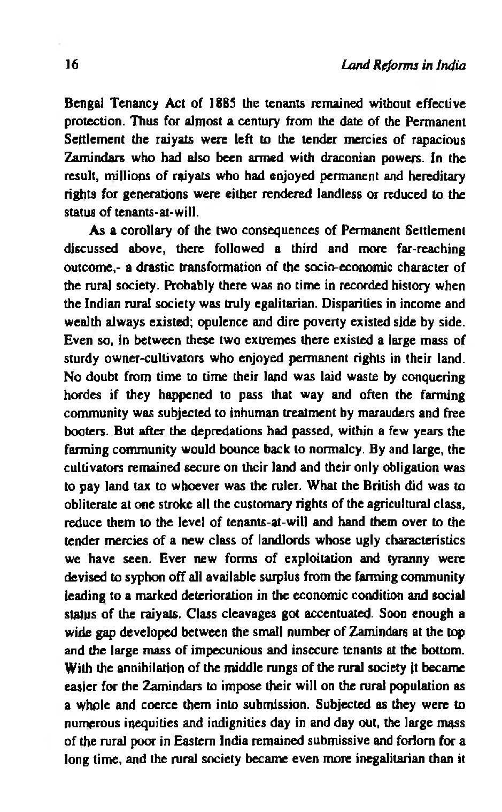

###### 16 Land Reforms in India

Bengal Tenancy Act of 1885 the tenants remained without effective protection. Thus for almost a century from the date of the Permanent Settlement the raiyats were left to the tender mercies of rapacious Zamindars who had also been armed with draconian powers. In the result, millions of raiyats who had enjoyed permanent and hereditary rights for generations were either rendered landless or reduced to the status of tenants-at-will.

As a corollary of the two consequences of Permanent Settlement discussed above, there followed a third and more far-reaching outcome,- a drastic transformation of the socio-economic character of the rural society. Probably there was no time in recorded history when the Indian rural society was truly egalitarian. Disparities in income and wealth always existed; opulence and dire poverty existed side by side. Even so, in between these two extremes there existed a large mass of sturdy owner-cultivators who enjoyed permanent rights in their land. No doubt from time to time their land was laid waste by conquering hordes if they happened to pass that way and often the farming community was subjected to inhuman treatment by marauders and free booters. But after the depredations had passed, within a few years the fanning community would bounce back to normalcy. By and large, the cultivators remained secure on their land and their only obligation was to pay land tax to whoever was the ruler. What the British did was to obliterate at one stroke all the customary rights of the agricultural class, reduce them to the level of tenants-at-will and hand them over to the tender mercies of a new class of landlords whose ugly characteristics we have seen. Ever new forms of exploitation and tyranny were devised to syphon off all available surplus from the farming community leading to a marked deterioration in the economic condition and social st^us of the raiyats. Class cleavages got accentuated. Soon enough a wide gap developed between the small number of Zamindars at the top and the large mass of impecunious and insecure tenants at the bottom. With the annihilation of the middle rungs of the rural society it became easier for the Zamindars to impose their will on the rural population as a whole and coerce them into submission. Subjected as they were to numerous inequities and indignities day in and day out, the large mass of the rural poor in Eastern India remained submissive and forlorn for a long time, and the rural society became even more inegalitarian than it

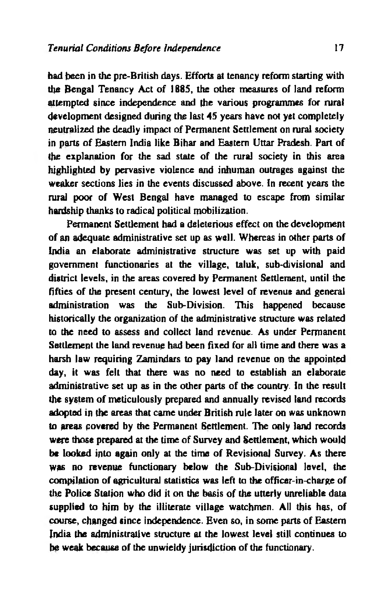

###### Tenurial Conditions Before Independence 17

had been in the pre-British days. Efforts at tenancy reform starting with the Bengal Tenancy Act of 1885, the other measures of land reform attempted since independence and the various programmes for rural envelopment designed during the last 45 years have not yet completely neutralized the deadly impact of Permanent Settlement on rural society in parts of Eastern India like Bihar and Eastern Uttar Pradesh. Part of the explanation for the sad state of the rural society in this area highlighted by pervasive violence and inhuman outrages against the weaker sections lies in the events discussed above. In recent years the rural poor of West Bengal have managed to escape from similar hardship thanks to radical political mobilization.

Permanent Settlement had a deleterious effect on the development of an adequate administrative set up as well. Whereas in other parts of India an elaborate administrative structure was set up with paid government functionaries at the village, taluk, sub-divisional and district levels, in the areas covered by Permanent Settlement, until the fifties of the present century, the lowest level of revenue and general administration was the Sub-Division. This happened because historically the organization of the administrative structure was related to the need to assess and collect land revenue. As under Permanent Settlement the land revenue had been fixed for all time and there was a harsh law requiring Zamindars to pay land revenue on the appointed day, it was felt that there was no need to establish an elaborate administrative set up as in the other parts of the country. In the result the system of meticulously prepared and annually revised land records adopted in the areas that came under British rule later on was unknown to areas covered by the Permanent Settlement. The only land records were those prepared at the time of Survey and Settlement, which would be looked into again only at the time of Re visional Survey. As there was no revenue functionary below the Sub-Divisional level, the compilation of agricultural statistics was left to the officer-in-charge of the Police Station who did it on the basis of the utterly unreliable data supplied to him by the illiterate village watchmen. All this has, of course, changed since independence. Even so, in some parts of Eastern India the administrative structure at the lowest level still continues to be weak because of the unwieldy jurisdiction of the functionary.

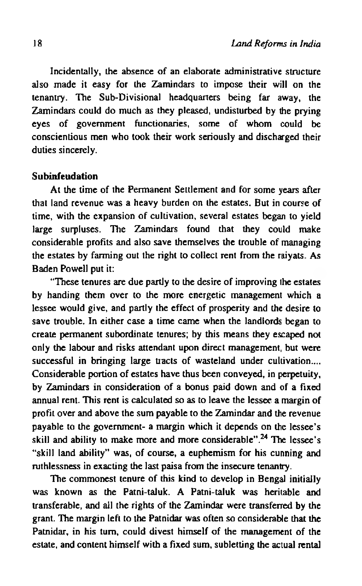

###### 18 Land Reforms in India

Incidentally, the absence of an elaborate administrative structure also made it easy for the Zamindars to impose their will on the tenantry. The Sub-Divisional headquarters being far away, the Zamindars could do much as they pleased, undisturbed by the prying eyes of government functionaries, some of whom could be conscientious men who took their work seriously and discharged their duties sincerely.

###### Subinfeudation

At the time of the Permanent Settlement and for some years after that land revenue was a heavy burden on the estates. But in course of time, with the expansion of cultivation, several estates began to yield large surpluses. The Zamindars found that they could make considerable profits and also save themselves the trouble of managing the estates by farming out the right to collect rent from the raiyats. As Baden Powell put it:

“These tenures are due partly to the desire of improving the estates by handing them over to the more energetic management which a lessee would give, and partly the effect of prosperity and the desire to save trouble. In either case a time came when the landlords began to create permanent subordinate tenures; by this means they escaped not only the labour and risks attendant upon direct management, but were successful in bringing large tracts of wasteland under cultivation.... Considerable portion of estates have thus been conveyed, in perpetuity, by Zamindars in consideration of a bonus paid down and of a fixed annual rent. This rent is calculated so as to leave the lessee a margin of profit over and above the sum payable to the Zamindar and the revenue payable to the government- a margin which it depends on the lessee’s skill and ability to make more and more considerable”.24 The lessee’s “skill land ability” was, of course, a euphemism for his cunning and ruthlessness in exacting the last paisa from the insecure tenantry.

The commonest tenure of this kind to develop in Bengal initially was known as the Patni-taluk. A Patni-taluk was heritable and transferable, and all the rights of the Zamindar were transferred by the grant. The margin left to the Patnidar was often so considerable that the Patnidar, in his turn, could divest himself of the management of the estate, and content himself with a fixed sum, subletting the actual rental

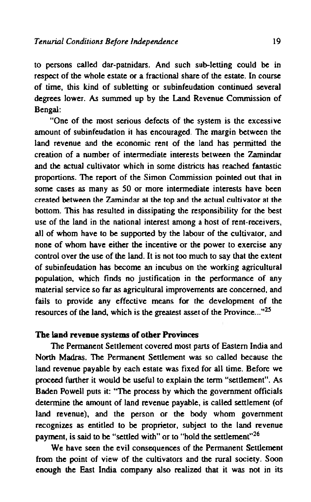

###### Tenurial Conditions Before Independence 19

to persons called dar-patnidars. And such sub-letting could be in respect of the whole estate or a fractional share of the estate. In course of time, this kind of subletting or subinfeudation continued several degrees lower. As summed up by the Land Revenue Commission of Bengal:

“One of the most serious defects of the system is the excessive amount of subinfeudation it has encouraged. The margin between the land revenue and the economic rent of the land has permitted the creation of a number of intermediate interests between the Zamindar and the actual cultivator which in some districts has reached fantastic proportions. The report of the Simon Commission pointed out that in some cases as many as 50 or more intermediate interests have been created between the Zamindar at the top and the actual cultivator at the bottom. This has resulted in dissipating the responsibility for the best use of the land in the national interest among a host of rent-receivers, all of whom have to be supported by the labour of the cultivator, and none of whom have either the incentive or the power to exercise any control over the use of the land. It is not too much to say that the extent of subinfeudation has become an incubus on the working agricultural population, which finds no justification in the performance of any material service so far as agricultural improvements are concerned, and fails to provide any effective means for the development of the resources of the land, which is the greatest asset of the Province...”25

###### The land revenue systems of other Provinces

The Permanent Settlement covered most parts of Eastern India and North Madras. The Permanent Settlement was so called because the land revenue payable by each estate was fixed for all time. Before we proceed further it would be useful to explain the term “settlement”. As Baden Powell puts it: “The process by which the government officials determine the amount of land revenue payable, is called settlement (of land revenue), and the person or the body whom government recognizes as entitled to be proprietor, subject to the land revenue payment, is said to be “settled with” or to “hold the setdement”26

We have seen the evil consequences of the Permanent Settlement from the point of view of the cultivators and the rural society. Soon enough the East India company also realized that it was not in its

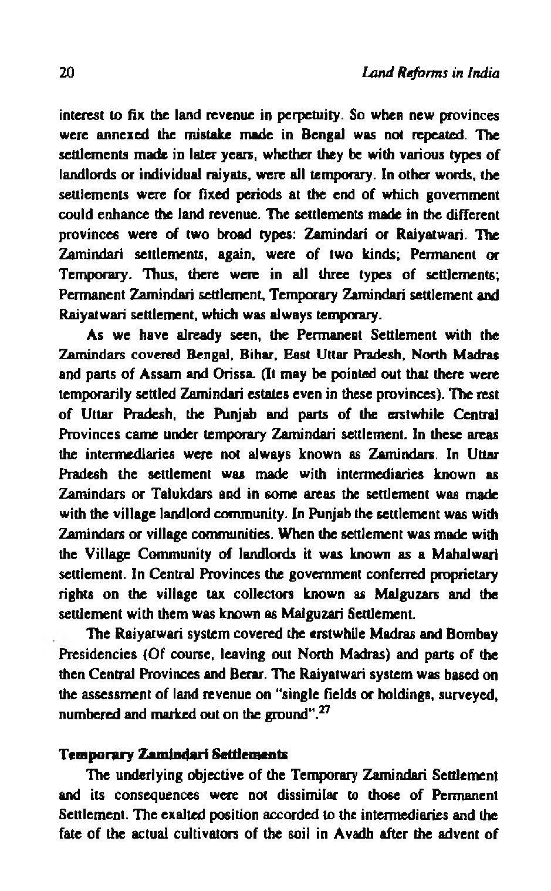

###### 20 Land Reforms in India

interest to fix the land revenue in perpetuity. So when new provinces were annexed the mistake made in Bengal was not repeated. The settlements made in later years, whether they be with various types of landlords or individual raiyats, were all temporary. In other words, the settlements were for fixed periods at the end of which government could enhance the land revenue. The settlements made in the different provinces were of two broad types: Zamindari or Raiyatwari. The Zamindari settlements, again, were of two kinds; Permanent or Temporary. Thus, there were in all three types of settlements; Permanent Zamindari settlement, Temporary Zamindari settlement and Raiyatwari settlement, which was always temporary.

As we have already seen, the Permanent Settlement with the Zamindars covered Bengal, Bihar, East Uttar Pradesh, North Madras and parts of Assam and Orissa. (It may be pointed out that there were temporarily settled Zamindari estates even in these provinces). The rest of Uttar Pradesh, the Punjab and parts of the erstwhile Central Provinces came under temporary Zamindari settlement. In these areas the intermediaries were not always known as Zamindars. In Uttar Pradesh the settlement was made with intermediaries known as Zamindars or Talukdars and in some areas the settlement was made with the village landlord community. In Punjab the settlement was with Zamindars or village communities. When the settlement was made with the Village Community of landlords it was known as a Mahalwari settlement. In Central Provinces the government conferred proprietary rights on the village tax collectors known as Malguzars and the settlement with them was known as Malguzari Settlement.

The Raiyatwari system covered the erstwhile Madras and Bombay Presidencies (Of course, leaving out North Madras) and parts of the then Central Provinces and Berar. The Raiyatwari system was based on the assessment of land revenue on “single fields or holdings, surveyed, numbered and marked out on the ground”.27

###### Temporary Zamindari Settlements

The underlying objective of the Temporary Zamindari Settlement and its consequences were not dissimilar to those of Permanent Settlement. The exalted position accorded to the intermediaries and the fate of the actual cultivators of the soil in Avadh after the advent of

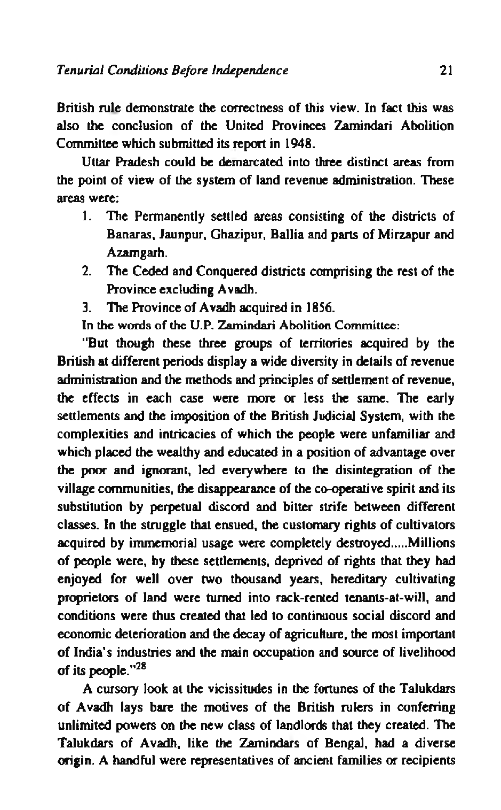

###### Tenurial Conditions Before Independence 21

British rule demonstrate the correctness of this view. In fact this was also the conclusion of the United Provinces Zamindari Abolition Committee which submitted its report in 1948.

Uttar Pradesh could be demarcated into three distinct areas from the point of view of the system of land revenue administration. These areas were:

- 1. The Permanently settled areas consisting of the districts of Banaras, Jaunpur, Ghazipur, Ballia and parts of Mirzapur and Azamgarh.
- 2. The Ceded and Conquered districts comprising the rest of the Province excluding Avadh.
- 3. The Province of Avadh acquired in 1856. In the words of the U.P. Zamindari Abolition Committee: “But though these three groups of territories acquired by the

British at different periods display a wide diversity in details of revenue administration and the methods and principles of settlement of revenue, the effects in each case were more or less the same. The early settlements and the imposition of the British Judicial System, with the complexities and intricacies of which the people were unfamiliar and which placed the wealthy and educated in a position of advantage over the poor and ignorant, led everywhere to the disintegration of the village communities, the disappearance of the co-operative spirit and its substitution by perpetual discord and bitter strife between different classes. In the struggle that ensued, the customary rights of cultivators acquired by immemorial usage were completely destroyed....Millions of people were, by these settlements, deprived of rights that they had enjoyed for well over two thousand years, hereditary cultivating proprietors of land were turned into rack-rented tenants-at-will, and conditions were thus created that led to continuous social discord and economic deterioration and the decay of agriculture, the most important of India’s industries and the main occupation and source of livelihood of its people.”28

A cursory look at the vicissitudes in the fortunes of the Talukdars of Avadh lays bare the motives of the British rulers in conferring unlimited powers on the new class of landlords that they created. The Talukdars of Avadh, like the Zamindars of Bengal, had a diverse origin. A handful were representatives of ancient families or recipients

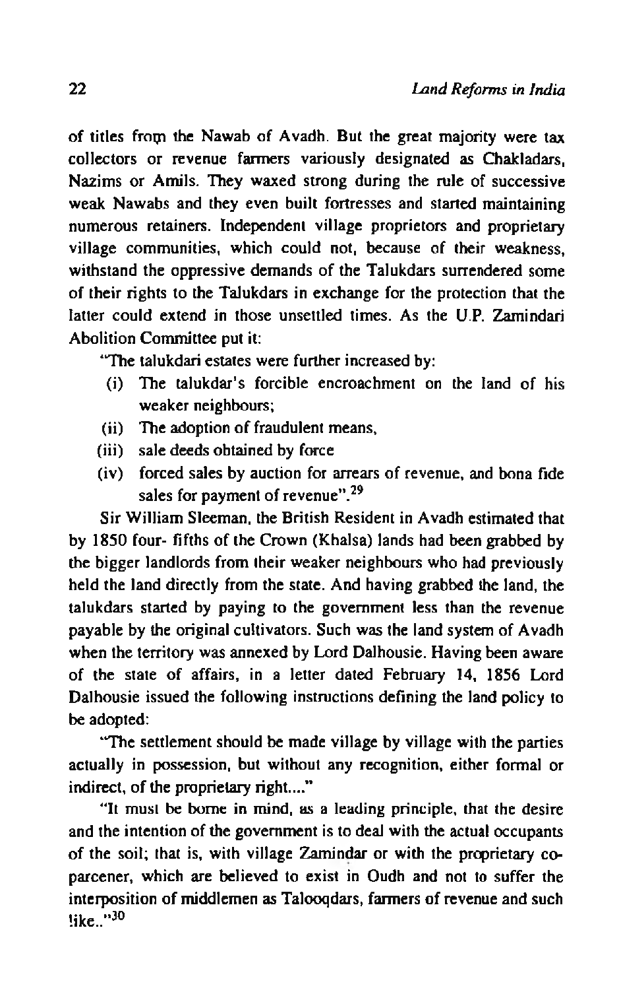

###### 22 Land Reforms in India

of titles from the Nawab of Avadh. But the great majority were tax collectors or revenue farmers variously designated as Chakladars, Nazims or Amils. They waxed strong during the rule of successive weak Nawabs and they even built fortresses and started maintaining numerous retainers. Independent village proprietors and proprietary village communities, which could not, because of their weakness, withstand the oppressive demands of the Talukdars surrendered some of their rights to the Talukdars in exchange for the protection that the latter could extend in those unsettled times. As the U.P. Zamindari Abolition Committee put it:

“The talukdari estates were further increased by:

- (i) The talukdar’s forcible encroachment on the land of his weaker neighbours;
- (ii) The adoption of fraudulent means,
- (iii) sale deeds obtained by force
- (iv) forced sales by auction for arrears of revenue, and bona fide sales for payment of revenue”.29

Sir William Sleeman, the British Resident in Avadh estimated that by 1850 four- fifths of the Crown (Khalsa) lands had been grabbed by the bigger landlords from their weaker neighbours who had previously held the land directly from the state. And having grabbed the land, the talukdars started by paying to the government less than the revenue payable by the original cultivators. Such was the land system of Avadh when the territory was annexed by Lord Dalhousie. Having been aware of the state of affairs, in a letter dated February 14, 1856 Lord Dalhousie issued the following instructions defining the land policy to be adopted:

“The settlement should be made village by village with the parties actually in possession, but without any recognition, either formal or indirect, of the proprietary right....**

“It must be borne in mind, as a leading principle, that the desire and the intention of the government is to deal with the actual occupants of the soil; that is, with village Zamindar or with the proprietary coparcener, which are believed to exist in Oudh and not to suffer the interposition of middlemen as Talooqdars, farmers of revenue and such '.ike.."30

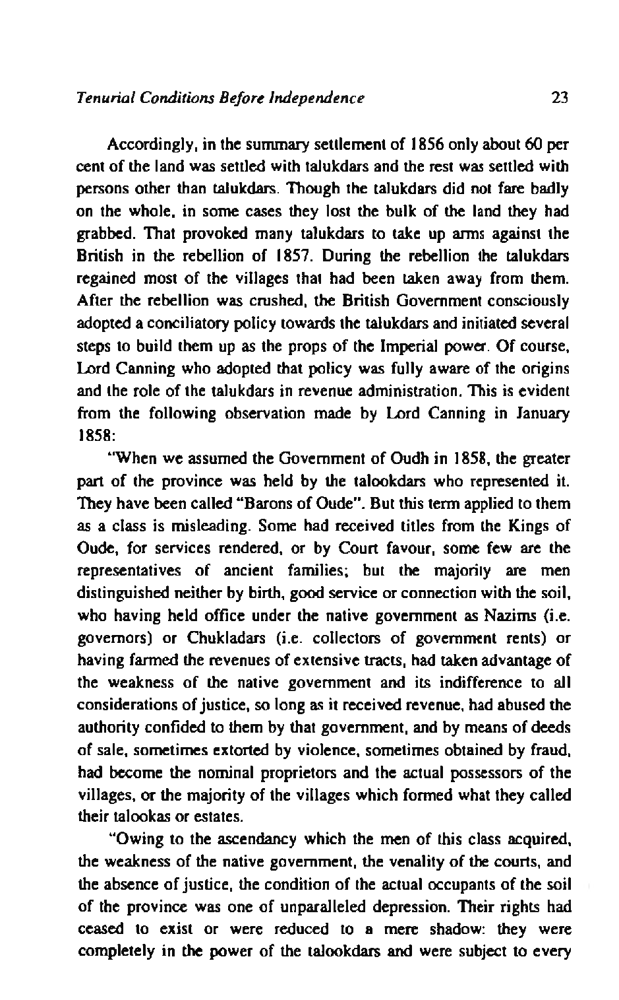

###### Tenurial Conditions Before Independence 23

Accordingly, in the summary settlement of 1856 only about 60 per cent of the land was settled with talukdars and the rest was settled with persons other than talukdars. Though the talukdars did not fare badly on the whole, in some cases they lost the bulk of the land they had grabbed. That provoked many talukdars to take up arms against the British in the rebellion of 1857. During the rebellion the talukdars regained most of the villages that had been taken away from them. After the rebellion was crushed, the British Government consciously adopted a conciliatory policy towards the talukdars and initiated several steps to build them up as the props of the Imperial power. Of course, Lord Canning who adopted that policy was fully aware of the origins and the role of the talukdars in revenue administration. This is evident from the following observation made by Lord Canning in January 1858:

“When we assumed the Government of Oudh in 1858, the greater part of the province was held by the talookdars who represented it. They have been called “Barons of Oude”. But this term applied to them as a class is misleading. Some had received titles from the Kings of Oude, for services rendered, or by Court favour, some few are the representatives of ancient families; but the majority are men distinguished neither by birth, good service or connection with the soil, who having held office under the native government as Nazims (i.e. governors) or Chukladars (i.e. collectors of government rents) or having farmed the revenues of extensive tracts, had taken advantage of the weakness of the native government and its indifference to all considerations of justice, so long as it received revenue, had abused the authority confided to them by that government, and by means of deeds of sale, sometimes extorted by violence, sometimes obtained by fraud, had become the nominal proprietors and the actual possessors of the villages, or the majority of the villages which formed what they called their talookas or estates.

“Owing to the ascendancy which the men of this class acquired, the weakness of the native government, the venality of the courts, and the absence of justice, the condition of the actual occupants of the soil of the province was one of unparalleled depression. Their rights had ceased to exist or were reduced to a mere shadow: they were completely in the power of the talookdars and were subject to every

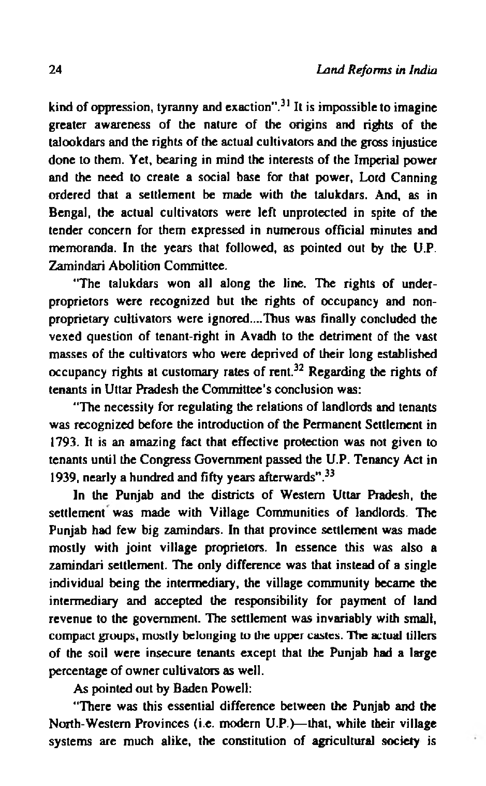

###### 24 Land Reforms in India

kind of oppression, tyranny and exaction”.31 It is impossible to imagine greater awareness of the nature of the origins and rights of the talookdars and the rights of the actual cultivators and the gross injustice done to them. Yet, bearing in mind the interests of the Imperial power and the need to create a social base for that power, Lord Canning ordered that a settlement be made with the talukdars. And, as in Bengal, the actual cultivators were left unprotected in spite of the tender concern for them expressed in numerous official minutes and memoranda. In the years that followed, as pointed out by the U.P. Zamindari Abolition Committee.

“The talukdars won all along the line. The rights of underproprietors were recognized but the rights of occupancy and nonproprietary cultivators were ignored....Thus was finally concluded the vexed question of tenant-right in Avadh to the detriment of the vast masses of the cultivators who were deprived of their long established occupancy rights at customary rates of rent.32 Regarding the rights of tenants in Uttar Pradesh the Committee’s conclusion was:

“The necessity for regulating the relations of landlords and tenants was recognized before the introduction of the Permanent Settlement in 1793. It is an amazing fact that effective protection was not given to tenants until the Congress Government passed the U.P. Tenancy Act in 1939, nearly a hundred and fifty years afterwards”.33

In the Punjab and the districts of Western Uttar Pradesh, the settlement was made with Village Communities of landlords. The Punjab had few big zamindars. In that province settlement was made mostly with joint village proprietors. In essence this was also a zamindari settlement. The only difference was that instead of a single individual being the intermediary, the village community became the intermediary and accepted the responsibility for payment of land revenue to the government. The settlement was invariably with small, compact groups, mostly belonging to the upper castes. The actual tillers of the soil were insecure tenants except that the Punjab had a large percentage of owner cultivators as well.

As pointed out by Baden Powell: “There was this essential difference between the Punjab and the North-Western Provinces (i.e. modem U.P.)—that, while their village systems are much alike, the constitution of agricultural society is

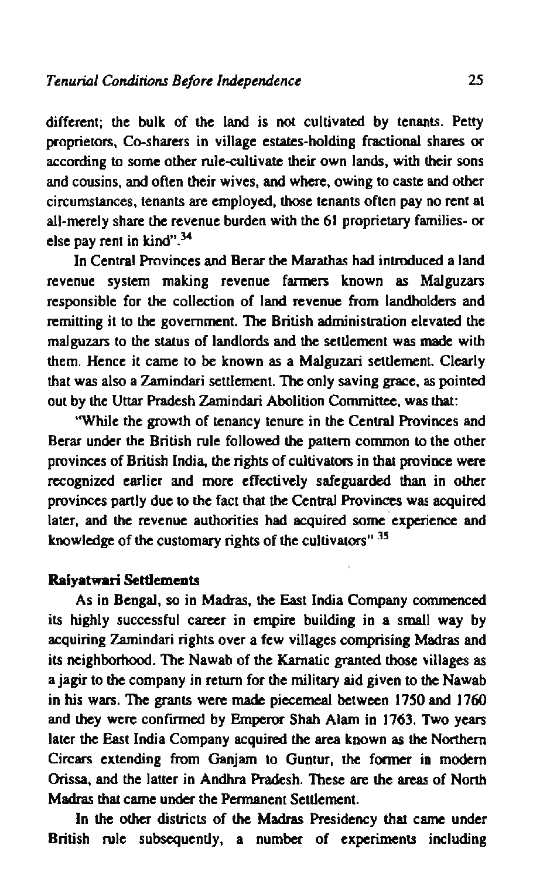

###### Tenurial Conditions Before Independence 25

different; the bulk of the land is not cultivated by tenants. Petty proprietors, Co-sharers in village estates-holding fractional shares or according to some other rule-cultivate their own lands, with their sons and cousins, and often their wives, and where, owing to caste and other circumstances, tenants are employed, those tenants often pay no rent at all-merely share the revenue burden with the 61 proprietary families- or else pay rent in kind”.34

In Central Provinces and Berar the Marathas had introduced a land revenue system making revenue farmers known as Malguzars responsible for the collection of land revenue from landholders and remitting it to the government. The British administration elevated the malguzars to the status of landlords and the settlement was made with them. Hence it came to be known as a Malguzari settlement. Clearly that was also a Zamindari settlement. The only saving grace, as pointed out by the Uttar Pradesh Zamindari Abolition Committee, was that:

“While the growth of tenancy tenure in the Central Provinces and Berar under the British rule followed the pattern common to the other provinces of British India, the rights of cultivators in that province were recognized earlier and more effectively safeguarded than in other provinces partly due to the fact that the Central Provinces was acquired later, and the revenue authorities had acquired some experience and knowledge of the customary rights of the cultivators” 35

###### Raiyatwari Settlements

As in Bengal, so in Madras, the East India Company commenced its highly successful career in empire building in a small way by acquiring Zamindari rights over a few villages comprising Madras and its neighborhood. The Nawab of the Kamatic granted those villages as a jagir to the company in return for the military aid given to the Nawab in his wars. The grants were made piecemeal between 1750 and 1760 and they were confirmed by Emperor Shah Alam in 1763. Two years later the East India Company acquired the area known as the Northern Circars extending from Ganjam to Guntur, the former in modem Orissa, and the latter in Andhra Pradesh. These are the areas of North Madras that came under the Permanent Settlement.

In the other districts of the Madras Presidency that came under British rule subsequently, a number of experiments including

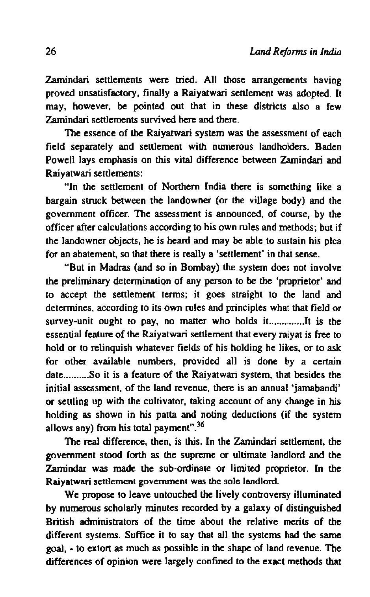

###### 26 Land Reforms in India

Zamindari settlements were tried. All those arrangements having proved unsatisfactory, finally a Raiyatwari settlement was adopted. It may, however, be pointed out that in these districts also a few Zamindari settlements survived here and there.

The essence of the Raiyatwari system was the assessment of each field separately and settlement with numerous landholders. Baden Powell lays emphasis on this vital difference between Zamindari and Raiyatwari settlements:

“In the settlement of Northern India there is something like a bargain struck between the landowner (or the village body) and the government officer. The assessment is announced, of course, by the officer after calculations according to his own rules and methods; but if the landowner objects, he is heard and may be able to sustain his plea for an abatement, so that there is really a ‘settlement’ in that sense.

“But in Madras (and so in Bombay) the system does not involve the preliminary determination of any person to be the ‘proprietor’ and to accept the settlement terms; it goes straight to the land and determines, according to its own rules and principles what that field or survey-unit ought to pay, no matter who holds it..............It is the essential feature of the Raiyatwari settlement that every raiyat is free to hold or to relinquish whatever fields of his holding he likes, or to ask for other available numbers, provided all is done by a certain date..........So it is a feature of the Raiyatwari system, that besides the initial assessment, of the land revenue, there is an annual ‘jamabandi’ or settling up with the cultivator, taking account of any change in his holding as shown in his patta and noting deductions (if the system allows any) from his total payment”.36

The real difference, then, is this. In the Zamindari settlement, the government stood forth as the supreme or ultimate landlord and the Zamindar was made the sub-ordinate or limited proprietor. In the Raiyatwari settlement government was the sole landlord.

We propose to leave untouched the lively controversy illuminated by numerous scholarly minutes recorded by a galaxy of distinguished British administrators of the time about the relative merits of the different systems. Suffice it to say that all the systems had the same goal, - to extort as much as possible in the shape of land revenue. The differences of opinion were largely confined to the exact methods that

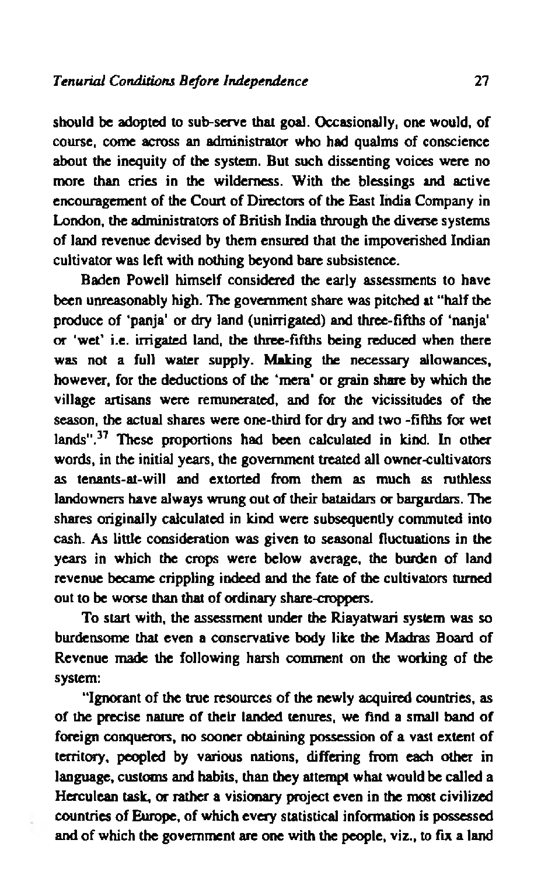

###### Tenurial Conditions Before Independence 27

should be adopted to sub-serve that goal. Occasionally, one would, of course, come across an administrator who had qualms of conscience about the inequity of the system. But such dissenting voices were no more than cries in the wilderness. With the blessings and active encouragement of the Court of Directors of the East India Company in London, the administrators of British India through the diverse systems of land revenue devised by them ensured that the impoverished Indian cultivator was left with nothing beyond bare subsistence.

Baden Powell himself considered the early assessments to have been unreasonably high. The government share was pitched at ‘‘half the produce of ‘panja’ or dry land (unirrigated) and three-fifths of ‘nanja’ or ‘wet’ i.e. irrigated land, the three-fifths being reduced when there was not a full water supply. Making the necessary allowances, however, for the deductions of the ‘mera’ or grain share by which the village artisans were remunerated, and for the vicissitudes of the season, the actual shares were one-third for dry and two -fifths for wet lands’*.37 These proportions had been calculated in kind. In other words, in the initial years, the government treated all owner-cultivators as tenants-at-will and extorted from them as much as ruthless landowners have always wrung out of their bataidars or bargardars. The shares originally calculated in kind were subsequently commuted into cash. As little consideration was given to seasonal fluctuations in the years in which the crops were below average, the burden of land revenue became crippling indeed and the fate of the cultivators turned out to be worse than that of ordinary share-croppers.

To start with, the assessment under the Riayatwari system was so burdensome that even a conservative body like the Madras Board of Revenue made the following harsh comment on the working of the system:

“Ignorant of the true resources of the newly acquired countries, as of the precise nature of their landed tenures, we find a small band of foreign conquerors, no sooner obtaining possession of a vast extent of territory, peopled by various nations, differing from each other in language, customs and habits, than they attempt what would be called a Herculean task, or rather a visionary project even in the most civilized countries of Europe, of which every statistical information is possessed and of which the government are one with the people, viz., to fix a land

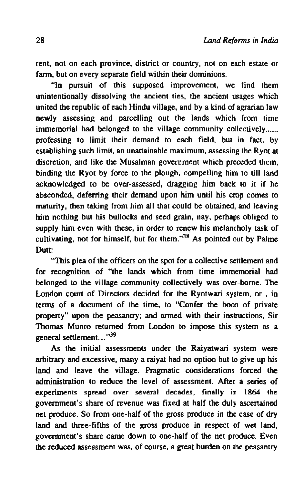

###### 28 Land Reforms in India

rent, not on each province, district or country, not on each estate or farm, but on every separate field within their dominions.

“In pursuit of this supposed improvement, we find them unintentionally dissolving the ancient ties, the ancient usages which united the republic of each Hindu village, and by a kind of agrarian law newly assessing and parcelling out the lands which from time immemorial had belonged to the village community collectively..... professing to limit their demand to each field, but in fact, by establishing such limit, an unattainable maximum, assessing the Ryot at discretion, and like the Musalman government which preceded them, binding the Ryot by force to the plough, compelling him to till land acknowledged to be over-assessed, dragging him back to it if he absconded, deferring their demand upon him until his crop comes to maturity, then taking from him all that could be obtained, and leaving him nothing but his bullocks and seed grain, nay, perhaps obliged to supply him even with these, in order to renew his melancholy task of cultivating, not for himself, but for them.”38 As pointed out by Palme Dutt:

“This plea of the officers on the spot for a collective settlement and for recognition of “the lands which from time immemorial had belonged to the village community collectively was over-borne. The London court of Directors decided for the Ryotwari system, or , in terms of a document of the time, to “Confer the boon of private property” upon the peasantry; and armed with their instructions. Sir Thomas Munro returned from London to impose this system as a general settlement...”39

As the initial assessments under the Raiyatwari system were arbitrary and excessive, many a raiyat had no option but to give up his land and leave the village. Pragmatic considerations forced the administration to reduce the level of assessment. After a series of experiments spread over several decades, finally in 1864 the government’s share of revenue was fixed at half the duly ascertained net produce. So from one-half of the gross produce in the case of dry land and three-fifths of the gross produce in respect of wet land, government’s share came down to one-half of the net produce. Even the reduced assessment was, of course, a great burden on the peasantry

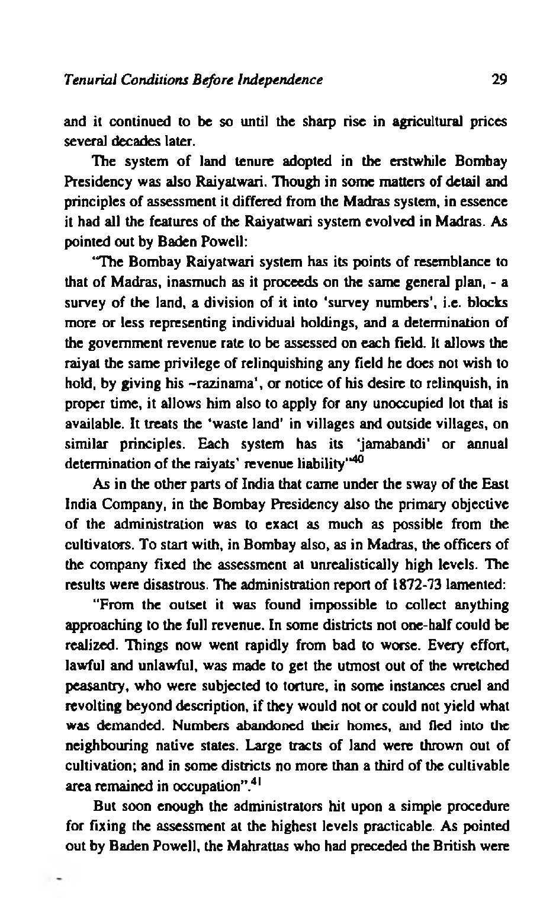

###### Tenurial Conditions Before Independence 29

and it continued to be so until the sharp rise in agricultural prices several decades later.

The system of land tenure adopted in the erstwhile Bombay Presidency was also Raiyatwari. Though in some matters of detail and principles of assessment it differed from the Madras system, in essence it had all the features of the Raiyatwari system evolved in Madras. As pointed out by Baden Powell:

“The Bombay Raiyatwari system has its points of resemblance to that of Madras, inasmuch as it proceeds on the same general plan, - a survey of the land, a division of it into ‘survey numbers’, i.e. blocks more or less representing individual holdings, and a determination of the government revenue rate to be assessed on each field. It allows the raiyat the same privilege of relinquishing any field he does not wish to hold, by giving his -razinama’, or notice of his desire to relinquish, in proper time, it allows him also to apply for any unoccupied lot that is available. It treats the ‘waste land’ in villages and outside villages, on similar principles. Each system has its ‘jamabandi’ or annual determination of the raiyats’ revenue liability”40

As in the other parts of India that came under the sway of the East India Company, in the Bombay Presidency also the primary objective of the administration was to exact as much as possible from the cultivators. To start with, in Bombay also, as in Madras, the officers of the company fixed the assessment at unrealistically high levels. The results were disastrous. The administration report of 1872-73 lamented:

“From the outset it was found impossible to collect anything approaching to the full revenue. In some districts not one-half could be realized. Things now went rapidly from bad to worse. Every effort, lawful and unlawful, was made to get the utmost out of the wretched peasantry, who were subjected to torture, in some instances cruel and revolting beyond description, if they would not or could not yield what was demanded. Numbers abandoned their homes, and fled into tlie neighbouring native states. Large tracts of land were thrown out of cultivation; and in some districts no more than a third of the cultivable area remained in occupation”.41

But soon enough the administrators hit upon a simple procedure for fixing the assessment at the highest levels practicable. As pointed out by Baden Powell, the Mahrattas who had preceded the British were

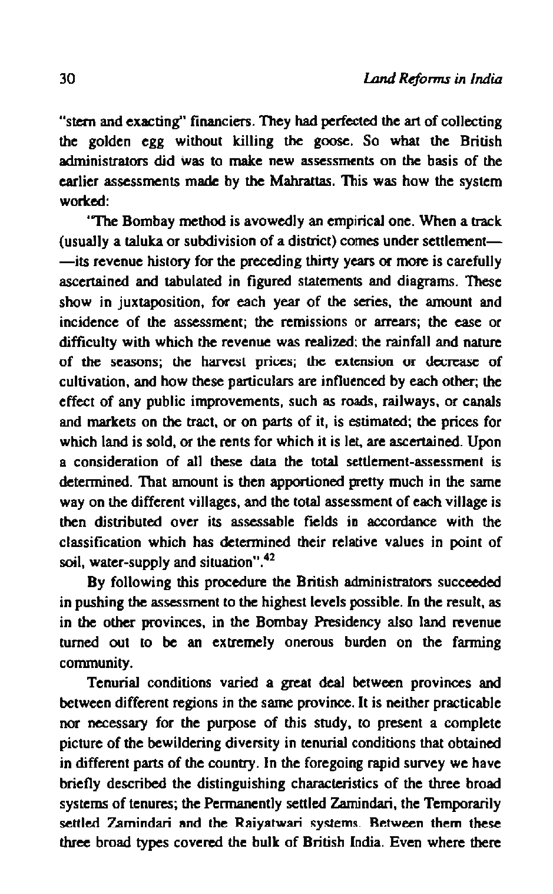

###### 30 Land Reforms in India

“stem and exacting*’ financiers. They had perfected the art of collecting the golden egg without killing the goose. So what the British administrators did was to make new assessments on the basis of the earlier assessments made by the Mahrattas. This was how the system worked:

“The Bombay method is avowedly an empirical one. When a track (usually a taluka or subdivision of a district) comes under settlement—its revenue history for the preceding thirty years or more is carefully ascertained and tabulated in figured statements and diagrams. These show in juxtaposition, for each year of the series, the amount and incidence of the assessment; the remissions or arrears; the ease or difficulty with which the revenue was realized; the rainfall and nature of the seasons; the harvest prices; the extension or decrease of cultivation, and how these particulars are influenced by each other; the effect of any public improvements, such as roads, railways, or canals and markets on the tract, or on parts of it, is estimated; the prices for which land is sold, or the rents for which it is let, are ascertained. Upon a consideration of all these data the total settlement-assessment is determined. That amount is then apportioned pretty much in the same way on the different villages, and the total assessment of each village is then distributed over its assessable fields in accordance with the classification which has determined their relative values in point of soil, water-supply and situation’*.42

By following this procedure the British administrators succeeded in pushing the assessment to the highest levels possible. In the result, as in the other provinces, in the Bombay Presidency also land revenue turned out to be an extremely onerous burden on the farming community.

Tenurial conditions varied a great deal between provinces and between different regions in the same province. It is neither practicable nor necessary for the purpose of this study, to present a complete picture of the bewildering diversity in tenurial conditions that obtained in different parts of the country. In the foregoing rapid survey we have briefly described the distinguishing characteristics of the three broad systems of tenures; the Permanently settled Zamindari, the Temporarily

settled Zamindari and the Raiyatwari systems. Between them these

three broad types covered the bulk of British India. Even where there

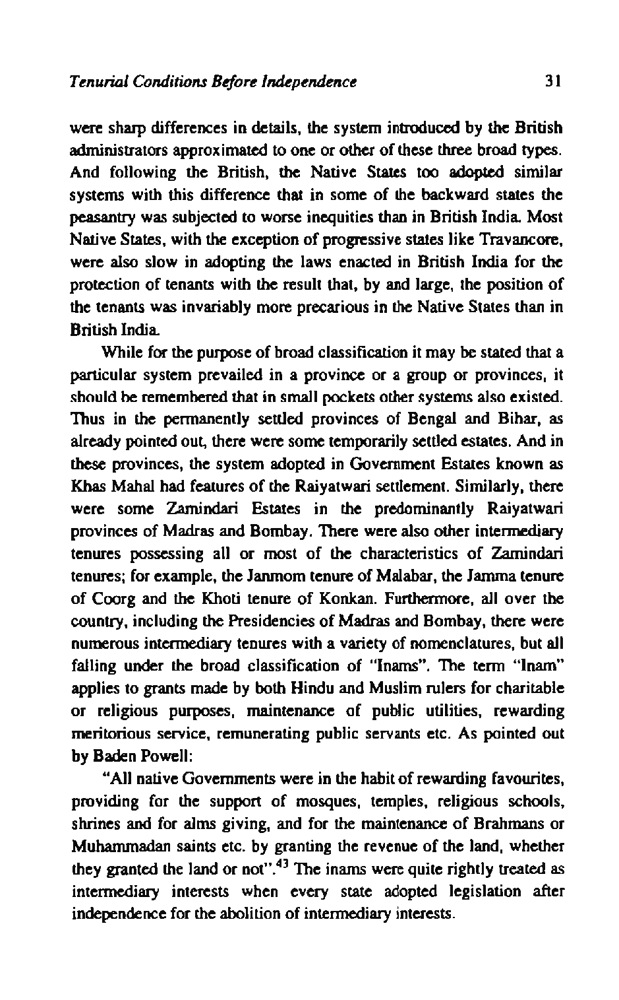

###### Tenurial Conditions Before Independence 31

were sharp differences in details, the system introduced by the British administrators approximated to one or other of these three broad types. And following the British, the Native States too adopted similar systems with this difference that in some of the backward states the peasantry was subjected to worse inequities than in British India. Most Native States, with the exception of progressive states like Travancore, were also slow in adopting the laws enacted in British India for the protection of tenants with the result that, by and large, the position of the tenants was invariably more precarious in the Native States than in British India.

While for the purpose of broad classification it may be stated that a particular system prevailed in a province or a group or provinces, it should be remembered that in small pockets other systems also existed. Thus in the permanently settled provinces of Bengal and Bihar, as already pointed out, there were some temporarily settled estates. And in these provinces, the system adopted in Government Estates known as Khas Mahal had features of the Raiyatwari settlement. Similarly, there were some Zamindari Estates in the predominantly Raiyatwari provinces of Madras and Bombay. There were also other intermediary tenures possessing all or most of the characteristics of Zamindari tenures; for example, the Janmom tenure of Malabar, the Jamma tenure of Coorg and the Khoti tenure of Konkan. Furthermore, all over the country, including the Presidencies of Madras and Bombay, there were numerous intermediary tenures with a variety of nomenclatures, but all falling under the broad classification of “Inams”. The term “Inam” applies to grants made by both Hindu and Muslim rulers for charitable or religious purposes, maintenance of public utilities, rewarding meritorious service, remunerating public servants etc. As pointed out by Baden Powell:

“All native Governments were in the habit of rewarding favourites, providing for the support of mosques, temples, religious schools, shrines and for alms giving, and for the maintenance of Brahmans or Muhammadan saints etc. by granting the revenue of the land, whether they granted the land or not”.43 The inams were quite rightly treated as intermediary interests when every state adopted legislation after independence for the abolition of intermediary interests.

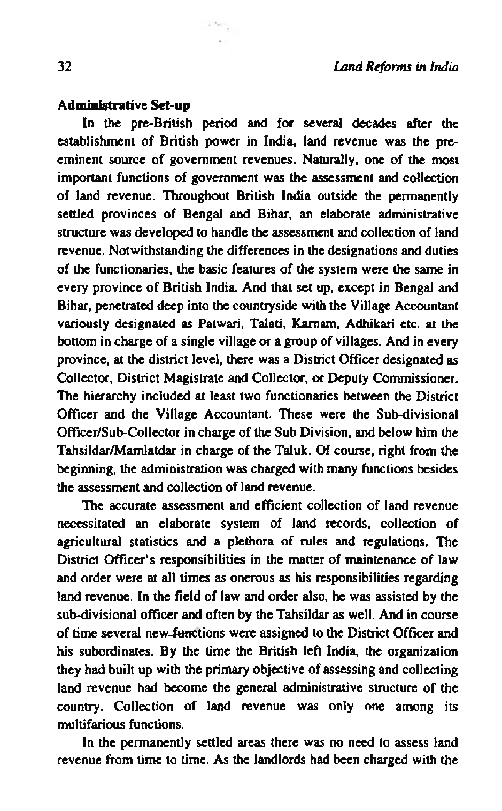

###### 32 Land Reforms in India

###### Administrative Set-up

In the pre-British period and for several decades after the establishment of British power in India, land revenue was the preeminent source of government revenues. Naturally, one of the most important functions of government was the assessment and collection of land revenue. Throughout British India outside the permanently settled provinces of Bengal and Bihar, an elaborate administrative structure was developed to handle the assessment and collection of land revenue. Notwithstanding the differences in the designations and duties of the functionaries, the basic features of the system were the same in every province of British India. And that set up, except in Bengal and Bihar, penetrated deep into the countryside with the Village Accountant variously designated as Patwari, Talati, Kamam, Adhikari etc. at the bottom in charge of a single village or a group of villages. And in every province, at the district level, there was a District Officer designated as Collector, District Magistrate and Collector, or Deputy Commissioner. The hierarchy included at least two functionaries between the District Officer and the Village Accountant. These were the Sub-divisional Officer/Sub-Col lector in charge of the Sub Division, and below him the Tahsildar/Mamlatdar in charge of the Taluk. Of course, right from the beginning, the administration was charged with many functions besides the assessment and collection of land revenue.

The accurate assessment and efficient collection of land revenue necessitated an elaborate system of land records, collection of agricultural statistics and a plethora of rules and regulations. The District Officer’s responsibilities in the matter of maintenance of law and order were at all times as onerous as his responsibilities regarding land revenue. In the field of law and order also, he was assisted by the sub-divisional officer and often by the Tahsildar as well. And in course of time several new-fonCtions were assigned to the District Officer and his subordinates. By the time the British left India, the organization they had built up with the primary objective of assessing and collecting land revenue had become the general administrative structure of the country. Collection of land revenue was only one among its multifarious functions.

In the permanently settled areas there was no need to assess land revenue from time to time. As the landlords had been charged with the

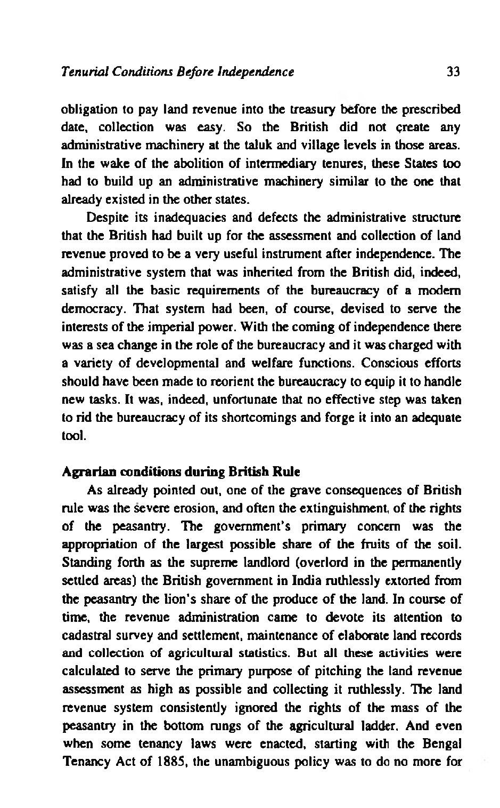

###### Tenurial Conditions Before Independence 33

obligation to pay land revenue into the treasury before the prescribed date, collection was easy. So the British did not preate any administrative machinery at the taluk and village levels in those areas. In the wake of the abolition of intermediary tenures, these States too had to build up an administrative machinery similar to the one that already existed in the other states.

Despite its inadequacies and defects the administrative structure that the British had built up for the assessment and collection of land revenue proved to be a very useful instrument after independence. The administrative system that was inherited from the British did, indeed, satisfy all the basic requirements of the bureaucracy of a modem democracy. That system had been, of course, devised to serve the interests of the imperial power. With the coming of independence there was a sea change in the role of the bureaucracy and it was charged with a variety of developmental and welfare functions. Conscious efforts should have been made to reorient the bureaucracy to equip it to handle new tasks. It was, indeed, unfortunate that no effective step was taken to rid the bureaucracy of its shortcomings and forge it into an adequate tool.

###### Agrarian conditions during British Rule

As already pointed out, one of the grave consequences of British rule was the severe erosion, and often the extinguishment, of the rights of the peasantry. The government’s primary concern was the appropriation of the largest possible share of the fruits of the soil. Standing forth as the supreme landlord (overlord in the permanently settled areas) the British government in India ruthlessly extorted from the peasantry the lion’s share of the produce of the land. In course of time, the revenue administration came to devote its attention to cadastral survey and settlement, maintenance of elaborate land records and collection of agricultural statistics. But all these activities were calculated to serve the primary purpose of pitching the land revenue assessment as high as possible and collecting it ruthlessly. The land revenue system consistently ignored the rights of the mass of the peasantry in the bottom rungs of the agricultural ladder. And even when some tenancy laws were enacted, starting with the Bengal Tenancy Act of 1885, the unambiguous policy was to do no more for

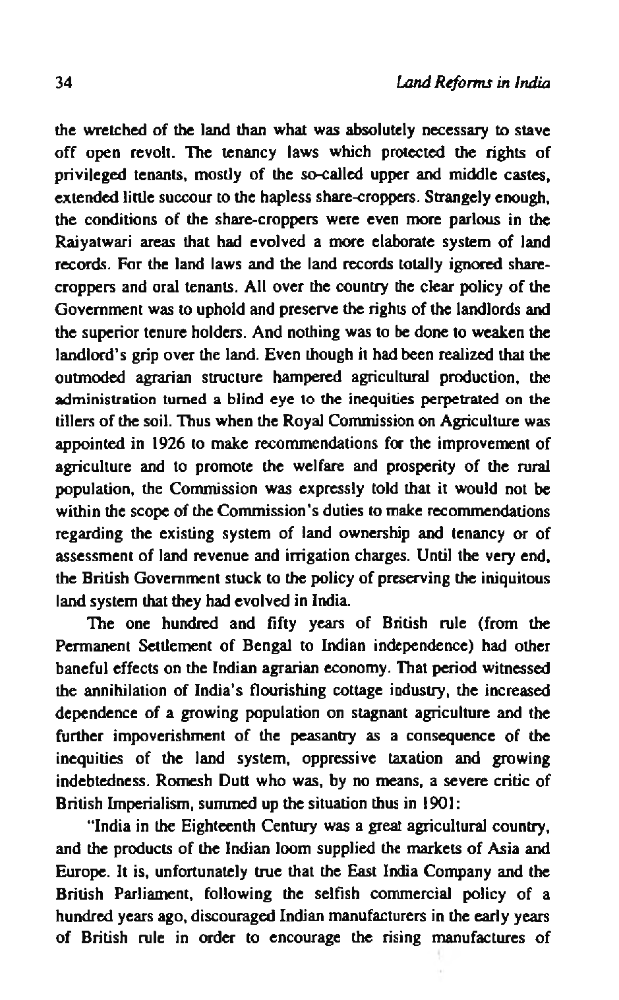

###### 34 Land Reforms in India

the wretched of the land than what was absolutely necessary to stave off open revolt. The tenancy laws which protected the rights of privileged tenants, mostly of the so-called upper and middle castes, extended little succour to the hapless share-croppers. Strangely enough, the conditions of the share-croppers were even more parlous in the Raiyatwari areas that had evolved a more elaborate system of land records. For the land laws and the land records totally ignored sharecroppers and oral tenants. All over the country the clear policy of the Government was to uphold and preserve the rights of the landlords and the superior tenure holders. And nothing was to be done to weaken the landlord’s grip over the land. Even though it had been realized that the outmoded agrarian structure hampered agricultural production, the administration turned a blind eye to the inequities perpetrated on the tillers of the soil. Thus when the Royal Commission on Agriculture was appointed in 1926 to make recommendations for the improvement of agriculture and to promote the welfare and prosperity of the rural population, the Commission was expressly told that it would not be within the scope of the Commission’s duties to make recommendations regarding the existing system of land ownership and tenancy or of assessment of land revenue and irrigation charges. Until the very end, the British Government stuck to the policy of preserving the iniquitous land system that they had evolved in India.

The one hundred and fifty years of British rule (from the Permanent Settlement of Bengal to Indian independence) had other baneful effects on the Indian agrarian economy. That period witnessed the annihilation of India’s flourishing cottage industry, the increased dependence of a growing population on stagnant agriculture and the further impoverishment of the peasantry as a consequence of the inequities of the land system, oppressive taxation and growing indebtedness. Romesh Dutt who was, by no means, a severe critic of British Imperialism, summed up the situation thus in 1901:

“India in the Eighteenth Century was a great agricultural country, and the products of the Indian loom supplied the markets of Asia and Europe. It is, unfortunately true that the East India Company and the British Parliament, following the selfish commercial policy of a hundred years ago, discouraged Indian manufacturers in the early years of British rule in order to encourage the rising manufactures of

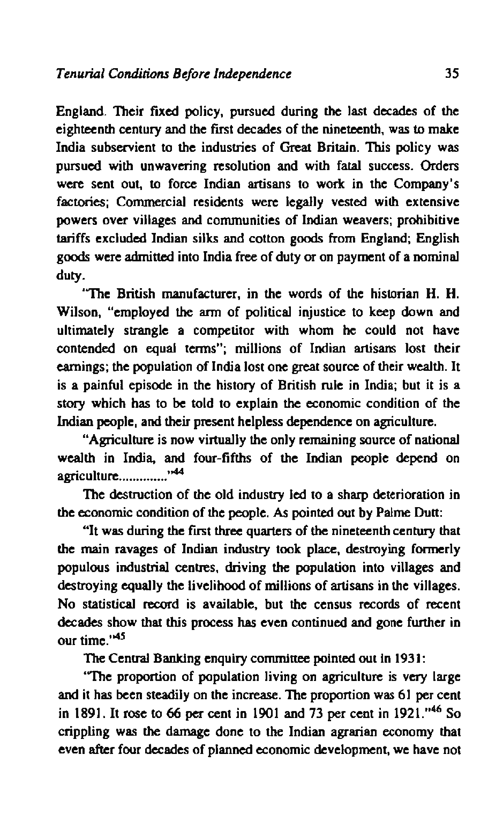

###### Tenurial Conditions Before Independence 35

England. Their fixed policy, pursued during the last decades of the eighteenth century and the first decades of the nineteenth, was to make India subservient to the industries of Great Britain. This policy was pursued with unwavering resolution and with fatal success. Orders were sent out, to force Indian artisans to work in the Company’s factories; Commercial residents were legally vested with extensive powers over villages and communities of Indian weavers; prohibitive tariffs excluded Indian silks and cotton goods from England; English goods were admitted into India free of duty or on payment of a nominal duty.

“The British manufacturer, in the words of the historian H. H. Wilson, “employed the arm of political injustice to keep down and ultimately strangle a competitor with whom he could not have contended on equal terms”; millions of Indian artisans lost their earnings; the population of India lost one great source of their wealth. It is a painful episode in the history of British rule in India; but it is a story which has to be told to explain the economic condition of the Indian people, and their present helpless dependence on agriculture.

“Agriculture is now virtually the only remaining source of national wealth in India, and four-fifths of the Indian people depend on agriculture...............”44

The destruction of the old industry led to a sharp deterioration in the economic condition of the people. As pointed out by Palme Dutt:

“It was during the first three quarters of the nineteenth century that the main ravages of Indian industry took place, destroying formerly populous industrial centres, driving the population into villages and destroying equally the livelihood of millions of artisans in the villages. No statistical record is available, but the census records of recent decades show that this process has even continued and gone further in our time.”45

The Central Banking enquiry committee pointed out in 1931: “The proportion of population living on agriculture is very large and it has been steadily on the increase. The proportion was 61 per cent in 1891. It rose to 66 per cent in 1901 and 73 per cent in 1921.”46 So crippling was the damage done to the Indian agrarian economy that even after four decades of planned economic development, we have not

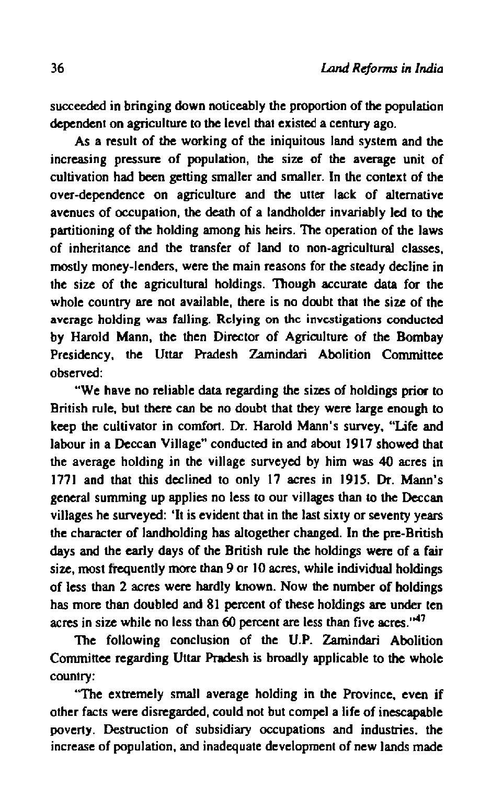

###### 36 Land Reforms in India

succeeded in bringing down noticeably the proportion of the population dependent on agriculture to the level that existed a century ago.

As a result of the working of the iniquitous land system and the increasing pressure of population, the size of the average unit of cultivation had been getting smaller and smaller. In the context of the over-dependence on agriculture and the utter lack of alternative avenues of occupation, the death of a landholder invariably led to the partitioning of the holding among his heirs. The operation of the laws of inheritance and the transfer of land to non-agricultural classes, mostly money-lenders, were the main reasons for the steady decline in the size of the agricultural holdings. Though accurate data for the whole country are not available, there is no doubt that the size of the average holding was falling. Relying on the investigations conducted by Harold Mann, the then Director of Agriculture of the Bombay Presidency, the Uttar Pradesh Zamindari Abolition Committee observed:

“We have no reliable data regarding the sizes of holdings prior to British rule, but there can be no doubt that they were large enough to keep the cultivator in comfort. Dr. Harold Mann’s survey, “Life and labour in a Deccan Village” conducted in and about 1917 showed that the average holding in the village surveyed by him was 40 acres in 1771 and that this declined to only 17 acres in 1915. Dr. Mann’s general summing up applies no less to our villages than to the Deccan villages he surveyed: ‘It is evident that in the last sixty or seventy years the character of landholding has altogether changed. In the pre-British days and the early days of the British rule the holdings were of a fair size, most frequently more than 9 or 10 acres, while individual holdings of less than 2 acres were hardly known. Now the number of holdings has more than doubled and 81 percent of these holdings are under ten acres in size while no less than 60 percent are less than five acres.”47

The following conclusion of the U.P. Zamindari Abolition Committee regarding Uttar Pradesh is broadly applicable to the whole country:

“The extremely small average holding in the Province, even if other facts were disregarded, could not but compel a life of inescapable poverty. Destruction of subsidiary occupations and industries, the increase of population, and inadequate development of new lands made

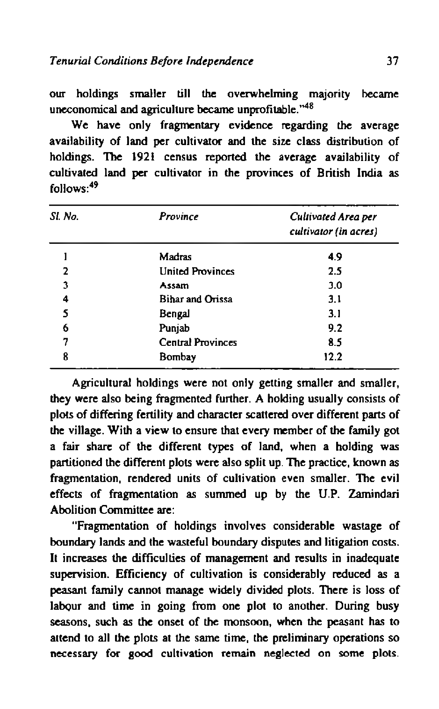

###### Tenurial Conditions Before Independence 37

our holdings smaller till the overwhelming majority became uneconomical and agriculture became unprofitable.”48

We have only fragmentary evidence regarding the average availability of land per cultivator and the size class distribution of holdings. The 1921 census reported the average availability of cultivated land per cultivator in the provinces of British India as follows:49

Si No. Province Cultivated Area per cultivator (in acres)

- 1 Madras 4.9
- 2 United Provinces 2.5
- 3 Assam 3.0
- 4 Bihar and Orissa 3.1
- 5 Bengal 3.1
- 6 Punjab 9.2
- 7 Central Provinces 8.5
- 8 Bombay 12.2

Agricultural holdings were not only getting smaller and smaller, they were also being fragmented further. A holding usually consists of plots of differing fertility and character scattered over different parts of the village. With a view to ensure that every member of the family got a fair share of the different types of land, when a holding was partitioned the different plots were also split up. The practice, known as fragmentation, rendered units of cultivation even smaller. The evil effects of fragmentation as summed up by the U.P. Zamindari Abolition Committee are:

“Fragmentation of holdings involves considerable wastage of boundary lands and the wasteful boundary disputes and litigation costs. It increases the difficulties of management and results in inadequate supervision. Efficiency of cultivation is considerably reduced as a peasant family cannot manage widely divided plots. There is loss of labour and time in going from one plot to another. During busy seasons, such as the onset of the monsoon, when the peasant has to attend to all the plots at the same time, the preliminary operations so

necessary for good cultivation remain neglected on some plots.

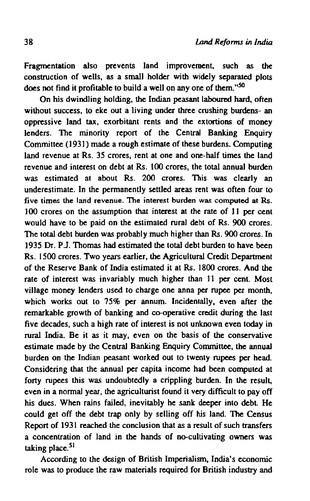

###### 38 Land Reforms in India

Fragmentation also prevents land improvement, such as the construction of wells, as a small holder with widely separated plots does not find it profitable to build a well on any one of them.”50

On his dwindling holding, the Indian peasant laboured hard, often without success, to eke out a living under three crushing burdens- an oppressive land tax, exorbitant rents and the extortions of money lenders. The minority report of the Central Banking Enquiry Committee (1931) made a rough estimate of these burdens. Computing land revenue at Rs. 35 crores, rent at one and one-half times the land revenue and interest on debt at Rs. 100 crores, the total annual burden was estimated at about Rs. 200 crores. This was clearly an underestimate. In the permanently settled areas rent was often four to five times the land revenue. The interest burden was computed at Rs. 100 crores on the assumption that interest at the rate of 11 per cent would have to be paid on the estimated rural debt of Rs. 900 crores. The total debt burden was probably much higher than Rs. 900 crores. In 1935 Dr. P.J. Thomas had estimated the total debt burden to have been Rs. 1500 crores. Two years earlier, the Agricultural Credit Department of the Reserve Bank of India estimated it at Rs. 1800 crores. And the rate of interest was invariably much higher than 11 per cent. Most village money lenders used to charge one anna per rupee per month, which works out to 75% per annum. Incidentally, even after the remarkable growth of banking and co-operative credit during the last five decades, such a high rate of interest is not unknown even today in rural India. Be it as it may, even on the basis of the conservative estimate made by the Central Banking Enquiry Committee, the annual burden on the Indian peasant worked out to twenty rupees per head. Considering that the annual per capita income had been computed at forty rupees this was undoubtedly a crippling burden. In the result, even in a normal year, the agriculturist found it very difficult to pay off his dues. When rains failed, inevitably he sank deeper into debt. He could get off the debt trap only by selling off his land. The Census Report of 1931 reached the conclusion that as a result of such transfers a concentration of land in the hands of no-cultivating owners was taking place.51

According to the design of British Imperialism, India’s economic role was to produce the raw materials required for British industry and

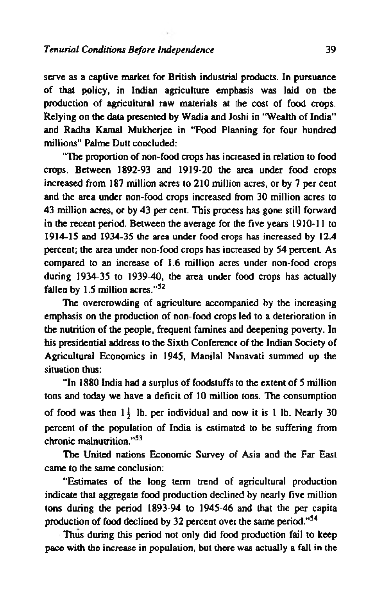

###### Tenurial Conditions Before Independence 39

serve as a captive market for British industrial products. In pursuance of that policy, in Indian agriculture emphasis was laid on the production of agricultural raw materials at the cost of food crops. Relying on the data presented by Wadia and Joshi in “Wealth of India” and Radha Kamal Mukheijee in “Food Planning for four hundred millions” Palme Dutt concluded:

“The proportion of non-food crops has increased in relation to food crops. Between 1892-93 and 1919-20 the area under food crops increased from 187 million acres to 210 million acres, or by 7 per cent and the area under non-food crops increased from 30 million acres to 43 million acres, or by 43 per cent. This process has gone still forward in the recent period. Between the average for the five years 1910-11 to 1914-15 and 1934-35 the area under food crops has increased by 12.4 percent; the area under non-food crops has increased by 54 percent. As compared to an increase of 1.6 million acres under non-food crops during 1934-35 to 1939-40, the area under food crops has actually fallen by 1.5 million acres.”52

The overcrowding of agriculture accompanied by the increasing emphasis on the production of non-food crops led to a deterioration in the nutrition of the people, frequent famines and deepening poverty. In his presidential address to the Sixth Conference of the Indian Society of Agricultural Economics in 1945, Manilal Nanavati summed up the situation thus:

“In 1880 India had a surplus of foodstuffs to the extent of 5 million tons and today we have a deficit of 10 million tons. The consumption of food was then 1 £ lb. per individual and now it is 1 lb. Nearly 30 percent of the population of India is estimated to be suffering from chronic malnutrition.”53

The United nations Economic Survey of Asia and the Far East came to the same conclusion:

“Estimates of the long term trend of agricultural production indicate that aggregate food production declined by nearly five million tons during the period 1893-94 to 1945-46 and that the per capita production of food declined by 32 percent over the same period.”54

Thus during this period not only did food production fail to keep pace with the increase in population, but there was actually a fall in the

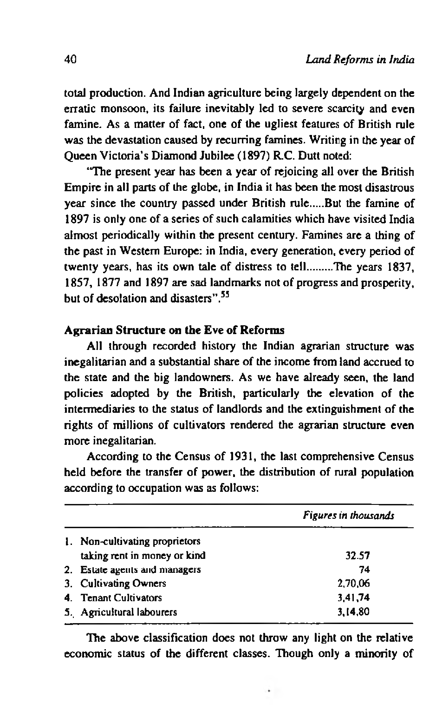

###### 40 Land Reforms in India

total production. And Indian agriculture being largely dependent on the erratic monsoon, its failure inevitably led to severe scarcity and even famine. As a matter of fact, one of the ugliest features of British rule was the devastation caused by recurring famines. Writing in the year of Queen Victoria’s Diamond Jubilee (1897) R.C. Dutt noted:

“The present year has been a year of rejoicing all over the British Empire in all parts of the globe, in India it has been the most disastrous year since the country passed under British rule....But the famine of 1897 is only one of a series of such calamities which have visited India almost periodically within the present century. Famines are a thing of the past in Western Europe: in India, every generation, every period of twenty years, has its own tale of distress to tell.........The years 1837, 1857, 1877 and 1897 are sad landmarks not of progress and prosperity, but of desolation and disasters”.55

###### Agrarian Structure on the Eve of Reforms

All through recorded history the Indian agrarian structure was inegalitarian and a substantial share of the income from land accrued to the state and the big landowners. As we have already seen, the land policies adopted by the British, particularly the elevation of the intermediaries to the status of landlords and the extinguishment of the rights of millions of cultivators rendered the agrarian structure even more inegalitarian.

According to the Census of 1931, the last comprehensive Census held before the transfer of power, the distribution of rural population according to occupation was as follows:

Figures in thousands

- 1. Non-cultivating proprietors taking rent in money or kind 32.57
- 2. Estate agents and managers 74
- 3. Cultivating Owners 2,70,06
- 4. Tenant Cultivators 3,41,74
- 5.. Agricultural labourers 3,14,80

The above classification does not throw any light on the relative economic status of the different classes. Though only a minority of

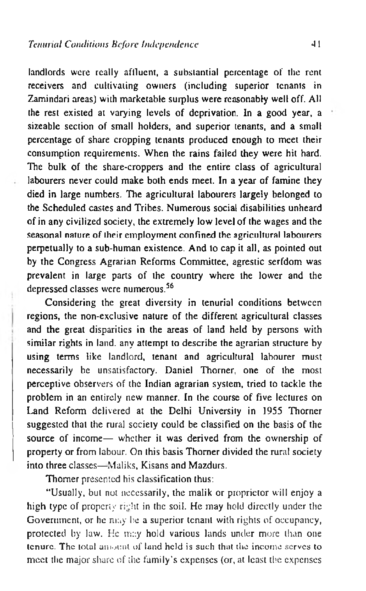

Tennrial Conditions Before Independence 41

landlords were really affluent, a substantial percentage of the rent receivers and cultivating owners (including superior tenants in Zamindari areas) with marketable surplus were reasonably well off. All the rest existed at varying levels of deprivation. In a good year, a sizeable section of small holders, and superior tenants, and a small percentage of share cropping tenants produced enough to meet their consumption requirements. When the rains failed they were hit hard. The bulk of the share-croppers and the entire class of agricultural labourers never could make both ends meet. In a year of famine they died in large numbers. The agricultural labourers largely belonged to the Scheduled castes and Tribes. Numerous social disabilities unheard of in any civilized society, the extremely low level of the wages and the seasonal nature of their employment confined the agricultural labourers perpetually to a sub-human existence. And to cap it all, as pointed out by the Congress Agrarian Reforms Committee, agrestic serfdom was prevalent in large parts of the country where the lower and the depressed classes were numerous.56

Considering the great diversity in tenurial conditions between regions, the non-exclusive nature of the different agricultural classes and the great disparities in the areas of land held by persons with similar rights in land, any attempt to describe the agrarian structure by using terms like landlord, tenant and agricultural labourer must necessarily be unsatisfactory. Daniel Thorner, one of the most perceptive observers of the Indian agrarian system, tried to tackle the problem in an entirely new manner. In the course of five lectures on Land Reform delivered at the Delhi University in 1955 Thorner suggested that the rural society could be classified on the basis of the source of income— whether it was derived from the ownership of property or from labour. On this basis Thorner divided the rural society into three classes—Maliks, Kisans and Mazdurs.

Thorner presented his classification thus:

“Usually, but not necessarily, the malik or proprietor will enjoy a high type of property rijrht in the soil. He may hold directly under the Government, or he may he a superior tenant with rights of occupancy, protected by law. He m:iy hold various lands under more than one tenure. The total amount of land held is such that the income serves to meet the major share of the family’s expenses (or, at least the expenses

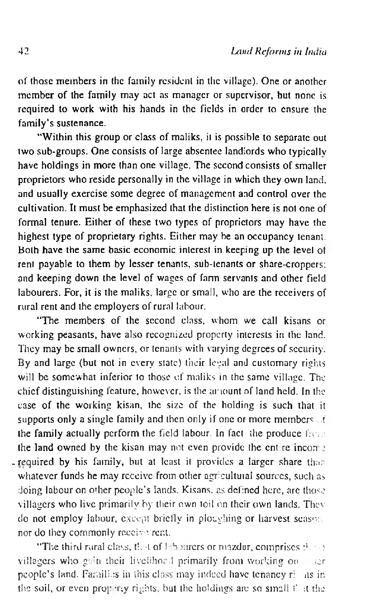

42 Land Reforms in India

of those members in the family resident in the village). One or another member of the family may act as manager or supervisor, but none is required to work with his hands in the fields in order to ensure the family’s sustenance.

“Within this group or class of maliks, it is possible to separate out two sub-groups. One consists of large absentee landlords who typically have holdings in more than one village. The second consists of smaller proprietors who reside personally in the village in which they own land, and usually exercise some degree of management and control over the cultivation. It must be emphasized that the distinction here is not one of formal tenure. Either of these two types of proprietors may have the highest type of proprietary rights. Either may be an occupancy tenant. Both have the same basic economic interest in keeping up the level ot rent payable to them by lesser tenants, sub-tenants or share-croppers: and keeping down the level of wages of farm servants and other field labourers. For, it is the maliks, large or small, who are the receivers of rural rent and the employers of rural labour.

“The members of the second class, whom we call kisans or working peasants, have also recognized property interests in the land. They may be small owners, or tenants with varying degrees of security. By and large (but not in every state) their levial and customary rights will be somewhat inferior to those of maliks in the same village. The chief distinguishing feature, however, is the amount of land held. In the ease of the working kisan, the size of the holding is such that it supports only a single family and then only if one or more members . r the family actually perform the field labour. In fact the produce i'm:. the land owned by the kisan may not even provide the entire incon -required by his family, but at least it provides a larger share thar whatever funds he may receive from other agricultural sources, such as doing labour on other people’s lands. Kisans. as defined here, are thos? villagers who live primarily by their own toil on their own lands. They c!o not employ labour, except briefly in ploughing or harvest season nor do they commonly receive rent.

“The third rural class, t!;:*t o f ! b .nircrs or mazdur, comprises *.,f. • •; villagers who gain ibeii livciihoe-.l primarily from working on .«¿r people’s land. Families in this class may indeed have tenancy r: its in the soil, or even properly rights, but the holdings aie so small {' ;t the

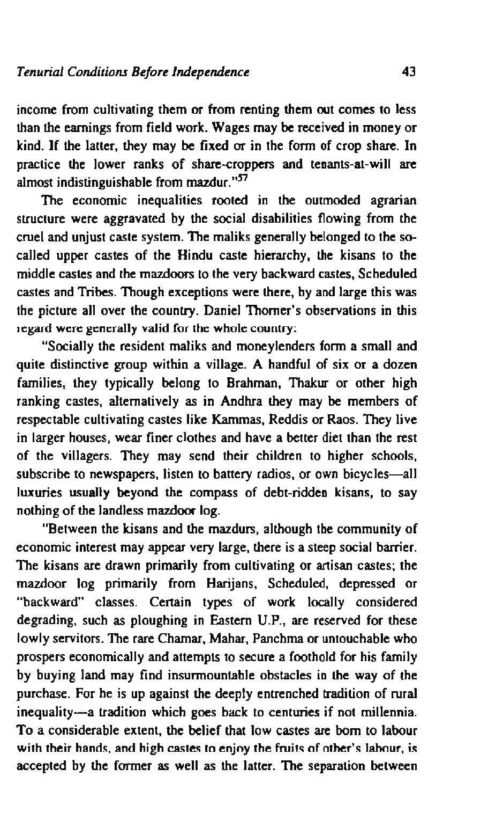

###### Tenurial Conditions Before Independence 43

income from cultivating them or from renting them out comes to less than the earnings from field work. Wages may be received in money or kind. If the latter, they may be fixed or in the form of crop share. In practice the lower ranks of share-croppers and tenants-at-will are almost indistinguishable from mazdur.”57

The economic inequalities rooted in the outmoded agrarian structure were aggravated by the social disabilities flowing from the cruel and unjust caste system. The maliks generally belonged to the socalled upper castes of the Hindu caste hierarchy, the kisans to the middle castes and the mazdoors to the very backward castes, Scheduled castes and Tribes. Though exceptions were there, by and large this was the picture all over the country. Daniel Thomer’s observations in this regard were generally valid for the whole country:

“Socially the resident maliks and moneylenders form a small and quite distinctive group within a village. A handful of six or a dozen families, they typically belong to Brahman, Thakur or other high ranking castes, alternatively as in Andhra they may be members of respectable cultivating castes like Kammas, Reddis or Raos. They live in larger houses, wear finer clothes and have a better diet than the rest of the villagers. They may send their children to higher schools, subscribe to newspapers, listen to battery radios, or own bicycles—all luxuries usually beyond the compass of debt-ridden kisans, to say nothing of the landless mazdoor log.

“Between the kisans and the mazdurs, although the community of economic interest may appear very large, there is a steep social barrier. The kisans are drawn primarily from cultivating or artisan castes; the mazdoor log primarily from Harijans, Scheduled, depressed or “backward” classes. Certain types of work locally considered degrading, such as ploughing in Eastern U.F., are reserved for these lowly servitors. The rare Chamar, Mahar, Panchma or untouchable who prospers economically and attempts to secure a foothold for his family by buying land may find insurmountable obstacles in the way of the purchase. For he is up against the deeply entrenched tradition of rural inequality—a tradition which goes back to centuries if not millennia. To a considerable extent, the belief that low castes are bom to labour with their hands, and high castes to enjoy the fruits of other’s lahour, is accepted by the former as well as the latter. The separation between

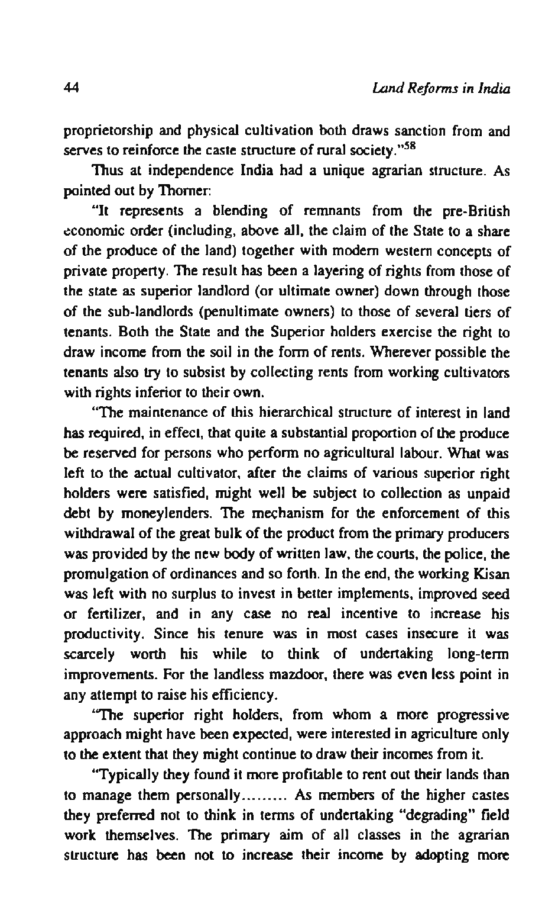

###### 44 Land Reforms in India

proprietorship and physical cultivation both draws sanction from and serves to reinforce the caste structure of rural society.”58

Thus at independence India had a unique agrarian structure. As pointed out by Thomer:

“It represents a blending of remnants from the pre-British economic order (including, above all, the claim of the State to a share of the produce of the land) together with modem western concepts of private property. The result has been a layering of rights from those of the state as superior landlord (or ultimate owner) down through those of the sub-landlords (penultimate owners) to those of several tiers of tenants. Both the State and the Superior holders exercise the right to draw income from the soil in the form of rents. Wherever possible the tenants also try to subsist by collecting rents from working cultivators with rights inferior to their own.

“The maintenance of this hierarchical structure of interest in land has required, in effect, that quite a substantial proportion of the produce be reserved for persons who perform no agricultural labour. What was left to the actual cultivator, after the claims of various superior right holders were satisfied, might well be subject to collection as unpaid debt by moneylenders. The mechanism for the enforcement of this withdrawal of the great bulk of the product from the primary producers was provided by the new body of written law, the courts, the police, the promulgation of ordinances and so forth. In the end, the working Kisan was left with no surplus to invest in better implements, improved seed or fertilizer, and in any case no real incentive to increase his productivity. Since his tenure was in most cases insecure it was scarcely worth his while to think of undertaking long-term improvements. For the landless mazdoor, there was even less point in any attempt to raise his efficiency.

“The superior right holders, from whom a more progressive approach might have been expected, were interested in agriculture only to the extent that they might continue to draw their incomes from it.

“Typically they found it more profitable to rent out their lands than to manage them personally........... As members of the higher castes they preferred not to think in terms of undertaking “degrading” field work themselves. The primary aim of all classes in the agrarian structure has been not to increase their income by adopting more

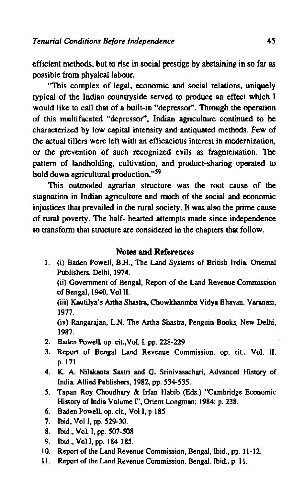

###### Tenurial Conditions Before Independence 45

efficient methods, but to rise in social prestige by abstaining in so far as possible from physical labour.

‘This complex of legal, economic and social relations, uniquely typical of the Indian countryside served to produce an effect which I would like to call that of a built-in “depressor”. Through the operation of this multifaceted “depressor”, Indian agriculture continued to be characterized by low capital intensity and antiquated methods. Few of the actual tillers were left with an efficacious interest in modernization, or the prevention of such recognized evils as fragmentation. The pattern of landholding, cultivation, and product-sharing operated to hold down agricultural production.”59

This outmoded agrarian structure was the root cause of the stagnation in Indian agriculture and much of the social and economic injustices that prevailed in the rural society. It was also the prime cause of rural poverty. The half- hearted attempts made since independence to transform that structure are considered in the chapters that follow.

###### Notes and References

- 1. (i) Baden Powell, B.H., The Land Systems of British India, Oriental Publishers, Delhi, 1974.

- (ii) Government of Bengal, Report of the Land Revenue Commission of Bengal, 1940, Vol II.
- (iii) Kautilya’s Artha Shastra, Chowkhanmba Vidya Bhavan, Varanasi, 1977.
- (iv) Rangarajan, L.N. The Artha Shastra, Penguin Books, New Delhi, 1987.

- 2. Baden Powell, op. ciL.VoI. I, pp. 228-229
- 3. Report of Bengal Land Revenue Commission, op. cit.. Vol. II, p. 171
- 4. K. A. Nilakanta Sastri and G. Srinivasachari, Advanced History of India. Allied Publishers, 1982, pp. 534-535.
- 5. Tapan Roy Choudhary & Irfan Habib (Eds.) “Cambridge Economic History of India Volume I”, Orient Longman; 1984; p. 238.
- 6. Baden Powell, op. cit., Vol I, p 185
- 7. Ibid, Vol I, pp. 529-30.
- 8. Ibid., Vol. I, pp. 507-508
- 9. Ibid., Vol I, pp. 184-185.
- 10. Report of the Land Revenue Commission, Bengal, Ibid., pp. 11-12.
- 11. Report of the Land Revenue Commission, Bengal, Ibid., p. 11.

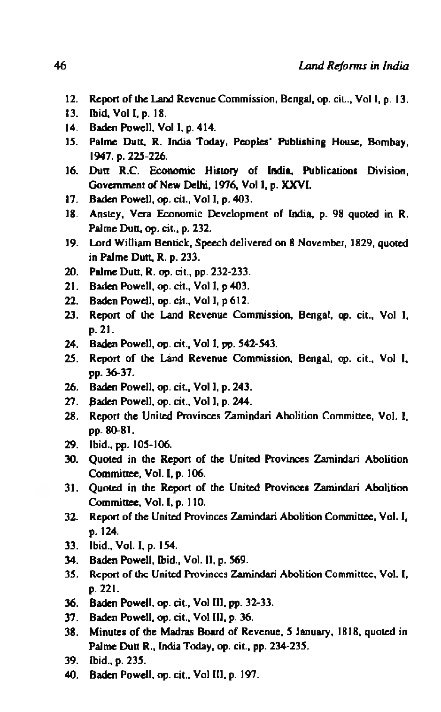

###### 46 Land Reforms in India

- 12. Report of the Land Revenue Commission, Bengal, op. ciL., Vol I, p. 13.
- 13. Ibid, Vol I, p. 18.
- 14. Baden Powell, Vol I, p. 414.
- 15. Palme Dutt, R. India Today, Peoples’ Publishing House, Bombay,

1947. p. 225-226.

- 16. Dutr R.C. Economic History of India, Publications Division, Government of New Delhi, 1976, Vol I, p. XXVI
- 17. Baden Powell, op. cit., Vol I, p. 403.
- 18. Anstey, Vera Economic Development of India, p. 98 quoted in R. Palme Dutt, op. cit., p. 232.
- 19. Lord William Bentick, Speech delivered on 8 November, 1829, quoted in Palme Dutt, R. p. 233.
- 20. Palme Dutt, R. op. cit., pp. 232-233.
- 21. Baden Powell, op. cit., Vol I, p 403.
- 22. Baden Powell, op. cit., Vol I, p 612.
- 23. Report of the Land Revenue Commission, Bengal, op. cit., Vol I, p. 21.
- 24. Baden Powell, op. cit., Vol I, pp. 542-543.
- 25. Report of the Land Revenue Commission, Bengal, op. cit., Vol I, pp. 36-37.
- 26. Baden Powell, op. cit., Vol I, p. 243.
- 27. 3aden Powell, op. cit., Vol I, p. 244.
- 28. Report the United Provinces Zamindari Abolition Committee, Vol. I, pp. 80-81.
- 29. Ibid., pp. 105-106.
- 30. Quoted in the Report of the United Provinces Zamindari Abolition Committee, Vol. I, p. 106.
- 31. Quoted in the Report of the United Provinces Zamindari Abolition Committee, Vol. I, p. 110.
- 32. Report of the United Provinces Zamindari Abolition Committee, Vol. I, p. 124.
- 33. Ibid., Vol. I, p. 154.
- 34. Baden Powell, Ibid., Vol. II, p. 569.
- 35. Report o f the United Provinces Zam indari Abolition Com m ittee, Vol. I, p. 221.
- 36. Baden Powell, op. cit., Vol III, pp. 32-33.
- 37. Baden Powell, op. cit., Vol III, p. 36.
- 38. Minutes of the Madras Board of Revenue, 5 January, 1818, quoted in Palme Dutt R., India Today, op. cit., pp. 234-235.
- 39. Ibid.. p. 235.
- 40. Baden Powell, op. cit., Vol III, p. 197.

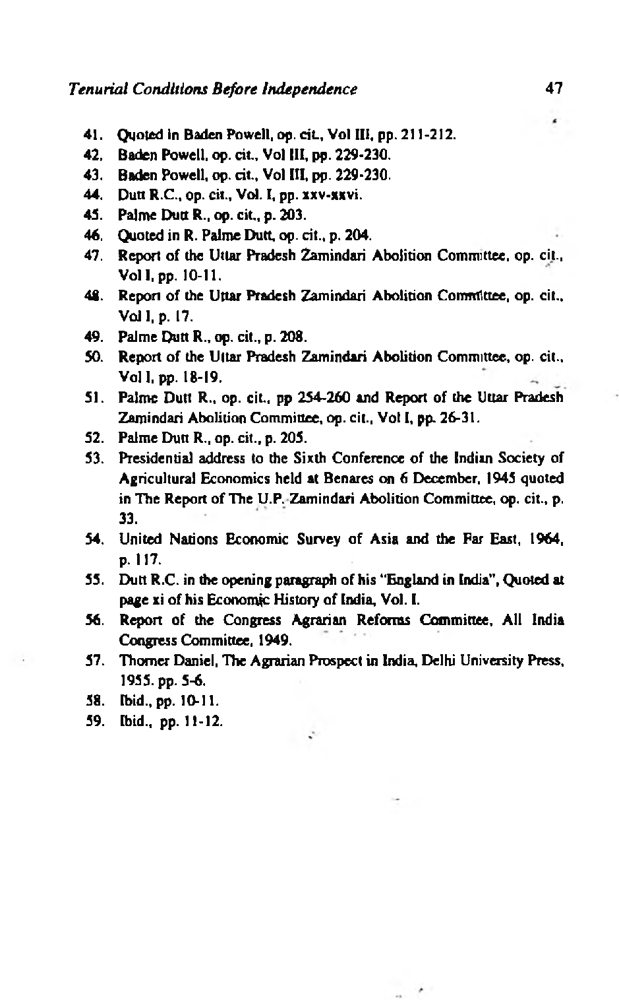

###### Tenurial Conditions Before Independence 47

- 41. Qgoted in Baden Powell, op. cit, Vol III. pp. 211-212.
- 42. Baden Powell, op. cit., Vol III, pp. 229-230.
- 43. Baden Powell, op. cit., Vol III, pp. 229-230.
- 44. Dutt R.C., op. cit.. Vol. I, pp. xxv-xxvi.
- 45. Palme Dutt R., op. cit., p. 203.
- 46. Quoted in R. Palme Dutt, op. cit., p. 204.
- 47. Report of the Uttar Pradesh Zamindari Abolition Committee, op. cit., Vol I, pp. 10-11.

4*. Report of the Uttar Pradesh Zamindari Abolition Committee, op. cit., Vol I, p. 17.

- 49. Palme Dutt R., op. cit., p. 208.
- 50. Report of the Uttar Pradesh Zamindari Abolition Committee, op. cit., Vol I, pp. 18-19.
- 51. Palme Dutt R., op. cit., pp 254-260 and Report of the Uttar Pradesh Zamindari Abolition Committee, op. cit., Vol I, pp. 26-31.
- 52. Palme Dutt R., op. cit., p. 205.
- 53. Presidential address to the Sixth Conference of the Indian Society of Agricultural Economics held at Benares on 6 December, 1945 quoted in The Report of The U.P. Zamindari Abolition Committee, op. cit., p. 33.
- 54. United Nations Economic Survey of Asia and the Far East, 1964, p. 117.
- 55. Dutt R.C. in the opening paragraph of his “England in India", Quoted at page xi of his Economic History of India, Vol. I.
- 56. Report of the Congress Agrarian Reforms Committee, All India Congress Committee, 1949.
- 57. Thomer Daniel, The Agrarian Prospect in India, Delhi University Press,

1955. pp. 5-6.

- 58. Ibid., pp. 10-11.
- 59. Ibid., pp. 11-12.

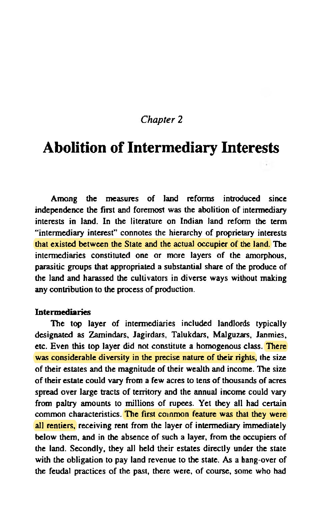

###### Chapter 2

### Abolition of Intermediary Interests

Among the measures of land reforms introduced since independence the first and foremost was the abolition of intermediary interests in land. In the literature on Indian land reform the term “intermediary interest” connotes the hierarchy of proprietary interests that existed between the State and the actual occupier of the land. The intermediaries constituted one or more layers of the amorphous, parasitic groups that appropriated a substantial share of the produce of the land and harassed the cultivators in diverse ways without making any contribution to the process of production.

###### Intermediaries

The top layer of intermediaries included landlords typically designated as Zamindars, Jagirdars, Talukdars, Malguzars, Janmies, etc. Even this top layer did not constitute a homogenous class. There was considerable diversity in the precise nature of their rights, the size of their estates and the magnitude of their wealth and income. The size of their estate could vary from a few acres to tens of thousands of acres spread over large tracts of territory and the annual income could vary from paltry amounts to millions of rupees. Yet they all had certain common characteristics. The first common feature was that they were all rentiers, receiving rent from the layer of intermediary immediately below them, and in the absence of such a layer, from the occupiers of the land. Secondly, they all held their estates directly under the state with the obligation to pay land revenue to the state. As a hang-over of the feudal practices of the past, there were, of course, some who had

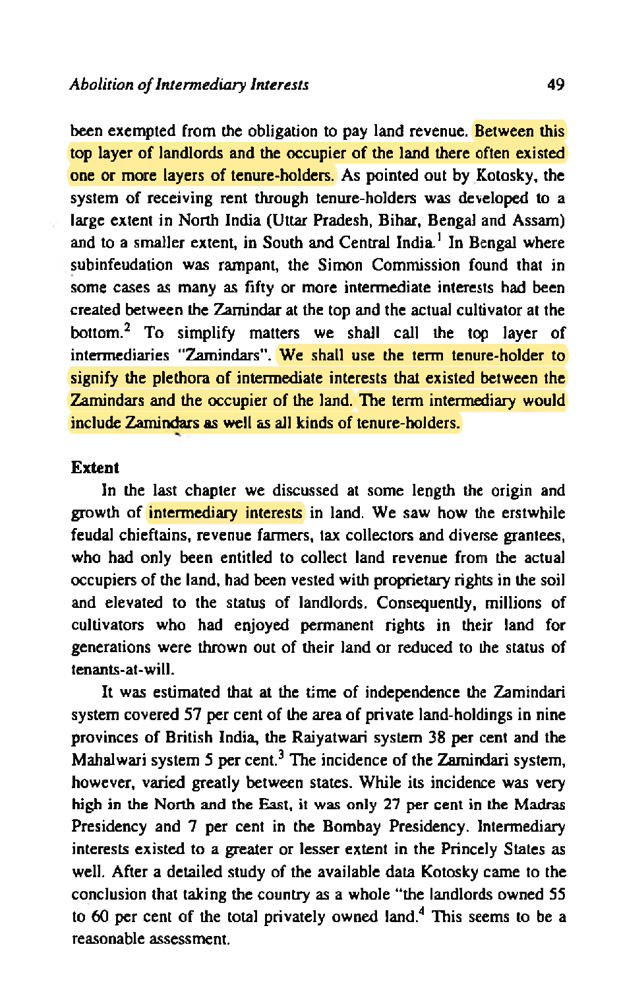

###### Abolition of Intermediary Interests 49

been exempted from the obligation to pay land revenue. Between this top layer of landlords and the occupier of the land there often existed one or more layers of tenure-holders. As pointed out by Kotosky, the system of receiving rent through tenure-holders was developed to a large extent in North India (Uttar Pradesh, Bihar, Bengal and Assam) and to a smaller extent, in South and Central India.1 In Bengal where subinfeudation was rampant, the Simon Commission found that in some cases as many as fifty or more intermediate interests had been created between the Zamindar at the top and the actual cultivator at the bottom.2 To simplify matters we shall call the top layer of intermediaries “Zamindars”. We shall use the term tenure-holder to signify the plethora of intermediate interests that existed between the Zamindars and the occupier of the land. The term intermediary would include Zamindars as well as all kinds of tenure-holders.

###### Extent

In the last chapter we discussed at some length the origin and growth of intermediary interests in land. We saw how the erstwhile feudal chieftains, revenue farmers, tax collectors and diverse grantees, who had only been entitled to collect land revenue from the actual occupiers of the land, had been vested with proprietary rights in the soil and elevated to the status of landlords. Consequently, millions of cultivators who had enjoyed permanent rights in their land for generations were thrown out of their land or reduced to the status of tenants-at-will.

It was estimated that at the time of independence the Zamindari system covered 57 per cent of the area of private land-holdings in nine provinces of British India, the Raiyatwari system 38 per cent and the Mahalwari system 5 per cent.3 The incidence of the Zamindari system, however, varied greatly between states. While its incidence was very high in the North and the East, it was only 27 per cent in the Madras Presidency and 7 per cent in the Bombay Presidency. Intermediary interests existed to a greater or lesser extent in the Princely States as well. After a detailed study of the available data Kotosky came to the conclusion that taking the country as a whole “the landlords owned 55 to 60 per cent of the total privately owned land.4 This seems to be a reasonable assessment.

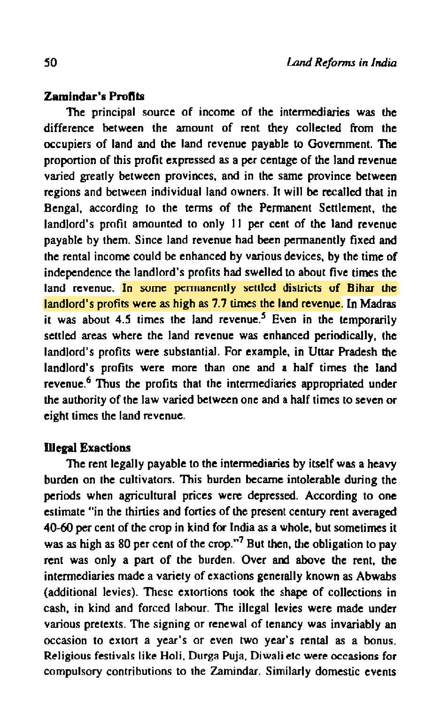

###### 50 Land Reforms in India

###### Zamindar’s Profits

The principal source of income of the intermediaries was the difference between the amount of rent they collected from the occupiers of land and the land revenue payable to Government. The proportion of this profit expressed as a per centage of the land revenue varied greatly between provinces, and in the same province between regions and between individual land owners. It will be recalled that in Bengal, according to the terms of the Permanent Settlement, the landlord’s profit amounted to only 11 per cent of the land revenue payable by them. Since land revenue had been permanently fixed and the rental income could be enhanced by various devices, by the time of independence the landlord’s profits had swelled to about five times the land revenue. In some permanently settled districts of Bihar the landlord’s profits were as high as 7.7 times the land revenue. In Madras it was about 4.5 times the land revenue.5 Even in the temporarily settled areas where the land revenue was enhanced periodically, the landlord’s profits were substantial. For example, in Uttar Pradesh the landlord’s profits were more than one and a half times the land revenue.6 Thus the profits that the intermediaries appropriated under the authority of the law varied between one and a half times to seven or eight times the land revenue.

###### Illegal Exactions

The rent legally payable to the intermediaries by itself was a heavy burden on the cultivators. This burden became intolerable during the periods when agricultural prices were depressed. According to one estimate “in the thirties and forties of the present century rent averaged 40-60 per cent of the crop in kind for India as a whole, but sometimes it was as high as 80 per cent of the crop.”7 But then, the obligation to pay rent was only a part of the burden. Over and above the rent, the intermediaries made a variety of exactions generally known as Abwabs (additional levies). These extortions took the shape of collections in cash, in kind and forced labour. The illegal levies were made under various pretexts. The signing or renewal of tenancy was invariably an occasion to extort a year’s or even two year’s rental as a bonus. Religious festivals like Holi, Durga Puja, Diwali etc were occasions for compulsory contributions to the Zamindar. Similarly domestic events

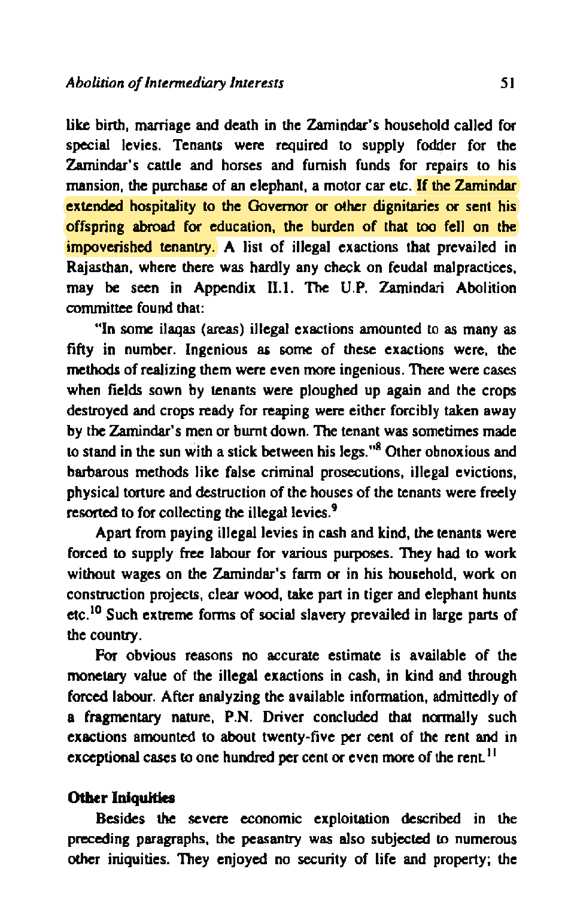

###### Abolition of Intermediary Interests 51

like birth, marriage and death in the Zamindar’s household called for special levies. Tenants were required to supply fodder for the Zamindar’s cattle and horses and furnish funds for repairs to his mansion, the purchase of an elephant, a motor car etc. If the Zamindar extended hospitality to the Governor or other dignitaries or sent his offspring abroad for education, the burden of that too fell on the impoverished tenantry. A list of illegal exactions that prevailed in Rajasthan, where there was hardly any check on feudal malpractices, may be seen in Appendix II. 1. The U.P. Zamindari Abolition committee found that:

“In some ilaqas (areas) illegal exactions amounted to as many as fifty in number. Ingenious as some of these exactions were, the methods of realizing them were even more ingenious. There were cases when fields sown by tenants were ploughed up again and the crops destroyed and crops ready for reaping were either forcibly taken away by the Zamindar’s men or burnt down. The tenant was sometimes made to stand in the sun with a stick between his legs.”8 Other obnoxious and barbarous methods like false criminal prosecutions, illegal evictions, physical torture and destruction of the houses of the tenants were freely resorted to for collecting the illegal levies.9

Apart from paying illegal levies in cash and kind, the tenants were forced to supply free labour for various purposes. They had to work without wages on the Zamindar’s farm or in his household, work on construction projects, clear wood, take part in tiger and elephant hunts etc.10 Such extreme forms of social slavery prevailed in large parts of the country.

For obvious reasons no accurate estimate is available of the monetary value of the illegal exactions in cash, in kind and through forced labour. After analyzing the available information, admittedly of a fragmentary nature, P.N. Driver concluded that normally such exactions amounted to about twenty-five per cent of the rent and in exceptional cases to one hundred per cent or even more of the rent.11

###### Other Iniquities

Besides the severe economic exploitation described in the preceding paragraphs, the peasantry was also subjected to numerous other iniquities. They enjoyed no security of life and property; the

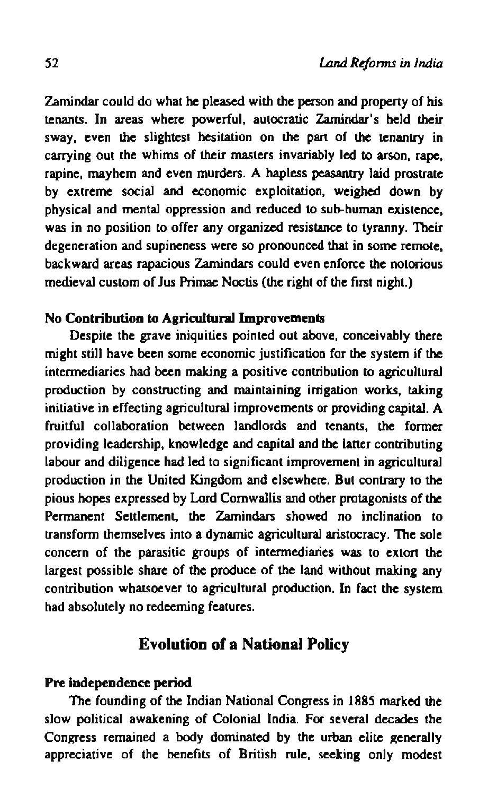

###### 52 Land Reforms in India

Zamindar could do what he pleased with the person and property of his tenants. In areas where powerful, autocratic Zamindar’s held their sway, even the slightest hesitation on the part of the tenantry in carrying out the whims of their masters invariably led to arson, rape, rapine, mayhem and even murders. A hapless peasantry laid prostrate by extreme social and economic exploitation, weighed down by physical and mental oppression and reduced to sub-human existence, was in no position to offer any organized resistance to tyranny. Their degeneration and supineness were so pronounced that in some remote, backward areas rapacious Zamindars could even enforce the notorious medieval custom of Jus Primae Noctis (the right of the first night.)

###### No Contribution to Agricultural Improvements

Despite the grave iniquities pointed out above, conceivably there might still have been some economic justification for the system if the intermediaries had been making a positive contribution to agricultural production by constructing and maintaining irrigation works, taking initiative in effecting agricultural improvements or providing capital. A fruitful collaboration between landlords and tenants, the former providing leadership, knowledge and capital and the latter contributing labour and diligence had led to significant improvement in agricultural production in the United Kingdom and elsewhere. But contrary to the pious hopes expressed by Lord Cornwallis and other protagonists of the Permanent Settlement, the Zamindars showed no inclination to transform themselves into a dynamic agricultural aristocracy. The sole concern of the parasitic groups of intermediaries was to extort the largest possible share of the produce of the land without making any contribution whatsoever to agricultural production. In fact the system had absolutely no redeeming features.

###### Evolution of a National Policy

###### Pre independence period

The founding of the Indian National Congress in 1885 marked the slow political awakening of Colonial India. For several decades the Congress remained a body dominated by the urban elite generally appreciative of the benefits of British rule, seeking only modest

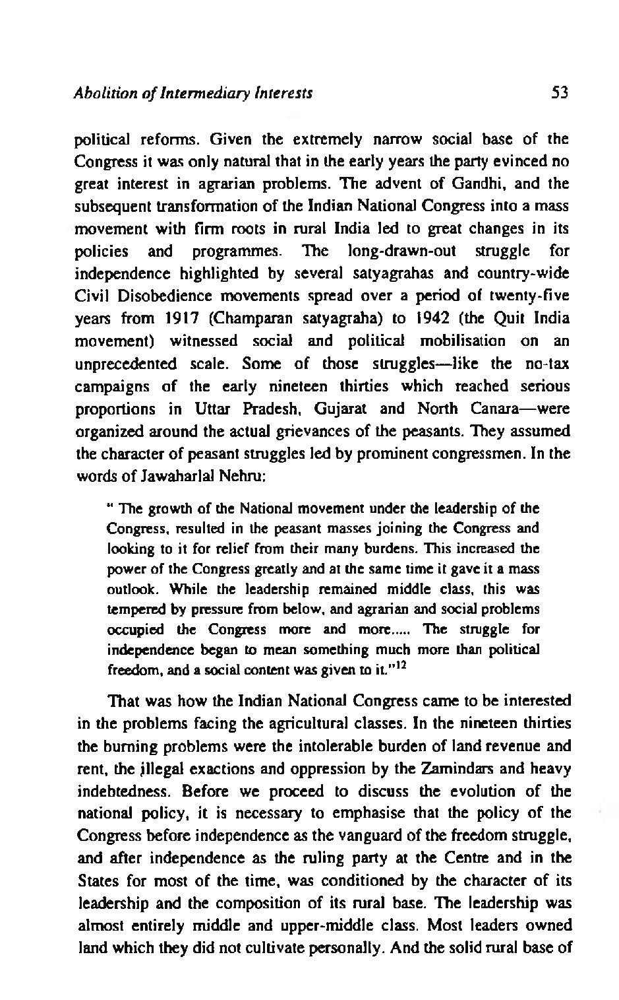

###### Abolition of Intermediary Interests 53

political reforms. Given the extremely narrow social base of the Congress it was only natural that in the early years the party evinced no great interest in agrarian problems. The advent of Gandhi, and the subsequent transformation of the Indian National Congress into a mass movement with firm roots in rural India led to great changes in its policies and programmes. The long-drawn-out struggle for independence highlighted by several satyagrahas and country-wide Civil Disobedience movements spread over a period of twenty-five years from 1917 (Champaran satyagraha) to 1942 (the Quit India movement) witnessed social and political mobilisation on an unprecedented scale. Some of those struggles—like the no-tax campaigns of the early nineteen thirties which reached serious proportions in Uttar Pradesh, Gujarat and North Cañara—were organized around the actual grievances of the peasants. They assumed the character of peasant struggles led by prominent congressmen. In the words of Jawaharlal Nehru:

“ The growth of the National movement under the leadership of the Congress, resulted in the peasant masses joining the Congress and looking to it for relief from their many burdens. This increased the power of the Congress greatly and at the same time it gave it a mass outlook. While the leadership remained middle class, this was tempered by pressure from below, and agrarian and social problems occupied the Congress more and more.... The struggle for independence began to mean something much more than political freedom, and a social content was given to it.”12

That was how the Indian National Congress came to be interested in the problems facing the agricultural classes. In the nineteen thirties the burning problems were the intolerable burden of land revenue and rent, the illegal exactions and oppression by the Zamindars and heavy indebtedness. Before we proceed to discuss the evolution of the national policy, it is necessary to emphasise that the policy of the Congress before independence as the vanguard of the freedom struggle, and after independence as the ruling party at the Centre and in the States for most of the time, was conditioned by the character of its leadership and the composition of its rural base. The leadership was almost entirely middle and upper-middle class. Most leaders owned land which they did not cultivate personally. And the solid rural base of

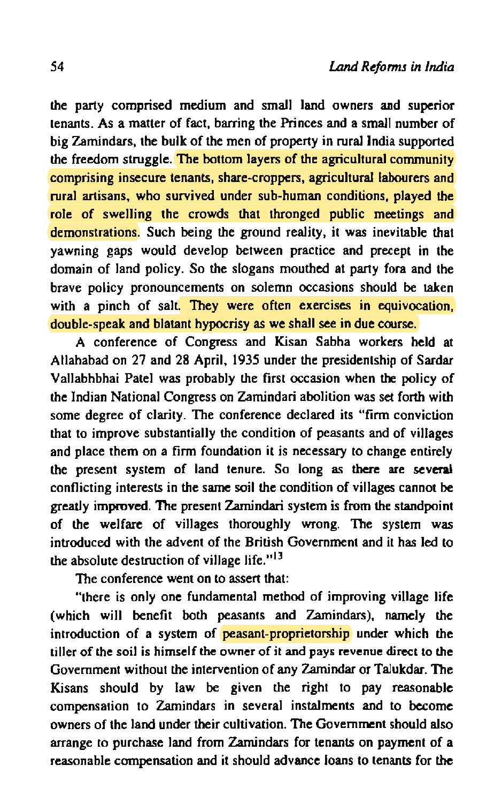

###### 54 Land Reforms in India

the party comprised medium and small land owners and superior tenants. As a matter of fact, barring the Princes and a small number of big Zamindars, the bulk of the men of property in rural India supported the freedom struggle. The bottom layers of the agricultural community comprising insecure tenants, share-croppers, agricultural labourers and rural artisans, who survived under sub-human conditions, played the role of swelling the crowds that thronged public meetings and demonstrations. Such being the ground reality, it was inevitable that yawning gaps would develop between practice and precept in the domain of land policy. So the slogans mouthed at party fora and the brave policy pronouncements on solemn occasions should be taken with a pinch of salt. They were often exercises in equivocation, double-speak and blatant hypocrisy as we shall see in due course.

A conference of Congress and Kisan Sabha workers held at Allahabad on 27 and 28 April, 1935 under the presidentship of Sardar Vallabhbhai Patel was probably the first occasion when the policy of the Indian National Congress on Zamindari abolition was set forth with some degree of clarity. The conference declared its “firm conviction that to improve substantially the condition of peasants and of villages and place them on a firm foundation it is necessary to change entirely the present system of land tenure. So long as there are several conflicting interests in the same soil the condition of villages cannot be greatly improved. The present Zamindari system is from the standpoint of the welfare of villages thoroughly wrong. The system was introduced with the advent of the British Government and it has led to the absolute destruction of village life.”13

The conference went on to assert that: “there is only one fundamental method of improving village life (which will benefit both peasants and Zamindars), namely the introduction of a system of peasant-proprietorship under which the tiller of the soil is himself the owner of it and pays revenue direct to the Government without the intervention of any Zamindar or Talukdar. The Kisans should by law be given the right to pay reasonable compensation to Zamindars in several instalments and to become owners of the land under their cultivation. The Government should also arrange to purchase land from Zamindars for tenants on payment of a reasonable compensation and it should advance loans to tenants for the

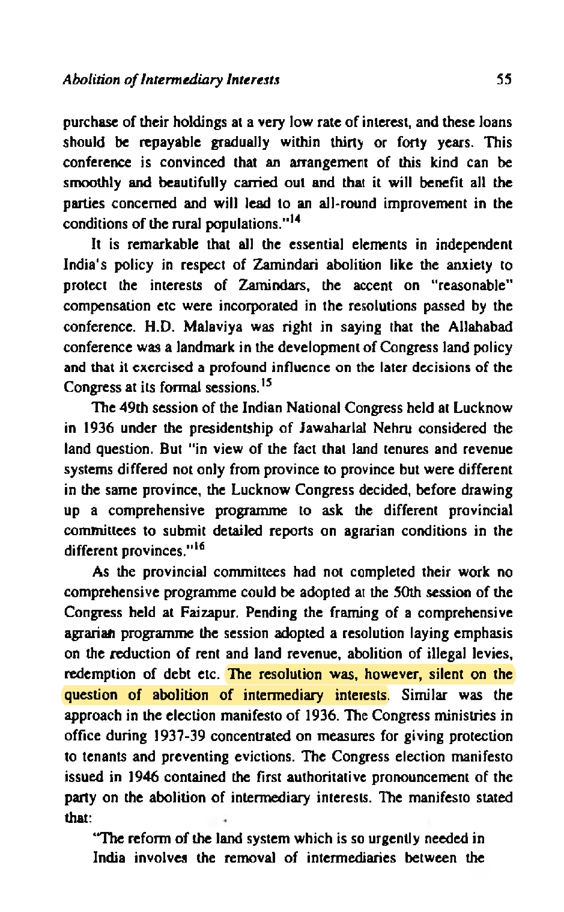

###### Abolition of Intermediary Interests 55

purchase of their holdings at a very low rate of interest, and these loans should be repayable gradually within thirty or forty years. This conference is convinced that an arrangement of this kind can be smoothly and beautifully carried out and that it will benefit all the parties concerned and will lead to an all-round improvement in the conditions of the rural populations.”14

It is remarkable that all the essential elements in independent India’s policy in respect of Zamindari abolition like the anxiety to protect the interests of Zamindars, the accent on “reasonable” compensation etc were incorporated in the resolutions passed by the conference. H.D. Malaviya was right in saying that the Allahabad conference was a landmark in the development of Congress land policy and that it exercised a profound influcncc on the later decisions of the Congress at its formal sessions.15

The 49th session of the Indian National Congress held at Lucknow in 1936 under the presidentship of Jawaharlal Nehru considered the land question. But “in view of the fact that land tenures and revenue systems differed not only from province to province but were different in the same province, the Lucknow Congress decided, before drawing up a comprehensive programme to ask the different provincial committees to submit detailed reports on agrarian conditions in the different provinces.”16

As the provincial committees had not completed their work no comprehensive programme could be adopted at the 50th session of the Congress held at Faizapur. Pending the framing of a comprehensive agrarian programme the session adopted a resolution laying emphasis on the reduction of rent and land revenue, abolition of illegal levies, redemption of debt etc. The resolution was, however, silent on the question of abolition of intermediary interests. Similar was the approach in the election manifesto of 1936. The Congress ministries in office during 1937-39 concentrated on measures for giving protection to tenants and preventing evictions. The Congress election manifesto issued in 1946 contained the first authoritative pronouncement of the party on the abolition of intermediary interests. The manifesto stated that:

“The reform of the land system which is so urgently needed in India involves the removal of intermediaries between the

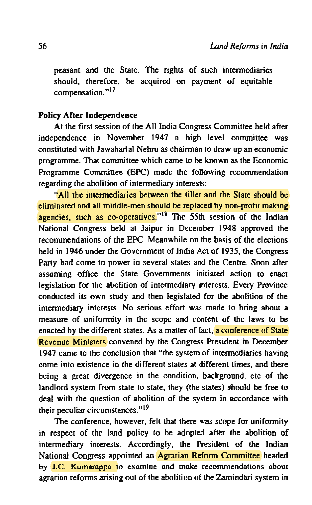

###### 56 Land Reforms in India

peasant and the State. The rights of such intermediaries should, therefore, be acquired on payment of equitable compensation.”17

###### Policy After Independence

At the first session of the All India Congress Committee held after independence in November 1947 a high level committee was constituted with Jawaharlal Nehru as chairman to draw up an economic programme. That committee which came to be known as the Economic Programme Committee (EPC) made the following recommendation regarding the abolition of intermediary interests:

“All the intermediaries between the tiller and the State should be eliminated and all middle-men should be replaced by non-profit making agencies, such as co-operatives.”18 The 55th session of the Indian National Congress held at Jaipur in December 1948 approved the recommendations of the EPC. Meanwhile on the basis of the elections held in 1946 under the Government of India Act of 1935, the Congress Party had come to power in several states and the Centre. Soon after assuming office the State Governments initiated action to enact legislation for the abolition of intermediary interests. Every Province conducted its own study and then legislated for the abolition of the intermediary interests. No serious effort was made to bring about a measure of uniformity in the scope and content of the laws to be enacted by the different states. As a matter of fact, a conference of State Revenue Ministers convened by the Congress President m December 1947 came to the conclusion that “the system of intermediaries having come into existence in the different states at different times, and there being a great divergence in the condition, background, etc of the landlord system from state to state, they (the states) should be free to deal with the question of abolition of the system in accordance with their peculiar circumstances.”19

The conference, however, felt that there was scope for uniformity in respect of the land policy to be adopted after the abolition of intermediary interests. Accordingly, the President of the Indian National Congress appointed an Agrarian Reform Committee headed by J.C. Kumarappa to examine and make recommendations about agrarian reforms arising out of the abolition of the Zamindari system in

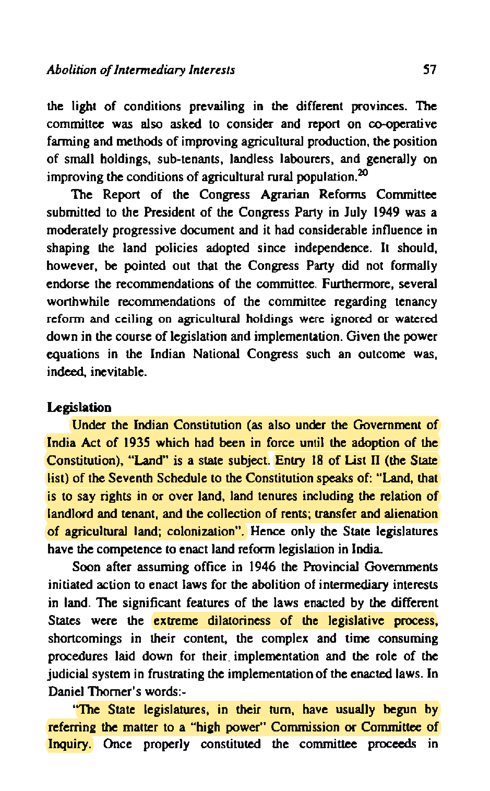

###### Abolition of Intermediary Interests 57

the light of conditions prevailing in the different provinces. The committee was also asked to consider and report on co-operative farming and methods of improving agricultural production, the position of small holdings, sub-tenants, landless labourers, and generally on improving the conditions of agricultural rural population.20

The Report of the Congress Agrarian Reforms Committee submitted to the President of the Congress Party in July 1949 was a moderately progressive document and it had considerable influence in shaping the land policies adopted since independence. It should, however, be pointed out that the Congress Party did not formally endorse the recommendations of the committee. Furthermore, several worthwhile recommendations of the committee regarding tenancy reform and coiling on agricultural holdings were ignored or watered down in the course of legislation and implementation. Given the power equations in the Indian National Congress such an outcome was, indeed, inevitable.

###### Legislation

Under the Indian Constitution (as also under the Government of India Act of 1935 which had been in force until the adoption of the Constitution), “Land” is a state subject. Entry 18 of List II (the State list) of the Seventh Schedule to the Constitution speaks of: “Land, that is to say rights in or over land, land tenures including the relation of landlord and tenant, and the collection of rents; transfer and alienation of agricultural land; colonization”. Hence only the State legislatures have the competence to enact land reform legislauon in India.

Soon after assuming office in 1946 the Provincial Governments initiated action to enact laws for the abolition of intermediary interests in land. The significant features of the laws enacted by the different States were the extreme dilatoriness of the legislative process, shortcomings in their content, the complex and time consuming procedures laid down for their, implementation and the role of the judicial system in frustrating the implementation of the enacted laws. In Daniel Thomer’s words:-

“The State legislatures, in their turn, have usually begun by referring the matter to a “high power” Commission or Committee of Inquiry. Once properly constituted the committee proceeds in

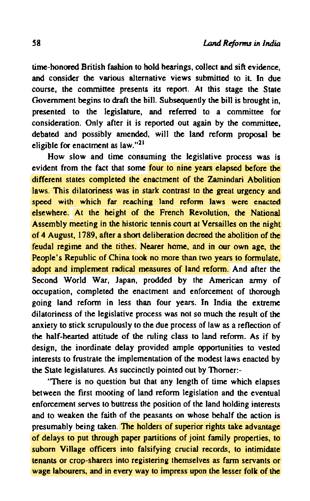

###### 58 Land Reforms in India

time-honored British fashion to hold hearings, collect and sift evidence, and consider the various alternative views submitted to it In due course, the committee presents its report. At this stage the State Government begins to draft the bill. Subsequently the bill is brought in, presented to the legislature, and referred to a committee for consideration. Only after it is reported out again by the committee, debated and possibly amended, will the land reform proposal be eligible for enactment as law.”21

How slow and time consuming the legislative process was is evident from the fact that some four to nine years elapsed before the different states completed the enactment of the Zamindari Abolition laws. This dilatoriness was in stark contrast to the great urgency and speed with which far reaching land reform laws were enacted elsewhere. At the height of the French Revolution, the National Assembly meeting in the historic tennis court at Versailles on the night of 4 August, 1789, after a short deliberation decreed the abolition of the feudal regime and the tithes. Nearer home, and in our own age, the People’s Republic of China took no more than two years to formulate, adopt and implement radical measures of land reform. And after the Second World War, Japan, prodded by the American army of occupation, completed the enactment and enforcement of thorough going land reform in less than four years. In India the extreme dilatoriness of the legislative process was not so much the result of the anxiety to stick scrupulously to the due process of law as a reflection of the half-hearted attitude of the ruling class to land reform. As if by design, the inordinate delay provided ample opportunities to vested interests to frustrate the implementation of the modest laws enacted by the State legislatures. As succinctly pointed out by Thomer:-

“There is no question but that any length of time which elapses between the first mooting of land reform legislation and the eventual enforcement serves to buttress the position of the land holding interests and to weaken the faith of the peasants on whose behalf the action is presumably being taken. The holders of superior rights take advantage of delays to put through paper partitions of joint family properties, to suborn Village officers into falsifying crucial records, to intimidate tenants or crop-sharers into registering themselves as farm servants or wage labourers, and in every way to impress upon the lesser folk of the

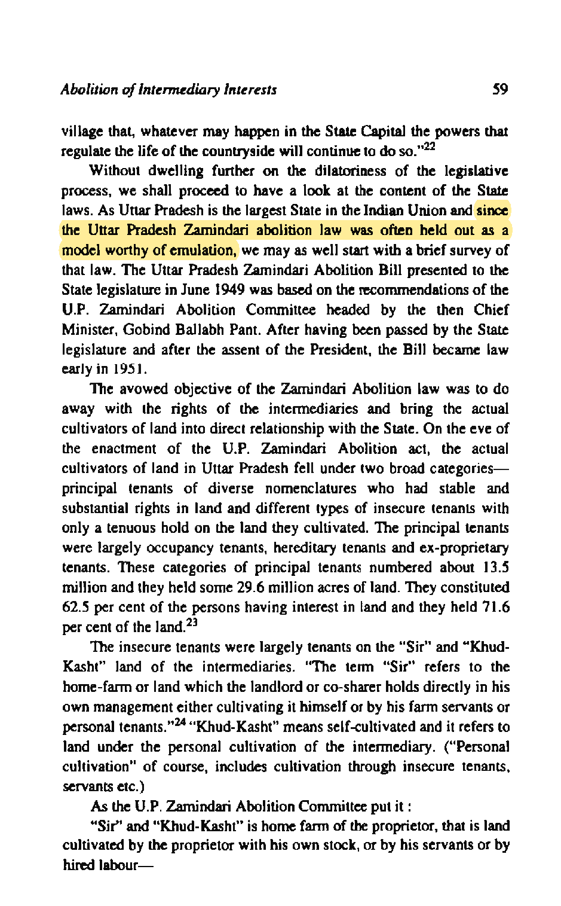

###### Abolition of Intermediary Interests 59

village that, whatever may happen in the State Capital the powers that regulate the life of the countryside will continue to do so.”22

Without dwelling further on the dilatoriness of the legislative process, we shall proceed to have a look at the content of the State laws. As Uttar Pradesh is the largest State in the Indian Union and since the Uttar Pradesh Zamindari abolition law was often held out as a model worthy of emulation, we may as well start with a brief survey of that law. The Uttar Pradesh Zamindari Abolition Bill presented to the State legislature in June 1949 was based on the recommendations of the U.P. Zamindari Abolition Committee headed by the then Chief Minister, Gobind Ballabh Pant. After having been passed by the State legislature and after the assent of the President, the Bill became law early in 1951.

The avowed objective of the Zamindari Abolition law was to do away with the rights of the intermediaries and bring the actual cultivators of land into direct relationship with the State. On the eve of the enactment of the U.P. Zamindari Abolition act, the actual cultivators of land in Uttar Pradesh fell under two broad categoriesprincipal tenants of diverse nomenclatures who had stable and substantial rights in land and different types of insecure tenants with only a tenuous hold on the land they cultivated. The principal tenants were largely occupancy tenants, hereditary tenants and ex-proprietary tenants. These categories of principal tenants numbered about 13.5 million and they held some 29.6 million acres of land. They constituted 62.5 per cent of the persons having interest in land and they held 71.6 per cent of the land.23

The insecure tenants were largely tenants on the “Sir” and “KhudKasht” land of the intermediaries. “The term “Sir” refers to the home-farm or land which the landlord or co-sharer holds directly in his own management either cultivating it himself or by his farm servants or personal tenants.”24 “Khud-Kasht” means self-cultivated and it refers to land under the personal cultivation of the intermediary. (“Personal cultivation” of course, includes cultivation through insecure tenants, servants etc.)

As the U.P. Zamindari Abolition Committee put it: “Sir” and “Khud-Kasht” is home farm of the proprietor, that is land

cultivated by the proprietor with his own stock, or by his servants or by hired labour—

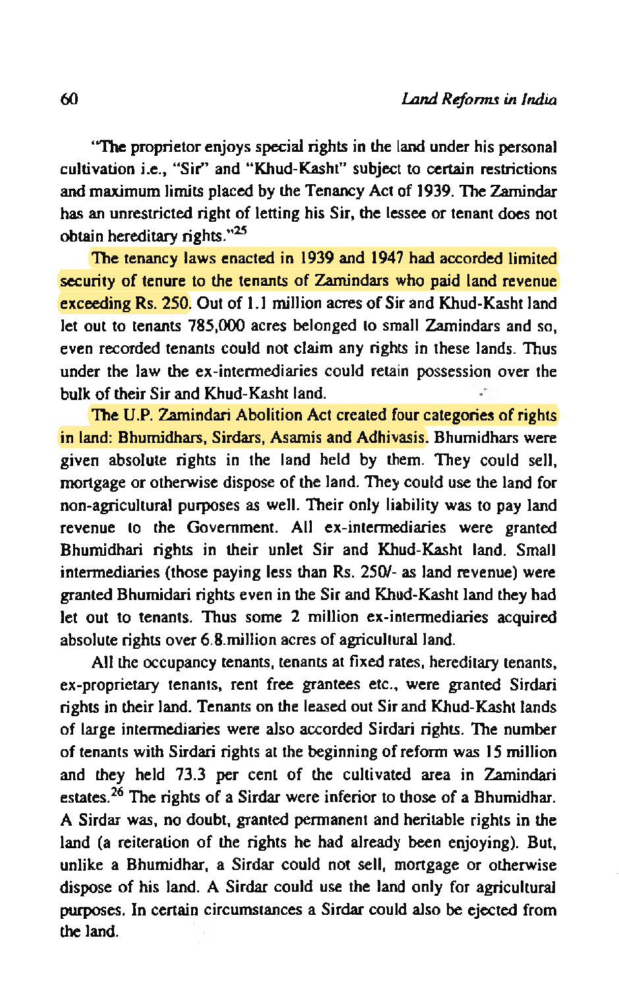

###### 60 Land Reforms in India

“The proprietor enjoys special rights in the land under his personal cultivation i.e., “Sir” and “Khud-Kasht” subject to certain restrictions and maximum limits placed by the Tenancy Act of 1939. The Zamindar has an unrestricted right of letting his Sir, the lessee or tenant does not obtain hereditary rights.”25

The tenancy laws enacted in 1939 and 1947 had accorded limited security of tenure to the tenants of Zamindars who paid land revenue exceeding Rs. 250. Out of 1.1 million acres of Sir and Khud-Kasht land let out to tenants 785,000 acres belonged to small Zamindars and so, even recorded tenants could not claim any rights in these lands. Thus under the law the ex-intermediaries could retain possession over the bulk of their Sir and Khud-Kasht land.

The U.P. Zamindari Abolition Act created four categories of rights in land: Bhumidhars, Sirdars, Asamis and Adhivasis. Bhumidhars were given absolute rights in the land held by them. They could sell, mortgage or otherwise dispose of the land. They could use the land for non-agricultural purposes as well. Their only liability was to pay land revenue to the Government. All ex-intermediaries were granted Bhumidhari rights in their unlet Sir and Khud-Kasht land. Small intermediaries (those paying less than Rs. 250/- as land revenue) were granted Bhumidari rights even in the Sir and Khud-Kasht land they had let out to tenants. Thus some 2 million ex-intermediaries acquired absolute rights over 6.8.million acres of agricultural land.

All the occupancy tenants, tenants at fixed rates, hereditary tenants, ex-proprietary tenants, rent free grantees etc., were granted Sirdari rights in their land. Tenants on the leased out Sir and Khud-Kasht lands of large intermediaries were also accorded Sirdari rights. The number of tenants with Sirdari rights at the beginning of reform was 15 million and they held 73.3 per cent of the cultivated area in Zamindari estates.26 The rights of a Sirdar were inferior to those of a Bhumidhar. A Sirdar was, no doubt, granted permanent and heritable rights in the land (a reiteration of the rights he had already been enjoying). But, unlike a Bhumidhar, a Sirdar could not sell, mortgage or otherwise dispose of his land. A Sirdar could use the land only for agricultural purposes. In certain circumstances a Sirdar could also be ejected from the land.

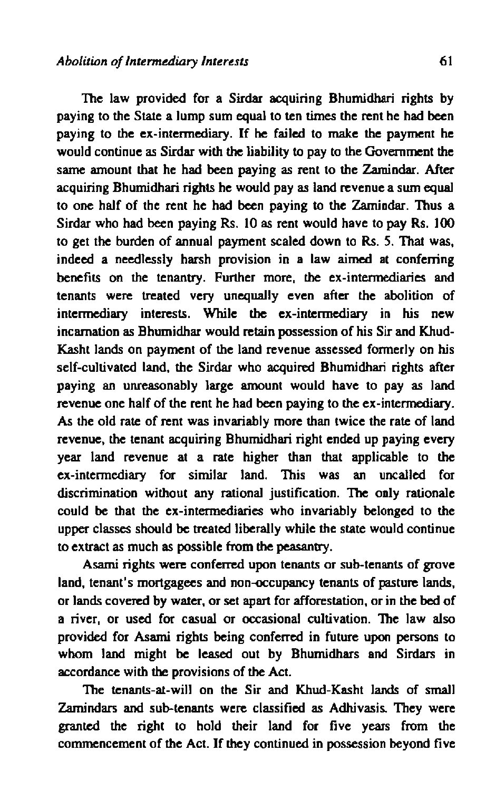

###### Abolition of Intermediary Interests 61

The law provided for a Sirdar acquiring Bhumidhari rights by paying to the State a lump sum equal to ten times the rent he had been paying to the ex-intermediary. If he failed to make the payment he would continue as Sirdar with the liability to pay to the Government the same amount that he had been paying as rent to the Zamindar. After acquiring Bhumidhari rights he would pay as land revenue a sum equal to one half of the rent he had been paying to the Zamindar. Thus a Sirdar who had been paying Rs. 10 as rent would have to pay Rs. 100 to get the burden of annual payment scaled down to Rs. 5. That was, indeed a needlessly harsh provision in a law aimed at conferring benefits on the tenantry. Further more, the ex-intermediaries and tenants were treated very unequally even after the abolition of intermediary interests. While the ex-intermediary in his new incarnation as Bhumidhar would retain possession of his Sir and KhudKasht lands on payment of the land revenue assessed formerly on his self-cultivated land, the Sirdar who acquired Bhumidhari rights after paying an unreasonably large amount would have to pay as land revenue one half of the rent he had been paying to the ex-intermediary. As the old rate of rent was invariably more than twice the rate of land revenue, the tenant acquiring Bhumidhari right ended up paying every year land revenue at a rate higher than that applicable to the ex-intermediary for similar land. This was an uncalled for discrimination without any rational justification. The only rationale could be that the ex-intermediaries who invariably belonged to the upper classes should be treated liberally while the state would continue to extract as much as possible from the peasantry.

Asami rights were conferred upon tenants or sub-tenants of grove land, tenant’s mortgagees and non-occupancy tenants of pasture lands, or lands covered by water, or set apart for afforestation, or in the bed of a river, or used for casual or occasional cultivation. The law also provided for Asami rights being conferred in future upon persons to whom land might be leased out by Bhumidhars and Sirdars in accordance with the provisions of the Act.

The tenants-at-will on the Sir and Khud-Kasht lands of small Zamindars and sub-tenants were classified as Adhivasis. They were granted the right to hold their land for five years from the commencement of the Act. If they continued in possession beyond five

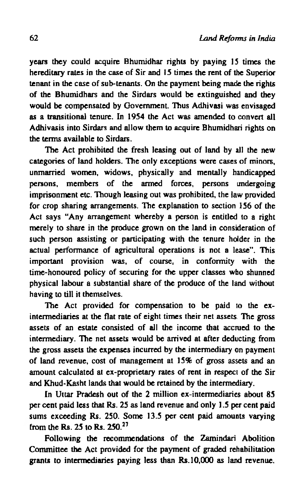

###### 62 Land Reforms in India

years they could acquire Bhumidhar rights by paying 15 times the hereditary rates in the case of Sir and 15 times the rent of the Superior tenant in the case of sub-tenants. On the payment being made the rights of the Bhumidhars and the Sirdars would be extinguished and they would be compensated by Government. Thus Adhivasi was envisaged as a transitional tenure. In 1954 the Act was amended to convert all Adhivasis into Sirdars and allow them to acquire Bhumidhari rights on the terms available to Sirdars.

The Act prohibited the fresh leasing out of land by all the new categories of land holders. The only exceptions were cases of minors, unmarried women, widows, physically and mentally handicapped persons, members of the armed forces, persons undergoing imprisonment etc. Though leasing out was prohibited, the law provided for crop sharing arrangements. The explanation to section 156 of the Act says “Any arrangement whereby a person is entitled to a right merely to share in the produce grown on the land in consideration of such person assisting or participating with the tenure holder in the actual performance of agricultural operations is not a lease”. This important provision was, of course, in conformity with the time-honoured policy of securing for the upper classes who shunned physical labour a substantial share of the produce of the land without having to till it themselves.

The Act provided for compensation to be paid to the exintermediaries at the flat rate of eight times their net assets. The gross assets of an estate consisted of all the income that accrued to the intermediary. The net assets would be arrived at after deducting from the gross assets the expenses incurred by the intermediary on payment of land revenue, cost of management at 15% of gross assets and an amount calculated at ex-proprietary rates of rent in respect of the Sir and Khud-Kasht lands that would be retained by the intermediary.

In Uttar Pradesh out of the 2 million ex-intermediaries about 85 per cent paid less that Rs. 25 as land revenue and only 1.5 per cent paid sums exceeding Rs. 250. Some 13.5 per cent paid amounts varying from the Rs. 25 to Rs. 250.27

Following the recommendations of the Zamindari Abolition Committee the Act provided for the payment of graded rehabilitation grants to intermediaries paying less than Rs. 10,000 as land revenue.

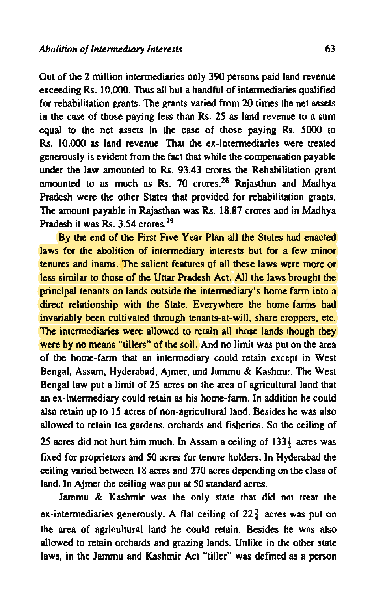

###### Abolition of Intermediary Interests 63

Out of the 2 million intermediaries only 390 persons paid land revenue exceeding Rs. 10,000. Thus all but a handful of intermediaries qualified for rehabilitation grants. The grants varied from 20 times the net assets in the case of those paying less than Rs. 25 as land revenue to a sum equal to the net assets in the case of those paying Rs. 5000 to Rs. 10,000 as land revenue. That the ex-intermediaries were treated generously is evident from the fact that while the compensation payable under the law amounted to Rs. 93.43 crores the Rehabilitation grant amounted to as much as Rs. 70 crores.28 Rajasthan and Madhya Pradesh were the other States that provided for rehabilitation grants. The amount payable in Rajasthan was Rs. 18.87 crores and in Madhya Pradesh it was Rs. 3.54 crores.29

By the end of the First Five Year Plan all the States had enacted laws for the abolition of intermediary interests but for a few minor tenures and inams. The salient features of all these laws were more or less similar to those of the Uttar Pradesh Act. All the laws brought the principal tenants on lands outside the intermediary’s home-farm into a direct relationship with the State. Everywhere the home-farms had invariably been cultivated through tenants-at-will, share croppers, etc. The intermediaries were allowed to retain all those lands though they were by no means “tillers” of the soil. And no limit was put on the area of the home-farm that an intermediary could retain except in West Bengal, Assam, Hyderabad, Ajmer, and Jammu & Kashmir. The West Bengal law put a limit of 25 acres on the area of agricultural land that an ex-intermediary could retain as his home-farm. In addition he could also retain up to 15 acres of non-agricultural land. Besides he was also allowed to retain tea gardens, orchards and fisheries. So the ceiling of 25 acres did not hurt him much. In Assam a ceiling of 133£ acres was fixed for proprietors and 50 acres for tenure holders. In Hyderabad the ceiling varied between 18 acres and 270 acres depending on the class of land. In Ajmer the ceiling was put at 50 standard acres.

Jammu & Kashmir was the only state that did not treat the ex-intermediaries generously. A flat ceiling of 22 J acres was put on the area of agricultural land he could retain. Besides he was also allowed to retain orchards and grazing lands. Unlike in the other state laws, in the Jammu and Kashmir Act “tiller” was defined as a person

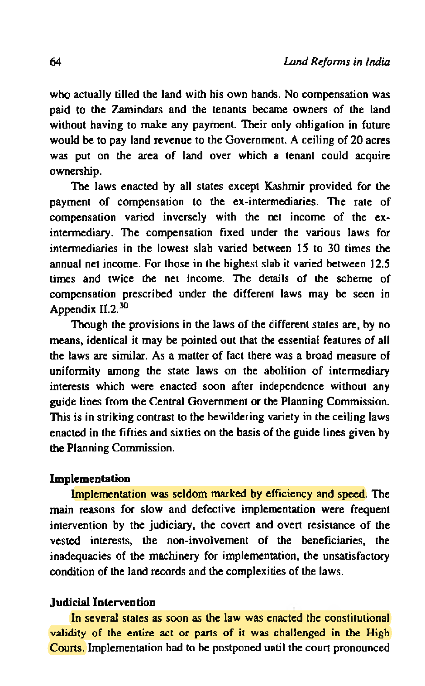

###### 64 Land Reforms in India

who actually tilled the land with his own hands. No compensation was paid to the Zamindars and the tenants became owners of the land without having to make any payment. Their only obligation in future would be to pay land revenue to the Government. A ceiling of 20 acres was put on the area of land over which a tenant could acquire ownership.

The laws enacted by all states except Kashmir provided for the payment of compensation to the ex-intermediaries. The rate of compensation varied inversely with the net income of the exintermediary. The compensation fixed under the various laws for intermediaries in the lowest slab varied between 15 to 30 times the annual net income. For those in the highest slab it varied between 12.5 times and twice the net income. The details of the scheme of compensation prescribed under the different laws may be seen in Appendix II.2.30

Though the provisions in the laws of the different states are, by no means, identical it may be pointed out that the essential features of all the laws are similar. As a matter of fact there was a broad measure of uniformity among the state laws on the abolition of intermediary interests which were enacted soon after independence without any guide lines from the Central Government or the Planning Commission. This is in striking contrast to the bewildering variety in the ceiling laws enacted in the fifties and sixties on the basis of the guide lines given by the Planning Commission.

###### Implementation

Implementation was seldom marked by efficiency and speed. The main reasons for slow and defective implementation were frequent intervention by the judiciary, the covert and overt resistance of the vested interests, the non-involvement of the beneficiaries, the inadequacies of the machinery for implementation, the unsatisfactory condition of the land records and the complexities of the laws.

###### Judicial Intervention

In several states as soon as the law was enacted the constitutional validity of the entire act or parts of it was challenged in the High Courts. Implementation had to be postponed until the court pronounced

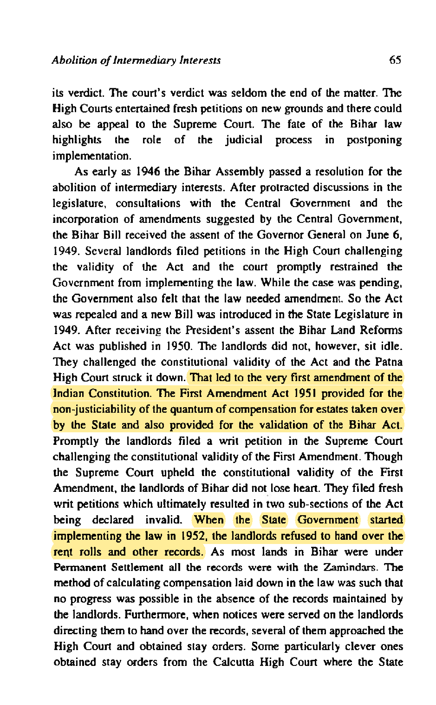

###### Abolition of Intermediary Interests 65

its verdict. The court’s verdict was seldom the end of the matter. The High Courts entertained fresh petitions on new grounds and there could also be appeal to the Supreme Court. The fate of the Bihar law highlights the role of the judicial process in postponing implementation.

As early as 1946 the Bihar Assembly passed a resolution for the abolition of intermediary interests. After protracted discussions in the legislature, consultations with the Central Government and the incorporation of amendments suggested by the Central Government, the Bihar Bill received the assent of the Governor General on June 6, 1949. Several landlords filed petitions in the High Court challenging the validity of the Act and the court promptly restrained the Government from implementing the law. While the case was pending, the Government also felt that the law needed amendment. So the Act was repealed and a new Bill was introduced in the State Legislature in 1949. After receiving the President’s assent the Bihar Land Reforms Act was published in 1950. The landlords did not, however, sit idle. They challenged the constitutional validity of the Act and the Patna High Court struck it down. That led to the very first amendment of the Indian Constitution. The First Amendment Act 1951 provided for the non-justiciability of the quantum of compensation for estates taken over by the State and also provided for the validation of the Bihar Act. Promptly the landlords filed a writ petition in the Supreme Court challenging the constitutional validity of the First Amendment. Though the Supreme Court upheld the constitutional validity of the First Amendment, the landlords of Bihar did not lose heart. They filed fresh writ petitions which ultimately resulted in two sub-sections of the Act being declared invalid. When the State Government started implementing the law in 1952, the landlords refused to hand over the rent rolls and other records. As most lands in Bihar were under Permanent Settlement all the records were with the Zamindars. The method of calculating compensation laid down in the law was such that no progress was possible in the absence of the records maintained by the landlords. Furthermore, when notices were served on the landlords directing them to hand over the records, several of them approached the High Court and obtained stay orders. Some particularly clever ones obtained stay orders from the Calcutta High Court where the State

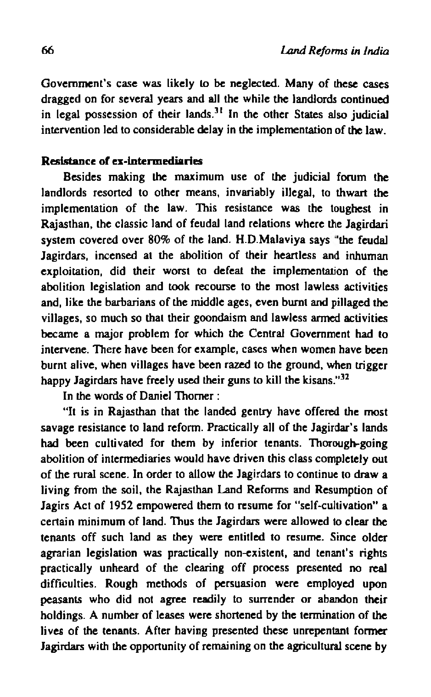

###### 66 Land Reforms in India

Government’s case was likely to be neglected. Many of these cases dragged on for several years and all the while the landlords continued in legal possession of their lands.31 In the other States also judicial intervention led to considerable delay in the implementation of the law.

###### Resistance of ex-intermediaries

Besides making the maximum use of the judicial forum the landlords resorted to other means, invariably illegal, to thwart the implementation of the law. This resistance was the toughest in Rajasthan, the classic land of feudal land relations where the Jagirdari system covered over 80% of the land. H.D.Malaviya says ‘the feudal Jagirdars, incensed at the abolition of their heartless and inhuman exploitation, did their worst to defeat the implementation of the abolition legislation and took recourse to the most lawless activities and, like the barbarians of the middle ages, even burnt and pillaged the villages, so much so that their goondaism and lawless armed activities became a major problem for which the Central Government had to intervene. There have been for example, cases when women have been burnt alive, when villages have been razed to the ground, when trigger happy Jagirdars have freely used their guns to kill the kisans.”32

In the words of Daniel Thomer : “It is in Rajasthan that the landed gentry have offered the most savage resistance to land reform. Practically all of the Jagirdar’s lands had been cultivated for them by inferior tenants. Thorough-going abolition of intermediaries would have driven this class completely out of the rural scene. In order to allow the Jagirdars to continue to draw a living from the soil, the Rajasthan Land Reforms and Resumption of Jagirs Act of 1952 empowered them to resume for “self-cultivation” a certain minimum of land. Thus the Jagirdars were allowed lo clear the tenants off such land as they were entitled to resume. Since older agrarian legislation was practically non-existent, and tenant’s rights practically unheard of the clearing off process presented no real difficulties. Rough methods of persuasion were employed upon peasants who did not agree readily to surrender or abandon their holdings. A number of leases were shortened by the termination of the lives of the tenants. After having presented these unrepentant former Jagirdars with the opportunity of remaining on the agricultural scene by

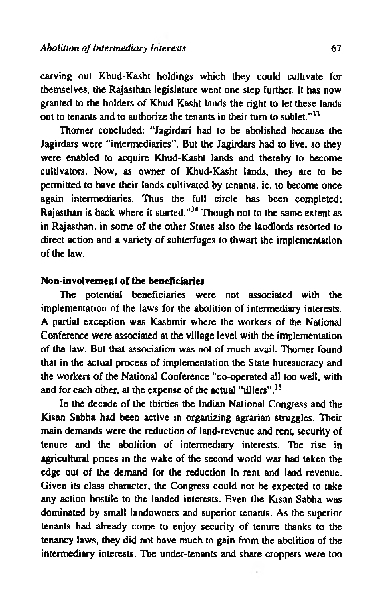

###### Abolition of Intermediary Interests 67

carving out Khud-Kasht holdings which they could cultivate for themselves, the Rajasthan legislature went one step further. It has now granted to the holders of Khud-Kasht lands the right to let these lands out to tenants and to authorize the tenants in their turn to sublet.”33

Thomer concluded: “Jagirdari had to be abolished because the Jagirdars were “intermediaries”. But the Jagirdars had to live, so they were enabled to acquire Khud-Kasht lands and thereby to become cultivators. Now, as owner of Khud-Kasht lands, they are to be permitted to have their lands cultivated by tenants, ie. to become once again intermediaries. Thus the full circle has been completed; Rajasthan is back where it started.”34 Though not to the same extent as in Rajasthan, in some of the other States also the landlords resorted to direct action and a variety of subterfuges to thwart the implementation of the law.

###### Non-involvement of the beneficiaries

The potential beneficiaries were not associated with the implementation of the laws for the abolition of intermediary interests. A partial exception was Kashmir where the workers of the National Conference were associated at the village level with the implementation of the law. But that association was not of much avail. Thomer found that in the actual process of implementation the State bureaucracy and the workers of the National Conference “co-operated all too well, with and for each other, at the expense of the actual “tillers”.35

In the decade of the thirties the Indian National Congress and the Kisan Sabha had been active in organizing agrarian struggles. Their main demands were the reduction of land-revenue and rent, security of tenure and the abolition of intermediary interests. The rise in agricultural prices in the wake of the second world war had taken the edge out of the demand for the reduction in rent and land revenue. Given its class character, the Congress could not be expected to take any action hostile to the landed interests. Even the Kisan Sabha was dominated by small landowners and superior tenants. As the superior tenants had already come to enjoy security of tenure thanks to the tenancy laws, they did not have much to gain from the abolition of the intermediary interests. The under-tenants and share croppers were too

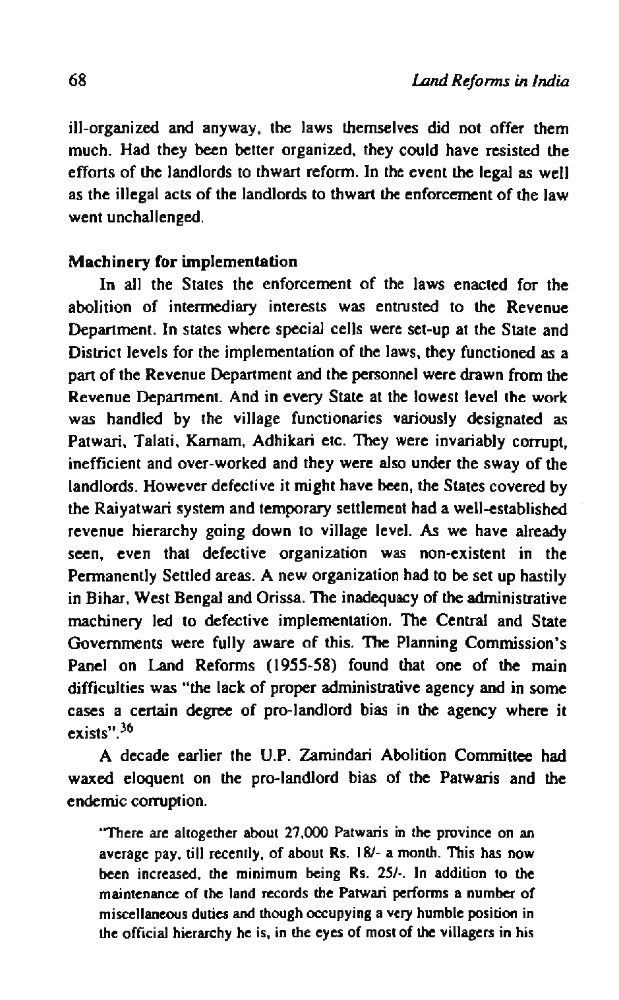

###### 68 Land Reforms in India

ill-organized and anyway, the laws themselves did not offer them much. Had they been better organized, they could have resisted the efforts of the landlords to thwart reform. In the event the legal as well as the illegal acts of the landlords to thwart the enforcement of the law went unchallenged.

###### Machinery for implementation

In all the States the enforcement of the laws enacted for the abolition of intermediary interests was entrusted to the Revenue Department. In states where special cells were set-up at the State and District levels for the implementation of the laws, they functioned as a part of the Revenue Department and the personnel were drawn from the Revenue Department. And in every State at the lowest level the work was handled by the village functionaries variously designated as Patwari, Talati, Kamam, Adhikari etc. They were invariably corrupt, inefficient and over-worked and they were also under the sway of the landlords. However defective it might have been, the States covered by the Raiyatwari system and temporary settlement had a well-established revenue hierarchy going down to village level. As we have already seen, even that defective organization was non-existent in the Permanently Settled areas. A new organization had to be set up hastily in Bihar, West Bengal and Orissa. The inadequacy of the administrative machinery led to defective implementation. The Central and State Governments were fully aware of this. The Planning Commission’s Panel on Land Reforms (1955-58) found that one of the main difficulties was “the lack of proper administrative agency and in some cases a certain degree of pro-landlord bias in the agency where it exists".36

A decade earlier the U.P. Zamindari Abolition Committee had waxed eloquent on the pro-landlord bias of the Patwaris and the endemic corruption.

“There are altogether about 27,000 Patwaris in the province on an average pay, till recently, of about Rs. 18/- a month. This has now been increased, the minimum being Rs. 25/-. In addition to the maintenance of the land records the Patwari performs a number of miscellaneous duties and though occupying a very humble position in the official hierarchy he is, in the eyes of most of the villagers in his

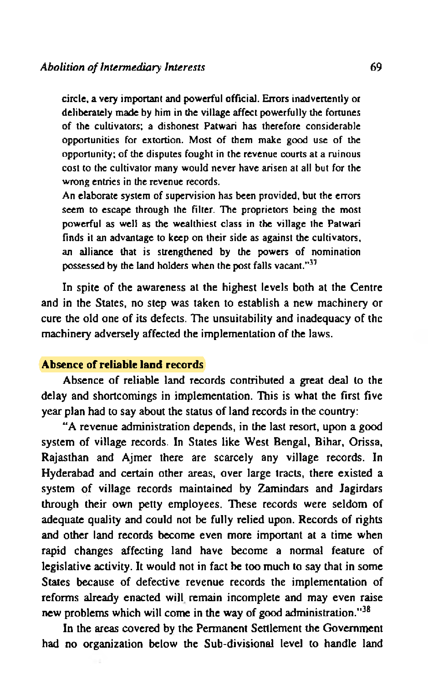

###### Abolition of Intermediary Interests 69

circle, a very important and powerful official. Errors inadvertently or deliberately made by him in the village affect powerfully the fortunes of the cultivators; a dishonest Patwari has therefore considerable opportunities for extortion. Most of them make good use of the opportunity; of the disputes fought in the revenue courts at a ruinous cost to the cultivator many would never have arisen at all but for the wrong entries in the revenue records. An elaborate system of supervision has been provided, but the errors seem to escape through the filter. The proprietors being the most powerful as well as the wealthiest class in the village the Patwari finds it an advantage to keep on their side as against the cultivators, an alliance that is strengthened by the powers of nomination possessed by the land holders when the post falls vacant.”37

In spite of the awareness at the highest levels both at the Centre and in the States, no step was taken to establish a new machinery or cure the old one of its defects. The unsuitability and inadequacy of the machinery adversely affected the implementation of the laws.

###### Absence of reliable land records

Absence of reliable land records contributed a great deal to the delay and shortcomings in implementation. This is what the first five year plan had to say about the status of land records in the country:

“A revenue administration depends, in the last resort, upon a good system of village records. In States like West Bengal, Bihar, Orissa, Rajasthan and Ajmer there are scarcely any village records. In Hyderabad and certain other areas, over large tracts, there existed a system of village records maintained by Zamindars and Jagirdars through their own petty employees. These records were seldom of adequate quality and could not be fully relied upon. Records of rights and other land records become even more important at a time when rapid changes affecting land have become a normal feature of legislative activity. It would not in fact be too much to say that in some States because of defective revenue records the implementation of reforms already enacted will remain incomplete and may even raise new problems which will come in the way of good administration.”38

In the areas covered by the Permanent Settlement the Government had no organization below the Sub-divisional level to handle land

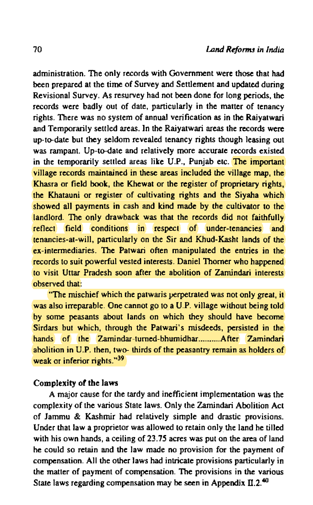

###### 70 Land Reforms in India

administration. The only records with Government were those that had been prepared at the time of Survey and Settlement and updated during Revisional Survey. As resurvey had not been done for long periods, the records were badly out of date, particularly in the matter of tenancy rights. There was no system of annual verification as in the Raiyatwari and Temporarily settled areas. In the Raiyatwari areas the records were up-to-date but they seldom revealed tenancy rights though leasing out was rampant. Up-to-date and relatively more accurate records existed in the temporarily settled areas like U.P., Punjab etc. The important village records maintained in these areas included the village map, the Khasra or field book, the Khewat or the register of proprietary rights, the Khatauni or register of cultivating rights and the Siyaha which showed all payments in cash and kind made by the cultivator to the landlord. The only drawback was that the records did not faithfully reflect field conditions in respect of under-tenancies and tenancies-at-will, particularly on the Sir and Khud-Kasht lands of the ex-intermediaries. The Patwari often manipulated the entries in the records to suit powerful vested interests. Daniel Thomer who happened to visit Uttar Pradesh soon after the abolition of Zamindari interests observed that:

“The mischief which the patwaris perpetrated was not only great, it was also irreparable. One cannot go to a U.P. village without being told by some peasants about lands on which they should have become Sirdars but which, through the Patwari’s misdeeds, persisted in the hands of the Zamindar-tumed-bhumidhar..........After Zamindari abolition in U.P. then, two- thirds of the peasantry remain as holders of weak or inferior rights.”39

###### Complexity of the laws

A major cause for the tardy and inefficient implementation was the complexity of the various State laws. Only the Zamindari Abolition Act of Jammu & Kashmir had relatively simple and drastic provisions. Under that law a proprietor was allowed to retain only the land he tilled with his own hands, a ceiling of 23.75 acres was put on the area of land he could so retain and the law made no provision for the payment of compensation. All the other laws had indicate provisions particularly in the matter of payment of compensation. The provisions in the various State laws regarding compensation may be seen in Appendix H.2.40

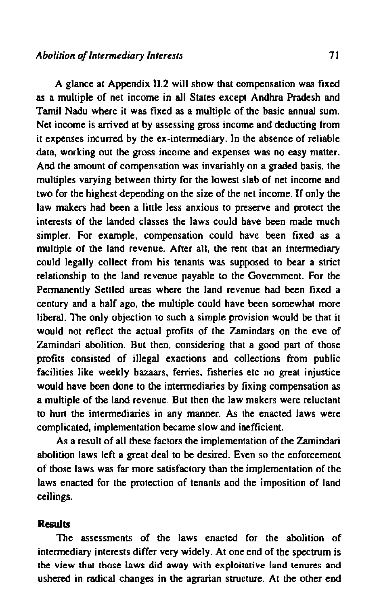

Abolition of Intermediary Interests 71

A glance at Appendix II.2 will show that compensation was fixed as a multiple of net income in all States except Andhra Pradesh and Tamil Nadu where it was fixed as a multiple of the basic annual sum. Net income is arrived at by assessing gross income and deducting from it expenses incurred by the ex-intermediary. In the absence of reliable data, working out the gross income and expenses was no easy matter. And the amount of compensation was invariably on a graded basis, the multiples varying between thirty for the lowest slab of net income and two for the highest depending on the size of the net income. If only the law makers had been a little less anxious to preserve and protect the interests of the landed classes the laws could have been made much simpler. For example, compensation could have been fixed as a multiple of the land revenue. After all, the rent that an intermediary could legally collect from his tenants was supposed to bear a strict relationship to the land revenue payable to the Government. For the Permanently Settled areas where the land revenue had been fixed a century and a half ago, the multiple could have been somewhat more liberal. The only objection to such a simple provision would be that it would not reflect the actual profits of the Zamindars on the eve of Zamindari abolition. But then, considering that a good part of those profits consisted of illegal exactions and collections from public facilities like weekly bazaars, ferries, fisheries etc no great injustice would have been done to the intermediaries by fixing compensation as a multiple of the land revenue. But then the law makers were reluctant to hurt the intermediaries in any manner. As the enacted laws were complicated, implementation became slow and inefficient.

As a result of all these factors the implementation of the Zamindari abolition laws left a great deal to be desired. Even so the enforcement of those laws was far more satisfactory than the implementation of the laws enacted for the protection of tenants and the imposition of land ceilings.

###### Results

The assessments of the laws enacted for the abolition of intermediary interests differ very widely. At one end of the spectrum is the view that those laws did away with exploitative land tenures and ushered in radical changes in the agrarian structure. At the other end

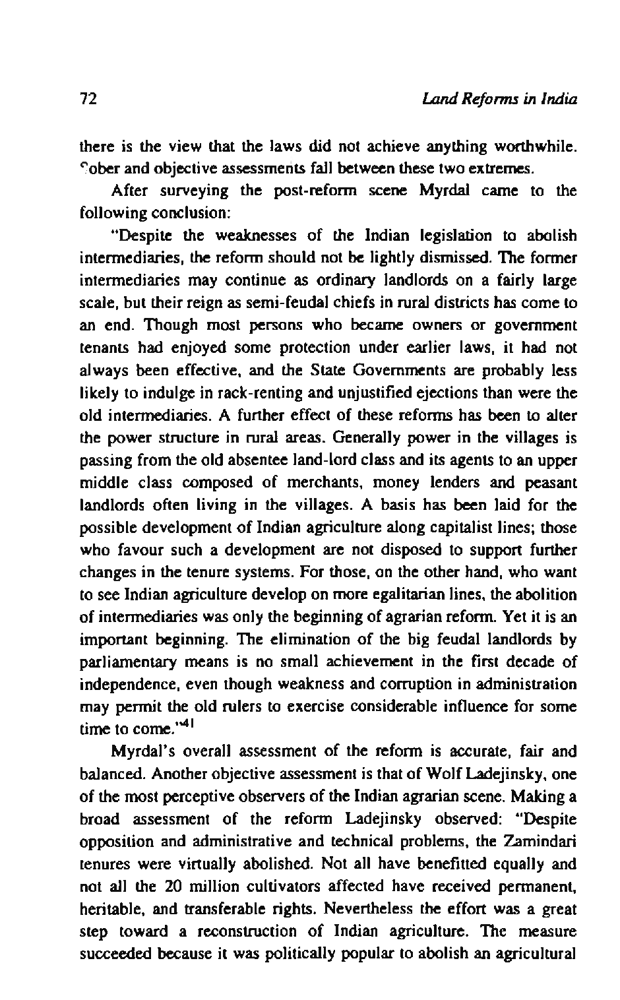

###### 72 Land Reforms in India

there is the view that the laws did not achieve anything worthwhile, rober and objective assessments fall between these two extremes.

After surveying the post-reform scene Myrdal came to the following conclusion:

“Despite the weaknesses of the Indian legislation to abolish intermediaries, the reform should not be lightly dismissed. The former intermediaries may continue as ordinary landlords on a fairly large scale, but their reign as semi-feudal chiefs in rural districts has come to an end. Though most persons who became owners or government tenants had enjoyed some protection under earlier laws, it had not always been effective, and the State Governments are probably less likely to indulge in rack-renting and unjustified ejections than were the old intermediaries. A further effect of these reforms has been to alter the power structure in rural areas. Generally power in the villages is passing from the old absentee land-lord class and its agents to an upper middle class composed of merchants, money lenders and peasant landlords often living in the villages. A basis has been laid for the possible development of Indian agriculture along capitalist lines; those who favour such a development are not disposed to support further changes in the tenure systems. For those, on the other hand, who want to see Indian agriculture develop on more egalitarian lines, the abolition of intermediaries was only the beginning of agrarian reform. Yet it is an important beginning. The elimination of the big feudal landlords by parliamentary means is no small achievement in the first decade of independence, even though weakness and corruption in administration may permit the old rulers to exercise considerable influence for some time to come.”41

Myrdal's overall assessment of the reform is accurate, fair and balanced. Another objective assessment is that of Wolf Ladejinsky, one of the most perceptive observers of the Indian agrarian scene. Making a broad assessment of the reform Ladejinsky observed: “Despite opposition and administrative and technical problems, the Zamindari tenures were virtually abolished. Not all have benefitted equally and not all the 20 million cultivators affected have received permanent, heritable, and transferable rights. Nevertheless the effort was a great step toward a reconstruction of Indian agriculture. The measure succeeded because it was politically popular to abolish an agricultural

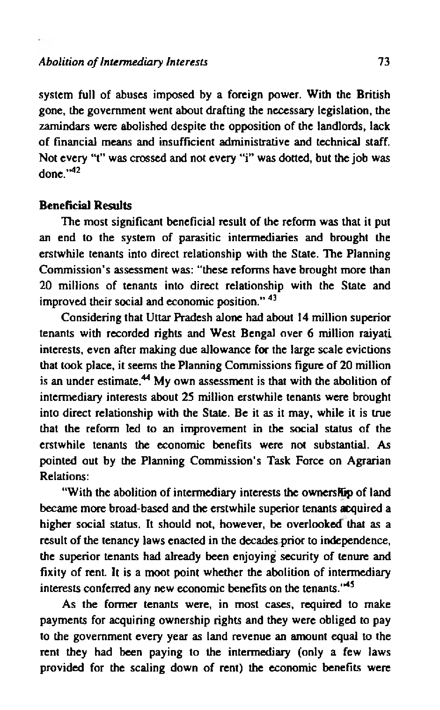

###### Abolition of Intermediary Interests 73

system full of abuses imposed by a foreign power. With the British gone, the government went about drafting the necessary legislation, the zamindars were abolished despite the opposition of the landlords, lack of financial means and insufficient administrative and technical staff. Not every “t” was crossed and not every “i” was dotted, but the job was done.”42

###### Beneficial Results

The most significant beneficial result of the reform was that it put an end to the system of parasitic intermediaries and brought the erstwhile tenants into direct relationship with the State. The Planning Commission’s assessment was: “these reforms have brought more than 20 millions of tenants into direct relationship with the State and improved their social and economic position.” 43

Considering that Uttar Pradesh alone had about 14 million superior tenants with recorded rights and West Bengal over 6 million raiyati interests, even after making due allowance for the large scale evictions that took place, it seems the Planning Commissions figure of 20 million is an under estimate.44 My own assessment is that with the abolition of intermediary interests about 25 million erstwhile tenants were brought into direct relationship with the State. Be it as it may, while it is true that the reform led to an improvement in the social status of the erstwhile tenants the economic benefits were not substantial. As pointed out by the Planning Commission’s Task Force on Agrarian Relations:

“With the abolition of intermediary interests the ownersftip of land became more broad-based and the erstwhile superior tenants acquired a higher social status. It should not, however, be overlooked that as a result of the tenancy laws enacted in the decades prior to independence, the superior tenants had already been enjoying security of tenure and fixity of rent. It is a moot point whether the abolition of intermediary interests conferred any new economic benefits on the tenants.”45

As the former tenants were, in most cases, required to make payments for acquiring ownership rights and they were obliged to pay to the government every year as land revenue an amount equal to the rent they had been paying to the intermediary (only a few laws provided for the scaling down of rent) the economic benefits were

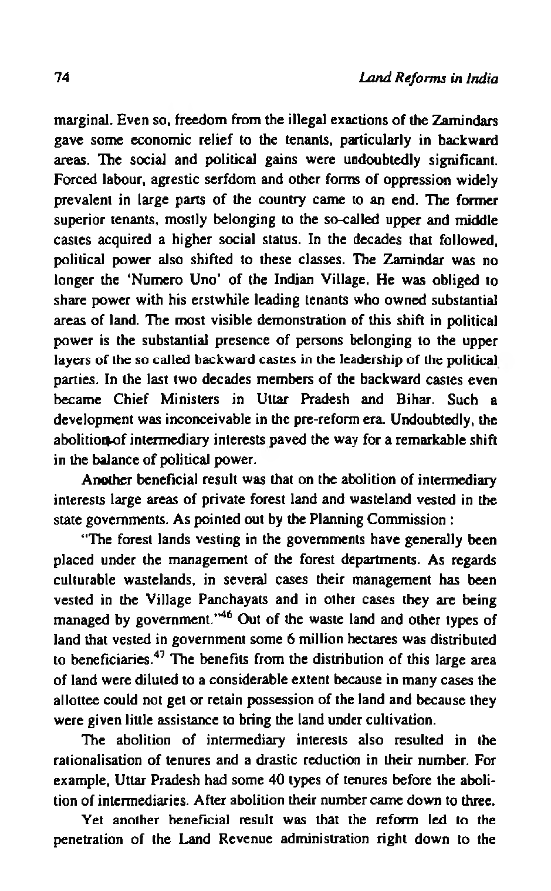

###### 74 Land Reforms in India

marginal. Even so, freedom from the illegal exactions of the Zamindars gave some economic relief to the tenants, particularly in backward areas. The social and political gains were undoubtedly significant. Forced labour, agrestic serfdom and other forms of oppression widely prevalent in large parts of the country came to an end. The former superior tenants, mostly belonging to the so-called upper and middle castes acquired a higher social status. In the decades that followed, political power also shifted to these classes. The Zamindar was no longer the ‘Numero Uno’ of the Indian Village. He was obliged to share power with his erstwhile leading tenants who owned substantial areas of land. The most visible demonstration of this shift in political power is the substantial presence of persons belonging to the upper layers of the so called backward castes in the leadership of the political parties. In the last two decades members of the backward castes even became Chief Ministers in Uttar Pradesh and Bihar. Such a development was inconceivable in the pre-reform era. Undoubtedly, the abolitioi*of intermediary interests paved the way for a remarkable shift in the balance of political power.

Another beneficial result was that on the abolition of intermediary interests large areas of private forest land and wasteland vested in the state governments. As pointed out by the Planning Commission :

“The forest lands vesting in the governments have generally been placed under the management of the forest departments. As regards culturable wastelands, in several cases their management has been vested in the Village Panchayats and in other cases they are being managed by government.”46 Out of the waste land and other types of land that vested in government some 6 million hectares was distributed to beneficiaries.47 The benefits from the distribution of this large area of land were diluted to a considerable extent because in many cases the allottee could not get or retain possession of the land and because they were given little assistance to bring the land under cultivation.

The abolition of intermediary interests also resulted in the rationalisation of tenures and a drastic reduction in their number. For example, Uttar Pradesh had some 40 types of tenures before the abolition of intermediaries. After abolition their number came down to three.

Yet another beneficial result was that the reform led to the penetration of the Land Revenue administration right down to the

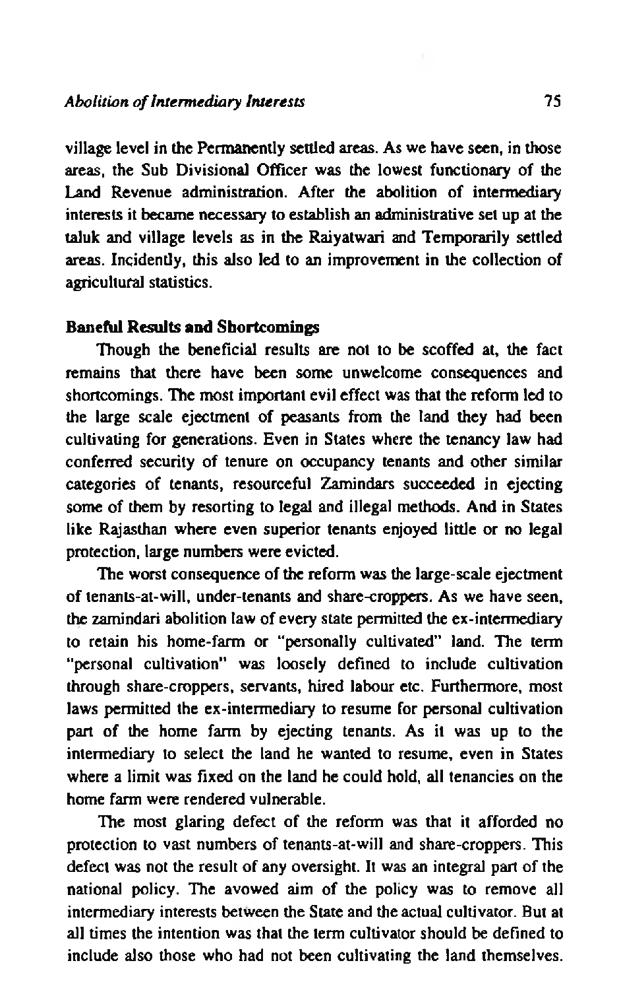

###### Abolition of Intermediary Interests 75

village level in the Permanently settled areas. As we have seen, in those areas, the Sub Divisional Officer was the lowest functionary of the Land Revenue administration. After the abolition of intermediary interests it became necessary to establish an administrative set up at the taluk and village levels as in the Raiyatwari and Temporarily settled areas. Incidently, this also led to an improvement in the collection of agricultural statistics.

###### BanefUl Results and Shortcomings

Though the beneficial results are not to be scoffed at, the fact remains that there have been some unwelcome consequences and shortcomings. The most important evil effect was that the reform led to the large scale ejectment of peasants from the land they had been cultivating for generations. Even in States where the tenancy law had conferred security of tenure on occupancy tenants and other similar categories of tenants, resourceful Zamindars succeeded in ejecting some of them by resorting to legal and illegal methods. And in States like Rajasthan where even superior tenants enjoyed little or no legal protection, large numbers were evicted.

The worst consequence of the reform was the large-scale ejectment of tenants-at-will, under-tenants and share-croppers. As we have seen, the zamindari abolition law of every state permitted the ex-intermediary to retain his home-farm or “personally cultivated” land. The term “personal cultivation” was loosely defined to include cultivation through share-croppers, servants, hired labour etc. Furthermore, most laws permitted the ex-intermediary to resume for personal cultivation part of the home farm by ejecting tenants. As it was up to the intermediary to select the land he wanted to resume, even in States where a limit was fixed on the land he could hold, all tenancies on the home farm were rendered vulnerable.

The most glaring defect of the reform was that it afforded no protection to vast numbers of tenants-at-will and share-croppers. This defect was not the result of any oversight. It was an integral part of the national policy. The avowed aim of the policy was to remove all intermediary interests between the State and the actual cultivator. But at all times the intention was that the term cultivator should be defined to include also those who had not been cultivating the land themselves.

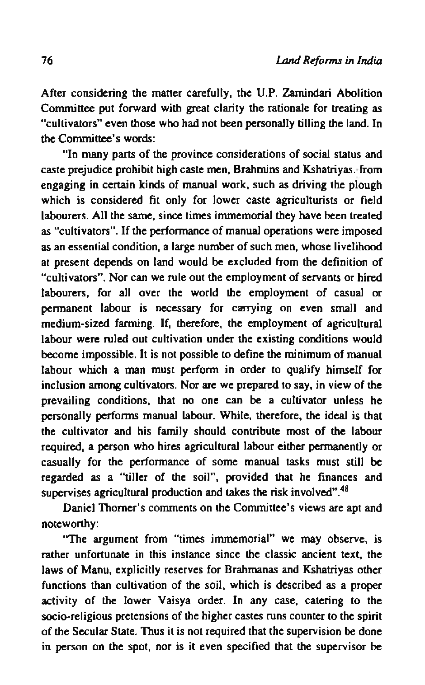

76 Land Reforms in India

After considering the matter carefully, the U.P. Zamindari Abolition Committee put forward with great clarity the rationale for treating as “cultivators” even those who had not been personally tilling the land. In the Committee’s words:

“In many parts of the province considerations of social status and caste prejudice prohibit high caste men, Brahmins and Kshatriyas. from engaging in certain kinds of manual work, such as driving the plough which is considered fit only for lower caste agriculturists or field labourers. All the same, since times immemorial they have been treated as “cultivators”. If the performance of manual operations were imposed

- as an essential condition, a large number of such men, whose livelihood
- at present depends on land would be excluded from the definition of “cultivators”. Nor can we rule out the employment of servants or hired labourers, for all over the world the employment of casual or permanent labour is necessary for carrying on even small and medium-sized farming. If, therefore, the employment of agricultural labour were ruled out cultivation under the existing conditions would become impossible. It is not possible to define the minimum of manual labour which a man must perform in order to qualify himself for inclusion among cultivators. Nor are we prepared to say, in view of the prevailing conditions, that no one can be a cultivator unless he personally performs manual labour. While, therefore, the ideal is that the cultivator and his family should contribute most of the labour required, a person who hires agricultural labour either permanently or casually for the performance of some manual tasks must still be regarded as a “tiller of the soil”, provided that he finances and supervises agricultural production and takes the risk involved”.48

Daniel Thomer’s comments on the Committee’s views are apt and noteworthy:

“The argument from “times immemorial” we may observe, is rather unfortunate in this instance since the classic ancient text, the laws of Manu, explicitly reserves for Brahmanas and Kshatriyas other functions than cultivation of the soil, which is described as a proper activity of the lower Vaisya order. In any case, catering to the socio-religious pretensions of the higher castes runs counter to the spirit of the Secular State. Thus it is not required that the supervision be done in person on the spot, nor is it even specified that the supervisor be

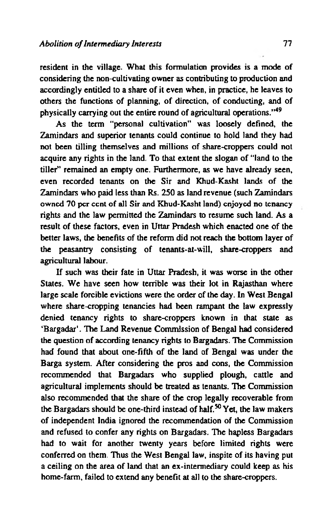

###### Abolition of Intermediary Interests 77

resident in the village. What this formulation provides is a mode of considering the non-cultivating owner as contributing to production and accordingly entitled to a share of it even when, in practice, he leaves to others the functions of planning, of direction, of conducting, and of physically carrying out the entire round of agricultural operations/*49

As the term “personal cultivation” was loosely defined, the Zamindars and superior tenants could continue to hold land they had not been tilling themselves and millions of share-croppers could not acquire any rights in the land. To that extent the slogan of “land to the tiller” remained an empty one. Furthermore, as we have already seen, even recorded tenants on the Sir and Khud-Kasht lands of the Zamindars who paid less than Rs. 250 as land revenue (such Zamindars owned 70 per ccnt of all Sir and Khud-Kasht land) enjoyed no tenancy rights and the law permitted the Zamindars to resume such land. As a result of these factors, even in Uttar Pradesh which enacted one of the better laws, the benefits of the reform did not reach the bottom layer of the peasantry consisting of tenants-at-will, share-croppers and agricultural labour.

If such was their fate in Uttar Pradesh, it was worse in the other States. We have seen how terrible was their lot in Rajasthan where large scale forcible evictions were the order of the day. In West Bengal where share-cropping tenancies had been rampant the law expressly denied tenancy rights to share-croppers known in that state as 4Bargadar'. The Land Revenue Commission of Bengal had considered the question of according tenancy rights to Bargadars. The Commission had found that about one-fifth of the land of Bengal was under the Barga system. After considering the pros and cons, the Commission recommended that Bargadars who supplied plough, cattle and agricultural implements should be treated as tenants. The Commission also recommended that the share of the crop legally recoverable from the Bargadars should be one-third instead of half.50 Yet, the law makers of independent India ignored the recommendation of the Commission and refused to confer any rights on Bargadars. The hapless Bargadars had to wait for another twenty years before limited rights were conferred on them. Thus the West Bengal law, inspite of its having put a ceiling on the area of land that an ex-intermediary could keep as his home-farm, failed to extend any benefit at all to the share-croppers.

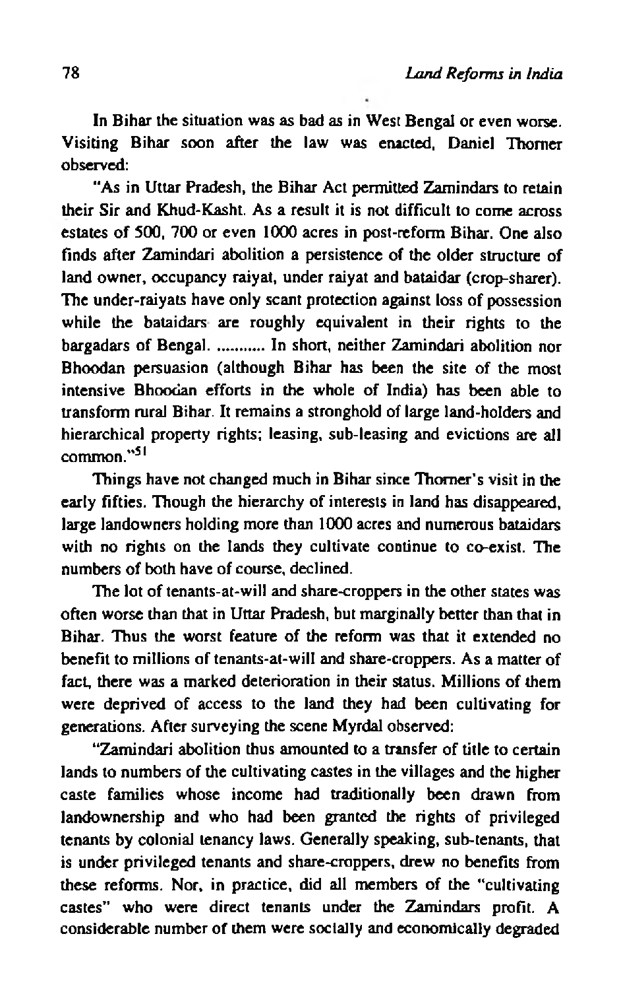

###### 78 Land Reforms in India

In Bihar the situation was as bad as in West Bengal or even worse. Visiting Bihar soon after the law was enacted, Daniel Thomer observed:

“As in Uttar Pradesh, the Bihar Act permitted Zamindars to retain their Sir and Khud-Kasht. As a result it is not difficult to come across estates of 500, 700 or even 1000 acres in post-reform Bihar. One also finds after Zamindari abolition a persistence of the older structure of land owner, occupancy raiyat, under raiyat and bataidar (crop-sharer). The under-raiyats have only scant protection against loss of possession while the bataidars are roughly equivalent in their rights to the bargadars of Bengal............. In short, neither Zamindari abolition nor Bhoodan persuasion (although Bihar has been the site of the most intensive Bhoodan efforts in the whole of India) has been able to transform rural Bihar. It remains a stronghold of large land-holders and hierarchical property rights; leasing, sub-leasing and evictions are all common.”51

Things have not changed much in Bihar since Thomer’s visit in the early fifties. Though the hierarchy of interests in land has disappeared, large landowners holding more than 1000 acres and numerous bataidars with no rights on the lands they cultivate continue to co-exist. The numbers of both have of course, declined.

The lot of tenants-at-will and share-croppers in the other states was often worse than that in Uttar Pradesh, but marginally better than that in Bihar. Thus the worst feature of the reform was that it extended no benefit to millions of tenants-at-will and share-croppers. As a matter of fact, there was a marked deterioration in their status. Millions of them were deprived of access to the land they had been cultivating for generations. After surveying the scene Myrdal observed:

“Zamindari abolition thus amounted to a transfer of title to certain lands to numbers of the cultivating castes in the villages and the higher caste families whose income had traditionally been drawn from landownership and who had been granted the rights of privileged tenants by colonial tenancy laws. Generally speaking, sub-tenants, that is under privileged tenants and share-croppers, drew no benefits from these reforms. Nor, in practice, did all members of the “cultivating castes” who were direct tenants under the Zamindars profit. A considerable number of them were socially and economically degraded

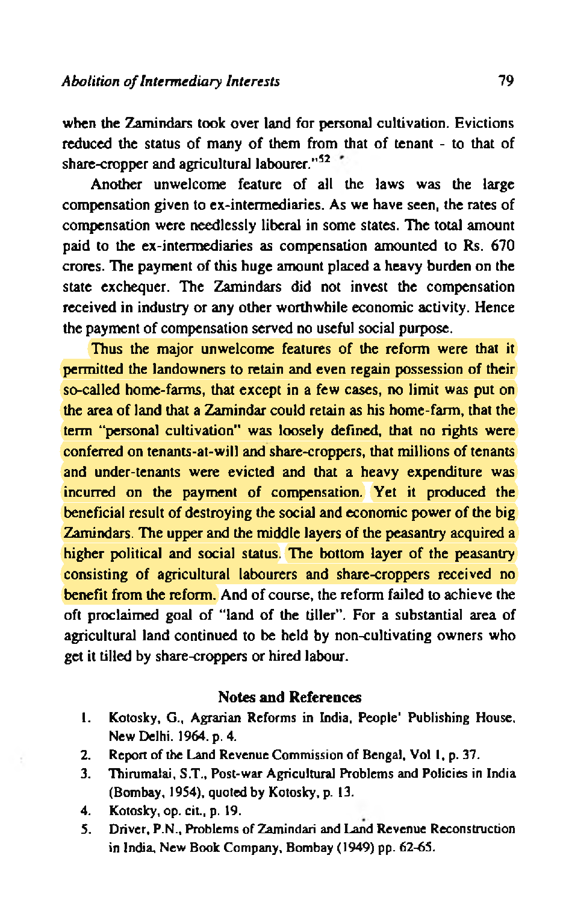

Abolition of Intermediary Interests 79

when the Zamindars took over land for personal cultivation. Evictions reduced the status of many of them from that of tenant - to that of share-cropper and agricultural labourer.”52

Another unwelcome feature of all the laws was the large compensation given to ex-intermediaries. As we have seen, the rates of compensation were needlessly liberal in some states. The total amount paid to the ex-intermediaries as compensation amounted to Rs. 670 crores. The payment of this huge amount placed a heavy burden on the state exchequer. The Zamindars did not invest the compensation received in industry or any other worthwhile economic activity. Hence the payment of compensation served no useful social purpose.

Thus the major unwelcome features of the reform were that it permitted the landowners to retain and even regain possession of their so-called home-farms, that except in a few cases, no limit was put on the area of land that a Zamindar could retain as his home-farm, that the term “personal cultivation” was loosely defined, that no rights were conferred on tenants-at-will and share-croppers, that millions of tenants and under-tenants were evicted and that a heavy expenditure was incurred on the payment of compensation. Yet it produced the beneficial result of destroying the social and economic power of the big Zamindars. The upper and the middle layers of the peasantry acquired a higher political and social status. The bottom layer of the peasantry consisting of agricultural labourers and share-croppers received no benefit from the reform. And of course, the reform failed to achieve the oft proclaimed goal of “land of the tiller”. For a substantial area of agricultural land continued to be held by non-cultivating owners who get it tilled by share-croppers or hired labour.

###### Notes and References

- 1. Kotosky, G., Agrarian Reforms in India, People’ Publishing House, New Delhi. 1964. p. 4.
- 2. Report of the Land Revenue Commission of Bengal, Vol 1, p. 37.
- 3. Thirumalai, S.T., Post-war Agricultural Problems and Policies in India (Bombay, 1954), quoted by Kotosky, p. 13.
- 4. Kotosky, op. cit., p. 19.
- 5. Driver, P.N., Problems of Zamindari and Land Revenue Reconstruction in India, New Book Company, Bombay (1949) pp. 62-65.

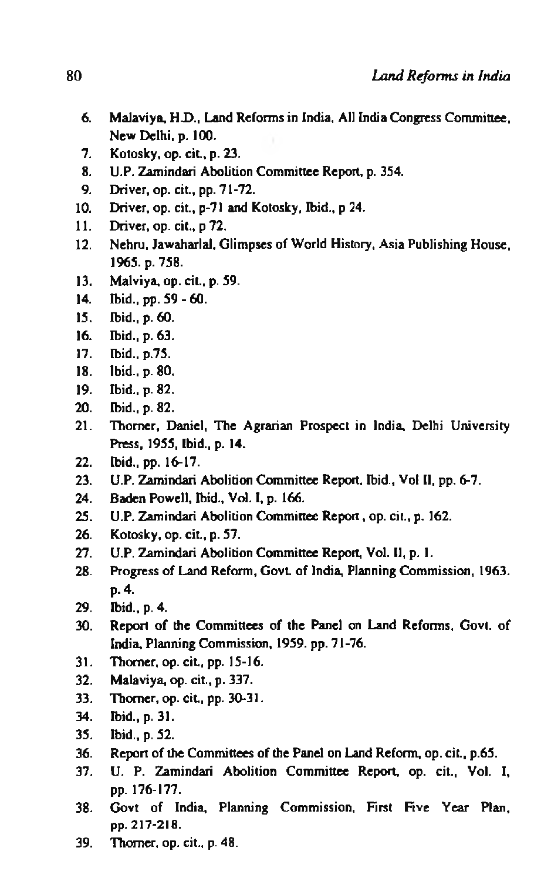

###### 80 Land Reforms in India

- 6. Malaviya, H.D., Land Reforms in India, All India Congress Committee, New Delhi, p. 100.
- 7. Kotosky, op. cit, p. 23.
- 8. U.P. Zamindari Abolition Committee Report, p. 354.
- 9. Driver, op. cit., pp. 71-72.
- 10. Driver, op. cit., p-71 and Kotosky, Ibid., p 24.
- 11. Driver, op. cit., p 72.
- 12. Nehru, Jawaharlal, Glimpses of World History, Asia Publishing House,

1965. p. 758.

- 13. Malviya, op. cit., p. 59.
- 14. Ibid., pp. 59 - 60.
- 15. Ibid., p. 60.
- 16. Ibid., p. 63.
- 17. Ibid., p.75.
- 18. Ibid., p. 80.
- 19. Ibid., p. 82.
- 20. Ibid., p. 82.
- 21. Thomer, Daniel, The Agrarian Prospect in India, Delhi University Press, 1955, Ibid., p. 14.
- 22. Ibid., pp. 16-17.
- 23. U.P. Zamindari Abolition Committee Report, Ibid., Vol II, pp. 6-7.
- 24. Baden Powell, Ibid., Vol. I, p. 166.
- 25. U.P. Zamindari Abolition Committee Report, op. cit., p. 162.
- 26. Kotosky, op. cit., p. 57.
- 27. U.P. Zamindari Abolition Committee Report, Vol. II, p. 1.
- 28. Progress of Land Reform, Govt, of India, Planning Commission, 1963. p. 4.
- 29. Ibid., p. 4.
- 30. Report of the Committees of the Panel on Land Reforms, Govt, of India, Planning Commission, 1959. pp. 71-76.
- 31. Thomer, op. cit., pp. 15-16.
- 32. Malaviya, op. cit., p. 337.
- 33. Thomer, op. cit, pp. 30-31.
- 34. Ibid., p. 31.
- 35. Ibid., p. 52.
- 36. Report of the Committees of the Panel on Land Reform, op. cit., p.65.
- 37. U. P. Zamindari Abolition Committee Report, op. cit.. Vol. I, pp. 176-177.
- 38. Govt of India, Planning Commission, First Five Year Plan, pp. 217-218.
- 39. Thomer, op. cit., p. 48.

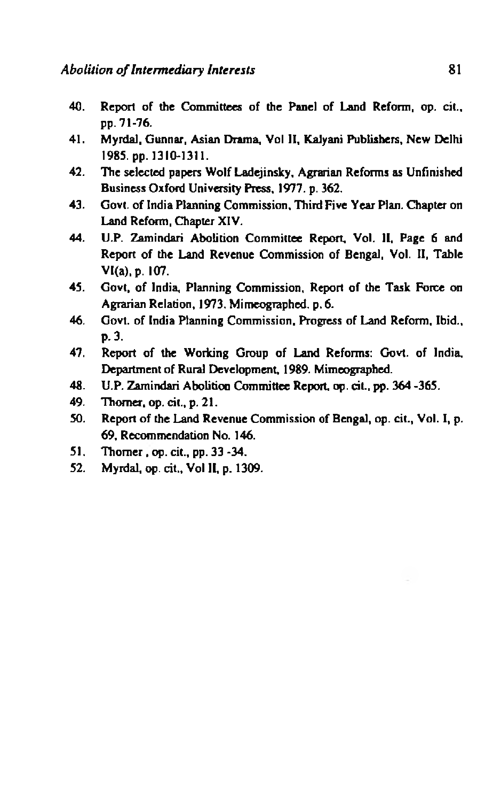

###### Abolition of Intermediary Interests 81

- 40. Report of the Committees of the Panel of Land Reform, op. cit., pp. 71-76.
- 41. Myrdal, Gunnar, Asian Drama, Vol II, Kalyani Publishers, New Delhi

1985. pp. 1310-1311.

- 42. The selected papers Wolf Ladejinsky, Agrarian Reforms as Unfinished Business Oxford University Press, 1977. p. 362.
- 43. Govt, of India Planning Commission, Third Five Year Plan. Chapter on Land Reform, Chapter XIV.
- 44. U.P. Zamindari Abolition Committee Report, Vol. II, Page 6 and Report of the Land Revenue Commission of Bengal, Vol. II, Table VI(a), p. 107.
- 45. Govt, of India, Planning Commission, Report of the Task Force on Agrarian Relation, 1973. Mimeographed, p. 6.
- 46. Govt, of India Planning Commission. Progress of Land Reform. Ibid., p. 3.
- 47. Report of the Working Group of Land Reforms: Govt, of India, Department of Rural Development, 1989. Mimeographed.
- 48. U.P. Zamindari Abolition Committee Report, op. ciL, pp. 364 -365.
- 49. Thomer, op. cit., p. 21.
- 50. Report of the Land Revenue Commission of Bengal, op. cit., Vol. I, p. 69, Recommendation No. 146.
- 51. Thomer, op. cit., pp. 33 -34.
- 52. Myrdal, op. cit., Vol II, p. 1309.

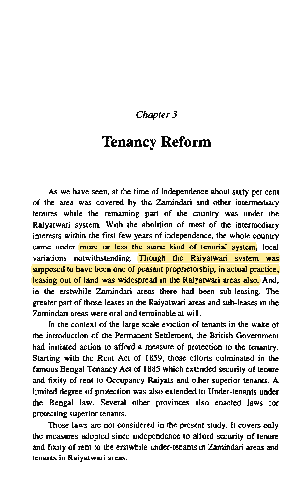

###### Chapter 3

### Tenancy Reform

As we have seen, at the time of independence about sixty per cent of the area was covered by the Zamindari and other intermediary tenures while the remaining part of the country was under the Raiyatwari system. With the abolition of most of the intermediary interests within the first few years of independence, the whole country came under more or less the same kind of tenurial system, local variations notwithstanding. Though the Raiyatwari system was supposed to have been one of peasant proprietorship, in actual practice, leasing out of land was widespread in the Raiyatwari areas also. And, in the erstwhile Zamindari areas there had been sub-leasing. The greater part of those leases in the Raiyatwari areas and sub-leases in the Zamindari areas were oral and terminable at will.

In the context of the large scale eviction of tenants in the wake of the introduction of the Permanent Settlement, the British Government had initiated action to afford a measure of protection to the tenantry. Starting with the Rent Act of 1859, those efforts culminated in the famous Bengal Tenancy Act of 1885 which extended security of tenure and fixity of rent to Occupancy Raiyats and other superior tenants. A limited degree of protection was also extended to Under-tenants under the Bengal law. Several other provinces also enacted laws for protecting superior tenants.

Those laws are not considered in the present study. It covers only the measures adopted since independence to afford security of tenure and fixity of rent to the erstwhile under-tenants in Zamindari areas and tenants in Raiyatwari areas.

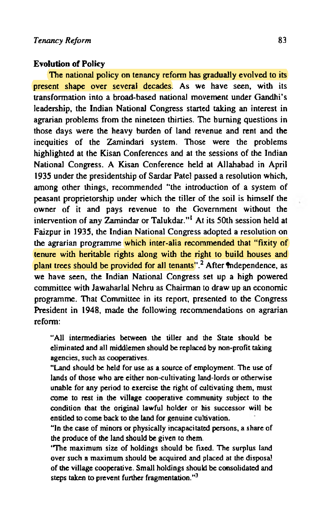

Tenancy Reform 83

###### Evolution of Policy

The national policy on tenancy reform has gradually evolved to its present shape over several decades. As we have seen, with its transformation into a broad-based national movement under Gandhi’s leadership, the Indian National Congress started taking an interest in agrarian problems from the nineteen thirties. The burning questions in those days were the heavy burden of land revenue and rent and the inequities of the Zamindari system. Those were the problems highlighted at the Kisan Conferences and at the sessions of the Indian National Congress. A Kisan Conference held at Allahabad in April 1935 under the presidentship of Sardar Patel passed a resolution which, among other things, recommended “the introduction of a system of peasant proprietorship under which the tiller of the soil is himself the owner of it and pays revenue to the Government without the intervention of any Zamindar or Talukdar.”1 Al its 50th session held at Faizpur in 1935, the Indian National Congress adopted a resolution on the agrarian programme which inter-alia recommended that “fixity of tenure with heritable rights along with the right to build houses and plant trees should be provided for all tenants”.2 After independence, as we have seen, the Indian National Congress set up a high powered committee with Jawaharlal Nehru as Chairman to draw up an economic programme. That Committee in its report, presented to the Congress President in 1948, made the following recommendations on agrarian reform:

“All intermediaries between the tiller and the State should be eliminated and all middlemen should be replaced by non-profit taking agencies, such as cooperatives. “Land should be held for use as a source of employment. The use of lands of those who are either non-cultivating land-lords or otherwise unable for any period to exercise the right of cultivating them, must come to rest in the village cooperative community subject to the condition that the original lawful holder or his successor will be entitled to come back to the land for genuine cultivation. “In the case of minors or physically incapacitated persons, a share of the produce of the land should be given to them. “The maximum size of holdings should be fixed. The surplus land over such a maximum should be acquired and placed at the disposal of the village cooperative. Small holdings should be consolidated and steps taken to prevent further fragmentation.”3

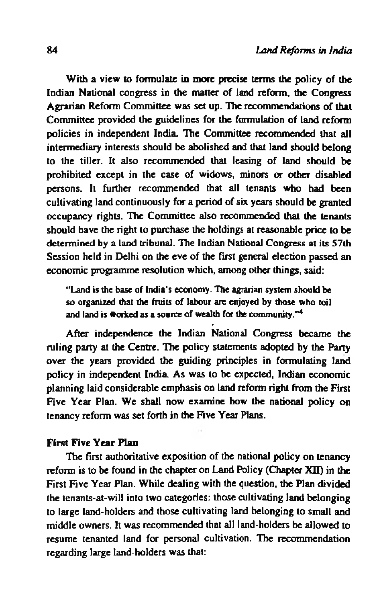

###### 84 Land Reforms in India

With a view to formulate in more precise terms the policy of the Indian National congress in the matter of land reform, the Congress Agrarian Reform Committee was set up. The recommendations of that Committee provided the guidelines for the formulation of land reform policies in independent India. The Committee recommended that all intermediary interests should be abolished and that land should belong to the tiller. It also recommended that leasing of land should be prohibited except in the case of widows, minors or other disabled persons. It further recommended that all tenants who had been cultivating land continuously for a period of six years should be granted occupancy rights. The Committee also recommended that the tenants should have the right to purchase the holdings at reasonable price to be determined by a land tribunal. Hie Indian National Congress at its 57th Session held in Delhi on the eve of the first general election passed an economic programme resolution which, among other things, said:

“Land is the base of India's economy. The agrarian system should be so organized that the fruits of labour are enjoyed by those who toil and land is #orked as a source of wealth for the community."4

#

After independence the Indian National Congress became the ruling party at the Centre. The policy statements adopted by the Party over the years provided the guiding principles in formulating land policy in independent India. As was to be expected, Indian economic planning laid considerable emphasis on land reform right from the First Five Year Plan. We shall now examine how the national policy on tenancy reform was set forth in the Five Year Plans.

###### First Five Year Plan

The first authoritative exposition of the national policy on tenancy reform is to be found in the chapter on Land Policy (Chapter XU) in the First Five Year Plan. While dealing with the question, the Plan divided the tenants-at-will into two categories: those cultivating land belonging to large land-holders and those cultivating land belonging to small and middle owners. It was recommended that all land-holders be allowed to resume tenanted land for personal cultivation. The recommendation regarding large land-holders was that:

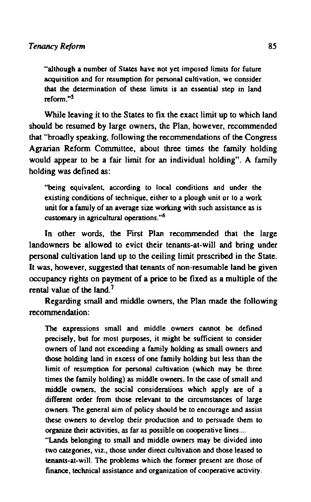

Tenancy Reform 85

“although a number of States have not yet imposed limits for future acquisition and for resumption for personal cultivation, we consider that the determination of these limits is an essential step in land reform.”5

While leaving it to the States to fix the exact limit up to which land should be resumed by large owners, the Plan, however, recommended that “broadly speaking, following the recommendations of the Congress Agrarian Reform Committee, about three times the family holding would appear to be a fair limit for an individual holding”. A family holding was defined as:

“being equivalent, according to local conditions and under the existing conditions of technique, either to a plough unit or to a work unit for a family of an average size working with such assistance as is customary in agricultural operations.”6

In other words, the First Plan recommended that the large landowners be allowed to evict their tenants-at-will and bring under personal cultivation land up to the ceiling limit prescribed in the State. It was, however, suggested that tenants of non-resumable land be given occupancy rights on payment of a price to be fixed as a multiple of the rental value of the land.7

Regarding small and middle owners, the Plan made the following recommendation:

The expressions small and middle owners cannot be defined precisely, but for most purposes, it might be sufficient to consider owners of land not exceeding a family holding as small owners and those holding land in excess of one family holding but less than the limit of resumption for personal cultivation (which may be three times the family holding) as middle owners. In the case of small and middle owners, the social considerations which apply are of a different order from those relevant to the circumstances of large owners. The general aim of policy should be to encourage and assist these owners to develop their production and to persuade them to organize their activities, as far as possible on cooperative lines.... “Lands belonging to small and middle owners may be divided into two categories, viz., those under direct cultivation and those leased to tenants-at-will. The problems which the former present are those of finance, technical assistance and organization of cooperative activity.

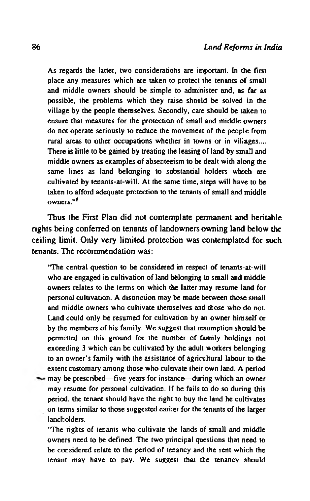

###### 86 Land Reforms in India

As regards the latter, two considerations are important. In the first place any measures which are taken to protect the tenants of small and middle owners should be simple to administer and, as far as possible, the problems which they raise should be solved in the village by the people themselves. Secondly, care should be taken to ensure that measures for the protection of small and middle owners do not operate seriously to reduce the movement of the people from rural areas to other occupations whether in towns or in villages.... There is little to be gained by treating the leasing of land by small and middle owners as examples of absenteeism to be dealt with along the same lines as land belonging to substantial holders which are cultivated by tenants-at-will. At the same time, steps will have to be taken to afford adequate protection to the tenants of small and middle owners.”*

###### Thus the First Plan did not contemplate permanent and heritable rights being conferred on tenants of landowners owning land below the ceiling limit. Only very limited protection was contemplated for such tenants. The recommendation was:

'The central question to be considered in respect of tenants-at-will who are engaged in cultivation of land belonging to small and middle owners relates to the terms on which the latter may resume land for personal cultivation. A distinction may be made between those small and middle owners who cultivate themselves and those who do not. Land could only be resumed for cultivation by an owner himself or by the members of his family. We suggest that resumption should be permitted on this ground for the number of family holdings not exceeding 3 which can be cultivated by the adult workers belonging to an owner’s family with the assistance of agricultural labour to the extent customary among those who cultivate their own land. A period may be prescribed—five years for instance—during which an owner may resume for personal cultivation. If he fails to do so during this period, the tenant should have the right to buy the land he cultivates on terms similar to those suggested earlier for the tenants of the larger landholders. “The rights of tenants who cultivate the lands of small and middle owners need to be defined. The two principal questions that need to be considered relate to the period of tenancy and the rent which the tenant may have to pay. We suggest that the tenancy should

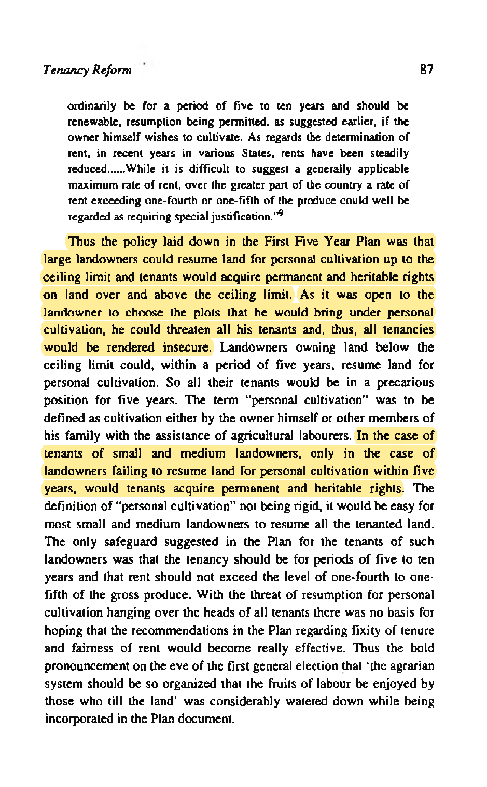

###### Tenancy Reform 87

ordinarily be for a period of five to ten years and should be renewable, resumption being permitted, as suggested earlier, if the owner himself wishes to cultivate. As regards the determination of rent, in recent years in various States, rents have been steadily reduced.....While it is difficult to suggest a generally applicable maximum rate of rent, over the greater part of the country a rate of rent exceeding one-fourth or one-fifth of the produce could well be regarded as requiring special justification.”9

Thus the policy laid down in the First Five Year Plan was that large landowners could resume land for jpersonal cultivation up to the ceiling limit and tenants would acquire permanent and heritable rights on land over and above the ceiling limit. As it was open to the landowner to choose the plots that he would bring under personal cultivation, he could threaten all his tenants and, thus, all tenancies would be rendered insecure. Landowners owning land below the ceiling limit could, within a period of five years, resume land for personal cultivation. So all their tenants would be in a precarious position for five years. The term “personal cultivation” was to be defined as cultivation either by the owner himself or other members of his family with the assistance of agricultural labourers. In the case of tenants of small and medium landowners, only in the case of landowners failing to resume land for personal cultivation within five years, would tenants acquire permanent and heritable rights. The definition of “personal cultivation” not being rigid, it would be easy for most small and medium landowners to resume all the tenanted land. The only safeguard suggested in the Plan for the tenants of such landowners was that the tenancy should be for periods of five to ten years and that rent should not exceed the level of one-fourth to onefifth of the gross produce. With the threat of resumption for personal cultivation hanging over the heads of all tenants there was no basis for hoping that the recommendations in the Plan regarding fixity of tenure and fairness of rent would become really effective. Thus the bold pronouncement on the eve of the first general election that ‘the agrarian system should be so organized that the fruits of labour be enjoyed by those who till the land’ was considerably watered down while being incorporated in the Plan document.

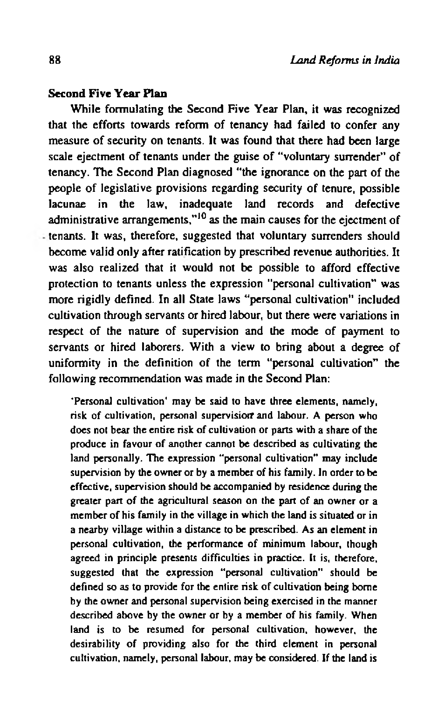

###### 88 Land Reforms in India

###### Second Five Year Plan

While formulating the Second Five Year Plan, it was recognized that the efforts towards reform of tenancy had failed to confer any measure of security on tenants. It was found that there had been large scale ejectment of tenants under the guise of “voluntary surrender” of tenancy. The Second Plan diagnosed “the ignorance on the part of the people of legislative provisions regarding security of tenure, possible lacunae in the law, inadequate land records and defective administrative arrangements,”10 as the main causes for the ejectment of tenants. It was, therefore, suggested that voluntary surrenders should become valid only after ratification by prescribed revenue authorities. It was also realized that it would not be possible to afford effective protection to tenants unless the expression “personal cultivation” was more rigidly defined. In all State laws “personal cultivation” included cultivation through servants or hired labour, but there were variations in respect of the nature of supervision and the mode of payment to servants or hired laborers. With a view to bring about a degree of uniformity in the definition of the term “personal cultivation” the following recommendation was made in the Second Plan:

‘Personal cultivation’ may be said to have three elements, namely, risk of cultivation, personal supervision and labour. A person who does not bear the entire risk of cultivation or parts with a share of the produce in favour of another cannot be described as cultivating the land personally. The expression “personal cultivation” may include supervision by the owner or by a member of his family. In order to be effective, supervision should be accompanied by residence during the greater part of the agricultural season on the part of an owner or a member of his family in the village in which the land is situated or in a nearby village within a distance to be prescribed. As an element in personal cultivation, the performance of minimum labour, though agreed in principle presents difficulties in practice. It is, therefore, suggested that the expression “personal cultivation” should be defined so as to provide for the entire risk of cultivation being borne by the owner and personal supervision being exercised in the manner described above by the owner or by a member of his family. When land is to be resumed for personal cultivation, however, the desirability of providing also for the third element in personal cultivation, namely, personal labour, may be considered. If the land is

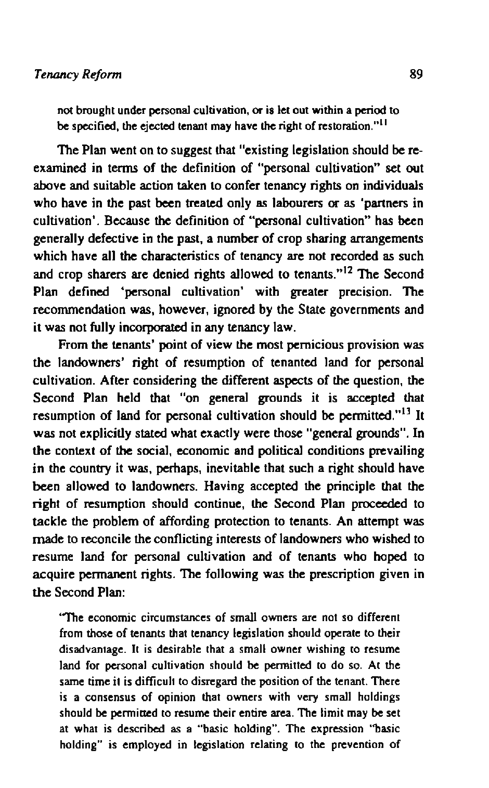

###### Tenancy Reform 89

not brought under personal cultivation, or is let out within a period to be specified, the ejected tenant may have the right of restoration.”11

The Plan went on to suggest that “existing legislation should be reexamined in terms of the definition of “personal cultivation” set out above and suitable action taken to confer tenancy rights on individuals who have in the past been treated only as labourers or as ‘partners in cultivation’. Because the definition of “personal cultivation” has been generally defective in the past, a number of crop sharing arrangements which have all the characteristics of tenancy are not recorded as such and crop sharers are denied rights allowed to tenants.”12 The Second Plan defined ‘personal cultivation’ with greater precision. The recommendation was, however, ignored by the State governments and it was not fully incorporated in any tenancy law.

From the tenants’ point of view the most pernicious provision was the landowners’ right of resumption of tenanted land for personal cultivation. After considering the different aspects of the question, the Second Plan held that “on general grounds it is accepted that resumption of land for personal cultivation should be permitted.”13 It was not explicitly stated what exactly were those “general grounds”. In the context of the social, economic and political conditions prevailing in the country it was, perhaps, inevitable that such a right should have been allowed to landowners. Having accepted the principle that the right of resumption should continue, the Second Plan proceeded to tackle the problem of affording protection to tenants. An attempt was made to reconcile the conflicting interests of landowners who wished to resume land for personal cultivation and of tenants who hoped to acquire permanent rights. The following was the prescription given in the Second Plan:

“The economic circumstances of small owners are not so different from those of tenants that tenancy legislation should operate to their disadvantage. It is desirable that a small owner wishing to resume land for personal cultivation should be permitted to do so. At the same time it is difficult to disregard the position of the tenant. There is a consensus of opinion that owners with very small holdings should be permitted to resume their entire area. The limit may be set at what is described as a “basic holding”. The expression “basic holding” is employed in legislation relating to the prevention of

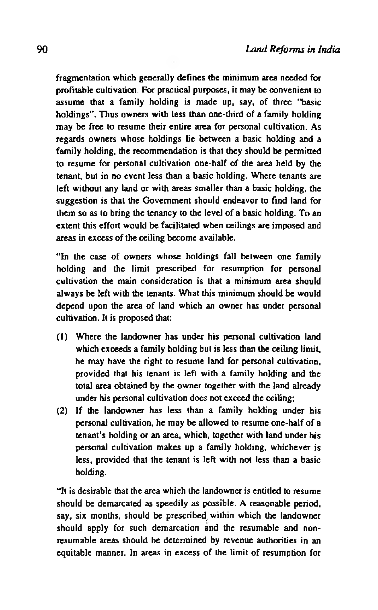

###### 90 Land Reforms in India

fragmentation which generally defines the minimum area needed for profitable cultivation. For practical purposes, it may be convenient to assume that a family holding is made up, say, of three “basic holdings”. Thus owners with less than one-third of a family holding may be free to resume their entire area for personal cultivation. As regards owners whose holdings lie between a basic holding and a family holding, the recommendation is that they should be permitted to resume for personal cultivation one-half of the area held by the tenant, but in no event less than a basic holding. Where tenants are left without any land or with areas smaller than a basic holding, the suggestion is that the Government should endeavor to find land for them so as to bring the tenancy to the level of a basic holding. To an extent this effort would be facilitated when ceilings are imposed and areas in excess of the ceiling become available.

“In the case of owners whose holdings fall between one family holding and the limit prescribed for resumption for personal cultivation the main consideration is that a minimum area should always be left with the tenants. What this minimum should be would depend upon the area of land which an owner has under personal cultivation. It is proposed that:

- (1) Where the landowner has under his personal cultivation land which exceeds a family holding but is less than the ceiling limit, he may have the right to resume land for personal cultivation, provided that his tenant is left with a family holding and the total area obtained by the owner together with the land already under his personal cultivation does not exceed the ceiling;
- (2) If the landowner has less than a family holding under his personal cultivation, he may be allowed to resume one-half of a tenant’s holding or an area, which, together with land under his personal cultivation makes up a family holding, whichever is less, provided that the tenant is left with not less than a basic holding.

“It is desirable that the area which the landowner is entitled to resume should be demarcated as speedily as possible. A reasonable period, say, six months, should be prescribed^, within which the landowner should apply for such demarcation and the resumable and nonresumable areas should be determined by revenue authorities in an equitable manner. In areas in excess of the limit of resumption for

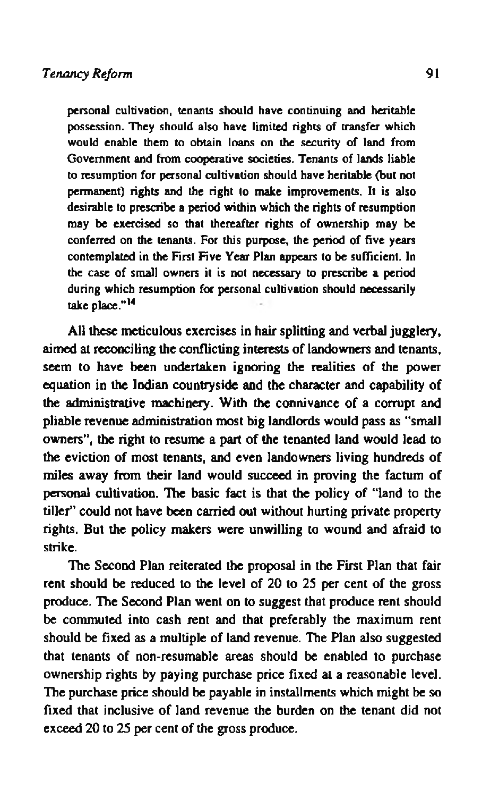

###### Tenancy Reform 91

personal cultivation, tenants should have continuing and heritable possession. They should also have limited rights of transfer which would enable them to obtain loans on the security of land from Government and from cooperative societies. Tenants of lands liable to resumption for personal cultivation should have heritable (but not permanent) rights and the right to make improvements. It is also desirable to prescribe a period within which the rights of resumption may be exercised so that thereafter rights of ownership may be conferred on the tenants. For this purpose, the period of five years contemplated in the First Five Year Plan appears to be sufficient. In the case of small owners it is not necessary to prescribe a period during which resumption for personal cultivation should necessarily take place.”14

All these meticulous exercises in hair splitting and verbal jugglery, aimed at reconciling the conflicting interests of landowners and tenants, seem to have been undertaken ignoring the realities of the power equation in the Indian countryside and the character and capability of the administrative machinery. With the connivance of a corrupt and pliable revenue administration most big landlords would pass as “small owners", the right to resume a part of the tenanted land would lead to the eviction of most tenants, and even landowners living hundreds of miles away from their land would succeed in proving the factum of personal cultivation. The basic fact is that the policy of “land to the tiller” could not have been carried out without hurting private property rights. But the policy makers were unwilling to wound and afraid to strike.

The Second Plan reiterated the proposal in the First Plan that fair rent should be reduced to the level of 20 to 25 per cent of the gross produce. The Second Plan went on to suggest that produce rent should be commuted into cash rent and that preferably the maximum rent should be fixed as a multiple of land revenue. The Plan also suggested that tenants of non-resumable areas should be enabled to purchase ownership rights by paying purchase price fixed at a reasonable level. The purchase price should be payable in installments which might be so fixed that inclusive of land revenue the burden on the tenant did not exceed 20 to 25 per cent of the gross produce.

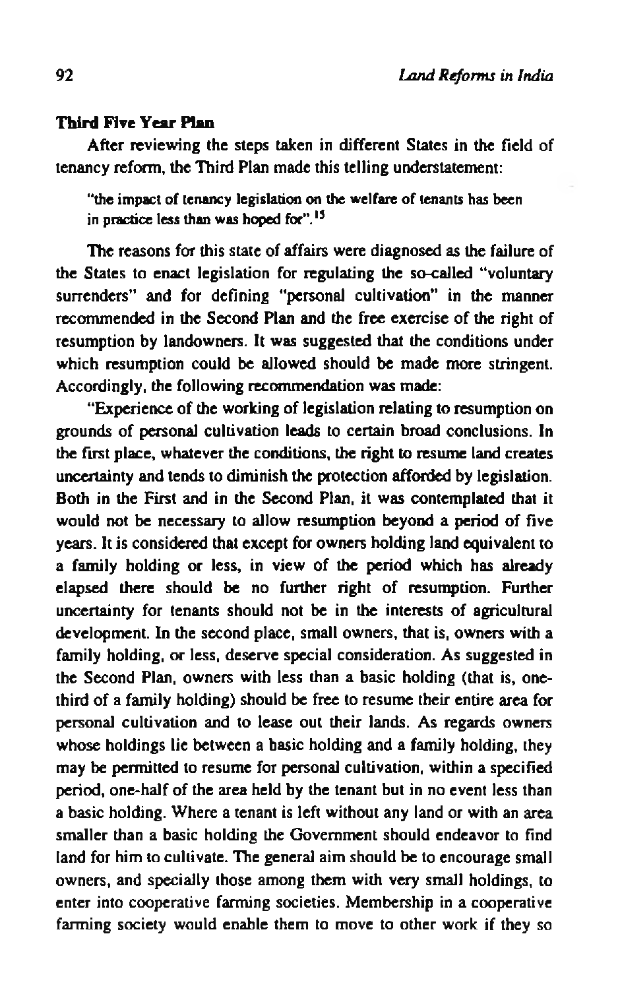

###### 92 Land Reforms in India

###### Third Five Year Plan

After reviewing the steps taken in different States in the field of tenancy reform, the Third Plan made this telling understatement:

“the impact of tenancy legislation on the welfare of tenants has been in practice less than was hoped for”.15

The reasons for this state of affairs were diagnosed as the failure of the States to enact legislation for regulating the so-called “voluntary surrenders” and for defining “personal cultivation” in the manner recommended in the Second Plan and the free exercise of the right of resumption by landowners. It was suggested that the conditions under which resumption could be allowed should be made more stringent. Accordingly, the following recommendation was made:

“Experience of the working of legislation relating to resumption on grounds of personal cultivation leads to certain broad conclusions. In the first place, whatever the conditions, the right to resume land creates uncertainty and tends to diminish the protection afforded by legislation. Both in the First and in the Second Plan, it was contemplated that it would not be necessary to allow resumption beyond a period of five years. It is considered that except for owners holding land equivalent to a family holding or less, in view of the period which has already elapsed there should be no further right of resumption. Further uncertainty for tenants should not be in the interests of agricultural development. In the second place, small owners, that is, owners with a family holding, or less, deserve special consideration. As suggested in the Second Plan, owners with less than a basic holding (that is, onethird of a family holding) should be free to resume their entire area for personal cultivation and to lease out their lands. As regards owners whose holdings lie between a basic holding and a family holding, they may be permitted to resume for personal cultivation, within a specified period, one-half of the area held by the tenant but in no event less than a basic holding. Where a tenant is left without any land or with an area smaller than a basic holding the Government should endeavor to find land for him to cultivate. The general aim should be to encourage small owners, and specially those among them with very small holdings, to enter into cooperative farming societies. Membership in a cooperative farming society would enable them to move to other work if they so

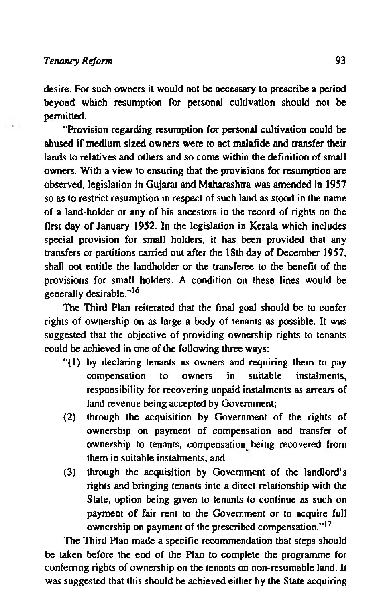

###### Tenancy Reform 93

desire. For such owners it would not be necessary to prescribe a period beyond which resumption for personal cultivation should not be permitted.

“Provision regarding resumption for personal cultivation could be abused if medium sized owners were to act malafide and transfer their lands to relatives and others and so come within the definition of small owners. With a view to ensuring that the provisions for resumption are observed, legislation in Gujarat and Maharashtra was amended in 1957 so as to restrict resumption in respect of such land as stood in the name of a land-holder or any of his ancestors in the record of rights on the first day of January 1952. In the legislation in Kerala which includes special provision for small holders, it has been provided that any transfers or partitions carried out after the 18th day of December 1957, shall not entitle the landholder or the transferee to the benefit of the provisions for small holders. A condition on these lines would be generally desirable.”16

The Third Plan reiterated that the final goal should be to confer rights of ownership on as large a body of tenants as possible. It was suggested that the objective of providing ownership rights to tenants could be achieved in one of the following three ways:

“(1) by declaring tenants as owners and requiring them to pay

compensation to owners in suitable instalments, responsibility for recovering unpaid instalments as arrears of land revenue being accepted by Government;

- (2) through the acquisition by Government of the rights of ownership on payment of compensation and transfer of ownership to tenants, compensation^ being recovered from them in suitable instalments; and
- (3) through the acquisition by Government of the landlord’s rights and bringing tenants into a direct relationship with the State, option being given to tenants to continue as such on payment of fair rent to the Government or to acquire full ownership on payment of the prescribed compensation.”17

The Third Plan made a specific recommendation that steps should be taken before the end of the Plan to complete the programme for conferring rights of ownership on the tenants on non-resumable land. It was suggested that this should be achieved either by the State acquiring

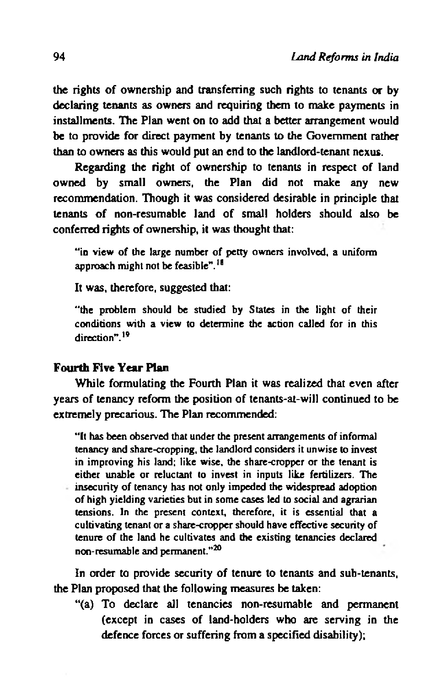

###### 94 Land Reforms in India

the rights of ownership and transferring such rights to tenants or by declaring tenants as owners and requiring them to make payments in installments. The Plan went on to add that a better arrangement would be to provide for direct payment by tenants to the Government rather than to owners as this would put an end to the landlord-tenant nexus.

Regarding the right of ownership to tenants in respect of land owned by small owners, the Plan did not make any new recommendation. Though it was considered desirable in principle that tenants of non-resumable land of small holders should also be conferred rights of ownership, it was thought that:

“in view of the large number of petty owners involved, a uniform approach might not be feasible”.18

It was, therefore, suggested that:

“the problem should be studied by States in the light of their conditions with a view to determine the action called for in this direction”.19

###### Fourth Five Year Plan

While formulating the Fourth Plan it was realized that even after years of tenancy reform the position of tenants-at-will continued to be extremely precarious. The Plan recommended:

“It has been observed that under the present arrangements of informal tenancy and share-cropping, the landlord considers it unwise to invest in improving his land; like wise, the share-cropper or the tenant is either unable or reluctant to invest in inputs like fertilizers. The

• insecurity of tenancy has not only impeded the widespread adoption of high yielding varieties but in some cases led to social and agrarian tensions. In the present context, therefore, it is essential that a cultivating tenant or a share-cropper should have effective security of tenure of the land he cultivates and the existing tenancies declared non-resumable and permanent.”20

In order to provide security of tenure to tenants and sub-tenants, the Plan proposed that the following measures be taken:

“(a) To declare all tenancies non-resumable and permanent (except in cases of land-holders who are serving in the defence forces or suffering from a specified disability);

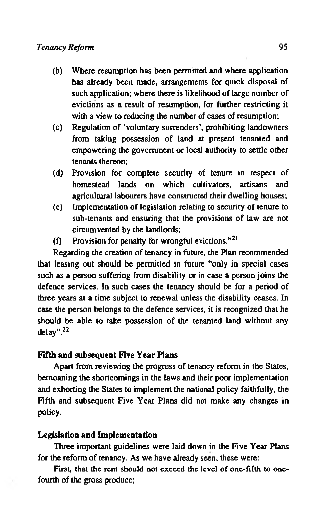

###### Tenancy Reform 95

- (b) Where resumption has been permitted and where application has already been made, arrangements for quick disposal of such application; where there is likelihood of large number of evictions as a result of resumption, for further restricting it with a view to reducing the number of cases of resumption;
- (c) Regulation of ‘voluntary surrenders’, prohibiting landowners from taking possession of land at present tenanted and empowering the government or local authority to settle other tenants thereon;
- (d) Provision for complete security of tenure in respect of homestead lands on which cultivators, artisans and agricultural labourers have constructed their dwelling houses;
- (e) Implementation of legislation relating to security of tenure to sub-tenants and ensuring that the provisions of law are not circumvented by the landlords;

(0 Provision for penalty for wrongful evictions.”21

Regarding the creation of tenancy in future, the Plan recommended that leasing out should be permitted in future “only in special cases such as a person suffering from disability or in case a person joins the defence services. In such cases the tenancy should be for a period of three years at a time subject to renewal unless the disability ceases. In case the person belongs to the defence services, it is recognized that he should be able to take possession of the tenanted land without any delay”.22

###### Fifth and subsequent Five Year Plans

Apart from reviewing the progress of tenancy reform in the States, bemoaning the shortcomings in the laws and their poor implementation and exhorting the States to implement the national policy faithfully, the Fifth and subsequent Five Year Plans did not make any changes in policy.

###### Legislation and Implementation

Three important guidelines were laid down in the Five Year Plans for the reform of tenancy. As we have already seen, these were:

First, that the rent should not cxcccd the level of one-fifth to one-

fourth of the gross produce;

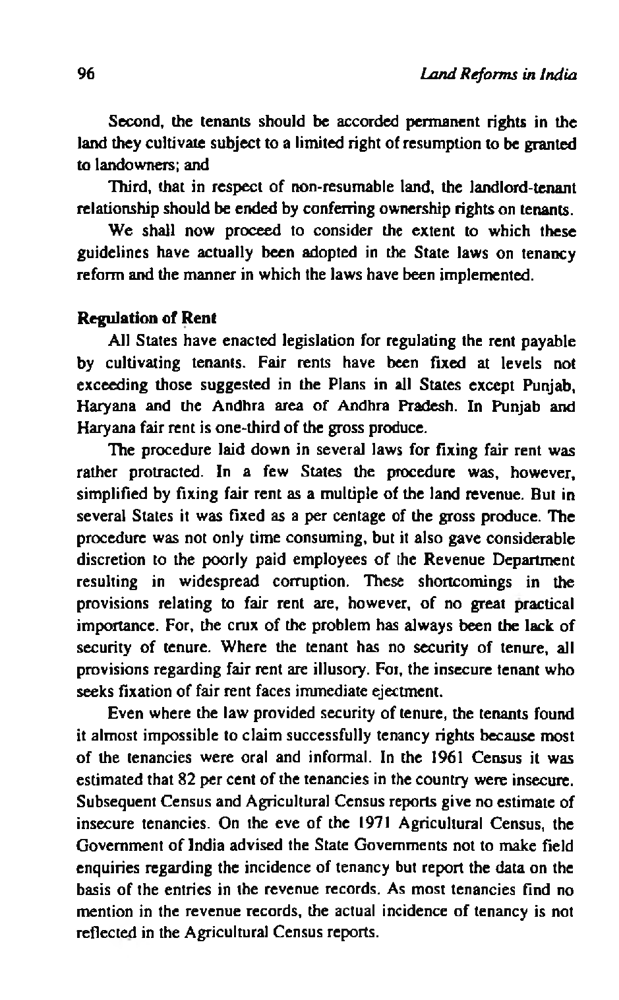

###### 96 Land Reforms in India

Second, the tenants should be accorded permanent rights in the land they cultivate subject to a limited right of resumption to be granted to landowners; and

Third, that in respect of non-resumable land, the landlord-tenant relationship should be ended by conferring ownership rights on tenants.

We shall now proceed to consider the extent to which these guidelines have actually been adopted in the State laws on tenancy reform and the manner in which the laws have been implemented.

###### Regulation of Rent

All States have enacted legislation for regulating the rent payable by cultivating tenants. Fair rents have been fixed at levels not exceeding those suggested in the Plans in all States except Punjab, Haryana and the Andhra area of Andhra Pradesh. In Punjab and Haryana fair rent is one-third of the gross produce.

The procedure laid down in several laws for fixing fair rent was rather protracted. In a few States the procedure was, however, simplified by fixing fair rent as a multiple of the land revenue. But in several States it was fixed as a per centage of the gross produce. The procedure was not only time consuming, but it also gave considerable discretion to the poorly paid employees of the Revenue Department resulting in widespread corruption. These shortcomings in the provisions relating to fair rent are, however, of no great practical importance. For, the crux of the problem has always been the lack of security of tenure. Where the tenant has no security of tenure, all provisions regarding fair rent are illusory. For, the insecure tenant who seeks fixation of fair rent faces immediate ejectment.

Even where the law provided security of tenure, the tenants found it almost impossible to claim successfully tenancy rights because most of the tenancies were oral and informal. In the 1961 Census it was estimated that 82 per cent of the tenancies in the country were insecure. Subsequent Census and Agricultural Census reports give no estimate of insecure tenancies. On the eve of the 1971 Agricultural Census, the Government of India advised the State Governments not to make field enquiries regarding the incidence of tenancy but report the data on the basis of the entries in the revenue records. As most tenancies find no mention in the revenue records, the actual incidence of tenancy is not reflected in the Agricultural Census reports.

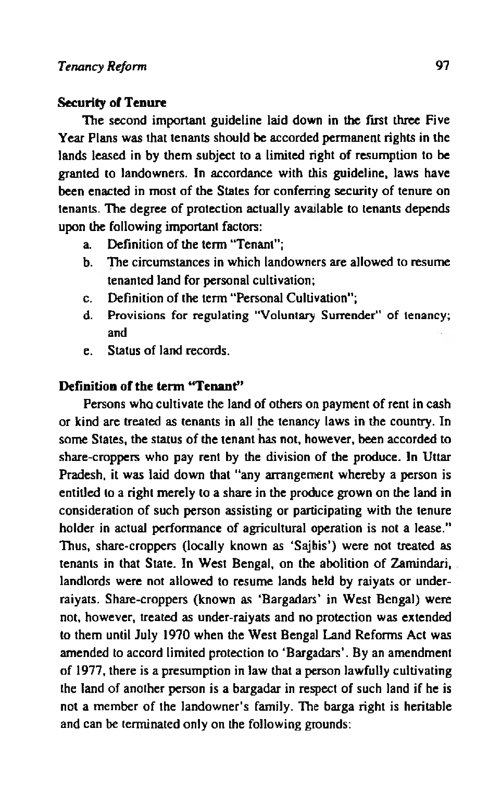

###### Tenancy Reform 97

###### Security of Tenure

The second important guideline laid down in the first three Five Year Plans was that tenants should be accorded permanent rights in the lands leased in by them subject to a limited right of resumption to be granted to landowners. In accordance with this guideline, laws have been enacted in most of the States for conferring security of tenure on tenants. The degree of protection actually available to tenants depends upon the following important factors:

- a. Definition of the term “Tenant”;
- b. The circumstances in which landowners are allowed to resume tenanted land for personal cultivation;
- c. Definition of the term “Personal Cultivation”;
- d. Provisions for regulating “Voluntary Surrender” of tenancy; and
- e. Status of land records.

###### Definition of the term “Tenant”

Persons who cultivate the land of others on payment of rent in cash or kind are treated as tenants in all the tenancy laws in the country. In some States, the status of the tenant has not, however, been accorded to share-croppers who pay rent by the division of the produce. In Uttar Pradesh, it was laid down that “any arrangement whereby a person is entitled to a right merely to a share in the produce grown on the land in consideration of such person assisting or participating with the tenure holder in actual performance of agricultural operation is not a lease.” Thus, share-croppers (locally known as ‘Sajhis’) were not treated as tenants in that State. In West Bengal, on the abolition of Zamindari, landlords were not allowed to resume lands held by raiyats or underraiyats. Share-croppers (known as ‘Bargadars’ in West Bengal) were not, however, treated as under-raiyats and no protection was extended to them until July 1970 when the West Bengal Land Reforms Act was amended to accord limited protection to ‘Bargadars’. By an amendment of 1977, there is a presumption in law that a person lawfully cultivating the land of another person is a bargadar in respect of such land if he is not a member of the landowner’s family. The barga right is heritable and can be terminated only on the following grounds:

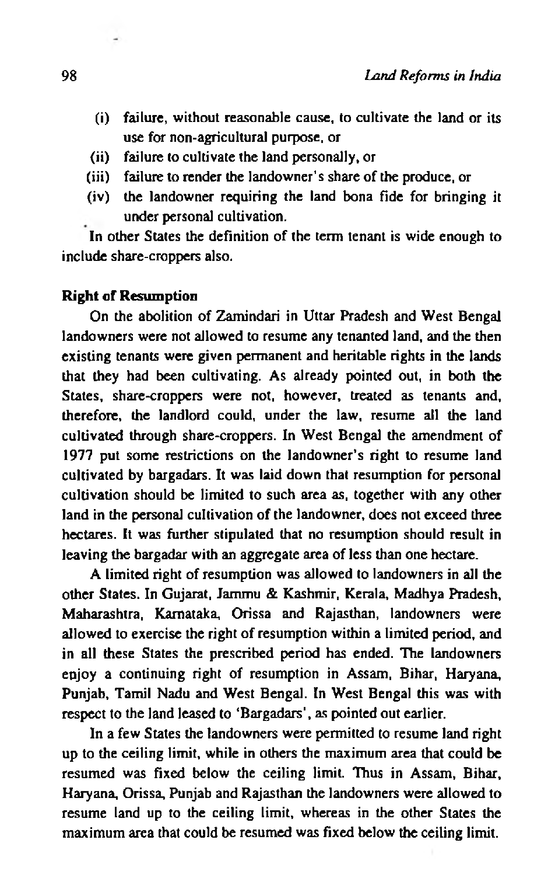

###### 98 Land Reforms in India

- (i) failure, without reasonable cause, to cultivate the land or its use for non-agricultural purpose, or
- (ii) failure to cultivate the land personally, or
- (iii) failure to render the landowner’s share of the produce, or
- (iv) the landowner requiring the land bona fide for bringing it under personal cultivation.

In other States the definition of the term tenant is wide enough to include share-croppers also.

###### Right of Resumption

On the abolition of Zamindari in Uttar Pradesh and West Bengal landowners were not allowed to resume any tenanted land, and the then existing tenants were given permanent and heritable rights in the lands that they had been cultivating. As already pointed out, in both the States, share-croppers were not, however, treated as tenants and, therefore, the landlord could, under the law, resume all the land cultivated through share-croppers. In West Bengal the amendment of 1977 put some restrictions on the landowner’s right to resume land cultivated by bargadars. It was laid down that resumption for personal cultivation should be limited to such area as, together with any other land in the personal cultivation of the landowner, does not exceed three hectares. It was further stipulated that no resumption should result in leaving the bargadar with an aggregate area of less than one hectare.

A limited right of resumption was allowed to landowners in all the other States. In Gujarat, Jammu & Kashmir, Kerala, Madhya Pradesh, Maharashtra, Karnataka, Orissa and Rajasthan, landowners were allowed to exercise the right of resumption within a limited period, and in all these States the prescribed period has ended. The landowners enjoy a continuing right of resumption in Assam, Bihar, Haryana, Punjab, Tamil Nadu and West Bengal. In West Bengal this was with respect to the land leased to ‘Bargadars’, as pointed out earlier.

In a few States the landowners were permitted to resume land right up to the ceiling limit, while in others the maximum area that could be resumed was fixed below the ceiling limit. Thus in Assam, Bihar, Haryana, Orissa, Punjab and Rajasthan the landowners were allowed to resume land up to the ceiling limit, whereas in the other States the maximum area that could be resumed was fixed below the ceiling limit.

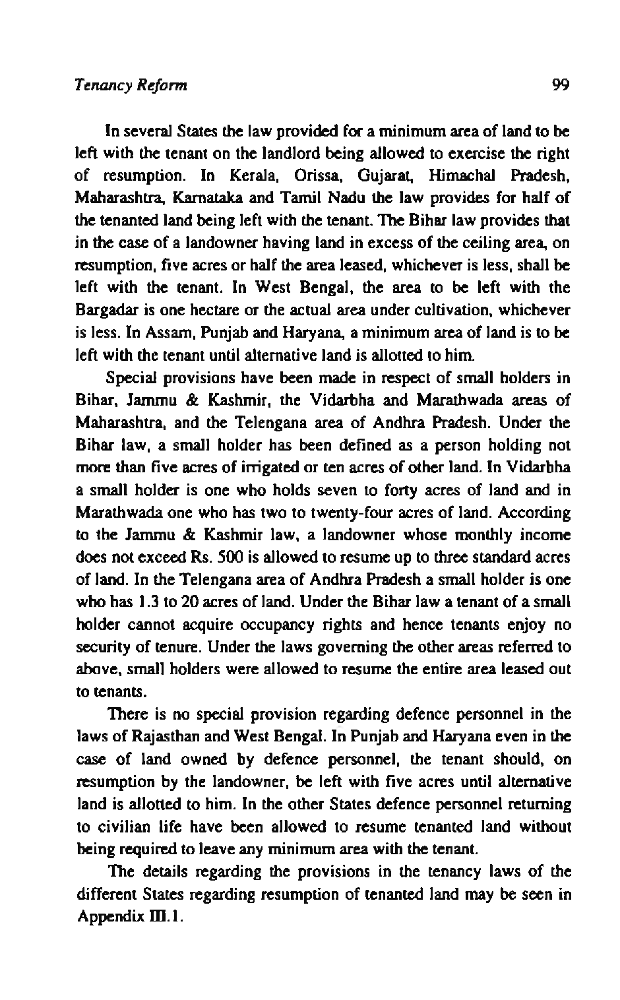

###### Tenancy Reform 99

In several States the law provided for a minimum area of land to be left with the tenant on the landlord being allowed to exercise the right of resumption. In Kerala, Orissa, Gujarat, Himachal Pradesh, Maharashtra, Karnataka and Tamil Nadu the law provides for half of the tenanted land being left with the tenant. The Bihar law provides that in the case of a landowner having land in excess of the ceiling area, on resumption, five acres or half the area leased, whichever is less, shall be left with the tenant. In West Bengal, the area to be left with the Bargadar is one hectare or the actual area under cultivation, whichever is less. In Assam, Punjab and Haryana, a minimum area of land is to be left with the tenant until alternative land is allotted to him.

Special provisions have been made in respect of small holders in Bihar, Jammu & Kashmir, the Vidarbha and Marathwada areas of Maharashtra, and the Telengana area of Andhra Pradesh. Under the Bihar law, a small holder has been defined as a person holding not more than five acres of irrigated or ten acres of other land. In Vidarbha a small holder is one who holds seven to forty acres of land and in Marathwada one who has two to twenty-four acres of land. According to the Jammu & Kashmir law, a landowner whose monthly income does not exceed Rs. 500 is allowed to resume up to three standard acres of land. In the Telengana area of Andhra Pradesh a small holder is one who has 1.3 to 20 acres of land. Under the Bihar law a tenant of a small holder cannot acquire occupancy rights and hence tenants enjoy no security of tenure. Under the laws governing the other areas referred to above, small holders were allowed to resume the entire area leased out to tenants.

There is no special provision regarding defence personnel in the laws of Rajasthan and West Bengal. In Punjab and Haryana even in the case of land owned by defence personnel, the tenant should, on resumption by the landowner, be left with five acres until alternative land is allotted to him. In the other States defence personnel returning to civilian life have been allowed to resume tenanted land without being required to leave any minimum area with the tenant.

The details regarding the provisions in the tenancy laws of the different States regarding resumption of tenanted land may be seen in Appendix HI. 1.

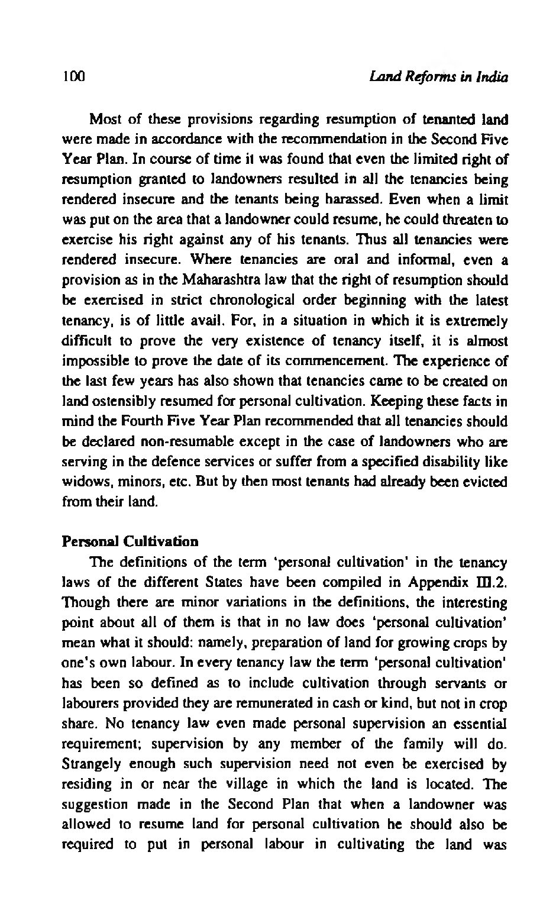

###### 100 Land Reforms in India

Most of these provisions regarding resumption of tenanted land were made in accordance with the recommendation in the Second Five Year Plan. In course of time it was found that even the limited right of resumption granted to landowners resulted in all the tenancies being rendered insecure and the tenants being harassed. Even when a limit was put on the area that a landowner could resume, he could threaten to exercise his right against any of his tenants. Thus all tenancies were rendered insecure. Where tenancies are oral and informal, even a provision as in the Maharashtra law that the right of resumption should be exercised in strict chronological order beginning with the latest tenancy, is of little avail. For, in a situation in which it is extremely difficult to prove the very existence of tenancy itself, it is almost impossible to prove the date of its commencement. The experience of the last few years has also shown that tenancies came to be created on land ostensibly resumed for personal cultivation. Keeping these facts in mind the Fourth Five Year Plan recommended that all tenancies should be declared non-resumable except in the case of landowners who are serving in the defence services or suffer from a specified disability like widows, minors, etc. But by then most tenants had already been evicted from their land.

###### Personal Cultivation

The definitions of the term ‘personal cultivation’ in the tenancy laws of the different States have been compiled in Appendix HI.2. Though there are minor variations in the definitions, the interesting point about all of them is that in no law does ‘personal cultivation’ mean what it should: namely, preparation of land for growing crops by one’s own labour. In every tenancy law the term ‘personal cultivation’ has been so defined as to include cultivation through servants or labourers provided they are remunerated in cash or kind, but not in crop share. No tenancy law even made personal supervision an essential requirement; supervision by any member of the family will do. Strangely enough such supervision need not even be exercised by residing in or near the village in which the land is located. The suggestion made in the Second Plan that when a landowner was allowed to resume land for personal cultivation he should also be required to put in personal labour in cultivating the land was

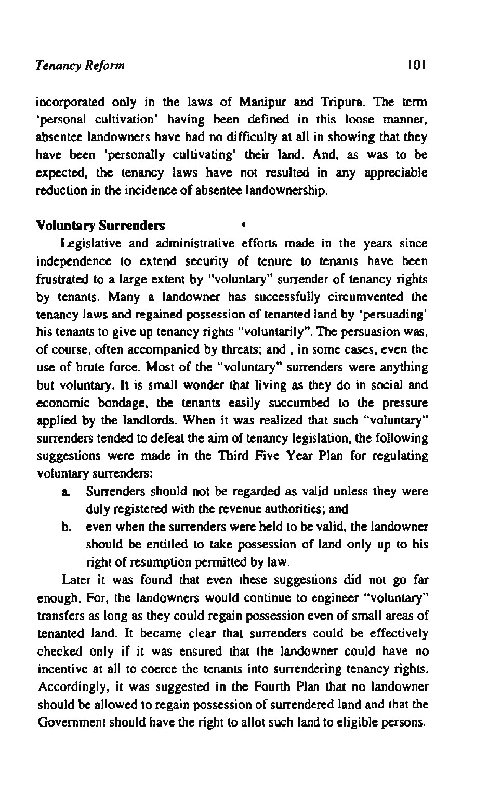

###### Tenancy Reform 101

incorporated only in the laws of Manipur and Tripura. The term ‘personal cultivation* having been defined in this loose manner, absentee landowners have had no difficulty at all in showing that they have been ‘personally cultivating’ their land. And, as was to be expected, the tenancy laws have not resulted in any appreciable reduction in the incidence of absentee landownership.

###### Voluntary Surrenders •

Legislative and administrative efforts made in the years since independence to extend security of tenure to tenants have been frustrated to a large extent by “voluntary” surrender of tenancy rights by tenants. Many a landowner has successfully circumvented the tenancy laws and regained possession of tenanted land by ‘persuading’ his tenants to give up tenancy rights “voluntarily”. The persuasion was, of course, often accompanied by threats; and , in some cases, even the use of brute force. Most of the “voluntary” surrenders were anything but voluntary. It is small wonder that living as they do in social and economic bondage, the tenants easily succumbed to the pressure applied by the landlords. When it was realized that such “voluntary” surrenders tended to defeat the aim of tenancy legislation, the following suggestions were made in the Third Five Year Plan for regulating voluntary surrenders:

- a. Surrenders should not be regarded as valid unless they were duly registered with the revenue authorities; and
- b. even when the surrenders were held to be valid, the landowner should be entitled to take possession of land only up to his right of resumption permitted by law.

Later it was found that even these suggestions did not go far enough. For, the landowners would continue to engineer “voluntary” transfers as long as they could regain possession even of small areas of tenanted land. It became clear that surrenders could be effectively checked only if it was ensured that the landowner could have no incentive at all to coerce the tenants into surrendering tenancy rights. Accordingly, it was suggested in the Fourth Plan that no landowner should be allowed to regain possession of surrendered land and that the Government should have the right to allot such land to eligible persons.

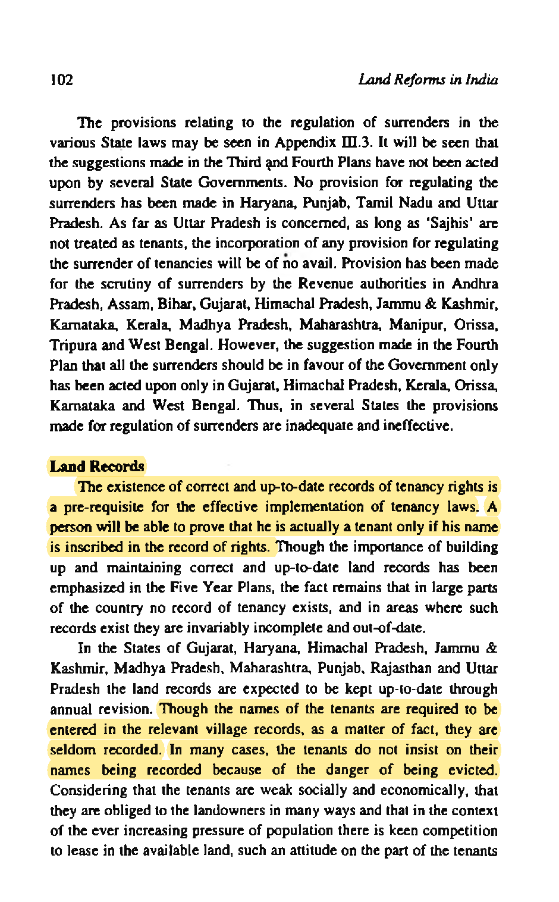

###### 102 Land Reforms in India

The provisions relating to the regulation of surrenders in the various State laws may be seen in Appendix m.3. It will be seen that the suggestions made in the Third $nd Fourth Plans have not been acted upon by several State Governments. No provision for regulating the surrenders has been made in Haryana, Punjab, Tamil Nadu and Uttar Pradesh. As far as Uttar Pradesh is concerned, as long as ‘Sajhis’ are not treated as tenants, the incorporation of any provision for regulating the surrender of tenancies will be of no avail. Provision has been made for the scrutiny of surrenders by the Revenue authorities in Andhra Pradesh, Assam, Bihar, Gujarat, Himachal Pradesh, Jammu & Kashmir, Karnataka, Kerala, Madhya Pradesh, Maharashtra, Manipur, Orissa, Tripura and West Bengal. However, the suggestion made in the Fourth Plan that all the surrenders should be in favour of the Government only has been acted upon only in Gujarat, Himachal Pradesh, Kerala, Orissa, Karnataka and West Bengal. Thus, in several States the provisions made for regulation of surrenders are inadequate and ineffective.

###### Land Records

The existence of correct and up-to-date records of tenancy rights is a pre-requisite for the effective implementation of tenancy laws. A person will be able to prove that he is actually a tenant only if his name is inscribed in the record of rights. Though the importance of building up and maintaining correct and up-to-date land records has been emphasized in the Five Year Plans, the fact remains that in large parts of the country no record of tenancy exists, and in areas where such records exist they are invariably incomplete and out-of-date.

In the States of Gujarat, Haryana, Himachal Pradesh, Jammu & Kashmir, Madhya Pradesh, Maharashtra, Punjab, Rajasthan and Uttar Pradesh the land records are expected to be kept up-to-date through annual revision. Though the names of the tenants are required to be entered in the relevant village records, as a matter of fact, they are seldom recorded. In many eases, the tenants do not insist on their names being recorded because of the danger of being evicted. Considering that the tenants are weak socially and economically, that they are obliged to the landowners in many ways and that in the context of the ever increasing pressure of population there is keen competition to lease in the available land, such an attitude on the part of the tenants

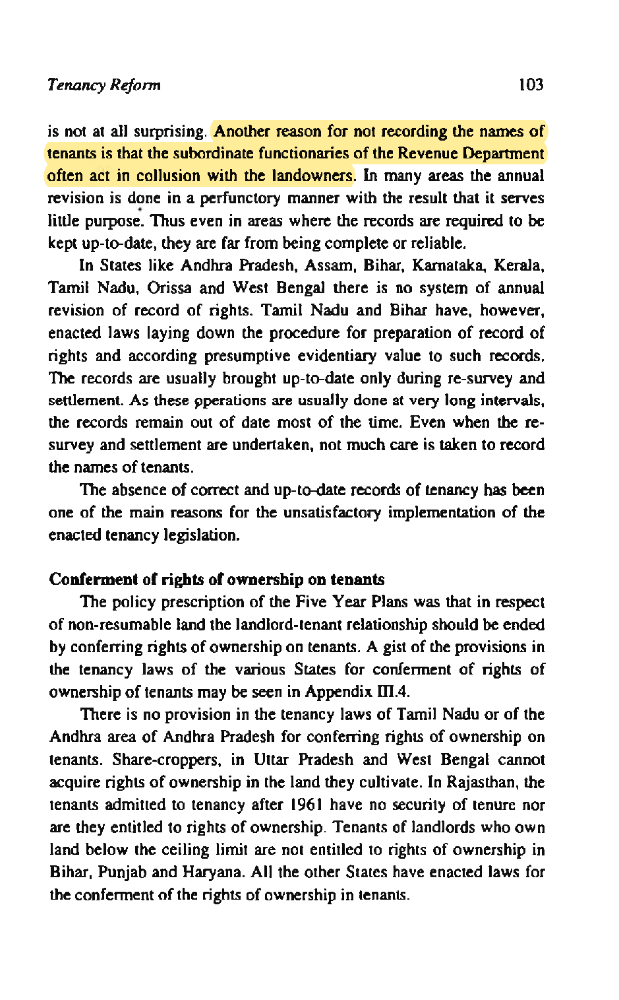

###### Tenancy Reform 103

is not at all surprising. Another reason for not recording the names of tenants is that the subordinate functionaries of the Revenue Department often act in collusion with the landowners. In many areas the annual revision is done in a perfunctory manner with the result that it serves little purpose. Thus even in areas where the records are required to be kept up-to-date, they are far from being complete or reliable.

In States like Andhra Pradesh, Assam, Bihar, Karnataka, Kerala, Tamil Nadu, Orissa and West Bengal there is no system of annual revision of record of rights. Tamil Nadu and Bihar have, however, enacted laws laying down the procedure for preparation of record of rights and according presumptive evidentiary value to such records. The records are usually brought up-to-date only during re-survey and settlement. As these operations are usually done at very long intervals, the records remain out of date most of the time. Even when the resurvey and settlement are undertaken, not much care is taken to record the names of tenants.

The absence of correct and up-to-date records of tenancy has been one of the main reasons for the unsatisfactory implementation of the enacted tenancy legislation.

###### Conferment of rights of ownership on tenants

The policy prescription of the Five Year Plans was that in respect of non-resumable land the landlord-tenant relationship should be ended by conferring rights of ownership on tenants. A gist of the provisions in the tenancy laws of the various States for conferment of rights of ownership of tenants may be seen in Appendix m.4.

There is no provision in the tenancy laws of Tamil Nadu or of the Andhra area of Andhra Pradesh for conferring rights of ownership on tenants. Share-croppers, in Uttar Pradesh and West Bengal cannot acquire rights of ownership in the land they cultivate. In Rajasthan, the tenants admitted to tenancy after 1961 have no security of tenure nor are they entitled to rights of ownership. Tenants of landlords who own land below the ceiling limit are not entitled to rights of ownership in Bihar, Punjab and Haryana. All the other States have enacted laws for the conferment of the rights of ownership in tenants.

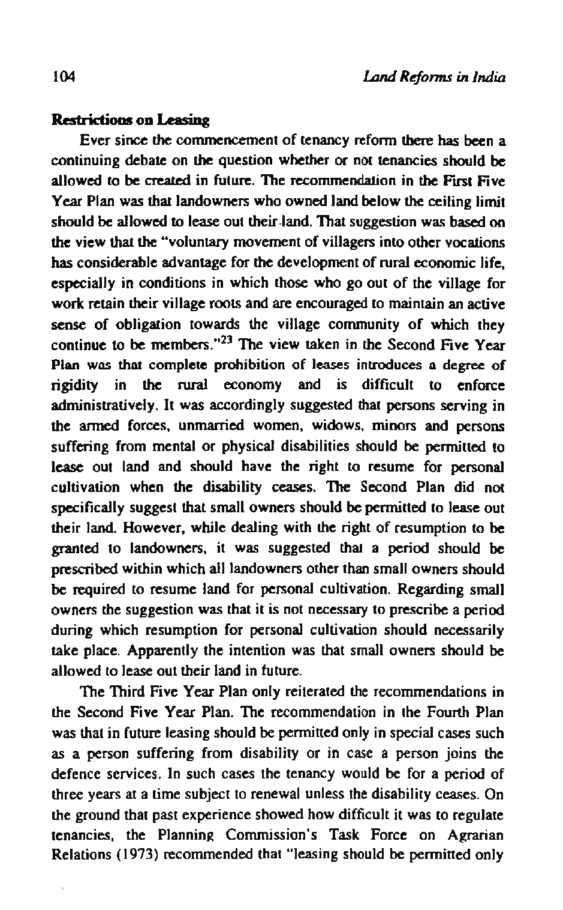

###### 104 Land Reforms in India

###### Restrictions on Leasing

Ever since the commencement of tenancy reform there has been a continuing debate on the question whether or not tenancies should be allowed to be created in future. The recommendation in the First Five Year Plan was that landowners who owned land below the ceiling limit should be allowed to lease out theirland. That suggestion was based on the view that the “voluntary movement of villagers into other vocations has considerable advantage for the development of rural economic life, especially in conditions in which those who go out of the village for work retain their village roots and are encouraged to maintain an active sense of obligation towards the village community of which they continue to be members.”23 The view taken in the Second Five Year Plan was that complete prohibition of leases introduces a degree of rigidity in the rural economy and is difficult to enforce administratively. It was accordingly suggested that persons serving in the armed forces, unmarried women, widows, minors and persons suffering from mental or physical disabilities should be permitted to lease out land and should have the right to resume for personal cultivation when the disability ceases. The Second Plan did not specifically suggest that small owners should be permitted to lease out their land. However, while dealing with the right of resumption to be granted to landowners, it was suggested that a period should be prescribed within which all landowners other than small owners should be required to resume land for personal cultivation. Regarding small owners the suggestion was that it is not necessary to prescribe a period during which resumption for personal cultivation should necessarily take place. Apparently the intention was that small owners should be allowed to lease out their land in future.

The Third Five Year Plan only reiterated the recommendations in the Second Five Year Plan. The recommendation in the Fourth Plan was that in future leasing should be permitted only in special cases such as a person suffering from disability or in case a person joins the defence services. In such cases the tenancy would be for a period of three years at a time subject to renewal unless the disability ceases. On the ground that past experience showed how difficult it was to regulate tenancies, the Planning Commission’s Task Force on Agrarian Relations (1973) recommended that “leasing should be permitted only

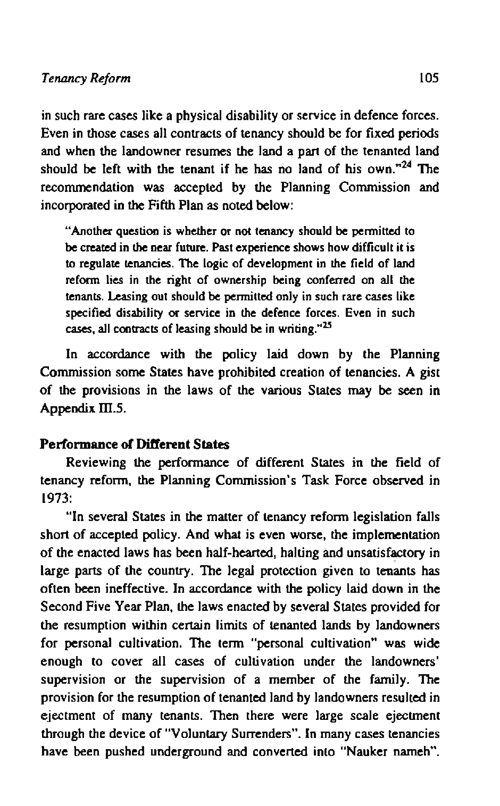

###### Tenancy Reform 105

in such rare cases like a physical disability or service in defence forces. Even in those cases all contracts of tenancy should be for fixed periods and when the landowner resumes the land a part of the tenanted land should be left with the tenant if he has no land of his own.”24 The recommendation was accepted by the Planning Commission and incorporated in the Fifth Plan as noted below:

“Another question is whether or not tenancy should be permitted to be created in the near future. Past experience shows how difficult it is to regulate tenancies. The logic of development in the field of land reform lies in the right of ownership being conferred on all the tenants. Leasing out should be permitted only in such rare cases like specified disability or service in the defence forces. Even in such cases, all contracts of leasing should be in writing.”25

In accordance with the policy laid down by the Planning Commission some States have prohibited creation of tenancies. A gist of the provisions in the laws of the various States may be seen in Appendix IQ.5.

###### Performance of Different States

Reviewing the performance of different States in the field of tenancy reform, the Planning Commission’s Task Force observed in 1973:

“In several States in the matter of tenancy reform legislation falls short of accepted policy. And what is even worse, the implementation of the enacted laws has been half-hearted, halting and unsatisfactory in large parts of the country. The legal protection given to tenants has often been ineffective. In accordance with the policy laid down in the Second Five Year Plan, the laws enacted by several States provided for the resumption within certain limits of tenanted lands by landowners for personal cultivation. The term “personal cultivation” was wide enough to cover all cases of cultivation under the landowners’ supervision or the supervision of a member of the family. The provision for the resumption of tenanted land by landowners resulted in ejectment of many tenants. Then there were large scale ejectment through the device of “Voluntary Surrenders”. In many cases tenancies have been pushed underground and converted into “Nauker nameh”.

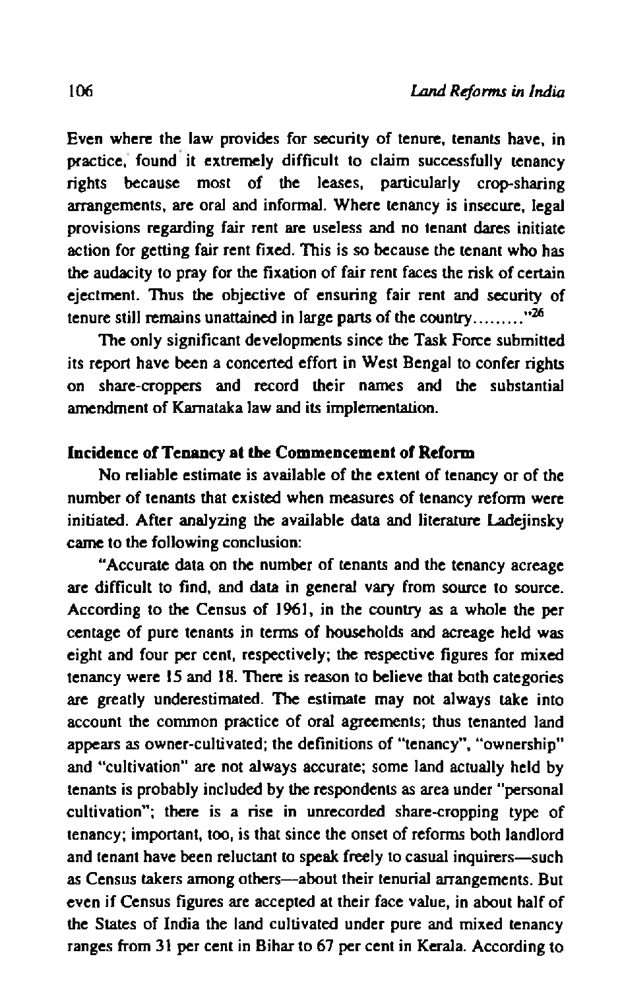

###### 106 Land Reforms in India

Even where the law provides for security of tenure, tenants have, in practice, found it extremely difficult to claim successfully tenancy rights because most of the leases, particularly crop-sharing arrangements, are oral and informal. Where tenancy is insecure, legal provisions regarding fair rent are useless and no tenant dares initiate action for getting fair rent fixed. This is so because the tenant who has the audacity to pray for the fixation of fair rent faces the risk of certain ejectment. Thus the objective of ensuring fair rent and security of tenure still remains unattained in large parts of the country........... m26

The only significant developments since the Task Force submitted its report have been a concerted effort in West Bengal to confer rights on share-croppers and record their names and the substantial amendment of Karnataka law and its implementation.

###### Incidence of Tenancy at the Commencement of Reform

No reliable estimate is available of the extent of tenancy or of the number of tenants that existed when measures of tenancy reform were initiated. After analyzing the available data and literature Ladejinsky came to the following conclusion:

“Accurate data on the number of tenants and the tenancy acreage are difficult to find, and data in general vary from source to source. According to the Census of 1961, in the country as a whole the per centage of pure tenants in terms of households and acreage held was eight and four per cent, respectively; the respective figures for mixed tenancy were 15 and 18. There is reason to believe that both categories are greatly underestimated. The estimate may not always take into account the common practice of oral agreements; thus tenanted land appears as owner-cultivated; the definitions of “tenancy”, “ownership” and “cultivation” are not always accurate; some land actually held by tenants is probably included by the respondents as area under “personal cultivation”; there is a rise in unrecorded share-cropping type of tenancy; important, too, is that since the onset of reforms both landlord and tenant have been reluctant to speak freely to casual inquirers—such as Census takers among others—about their tenurial arrangements. But even if Census figures are accepted at their face value, in about half of the States of India the land cultivated under pure and mixed tenancy ranges from 31 per cent in Bihar to 67 per cent in Kerala. According to

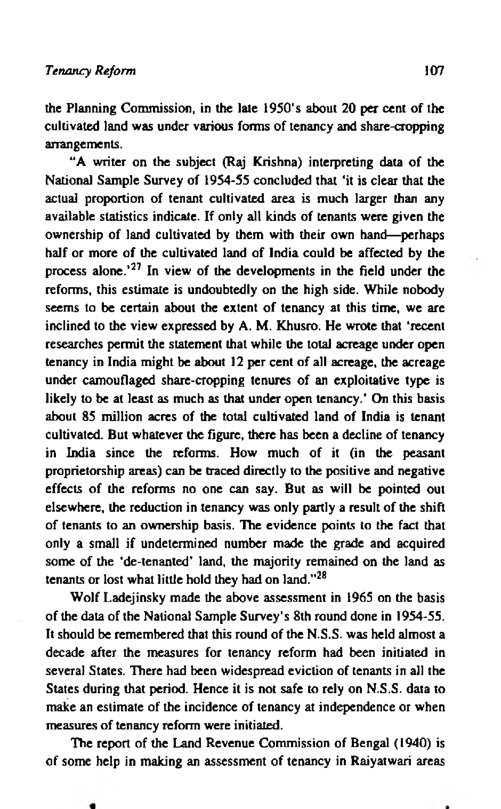

###### Tenancy Reform 107

the Planning Commission, in the late 1950’s about 20 per cent of the cultivated land was under various forms of tenancy and share-cropping arrangements.

“A writer on the subject (Raj Krishna) interpreting data of the National Sample Survey of 1954-55 concluded that 4it is clear that the actual proportion of tenant cultivated area is much larger than any available statistics indicate. If only all kinds of tenants were given the ownership of land cultivated by them with their own hand—perhaps half or more of the cultivated land of India could be affected by the process alone.’27 In view of the developments in the field under the reforms, this estimate is undoubtedly on the high side. While nobody seems to be certain about the extent of tenancy at this time, we are inclined to the view expressed by A. M. Khusro. He wrote that ‘recent researches permit the statement that while the total acreage under open tenancy in India might be about 12 per cent of all acreage, the acreage under camouflaged share-cropping tenures of an exploitative type is likely to be at least as much as that under open tenancy.’ On this basis about 85 million acres of the total cultivated land of India is tenant cultivated. But whatever the figure, there has been a decline of tenancy in India since the reforms. How much of it (in the peasant proprietorship areas) can be traced directly to the positive and negative effects of the reforms no one can say. But as will be pointed out elsewhere, the reduction in tenancy was only partly a result of the shift of tenants to an ownership basis. The evidence points to the fact that only a small if undetermined number made the grade and acquired some of the ‘de-tenanted’ land, the majority remained on the land as tenants or lost what little hold they had on land.”28

Wolf Ladejinsky made the above assessment in 1965 on the basis of the data of the National Sample Survey’s 8th round done in 1954-55. It should be remembered that this round of the N.S.S. was held almost a decade after the measures for tenancy reform had been initiated in several States. There had been widespread eviction of tenants in all the States during that period. Hence it is not safe to rely on N.S.S. data to make an estimate of the incidence of tenancy at independence or when measures of tenancy reform were initiated.

The report of the Land Revenue Commission of Bengal (1940) is of some help in making an assessment of tenancy in Raiyatwari areas

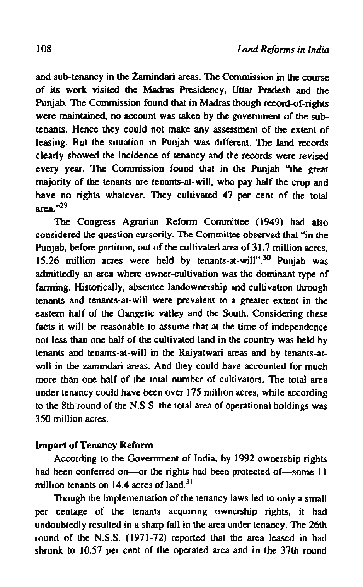

108 Land Reforms in India

and sub-tenancy in the Zamindari areas. The Commission in the course of its work visited the Madras Presidency, Uttar Pradesh and the Punjab. The Commission found that in Madras though record-of-rights were maintained, no account was taken by the government of the subtenants. Hence they could not make any assessment of the extent of leasing. But the situation in Punjab was different. The land records clearly showed the incidence of tenancy and the records were revised every year. The Commission found that in the Punjab “the great majority of the tenants are tenants-at-will, who pay half the crop and have no rights whatever. They cultivated 47 per cent of the total area.”29

The Congress Agrarian Reform Committee (1949) had also considered the question cursorily. The Committee observed that “in the Punjab, before partition, out of the cultivated area of 31.7 million acres, 15.26 million acres were held by tenants-at-will”.30 Punjab was admittedly an area where owner-cultivation was the dominant type of farming. Historically, absentee landownership and cultivation through tenants and tenants-at-will were prevalent to a greater extent in the eastern half of the Gangetic valley and the South. Considering these facts it will be reasonable to assume that at the time of independence not less than one half of the cultivated land in the country was held by tenants and tenants-at-will in the Raiyatwari areas and by tenants-atwill in the zamindari areas. And they could have accounted for much more than one half of the total number of cultivators. The total area under tenancy could have been over 175 million acres, while according to the 8th round of the N.S.S. the total area of operational holdings was 350 million acres.

###### Impact of Tenancy Reform

According to the Government of India, by 1992 ownership rights had been conferred on—or the rights had been protected of—some 11 million tenants on 14.4 acres of land.31

Though the implementation of the tenancy laws led to only a small per centage of the tenants acquiring ownership rights, it had undoubtedly resulted in a sharp fall in the area under tenancy. The 26th round of the N.S.S. (1971-72) reported that the area leased in had shrunk to 10.57 per cent of the operated area and in the 37th round

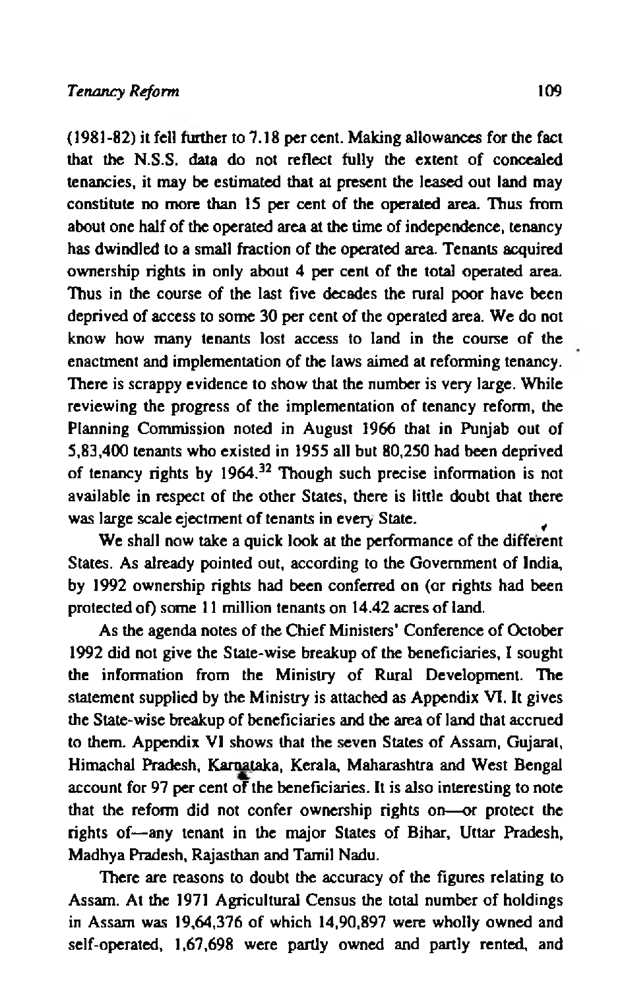

###### Tenancy Reform 109

(1981-82) it fell further to 7.18 per cent. Making allowances for the fact that the N.S.S. data do not reflect fully the extent of concealed tenancies, it may be estimated that at present the leased out land may constitute no more than 15 per cent of the operated area. Thus from about one half of the operated area at the time of independence, tenancy has dwindled to a small fraction of the operated area. Tenants acquired ownership rights in only about 4 per cent of the total operated area. Thus in the course of the last five decades the rural poor have been deprived of access to some 30 per cent of the operated area. We do not know how many tenants lost access to land in the course of the enactment and implementation of the laws aimed at reforming tenancy. There is scrappy evidence to show that the number is very large. While reviewing the progress of the implementation of tenancy reform, the Planning Commission noted in August 1966 that in Punjab out of 5,83,400 tenants who existed in 1955 all but 80,250 had been deprived of tenancy rights by 1964.32 Though such precise information is not available in respect of the other States, there is little doubt that there was large scale ejectment of tenants in every State. 4

We shall now take a quick look at the performance of the different States. As already pointed out, according to the Government of India, by 1992 ownership rights had been conferred on (or rights had been protected of) some 11 million tenants on 14.42 acres of land.

As the agenda notes of the Chief Ministers’ Conference of October 1992 did not give the State-wise breakup of the beneficiaries, I sought the information from the Ministry of Rural Development. The statement supplied by the Ministry is attached as Appendix VI. It gives the State-wise breakup of beneficiaries and the area of land that accrued to them. Appendix VI shows that the seven States of Assam, Gujarat, Himachal Pradesh, Karrataka, Kerala, Maharashtra and West Bengal account for 97 per cent of the beneficiaries. It is also interesting to note that the reform did not confer ownership rights on—or protect the rights of—any tenant in the major States of Bihar, Uttar Pradesh, Madhya Pradesh, Rajasthan and Tamil Nadu.

There are reasons to doubt the accuracy of the figures relating to Assam. At the 1971 Agricultural Census the total number of holdings in Assam was 19,64,376 of which 14,90,897 were wholly owned and self-operated, 1,67,698 were partly owned and partly rented, and

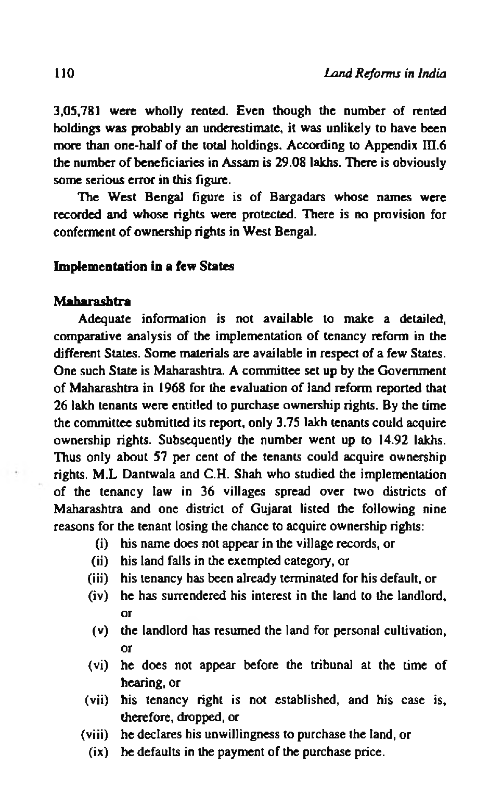

n o Land Reforms in India

3,05,781 were wholly rented. Even though the number of rented holdings was probably an underestimate, it was unlikely to have been more than one-half of the total holdings. According to Appendix III.6 the number of beneficiaries in Assam is 29.08 lakhs. There is obviously some serious error in this figure.

The West Bengal figure is of Bargadars whose names were recorded and whose rights were protected. There is no provision for conferment of ownership rights in West Bengal.

Implementation in a few States

Maharashtra

Adequate information is not available to make a detailed, comparative analysis of the implementation of tenancy reform in the different States. Some materials are available in respect of a few States. One such State is Maharashtra. A committee set up by the Government of Maharashtra in 1968 for the evaluation of land reform reported that 26 lakh tenants were entitled to purchase ownership rights. By the time the committee submitted its report, only 3.75 lakh tenants could acquire ownership rights. Subsequently the number went up to 14.92 lakhs. Thus only about 57 per cent of the tenants could acquire ownership rights. M.L Dantwala and C.H. Shah who studied the implementation of the tenancy law in 36 villages spread over two districts of Maharashtra and one district of Gujarat listed the following nine reasons for the tenant losing the chance to acquire ownership rights:

- (i) his name does not appear in the village records, or
- (ii) his land falls in the exempted category, or
- (iii) his tenancy has been already terminated for his default, or
- (iv) he has surrendered his interest in the land to the landlord, or
- (v) the landlord has resumed the land for personal cultivation, or
- (vi) he does not appear before the tribunal at the time of hearing, or
- (vii) his tenancy right is not established, and his case is, therefore, dropped, or
- (viii) he declares his unwillingness to purchase the land, or
- (ix) he defaults in the payment of the purchase price.

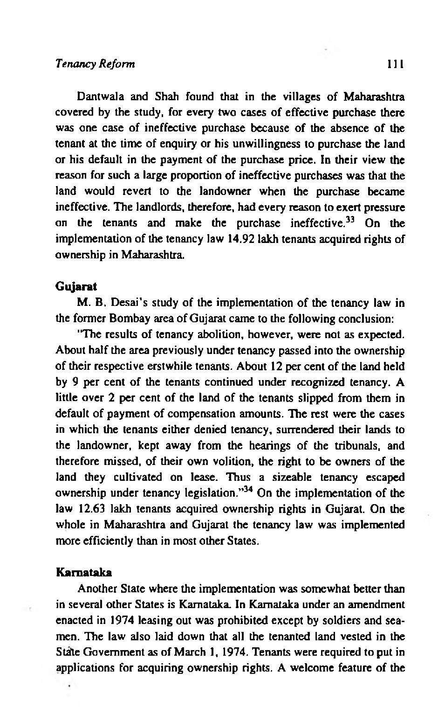

###### Tenancy Reform 111

Dantwala and Shah found that in the villages of Maharashtra covered by the study, for every two cases of effective purchase there was one case of ineffective purchase because of the absence of the tenant at the time of enquiry or his unwillingness to purchase the land or his default in the payment of the purchase price. In their view the reason for such a large proportion of ineffective purchases was that the land would revert to the landowner when the purchase became ineffective. The landlords, therefore, had every reason to exert pressure on the tenants and make the purchase ineffective.33 On the implementation of the tenancy law 14.92 lakh tenants acquired rights of ownership in Maharashtra.

###### Gujarat

M. B. Desai’s study of the implementation of the tenancy law in the former Bombay area of Gujarat came to the following conclusion:

“The results of tenancy abolition, however, were not as expected. About half the area previously under tenancy passed into the ownership of their respective erstwhile tenants. About 12 per cent of the land held by 9 per cent of the tenants continued under recognized tenancy. A little over 2 per cent of the land of the tenants slipped from them in default of payment of compensation amounts. The rest were the cases in which the tenants either denied tenancy, surrendered their lands to the landowner, kept away from the hearings of the tribunals, and therefore missed, of their own volition, the right to be owners of the land they cultivated on lease. Thus a sizeable tenancy escaped ownership under tenancy legislation.”34 On the implementation of the law 12.63 lakh tenants acquired ownership rights in Gujarat. On the whole in Maharashtra and Gujarat the tenancy law was implemented more efficiently than in most other States.

###### Karnataka

Another State where the implementation was somewhat better than in several other States is Karnataka. In Karnataka under an amendment enacted in 1974 leasing out was prohibited except by soldiers and seamen. The law also laid down that all the tenanted land vested in the Staite Government as of March 1,1974. Tenants were required to put in applications for acquiring ownership rights. A welcome feature of the

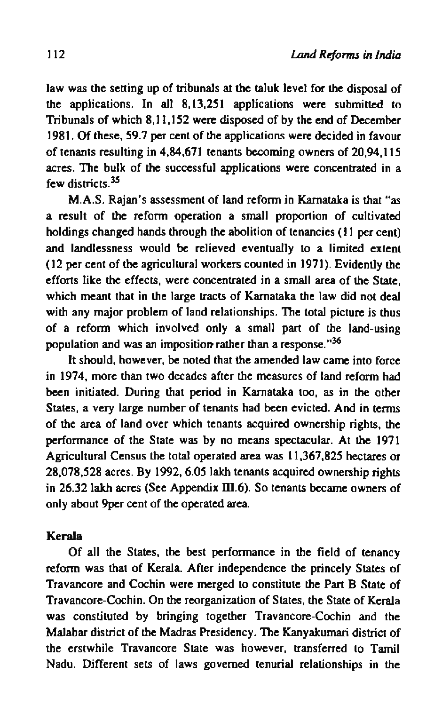

###### 112 Land Reforms in India

law was the setting up of tribunals at the taluk level for the disposal of the applications. In all 8,13,251 applications were submitted to Tribunals of which 8,11,152 were disposed of by the end of December 1981. Of these, 59.7 per cent of the applications were decided in favour of tenants resulting in 4,84,671 tenants becoming owners of 20,94,115 acres. The bulk of the successful applications were concentrated in a few districts.35

M.A.S. Rajan’s assessment of land reform in Karnataka is that “as a result of the reform operation a small proportion of cultivated holdings changed hands through the abolition of tenancies (11 per cent) and landlessness would be relieved eventually to a limited extent (12 per cent of the agricultural workers counted in 1971). Evidently the efforts like the effects, were concentrated in a small area of the State, which meant that in the large tracts of Karnataka the law did not deal with any major problem of land relationships. The total picture is thus of a reform which involved only a small part of the land-using population and was an imposition rather than a response.”36

It should, however, be noted that the amended law came into force in 1974, more than two decades after the measures of land reform had been initiated. During that period in Karnataka too, as in the other States, a very large number of tenants had been evicted. And in terms of the area of land over which tenants acquired ownership rights, the performance of the State was by no means spectacular. At the 1971 Agricultural Census the total operated area was 11,367,825 hectares or 28,078,528 acres. By 1992, 6.05 lakh tenants acquired ownership rights in 26.32 lakh acres (See Appendix III.6). So tenants became owners of only about 9per cent of the operated area.

###### Kerala

Of all the States, the best performance in the field of tenancy reform was that of Kerala. After independence the princely States of Travancore and Cochin were merged to constitute the Part B State of Travancore-Cochin. On the reorganization of States, the State of Kerala was constituted by bringing together Travancore-Cochin and the Malabar district of the Madras Presidency. The Kanyakumari district of the erstwhile Travancore State was however, transferred to Tamil Nadu. Different sets of laws governed tenurial relationships in the

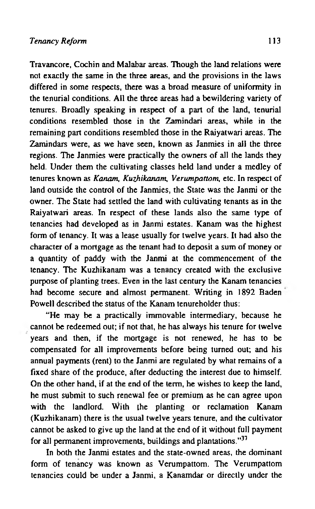

###### Tenancy Reform 113

Travancore, Cochin and Malabar areas. Though the land relations were not exactly the same in the three areas, and the provisions in the laws differed in some respects, there was a broad measure of uniformity in the tenurial conditions. All the three areas had a bewildering variety of tenures. Broadly speaking in respect of a part of the land, tenurial conditions resembled those in the Zamindari areas, while in the remaining part conditions resembled those in the Raiyatwari areas. The Zamindars were, as we have seen, known as Janmies in all the three regions. The Janmies were practically the owners of all the lands they held. Under them the cultivating classes held land under a medley of tenures known as Kanam, Kuzhikanam, Verumpattom, etc. In respect of land outside the control of the Janmies, the State was the Janmi or the owner. The State had settled the land with cultivating tenants as in the Raiyatwari areas. In respect of these lands also the same type of tenancies had developed as in Janmi estates. Kanam was the highest form of tenancy. It was a lease usually for twelve years. It had also the character of a mortgage as the tenant had to deposit a sum of money or a quantity of paddy with the Janmi at the commencement of the tenancy. The Kuzhikanam was a tenancy created with the exclusive purpose of planting trees. Even in the last century the Kanam tenancies had become secure and almost permanent. Writing in 1892 Baden Powell described the status of the Kanam tenureholder thus:

“He may be a practically immovable intermediary, because he cannot be redeemed out; if not that, he has always his tenure for twelve years and then, if the mortgage is not renewed, he has to be compensated for all improvements before being turned out; and his annual payments (rent) to the Janmi are regulated by what remains of a fixed share of the produce, after deducting the interest due to himself. On the other hand, if at the end of the term, he wishes to keep the land, he must submit to such renewal fee or premium as he can agree upon with the landlord. With the planting or reclamation Kanam (Kuzhikanam) there is the usual twelve years tenure, and the cultivator cannot be asked to give up the land at the end of it without full payment for all permanent improvements, buildings and plantations.”37

In both the Janmi estates and the state-owned areas, the dominant form of tenancy was known as Verumpattom. The Verumpattom tenancies could be under a Janmi, a Kanamdar or directly under the

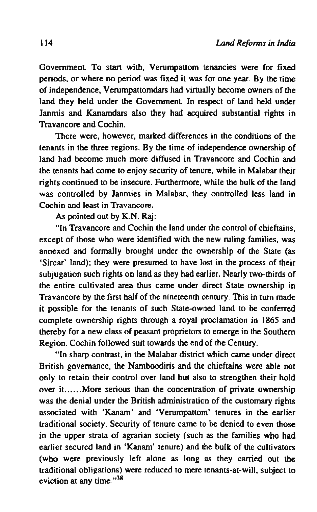

###### 114 Land Reforms in India

Government. To start with, Verumpattom tenancies were for fixed periods, or where no period was fixed it was for one year. By the time of independence, Vemmpattomdars had virtually become owners of the land they held under the Government. In respect of land held under Janmis and Kanamdars also they had acquired substantial rights in Travancore and Cochin.

There were, however, marked differences in the conditions of the tenants in the three regions. By the time of independence ownership of land had become much more diffused in Travancore and Cochin and the tenants had come to enjoy security of tenure, while in Malabar their rights continued to be insecure. Furthermore, while the bulk of the land was controlled by Janmies in Malabar, they controlled less land in Cochin and least in Travancore.

As pointed out by K.N. Raj: “In Travancore and Cochin the land under the control of chieftains, except of those who were identified with the new ruling families, was annexed and formally brought under the ownership of the State (as ‘Sircar’ land); they were presumed to have lost in the process of their subjugation such rights on land as they had earlier. Nearly two-thirds of the entire cultivated area thus came under direct State ownership in Travancore by the first half of the nineteenth century. This in turn made it possible for the tenants of such State-owned land to be conferred complete ownership rights through a royal proclamation in 1865 and thereby for a new class of peasant proprietors to emerge in the Southern Region. Cochin followed suit towards the end of the Century.

“In sharp contrast, in the Malabar district which came under direct British governance, the Namboodiris and the chieftains were able not only to retain their control over land but also to strengthen their hold over it....... More serious than the concentration of private ownership was the denial under the British administration of the customary rights associated with ‘Kanam’ and ‘Verumpattom’ tenures in the earlier traditional society. Security of tenure came to be denied to even those in the upper strata of agrarian society (such as the families who had earlier secured land in ‘Kanam’ tenure) and the bulk of the cultivators (who were previously left alone as long as they carried out the traditional obligations) were reduced to mere tenants-at-will, subject to eviction at any time.”38

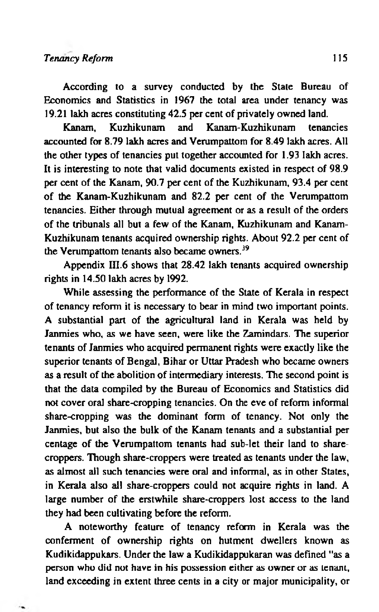

###### Tenancy Reform 115

According to a survey conducted by the State Bureau of Economics and Statistics in 1967 the total area under tenancy was 19.21 lakh acres constituting 42.5 per cent of privately owned land.

Kanam, Kuzhikunam and Kanam-Kuzhikunam tenancies accounted for 8.79 lakh acres and Verumpattom for 8.49 lakh acres. All the other types of tenancies put together accounted for 1.93 lakh acres. It is interesting to note that valid documents existed in respect of 98.9 per cent of the Kanam, 90.7 per cent of the Kuzhikunam, 93.4 per cent of the Kanam-Kuzhikunam and 82.2 per cent of the Verumpattom tenancies. Either through mutual agreement or as a result of the orders of the tribunals all but a few of the Kanam, Kuzhikunam and KanamKuzhikunam tenants acquired ownership rights. About 92.2 per cent of the Verumpattom tenants also became owners.39

Appendix m .6 shows that 28.42 lakh tenants acquired ownership rights in 14.50 lakh acres by 1992.

While assessing the performance of the State of Kerala in respect of tenancy reform it is necessary to bear in mind two important points. A substantial part of the agricultural land in Kerala was held by Janmies who, as we have seen, were like the Zamindars. The superior tenants of Janmies who acquired permanent rights were exactly like the superior tenants of Bengal, Bihar or Uttar Pradesh who became owners as a result of the abolition of intermediary interests. The second point is that the data compiled by the Bureau of Economics and Statistics did not cover oral share-cropping tenancies. On the eve of reform informal share-cropping was the dominant form of tenancy. Not only the Janmies, but also the bulk of the Kanam tenants and a substantial per centage of the Verumpattom tenants had sub-let their land to sharecroppers. Though share-croppers were treated as tenants under the law, as almost all such tenancies were oral and informal, as in other States, in Kerala also all share-croppers could not acquire rights in land. A large number of the erstwhile share-croppers lost access to the land they had been cultivating before the reform.

A noteworthy feature of tenancy reform in Kerala was the conferment of ownership rights on hutment dwellers known as Kudikidappukars. Under the law a Kudikidappukaran was defined “as a person who did not have in his possession either as owner or as tenant, land exceeding in extent three cents in a city or major municipality, or

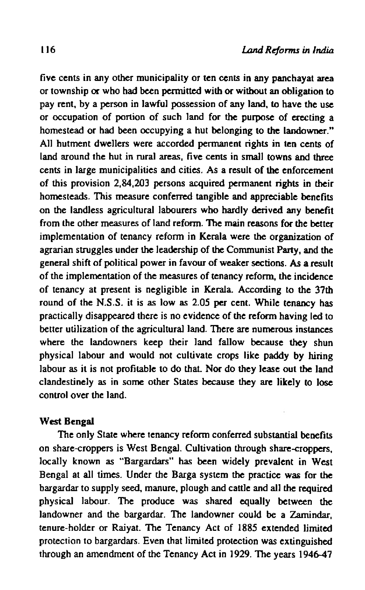

###### 116 Land Reforms in India

five cents in any other municipality or ten cents in any panchayat area or township or who had been permitted with or without an obligation to pay rent, by a person in lawful possession of any land, to have the use or occupation of portion of such land for the purpose of erecting a homestead or had been occupying a hut belonging to the landowner.” All hutment dwellers were accorded permanent rights in ten cents of land around the hut in rural areas, five cents in small towns and three cents in large municipalities and cities. As a result of the enforcement of this provision 2,84,203 persons acquired permanent rights in their homesteads. This measure conferred tangible and appreciable benefits on the landless agricultural labourers who hardly derived any benefit from the other measures of land reform. The main reasons for the better implementation of tenancy reform in Kerala were the organization of agrarian struggles under the leadership of the Communist Party, and the general shift of political power in favour of weaker sections. As a result of the implementation of the measures of tenancy reform, the incidence of tenancy at present is negligible in Kerala. According to the 37th round of the N.S.S. it is as low as 2.05 per cent. While tenancy has practically disappeared there is no evidence of the reform having led to better utilization of the agricultural land. There are numerous instances where the landowners keep their land fallow because they shun physical labour and would not cultivate crops like paddy by hiring labour as it is not profitable to do that. Nor do they lease out the land clandestinely as in some other States because they are likely to lose control over the land.

###### West Bengal

The only State where tenancy reform conferred substantial benefits on share-croppers is West Bengal. Cultivation through share-croppers, locally known as “Bargardars” has been widely prevalent in West Bengal at all times. Under the Barga system the practice was for the bargardar to supply seed, manure, plough and cattle and all the required physical labour. The produce was shared equally between the landowner and the bargardar. The landowner could be a Zamindar, tenure-holder or Raiyat. The Tenancy Act of 1885 extended limited protection to bargardars. Even that limited protection was extinguished through an amendment of the Tenancy Act in 1929. The years 1946-47

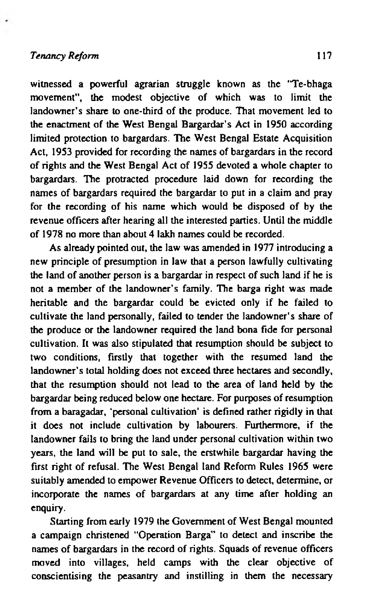

###### Tenancy Reform 117

witnessed a powerful agrarian struggle known as the “Te-bhaga movement”, the modest objective of which was to limit the landowner's share to one-third of the produce. That movement led to the enactment of the West Bengal Bargardar’s Act in 1950 according limited protection to bargardars. The West Bengal Estate Acquisition Act, 1953 provided for recording the names of bargardars in the record of rights and the West Bengal Act of 1955 devoted a whole chapter to bargardars. The protracted procedure laid down for recording the names of bargardars required the bargardar to put in a claim and pray for the recording of his name which would be disposed of by the revenue officers after hearing all the interested parties. Until the middle of 1978 no more than about 4 lakh names could be recorded.

As already pointed out, the law was amended in 1977 introducing a new principle of presumption in law that a person lawfully cultivating the land of another person is a bargardar in respect of such land if he is not a member of the landowner’s family. The barga right was made heritable and the bargardar could be evicted only if he failed to cultivate the land personally, failed to tender the landowner’s share of the produce or the landowner required the land bona fide for personal cultivation. It was also stipulated that resumption should be subject to two conditions, firstly that together with the resumed land the landowner’s total holding does not exceed three hectares and secondly, that the resumption should not lead to the area of land held by the bargardar being reduced below one hectare. For purposes of resumption from a baragadar, ‘personal cultivation’ is defined rather rigidly in that it does not include cultivation by labourers. Furthermore, if the landowner fails to bring the land under personal cultivation within two years, the land will be put to sale, the erstwhile bargardar having the first right of refusal. The West Bengal land Reform Rules 1965 were suitably amended to empower Revenue Officers to detect, determine, or incorporate the names of bargardars at any time after holding an enquiry.

Starting from early 1979 the Government of West Bengal mounted a campaign christened “Operation Barga” to detect and inscribe the names of bargardars in the record of rights. Squads of revenue officers moved into villages, held camps with the clear objective of conscientising the peasantry and instilling in them the necessary

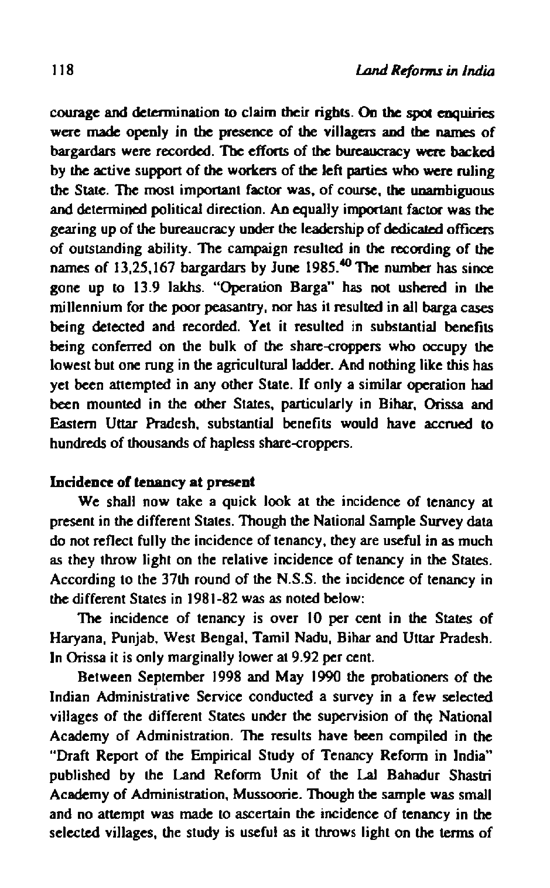

###### 118 Land Reforms in India

courage and determination to claim their rights. On the spot enquiries were made openly in the presence of the villagers and the names of bargardars were recorded. The efforts of the bureaucracy were backed by the active support of the workers of the left parties who were ruling the State. The most important factor was, of course, the unambiguous and determined political direction. An equally important factor was the gearing up of the bureaucracy under the leadership of dedicated officers of outstanding ability. The campaign resulted in the recording of the names of 13,25,167 bargardars by June 1985.40 The number has since gone up to 13.9 lakhs. “Operation Barga” has not ushered in the millennium for the poor peasantry, nor has it resulted in all barga cases being detected and recorded. Yet it resulted in substantia] benefits being conferred on the bulk of the share-croppers who occupy the lowest but one rung in the agricultural ladder. And nothing like this has yet been attempted in any other State. If only a similar operation had been mounted in the other States, particularly in Bihar, Orissa and Eastern Uttar Pradesh, substantial benefits would have accrued to hundreds of thousands of hapless share-croppers.

###### Incidence of tenancy at present

We shall now take a quick look at the incidence of tenancy at present in the different States. Though the National Sample Survey data do not reflect fully the incidence of tenancy, they are useful in as much

- as they throw light on the relative incidence of tenancy in the States. According to the 37th round of the N.S.S. the incidence of tenancy in the different States in 1981-82 was as noted below:

The incidence of tenancy is over 10 per cent in the States of Haryana, Punjab, West Bengal, Tamil Nadu, Bihar and Uttar Pradesh. In Orissa it is only marginally lower at 9.92 per cent.

Between September 1998 and May 1990 the probationers of the Indian Administrative Service conducted a survey in a few selected villages of the different States under the supervision of the National Academy of Administration. The results have been compiled in the “Draft Report of the Empirical Study of Tenancy Reform in India” published by the Land Reform Unit of the Lai Bahadur Shastri Academy of Administration, Mussoorie. Though the sample was small and no attempt was made to ascertain the incidence of tenancy in the selected villages, the study is useful as it throws light on the terms of

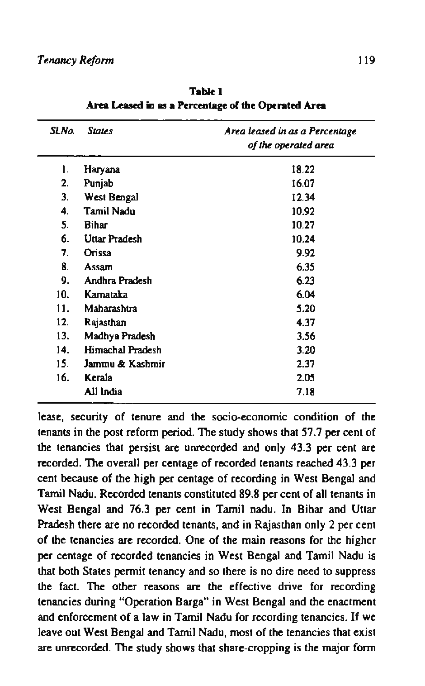

###### Tenancy Reform 119

Table 1 Area Leased in as a Percentage of the Operated Area

Si No. States Area leased in as a Percentage of the operated area

- 1. Haryana 18.22
- 2. Punjab 16.07
- 3. West Bengal 12.34
- 4. Tamil Nadu 10.92
- 5. Bihar 10.27
- 6. Uttar Pradesh 10.24
- 7. Orissa 9.92
- 8. Assam 6.35
- 9. Andhra Pradesh 6.23
- 10. Karnataka 6.04
- 11. Maharashtra 5.20
- 12. Rajasthan 4.37
- 13. Madhya Pradesh 3.56
- 14. Himachal Pradesh 3.20
- 15. Jammu & Kashmir 2.37
- 16. Kerala 2.05 All India 7.18

lease, security of tenure and the socio-economic condition of the tenants in the post reform period. The study shows that 57.7 per cent of the tenancies that persist are unrecorded and only 43.3 per cent are recorded. The overall per centage of recorded tenants reached 43.3 per cent because of the high per centage of recording in West Bengal and Tamil Nadu. Recorded tenants constituted 89.8 per cent of all tenants in West Bengal and 76.3 per cent in Tamil nadu. In Bihar and Uttar Pradesh there are no recorded tenants, and in Rajasthan only 2 per cent of the tenancies are recorded. One of the main reasons for the higher per centage of recorded tenancies in West Bengal and Tamil Nadu is that both States permit tenancy and so there is no dire need to suppress the fact. The other reasons are the effective drive for recording tenancies during “Operation Barga” in West Bengal and the enactment and enforcement of a law in Tamil Nadu for recording tenancies. If we leave out West Bengal and Tamil Nadu, most of the tenancies that exist are unrecorded. The study shows that share-cropping is the major form

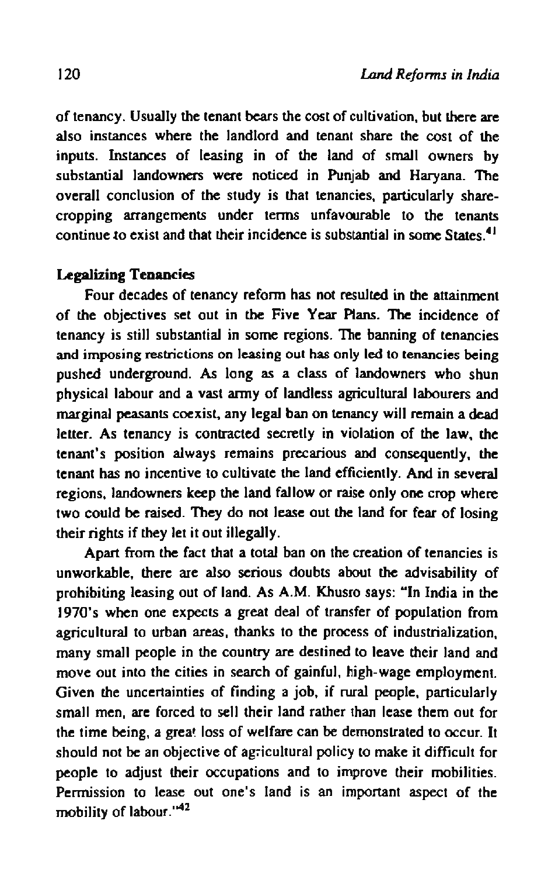

###### 120 Land Reforms in India

of tenancy. Usually the tenant bears the cost of cultivation, but there are also instances where the landlord and tenant share the cost of the inputs. Instances of leasing in of the land of small owners by substantial landowners were noticed in Punjab and Haryana. The overall conclusion of the study is that tenancies, particularly sharecropping arrangements under terms unfavourable to the tenants continue to exist and that their incidence is substantial in some States.41

###### Legalizing Tenancies

Four decades of tenancy reform has not resulted in the attainment of the objectives set out in the Five Year Plans. The incidence of tenancy is still substantial in some regions. The banning of tenancies and imposing restrictions on leasing out has only led to tenancies being pushed underground. As long as a class of landowners who shun physical labour and a vast army of landless agricultural labourers and marginal peasants coexist, any legal ban on tenancy will remain a dead letter. As tenancy is contracted secretly in violation of the law, the tenant’s position always remains precarious and consequently, the tenant has no incentive to cultivate the land efficiently. And in several regions, landowners keep the land fallow or raise only one crop where two could be raised. They do not lease out the land for fear of losing their rights if they let it out illegally.

Apart from the fact that a total ban on the creation of tenancies is unworkable, there are also serious doubts about the advisability of prohibiting leasing out of land. As A.M. Khusro says: “In India in the 1970’s when one expects a great deal of transfer of population from agricultural to urban areas, thanks to the process of industrialization, many small people in the country are destined to leave their land and move out into the cities in search of gainful, high-wage employment. Given the uncertainties of finding a job, if rural people, particularly small men, are forced to sell their land rather than lease them out for the time being, a great loss of welfare can be demonstrated to occur. It should not be an objective of agricultural policy to make it difficult for people to adjust their occupations and to improve their mobilities. Permission to lease out one’s land is an important aspect of the mobility of labour.’*42

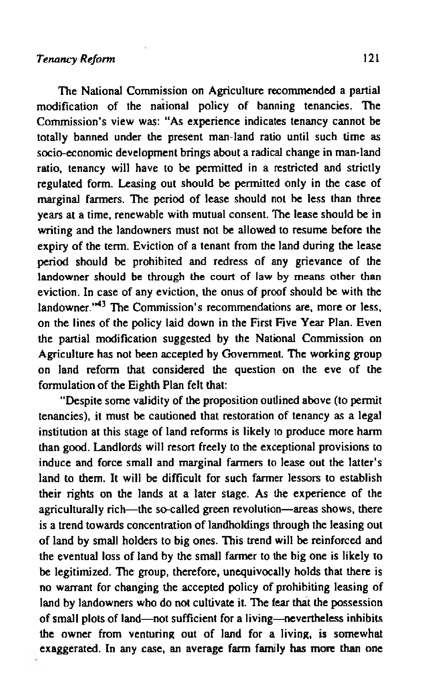

###### Tenancy Reform 121

The National Commission on Agriculture recommended a partial modification of the national policy of banning tenancies. The Commission’s view was: “As experience indicates tenancy cannot be totally banned under the present man-1 and ratio until such time as socio-economic development brings about a radical change in man-land ratio, tenancy will have to be permitted in a restricted and strictly regulated form. Leasing out should be permitted only in the case of marginal farmers. The period of lease should rot be less than three years at a time, renewable with mutual consent. The lease should be in writing and the landowners must not be allowed to resume before the expiry of the term. Eviction of a tenant from the land during the lease period should be prohibited and redress of any grievance of the landowner should be through the court of law by means other than eviction. In case of any eviction, the onus of proof should be with the landowner.’*43 The Commission’s recommendations are, more or less, on the lines of the policy laid down in the First Five Year Plan. Even the partial modification suggested by the National Commission on Agriculture has not been accepted by Government. The working group on land reform that considered the question on the eve of the formulation of the Eighth Plan felt that:

“Despite some validity of the proposition outlined above (to permit tenancies), it must be cautioned that restoration of tenancy as a legal institution at this stage of land reforms is likely to produce more harm than good. Landlords will resort freely to the exceptional provisions to induce and force small and marginal farmers to lease out the latter’s land to them. It will be difficult for such farmer lessors to establish their rights on the lands at a later stage. As the experience of the agriculturally rich—the so-called green revolution—areas shows, there is a trend towards concentration of landholdings through the leasing out of land by small holders to big ones. This trend will be reinforced and the eventual loss of land by the small farmer to the big one is likely to be legitimized. The group, therefore, unequivocally holds that there is no warrant for changing the accepted policy of prohibiting leasing of land by landowners who do not cultivate it. The fear that the possession of small plots of land—not sufficient for a living—nevertheless inhibits the owner from venturing out of land for a living, is somewhat exaggerated. In any case, an average farm family has more than one

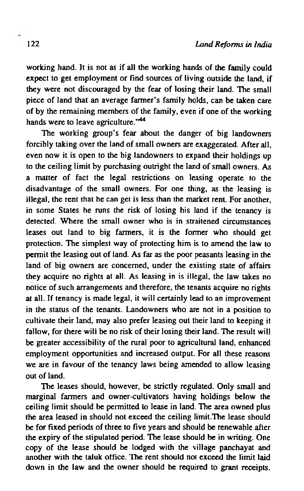

###### 122 Land Reforms in India

working hand. It is not as if all the working hands of the family could expect to get employment or find sources of living outside the land, if they were not discouraged by the fear of losing their land. The small piece of land that an average farmer’s family holds, can be taken care of by the remaining members of the family, even if one of the working hands were to leave agriculture.”44

The working group’s fear about the danger of big landowners forcibly taking over the land of small owners are exaggerated. After all, even now it is open to the big landowners to expand their holdings up to the ceiling limit by purchasing outright the land of small owners. As a matter of fact the legal restrictions on leasing operate to the disadvantage of the small owners. For one thing, as the leasing is illegal, the rent that he can get is less than the market rent. For another, in some States he runs the risk of losing his land if the tenancy is detected. Where the small owner who is in straitened circumstances leases out land to big farmers, it is the former who should get protection. The simplest way of protecting him is to amend the law to permit the leasing out of land. As far as the poor peasants leasing in the land of big owners are concerned, under the existing state of affairs they acquire no rights at all. As leasing in is illegal, the law takes no notice of such arrangements and therefore, the tenants acquire no rights

- at all. If tenancy is made legal, it will certainly lead to an improvement in the status of the tenants. Landowners who are not in a position to cultivate their land, may also prefer leasing out their land to keeping it fallow, for there will be no risk of their losing their land. The result will be greater accessibility of the rural poor to agricultural land, enhanced employment opportunities and increased output. For all these reasons we are in favour of the tenancy laws being amended to allow leasing out of land.

The leases should, however, be strictly regulated. Only small and marginal farmers and owner-cultivators having holdings below the ceiling limit should be permitted to lease in land. The area owned plus the area leased in should not exceed the ceiling limit.The lease should be for fixed periods of three to five years and should be renewable after the expiry of the stipulated period. The lease should be in writing. One copy of the lease should be lodged with the village panchayat and another with the taluk office. The rent should not exceed the limit laid down in the law and the owner should be required to grant receipts.

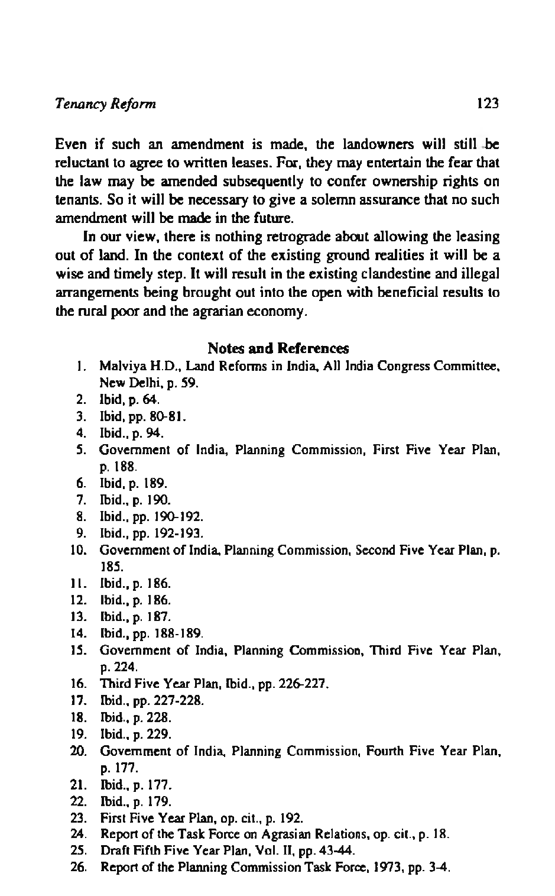

Tenancy Reform 123

Even if such an amendment is made, the landowners will still be reluctant to agree to written leases. For, they may entertain the fear that the law may be amended subsequently to confer ownership rights on tenants. So it will be necessary to give a solemn assurance that no such amendment will be made in the future.

In our view, there is nothing retrograde about allowing the leasing out of land. In the context of the existing ground realities it will be a wise and timely step. It will result in the existing clandestine and illegal arrangements being brought out into the open with beneficial results to the rural poor and the agrarian economy.

###### Notes and References

- 1. Malviya H.D., Land Reforms in India, All India Congress Committee, New Delhi, p. 59.
- 2. Ibid, p. 64.
- 3. Ibid, pp. 80-81.
- 4. Ibid., p. 94.
- 5. Government of India, Planning Commission, First Five Year Plan, p. 188.
- 6. Ibid, p. 189.
- 7. Ibid., p. 190.
- 8. Ibid., pp. 190-192.
- 9. Ibid., pp. 192-193.
- 10. Government of India, Planning Commission, Second Five Year Plan, p. 185.
- 11. Ibid., p. 186.
- 12. Ibid., p. 186.
- 13. Ibid., p. 187.
- 14. Ibid., pp. 188-189.
- 15. Government of India, Planning Commission, Third Five Year Plan, p. 224.
- 16. Third Five Year Plan, Ibid., pp. 226-227.
- 17. Ibid., pp. 227-228.
- 18. Ibid., p. 228.
- 19. Ibid., p. 229.
- 20. Government of India, Planning Commission, Fourth Five Year Plan, p. 177.
- 21. Ibid., p. 177.
- 22. Ibid., p. 179.
- 23. First Five Year Plan, op. cit., p. 192.
- 24. Report of the Task Force on Agrasian Relations, op. cit., p. 18.
- 25. Draft Fifth Five Year Plan, Vol. II, pp. 43-44.
- 26. Report of the Planning Commission Task Force, 1973, pp. 3-4.

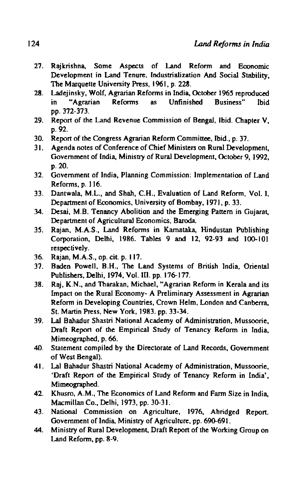

###### 124 Land Reforms in India

- 27. Rajkrishna, Some Aspects of Land Reform and Economic Development in Land Tenure, Industrialization And Social Stability, The Marquette University Press, 1961, p. 228.
- 28. Ladejinsky, Wolf, Agrarian Reforms in India, October 1965 reproduced in “Agrarian Reforms as Unfinished Business” Ibid pp. 372-373.
- 29. Report of the Land Revenue Commission of Bengal, Ibid. Chapter V, p. 92.
- 30. Report of the Congress Agrarian Reform Committee, Ibid., p. 37.
- 31. Agenda notes of Conference of Chief Ministers on Rural Development, Government of India, Ministry of Rural Development, October 9, 1992, p. 20.
- 32. Government of India, Planning Commission: Implementation of Land Reforms, p. 116.
- 33. Dantwala, M.L., and Shah, C.H., Evaluation of Land Reform, Vol. I, Department of Economics, University of Bombay, 1971, p. 33.
- 34. Desai, M.B. Tenancy Abolition and the Emerging Pattern in Gujarat, Department of Agricultural Economics, Baroda.
- 35. Rajan, M.A.S., Land Reforms in Karnataka, Hindustan Publishing Corporation, Delhi, 1986. Tables 9 and 12, 92-93 and 100-101 respectively.
- 36. Rajan, M.A.S., op. cit. p. 117.
- 37. Baden Powell, B.H., The Land Systems of British India, Oriental Publishers, Delhi, 1974, Vol. III. pp. 176-177.
- 38. Raj, K.N., and Tharakan, Michael, "Agrarian Reform in Kerala and its Impact on the Rural Economy- A Preliminary Assessment in Agrarian Reform in Developing Countries, Crown Helm, London and Canberra, St. Martin Press, New York, 1983. pp. 33-34.
- 39. Lai Bahadur Shastri National Academy of Administration, Mussoorie, Draft Report of the Empirical Study of Tenancy Reform in India, Mimeographed, p. 66.
- 40. Statement compiled by the Directorate of Land Records, Government of West Bengal).
- 41. Lai Bahadur Shastri National Academy of Administration, Mussoorie, ‘Draft Report of the Empirical Study of Tenancy Reform in India’, Mimeographed.
- 42. Khusro, A.M., The Economics of Land Reform and Farm Size in India, Macmillan Co., Delhi, 1973, pp. 30-31.
- 43. National Commission on Agriculture, 1976, Abridged Report. Government of India, Ministry of Agriculture, pp. 690-691.
- 44. Ministry of Rural Development, Draft Report of the Working Group on Land Reform, pp. 8-9.

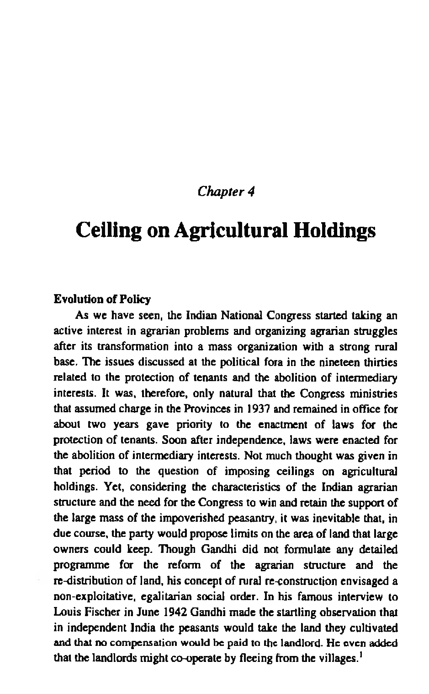

Chapter 4

### Ceiling on Agricultural Holdings

Evolution of Policy

As we have seen, the Indian National Congress started taking an active interest in agrarian problems and organizing agrarian struggles after its transformation into a mass organization with a strong rural base. The issues discussed at the political fora in the nineteen thirties related to the protection of tenants and the abolition of intermediary interests. It was, therefore, only natural that the Congress ministries that assumed charge in the Provinces in 1937 and remained in office for about two years gave priority to the enactment of laws for the protection of tenants. Soon after independence, laws were enacted for the abolition of intermediary interests. Not much thought was given in that period to the question of imposing ceilings on agricultural holdings. Yet, considering the characteristics of the Indian agrarian structure and the need for the Congress to win and retain the support of the large mass of the impoverished peasantry, it was inevitable that, in due course, the party would propose limits on the area of land that large owners could keep. Though Gandhi did not formulate any detailed programme for the reform of the agrarian structure and the re-distribution of land, his concept of rural re-construction envisaged a non-exploitative, egalitarian social order. In his famous interview to Louis Fischer in June 1942 Gandhi made the startling observation that in independent India the peasants would take the land they cultivated and that no compensation would be paid to the landlord. He even added that the landlords might co-operate by fleeing from the villages.1

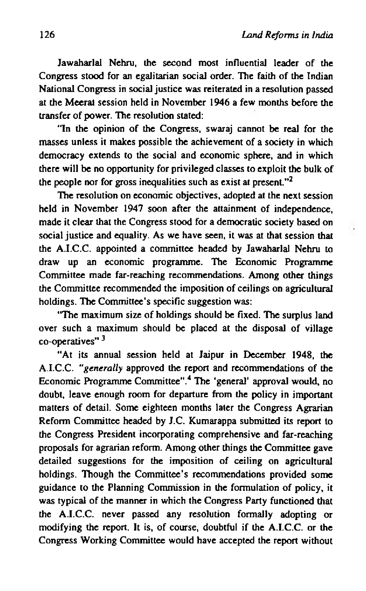

126 Land Reforms in India

Jawaharlal Nehru, the second most influential leader of the Congress stood for an egalitarian social order. The faith of the Indian National Congress in social justice was reiterated in a resolution passed at the Meerat session held in November 1946 a few months before the transfer of power. The resolution stated:

“In the opinion of the Congress, swaraj cannot be real for the masses unless it makes possible the achievement of a society in which democracy extends to the social and economic sphere, and in which there will be no opportunity for privileged classes to exploit the bulk of the people nor for gross inequalities such as exist at present.”2

The resolution on economic objectives, adopted at the next session held in November 1947 soon after the attainment of independence, made it clear that the Congress stood for a democratic society based on social justice and equality. As we have seen, it was at that session that the A.I.C.C. appointed a committee headed by Jawaharlal Nehru to draw up an economic programme. The Economic Programme Committee made far-reaching recommendations. Among other things the Committee recommended the imposition of ceilings on agricultural holdings. The Committee’s specific suggestion was:

“The maximum size of holdings should be fixed. The surplus land over such a maximum should be placed at the disposal of village co-operatives” 3

“At its annual session held at Jaipur in December 1948, the A.I.C.C. “generally approved the report and recommendations of the Economic Programme Committee”.4 The ‘general’ approval would, no doubt, leave enough room for departure from the policy in important matters of detail. Some eighteen months later the Congress Agrarian Reform Committee headed by J.C. Kumarappa submitted its report to the Congress President incorporating comprehensive and far-reaching proposals for agrarian reform. Among other things the Committee gave detailed suggestions for the imposition of ceiling on agricultural holdings. Though the Committee’s recommendations provided some guidance to the Planning Commission in the formulation of policy, it was typical of the manner in which the Congress Party functioned that the A.I.C.C. never passed any resolution formally adopting or modifying the report. It is, of course, doubtful if the A.I.C.C. or the Congress Working Committee would have accepted the report without

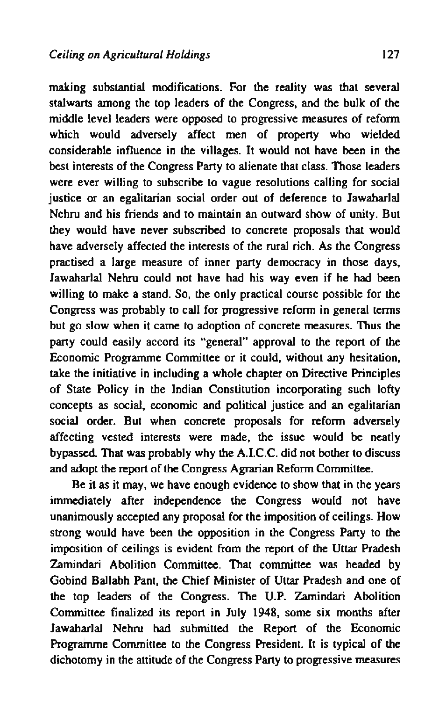

###### Ceiling on Agricultural Holdings 127

making substantial modifications. For the reality was that several stalwarts among the top leaders of the Congress, and the bulk of the middle level leaders were opposed to progressive measures of reform which would adversely affect men of property who wielded considerable influence in the villages. It would not have been in the best interests of the Congress Party to alienate that class. Those leaders were ever willing to subscribe to vague resolutions calling for social justice or an egalitarian social order out of deference to Jawaharlal Nehru and his friends and to maintain an outward show of unity. But they would have never subscribed to concrete proposals that would have adversely affected the interests of the rural rich. As the Congress practised a large measure of inner party democracy in those days, Jawaharlal Nehru could not have had his way even if he had been willing to make a stand. So, the only practical course possible for the Congress was probably to call for progressive reform in general terms but go slow when it came to adoption of concrete measures. Thus the party could easily accord its “general” approval to the report of the Economic Programme Committee or it could, without any hesitation, take the initiative in including a whole chapter on Directive Principles of State Policy in the Indian Constitution incorporating such lofty concepts as social, economic and political justice and an egalitarian social order. But when concrete proposals for reform adversely affecting vested interests were made, the issue would be neatly bypassed. That was probably why the A.I.C.C. did not bother to discuss and adopt the report of the Congress Agrarian Reform Committee.

Be it as it may, we have enough evidence to show that in the years immediately after independence the Congress would not have unanimously accepted any proposal for the imposition of ceilings. How strong would have been the opposition in the Congress Party to the imposition of ceilings is evident from the report of the Uttar Pradesh Zamindari Abolition Committee. That committee was headed by Gobind Ballabh Pant, the Chief Minister of Uttar Pradesh and one of the top leaders of the Congress. The U.P. Zamindari Abolition Committee finalized its report in July 1948, some six months after Jawaharlal Nehru had submitted the Report of the Economic Programme Committee to the Congress President. It is typical of the dichotomy in the attitude of the Congress Party to progressive measures

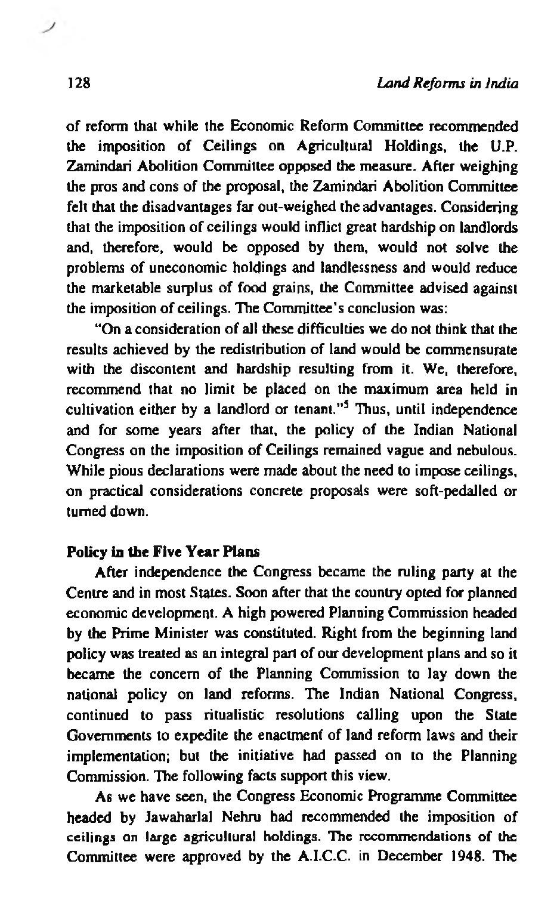

128 Land Reforms in India

of reform that while the Economic Reform Committee recommended the imposition of Ceilings on Agricultural Holdings, the U.P. Zamindari Abolition Committee opposed the measure. After weighing the pros and cons of the proposal, the Zamindari Abolition Committee felt that the disadvantages far out-weighed the advantages. Considering that the imposition of ceilings would inflict great hardship on landlords and, therefore, would be opposed by them, would not solve the problems of uneconomic holdings and landlessness and would reduce the marketable surplus of food grains, the Committee advised against the imposition of ceilings. The Committee’s conclusion was:

“On a consideration of all these difficulties we do not think that the results achieved by the redistribution of land would be commensurate with the discontent and hardship resulting from it. We, therefore, recommend that no limit be placed on the maximum area held in cultivation either by a landlord or tenant.”5 Thus, until independence and for some years after that, the policy of the Indian National Congress on the imposition of Ceilings remained vague and nebulous. While pious declarations were made about the need to impose ceilings, on practical considerations concrete proposals were soft-pedalled or turned down.

###### Policy in the Five Year Plans

After independence the Congress became the ruling party at the Centre and in most States. Soon after that the country opted for planned economic development. A high powered Planning Commission headed by the Prime Minister was constituted. Right from the beginning land policy was treated as an integral part of our development plans and so it became the concern of the Planning Commission to lay down the national policy on land reforms. The Indian National Congress, continued to pass ritualistic resolutions calling upon the State Governments to expedite the enactment of land reform laws and their implementation; but the initiative had passed on to the Planning Commission. The following facts support this view.

As we have seen, the Congress Economic Programme Committee headed by Jawaharlal Nehru had recommended the imposition of ccilings on large agricultural holdings. The recommendations of the Committee were approved by the A.I.C.C. in December 1948. The

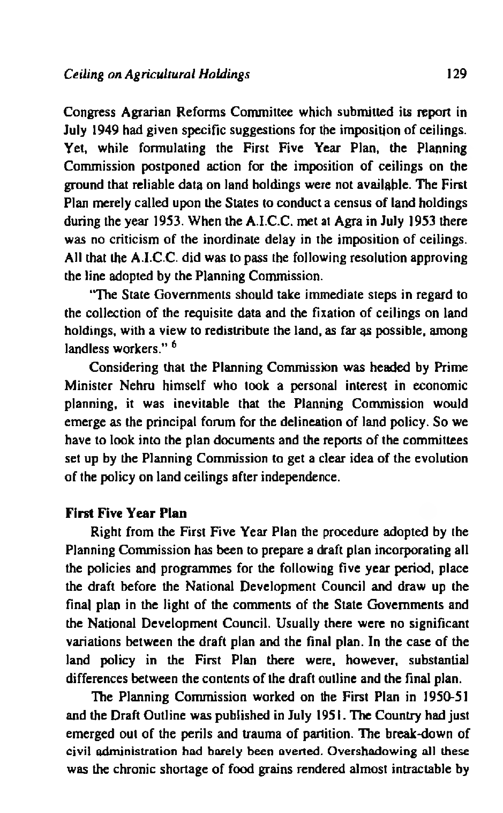

###### Ceiling on Agricultural Holdings 129

Congress Agrarian Reforms Committee which submitted its report in July 1949 had given specific suggestions for the imposition of ceilings. Yet, while formulating the First Five Year Plan, the Planning Commission postponed action for the imposition of ceilings on the ground that reliable data on land holdings were not available. The First Plan merely called upon the States to conduct a census of land holdings during the year 1953. When the A.I.C.C. met at Agra in July 1953 there was no criticism of the inordinate delay in the imposition of ceilings. All that the A.I.C.C. did was to pass the following resolution approving the line adopted by the Planning Commission.

“The State Governments should take immediate steps in regard to the collection of the requisite data and the fixation of ceilings on land holdings, with a view to redistribute the land, as far as possible, among landless workers.” 6

Considering that the Planning Commission was headed by Prime Minister Nehru himself who took a personal interest in economic planning, it was inevitable that the Planning Commission would emerge as the principal forum for the delineation of land policy. So we have to look into the plan documents and the reports of the committees set up by the Planning Commission to get a dear idea of the evolution of the policy on land ceilings after independence.

###### First Five Year Plan

Right from the First Five Year Plan the procedure adopted by the Planning Commission has been to prepare a draft plan incorporating all the policies and programmes for the following five year period, place the draft before the National Development Council and draw up the final plan in the light of the comments of the State Governments and the National Development Council. Usually there were no significant variations between the draft plan and the final plan. In the case of the land policy in the First Plan there were, however, substantial differences between the contents of the draft outline and the final plan.

The Planning Commission worked on the First Plan in 1950-51 and the Draft Outline was published in July 1951. The Country had just emerged out of the perils and trauma of partition. The break-down of civil administration had barely been averted. Overshadowing all these was the chronic shortage of food grains rendered almost intractable by

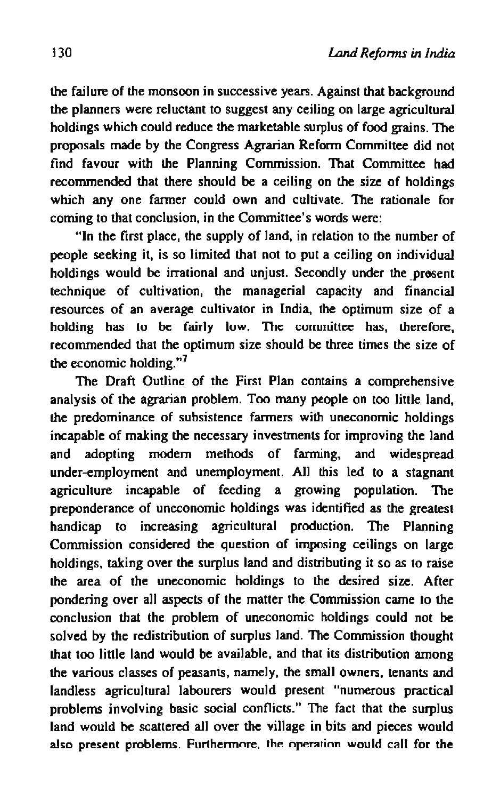

130 Land Reforms in India

the failure of the monsoon in successive years. Against that background the planners were reluctant to suggest any ceiling on large agricultural holdings which could reduce the marketable surplus of food grains. The proposals made by the Congress Agrarian Reform Committee did not find favour with the Planning Commission. That Committee had recommended that there should be a ceiling on the size of holdings which any one farmer could own and cultivate. The rationale for coming to that conclusion, in the Committee’s words were:

“In the first place, the supply of land, in relation to the number of people seeking it, is so limited that not to put a ceiling on individual holdings would be irrational and unjust. Secondly under the present technique of cultivation, the managerial capacity and financial resources of an average cultivator in India, the optimum size of a holding has to be fairly low. The coiiunillce has, therefore, recommended that the optimum size should be three times the size of the economic holding.”7

The Draft Outline of the First Plan contains a comprehensive analysis of the agrarian problem. Too many people on too little land, the predominance of subsistence farmers with uneconomic holdings incapable of making the necessary investments for improving the land and adopting modem methods of fanning, and widespread under-employment and unemployment. All this led to a stagnant agriculture incapable of feeding a growing population. The preponderance of uneconomic holdings was identified as the greatest handicap to increasing agricultural production. The Planning Commission considered the question of imposing ceilings on large holdings, taking over the surplus land and distributing it so as to raise the area of the uneconomic holdings to the desired size. After pondering over all aspects of the matter the Commission came to the conclusion that the problem of uneconomic holdings could not be solved by the redistribution of surplus land. The Commission thought that too little land would be available, and thal its distribution among the various classes of peasants, namely, the small owners, tenants and landless agricultural labourers would present “numerous practical problems involving basic social conflicts.” The fact that the surplus land would be scattered all over the village in bits and pieces would also present problems. Furthermore, the operation would call for the

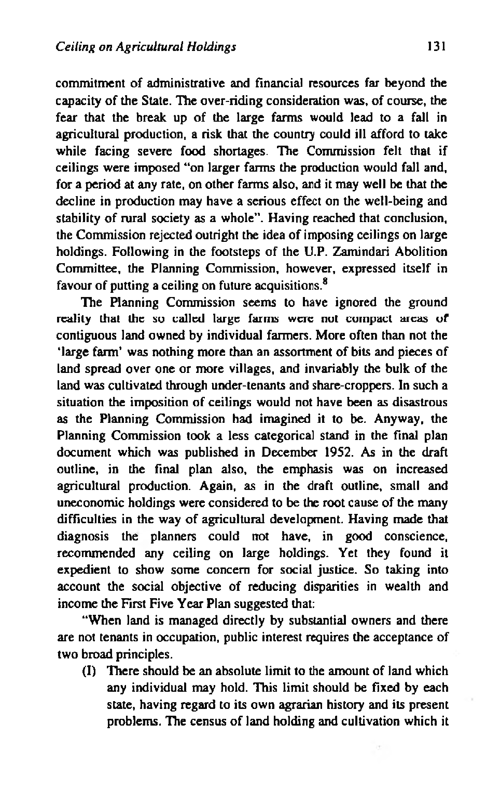

Ceiling on Agricultural Holdings 131

commitment of administrative and financial resources far beyond the capacity of the State. The over-riding consideration was, of course, the fear that the break up of the large farms would lead to a fall in agricultural production, a risk that the country could ill afford to take while facing severe food shortages. The Commission felt that if ceilings were imposed “on larger farms the production would fall and, for a period at any rate, on other farms also, and it may well be that the decline in production may have a serious effect on the well-being and stability of rural society as a whole’*. Having reached that conclusion, the Commission rejected outright the idea of imposing ceilings on large holdings. Following in the footsteps of the U.P. Zamindari Abolition Committee, the Planning Commission, however, expressed itself in favour of putting a ceiling on future acquisitions.8

The Planning Commission seems to have ignored the ground reality that the so called large farms were not compact areas of contiguous land owned by individual farmers. More often than not the ‘large farm’ was nothing more than an assortment of bits and pieces of land spread over one or more villages, and invariably the bulk of the land was cultivated through under-tenants and share-croppers. In such a situation the imposition of ceilings would not have been as disastrous as the Planning Commission had imagined it to be. Anyway, the Planning Commission took a less categorical stand in the final plan document which was published in December 1952. As in the draft outline, in the final plan also, the emphasis was on increased agricultural production. Again, as in the draft outline, small and uneconomic holdings were considered to be the root cause of the many difficulties in the way of agricultural development. Having made that diagnosis the planners could not have, in good conscience, recommended any ceiling on large holdings. Yet they found it expedient to show some concern for social justice. So taking into account the social objective of reducing disparities in wealth and income the First Five Year Plan suggested that:

“When land is managed directly by substantial owners and there are not tenants in occupation, public interest requires the acceptance of two broad principles.

(I) There should be an absolute limit to the amount of land which any individual may hold. This limit should be fixed by each state, having regard to its own agrarian history and its present problems. The census of land holding and cultivation which it

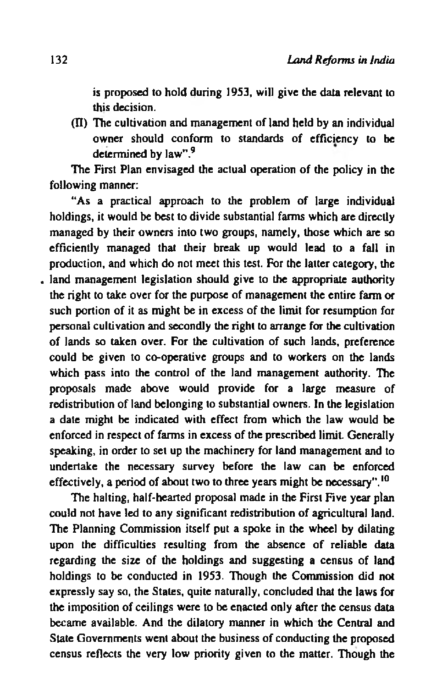

132 Land Reforms in India

is proposed to hold during 1953, will give the data relevant to this decision.

(II) The cultivation and management of land held by an individual owner should conform to standards of efficiency to be determined by law”.9

The First Plan envisaged the actual operation of the policy in the following manner:

“As a practical approach to the problem of large individual holdings, it would be best to divide substantial farms which are directly managed by their owners into two groups, namely, those which are so efficiently managed that their break up would lead to a fall in production, and which do not meet this test. For the latter category, the

• land management legislation should give to the appropriate authority the right to take over for the purpose of management the entire farm or such portion of it as might be in excess of the limit for resumption for personal cultivation and secondly the right to arrange for the cultivation of lands so taken over. For the cultivation of such lands, preference could be given to co-operative groups and to workers on the lands which pass into the control of the land management authority. The proposals made above would provide for a large measure of redistribution of land belonging to substantial owners. In the legislation a date might be indicated with effect from which the law would be enforced in respect of farms in excess of the prescribed limit. Generally speaking, in order to set up the machinery for land management and to undertake the necessary survey before the law can be enforced effectively, a period of about two to three years might be necessary”.10

The halting, half-hearted proposal made in the First Five year plan could not have led to any significant redistribution of agricultural land. The Planning Commission itself put a spoke in the wheel by dilating upon the difficulties resulting from the absence of reliable data regarding the size of the holdings and suggesting a census of land holdings to be conducted in 1953. Though the Commission did not expressly say so, the States, quite naturally, concluded that the laws for the imposition of ceilings were to be enacted only after the census data became available. And the dilatory manner in which the Central and State Governments went about the business of conducting the proposed census reflects the very low priority given to the matter. Though the

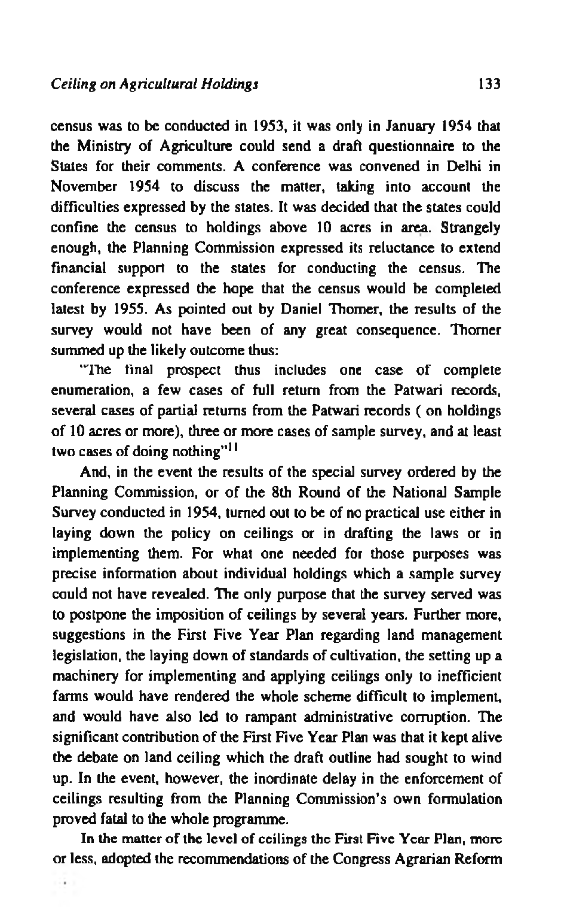

###### Ceiling on Agricultural Holdings 133

census was to be conducted in 1953, it was only in January 1954 that the Ministry of Agriculture could send a draft questionnaire to the States for their comments. A conference was convened in Delhi in November 1954 to discuss the matter, taking into account the difficulties expressed by the states. It was decided that the states could confine the census to holdings above 10 acres in area. Strangely enough, the Planning Commission expressed its reluctance to extend financial support to the states for conducting the census. The conference expressed the hope that the census would be completed latest by 1955. As pointed out by Daniel Thomer, the results of the survey would not have been of any great consequence. Thomer summed up the likely outcome thus:

“The final prospect thus includes one case of complete enumeration, a few cases of full return from the Patwari records, several cases of partial returns from the Patwari records ( on holdings of 10 acres or more), three or more cases of sample survey, and at least two cases of doing nothing’’11

And, in the event the results of the special survey ordered by the Planning Commission, or of the 8th Round of the National Sample Survey conducted in 1954, turned out to be of no practical use either in laying down the policy on ceilings or in drafting the laws or in implementing them. For what one needed for those purposes was precise information about individual holdings which a sample survey could not have revealed. The only purpose that the survey served was to postpone the imposition of ceilings by several years. Further more, suggestions in the First Five Year Plan regarding land management legislation, the laying down of standards of cultivation, the setting up a machinery for implementing and applying ceilings only to inefficient farms would have rendered the whole scheme difficult to implement, and would have also led to rampant administrative corruption. The significant contribution of the First Five Year Plan was that it kept alive the debate on land ceiling which the draft outline had sought to wind up. In the event, however, the inordinate delay in the enforcement of ceilings resulting from the Planning Commission’s own formulation proved fatal to the whole programme.

In the matter of the level of ccilings the First Five Year Plan, more or less, adopted the recommendations of the Congress Agrarian Reform

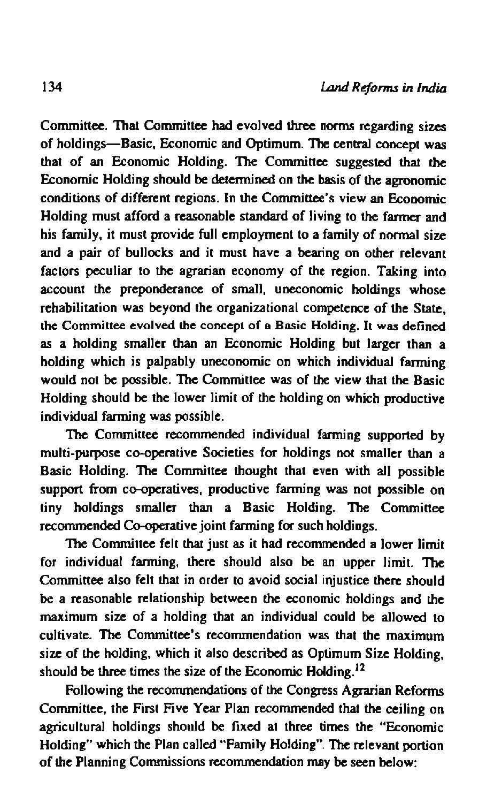

###### 134 Land Reforms in India

Committee. That Committee had evolved three norms regarding sizes of holdings—Basic, Economic and Optimum. The central concept was that of an Economic Holding. The Committee suggested that the Economic Holding should be determined on the basis of the agronomic conditions of different regions. In the Committee’s view an Economic Holding must afford a reasonable standard of living to the farmer and his family, it must provide full employment to a family of normal size and a pair of bullocks and it must have a bearing on other relevant factors peculiar to the agrarian economy of the region. Taking into account the preponderance of small, uneconomic holdings whose rehabilitation was beyond the organizational competence of the State, the Committee evolved the concept of a Basic Holding. It was defined as a holding smaller than an Economic Holding but larger than a holding which is palpably uneconomic on which individual farming would not be possible. The Committee was of the view that the Basic Holding should be the lower limit of the holding on which productive individual farming was possible.

The Committee recommended individual farming supported by multi-purpose co-operative Societies for holdings not smaller than a Basic Holding. The Committee thought that even with all possible support from co-operatives, productive farming was not possible on tiny holdings smaller than a Basic Holding. The Committee recommended Co-operative joint farming for such holdings.

The Committee felt that just as it had recommended a lower limit for individual farming, there should also be an upper limit. The Committee also felt that in order to avoid social injustice there should be a reasonable relationship between the economic holdings and the maximum size of a holding that an individual could be allowed to cultivate. The Committee’s recommendation was that the maximum size of the holding, which it also described as Optimum Size Holding, should be three times the size of the Economic Holding.12

Following the recommendations of the Congress Agrarian Reforms Committee, the First Five Year Plan recommended that the ceiling on agricultural holdings should be fixed at three times the “Economic Holding” which the Plan called “Family Holding”. The relevant portion of the Planning Commissions recommendation may be seen below:

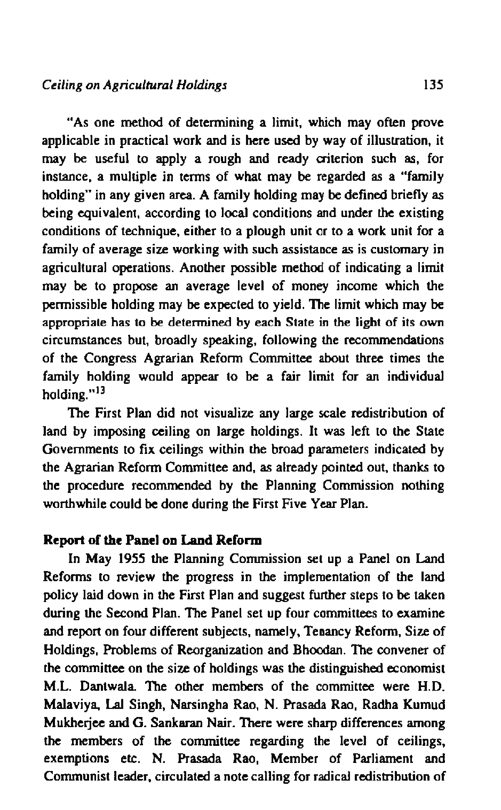

###### Ceiling on Agricultural Holdings 135

“As one method of determining a limit, which may often prove applicable in practical work and is here used by way of illustration, it may be useful to apply a rough and ready criterion such as, for instance, a multiple in terms of what may be regarded as a “family holding” in any given area. A family holding may be defined briefly as being equivalent, according to local conditions and under the existing conditions of technique, either to a plough unit or to a work unit for a family of average size working with such assistance as is customary in agricultural operations. Another possible method of indicating a limit may be to propose an average level of money income which the permissible holding may be expected to yield. The limit which may be appropriate has to be determined by each State in the light of its own circumstances but, broadly speaking, following the recommendations of the Congress Agrarian Reform Committee about three times the family holding would appear to be a fair limit for an individual holding.”13

The First Plan did not visualize any large scale redistribution of land by imposing ceiling on large holdings. It was left to the State Governments to fix ceilings within the broad parameters indicated by the Agrarian Reform Committee and, as already pointed out, thanks to the procedure recommended by the Planning Commission nothing worthwhile could be done during the First Five Year Plan.

###### Report of the Panel on Land Reform

In May 1955 the Planning Commission set up a Panel on Land Reforms to review the progress in the implementation of the land policy laid down in the First Plan and suggest further steps to be taken during the Second Plan. The Panel set up four committees to examine and report on four different subjects, namely, Tenancy Reform, Size of Holdings, Problems of Reorganization and Bhoodan. The convener of the committee on the size of holdings was the distinguished economist M.L. Dantwala. The other members of the committee were H.D. Malaviya, Lai Singh, Narsingha Rao, N. Prasada Rao, Radha Kumud Mukherjee and G. Sankaran Nair. There were sharp differences among the members of the committee regarding the level of ceilings, exemptions etc. N. Prasada Rao, Member of Parliament and Communist leader, circulated a note calling for radical redistribution of

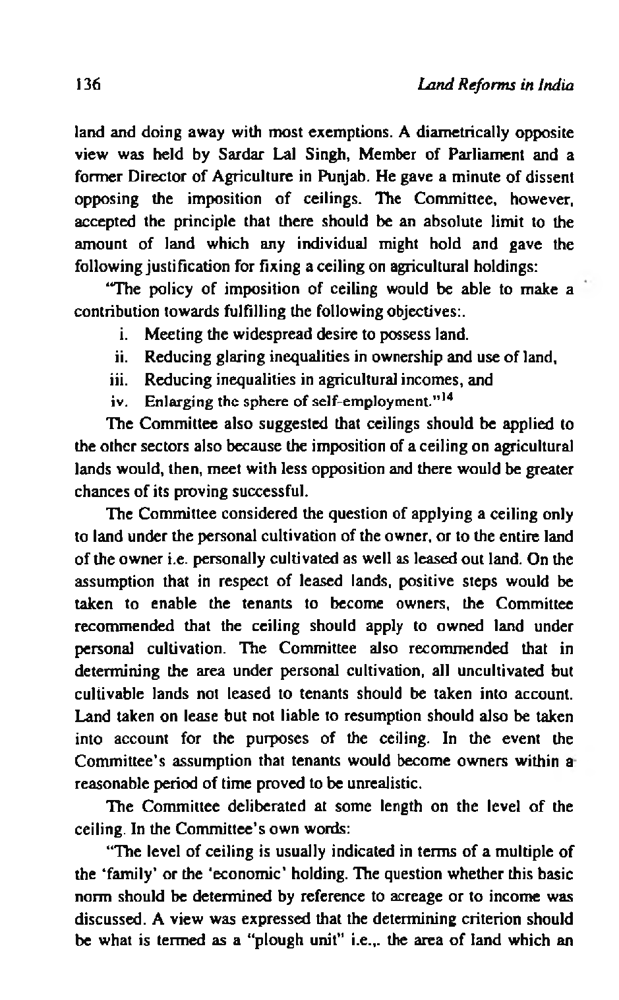

###### 136 Land Reforms in India

land and doing away with most exemptions. A diametrically opposite view was held by Sardar Lai Singh, Member of Parliament and a former Director of Agriculture in Punjab. He gave a minute of dissent opposing the imposition of ceilings. The Committee, however, accepted the principle that there should be an absolute limit to the amount of land which any individual might hold and gave the following justification for fixing a ceiling on agricultural holdings:

“The policy of imposition of ceiling would be able to make a contribution towards fulfilling the following objectives:.

- i. Meeting the widespread desire to possess land.
- ii. Reducing glaring inequalities in ownership and use of land,
- iii. Reducing inequalities in agricultural incomes, and
- iv. Enlarging the sphere of self-employment.”14

The Committee also suggested that ceilings should be applied to the other sectors also because the imposition of a ceiling on agricultural lands would, then, meet with less opposition and there would be greater chances of its proving successful.

The Committee considered the question of applying a ceiling only to land under the personal cultivation of the owner, or to the entire land of the owner i.e. personally cultivated as well as leased out land. On the assumption that in respect of leased lands, positive steps would be taken to enable the tenants to become owners, the Committee recommended that the ceiling should apply to owned land under personal cultivation. The Committee also recommended that in determining the area under personal cultivation, all uncultivated but cultivable lands not leased to tenants should be taken into account. Land taken on lease but not liable to resumption should also be taken into account for the purposes of the ceiling. In the event the Committee’s assumption that tenants would become owners within a reasonable period of time proved to be unrealistic.

The Committee deliberated at some length on the level of the ceiling. In the Committee’s own words:

“The level of ceiling is usually indicated in terms of a multiple of the ‘family’ or the ‘economic’ holding. The question whether this basic norm should be determined by reference to acreage or to income was discussed. A view was expressed that the determining criterion should be what is termed as a “plough unit” i.e.,. the area of land which an

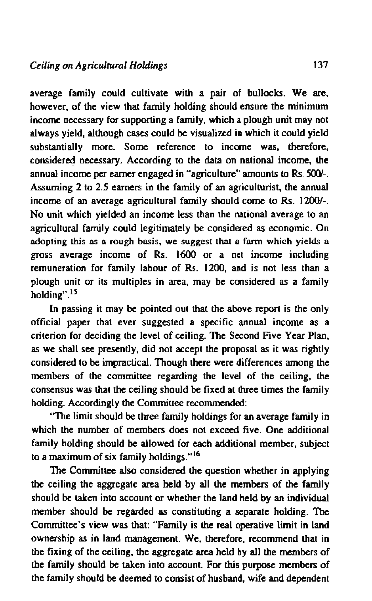

###### Ceiling on Agricultural Holdings 137

average family could cultivate with a pair of bullocks. We are, however, of the view that family holding should ensure the minimum income necessary for supporting a family, which a plough unit may not always yield, although cases could be visualized in which it could yield substantially more. Some reference to income was, therefore, considered necessary. According to the data on national income, the annual income per earner engaged in “agriculture” amounts to Rs. 500/-. Assuming 2 to 2.5 earners in the family of an agriculturist, the annual income of an average agricultural family should come to Rs. 1200/-. No unit which yielded an income less than the national average to an agricultural family could legitimately be considered as economic. On adopting this as a rough basis, wc suggest that a farm which yields a gross average income of Rs. 1600 or a net income including remuneration for family labour of Rs. 1200, and is not less than a plough unit or its multiples in area, may be considered as a family holding”.15

In passing it may be pointed out that the above report is the only official paper that ever suggested a specific annual income as a criterion for deciding the level of ceiling. The Second Five Year Plan, as we shall see presently, did not accept the proposal as it was rightly considered to be impractical. Though there were differences among the members of the committee regarding the level of the ceiling, the consensus was that the ceiling should be fixed at three times the family holding. Accordingly the Committee recommended:

“The limit should be three family holdings for an average family in which the number of members does not exceed five. One additional family holding should be allowed for each additional member, subject to a maximum of six family holdings.”16

The Committee also considered the question whether in applying the ceiling the aggregate area held by all the members of the family should be taken into account or whether the land held by an individual member should be regarded as constituting a separate holding. The Committee’s view was that: “Family is the real operative limit in land ownership as in land management. We, therefore, recommend that in the fixing of the ceiling, the aggregate area held by all the members of the family should be taken into account. For this purpose members of the family should be deemed to consist of husband, wife and dependent

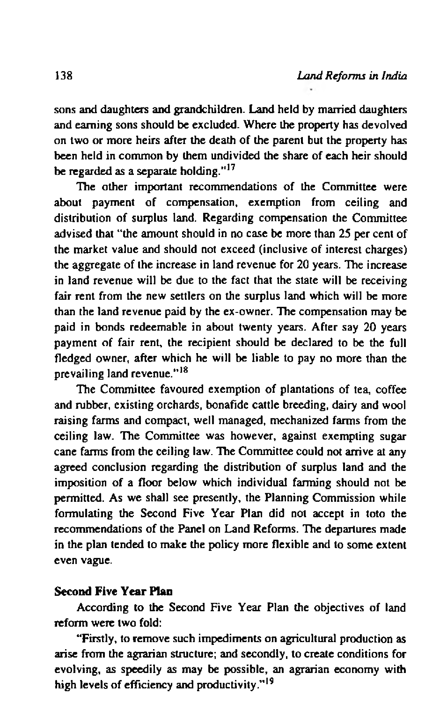

###### 138 Land Reforms in India

sons and daughters and grandchildren. Land held by married daughters and earning sons should be excluded. Where the property has devolved on two or more heirs after the death of the parent but the property has been held in common by them undivided the share of each heir should be regarded as a separate holding.”17

The other important recommendations of the Committee were about payment of compensation, exemption from ceiling and distribution of surplus land. Regarding compensation the Committee advised that “the amount should in no case be more than 25 per cent of the market value and should not exceed (inclusive of interest charges) the aggregate of the increase in land revenue for 20 years. The increase in land revenue will be due to the fact that the state will be receiving fair rent from the new settlers on the surplus land which will be more than the land revenue paid by the ex-owner. The compensation may be paid in bonds redeemable in about twenty years. After say 20 years payment of fair rent, the recipient should be declared to be the full fledged owner, after which he will be liable to pay no more than the prevailing land revenue.”18

The Committee favoured exemption of plantations of tea, coffee and rubber, existing orchards, bonafide cattle breeding, dairy and wool raising farms and compact, well managed, mechanized farms from the ceiling law. The Committee was however, against exempting sugar cane farms from the ceiling law. The Committee could not arrive at any agreed conclusion regarding the distribution of surplus land and the imposition of a floor below which individual farming should not be permitted. As we shall see presently, the Planning Commission while formulating the Second Five Year Plan did not accept in toto the recommendations of the Panel on Land Reforms. The departures made in the plan tended to make the policy more flexible and to some extent even vague.

###### Second Five Year Plan

According to the Second Five Year Plan the objectives of land reform were two fold:

“Firstly, to remove such impediments on agricultural production as arise from the agrarian structure; and secondly, to create conditions for evolving, as speedily as may be possible, an agrarian economy with high levels of efficiency and productivity.”19

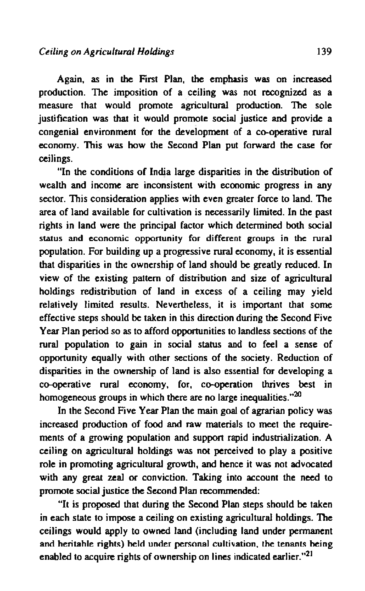

###### Ceiling on Agricultural Holdings 139

Again, as in the First Plan, the emphasis was on increased production. The imposition of a ceiling was not recognized as a measure that would promote agricultural production. The sole justification was that it would promote social justice and provide a congenial environment for the development of a co-operative rural economy. This was how the Second Plan put forward the case for ceilings.

“In the conditions of India large disparities in the distribution of wealth and income are inconsistent with economic progress in any sector. This consideration applies with even greater force to land. The area of land available for cultivation is necessarily limited. In the past rights in land were the principal factor which determined both social

status and economic opportunity for different groups in the rural

population. For building up a progressive rural economy, it is essential that disparities in the ownership of land should be greatly reduced. In view of the existing pattern of distribution and size of agricultural holdings redistribution of land in excess of a ceiling may yield relatively limited results. Nevertheless, it is important that some effective steps should be taken in this direction during the Second Five Year Plan period so as to afford opportunities to landless sections of the rural population to gain in social status and to feel a sense of opportunity equally with other sections of the society. Reduction of disparities in the ownership of land is also essential for developing a co-operative rural economy, for, co-operation thrives best in homogeneous groups in which there are no large inequalities.”20

In the Second Five Year Plan the main goal of agrarian policy was increased production of food and raw materials to meet the requirements of a growing population and support rapid industrialization. A ceiling on agricultural holdings was not perceived to play a positive role in promoting agricultural growth, and hence it was not advocated with any great zeal or conviction. Taking into account the need to promote social justice the Second Plan recommended:

“It is proposed that during the Second Plan steps should be taken in each state to impose a ceiling on existing agricultural holdings. The ceilings would apply to owned land (including land under permanent

and heritable rights) held under personal cultivation, the tenants being

enabled to acquire rights of ownership on lines indicated earlier.”21

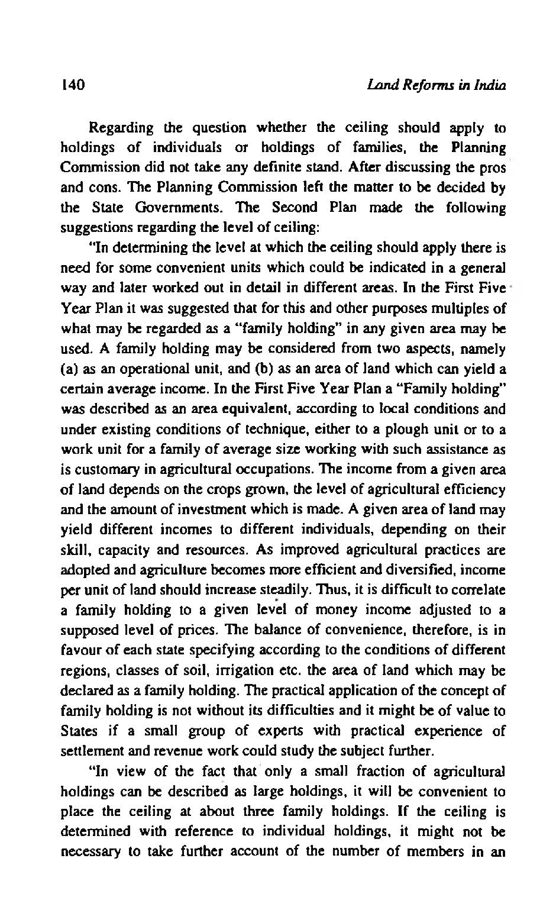

###### 140 Land Reforms in India

Regarding the question whether the ceiling should apply to holdings of individuals or holdings of families, the Planning Commission did not take any definite stand. After discussing the pros and cons. The Planning Commission left the matter to be decided by the State Governments. The Second Plan made the following suggestions regarding the level of ceiling:

“In determining the level at which the ceiling should apply there is need for some convenient units which could be indicated in a general way and later worked out in detail in different areas. In the First Five Year Plan it was suggested that for this and other purposes multiples of what may be regarded as a “family holding” in any given area may be used. A family holding may be considered from two aspects, namely (a) as an operational unit, and (b) as an area of land which can yield a certain average income. In the First Five Year Plan a “Family holding” was described as an area equivalent, according to local conditions and under existing conditions of technique, either to a plough unit or to a work unit for a family of average size working with such assistance as is customary in agricultural occupations. The income from a given area of land depends on the crops grown, the level of agricultural efficiency and the amount of investment which is made. A given area of land may yield different incomes to different individuals, depending on their skill, capacity and resources. As improved agricultural practices are adopted and agriculture becomes more efficient and diversified, income per unit of land should increase steadily. Thus, it is difficult to correlate a family holding to a given level of money income adjusted to a supposed level of prices. The balance of convenience, therefore, is in favour of each state specifying according to the conditions of different regions, classes of soil, irrigation etc. the area of land which may be declared as a family holding. The practical application of the concept of family holding is not without its difficulties and it might be of value to States if a small group of experts with practical experience of settlement and revenue work could study the subject further.

“In view of the fact that only a small fraction of agricultural holdings can be described as large holdings, it will be convenient to place the ceiling at about three family holdings. If the ceiling is determined with reference to individual holdings, it might not be necessary to take further account of the number of members in an

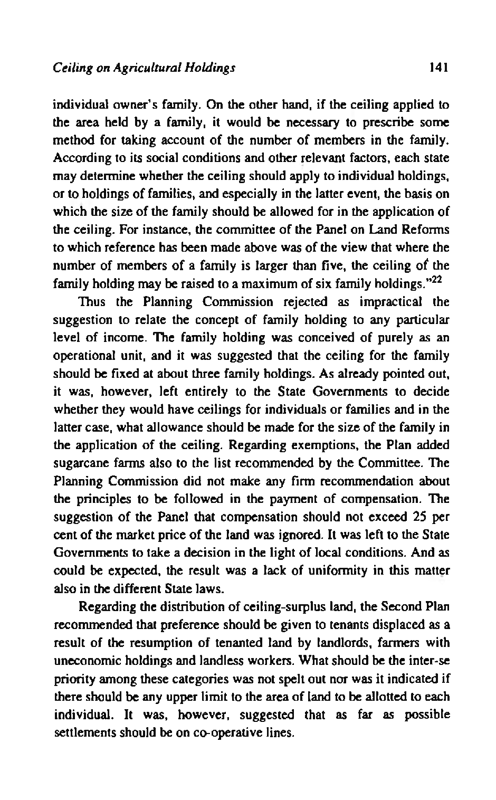

###### Ceiling on Agricultural Holdings 141

individual owner’s family. On the other hand, if the ceiling applied to the area held by a family, it would be necessary to prescribe some method for taking account of the number of members in the family. According to its social conditions and other relevant factors, each state may determine whether the ceiling should apply to individual holdings, or to holdings of families, and especially in the latter event, the basis on which the size of the family should be allowed for in the application of the ceiling. For instance, the committee of the Panel on Land Reforms to which reference has been made above was of the view that where the number of members of a family is larger than five, the ceiling o( the family holding may be raised to a maximum of six family holdings.”22

Thus the Planning Commission rejected as impractical the suggestion to relate the concept of family holding to any particular level of income. The family holding was conceived of purely as an operational unit, and it was suggested that the ceiling for the family should be fixed at about three family holdings. As already pointed out, it was, however, left entirely to the State Governments to decide whether they would have ceilings for individuals or families and in the latter case, what allowance should be made for the size of the family in the application of the ceiling. Regarding exemptions, the Plan added sugarcane farms also to the list recommended by the Committee. The Planning Commission did not make any firm recommendation about the principles to be followed in the payment of compensation. The suggestion of the Panel that compensation should not exceed 25 per cent of the market price of the land was ignored. It was left to the State Governments to take a decision in the light of local conditions. And as could be expected, the result was a lack of uniformity in this matter also in the different State laws.

Regarding the distribution of ceiling-surplus land, the Second Plan recommended that preference should be given to tenants displaced as a result of the resumption of tenanted land by landlords, farmers with uneconomic holdings and landless workers. What should be the inter-se priority among these categories was not spelt out nor was it indicated if there should be any upper limit to the area of land to be allotted to each individual. It was, however, suggested that as far as possible settlements should be on co-operative lines.

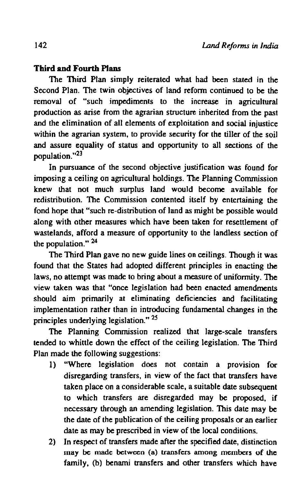

###### 142 Land Reforms in India

###### Third and Fourth Plans

The Third Plan simply reiterated what had been stated in the Second Plan. The twin objectives of land reform continued to be the removal of “such impediments to the increase in agricultural production as arise from the agrarian structure inherited from the past and the elimination of all elements of exploitation and social injustice within the agrarian system, to provide security for the tiller of the soil and assure equality of status and opportunity to all sections of the population.”23

In pursuance of the second objective justification was found for imposing a ceiling on agricultural holdings. The Planning Commission knew that not much surplus land would become available for redistribution. The Commission contented itself by entertaining the fond hope that “such re-distribution of land as might be possible would along with other measures which have been taken for resettlement of wastelands, afford a measure of opportunity to the landless section of the population.” 24

The Third Plan gave no new guide lines on ceilings. Though it was found that the States had adopted different principles in enacting the laws, no attempt was made to bring about a measure of uniformity. The view taken was that “once legislation had been enacted amendments should aim primarily at eliminating deficiencies and facilitating implementation rather than in introducing fundamental changes in the principles underlying legislation.” 25

The Planning Commission realized that large-scale transfers tended to whittle down the effect of the ceiling legislation. The Third Plan made the following suggestions:

- 1) “Where legislation does not contain a provision for disregarding transfers, in view of the fact that transfers have taken place on a considerable scale, a suitable date subsequent to which transfers are disregarded may be proposed, if necessary through an amending legislation. This date may be the date of the publication of the ceiling proposals or an earlier date as may be prescribed in view of the local conditions.
- 2) In respect of transfers made after the specified date, distinction may be made between (a) transfers among members of the family, (b) benami transfers and other transfers which have

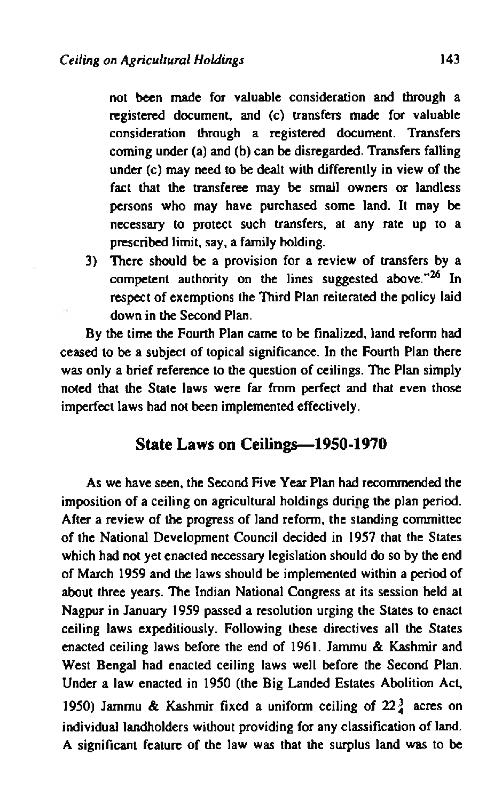

###### Ceiling on Agricultural Holdings 143

- not been made for valuable consideration and through a registered document, and (c) transfers made for valuable consideration through a registered document. Transfers coming under (a) and (b) can be disregarded. Transfers falling under (c) may need to be dealt with differently in view of the fact that the transferee may be small owners or landless persons who may have purchased some land. It may be necessary to protect such transfers, at any rate up to a prescribed limit, say, a family holding.
- 3) There should be a provision for a review of transfers by a competent authority on the lines suggested above.”26 In respect of exemptions the Third Plan reiterated the policy laid down in the Second Plan.

By the time the Fourth Plan came to be finalized, land reform had ceased to be a subject of topical significance. In the Fourth Plan there was only a brief reference to the question of ceilings. The Plan simply noted that the State laws were far from perfect and that even those imperfect laws had not been implemented effectively.

###### State Laws on Ceilings—1950-1970

As we have seen, the Second Five Year Plan had recommended the imposition of a ceiling on agricultural holdings during the plan period. After a review of the progress of land reform, the standing committee of the National Development Council decided in 1957 that the States which had not yet enacted necessary legislation should do so by the end of March 1959 and the laws should be implemented within a period of about three years. The Indian National Congress at its session held at Nagpur in January 1959 passed a resolution urging the States to enact ceiling laws expeditiously. Following these directives all the States enacted ceiling laws before the end of 1961. Jammu & Kashmir and West Bengal had enacted ceiling laws well before the Second Plan. Under a law enacted in 1950 (the Big Landed Estates Abolition Act, 1950) Jammu & Kashmir fixed a uniform ceiling of 22 J acres on individual landholders without providing for any classification of land. A significant feature of the law was that the surplus land was to be

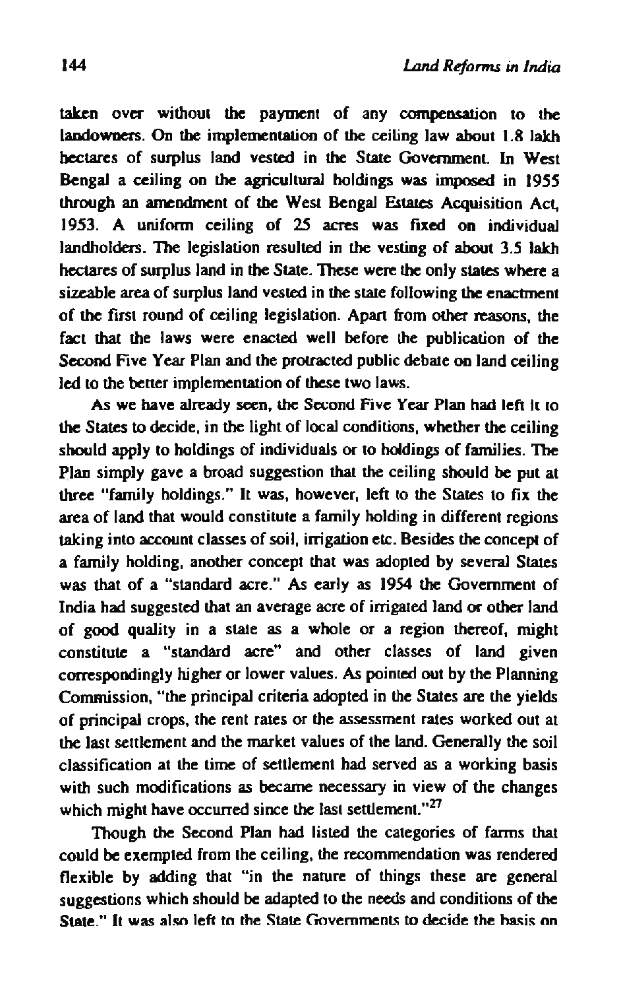

###### 144 Land Reforms in India

taken over without the payment of any compensation to the landowners. On the implementation of the ceiling law about 1.8 lakh hectares of surplus land vested in the State Government In West Bengal a ceiling on the agricultural holdings was imposed in 1955 through an amendment of the West Bengal Estates Acquisition Act, 1953. A uniform ceiling of 25 acres was fixed on individual landholders. The legislation resulted in the vesting of about 3.5 lakh hectares of surplus land in the State. These were the only states where a sizeable area of surplus land vested in the state following the enactment of the first round of ceiling legislation. Apart from other reasons, the fact that the laws were enacted well before the publication of the Second Five Year Plan and the protracted public debate on land ceiling led to the better implementation of these two laws.

As we have already seen, the Second Five Year Plan had left it to the States to decide, in the light of local conditions, whether the ceiling should apply to holdings of individuals or to holdings of families. The Plan simply gave a broad suggestion that the ceiling should be put at three “family holdings.” It was, however, left to the States to fix the area of land that would constitute a family holding in different regions taking into account classes of soil, irrigation etc. Besides the concept of a family holding, another concept that was adopted by several States was that of a “standard acre.” As early as 1954 the Government of India had suggested that an average acre of irrigated land or other land of good quality in a state as a whole or a region thereof, might constitute a “standard acre” and other classes of land given correspondingly higher or lower values. As pointed out by the Planning Commission, “the principal criteria adopted in the States are the yields of principal crops, the rent rates or the assessment rates worked out at the last settlement and the market values of the land. Generally the soil classification at the time of settlement had served as a working basis with such modifications as became necessary in view of the changes which might have occurred since the last settlement.”27

Though the Second Plan had listed the categories of farms that could be exempted from the ceiling, the recommendation was rendered flexible by adding that “in the nature of things these are general suggestions which should be adapted to the needs and conditions of the State.” It was also left to the State Governments to decide the basis on

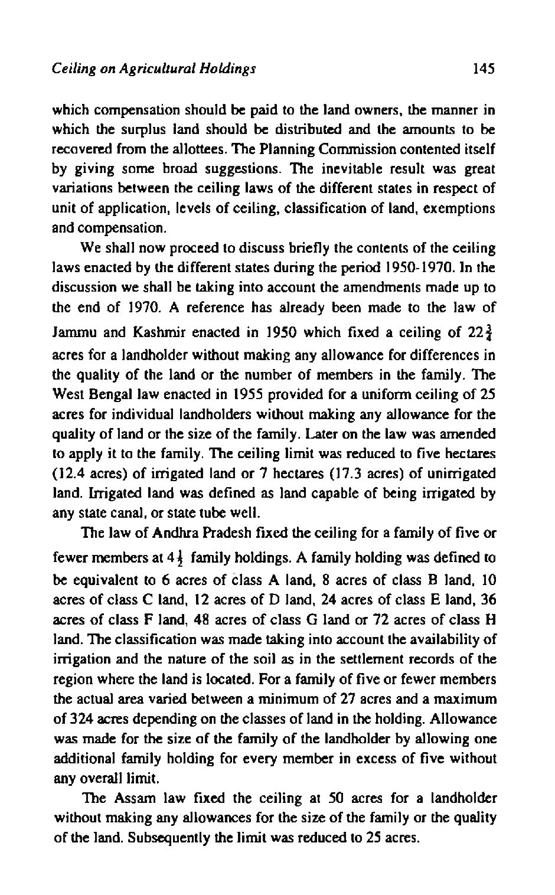

###### Ceiling on Agricultural Holdings 145

which compensation should be paid to the land owners, the manner in which the surplus land should be distributed and the amounts to be recovered from the allottees. The Planning Commission contented itself by giving some broad suggestions. The inevitable result was great variations between the ceiling laws of the different states in respect of unit of application, levels of ceiling, classification of land, exemptions and compensation.

We shall now proceed to discuss briefly the contents of the ceiling laws enacted by the different states during the period 1950-1970. In the discussion we shall be taking into account the amendments made up to the end of 1970. A reference has already been made to the law of Jammu and Kashmir enacted in 1950 which fixed a ceiling of 22 J

acres for a landholder without making any allowance for differences in the quality of the land or the number of members in the family. The West Bengal law enacted in 1955 provided for a uniform ceiling of 25 acres for individual landholders without making any allowance for the quality of land or the size of the family. Later on the law was amended to apply it to the family. The ceiling limit was reduced to five hectares (12.4 acres) of irrigated land or 7 hectares (17.3 acres) of unirrigated land. Irrigated land was defined as land capable of being irrigated by any state canal, or state tube well.

The law of Andhra Pradesh fixed the ceiling for a family of five or fewer members at 4^ family holdings. A family holding was defined to be equivalent to 6 acres of class A land, 8 acres of class B land, 10 acres of class C land, 12 acres of D land, 24 acres of class E land, 36 acres of class F land, 48 acres of class G land or 72 acres of class H land. The classification was made taking into account the availability of irrigation and the nature of the soil as in the settlement records of the region where the land is located. For a family of five or fewer members the actual area varied between a minimum of 27 acres and a maximum of 324 acres depending on the classes of land in the holding. Allowance was made for the size of the family of the landholder by allowing one additional family holding for every member in excess of five without any overall limit.

The Assam law fixed the ceiling at 50 acres for a landholder without making any allowances for the size of the family or the quality of the land. Subsequently the limit was reduced to 25 acres.

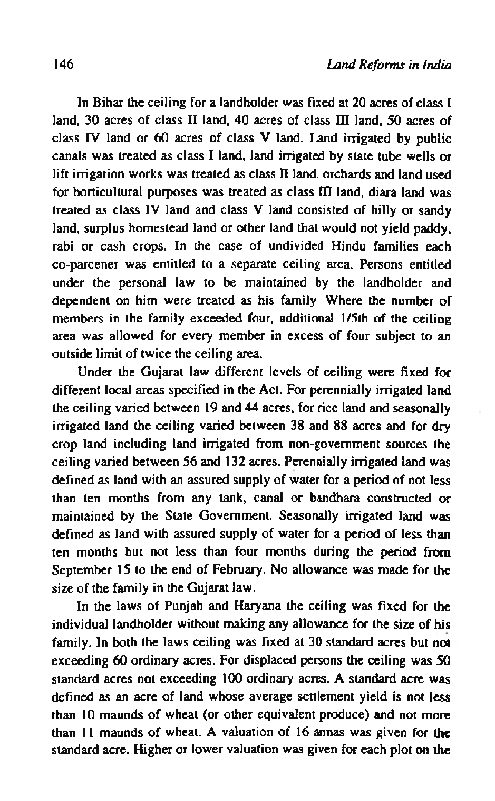

###### 146 Land Reforms in India

In Bihar the ceiling for a landholder was fixed at 20 acres of class I land, 30 acres of class II land, 40 acres of class HI land, 50 acres of class IV land or 60 acres of class V land. Land irrigated by public canals was treated as class I land, land irrigated by state tube wells or lift irrigation works was treated as class II land, orchards and land used for horticultural purposes was treated as class III land, diara land was treated as class IV land and class V land consisted of hilly or sandy land, surplus homestead land or other land that would not yield paddy, rabi or cash crops. In the case of undivided Hindu families each co-parcener was entitled to a separate ceiling area. Persons entitled under the personal law to be maintained by the landholder and dependent on him were treated as his family. Where the number of members in the family exceeded four, additional 1 /5th of the ceiling area was allowed for every member in excess of four subject to an outside limit of twice the ceiling area.

Under the Gujarat law different levels of ceiling were fixed for different local areas specified in the Act. For perennially irrigated land the ceiling varied between 19 and 44 acres, for rice land and seasonally irrigated land the ceiling varied between 38 and 88 acres and for dry crop land including land irrigated from non-government sources the ceiling varied between 56 and 132 acres. Perennially irrigated land was defined as land with an assured supply of water for a period of not less than ten months from any tank, canal or bandhara constructed or maintained by the State Government. Seasonally irrigated land was defined as land with assured supply of water for a period of less than ten months but not less than four months during the period from September 15 to the end of February. No allowance was made for the size of the family in the Gujarat law.

In the laws of Punjab and Haryana the ceiling was fixed for the individual landholder without making any allowance for the size of his family. In both the laws ceiling was fixed at 30 standard acres but not exceeding 60 ordinary acres. For displaced persons the ceiling was 50 standard acres not exceeding 100 ordinary acres. A standard acre was defined as an acre of land whose average settlement yield is not less

- than 10 maunds of wheat (or other equivalent produce) and not more
- than 11 maunds of wheat. A valuation of 16 annas was given for the standard acre. Higher or lower valuation was given for each plot on the

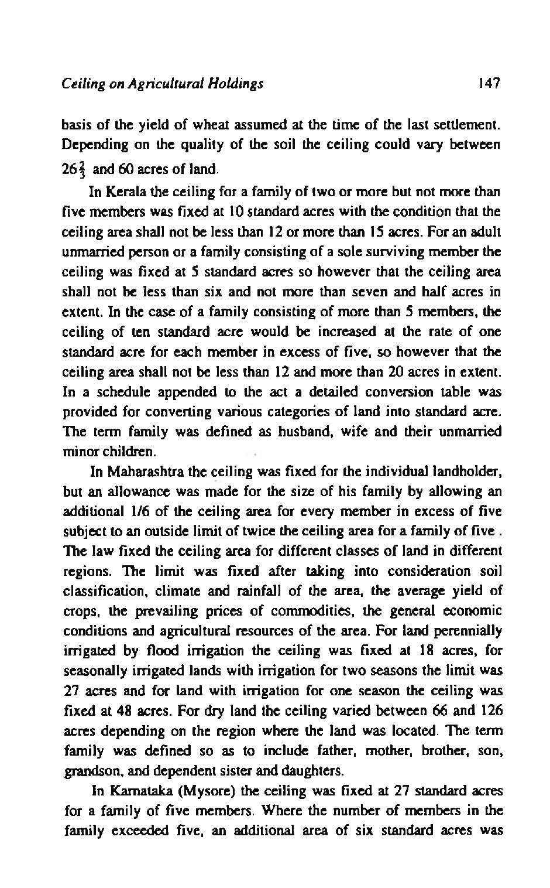

###### Ceiling on Agricultural Holdings 147

basis of the yield of wheat assumed at the time of the last settlement. Depending on the quality of the soil the ceiling could vary between

- 26^ and 60 acres of land. In Kerala the ceiling for a family of two or more but not more than

five members was fixed at 10 standard acres with the condition that the ceiling area shall not be less than 12 or more than 15 acres. For an adult unmarried person or a family consisting of a sole surviving member the ceiling was fixed at 5 standard acres so however that the ceiling area shall not be less than six and not more than seven and half acres in extent. In the case of a family consisting of more than 5 members, the ceiling of ten standard acre would be increased at the rate of one standard acre for each member in excess of five, so however that the ceiling area shall not be less than 12 and more than 20 acres in extent. In a schedule appended to the act a detailed conversion table was provided for converting various categories of land into standard acre. The term family was defined as husband, wife and their unmarried minor children.

In Maharashtra the ceiling was fixed for the individual landholder, but an allowance was made for the size of his family by allowing an additional 1/6 of the ceiling area for every member in excess of five subject to an outside limit of twice the ceiling area for a family of five . The law fixed the ceiling area for different classes of land in different regions. The limit was fixed after taking into consideration soil classification, climate and rainfall of the area, the average yield of crops, the prevailing prices of commodities, the general economic conditions and agricultural resources of the area. For land perennially irrigated by flood irrigation the ceiling was fixed at 18 acres, for seasonally irrigated lands with irrigation for two seasons the limit was

- 27 acres and for land with irrigation for one season the ceiling was fixed at 48 acres. For dry land the ceiling varied between 66 and 126 acres depending on the region where the land was located. The term family was defined so as to include father, mother, brother, son, grandson, and dependent sister and daughters.

In Karnataka (Mysore) the ceiling was fixed at 27 standard acres for a family of five members. Where the number of members in the family exceeded five, an additional area of six standard acres was

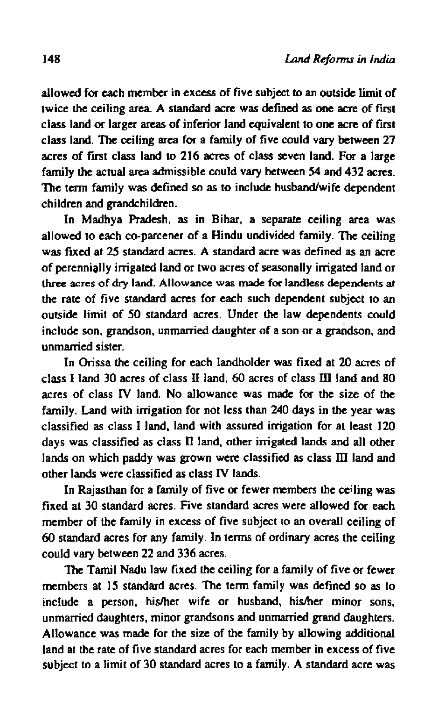

###### 148 Land Reforms in India

allowed for each member in excess of five subject to an outside limit of twice the ceiling area. A standard acre was defined as one acre of first class land or larger areas of inferior land equivalent to one acre of first class land. The ceiling area for a family of five could vary between 27 acres of first class land to 216 acres of class seven land. For a large family the actual area admissible could vary between 54 and 432 acres. The term family was defined so as to include husband/wife dependent children and grandchildren.

In Madhya Pradesh, as in Bihar, a separate ceiling area was allowed to each co-parcener of a Hindu undivided family. The ceiling was fixed at 25 standard acres. A standard acre was defined as an acre of perennially irrigated land or two acres of seasonally irrigated land or three acres of dry land. Allowance was made for landless dependents at the rate of five standard acres for each such dependent subject to an outside limit of 50 standard acres. Under the law dependents could include son, grandson, unmarried daughter of a son or a grandson, and unmarried sister.

In Orissa the ceiling for each landholder was fixed at 20 acres of class I land 30 acres of class II land, 60 acres of class III land and 80 acres of class IV land. No allowance was made for the size of the family. Land with irrigation for not less than 240 days in the year was classified as class I land, land with assured irrigation for at least 120 days was classified as class II land, other irrigated lands and all other lands on which paddy was grown were classified as class HI land and other lands were classified as class IV lands.

In Rajasthan for a family of five or fewer members the ceiling was fixed at 30 standard acres. Five standard acres were allowed for each member of the family in excess of five subject to an overall ceiling of 60 standard acres for any family. In terms of ordinary acres the ceiling could vary between 22 and 336 acres.

The Tamil Nadu law fixed the ceiling for a family of five or fewer members at 15 standard acres. The term family was defined so as to include a person, his/her wife or husband, his/her minor sons, unmarried daughters, minor grandsons and unmarried grand daughters. Allowance was made for the size of the family by allowing additional land at the rate of five standard acres for each member in excess of five subject to a limit of 30 standard acres to a family. A standard acre was

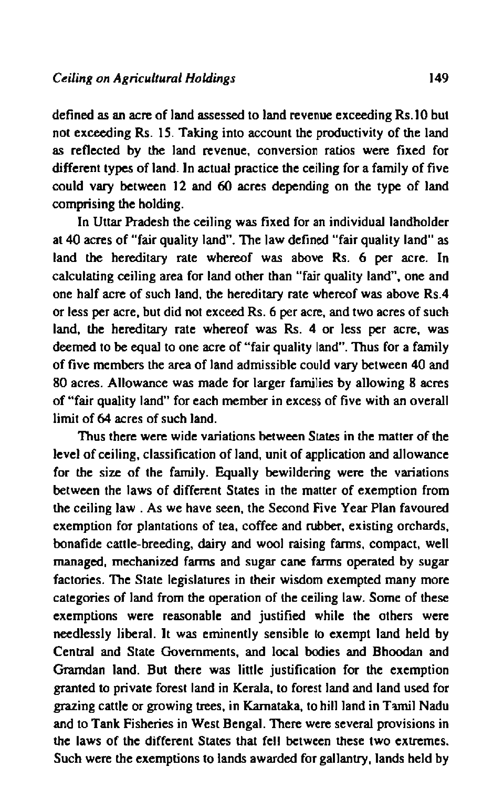

###### Ceiling on Agricultural Holdings 149

defined as an acre of land assessed to land revenue exceeding Rs.10 but not exceeding Rs. 15. Taking into account the productivity of the land

- as reflected by the land revenue, conversion ratios were fixed for different types of land. In actual practice the ceiling for a family of five could vary between 12 and 60 acres depending on the type of land comprising the holding.

In Uttar Pradesh the ceiling was fixed for an individual landholder

- at 40 acres of “fair quality land”. The law defined “fair quality land” as land the hereditary rate whereof was above Rs. 6 per acre. In calculating ceiling area for land other than “fair quality land”, one and one half acre of such land, the hereditary rate whereof was above Rs.4 or less per acre, but did not exceed Rs. 6 per acre, and two acres of such land, the hereditary rate whereof was Rs. 4 or less per acre, was deemed to be equal to one acre of “fair quality land”. Thus for a family of five members the area of land admissible could vary between 40 and 80 acres. Allowance was made for larger families by allowing 8 acres of “fair quality land” for each member in excess of five with an overall limit of 64 acres of such land.

Thus there were wide variations between States in the matter of the level of ceiling, classification of land, unit of application and allowance for the size of the family. Equally bewildering were the variations between the laws of different States in the matter of exemption from the ceiling law . As we have seen, the Second Five Year Plan favoured exemption for plantations of tea, coffee and rubber, existing orchards, bonafide cattle-breeding, dairy and wool raising farms, compact, well managed, mechanized farms and sugar cane farms operated by sugar factories. The State legislatures in their wisdom exempted many more categories of land from the operation of the ceiling law. Some of these exemptions were reasonable and justified while the others were needlessly liberal. It was eminently sensible to exempt land held by Central and State Governments, and local bodies and Bhoodan and Gramdan land. But there was little justification for the exemption granted to private forest land in Kerala, to forest land and land used for grazing cattle or growing trees, in Karnataka, to hill land in Tamil Nadu and to Tank Fisheries in West Bengal. There were several provisions in the laws of the different States that fell between these two extremes. Such were the exemptions to lands awarded for gallantry, lands held by

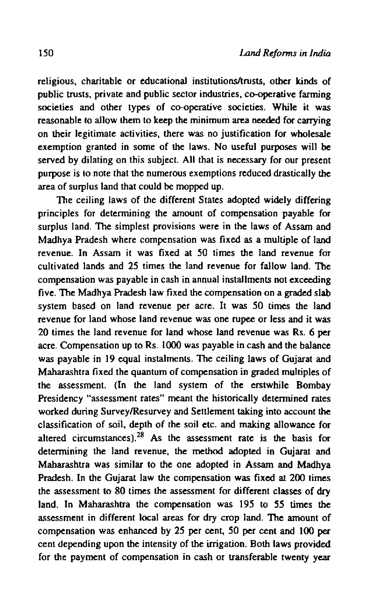

###### 150 Land Reforms in India

religious, charitable or educational institutions/trusts, other kinds of public trusts, private and public sector industries, co-operative farming societies and other types of co-operative societies. While it was reasonable to allow them to keep the minimum area needed for carrying on their legitimate activities, there was no justification for wholesale exemption granted in some of the laws. No useful purposes will be served by dilating on this subject. All that is necessary for our present purpose is to note that the numerous exemptions reduced drastically the area of surplus land that could be mopped up.

The ceiling laws of the different States adopted widely differing principles for determining the amount of compensation payable for surplus land. The simplest provisions were in the laws of Assam and Madhya Pradesh where compensation was fixed as a multiple of land revenue. In Assam it was fixed at 50 times the land revenue for cultivated lands and 25 times the land revenue for fallow land. The compensation was payable in cash in annual installments not exceeding five. The Madhya Pradesh law fixed the compensation on a graded slab system based on land revenue per acre. It was 50 times the land revenue for land whose land revenue was one rupee or less and it was 20 times the land revenue for land whose land revenue was Rs. 6 per acre. Compensation up to Rs. 1000 was payable in cash and the balance was payable in 19 equal instalments. The ceiling laws of Gujarat and Maharashtra fixed the quantum of compensation in graded multiples of the assessment. (In the land system of the erstwhile Bombay Presidency “assessment rates” meant the historically determined rates worked during Survey/Resurvey and Settlement taking into account the classification of soil, depth of the soil etc. and making allowance for altered circumstances).28 As the assessment rate is the basis for determining the land revenue, the method adopted in Gujarat and Maharashtra was similar to the one adopted in Assam and Madhya Pradesh. In the Gujarat law the compensation was fixed at 200 times the assessment to 80 times the assessment for different classes of dry land. In Maharashtra the compensation was 195 to 55 times the assessment in different local areas for dry crop land. The amount of compensation was enhanced by 25 per cent, 50 per cent and 100 per cent depending upon the intensity of the irrigation. Both laws provided for the payment of compensation in cash or transferable twenty year

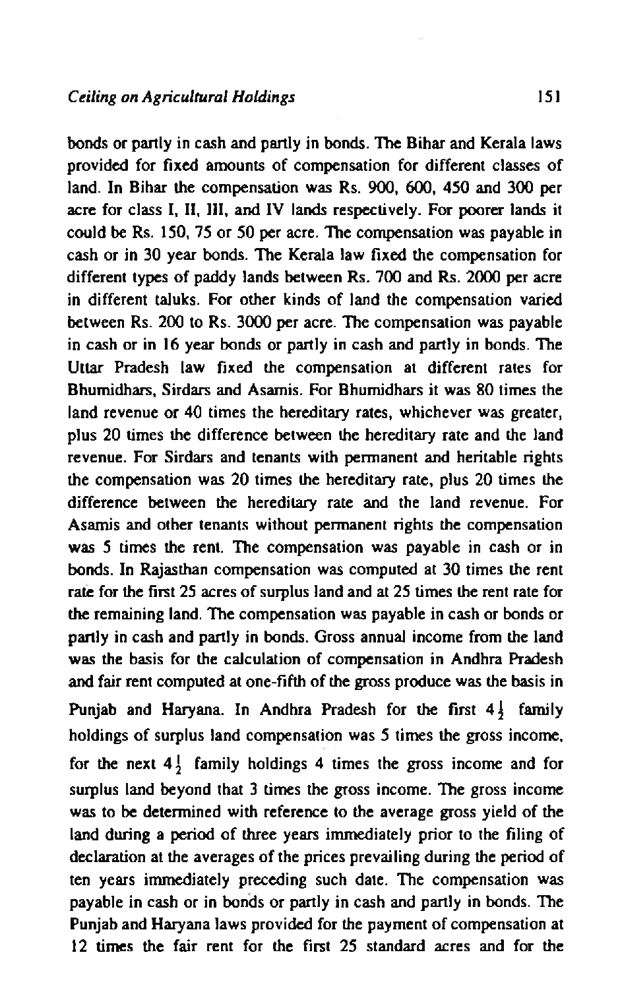

###### Ceiling on Agricultural Holdings 151

bonds or partly in cash and partly in bonds. The Bihar and Kerala laws provided for fixed amounts of compensation for different classes of land. In Bihar the compensation was Rs. 900, 600, 450 and 300 per acre for class I, II, III, and IV lands respectively. For poorer lands it could be Rs. 150, 75 or 50 per acre. The compensation was payable in cash or in 30 year bonds. The Kerala law fixed the compensation for different types of paddy lands between Rs. 700 and Rs. 2000 per acre in different taluks. For other kinds of land the compensation varied between Rs. 200 to Rs. 3000 per acre. The compensation was payable in cash or in 16 year bonds or partly in cash and partly in bonds. The Uttar Pradesh law fixed the compensation at different rates for Bhumidhars, Sirdars and Asamis. For Bhumidhars it was 80 times the land revenue or 40 times the hereditary rates, whichever was greater, plus 20 times the difference between the hereditary rate and the land revenue. For Sirdars and tenants with permanent and heritable rights the compensation was 20 times the hereditary rate, plus 20 times the difference between the hereditary rate and the land revenue. For Asamis and other tenants without permanent rights the compensation was 5 times the rent. The compensation was payable in cash or in bonds. In Rajasthan compensation was computed at 30 times the rent rate for the first 25 acres of surplus land and at 25 times the rent rate for the remaining land. The compensation was payable in cash or bonds or partly in cash and partly in bonds. Gross annual income from the land was the basis for the calculation of compensation in Andhra Pradesh and fair rent computed at one-fifth of the gross produce was the basis in Punjab and Haryana. In Andhra Pradesh for the first 4\ family holdings of surplus land compensation was 5 times the gross income, for the next 4 j family holdings 4 times the gross income and for surplus land beyond that 3 times the gross income. The gross income was to be determined with reference to the average gross yield of the land during a period of three years immediately prior to the filing of declaration at the averages of the prices prevailing during the period of ten years immediately preceding such date. The compensation was payable in cash or in bonds or partly in cash and partly in bonds. The Punjab and Haryana laws provided for the payment of compensation at 12 times the fair rent for the first 25 standard acres and for the

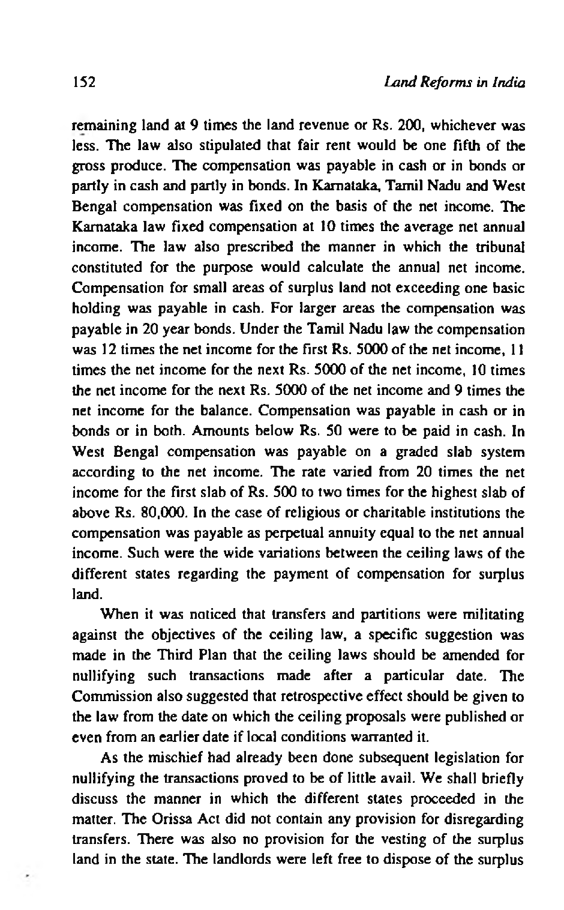

###### 152 Land Reforms in India

remaining land at 9 times the land revenue or Rs. 200, whichever was less. The law also stipulated that fair rent would be one fifth of the gross produce. The compensation was payable in cash or in bonds or partly in cash and partly in bonds. In Karnataka, Tamil Nadu and West Bengal compensation was fixed on the basis of the net income. The Karnataka law fixed compensation at 10 times the average net annual income. The law also prescribed the manner in which the tribunal constituted for the purpose would calculate the annual net income. Compensation for small areas of surplus land not exceeding one basic holding was payable in cash. For larger areas the compensation was payable in 20 year bonds. Under the Tamil Nadu law the compensation was 12 times the net income for the first Rs. 5000 of the net income, 11 times the net income for the next Rs. 5000 of the net income, 10 times the net income for the next Rs. 5000 of the net income and 9 times the net income for the balance. Compensation was payable in cash or in bonds or in both. Amounts below Rs. 50 were to be paid in cash. In West Bengal compensation was payable on a graded slab system according to the net income. The rate varied from 20 times the net income for the first slab of Rs. 500 to two times for the highest slab of above Rs. 80,000. In the case of religious or charitable institutions the compensation was payable as perpetual annuity equal to the net annual income. Such were the wide variations between the ceiling laws of the different states regarding the payment of compensation for surplus land.

When it was noticed that transfers and partitions were militating against the objectives of the ceiling law, a specific suggestion was made in the Third Plan that the ceiling laws should be amended for nullifying such transactions made after a particular date. The Commission also suggested that retrospective effect should be given to the law from the date on which the ceiling proposals were published or even from an earlier date if local conditions warranted it.

As the mischief had already been done subsequent legislation for nullifying the transactions proved to be of little avail. We shall briefly discuss the manner in which the different states proceeded in the matter. The Orissa Act did not contain any provision for disregarding transfers. There was also no provision for the vesting of the surplus land in the state. The landlords were left free to dispose of the surplus

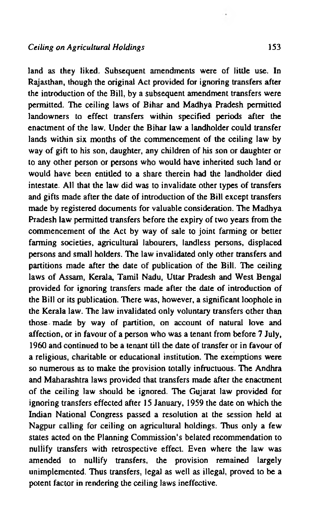

###### Ceiling on Agricultural Holdings 153

land as they liked. Subsequent amendments were of little use. In Rajasthan, though the original Act provided for ignoring transfers after the introduction of the Bill, by a subsequent amendment transfers were permitted. The ceiling laws of Bihar and Madhya Pradesh permitted landowners to effect transfers within specified periods after the enactment of the law. Under the Bihar law a landholder could transfer lands within six months of the commencement of the ceiling law by way of gift to his son, daughter, any children of his son or daughter or to any other person or persons who would have inherited such land or would have been entitled to a share therein had the landholder died intestate. All that the law did was to invalidate other types of transfers and gifts made after the date of introduction of the Bill except transfers made by registered documents for valuable consideration. The Madhya Pradesh law permitted transfers before the expiry of two years from the commencement of the Act by way of sale to joint farming or better farming societies, agricultural labourers, landless persons, displaced persons and small holders. The law invalidated only other transfers and partitions made after the date of publication of the Bill. The ceiling laws of Assam, Kerala, Tamil Nadu, Uttar Pradesh and West Bengal provided for ignoring transfers made after the date of introduction of the Bill or its publication. There was, however, a significant loophole in the Kerala law. The law invalidated only voluntary transfers other than those made by way of partition, on account of natural love and affection, or in favour of a person who was a tenant from before 7 July, 1960 and continued to be a tenant till the date of transfer or in favour of a religious, charitable or educational institution. The exemptions were so numerous as to make the provision totally infructuous. The Andhra and Maharashtra laws provided that transfers made after the enactment of the ceiling law should be ignored. The Gujarat law provided for ignoring transfers effected after 15 January, 1959 the date on which the Indian National Congress passed a resolution at the session held at Nagpur calling for ceiling on agricultural holdings. Thus only a few states acted on the Planning Commission’s belated recommendation to nuliify transfers with retrospective effect. Even where the law was amended to nullify transfers, the provision remained largely unimplemented. Thus transfers, legal as well as illegal, proved to be a potent factor in rendering the ceiling laws ineffective.

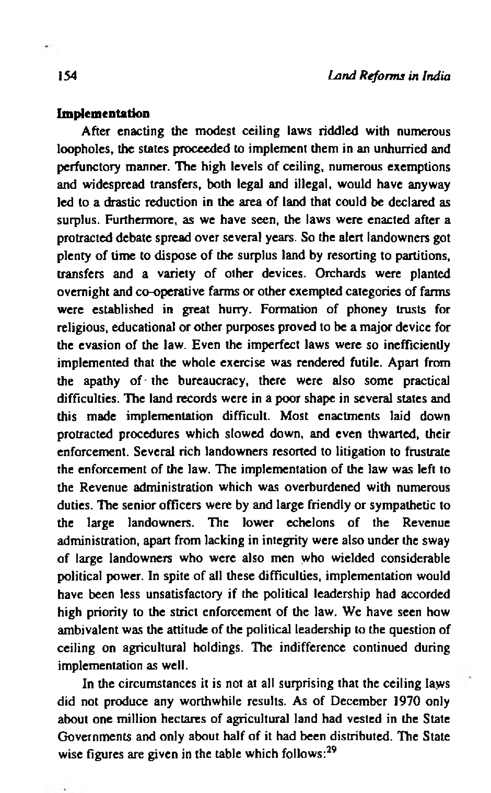

###### 154 Land Reforms in India

###### Implementation

After enacting the modest ceiling laws riddled with numerous loopholes, the states proceeded to implement them in an unhurried and perfunctory manner. The high levels of ceiling, numerous exemptions and widespread transfers, both legal and illegal, would have anyway led to a drastic reduction in the area of land that could be declared as surplus. Furthermore, as we have seen, the laws were enacted after a protracted debate spread over several years. So the alert landowners got plenty of time to dispose of the surplus land by resorting to partitions, transfers and a variety of other devices. Orchards were planted overnight and co-operative farms or other exempted categories of farms were established in great hurry. Formation of phoney trusts for religious, educational or other purposes proved to be a major device for the evasion of the law. Even the imperfect laws were so inefficiently implemented that the whole exercise was rendered futile. Apart from the apathy of' the bureaucracy, there were also some practical difficulties. The land records were in a poor shape in several states and this made implementation difficult. Most enactments laid down protracted procedures which slowed down, and even thwarted, their enforcement. Several rich landowners resorted to litigation to frustrate the enforcement of the law. The implementation of the law was left to the Revenue administration which was overburdened with numerous duties. The senior officers were by and large friendly or sympathetic to the large landowners. The lower echelons of the Revenue administration, apart from lacking in integrity were also under the sway of large landowners who were also men who wielded considerable political power. In spite of all these difficulties, implementation would have been less unsatisfactory if the political leadership had accorded high priority to the strict enforcement of the law. We have seen how ambivalent was the attitude of the political leadership to the question of ceiling on agricultural holdings. The indifference continued during implementation as well.

In the circumstances it is not at all surprising that the ceiling laws did not produce any worthwhile results. As of December 1970 only about one million hectares of agricultural land had vested in the State Governments and only about half of it had been distributed. The State wise figures are given in the table which follows:29

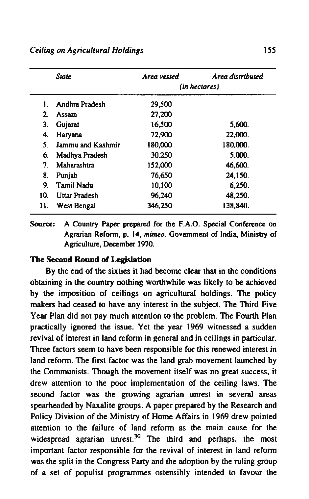

###### Ceiling on Agricultural Holdings 155

State Area vested Area distributed (in hectares)

- 1. Andhra Pradesh 29,500
- 2. Assam 27,200
- 3. Gujarat 16,500 5,600.
- 4. Haryana 72,900 22,000.
- 5. Jammu and Kashmir 180,000 180,000.
- 6. Madhya Pradesh 30,250 5,000.
- 7. Maharashtra 152,000 46,600.
- 8. Punjab 76,650 24,150.
- 9. Tamil Nadu 10,100 6,250.
- 10. Uttar Pradesh 96,240 48,250.
- 11. West Bengal 346,250 138,840.

Source: A Country Paper prepared for the F.A.O. Special Conference on Agrarian Reform, p. 14, mimeo, Government of India, Ministry of Agriculture, December 1970.

###### The Second Round of Legislation

By the end of the sixties it had become clear that in the conditions obtaining in the country nothing worthwhile was likely to be achieved by the imposition of ceilings on agricultural holdings. The policy makers had ceased to have any interest in the subject. The Third Five Year Plan did not pay much attention to the problem. The Fourth Plan practically ignored the issue. Yet the year 1969 witnessed a sudden revival of interest in land reform in general and in ceilings in particular. Three factors seem to have been responsible for this renewed interest in land reform. The first factor was the land grab movement launched by the Communists. Though the movement itself was no great success, it drew attention to the poor implementation of the ceiling laws. The second factor was the growing agrarian unrest in several areas spearheaded by Naxalite groups. A paper prepared by the Research and Policy Division of the Ministry of Home Affairs in 1969 drew pointed attention to the failure of land reform as the main cause for the widespread agrarian unrest.30 The third and perhaps, the most important factor responsible for the revival of interest in land reform was the split in the Congress Party and the adoption by the ruling group of a set of populist programmes ostensibly intended to favour the

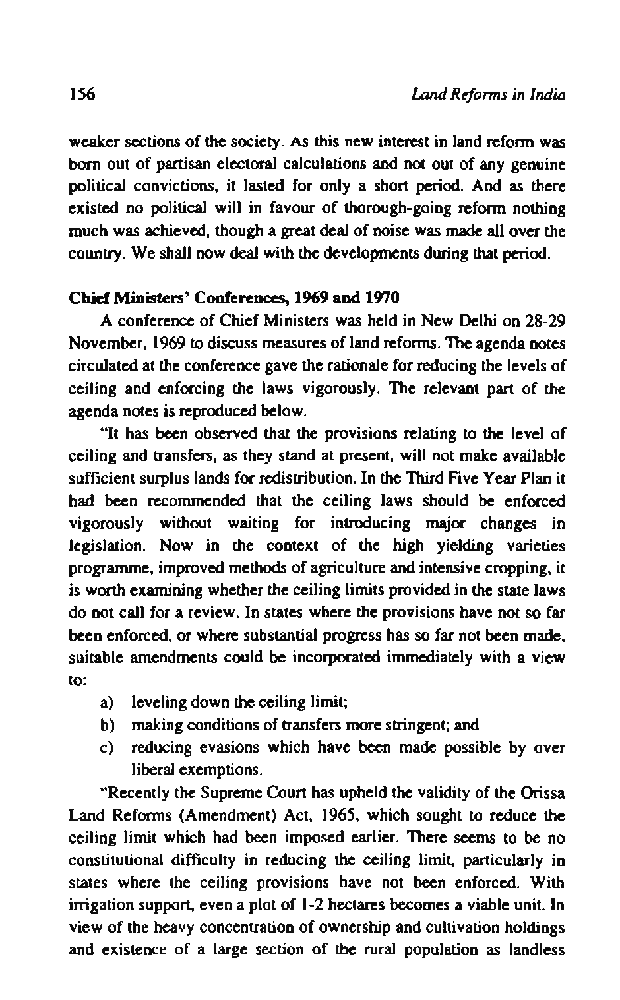

###### 156 Land Reforms in India

weaker sections of the society, a s this new interest in land reform was bom out of partisan electoral calculations and not out of any genuine political convictions, it lasted for only a short period. And as there existed no political will in favour of thorough-going reform nothing much was achieved, though a great deal of noise was made all over the country. We shall now deal with the developments during that period.

###### Chief Ministers’ Conferences, 1969 and 1970

A conference of Chief Ministers was held in New Delhi on 28-29 November, 1969 to discuss measures of land reforms. The agenda notes circulated at the conference gave the rationale for reducing the levels of ceiling and enforcing the laws vigorously. The relevant part of the agenda notes is reproduced below.

“It has been observed that the provisions relating to the level of ceiling and transfers, as they stand at present, will not make available sufficient surplus lands for redistribution. In the Third Five Year Plan it had been recommended that the ceiling laws should be enforced vigorously without waiting for introducing major changes in legislation. Now in the context of the high yielding varieties programme, improved methods of agriculture and intensive cropping, it is worth examining whether the ceiling limits provided in the state laws do not call for a review. In states where the provisions have not so far been enforced, or where substantial progress has so far not been made, suitable amendments could be incorporated immediately with a view to:

- a) leveling down the ceiling limit;
- b) making conditions of transfers more stringent; and
- c) reducing evasions which have been made possible by over liberal exemptions.

“Recently the Supreme Court has upheld the validity of the Orissa Land Reforms (Amendment) Act, 1965, which sought to reduce the ceiling limit which had been imposed earlier. There seems to be no constitutional difficulty in reducing the ceiling limit, particularly in states where the ceiling provisions have not been enforced. With irrigation support, even a plot of 1-2 hectares becomes a viable unit. In view of the heavy concentration of ownership and cultivation holdings and existence of a large section of the rural population as landless

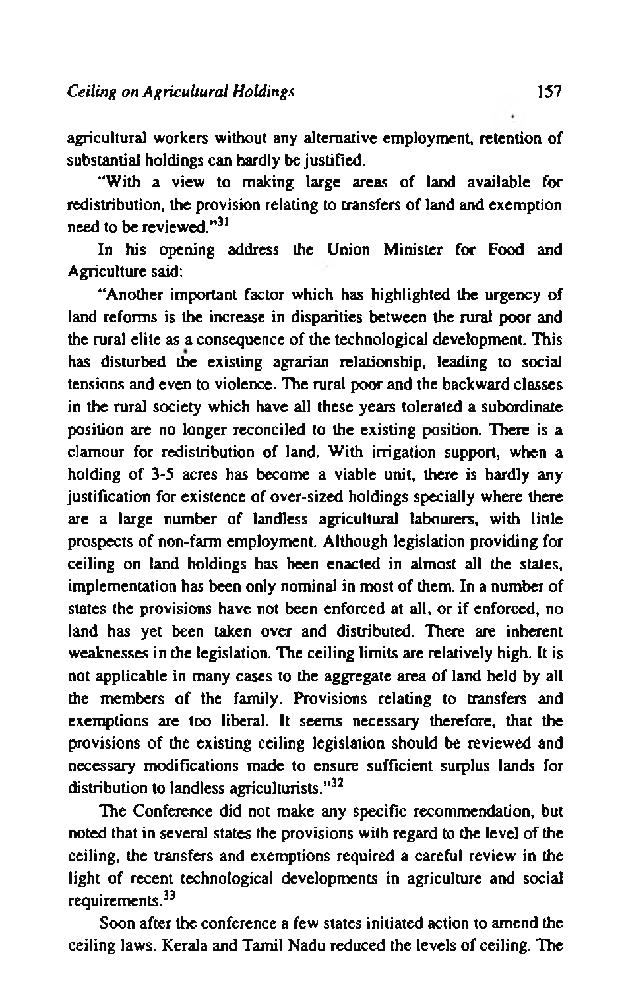

###### Ceiling on Agricultural Holdings 157

agricultural workers without any alternative employment, retention of substantial holdings can hardly be justified.

“With a view to making large areas of land available for redistribution, the provision relating to transfers of land and exemption need to be reviewed.”31

In his opening address the Union Minister for Food and Agriculture said:

“Another important factor which has highlighted the urgency of land reforms is the increase in disparities between the rural poor and the rural elite as a consequence of the technological development. This has disturbed the existing agrarian relationship, leading to social tensions and even to violence. The rural poor and the backward classes in the rural society which have all these years tolerated a subordinate position are no longer reconciled to the existing position. There is a clamour for redistribution of land. With irrigation support, when a holding of 3-5 acres has become a viable unit, there is hardly any justification for existence of over-sized holdings specially where there are a large number of landless agricultural labourers, with little prospects of non-farm employment. Although legislation providing for ceiling on land holdings has been enacted in almost all the states, implementation has been only nominal in most of them. In a number of states the provisions have not been enforced at all, or if enforced, no land has yet been taken over and distributed. There are inherent weaknesses in the legislation. The ceiling limits are relatively high. It is not applicable in many cases to the aggregate area of land held by all the members of the family. Provisions relating to transfers and exemptions are too liberal. It seems necessary therefore, that the provisions of the existing ceiling legislation should be reviewed and necessary modifications made to ensure sufficient surplus lands for distribution to landless agriculturists.”32

The Conference did not make any specific recommendation, but noted that in several states the provisions with regard to the level of the ceiling, the transfers and exemptions required a careful review in the light of recent technological developments in agriculture and social requirements.33

Soon after the conference a few states initiated action to amend the ceiling laws. Kerala and Tamil Nadu reduced the levels of ceiling. The

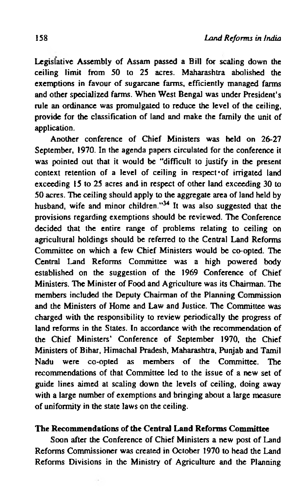

###### 158 Land Reforms in India

Legislative Assembly of Assam passed a Bill for scaling down the ceiling limit from 50 to 25 acres. Maharashtra abolished the exemptions in favour of sugarcane farms, efficiently managed farms and other specialized farms. When West Bengal was under President’s rule an ordinance was promulgated to reduce the level of the ceiling, provide for the classification of land and make the family the unit of application.

Another conference of Chief Ministers was held on 26-27 September, 1970. In the agenda papers circulated for the conference it was pointed out that it would be “difficult to justify in the present context retention of a level of ceiling in respect*of irrigated land exceeding 15 to 25 acres and in respect of other land exceeding 30 to 50 acres. The ceiling should apply to the aggregate area of land held by husband, wife and minor children.’*34 It was also suggested that the provisions regarding exemptions should be reviewed. The Conference decided that the entire range of problems relating to ceiling on agricultural holdings should be referred to the Central Land Reforms Committee on which a few Chief Ministers would be co-opted. The Central Land Reforms Committee was a high powered body established on the suggestion of the 1969 Conference of Chief Ministers. The Minister of Food and Agriculture was its Chairman. The members included the Deputy Chairman of the Planning Commission and the Ministers of Home and Law and Justice. The Committee was charged with the responsibility to review periodically the progress of land reforms in the States. In accordance with the recommendation of the Chief Ministers’ Conference of September 1970, the Chief Ministers of Bihar, Himachal Pradesh, Maharashtra, Punjab and Tamil Nadu were co-opted as members of the Committee. The recommendations of that Committee led to the issue of a new set of guide lines aimed at scaling down the levels of ceiling, doing away with a large number of exemptions and bringing about a large measure of uniformity in the state laws on the ceiling.

###### The Recommendations of the Central Land Reforms Committee

Soon after the Conference of Chief Ministers a new post of Land Reforms Commissioner was created in October 1970 to head the Land Reforms Divisions in the Ministry of Agriculture and the Planning

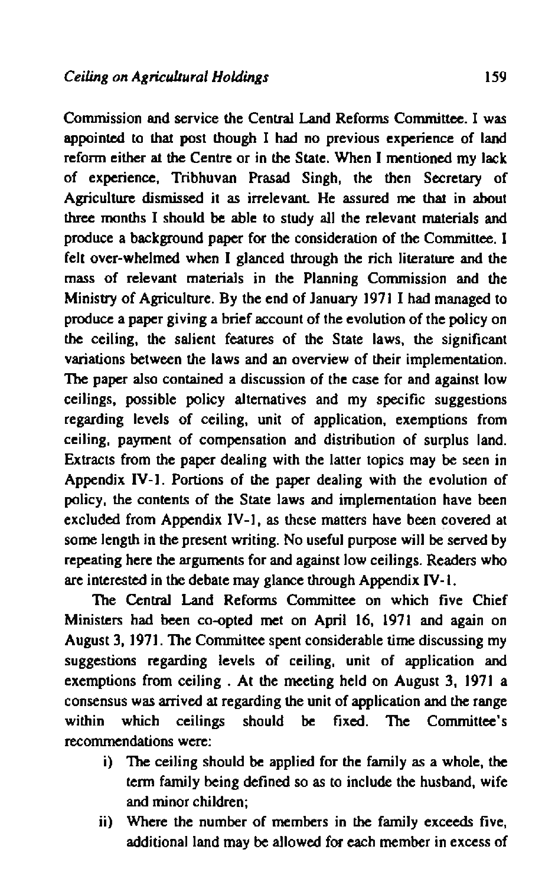

###### Ceiling on Agricultural Holdings 159

Commission and service the Central Land Reforms Committee. I was appointed to that post though I had no previous experience of land reform either at the Centre or in the State. When I mentioned my lack of experience, Tribhuvan Prasad Singh, the then Secretary of Agriculture dismissed it as irrelevant. He assured me that in about three months I should be able to study all the relevant materials and produce a background paper for the consideration of the Committee. I felt over-whelmed when I glanced through the rich literature and the mass of relevant materials in the Planning Commission and the Ministry of Agriculture. By the end of January 1971 I had managed to produce a paper giving a brief account of the evolution of the policy on the ceiling, the salient features of the State laws, the significant variations between the laws and an overview of their implementation. The paper also contained a discussion of the case for and against low ceilings, possible policy alternatives and my specific suggestions regarding levels of ceiling, unit of application, exemptions from ceiling, payment of compensation and distribution of surplus land. Extracts from the paper dealing with the latter topics may be seen in Appendix IV-1. Portions of the paper dealing with the evolution of policy, the contents of the State laws and implementation have been excluded from Appendix IV-1, as these matters have been covered at some length in the present writing. No useful purpose will be served by repeating here the arguments for and against low ceilings. Readers who are interested in the debate may glance through Appendix IV-1.

The Central Land Reforms Committee on which five Chief Ministers had been co-opted met on April 16, 1971 and again on August 3, 1971. The Committee spent considerable time discussing my suggestions regarding levels of ceiling, unit of application and exemptions from ceiling . At the meeting held on August 3, 1971 a consensus was arrived at regarding the unit of application and the range within which ceilings should be fixed. The Committee’s recommendations were:

- i) The ceiling should be applied for the family as a whole, the term family being defined so as to include the husband, wife and minor children;
- ii) Where the number of members in the family exceeds five, additional land may be allowed for each member in excess of

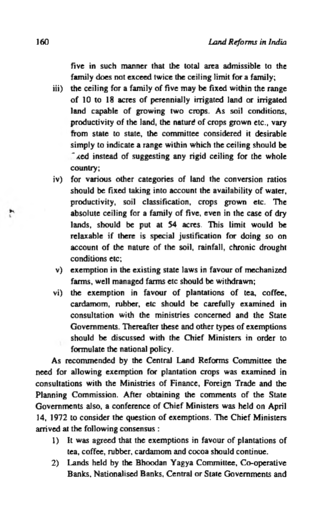

###### 160 Land Reforms in India

- five in such manner that the total area admissible to the family does not exceed twice the ceiling limit for a family;
- iii) the ceiling for a family of five may be fixed within the range of 10 to 18 acres of perennially irrigated land or irrigated land capable of growing two crops. As soil conditions, productivity of the land, the naturd of crops grown etc., vary from state to state, the committee considered it desirable simply to indicate a range within which the ceiling should be ~xed instead of suggesting any rigid ceiling for the whole country;
- iv) for various other categories of land the conversion ratios should be fixed taking into account the availability of water, productivity, soil classification, crops grown etc. The absolute ceiling for a family of five, even in the case of dry lands, should be put at 54 acres. This limit would be relaxable if there is special justification for doing so on account of the nature of the soil, rainfall, chronic drought conditions etc;
- v) exemption in the existing state laws in favour of mechanized farms, well managed farms etc should be withdrawn;
- vi) the exemption in favour of plantations of tea, coffee, cardamom, rubber, etc should be carefully examined in consultation with the ministries concerned and the State Governments. Thereafter these and other types of exemptions should be discussed with the Chief Ministers in order to formulate the national policy.

As recommended by the Central Land Reforms Committee the need for allowing exemption for plantation crops was examined in consultations with the Ministries of Finance, Foreign Trade and the Planning Commission. After obtaining the comments of the State Governments also, a conference of Chief Ministers was held on April 14, 1972 to consider the question of exemptions. The Chief Ministers arrived at the following consensus :

- 1) It was agreed that the exemptions in favour of plantations of tea, coffee, rubber, cardamom and cocoa should continue.
- 2) Lands held by the Bhoodan Yagya Committee, Co-operative Banks, Nationalised Banks, Central or State Governments and

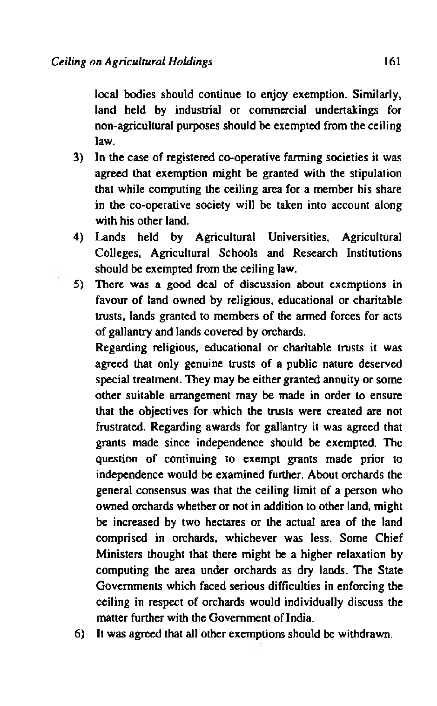

###### Ceiling on Agricultural Holdings 161

- local bodies should continue to enjoy exemption. Similarly, land held by industrial or commercial undertakings for non-agricultural purposes should be exempted from the ceiling law.
- 3) In the case of registered co-operative farming societies it was agreed that exemption might be granted with the stipulation that while computing the ceiling area for a member his share in the co-operative society will be taken into account along with his other land.
- 4) Lands held by Agricultural Universities, Agricultural Colleges, Agricultural Schools and Research Institutions should be exempted from the ceiling law.
- 5) There was a good deeil of discussion about exemptions in favour of land owned by religious, educational or charitable trusts, lands granted to members of the armed forces for acts of gallantry and lands covered by orchards. Regarding religious, educational or charitable trusts it was agreed that only genuine trusts of a public nature deserved special treatment. They may be either granted annuity or some other suitable arrangement may be made in order to ensure that the objectives for which the trusts were created are not frustrated. Regarding awards for gallantry it was agreed that grants made since independence should be exempted. The question of continuing to exempt grants made prior to independence would be examined further. About orchards the general consensus was that the ceiling limit of a person who owned orchards whether or not in addition to other land, might be increased by two hectares or the actual area of the land comprised in orchards, whichever was less. Some Chief Ministers thought that there might be a higher relaxation by computing the area under orchards as dry lands. The State Governments which faced serious difficulties in enforcing the ceiling in respect of orchards would individually discuss the matter further with the Government of India.
- 6) It was agreed that all other exemptions should be withdrawn.

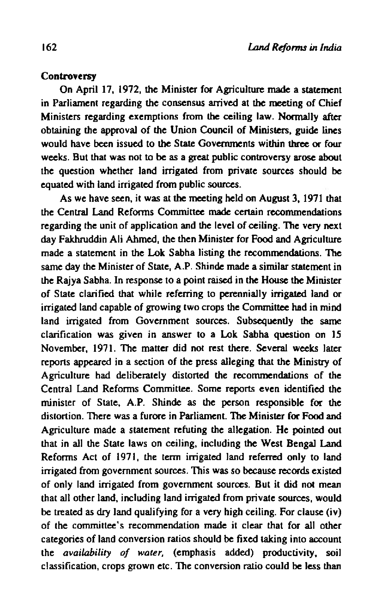

###### 162 Land Reforms in India

###### Controversy

On April 17, 1972, the Minister for Agriculture made a statement in Parliament regarding the consensus arrived at the meeting of Chief Ministers regarding exemptions from the ceiling law. Normally after obtaining the approval of the Union Council of Ministers, guide lines would have been issued to the State Governments within three or four weeks. But that was not to be as a great public controversy arose about the question whether land irrigated from private sources should be equated with land irrigated from public sources.

As we have seen, it was at the meeting held on August 3, 1971 that the Central Land Reforms Committee made certain recommendations regarding the unit of application and the level of ceiling. The very next day Fakhruddin Ali Ahmed, the then Minister for Food and Agriculture made a statement in the Lok Sabha listing the recommendations. The same day the Minister of State, A.P. Shinde made a similar statement in the Rajya Sabha. In response to a point raised in the House the Minister of State clarified that while referring to perennially irrigated land or irrigated land capable of growing two crops the Committee had in mind land irrigated from Government sources. Subsequently the same clarification was given in answer to a Lok Sabha question on 15 November, 1971. The matter did not rest there. Several weeks later reports appeared in a section of the press alleging that the Ministry of Agriculture had deliberately distorted the recommendations of the Central Land Reforms Committee. Some reports even identified the minister of State, A.P. Shinde as the person responsible for the distortion. There was a furore in Parliament. The Minister for Food and Agriculture made a statement refuting the allegation. He pointed out that in all the State laws on ceiling, including the West Bengal Land Reforms Act of 1971, the term irrigated land referred only to land irrigated from government sources. This was so because records existed of only land irrigated from government sources. But it did not mean that all other land, including land irrigated from private sources, would be treated as dry land qualifying for a very high ceiling. For clause (iv) of the committee’s recommendation made it clear that for all other categories of land conversion ratios should be fixed taking into account the availability of water, (emphasis added) productivity, soil classification, crops grown etc. The conversion ratio could be less than

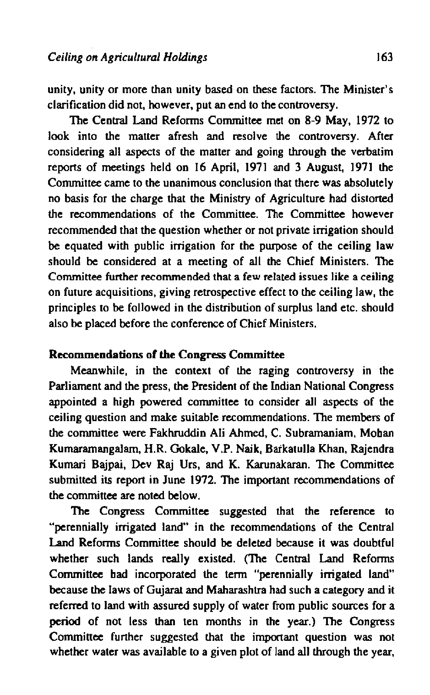

###### Ceiling on Agricultural Holdings 163

unity, unity or more than unity based on these factors. The Minister’s clarification did not, however, put an end to the controversy.

The Central Land Reforms Committee met on 8-9 May, 1972 to look into the matter afresh and resolve the controversy. After considering all aspects of the matter and going through the verbatim reports of meetings held on 16 April, 1971 and 3 August, 1971 the Committee came to the unanimous conclusion that there was absolutely no basis for the charge that the Ministry of Agriculture had distorted the recommendations of the Committee. The Committee however recommended that the question whether or not private irrigation should be equated with public irrigation for the purpose of the ceiling law should be considered at a meeting of all the Chief Ministers. The

Committee further recommended that a few related issues like a ceiling

on future acquisitions, giving retrospective effect to the ceiling law, the principles to be followed in the distribution of surplus land etc. should also be placed before the conference of Chief Ministers.

###### Recommendations of the Congress Committee

Meanwhile, in the context of the raging controversy in the Parliament and the press, the President of the Indian National Congress appointed a high powered committee to consider all aspects of the ceiling question and make suitable recommendations. The members of the committee were Fakhruddin Ali Ahmed, C. Subramaniam, Mohan Kumaramangalam, H.R. Gokale, V.P. Naik, Bafkatulla Khan, Rajendra Kumari Bajpai, Dev Raj Urs, and K. Karunakaran. The Committee submitted its report in June 1972. The important recommendations of the committee are noted below.

The Congress Committee suggested that the reference to “perennially irrigated land” in the recommendations of the Central Land Reforms Committee should be deleted because it was doubtful whether such lands really existed. (The Central Land Reforms Committee had incorporated the term “perennially irrigated land” because the laws of Gujarat and Maharashtra had such a category and it referred to land with assured supply of water from public sources for a period of not less than ten months in the year.) The Congress Committee further suggested that the important question was not whether water was available to a given plot of land all through the year,

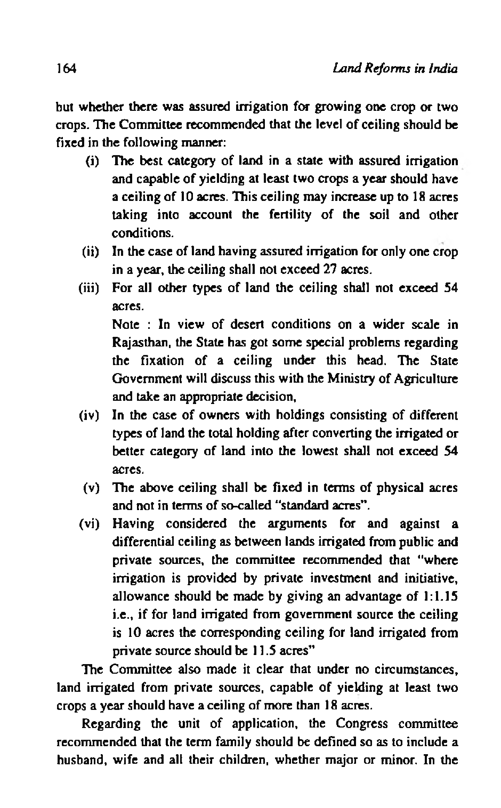

###### 164 Land Reforms in India

but whether there was assured irrigation for growing one crop or two crops. The Committee recommended that the level of ceiling should be fixed in the following manner:

- (i) The best category of land in a state with assured irrigation and capable of yielding at least two crops a year should have a ceiling of 10 acres. This ceiling may increase up to 18 acres taking into account the fertility of the soil and other conditions.
- (ii) In the case of land having assured irrigation for only one crop in a year, the ceiling shall not exceed 27 acres.
- (iii) For all other types of land the ceiling shall not exceed 54 acres. Note : In view of desert conditions on a wider scale in Rajasthan, the State has got some special problems regarding the fixation of a ceiling under this head. The State Government will discuss this with the Ministry of Agriculture and take an appropriate decision,
- (iv) In the case of owners with holdings consisting of different types of land the total holding after converting the irrigated or better category of land into the lowest shall not exceed 54 acres.
- (v) The above ceiling shall be fixed in terms of physical acres and not in terms of so-called “standard acres”.
- (vi) Having considered the arguments for and against a differential ceiling as between lands irrigated from public and private sources, the committee recommended that “where irrigation is provided by private investment and initiative, allowance should be made by giving an advantage of 1:1.15 i.e., if for land irrigated from government source the ceiling is 10 acres the corresponding ceiling for land irrigated from private source should be 11.5 acres”

The Committee also made it clear that under no circumstances, land irrigated from private sources, capable of yielding at least two crops a year should have a ceiling of more than 18 acres.

Regarding the unit of application, the Congress committee recommended that the term family should be defined so as to include a husband, wife and all their children, whether major or minor. In the

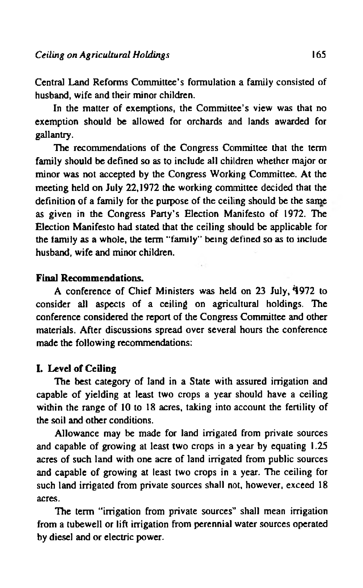

###### Ceiling on Agricultural Holdings 165

Central Land Reforms Committee’s formulation a family consisted of husband, wife and their minor children.

In the matter of exemptions, the Committee’s view was that no exemption should be allowed for orchards and lands awarded for gallantry.

The recommendations of the Congress Committee that the term family should be defined so as to include all children whether major or minor was not accepted by the Congress Working Committee. At the meeting held on July 22,1972 the working committee decided that the definition of a family for the purpose of the ceiling should be the same as given in the Congress Party’s Election Manifesto of 1972. The Election Manifesto had stated that the ceiling should be applicable for the family as a whole, the term “family” being defined so as to include husband, wife and minor children.

###### Final Recommendations.

A conference of Chief Ministers was held on 23 July, *1972 to consider all aspects of a ceiling on agricultural holdings. The conference considered the report of the Congress Committee and other materials. After discussions spread over several hours the conference made the following recommendations:

- I. Level of Ceiling The best category of land in a State with assured irrigation and

capable of yielding at least two crops a year should have a ceiling within the range of 10 to 18 acres, taking into account the fertility of the soil and other conditions.

Allowance may be made for land irrigated from private sources and capable of growing at least two crops in a year by equating 1.25 acres of such land with one acre of land irrigated from public sources and capable of growing at least two crops in a year. The ceiling for such land irrigated from private sources shall not, however, exceed 18 acres.

The term “irrigation from private sources” shall mean irrigation from a tubewell or lift irrigation from perennial water sources operated by diesel and or electric power.

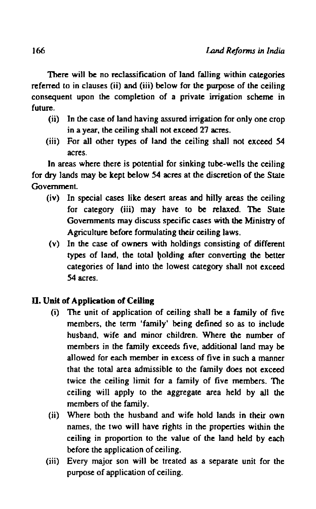

###### 166 Land Reforms in India

There will be no reclassification of land falling within categories referred to in clauses (ii) and (iii) below for the purpose of the ceiling consequent upon the completion of a private irrigation scheme in future.

- (ii) In the case of land having assured irrigation for only one crop in a year, the ceiling shall not exceed 27 acres.
- (iii) For all other types of land the ceiling shall not exceed 54 acres.

In areas where there is potential for sinking tube-wells the ceiling for dry lands may be kept below 54 acres at the discretion of the State Government.

- (iv) In special cases like desert areas and hilly areas the ceiling for category (iii) may have to be relaxed. The State Governments may discuss specific cases with the Ministry of Agriculture before formulating their ceiling laws.
- (v) In the case of owners with holdings consisting of different types of land, the total folding after converting the better categories of land into the lowest category shall not exceed 54 acres.

###### II. Unit of Application of Ceiling

- (i) The unit of application of ceiling shall be a family of five members, the term ‘family’ being defined so as to include husband, wife and minor children. Where the number of members in the family exceeds five, additional land may be allowed for each member in excess of five in such a manner that the total area admissible to the family does not exceed twice the ceiling limit for a family of five members. The ceiling will apply to the aggregate area held by all the members of the family.
- (ii) Where both the husband and wife hold lands in their own names, the two will have rights in the properties within the ceiling in proportion to the value of the land held by each before the application of ceiling.
- (iii) Every major son will be treated as a separate unit for the purpose of application of ceiling.

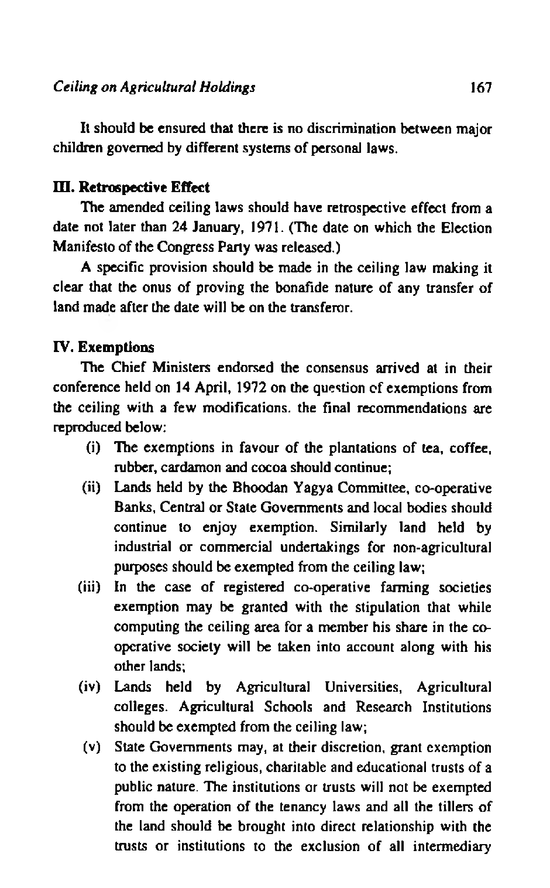

###### Ceiling on Agricultural Holdings 167

It should be ensured that there is no discrimination between major children governed by different systems of personal laws.

#### in.Retrospective Effect

The amended ceiling laws should have retrospective effect from a date not later than 24 January, 1971. (The date on which the Election Manifesto of the Congress Party was released.)

A specific provision should be made in the ceiling law making it clear that the onus of proving the bonafide nature of any transfer of land made after the date will be on the transferor.

###### IV. Exemptions

The Chief Ministers endorsed the consensus arrived at in their conference held on 14 April, 1972 on the question of exemptions from the ceiling with a few modifications, the final recommendations are reproduced below:

- (i) The exemptions in favour of the plantations of tea, coffee, rubber, cardamon and cocoa should continue;
- (ii) Lands held by the Bhoodan Yagya Committee, co-operative Banks, Central or State Governments and local bodies should continue to enjoy exemption. Similarly land held by industrial or commercial undertakings for non-agricultural purposes should be exempted from the ceiling law;
- (iii) In the case of registered co-operative fanning societies exemption may be granted with the stipulation that while computing the ceiling area for a member his share in the cooperative society will be taken into account along with his other lands;
- (iv) Lands held by Agricultural Universities, Agricultural colleges. Agricultural Schools and Research Institutions should be exempted from the ceiling law;
- (v) State Governments may, at their discretion, grant exemption to the existing religious, charitable and educational trusts of a public nature. The institutions or trusts will not be exempted from the operation of the tenancy laws and all the tillers of the land should be brought into direct relationship with the trusts or institutions to the exclusion of all intermediary

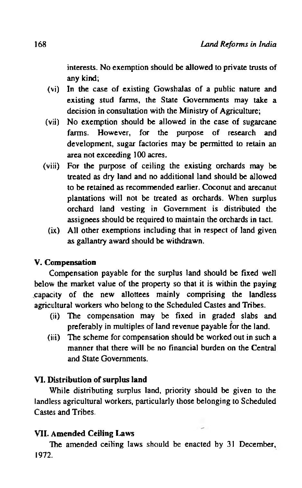

###### 168 Land Reforms in India

- interests. No exemption should be allowed to private trusts of any kind;
- (vi) In the case of existing Gowshalas of a public nature and existing stud farms, the State Governments may take a decision in consultation with the Ministry of Agriculture;
- (vii) No exemption should be allowed in the case of sugarcane farms. However, for the purpose of research and development, sugar factories may be permitted to retain an area not exceeding 100 acres.
- (viii) For the purpose of ceiling the existing orchards may be treated as dry land and no additional land should be allowed to be retained as recommended earlier. Coconut and arecanut plantations will not be treated as orchards. When surplus orchard land vesting in Government is distributed the assignees should be required to maintain the orchards in tact.
- (ix) All other exemptions including that in respect of land given as gallantry award should be withdrawn.

- V. Compensation Compensation payable for the surplus land should be fixed well

below the market value of the property so that it is within the paying .capacity of the new allottees mainly comprising the landless agricultural workers who belong to the Scheduled Castes and Tribes.

- (ii) The compensation may be fixed in graded slabs and preferably in multiples of land revenue payable for the land.
- (iii) The scheme for compensation should be worked out in such a manner that there will be no financial burden on the Central and State Governments.

- VI. Distribution of surplus land While distributing surplus land, priority should be given to the

landless agricultural workers, particularly those belonging to Scheduled Castes and Tribes.

- VII. Amended Ceiling Laws The amended ceiling laws should be enacted by 31 December,

1972.

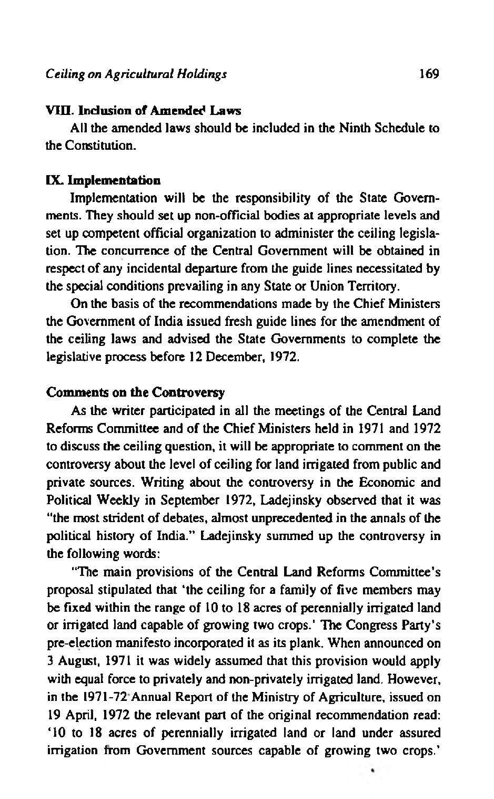

###### Ceiling on Agricultural Holdings 169

- VIII. Inclusion of Amended Laws All the amended laws should be included in the Ninth Schedule to

the Constitution.

- IX. Implementation Implementation will be the responsibility of the State Govern­

ments. They should set up non-official bodies at appropriate levels and set up competent official organization to administer the ceiling legislation. The concurrence of the Central Government will be obtained in respect of any incidental departure from the guide lines necessitated by the special conditions prevailing in any State or Union Territory.

On the basis of the recommendations made by the Chief Ministers the Government of India issued fresh guide lines for the amendment of the ceiling laws and advised the State Governments to complete the legislative process before 12 December, 1972.

###### Comments on the Controversy

As the writer participated in all the meetings of the Central Land Reforms Committee and of the Chief Ministers held in 1971 and 1972 to discuss the ceiling question, it will be appropriate to comment on the controversy about the level of ceiling for land irrigated from public and private sources. Writing about the controversy in the Economic and Political Weekly in September 1972, Ladejinsky observed that it was “the most strident of debates, almost unprecedented in the annals of the political history of India.” Ladejinsky summed up the controversy in the following words:

“The main provisions of the Central Land Reforms Committee’s proposal stipulated that ‘the ceiling for a family of five members may be fixed within the range of 10 to 18 acres of perennially irrigated land or irrigated land capable of growing two crops.’ The Congress Party’s pre-election manifesto incorporated it as its plank. When announced on 3 August, 1971 it was widely assumed that this provision would apply with equal force to privately and non-privately irrigated land. However, in the 1971-72 Annual Report of the Ministry of Agriculture, issued on 19 April, 1972 the relevant part of the original recommendation read: ‘10 to 18 acres of perennially irrigated land or land under assured irrigation from Government sources capable of growing two crops.’

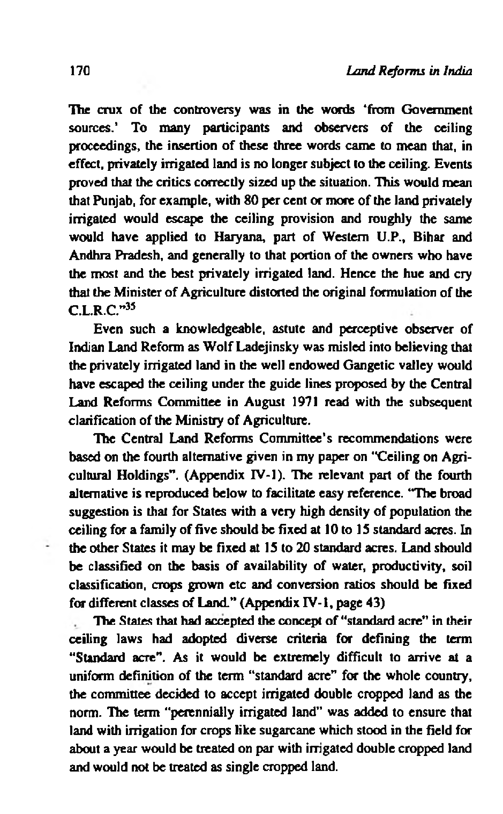

###### 170 Land Reforms in India

The crux of the controversy was in the words ‘from Government sources.’ To many participants and observers of the ceiling proceedings, the insertion of these three words came to mean that, in effect, privately irrigated land is no longer subject to the ceiling. Events proved that the critics correctly sized up the situation. This would mean that Punjab, for example, with 80 per cent or more of the land privately irrigated would escape the ceiling provision and roughly the same would have applied to Haryana, part of Western U.P., Bihar and Andhra Pradesh, and generally to that portion of the owners who have the most and the best privately irrigated land. Hence the hue and cry that the Minister of Agriculture distorted the original formulation of the C.L.R.C.”35

Even such a knowledgeable, astute and perceptive observer of Indian Land Reform as Wolf Ladejinsky was misled into believing that the privately irrigated land in the well endowed Gangetic valley would have escaped the ceiling under the guide lines proposed by the Central Land Reforms Committee in August 1971 read with the subsequent clarification of the Ministry of Agriculture.

The Central Land Reforms Committee’s recommendations were based on the fourth alternative given in my paper on “Ceiling on Agricultural Holdings”. (Appendix IV-1). The relevant part of the fourth alternative is reproduced below to facilitate easy reference. “The broad suggestion is that for States with a very high density of population the ceiling for a family of five should be fixed at 10 to 15 standard acres. In the other States it may be fixed at 15 to 20 standard acres. Land should be classified on the basis of availability of water, productivity, soil classification, crops grown etc and conversion ratios should be fixed for different classes of Land.” (Appendix IV-1, page 43)

The States that had accepted the concept of “standard acre” in their ceiling laws had adopted diverse criteria for defining the term “Standard acre”. As it would be extremely difficult to arrive at a uniform definition of the term “standard acre” for the whole country, the committee decided to accept irrigated double cropped land as the norm. The term “perennially irrigated land” was added to ensure that land with irrigation for crops like sugarcane which stood in the field for about a year would be treated on par with irrigated double cropped land and would not be treated as single cropped land.

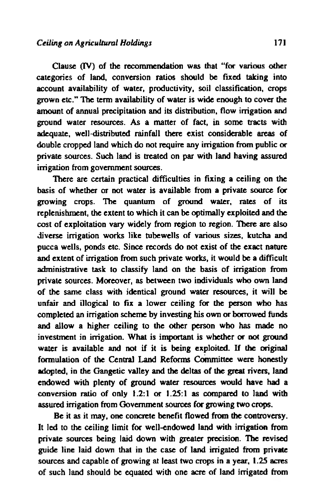

###### Ceiling on Agricultural Holdings 171

Clause (IV) of the recommendation was that “for various other categories of land, conversion ratios should be fixed taking into account availability of water, productivity, soil classification, crops grown etc.” The term availability of water is wide enough to cover the amount of annual precipitation and its distribution, flow irrigation and ground water resources. As a matter of fact, in some tracts with adequate, well-distributed rainfall there exist considerable areas of double cropped land which do not require any irrigation from public or private sources. Such land is treated on par with land having assured irrigation from government sources.

There are certain practical difficulties in fixing a ceiling on the basis of whether or not water is available from a private source for growing crops. The quantum of ground water, rates of its replenishment, the extent to which it can be optimally exploited and the cost of exploitation vary widely from region to region. There are also diverse irrigation works like tubewells of various sizes, kutcha and pucca wells, ponds etc. Since records do not exist of the exact nature and extent of irrigation from such private works, it would be a difficult administrative task to classify land on the basis of irrigation from private sources. Moreover, as between two individuals who own land of the same class with identical ground water resources, it will be unfair and illogical to fix a lower ceiling for the person who has completed an irrigation scheme by investing his own or borrowed funds and allow a higher ceiling to the other person who has made no investment in irrigation. What is important is whether or not ground water is available and not if it is being exploited. If the original formulation of the Central Land Reforms Committee were honestly adopted, in the Gangetic valley and the deltas of the great rivers, land endowed with plenty of ground water resources would have had a conversion ratio of only 1.2:1 or 1.25:1 as compared to land with assured irrigation from Government sources for growing two crops.

Be it as it may, one concrete benefit flowed from the controversy. It led to the ceiling limit for well-endowed land with irrigation from private sources being laid down with greater precision. The revised guide line laid down that in the case of land irrigated from private sources and capable of growing at least two crops in a year, 1.25 acres of such land should be equated with one acre of land irrigated from

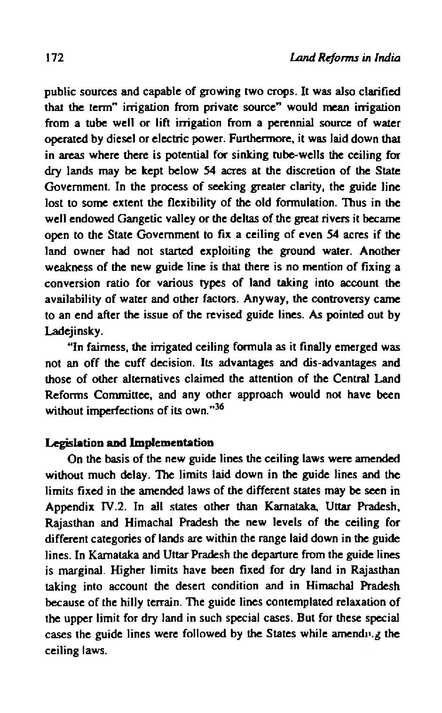

###### 172 Land Reforms in India

public sources and capable of growing two crops. It was also clarified that the term” irrigation from private source” would mean irrigation from a tube well or lift irrigation from a perennial source of water operated by diesel or electric power. Furthermore, it was laid down that in areas where there is potential for sinking tube-wells the ceiling for dry lands may be kept below 54 acres at the discretion of the State Government. In the process of seeking greater clarity, the guide line lost to some extent the flexibility of the old formulation. Thus in the well endowed Gangetic valley or the deltas of the great rivers it became open to the State Government to fix a ceiling of even 54 acres if the land owner had not started exploiting the ground water. Another weakness of the new guide line is that there is no mention of fixing a conversion ratio for various types of land taking into account the availability of water and other factors. Anyway, the controversy came to an end after the issue of the revised guide lines. As pointed out by Ladej insky.

“In fairness, the irrigated ceiling formula as it finally emerged was not an off the cuff decision. Its advantages and dis-advantages and those of other alternatives claimed the attention of the Central Land Reforms Committee, and any other approach would not have been without imperfections of its own.”36

###### Legislation and Implementation

On the basis of the new guide lines the ceiling laws were amended without much delay. The limits laid down in the guide lines and the limits fixed in the amended laws of the different states may be seen in Appendix IV.2. In all states other than Karnataka, Uttar Pradesh, Rajasthan and Himachal Pradesh the new levels of the ceiling for different categories of lands are within the range laid down in the guide lines. In Karnataka and Uttar Pradesh the departure from the guide lines is marginal. Higher limits have been fixed for dry land in Rajasthan taking into account the desert condition and in Himachal Pradesh because of the hilly terrain. The guide lines contemplated relaxation of the upper limit for dry land in such special cases. But for these special cases the guide lines were followed by the States while amendi».g the ceiling laws.

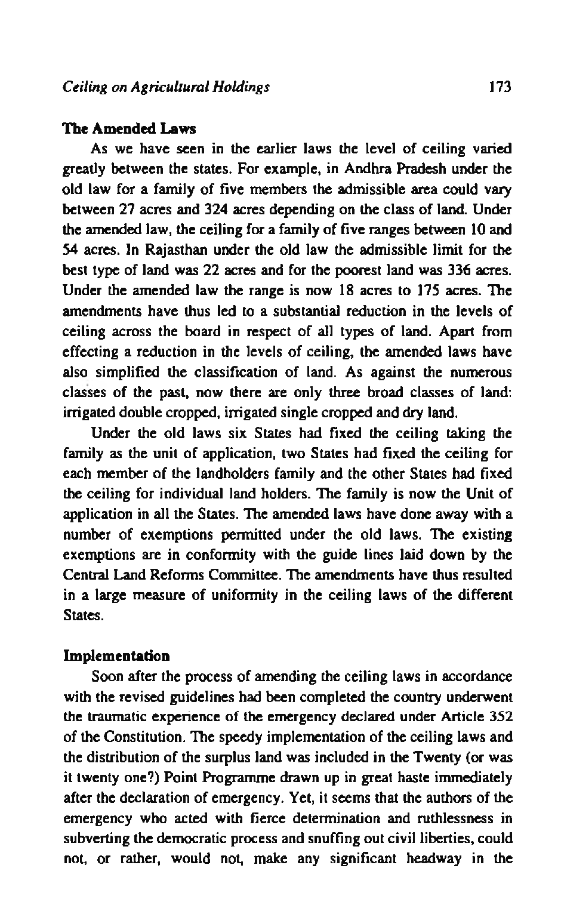

###### Ceiling on Agricultural Holdings 173

###### The Amended Laws

As we have seen in the earlier laws the level of ceiling varied greatly between the states. For example, in Andhra Pradesh under the old law for a family of five members the admissible area could vary between 27 acres and 324 acres depending on the class of land. Under the amended law, the ceiling for a family of five ranges between 10 and 54 acres. In Rajasthan under the old law the admissible limit for the best type of land was 22 acres and for the poorest land was 336 acres. Under the amended law the range is now 18 acres to 175 acres. The amendments have thus led to a substantial reduction in the levels of ceiling across the board in respect of all types of land. Apart from effecting a reduction in the levels of ceiling, the amended laws have also simplified the classification of land. As against the numerous classes of the past, now there are only three broad classes of land: irrigated double cropped, irrigated single cropped and dry land.

Under the old laws six States had fixed the ceiling taking the family as the unit of application, two States had fixed the ceiling for each member of the landholders family and the other States had fixed the ceiling for individual land holders. The family is now the Unit of application in all the States. The amended laws have done away with a number of exemptions permitted under the old laws. The existing exemptions are in conformity with the guide lines laid down by the Central Land Reforms Committee. The amendments have thus resulted in a large measure of uniformity in the ceiling laws of the different States.

###### Implementation

Soon after the process of amending the ceiling laws in accordance with the revised guidelines had been completed the country underwent the traumatic experience of the emergency declared under Article 352 of the Constitution. The speedy implementation of the ceiling laws and the distribution of the surplus land was included in the Twenty (or was it twenty one?) Point Programme drawn up in great haste immediately after the declaration of emergency. Yet, it seems that the authors of the emergency who acted with fierce determination and ruthlessness in subverting the democratic process and snuffing out civil liberties, could not, or rather, would not, make any significant headway in the

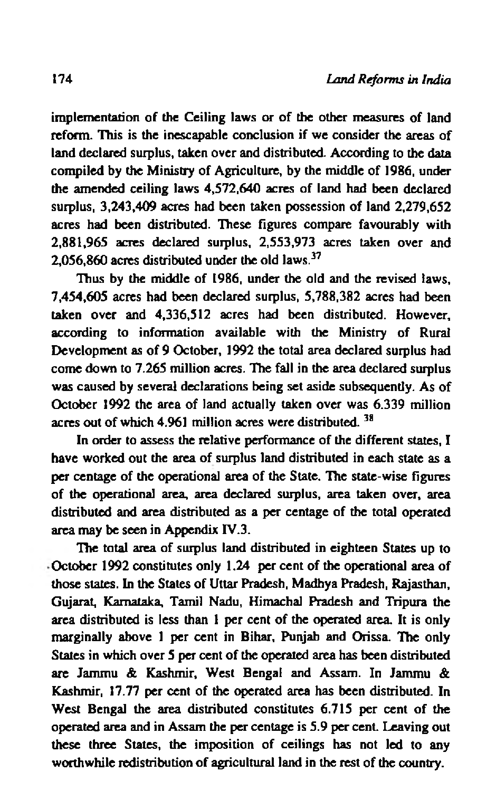

###### 174 Land Reforms in India

implementation of the Ceiling laws or of the other measures of land reform. This is the inescapable conclusion if we consider the areas of land declared surplus, taken over and distributed. According to the data compiled by the Ministry of Agriculture, by the middle of 1986, under the amended ceiling laws 4,572,640 acres of land had been declared surplus, 3,243,409 acres had been taken possession of land 2,279,652 acres had been distributed. These figures compare favourably with 2,881,965 acres declared surplus, 2,553,973 acres taken over and 2,056,860 acres distributed under the old laws.37

Thus by the middle of 1986, under the old and the revised laws, 7,454,605 acres had been declared surplus, 5,788,382 acres had been taken over and 4,336,512 acres had been distributed. However, according to information available with the Ministry of Rural Development as of 9 October, 1992 the total area declared surplus had come down to 7.265 million acres. The fall in the area declared surplus was caused by several declarations being set aside subsequently. As of October 1992 the area of land actually taken over was 6.339 million acres out of which 4.961 million acres were distributed.38

In order to assess the relative performance of the different states, I have worked out the area of surplus land distributed in each state as a per centage of the operational area of the State. The state-wise figures of the operational area, area declared surplus, area taken over, area distributed and area distributed as a per centage of the total operated area may be seen in Appendix IV.3.

The total area of surplus land distributed in eighteen States up to October 1992 constitutes only 1.24 per cent of the operational area of those states. In the States of Uttar Pradesh, Madhya Pradesh, Rajasthan, Gujarat, Karnataka, Tamil Nadu, Himachal Pradesh and Tripura the area distributed is less than 1 per cent of the operated area. It is only marginally above 1 per cent in Bihar, Punjab and Orissa. The only States in which over 5 per cent of the operated area has been distributed are Jammu & Kashmir, West Bengal and Assam. In Jammu & Kashmir, 17.77 per cent of the operated area has been distributed. In West Bengal the area distributed constitutes 6.715 per cent of the operated area and in Assam the per centage is 5.9 per cent. Leaving out these three States, the imposition of ceilings has not led to any worthwhile redistribution of agricultural land in the rest of the country.

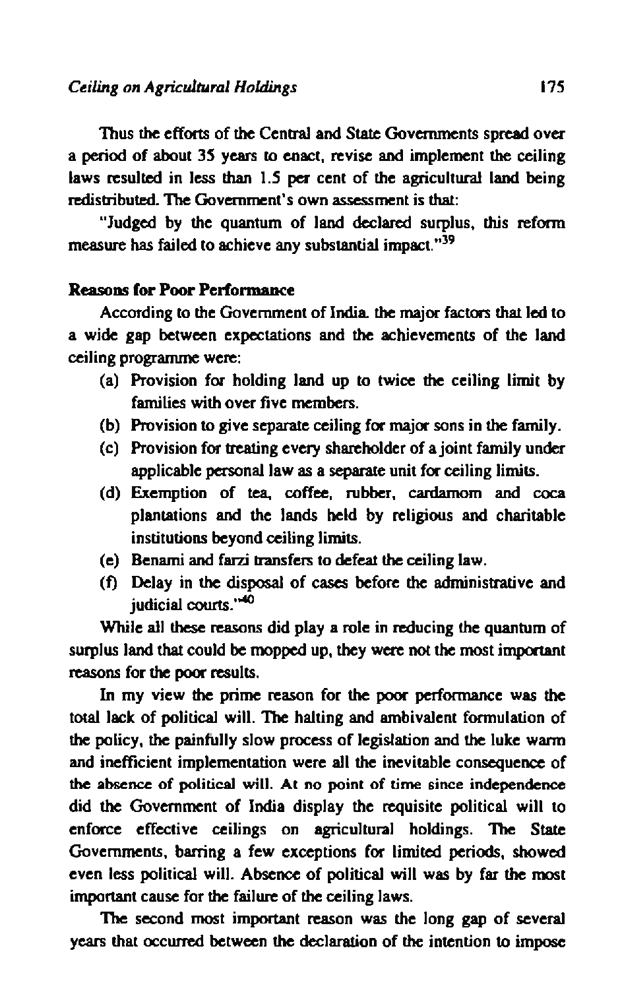

###### Ceiling on Agricultural Holdings 175

Thus the efforts of the Central and State Governments spread over a period of about 35 years to enact, revise and implement the ceiling laws resulted in less than 1.5 per cent of the agricultural land being redistributed. The Government’s own assessment is that:

“Judged by the quantum of land declared surplus, this reform measure has failed to achieve any substantial impact.”39

###### Reasons for Poor Performance

According to the Government of India, the major factors that led to a wide gap between expectations and the achievements of the land ceiling programme were:

- (a) Provision for holding land up to twice the ceiling limit by families with over five members.
- (b) Provision to give separate ceiling for major sons in the family.
- (c) Provision for treating every shareholder of a joint family under applicable personal law as a separate unit for ceiling limits.
- (d) Exemption of tea, coffee, rubber, cardamom and coca plantations and the lands held by religious and charitable institutions beyond ceiling limits.
- (e) Benami and farzi transfers to defeat the ceiling law.
- (f) Delay in the disposal of cases before the administrative and judicial courts.”40

While all these reasons did play a role in reducing the quantum of surplus land that could be mopped up, they were not the most important reasons for the poor results.

In my view the prime reason for the poor performance was the total lack of political will. The halting and ambivalent formulation of the policy, the painfully slow process of legislation and the luke warm and inefficient implementation were all the inevitable consequence of the absence of political will. At no point of time since independence did the Government of India display the requisite political will to enforce effective ceilings on agricultural holdings. The State Governments, barring a few exceptions for limited periods, showed even less political will. Absence of political will was by far the most important cause for the failure of the ceiling laws.

The second most important reason was the long gap of several years that occurred between the declaration of the intention to impose

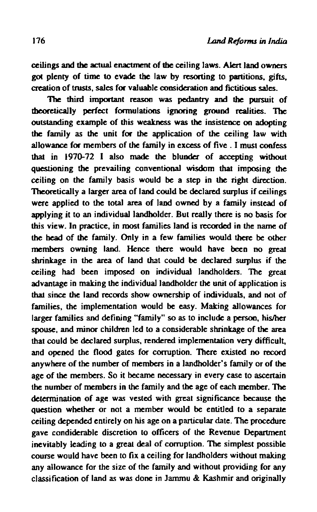

###### 176 Land Reforms in India

ceilings and the actual enactment of the ceiling laws. Alert land owners got plenty of time to evade the law by resorting to partitions, gifts, creation of trusts, sales for valuable consideration and fictitious sales.

The third important reason was pedantry and the pursuit of theoretically perfect formulations ignoring ground realities. The outstanding example of this weakness was the insistence on adopting the family as the unit for the application of the ceiling law with allowance for members of the family in excess of five . I must confess that in 1970-72 I also made the blunder of accepting without questioning the prevailing conventional wisdom that imposing the ceiling on the family basis would be a step in the right direction. Theoretically a larger area of land could be declared surplus if ceilings were applied to the total area of land owned by a family instead of applying it to an individual landholder. But really there is no basis for this view. In practice, in most families land is recorded in the name of the head of the family. Only in a few families would there be other members owning land. Hence there would have been no great shrinkage in the area of land that could be declared surplus if the ceiling had been imposed on individual landholders. The great advantage in making the individual landholder the unit of application is that since the land records show ownership of individuals, and not of families, the implementation would be easy. Making allowances for larger families and defining “family” so as to include a person, his/her spouse, and minor children led to a considerable shrinkage of the area that could be declared surplus, rendered implementation very difficult, and opened the flood gates for corruption. There existed no record anywhere of the number of members in a landholder’s family or of the age of the members. So it became necessary in every case to ascertain the number of members in the family and the age of each member. The determination of age was vested with great significance because the question whether or not a member would be entitled to a separate ceiling depended entirely on his age on a particular date. The procedure gave condiderable discretion to officers of the Revenue Department inevitably leading to a great deal of corruption. The simplest possible course would have been to fix a ceiling for landholders without making any allowance for the size of the family and without providing for any classification of land as was done in Jammu & Kashmir and originally

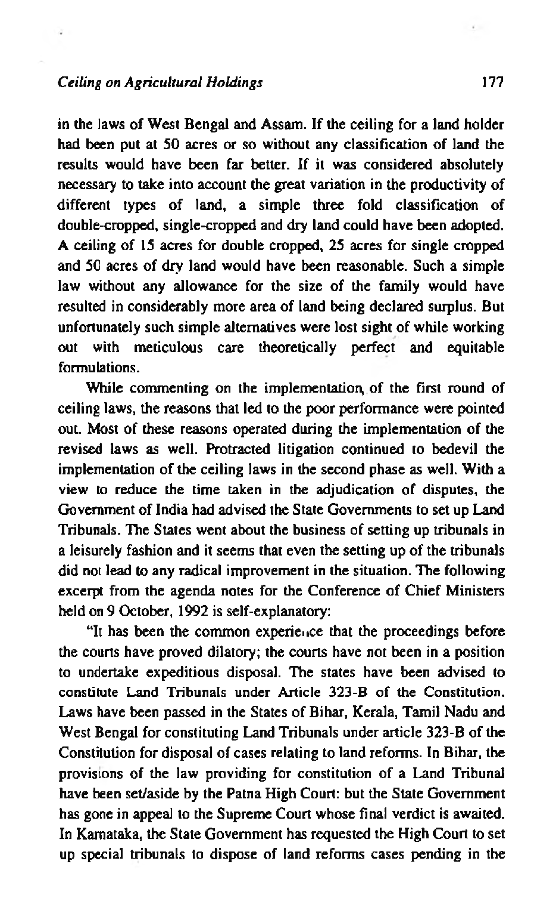

###### Ceiling on Agricultural Holdings 177

in the laws of West Bengal and Assam. If the ceiling for a land holder had been put at 50 acres or so without any classification of land the results would have been far better. If it was considered absolutely necessary to take into account the great variation in the productivity of different types of land, a simple three fold classification of double-cropped, single-cropped and dry land could have been adopted. A ceiling of 15 acres for double cropped, 25 acres for single cropped and 50 acres of dry land would have been reasonable. Such a simple law without any allowance for the size of the family would have resulted in considerably more area of land being declared surplus. But unfortunately such simple alternatives were lost sight of while working out with meticulous care theoretically perfect and equitable formulations.

While commenting on the implementation, of the first round of ceiling laws, the reasons that led to the poor performance were pointed out. Most of these reasons operated during the implementation of the revised laws as well. Protracted litigation continued to bedevil the implementation of the ceiling laws in the second phase as well. With a view to reduce the time taken in the adjudication of disputes, the Government of India had advised the State Governments to set up Land Tribunals. The States went about the business of setting up tribunals in a leisurely fashion and it seems that even the setting up of the tribunals did not lead to any radical improvement in the situation. The following excerpt from the agenda notes for the Conference of Chief Ministers held on 9 October, 1992 is self-explanatory:

“It has been the common experience that the proceedings before the courts have proved dilatory; the courts have not been in a position to undertake expeditious disposal. The states have been advised to constitute Land Tribunals under Article 323-B of the Constitution. Laws have been passed in the States of Bihar, Kerala, Tamil Nadu and West Bengal for constituting Land Tribunals under article 323-B of the Constitution for disposal of cases relating to land reforms. In Bihar, the provisions of the law providing for constitution of a Land Tribunal have been set/aside by the Patna High Court: but the State Government has gone in appeal to the Supreme Court whose final verdict is awaited. In Karnataka, the State Government has requested the High Court to set up special tribunals to dispose of land reforms cases pending in the

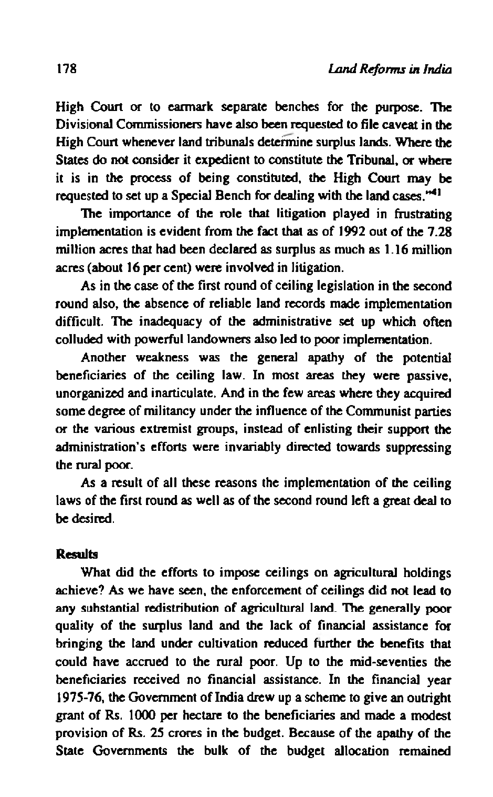

###### 178 Land Reforms in India

High Court or to earmark separate benches for the purpose. The Divisional Commissioners have also been requested to file caveat in the High Court whenever land tribunals deteinmine surplus lands. Where the States do not consider it expedient to constitute the Tribunal, or where it is in the process of being constituted, the High Court may be requested to set up a Special Bench for dealing with the land cases.**41

The importance of the role that litigation played in frustrating implementation is evident from the fact that as of 1992 out of the 7.28 million acres that had been declared as surplus as much as 1.16 million acres (about 16 per cent) were involved in litigation.

As in the case of the first round of ceiling legislation in the second round also, the absence of reliable land records made implementation difficult. The inadequacy of the administrative set up which often colluded with powerful landowners also led to poor implementation.

Another weakness was the general apathy of the potential beneficiaries of the ceiling law. In most areas they were passive, unorganized and inarticulate. And in the few areas where they acquired some degree of militancy under the influence of the Communist parties or the various extremist groups, instead of enlisting their support the administration’s efforts were invariably directed towards suppressing the rural poor.

As a result of all these reasons the implementation of the ceiling laws of the first round as well as of the second round left a great deal to be desired.

###### Results

What did the efforts to impose ceilings on agricultural holdings achieve? As we have seen, the enforcement of ceilings did not lead to any substantial redistribution of agricultural land. The generally poor quality of the surplus land and the lack of financial assistance for bringing the land under cultivation reduced further the benefits that could have accrued to the rural poor. Up to the mid-seventies the beneficiaries received no financial assistance. In the financial year 1975-76, the Government of India drew up a scheme to give an outright grant of Rs. 1000 per hectare to the beneficiaries and made a modest provision of Rs. 25 crores in the budget. Because of the apathy of the State Governments the bulk of the budget allocation remained

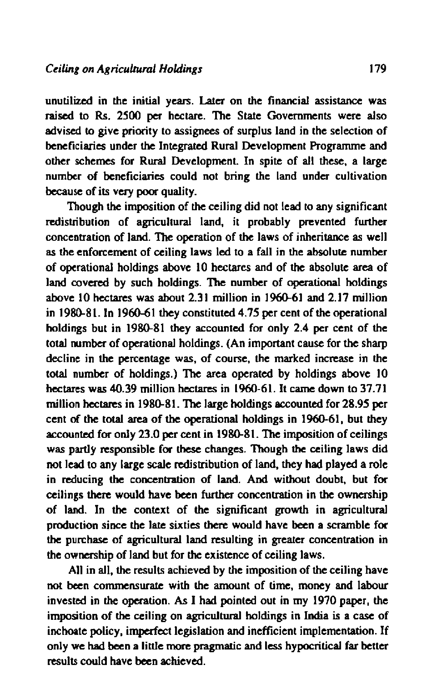

###### Ceiling on Agricultural Holdings 179

unutilized in the initial years. Later on the financial assistance was raised to Rs. 2500 per hectare. The State Governments were also advised to give priority to assignees of surplus land in the selection of beneficiaries under the Integrated Rural Development Programme and other schemes for Rural Development. In spite of all these, a large number of beneficiaries could not bring the land under cultivation because of its very poor quality.

Though the imposition of the ceiling did not lead to any significant redistribution of agricultural land, it probably prevented further concentration of land. The operation of the laws of inheritance as well as the enforcement of ceiling laws led to a fall in the absolute number of operational holdings above 10 hectares and of the absolute area of land covered by such holdings. The number of operational holdings above 10 hectares was about 2.31 million in 1960-61 and 2.17 million in 1980-81. In 1960-61 they constituted 4.75 per cent of the operational holdings but in 1980-81 they accounted for only 2.4 per cent of the total number of operational holdings. (An important cause for the sharp decline in the percentage was, of course, the marked increase in the total number of holdings.) The area operated by holdings above 10 hectares was 40.39 million hectares in 1960-61. It came down to 37.71 million hectares in 1980-81. The large holdings accounted for 28.95 per cent of the total area of the operational holdings in 1960-61, but they accounted for only 23.0 per cent in 1980-81. The imposition of ceilings was partly responsible for these changes. Though the ceiling laws did not lead to any large scale redistribution of land, they had played a role in reducing the concentration of land. And without doubt, but for ceilings there would have been further concentration in the ownership of land. In the context of the significant growth in agricultural production since the late sixties there would have been a scramble for the purchase of agricultural land resulting in greater concentration in the ownership of land but for the existence of ceiling laws.

All in all, the results achieved by the imposition of the ceiling have not been commensurate with the amount of time, money and labour invested in the operation. As I had pointed out in my 1970 paper, the imposition of the ceiling on agricultural holdings in India is a case of inchoate policy, imperfect legislation and inefficient implementation. If only we had been a little more pragmatic and less hypocritical far better results could have been achieved.

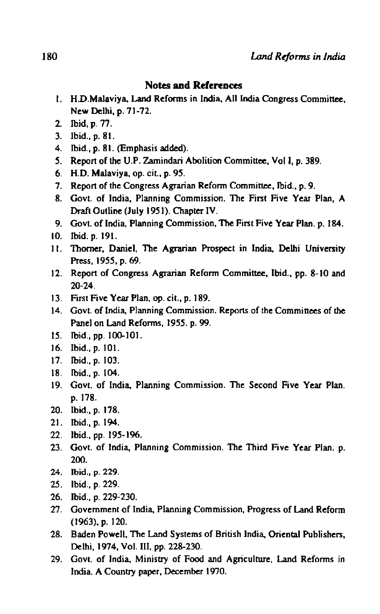

###### 180 Land Reforms in India

###### Notes and References

- 1. H.D.Malaviya, Land Reforms in India, All India Congress Committee, New Delhi, p. 71-72.
- 2. Ibid, p. 77.
- 3. Ibid., p. 81.
- 4. Ibid., p. 81. (Emphasis added).
- 5. Report of the U.P. Zamindari Abolition Committee, Vol I, p. 389.
- 6. H.D. Malaviya, op. cit., p. 95.
- 7. Report of the Congress Agrarian Reform Committee, Ibid., p. 9.
- 8. Govt, of India, Planning Commission. The First Five Year Plan, A Draft Outline (July 1951). Chapter IV.
- 9. Govt, of India, Planning Commission, The First Five Year Plan. p. 184.
- 10. Ibid. p. 191.
- 11. Thomer, Daniel, The Agrarian Prospect in India, Delhi University Press, 1955, p. 69.
- 12. Report of Congress Agrarian Reform Committee, Ibid., pp. 8-10 and 20-24.
- 13. First Five Year Plan, op. cit., p. 189.
- 14. Govt, of India, Planning Commission. Reports of the Committees of the Panel on Land Reforms, 1955. p. 99.
- 15. Ibid., pp. 100-101.
- 16. Ibid., p. 101.
- 17. Ibid., p. 103.
- 18. Ibid., p. 104.
- 19. Govt, of India, Planning Commission. The Second Five Year Plan, p. 178.
- 20. Ibid., p. 178.
- 21. Ibid., p. 194.
- 22. Ibid., pp. 195-196.
- 23. Govt, of India, Planning Commission. The Third Five Year Plan. p. 200.
- 24. Ibid., p. 229.
- 25. Ibid., p. 229.
- 26. Ibid., p. 229-230.
- 27. Government of India, Planning Commission, Progress of Land Reform

(1963), p. 120.

- 28. Baden Powell, The Land Systems of British India, Oriental Publishers, Delhi, 1974, Vol. Ill, pp. 228-230.
- 29. Govt, of India, Ministry of Food and Agriculture, Land Reforms in India. A Country paper, December 1970.

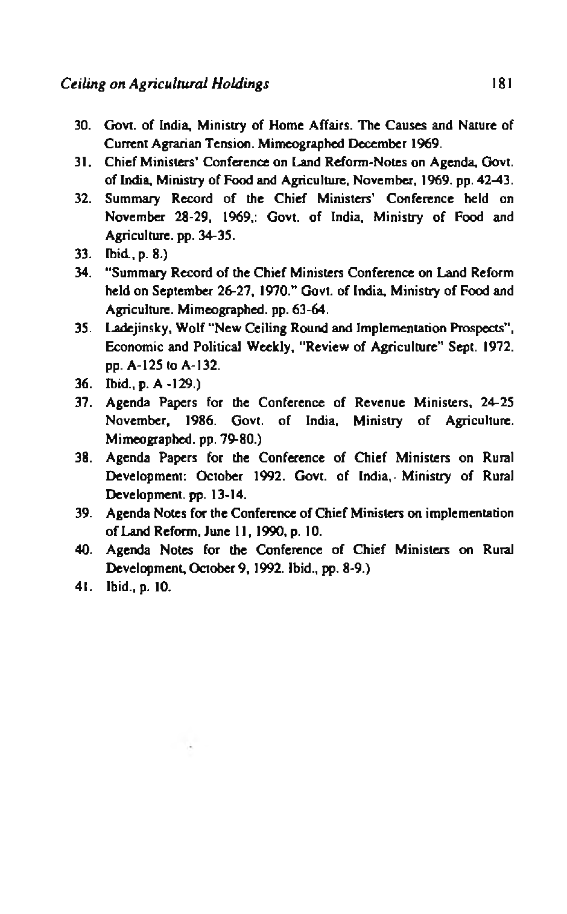

###### Ceiling on Agricultural Holdings 181

- 30. Govt, of India, Ministry of Home Affairs. The Causes and Nature of Current Agrarian Tension. Mimeographed December 1969.
- 31. Chief Ministers’ Conference on Land Reform-Notes on Agenda, Govt, of India, Ministry of Food and Agriculture, November, 1969. pp. 42-43.
- 32. Summary Record of the Chief Ministers’ Conference held on November 28-29, 1969,: Govt, of India, Ministry of Food and Agriculture, pp. 34-35.
- 33. Ibid., p. 8.)
- 34. “Summary Record of the Chief Ministers Conference on Land Reform held on September 26-27, 1970.” Govt, of India, Ministry of Food and Agriculture. Mimeographed, pp. 63-64.
- 35. Ladejinsky, Wolf “New Ceiling Round and Implementation Prospects”, Economic and Political Weekly, “Review of Agriculture” Sept. 1972. pp. A-125 to A-132.
- 36. Ibid., p. A -129.)
- 37. Agenda Papers for the Conference of Revenue Ministers, 24-25 November, 1986. Govt, of India, Ministry of Agriculture. Mimeographed, pp. 79-80.)
- 38. Agenda Papers for the Conference of Chief Ministers on Rural Development: October 1992. Govt, of India,- Ministry of Rural Development, pp. 13-14.
- 39. Agenda Notes for the Conference of Chief Ministers on implementation of Land Reform, June 11,1990, p. 10.
- 40. Agenda Notes for the Conference of Chief Ministers on Rural Development, October 9, 1992. Ibid., pp. 8-9.)
- 41. Ibid., p. 10.

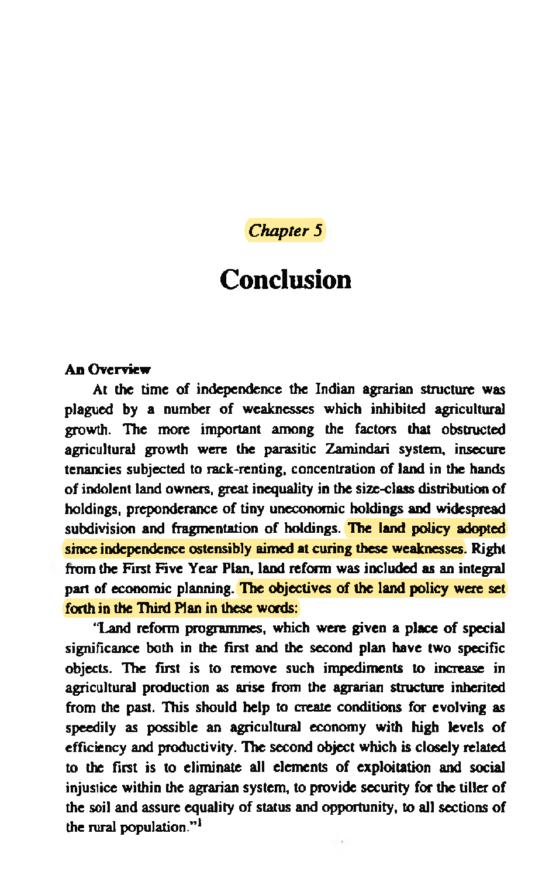

Chapter 5

### Conclusion

An Overview

At the time of independence the Indian agrarian structure was plagued by a number of weaknesses which inhibited agricultural growth. The more important among the factors that obstructed agricultural growth were the parasitic Zamindari system, insecure tenancies subjected to rack-renting, concentration of land in the hands of indolent land owners, great inequality in the size-class distribution of holdings, preponderance of tiny uneconomic holdings and widespread subdivision and fragmentation of holdings. The land policy adopted since independence ostensibly aimed at curing these weaknesses. Right from the First Five Year Plan, land reform was included as an integral part of economic planning. The objectives of the land policy were set forth in the Third Plan in these words:

“Land reform programmes, which were given a place of special significance both in the first and the second plan have two specific objects. The first is to remove such impediments to increase in agricultural production as arise from the agrarian structure inherited from the past. This should help to create conditions for evolving as speedily as possible an agricultural economy with high levels of efficiency and productivity. The second object which is closely related to the first is to eliminate all elements of exploitation and social injustice within the agrarian system, to provide security for the tiller of the soil and assure equality of status and opportunity, to all sections of the rural population.”1

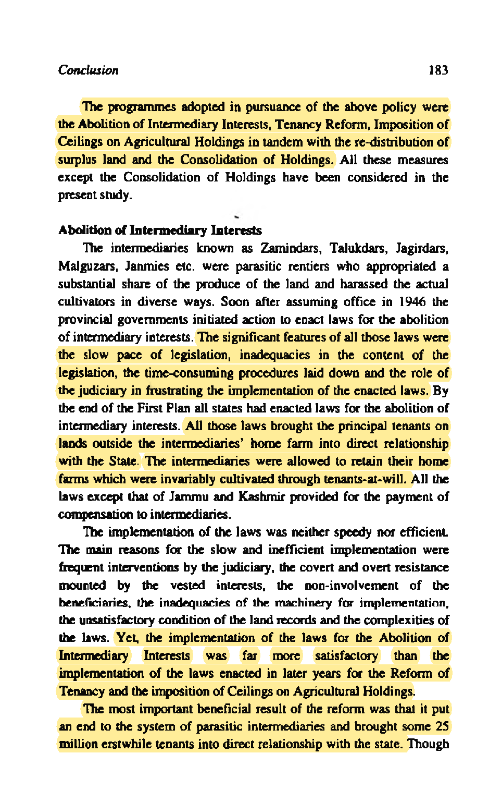

###### Conclusion 183

The programmes adopted in pursuance of the above policy were the Abolition of Intermediary Interests, Tenancy Reform, Imposition of Ceilings on Agricultural Holdings in tandem with the re-distribution of surplus land and the Consolidation of Holdings. All these measures except the Consolidation of Holdings have been considered in the present study.

###### Abolition of Intermediary Interests

The intermediaries known as Zamindars, Talukdars, Jagirdars, Malguzars, Janmies etc. were parasitic rentiers who appropriated a substantial share of the produce of the land and harassed the actual cultivators in diverse ways. Soon after assuming office in 1946 the provincial governments initiated action to enact laws for the abolition of intermediary interests. The significant features of all those laws were the slow pace of legislation, inadequacies in the content of the legislation, the time-consuming procedures laid down and the role of the judiciary in frustrating the implementation of the enacted laws. By the end of the First Plan all states had enacted laws for the abolition of intermediary interests. All those laws brought the principal tenants on lands outside the intermediaries’ home farm into direct relationship with the State. The intermediaries were allowed to retain their home farms which were invariably cultivated through tenants-at-will. All the laws except that of Jammu and Kashmir provided for the payment of compensation to intermediaries.

The implementation of the laws was neither speedy nor efficient The main reasons for the slow and inefficient implementation were frequent interventions by the judiciary, the covert and overt resistance mounted by the vested interests, the non-involvement of the beneficiaries, the inadequacies of the machinery for implementation, the unsatisfactory condition of the land records and the complexities of the laws. Yet, the implementation of the laws for the Abolition of Intermediary Interests was far more satisfactory than the implementation of the laws enacted in later years for the Reform of Tenancy and the imposition of Ceilings on Agricultural Holdings.

The most important beneficial result of the reform was that it put an end to the system of parasitic intermediaries and brought some 25 million erstwhile tenants into direct relationship with the state. Though

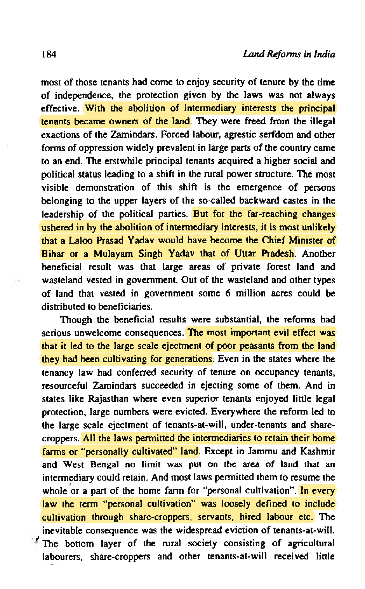

###### 184 Land Reforms in India

most of those tenants had come to enjoy security of tenure by the time of independence, the protection given by the laws was not always effective. With the abolition of intermediary interests the principal tenants became owners of the land. They were freed from the illegal exactions of the Zamindars. Forced labour, agrestic serfdom and other forms of oppression widely prevalent in large parts of the country came to an end. The erstwhile principal tenants acquired a higher social and political status leading to a shift in the rural power structure. The most visible demonstration of this shift is the emergence of persons belonging to the upper layers of the so-called backward castes in the leadership of the political parties. But for the far-reaching changes ushered in by the abolition of intermediary interests, it is most unlikely that a Laloo Prasad Yadav would have become the Chief Minister of Bihar or a Mulayam Singh Yadav that of Uttar Pradesh. Another beneficial result was that large areas of private forest land and wasteland vested in government. Out of the wasteland and other types of land that vested in government some 6 million acres could be distributed to beneficiaries.

Though the beneficial results were substantial, the reforms had serious unwelcome consequences. The most important evil effect was that it led to the large scale ejectment of poor peasants from the land they had been cultivating for generations. Even in the states where the tenancy law had conferred security of tenure on occupancy tenants, resourceful Zamindars succeeded in ejecting some of them. And in states like Rajasthan where even superior tenants enjoyed little legal protection, large numbers were evicted. Everywhere the reform led to the large scale ejectment of tenants-at-will, under-tenants and sharecroppers. All the laws permitted the intermediaries to retain their home farms or “personally cultivated” land. Except in Jammu and Kashmir and West Bengal no limit was put on the area of land that an intermediary could retain. And most laws permitted them to resume the whole or a part of the home farm for “personal cultivation”. In every law the term “personal cultivation” was loosely defined to include cultivation through share-croppers, servants, hired labour etc. The inevitable consequence was the widespread eviction of tenants-at-will.

** The bottom layer of the rural society consisting of agricultural labourers, share-croppers and other tenants-at-will received little

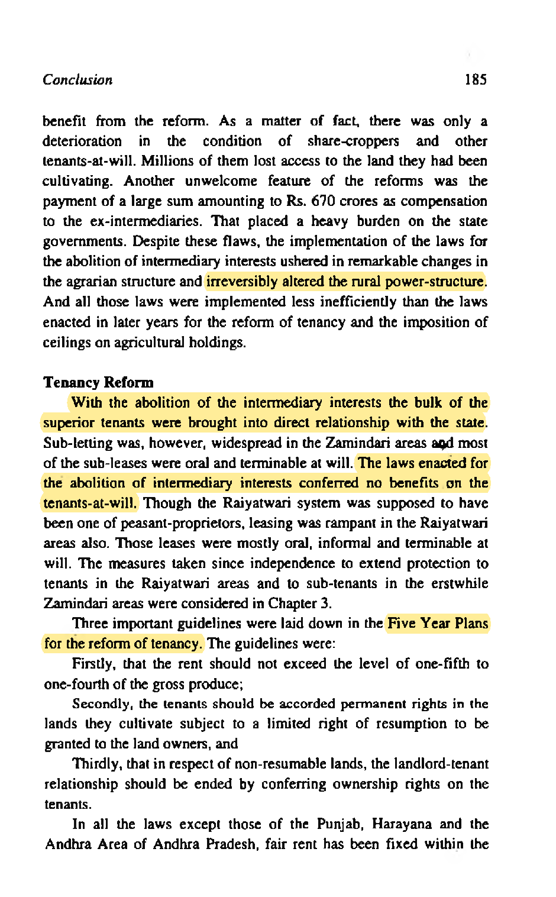

###### Conclusion 185

benefit from the reform. As a matter of fact, there was only a deterioration in the condition of share-croppers and other tenants-at-will. Millions of them lost access to the land they had been cultivating. Another unwelcome feature of the reforms was the payment of a large sum amounting to Rs. 670 crores as compensation to the ex-intermediaries. That placed a heavy burden on the state governments. Despite these flaws, the implementation of the laws for the abolition of intermediary interests ushered in remarkable changes in the agrarian structure and irreversibly altered the rural power-structure. And all those laws were implemented less inefficiently than the laws enacted in later years for the reform of tenancy and the imposition of ceilings on agricultural holdings.

###### Tenancy Reform

With the abolition of the intermediary interests the bulk of the superior tenants were brought into direct relationship with the state. Sub-letting was, however, widespread in the Zamindari areas a?d most of the sub-leases were oral and terminable at will. The laws enacted for the abolition of intermediary interests conferred no benefits on the tenants-at-will. Though the Raiyatwari system was supposed to have been one of peasant-proprietors, leasing was rampant in the Raiyatwari areas also. Those leases were mostly oral, informal and terminable at will. The measures taken since independence to extend protection to tenants in the Raiyatwari areas and to sub-tenants in the erstwhile Zamindari areas were considered in Chapter 3.

Three important guidelines were laid down in the Five Year Plans for the reform of tenancy. The guidelines were:

Firstly, that the rent should not exceed the level of one-fifth to one-fourth of the gross produce;

Secondly, the tenants should be accorded permanent rights in the lands they cultivate subject to a limited right of resumption to be granted to the land owners, and

Thirdly, that in respect of non-resumable lands, the landlord-tenant relationship should be ended by conferring ownership rights on the tenants.

In all the laws except those of the Punjab, Harayana and the Andhra Area of Andhra Pradesh, fair rent has been fixed within the

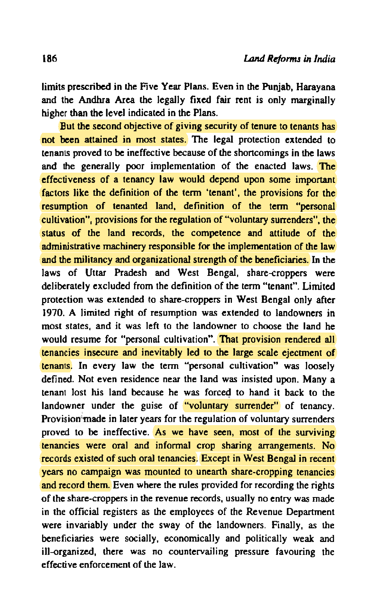

###### 186 Land Reforms in India

limits prescribed in the Five Year Plans. Even in the Punjab, Harayana and the Andhra Area the legally fixed fair rent is only marginally higher than the level indicated in the Plans.

But the second objective of giving security of tenure to tenants has not been attained in most states. The legal protection extended to tenants proved to be ineffective because of the shortcomings in the laws and the generally poor implementation of the enacted laws. The effectiveness of a tenancy law would depend upon some important factors like the definition of the term ‘tenant’, the provisions for the resumption of tenanted land, definition of the term “personal cultivation”, provisions for the regulation of “voluntary surrenders”, the status of the land records, the competence and attitude of the administrative machinery responsible for the implementation of the law and the militancy and organizational strength of the beneficiaries. In the laws of Uttar Pradesh and West Bengal, share-croppers were deliberately excluded from the definition of the term “tenant”. Limited protection was extended to share-croppers in West Bengal only after 1970. A limited right of resumption was extended to landowners in most states, and it was left to the landowner to choose the land he would resume for “personal cultivation”. That provision rendered all tenancies insecure and inevitably led to the large scale ejectment of tenants. In every law the term “personal cultivation” was loosely defined. Not even residence near the land was insisted upon. Many a tenant lost his land because he was forced to hand it back to the landowner under the guise of “voluntary surrender” of tenancy. Provision made in later years for the regulation of voluntary surrenders proved to be ineffective. As we have seen, most of the surviving tenancies were oral and informal crop sharing arrangements. No records existed of such oral tenancies. Except in West Bengal in recent years no campaign was mounted to unearth share-cropping tenancies and record them. Even where the rules provided for recording the rights of the share-croppers in the revenue records, usually no entry was made in the official registers as the employees of the Revenue Department were invariably under the sway of the landowners. Finally, as the beneficiaries were socially, economically and politically weak and ill-organized, there was no countervailing pressure favouring the effective enforcement of the law.

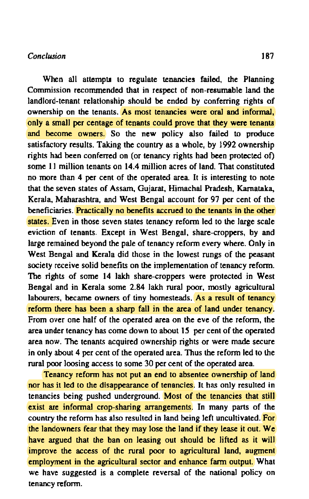

###### Conclusion 187

When all attempts to regulate tenancies failed, the Planning Commission recommended that in respect of non-resumable land the landlord-tenant relationship should be ended by conferring rights of ownership on the tenants. As most tenancies were oral and informal, only a small per centage of tenants could prove that they were tenants and become owners. So the new policy also failed to produce satisfactory results. Taking the country as a whole, by 1992 ownership rights had been conferred on (or tenancy rights had been protected of) some 11 million tenants on 14.4 million acres of land. That constituted no more than 4 per cent of the operated area. It is interesting to note that the seven states of Assam, Gujarat, Himachal Pradesh, Karnataka, Kerala, Maharashtra, and West Bengal account for 97 per cent of the beneficiaries. Practically no benefits accrued to the tenants in the other states. Even in those seven states tenancy reform led to the large scale eviction of tenants. Except in West Bengal, share-croppers, by and large remained beyond the pale of tenancy reform every where. Only in West Bengal and Kerala did those in the lowest rungs of the peasant society receive solid benefits on the implementation of tenancy reform. The rights of some 14 lakh share-croppers were protected in West Bengal and in Kerala some 2.84 lakh rural poor, mostly agricultural labourers, became owners of tiny homesteads. As a result of tenancy reform there has been a sharp fall in the area of land under tenancy. From over one half of the operated area on the eve of the reform, the area under tenancy has come down to about 15 per cent of the operated area now. The tenants acquired ownership rights or were made secure in only about 4 per cent of the operated area. Thus the reform led to the rural poor loosing access to some 30 per cent of the operated area.

Tenancy reform has not put an end to absentee ownership of land nor has it led to the disappearance of tenancies. It has only resulted in tenancies being pushed underground. Most of the tenancies that still exist are informal crop-sharing arrangements. In many parts of the country the reform has also resulted in land being left uncultivated. For the landowners fear that they may lose the land if they lease it out. We have argued that the ban on leasing out should be lifted as it will improve the access of the rural poor to agricultural land, augment employment in the agricultural sector and enhance farm output. What we have suggested is a complete reversal of the national policy on tenancy reform.

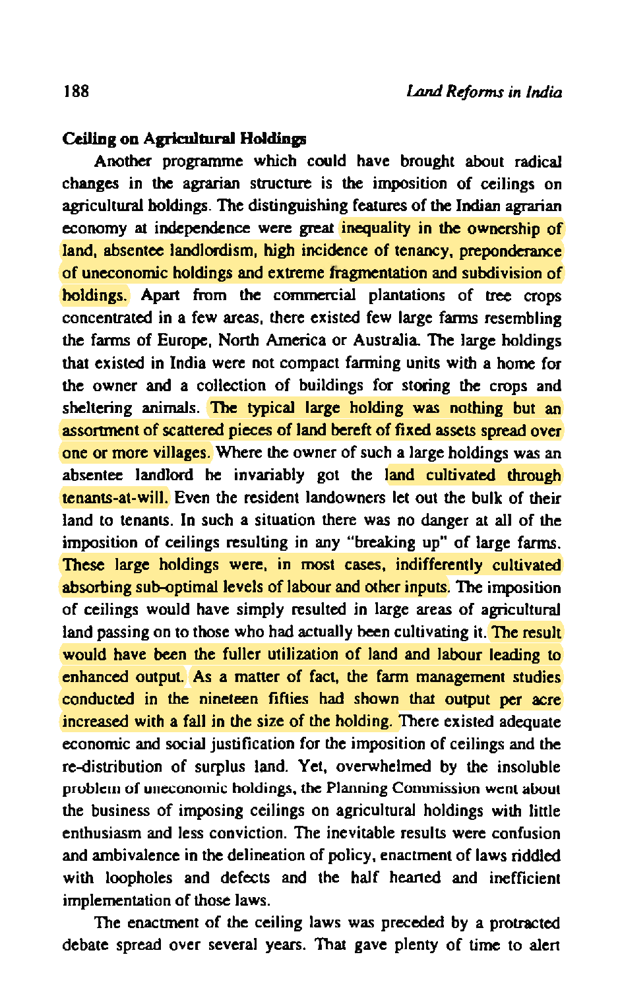

###### 188 Land Reforms in India

###### Ceiling on Agricultural Holdings

Another programme which could have brought about radical changes in the agrarian structure is the imposition of ceilings on agricultural holdings. The distinguishing features of the Indian agrarian economy at independence were great inequality in the ownership of land, absentee landlordism, high incidence of tenancy, preponderance of uneconomic holdings and extreme fragmentation and subdivision of holdings. Apart from the commercial plantations of tree crops concentrated in a few areas, there existed few large farms resembling the farms of Europe, North America or Australia The large holdings that existed in India were not compact farming units with a home for the owner and a collection of buildings for storing the crops and sheltering animals. The typical large holding was nothing but an assortment of scattered pieces of land bereft of fixed assets spread over one or more villages. Where the owner of such a large holdings was an absentee landlord he invariably got the land cultivated through tenants-at-will. Even the resident landowners let out the bulk of their land to tenants. In such a situation there was no danger at all of the imposition of ceilings resulting in any “breaking up” of large farms. These large holdings were, in most cases, indifferently cultivated absorbing sub-optimal levels of labour and other inputs. The imposition of ceilings would have simply resulted in large areas of agricultural land passing on to those who had actually been cultivating it. The result would have been the fuller utilization of land and labour leading to enhanced output. As a matter of fact, the farm management studies conducted in the nineteen fifties had shown that output per acre increased with a fall in the size of the holding. There existed adequate economic and social justification for the imposition of ceilings and the re-distribution of surplus land. Yet, overwhelmed by the insoluble prublem of uneconomic holdings, the Planning Commission went about the business of imposing ceilings on agricultural holdings with little enthusiasm and less conviction. The inevitable results were confusion and ambivalence in the delineation of policy, enactment of laws riddled with loopholes and defects and the half hearted and inefficient implementation of those laws.

The enactment of the ceiling laws was preceded by a protracted debate spread over several years. That gave plenty of time to alert

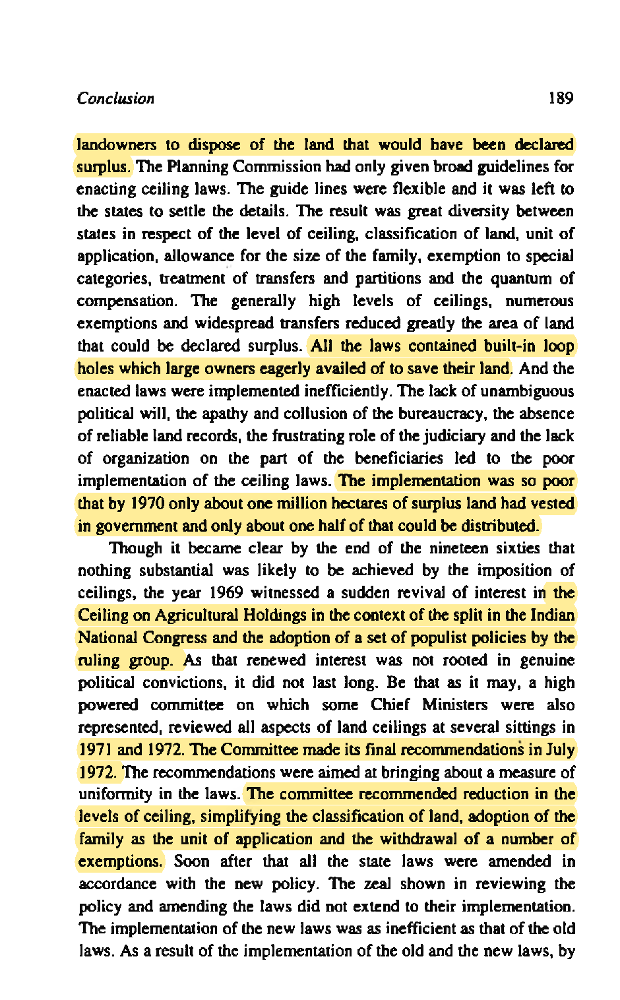

###### Conclusion 189

landowners to dispose of the land that would have been declared surplus. The Planning Commission had only given broad guidelines for enacting ceiling laws. The guide lines were flexible and it was left to the states to settle the details. The result was great diversity between states in respect of the level of ceiling, classification of land, unit of application, allowance for the size of the family, exemption to special categories, treatment of transfers and partitions and the quantum of compensation. The generally high levels of ceilings, numerous exemptions and widespread transfers reduced greatly the area of land that could be declared surplus. All the laws contained built-in loop holes which large owners eagerly availed of to save their land. And the enacted laws were implemented inefficiently. The lack of unambiguous political will, the apathy and collusion of the bureaucracy, the absence of reliable land records, the frustrating role of the judiciary and the lack of organization on the part of the beneficiaries led to the poor implementation of the ceiling laws. The implementation was so poor that by 1970 only about one million hectares of surplus land had vested in government and only about one half of that could be distributed.

Though it became clear by the end of the nineteen sixties that nothing substantial was likely to be achieved by the imposition of ceilings, the year 1969 witnessed a sudden revival of interest in the Ceiling on Agricultural Holdings in the context of the split in the Indian National Congress and the adoption of a set of populist policies by the ruling group. As that renewed interest was not rooted in genuine political convictions, it did not last long. Be that as it may, a high powered committee on which some Chief Ministers were also represented, reviewed all aspects of land ceilings at several sittings in

- 1971 and 1972. The Committee made its final recommendations in July
- 1972. The recommendations were aimed at bringing about a measure of uniformity in the laws. The committee recommended reduction in the levels of ceiling, simplifying the classification of land, adoption of the family as the unit of application and the withdrawal of a number of exemptions. Soon after that all the state laws were amended in accordance with the new policy. The zeal shown in reviewing the policy and amending the laws did not extend to their implementation. The implementation of the new laws was as inefficient as that of the old laws. As a result of the implementation of the old and the new laws, by

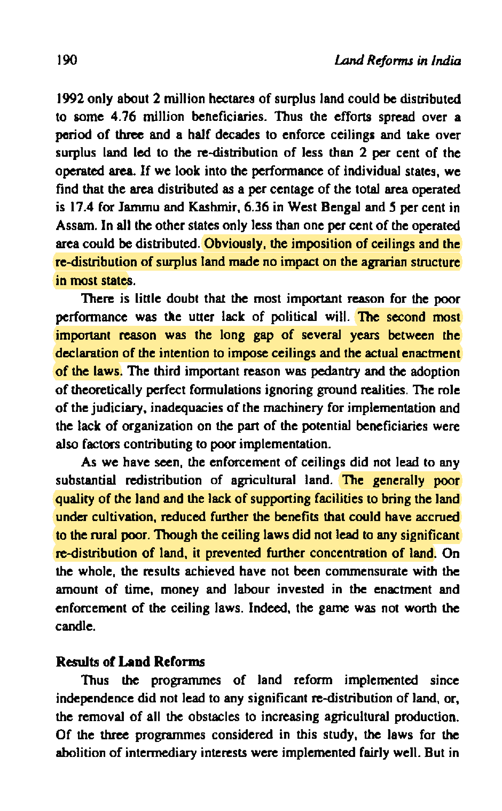

###### 190 Land Reforms in India

1992 only about 2 million hectares of surplus land could be distributed to some 4.76 million beneficiaries. Thus the efforts spread over a period of three and a half decades to enforce ceilings and take over surplus land led to the re-distribution of less than 2 per cent of the operated area. If we look into the performance of individual states, we find that the area distributed as a per centage of the total area operated is 17.4 for Jammu and Kashmir, 6.36 in West Bengal and 5 per cent in Assam. In all the other states only less than one per cent of the operated area could be distributed. Obviously, the imposition of ceilings and the re-distribution of surplus land made no impact on the agrarian structure in most states.

There is little doubt that the most important reason for the poor performance was the utter lack of political will. The second most important reason was the long gap of several years between the declaration of the intention to impose ceilings and the actual enactment of the laws. The third important reason was pedantry and the adoption of theoretically perfect formulations ignoring ground realities. The role of the judiciary, inadequacies of the machinery for implementation and the lack of organization on the part of the potential beneficiaries were also factors contributing to poor implementation.

As we have seen, the enforcement of ceilings did not lead to any substantial redistribution of agricultural land. The generally poor quality of the land and the lack of supporting facilities to bring the land under cultivation, reduced further the benefits that could have accrued to the rural poor. Though the ceiling laws did not lead to any significant re-distribution of land, it prevented further concentration of land. On the whole, the results achieved have not been commensurate with the amount of time, money and labour invested in the enactment and enforcement of the ceiling laws. Indeed, the game was not worth the candle.

###### Results of Land Reforms

Thus the programmes of land reform implemented since independence did not lead to any significant re-distribution of land, or, the removal of all the obstacles to increasing agricultural production. Of the three programmes considered in this study, the laws for the abolition of intermediary interests were implemented fairly well. But in

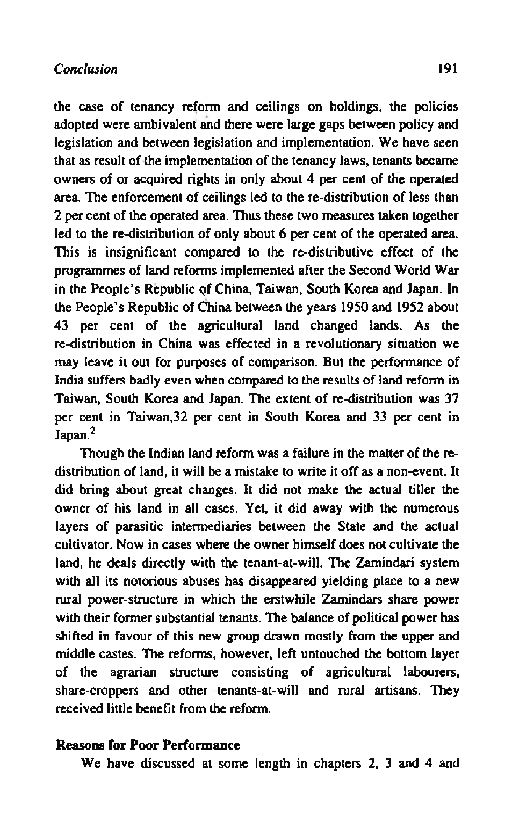

###### Conclusion 191

the case of tenancy reform and ceilings on holdings, the policies adopted were ambivalent and there were large gaps between policy and legislation and between legislation and implementation. We have seen that as result of the implementation of the tenancy laws, tenants became owners of or acquired rights in only about 4 per cent of the operated area. The enforcement of ceilings led to the re-distribution of less than 2 per cent of the operated area. Thus these two measures taken together led to the re-distribution of only about 6 per cent of the operated area. This is insignificant compared to the re-distributive effect of the programmes of land reforms implemented after the Second World War in the People’s Republic qf China, Taiwan, South Korea and Japan. In the People’s Republic of China between the years 1950 and 1952 about 43 per cent of the agricultural land changed lands. As the re-distribution in China was effected in a revolutionary situation we may leave it out for purposes of comparison. But the performance of India suffers badly even when compared to the results of land reform in Taiwan, South Korea and Japan. The extent of re-distribution was 37 per cent in Taiwan,32 per cent in South Korea and 33 per cent in Japan.2

Though the Indian land reform was a failure in the matter of the redistribution of land, it will be a mistake to write it off as a non-event. It did bring about great changes. It did not make the actual tiller the owner of his land in all cases. Yet, it did away with the numerous layers of parasitic intermediaries between the State and the actual cultivator. Now in cases where the owner himself does not cultivate the land, he deals directly with the tenant-at-will. The Zamindari system with all its notorious abuses has disappeared yielding place to a new rural power-structure in which the erstwhile Zamindars share power with their former substantial tenants. The balance of political power has shifted in favour of this new group drawn mostly from the upper and middle castes. The reforms, however, left untouched the bottom layer of the agrarian structure consisting of agricultural labourers, share-croppers and other tenants-at-will and rural artisans. They received little benefit from the reform.

###### Reasons for Poor Performance

We have discussed at some length in chapters 2, 3 and 4 and

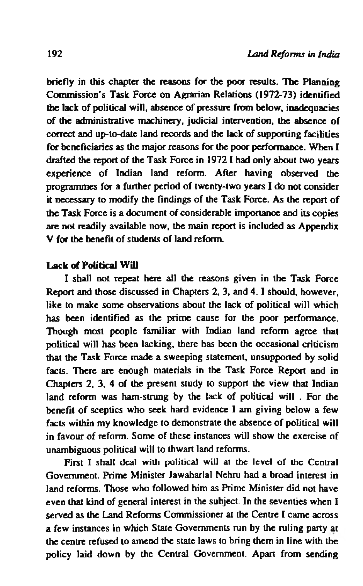

###### 192 Land Reforms in India

briefly in this chapter the reasons for the poor results. The Planning Commission’s Task Force on Agrarian Relations (1972-73) identified the lack of political will, absence of pressure from below, inadequacies of the administrative machinery, judicial intervention, the absence of correct and up-to-date land records and the lack of supporting facilities for beneficiaries as the major reasons for the poor performance. When I drafted the report of the Task Force in 19721 had only about two years experience of Indian land reform. After having observed the programmes for a further period of twenty-two years I do not consider it necessary to modify the findings of the Task Force. As the report of the Task Force is a document of considerable importance and its copies are not readily available now, the main report is included as Appendix V for the benefit of students of land reform.

###### Lack of Political Will

I shall not repeat here all the reasons given in the Task Force Report and those discussed in Chapters 2, 3, and 4 .1 should, however, like to make some observations about the lack of political will which has been identified as the prime cause for the poor performance. Though most people familiar with Indian land reform agree that political will has been lacking, there has been the occasional criticism that the Task Force made a sweeping statement, unsupported by solid facts. There are enough materials in the Task Force Report and in Chapters 2, 3, 4 of the present study to support the view that Indian land reform was ham-strung by the lack of political will . For the benefit of sceptics who seek hard evidence I am giving below a few facts within my knowledge to demonstrate the absence of political will in favour of reform. Some of these instances will show the exercise of unambiguous political will to thwart land reforms.

First I shall deal with political will at the level of the Central Government. Prime Minister Jawaharlal Nehru had a broad interest in land reforms. Those who followed him as Prime Minister did not have even that kind of general interest in the subject. In the seventies when I served as the Land Reforms Commissioner at the Centre I came across a few instances in which State Governments run by the ruling party at the centre refused to amend the state laws to bring them in line with the policy laid down by the Central Government. Apart from sending

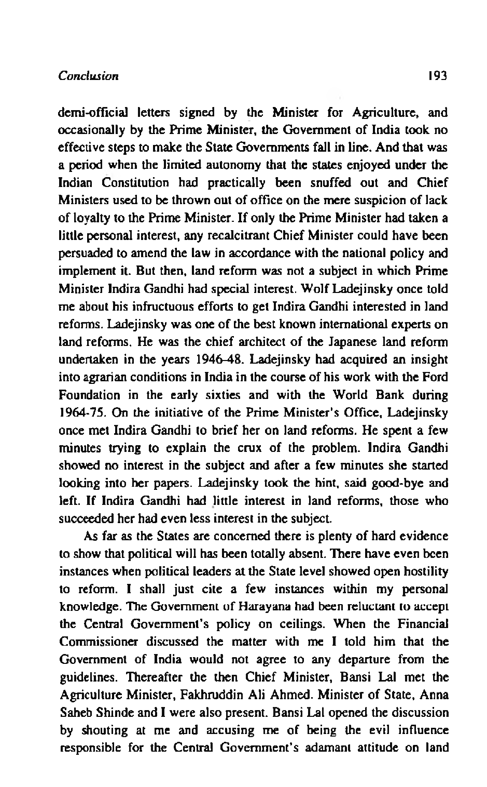

###### Conclusion 193

demi-official letters signed by the Minister for Agriculture, and occasionally by the Prime Minister, the Government of India took no effective steps to make the State Governments fall in line. And that was a period when the limited autonomy that the states enjoyed under the Indian Constitution had practically been snuffed out and Chief Ministers used to be thrown out of office on the mere suspicion of lack of loyalty to the Prime Minister. If only the Prime Minister had taken a little personal interest, any recalcitrant Chief Minister could have been persuaded to amend the law in accordance with the national policy and implement it. But then, land reform was not a subject in which Prime Minister Indira Gandhi had special interest. Wolf Ladejinsky once told me about his infructuous efforts to get Indira Gandhi interested in land reforms. Ladejinsky was one of the best known international experts on land reforms. He was the chief architect of the Japanese land reform undertaken in the years 1946-48. Ladejinsky had acquired an insight into agrarian conditions in India in the course of his work with the Ford Foundation in the early sixties and with the World Bank during 1964-75. On the initiative of the Prime Minister’s Office, Ladejinsky once met Indira Gandhi to brief her on land reforms. He spent a few minutes trying to explain the crux of the problem. Indira Gandhi showed no interest in the subject and after a few minutes she started looking into her papers. Ladejinsky took the hint, said good-bye and left. If Indira Gandhi had little interest in land reforms, those who succeeded her had even less interest in the subject.

As far as the States are concerned there is plenty of hard evidence to show that political will has been totally absent. There have even been instances when political leaders at the State level showed open hostility to reform. I shall just cite a few instances within my personal knowledge. The Government of Harayana had been reluctant to accept the Central Government’s policy on ceilings. When the Financial Commissioner discussed the matter with me I told him that the Government of India would not agree to any departure from the guidelines. Thereafter the then Chief Minister, Bansi Lai met the Agriculture Minister, Fakhruddin Ali Ahmed. Minister of State, Anna Saheb Shinde and I were also present. Bansi Lai opened the discussion by shouting at me and accusing me of being the evil influence responsible for the Central Government’s adamant attitude on land

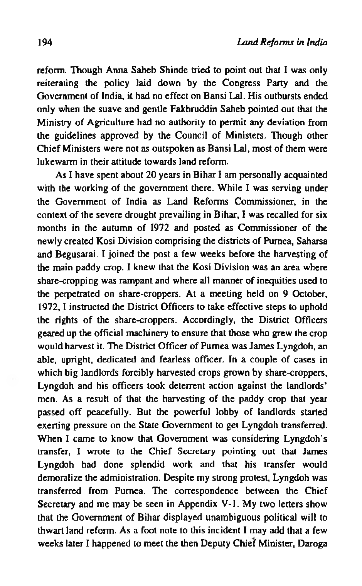

###### 194 Land Reforms in India

reform. Though Anna Saheb Shinde tried to point out that I was only reiterating the policy laid down by the Congress Party and the Government of India, it had no effect on Bansi Lai. His outbursts ended only when the suave and gentle Fakhruddin Saheb pointed out that the Ministry of Agriculture had no authority to permit any deviation from the guidelines approved by the Council of Ministers. Though other Chief Ministers were not as outspoken as Bansi Lai, most of them were lukewarm in their attitude towards land reform.

As I have spent about 20 years in Bihar I am personally acquainted with the working of the government there. While I was serving under the Government of India as Land Reforms Commissioner, in the context of the severe drought prevailing in Bihar, I was recalled for six months in the autumn of 1972 and posted as Commissioner of the newly created Kosi Division comprising the districts of Pumea, Saharsa and Begusarai. I joined the post a few weeks before the harvesting of the main paddy crop. I knew that the Kosi Division was an area where share-cropping was rampant and where all manner of inequities used to the perpetrated on share-croppers. At a meeting held on 9 October, 1972,1 instructed the District Officers to take effective steps to uphold the rights of the share-croppers. Accordingly, the District Officers geared up the official machinery to ensure that those who grew the crop would harvest it. The District Officer of Pumea was James Lyngdoh, an able, upright, dedicated and fearless officer. In a couple of cases in which big landlords forcibly harvested crops grown by share-croppers, Lyngdoh and his officers took deterrent action against the landlords* men. As a result of that the harvesting of the paddy crop that year passed off peacefully. But the powerful lobby of landlords started exerting pressure on the State Government to get Lyngdoh transferred. When I came to know that Government was considering Lyngdoh’s transfer, I wrote to the Chief Secretary pointing out that James Lyngdoh had done splendid work and that his transfer would demoralize the administration. Despite my strong protest, Lyngdoh was transferred from Pumea. The correspondence between the Chief Secretary and me may be seen in Appendix V-l. My two letters show that the Government of Bihar displayed unambiguous political will to thwart land reform. As a foot note to this incident I may add that a few weeks later I happened to meet the then Deputy Chief Minister, Daroga

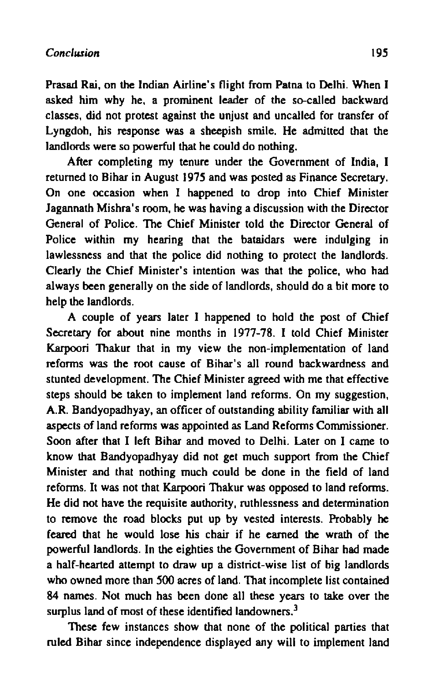

###### Conclusion 195

Prasad Rai, on the Indian Airline’s flight from Patna to Delhi. When I asked him why he, a prominent leader of the so-called backward classes, did not protest against the unjust and uncalled for transfer of Lyngdoh, his response was a sheepish smile. He admitted that the landlords were so powerful that he could do nothing.

After completing my tenure under the Government of India, I returned to Bihar in August 1975 and was posted as Finance Secretary. On one occasion when I happened to drop into Chief Minister Jagannath Mishra’s room, he was having a discussion with the Director General of Police. The Chief Minister told the Director General of Police within my hearing that the bataidars were indulging in lawlessness and that the police did nothing to protect the landlords. Clearly the Chief Minister’s intention was that the police, who had always been generally on the side of landlords, should do a bit more to help the landlords.

A couple of years later I happened to hold the post of Chief Secretary for about nine months in 1977-78. I told Chief Minister Karpoori Thakur that in my view the non-implementation of land reforms was the root cause of Bihar’s all round backwardness and stunted development. The Chief Minister agreed with me that effective steps should be taken to implement land reforms. On my suggestion, A.R. Bandyopadhyay, an officer of outstanding ability familiar with all aspects of land reforms was appointed as Land Reforms Commissioner. Soon after that I left Bihar and moved to Delhi. Later on I came to know that Bandyopadhyay did not get much support from the Chief Minister and that nothing much could be done in the field of land reforms. It was not that Karpoori Thakur was opposed to land reforms. He did not have the requisite authority, ruthlessness and determination to remove the road blocks put up by vested interests. Probably he feared that he would lose his chair if he earned the wrath of the powerful landlords. In the eighties the Government of Bihar had made a half-hearted attempt to draw up a district-wise list of big landlords who owned more than 500 acres of land. That incomplete list contained 84 names. Not much has been done all these years to take over the surplus land of most of these identified landowners.3

These few instances show that none of the political parties that ruled Bihar since independence displayed any will to implement land

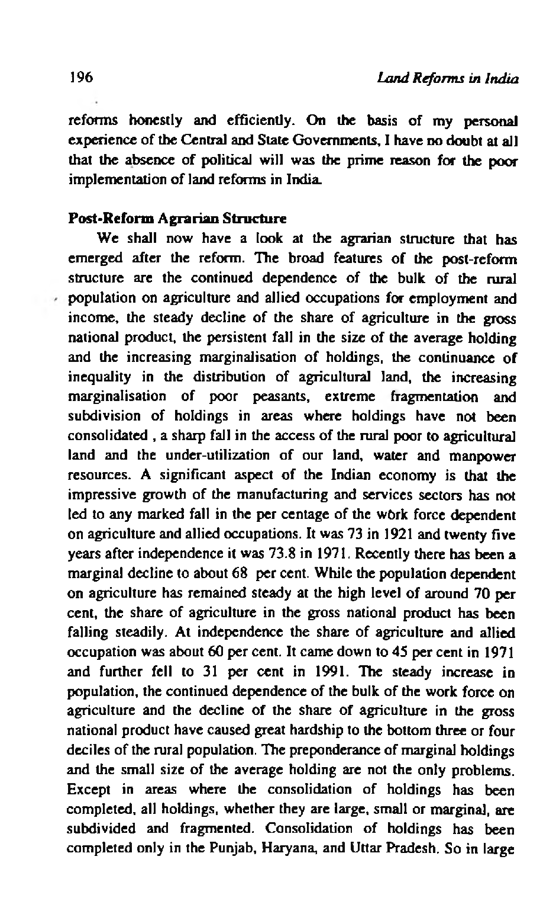

###### 196 Land Reforms in India

reforms honestly and efficiently. On the basis of my personal experience of the Central and State Governments, I have no doubt at all that the absence of political will was the prime reason for the poor implementation of land reforms in India.

###### Post-Reform Agrarian Structure

We shall now have a look at the agrarian structure that has emerged after the reform. The broad features of the post-reform structure are the continued dependence of the bulk of the rural population on agriculture and allied occupations for employment and income, the steady decline of the share of agriculture in the gross national product, the persistent fall in the size of the average holding and the increasing marginalisation of holdings, the continuance of inequality in the distribution of agricultural land, the increasing marginalisation of poor peasants, extreme fragmentation and subdivision of holdings in areas where holdings have not been consolidated , a sharp fall in the access of the rural poor to agricultural land and the under-utilization of our land, water and manpower resources. A significant aspect of the Indian economy is that the impressive growth of the manufacturing and services sectors has not led to any marked fall in the per centage of the wOrk force dependent on agriculture and allied occupations. It was 73 in 1921 and twenty five years after independence it was 73.8 in 1971. Recently there has been a marginal decline to about 68 per cent. While the population dependent on agriculture has remained steady at the high level of around 70 per cent, the share of agriculture in the gross national product has been falling steadily. At independence the share of agriculture and allied occupation was about 60 per cent. It came down to 45 per cent in 1971 and further fell to 31 per cent in 1991. The steady increase in population, the continued dependence of the bulk of the work force on agriculture and the decline of the share of agriculture in the gross national product have caused great hardship to the bottom three or four deciles of the rural population. The preponderance of marginal holdings and the small size of the average holding are not the only problems. Except in areas where the consolidation of holdings has been completed, all holdings, whether they are large, small or marginal, are subdivided and fragmented. Consolidation of holdings has been completed only in the Punjab, Haryana, and Uttar Pradesh. So in large

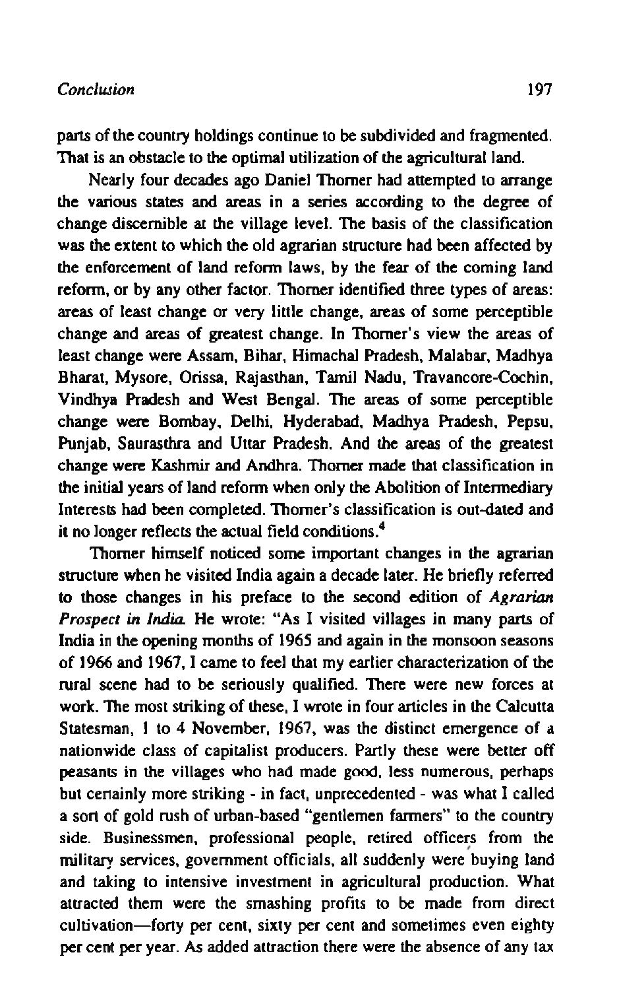

###### Conclusion 197

parts of the country holdings continue to be subdivided and fragmented. That is an obstacle to the optimal utilization of the agricultural land.

Nearly four decades ago Daniel Thomer had attempted to arrange the various states and areas in a series according to the degree of change discernible at the village level. The basis of the classification was the extent to which the old agrarian structure had been affected by the enforcement of land reform laws, by the fear of the coming land reform, or by any other factor. Thomer identified three types of areas: areas of least change or very little change, areas of some perceptible change and areas of greatest change. In Thomer’s view the areas of least change were Assam, Bihar, Himachal Pradesh, Malabar, Madhya Bharat, Mysore, Orissa, Rajasthan, Tamil Nadu, Travancore-Cochin, Vindhya Pradesh and West Bengal. The areas of some perceptible change were Bombay, Delhi, Hyderabad, Madhya Pradesh, Pepsu, Punjab, Saurasthra and Uttar Pradesh. And the areas of the greatest change were Kashmir and Andhra. Thomer made that classification in the initial years of land reform when only the Abolition of Intermediary Interests had been completed. Thomer’s classification is out-dated and it no longer reflects the actual field conditions.4

Thomer himself noticed some important changes in the agrarian structure when he visited India again a decade later. He briefly referred to those changes in his preface to the second edition of Agrarian Prospect in India. He wrote: “As I visited villages in many parts of India in the opening months of 1965 and again in the monsoon seasons of 1966 and 1967,1 came to feel that my earlier characterization of the rural scene had to be seriously qualified. There were new forces at work. The most striking of these, I wrote in four articles in the Calcutta Statesman, 1 to 4 November, 1967, was the distinct emergence of a nationwide class of capitalist producers. Partly these were better off peasants in the villages who had made good, less numerous, perhaps but certainly more striking - in fact, unprecedented - was what I called a sort of gold rush of urban-based “gentlemen farmers” to the country side. Businessmen, professional people, retired officers from the military services, government officials, all suddenly were buying land and taking to intensive investment in agricultural production. What attracted them were the smashing profits to be made from direct cultivation—forty per cent, sixty per cent and sometimes even eighty per cent per year. As added attraction there were the absence of any tax

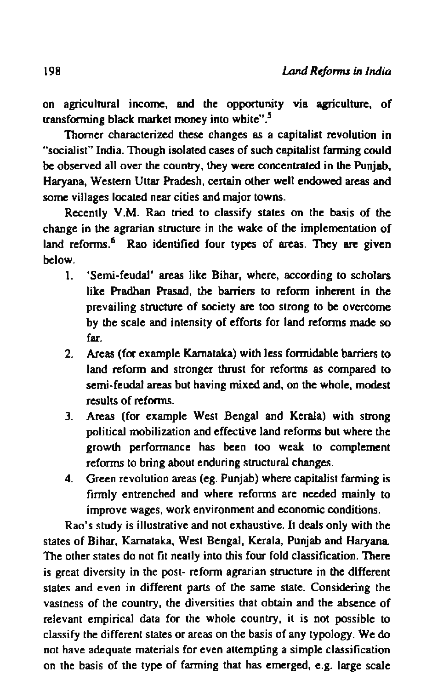

###### 198 Land Reforms in India

on agricultural income, and the opportunity via agriculture, of transforming black market money into white’*.5

Thomer characterized these changes as a capitalist revolution in “socialist” India. Though isolated cases of such capitalist farming could be observed all over the country, they were concentrated in the Punjab, Haryana, Western Uttar Pradesh, certain other well endowed areas and some villages located near cities and major towns.

Recently V.M. Rao tried to classify states on the basis of the change in the agrarian structure in the wake of the implementation of land reforms.6 Rao identified four types of areas. They are given below.

- 1. ‘Semi-feudal’ areas like Bihar, where, according to scholars like Pradhan Prasad, the barriers to reform inherent in the prevailing structure of society are too strong to be overcome by the scale and intensity of efforts for land reforms made so far.
- 2. Areas (for example Karnataka) with less formidable barriers to land reform and stronger thrust for reforms as compared to semi-feudal areas but having mixed and, on the whole, modest results of reforms.
- 3. Areas (for example West Bengal and Kerala) with strong political mobilization and effective land reforms but where the growth performance has been too weak to complement reforms to bring about enduring structural changes.
- 4. Green revolution areas (eg. Punjab) where capitalist farming is firmly entrenched and where reforms are needed mainly to improve wages, work environment and economic conditions.

Rao’s study is illustrative and not exhaustive. It deals only with the states of Bihar, Karnataka, West Bengal, Kerala, Punjab and Haryana. The other states do not fit neatly into this four fold classification. There is great diversity in the post- reform agrarian structure in the different states and even in different parts of the same state. Considering the vastness of the country, the diversities that obtain and the absence of relevant empirical data for the whole country, it is not possible to classify the different states or areas on the basis of any typology. We do not have adequate materials for even attempting a simple classification on the basis of the type of farming that has emerged, e.g. large scale

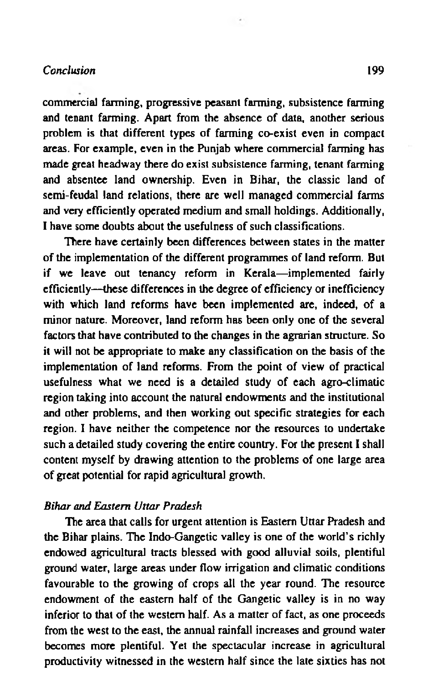

###### Conclusion 199

commercial farming, progressive peasant farming, subsistence farming and tenant farming. Apart from the absence of data, another serious problem is that different types of farming co-exist even in compact areas. For example, even in the Punjab where commercial fanning has made great headway there do exist subsistence farming, tenant farming and absentee land ownership. Even in Bihar, the classic land of semi-feudal land relations, there are well managed commercial farms and very efficiently operated medium and small holdings. Additionally, I have some doubts about the usefulness of such classifications.

There have certainly been differences between states in the matter of the implementation of the different programmes of land reform. But if we leave out tenancy reform in Kerala—implemented fairly efficiently—these differences in the degree of efficiency or inefficiency with which land reforms have been implemented are, indeed, of a minor nature. Moreover, land reform has been only one of the several factors that have contributed to the changes in the agrarian structure. So it will not be appropriate to make any classification on the basis of the implementation of land reforms. From the point of view of practical usefulness what we need is a detailed study of each agro-climatic region taking into account the natural endowments and the institutional and other problems, and then working out specific strategies for each region. I have neither the competence nor the resources to undertake such a detailed study covering the entire country. For the present I shall content myself by drawing attention to the problems of one large area of great potential for rapid agricultural growth.

Bihar and Eastern Uttar Pradesh

The area that calls for urgent attention is Eastern Uttar Pradesh and the Bihar plains. The Indo-Gangetic valley is one of the world’s richly endowed agricultural tracts blessed with good alluvial soils, plentiful ground water, large areas under flow irrigation and climatic conditions favourable to the growing of crops all the year round. The resource endowment of the eastern half of the Gangetic valley is in no way inferior to that of the western half. As a matter of fact, as one proceeds from the west to the east, the annual rainfall increases and ground water becomes more plentiful. Yet the spectacular increase in agricultural productivity witnessed in the western half since the late sixties has not

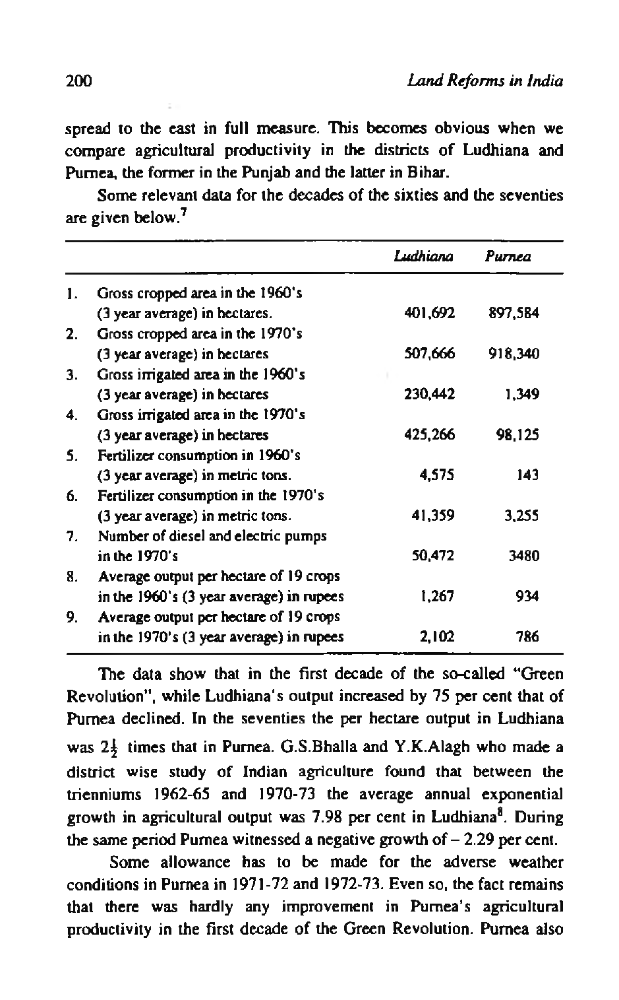

###### 200 Land Reforms in India

spread to the east in full measure. This becomes obvious when we compare agricultural productivity in the districts of Ludhiana and Pumea, the former in the Punjab and the latter in Bihar.

Some relevant data for the decades of the sixties and the seventies are given below.7

Ludhiana Pumea

- 1. Gross croppcd area in the 1960’s (3 year average) in hectares. 401,692 897,584
- 2. Gross cropped area in the 1970’s (3 year average) in hectares 507,666 918,340
- 3. Gross irrigated area in the 1960’s (3 year average) in hectares 230,442 1,349
- 4. Gross irrigated area in the 1970’s (3 year average) in hectares 425,266 98,125
- 5. Fertilizer consumption in 1960’s (3 year average) in metric tons. 4,575 143
- 6. Fertilizer consumption in the 1970’s (3 year average) in metric tons. 41,359 3,255
- 7. Number of diesel and electric pumps in the 1970’s 50,472 3480
- 8. Average output per hectare of 19 crops in the 1960’s (3 year average) in rupees 1,267 934
- 9. Average output per hectare of 19 crops in the 1970’s (3 year average) in rupees 2,102 786

The data show that in the first decade of the so-called “Green Revolution”, while Ludhiana’s output increased by 75 per cent that of Pumea declined. In the seventies the per hectare output in Ludhiana was 2 \ times that in Pumea. G.S.Bhalla and Y.K.Alagh who made a district wise study of Indian agriculture found that between the trienniums 1962-65 and 1970-73 the average annual exponential growth in agricultural output was 7.98 per cent in Ludhiana8. During the same period Pumea witnessed a negative growth of - 2.29 per cent.

Some allowance has to be made for the adverse weather conditions in Pumea in 1971-72 and 1972-73. Even so, the fact remains that there was hardly any improvement in Pumea’s agricultural productivity in the first decade of the Green Revolution. Pumea also

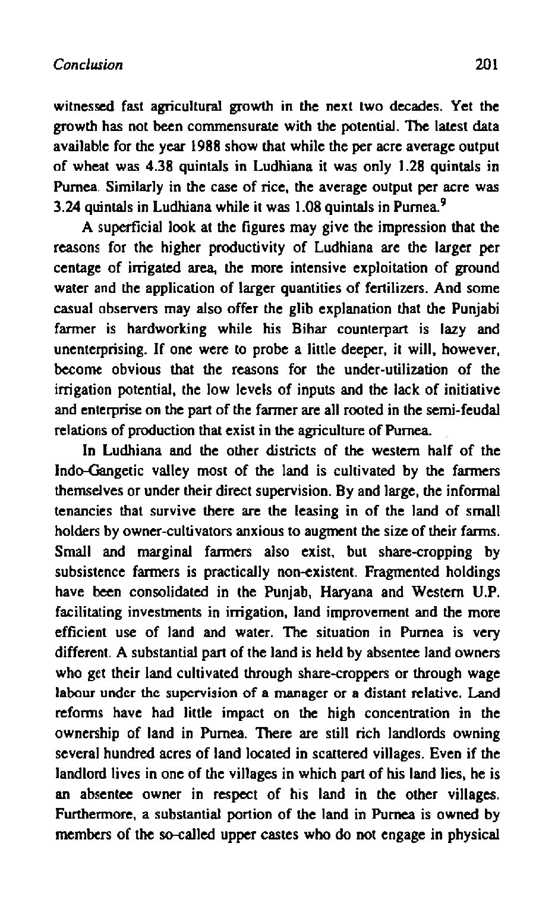

Conclusion 201

witnessed fast agricultural growth in the next two decades. Yet the growth has not been commensurate with the potential. The latest data available for the year 1988 show that while the per acre average output of wheat was 4.38 quintals in Ludhiana it was only 1.28 quintals in Pumea. Similarly in the case of rice, the average output per acre was 3.24 quintals in Ludhiana while it was 1.08 quintals in Pumea.9

A superficial look at the figures may give the impression that the reasons for the higher productivity of Ludhiana are the larger per centage of irrigated area, the more intensive exploitation of ground water and the application of larger quantities of fertilizers. And some casual observers may also offer the glib explanation that the Punjabi farmer is hardworking while his Bihar counterpart is lazy and unenterprising. If one were to probe a little deeper, it will, however, become obvious that the reasons for the under-utilization of the irrigation potential, the low levels of inputs and the lack of initiative and enterprise on the part of the farmer are all rooted in the semi-feudal relations of production that exist in the agriculture of Pumea.

In Ludhiana and the other districts of the western half of the Indo-Gangetic valley most of the land is cultivated by the farmers themselves or under their direct supervision. By and large, the informal tenancies that survive there are the leasing in of the land of small holders by owner-cultivators anxious to augment the size of their farms. Small and marginal farmers also exist, but share-cropping by subsistence farmers is practically non-existent. Fragmented holdings have been consolidated in the Punjab, Haryana and Western U.P. facilitating investments in irrigation, land improvement and the more efficient use of land and water. The situation in Pumea is very different. A substantial part of the land is held by absentee land owners who get their land cultivated through share-croppers or through wage labour under the supervision of a manager or a distant relative. Land reforms have had little impact on the high concentration in the ownership of land in Pumea. There are still rich landlords owning several hundred acres of land located in scattered villages. Even if the landlord lives in one of the villages in which part of his land lies, he is an absentee owner in respect of his land in the other villages. Furthermore, a substantial portion of the land in Pumea is owned by members of the so-called upper castes who do not engage in physical

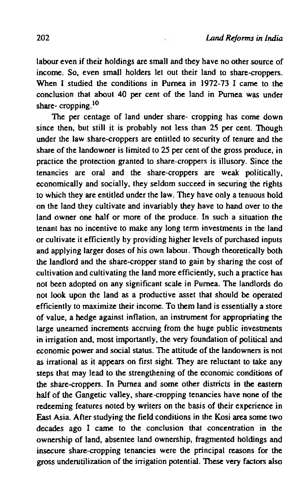

###### 202 Land Reforms in India

labour even if their holdings are small and they have no other source of income. So, even small holders let out their land to share-croppers. When I studied the conditions in Pumea in 1972-73 I came to the conclusion that about 40 per cent of the land in Pumea was under share- cropping.10

The per centage of land under share- cropping has come down since then, but still it is probably not less than 25 per cent. Though under the law share-croppers are entitled to security of tenure and the share of the landowner is limited to 25 per cent of the gross produce, in practice the protection granted to share-croppers is illusory. Since the tenancies are oral and the share-croppers are weak politically, economically and socially, they seldom succeed in securing the rights to which they are entitled under the law. They have only a tenuous hold on the land they cultivate and invariably they have to hand over to the land owner one half or more of the produce. In such a situation the tenant has no incentive to make any long term investments in the land or cultivate it efficiently by providing higher levels of purchased inputs and applying larger doses of his own laboui. Though theoretically both the landlord and the share-cropper stand to gain by sharing the cost of cultivation and cultivating the land more efficiently, such a practice has not been adopted on any significant scale in Pumea. The landlords do not look upon the land as a productive asset that should be operated efficiently to maximize their income. To them land is essentially a store of value, a hedge against inflation, an instrument for appropriating the large unearned increments accruing from the huge public investments in irrigation and, most importantly, the very foundation of political and economic power and social status. The attitude of the landowners is not as irrational as it appears on first sight. They are reluctant to take any steps that may lead to the strengthening of the economic conditions of the share-croppers. In Pumea and some other districts in the eastern half of the Gangetic valley, share-cropping tenancies have none of the redeeming features noted by writers on the basis of their experience in East Asia. After studying the field conditions in the Kosi area some two decades ago I came to the conclusion that concentration in the ownership of land, absentee land ownership, fragmented holdings and insecure share-cropping tenancies were the principal reasons for the gross underutilization of the irrigation potential. These very factors also

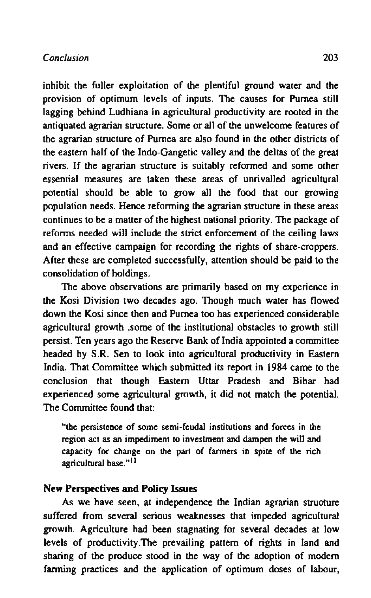

###### Conclusion 203

inhibit the fuller exploitation of the plentiful ground water and the provision of optimum levels of inputs. The causes for Pumea still lagging behind Ludhiana in agricultural productivity are rooted in the antiquated agrarian structure. Some or all of the unwelcome features of the agrarian structure of Purnea are also found in the other districts of the eastern half of the Indo-Gangetic valley and the deltas of the great rivers. If the agrarian structure is suitably reformed and some other essential measures are taken these areas of unrivalled agricultural potential should be able to grow all the food that our growing population needs. Hence reforming the agrarian structure in these areas continues to be a matter of the highest national priority. The package of reforms needed will include the strict enforcement of the ceiling laws and an effective campaign for recording the rights of share-croppers. After these are completed successfully, attention should be paid to the consolidation of holdings.

The above observations are primarily based on my experience in the Kosi Division two decades ago. Though much water has flowed down the Kosi since then and Purnea too has experienced considerable agricultural growth ,some of the institutional obstacles to growth still persist. Ten years ago the Reserve Bank of India appointed a committee headed by S.R. Sen to look into agricultural productivity in Eastern India. That Committee which submitted its report in 1984 came to the conclusion that though Eastern Uttar Pradesh and Bihar had experienced some agricultural growth, it did not match the potential. The Committee found that:

“the persistence of some semi-feudal institutions and forces in the region act as an impediment to investment and dampen the will and capacity for change on the part of farmers in spite of the rich agricultural base.”11

###### New Perspectives and Policy Issues

As we have seen, at independence the Indian agrarian structure suffered from several serious weaknesses that impeded agricultural growth. Agriculture had been stagnating for several decades at low levels of productivity .The prevailing pattern of rights in land and sharing of the produce stood in the way of the adoption of modem farming practices and the application of optimum doses of labour,

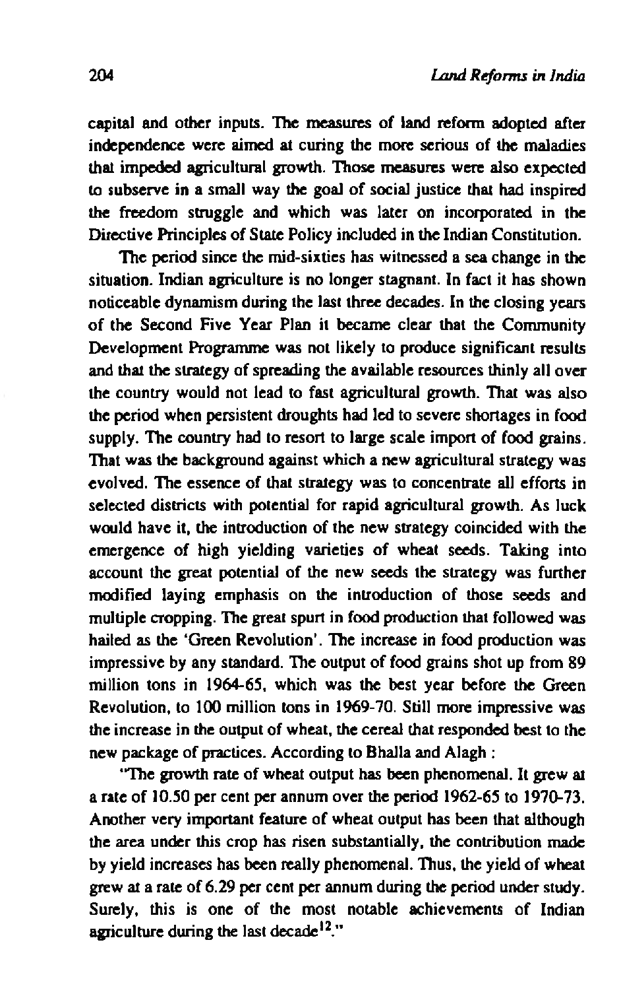

###### 204 Land Reforms in India

capital and other inputs. The measures of land reform adopted after independence were aimed at curing the more serious of the maladies that impeded agricultural growth. Those measures were also expected to subserve in a small way the goal of social justice that had inspired the freedom struggle and which was later on incorporated in the Directive Principles of State Policy included in the Indian Constitution.

The period since the mid-sixties has witnessed a sea change in the situation. Indian agriculture is no longer stagnant. In fact it has shown noticeable dynamism during the last three decades. In the closing years of the Second Five Year Plan it became clear that the Community Development Programme was not likely to produce significant results and that the strategy of spreading the available resources thinly all over the country would not lead to fast agricultural growth. That was also the period when persistent droughts had led to severe shortages in food supply. The country had to resort to large scale import of food grains. That was the background against which a new agricultural strategy was evolved. The essence of that strategy was to concentrate all efforts in selected districts with potential for rapid agricultural growth. As luck would have it, the introduction of the new strategy coincided with the emergence of high yielding varieties of wheat seeds. Taking into account the great potential of the new seeds the strategy was further modified laying emphasis on the introduction of those seeds and multiple cropping. The great spurt in food production that followed was hailed as the ‘Green Revolution*. The increase in food production was impressive by any standard. The output of food grains shot up from 89 million tons in 1964-65, which was the best year before the Green Revolution, to 100 million tons in 1969-70. Still more impressive was the increase in the output of wheat, the cereal that responded best to the new package of practices. According to Bhalla and Alagh :

“The growth rate of wheat output has been phenomenal. It grew at a rate of 10.50 per cent per annum over the period 1962-65 to 1970-73. Another very important feature of wheat output has been that although the area under this crop has risen substantially, the contribution made by yield increases has been really phenomenal. Thus, the yield of wheat grew at a rate of 6.29 per cent per annum during the period under study. Surely, this is one of the most notable achievements of Indian agriculture during the last decade12.’*

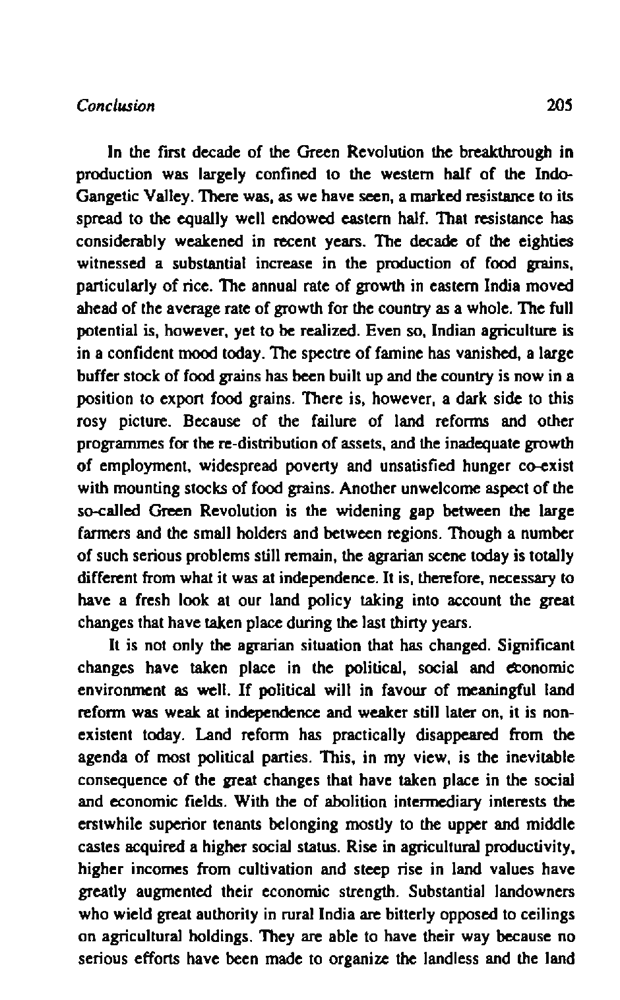

###### Conclusion 205

In the first decade of the Green Revolution the breakthrough in production was largely confined to the western half of the IndoGangetic Valley. There was, as we have seen, a marked resistance to its spread to the equally well endowed eastern half. That resistance has considerably weakened in recent years. The decade of the eighties witnessed a substantial increase in the production of food grains, particularly of rice. The annual rate of growth in eastern India moved ahead of the average rate of growth for the country as a whole. The full potential is, however, yet to be realized. Even so, Indian agriculture is in a confident mood today. The spectre of famine has vanished, a large buffer stock of food grains has been built up and the country is now in a position to export food grains. There is, however, a dark side to this rosy picture. Because of the failure of land reforms and other programmes for the re-distribution of assets, and the inadequate growth of employment, widespread poverty and unsatisfied hunger co-exist with mounting stocks of food grains. Another unwelcome aspect of the so-called Green Revolution is the widening gap between the large farmers and the small holders and between regions. Though a number of such serious problems still remain, the agrarian scene today is totally different from what it was at independence. It is, therefore, necessary to have a fresh look at our land policy taking into account the great changes that have taken place during the last thirty years.

It is not only the agrarian situation that has changed. Significant changes have taken place in the political, social and economic environment as well. If political will in favour of meaningful land reform was weak at independence and weaker still later on, it is nonexistent today. Land reform has practically disappeared from the agenda of most political parties. This, in my view, is the inevitable consequence of the great changes that have taken place in the social and economic fields. With the of abolition intermediary interests the erstwhile superior tenants belonging mostly to the upper and middle castes acquired a higher social status. Rise in agricultural productivity, higher incomes from cultivation and steep rise in land values have greatly augmented their economic strength. Substantial landowners who wield great authority in rural India are bitterly opposed to ceilings on agricultural holdings. They are able to have their way because no serious efforts have been made to organize the landless and the land

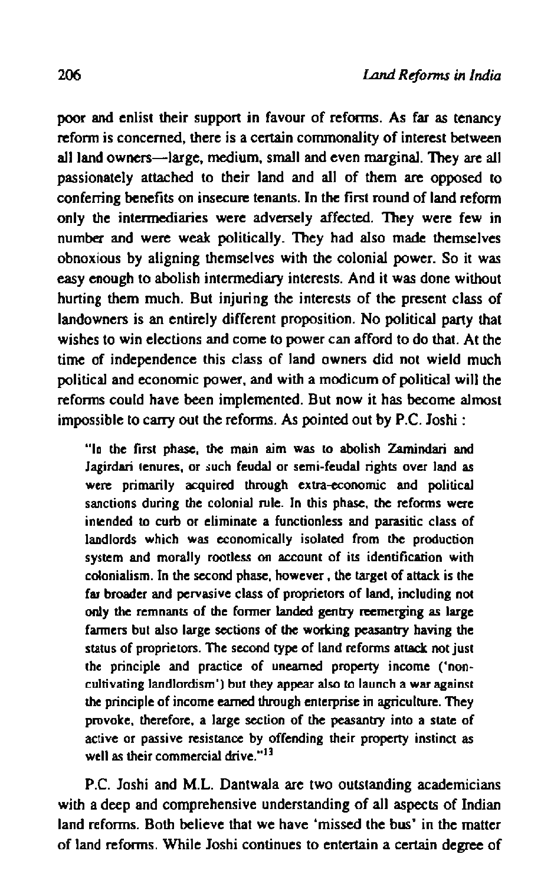

###### 206 Land Reforms in India

poor and enlist their support in favour of reforms. As far as tenancy reform is concerned, there is a certain commonality of interest between all land owners—large, medium, small and even marginal. They are all passionately attached to their land and all of them are opposed to conferring benefits on insecure tenants. In the first round of land reform only the intermediaries were adversely affected. They were few in number and were weak politically. They had also made themselves obnoxious by aligning themselves with the colonial power. So it was easy enough to abolish intermediary interests. And it was done without hurting them much. But injuring the interests of the present class of landowners is an entirely different proposition. No political party that wishes to win elections and come to power can afford to do that. At the time of independence this class of land owners did not wield much political and economic power, and with a modicum of political will the reforms could have been implemented. But now it has become almost impossible to carry out the reforms. As pointed out by P.C. Joshi:

“In the first phase, the main aim was to abolish Zamindari and Jagirdari tenures, or such feudal or semi-feudal rights over land as were primarily acquired through extra-economic and political sanctions during the colonial rule. In this phase, the reforms were intended to curb or eliminate a functionless and parasitic class of landlords which was economically isolated from the production system and morally rootless on account of its identification with colonialism. In the second phase, however, the target of attack is the far broader and pervasive class of proprietors of land, including not only tlie remnants of the former landed gentry reemerging as large farmers but also large sections of the working peasantry having the status of proprietors. The second type of land reforms attack not just the principle and practice of unearned property income (‘noncultivating landlordism’) but they appear also to launch a war against the principle of income earned through enterprise in agriculture. They provoke, therefore, a large section of the peasantry into a state of active or passive resistance by offending their property instinct as well as their commercial drive.”13

P.C. Joshi and M.L. Dantwala are two outstanding academicians with a deep and comprehensive understanding of all aspects of Indian land reforms. Both believe that we have ‘missed the bus’ in the matter of land reforms. While Joshi continues to entertain a certain degree of

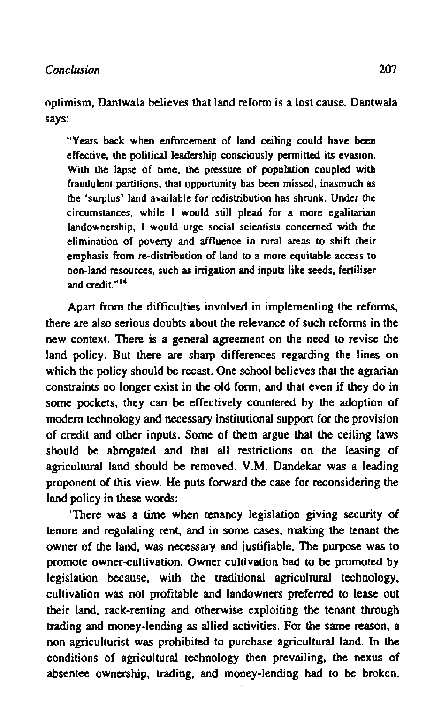

###### Conclusion 207

optimism, Dantwala believes that land reform is a lost cause. Dantwala says:

“Years back when enforcement of land ceiling could have been effective, the political leadership consciously permitted its evasion. With the lapse of time, the pressure of population coupled with fraudulent partitions, that opportunity has been missed, inasmuch as the ‘surplus’ land available for redistribution has shrunk. Under the circumstances, while I would still plead for a more egalitarian landownership, I would urge social scientists concerned with the elimination of poverty and affluence in rural areas to shift their emphasis from re-distribution of land to a more equitable access to non-land resources, such as irrigation and inputs like seeds, fertiliser and credit.”14

Apart from the difficulties involved in implementing the reforms, there are also serious doubts about the relevance of such reforms in the new context. There is a general agreement on the need to revise the land policy. But there are sharp differences regarding the lines on which the policy should be recast. One school believes that the agrarian constraints no longer exist in the old form, and that even if they do in some pockets, they can be effectively countered by the adoption of modem technology and necessary institutional support for the provision of credit and other inputs. Some of them argue that the ceiling laws should be abrogated and that all restrictions on the leasing of agricultural land should be removed. V.M. Dandekar was a leading proponent of this view. He puts forward the case for reconsidering the land policy in these words:

‘There was a time when tenancy legislation giving security of tenure and regulating rent, and in some cases, making the tenant the owner of the land, was necessary and justifiable. The purpose was to promote owner-cultivation. Owner cultivation had to be promoted by legislation because, with the traditional agricultural technology, cultivation was not profitable and landowners preferred to lease out their land, rack-renting and otherwise exploiting the tenant through trading and money-lending as allied activities. For the same reason, a non-agriculturist was prohibited to purchase agricultural land. In the conditions of agricultural technology then prevailing, the nexus of absentee ownership, trading, and money-lending had to be broken.

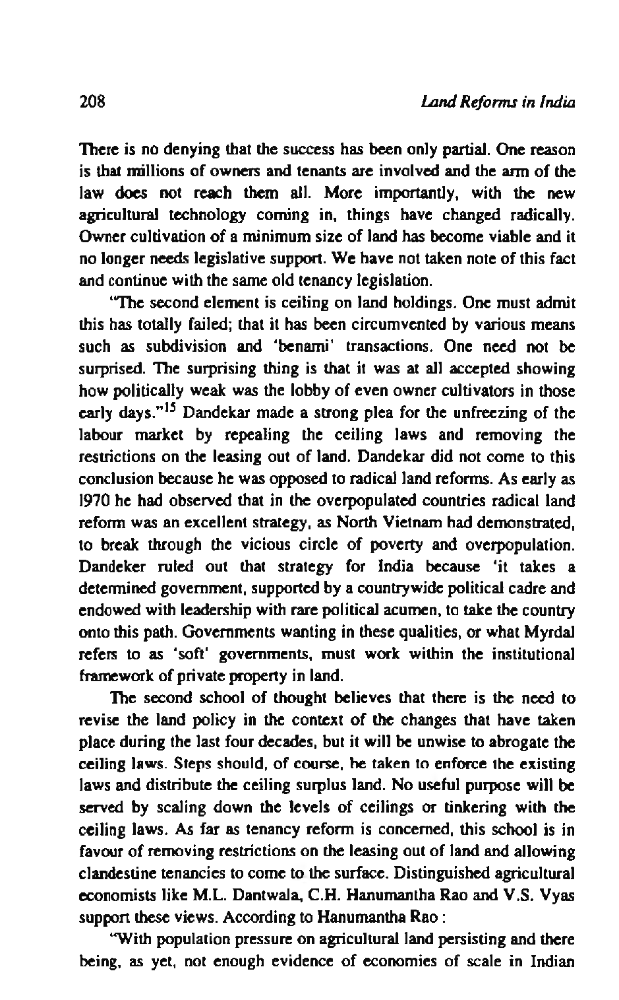

###### 208 Land Reforms in India

There is no denying that the success has been only partial. One reason is that millions of owners and tenants are involved and the arm of the law does not reach them all. More importantly, with the new agricultural technology coming in, things have changed radically. Owner cultivation of a minimum size of land has become viable and it no longer needs legislative support. We have not taken note of this fact and continue with the same old tenancy legislation.

“The second element is ceiling on land holdings. One must admit this has totally failed; that it has been circumvented by various means such as subdivision and ‘benami’ transactions. One need not be surprised. The surprising thing is that it was at all accepted showing how politically weak was the lobby of even owner cultivators in those early days.”15 Dandekar made a strong plea for the unfreezing of the labour market by repealing the ceiling laws and removing the restrictions on the leasing out of land. Dandekar did not come to this conclusion because he was opposed to radical land reforms. As early as 1970 he had observed that in the overpopulated countries radical land reform was an excellent strategy, as North Vietnam had demonstrated, to break through the vicious circle of poverty and overpopulation. Dandeker ruled out that strategy for India because *it takes a determined government, supported by a countrywide political cadre and endowed with leadership with rare political acumen, to take the country onto this path. Governments wanting in these qualities, or what Myrdal refers to as ‘soft’ governments, must work within the institutional framework of private property in land.

The second school of thought believes that there is the need to revise the land policy in the context of the changes that have taken place during the last four decades, but it will be unwise to abrogate the ceiling laws. Steps should, of course, be taken to enforce the existing laws and distribute the ceiling surplus land. No useful purpose will be served by scaling down the levels of ceilings or tinkering with the ceiling laws. As far as tenancy reform is concerned, this school is in favour of removing restrictions on the leasing out of land and allowing clandestine tenancies to come to the surface. Distinguished agricultural economists like M.L. Dantwala, C.H. Hanumantha Rao and V.S. Vyas support these views. According to Hanumantha Rao:

“With population pressure on agricultural land persisting and there being, as yet, not enough evidence of economies of scale in Indian

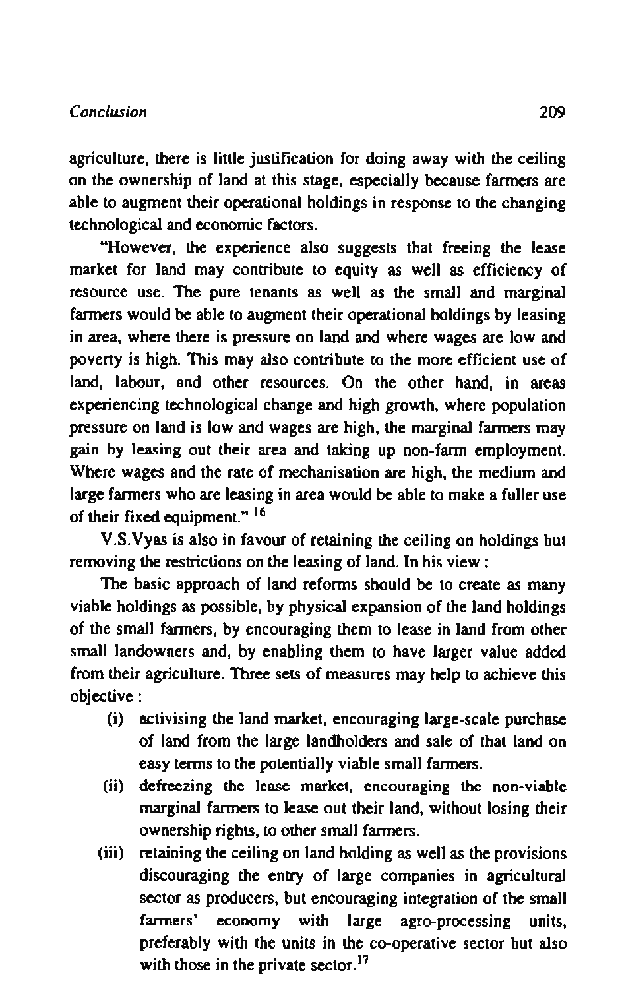

###### Conclusion 209

agriculture, there is little justification for doing away with the ceiling on the ownership of land at this stage, especially because farmers are able to augment their operational holdings in response to the changing technological and economic factors.

“However, the experience also suggests that freeing the lease market for land may contribute to equity as well as efficiency of resource use. The pure tenants as well as the small and marginal farmers would be able to augment their operational holdings by leasing in area, where there is pressure on land and where wages are low and poverty is high. This may also contribute to the more efficient use of land, labour, and other resources. On the other hand, in areas experiencing technological change and high growth, where population pressure on land is low and wages are high, the marginal farmers may gain by leasing out their area and taking up non-farm employment. Where wages and the rate of mechanisation are high, the medium and large farmers who are leasing in area would be able to make a fuller use of their fixed equipment.” 16

V.S.Vyas is also in favour of retaining the ceiling on holdings but removing the restrictions on the leasing of land. In his view :

The basic approach of land reforms should be to create as many viable holdings as possible, by physical expansion of the land holdings of the small farmers, by encouraging them to lease in land from other small landowners and, by enabling them to have larger value added from their agriculture. Three sets of measures may help to achieve this objective:

- (i) activising the land market, encouraging large-scale purchase of land from the large landholders and sale of that land on easy terms to the potentially viable small farmers.
- (ii) defreezing the lease market, encouraging the non-viablc marginal farmers to lease out their land, without losing their ownership rights, to other small farmers.
- (iii) retaining the ceiling on land holding as well as the provisions discouraging the entry of large companies in agricultural sector as producers, but encouraging integration of the small farmers’ economy with large agro-processing units, preferably with the units in the co-operative sector but also with those in the private sector.17

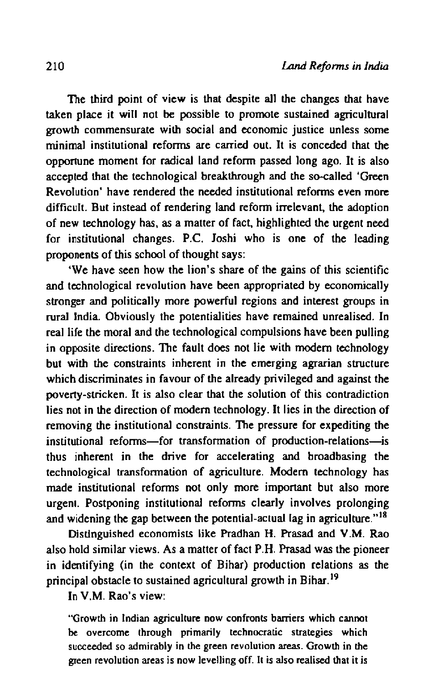

###### 210 Land Reforms in India

The third point of view is that despite all the changes that have taken place it will not be possible to promote sustained agricultural growth commensurate with social and economic justice unless some minimal institutional reforms are carried out. It is conceded that the opportune moment for radical land reform passed long ago. It is also accepted that the technological breakthrough and the so-called ‘Green Revolution’ have rendered the needed institutional reforms even more difficult. But instead of rendering land reform irrelevant, the adoption of new technology has, as a matter of fact, highlighted the urgent need for institutional changes. P.C. Joshi who is one of the leading proponents of this school of thought says:

‘We have seen how the lion’s share of the gains of this scientific and technological revolution have been appropriated by economically stronger and politically more powerful regions and interest groups in rural India. Obviously the potentialities have remained unrealised. In real life the moral and the technological compulsions have been pulling in opposite directions. The fault does not lie with modern technology but with the constraints inherent in the emerging agrarian structure which discriminates in favour of the already privileged and against the poverty-stricken. It is also clear that the solution of this contradiction lies not in the direction of modem technology. It lies in the direction of removing the institutional constraints. The pressure for expediting the institutional reforms—for transformation of production-relations—is thus inherent in the drive for accelerating and broadbasing the technological transformation of agriculture. Modern technology has made institutional reforms not only more important but also more urgent. Postponing institutional reforms clearly involves prolonging and widening the gap between the potential-actual lag in agriculture.”18

Distinguished economists like Pradhan H. Prasad and V.M. Rao also hold similar views. As a matter of fact P.H. Prasad was the pioneer in identifying (in the context of Bihar) production relations as the principal obstacle to sustained agricultural growth in Bihar.19

In V.M. Rao’s view:

“Growth in Indian agriculture now confronts barriers which cannot be overcome through primarily technocratic strategies which succeeded so admirably in the green revolution areas. Growth in the green revolution areas is now levelling off. It is also realised that it is

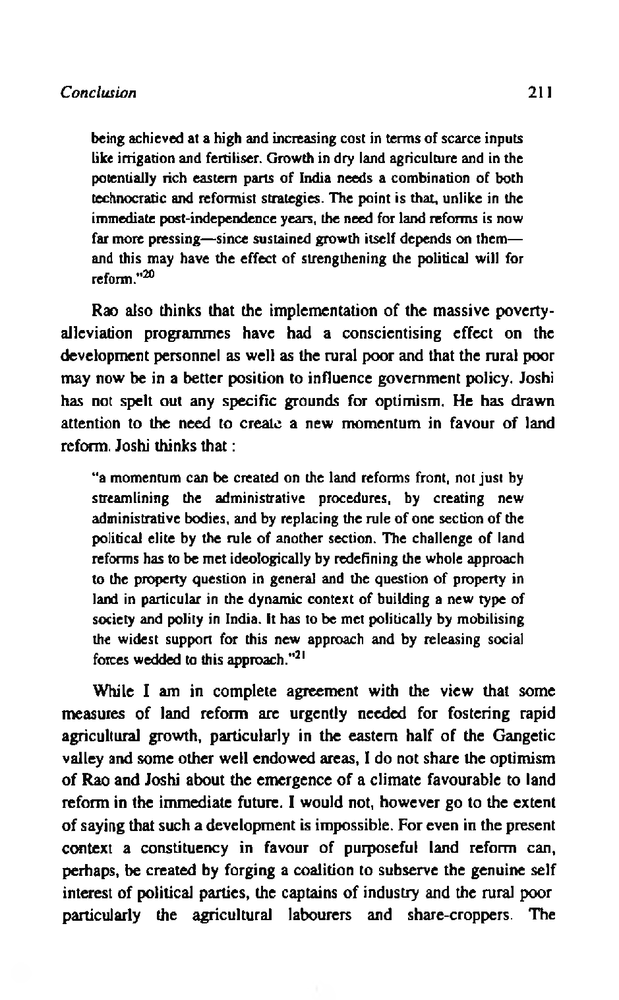

###### Conclusion 211

being achieved at a high and increasing cost in terms of scarce inputs like irrigation and fertiliser. Growth in dry land agriculture and in the potentially rich eastern parts of India needs a combination of both technocratic and reformist strategies. The point is that, unlike in the immediate post-independence years, the need for land reforms is now far more pressing—since sustained growth itself depends on themand this may have the effect of strengthening the political will for reform.”20

Rao also thinks that the implementation of the massive povertyalleviation programmes have had a conscientising effect on the development personnel as well as the rural poor and that the rural poor may now be in a better position to influence government policy. Joshi has not spelt out any specific grounds for optimism. He has drawn attention to the need to create a new momentum in favour of land reform. Joshi thinks that:

“a momentum can be created on the land reforms front, not just by streamlining the administrative procedures, by creating new administrative bodies, and by replacing the rule of one section of the political elite by the rule of another section. The challenge of land reforms has to be met ideologically by redefining the whole approach to the property question in general and the question of property in land in particular in the dynamic context of building a new type of society and polity in India. It has to be met politically by mobilising the widest support for this new approach and by releasing social forces wedded to this approach.”21

While I am in complete agreement with the view that some measures of land reform are urgendy needed for fostering rapid agricultural growth, particularly in the eastern half of the Gangetic valley and some other well endowed areas, I do not share the optimism of Rao and Joshi about the emergence of a climate favourable to land reform in the immediate future. I would not, however go to the extent of saying that such a development is impossible. For even in the present context a constituency in favour of purposeful land reform can, perhaps, be created by forging a coalition to subserve the genuine self interest of political parties, the captains of industry and the rural poor particularly the agricultural labourers and share-croppers. The

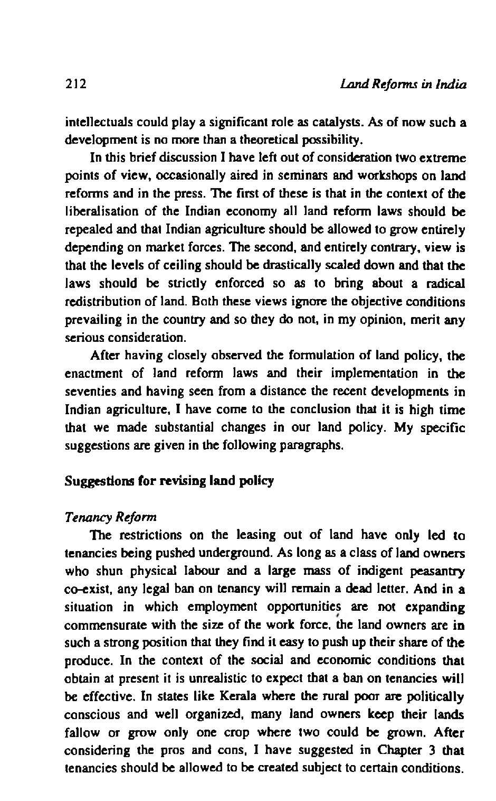

###### 212 Land Reforms in India

intellectuals could play a significant role as catalysts. As of now such a development is no more than a theoretical possibility.

In this brief discussion I have left out of consideration two extreme points of view, occasionally aired in seminars and workshops on land reforms and in the press. The first of these is that in the context of the liberalisation of the Indian economy all land reform laws should be repealed and that Indian agriculture should be allowed to grow entirely depending on market forces. The second, and entirely contrary, view is that the levels of ceiling should be drastically scaled down and that the laws should be strictly enforced so as to bring about a radical redistribution of land. Both these views ignore the objective conditions prevailing in the country and so they do not, in my opinion, merit any serious consideration.

After having closely observed the formulation of land policy, the enactment of land reform laws and their implementation in the seventies and having seen from a distance the recent developments in Indian agriculture, I have come to the conclusion that it is high time that we made substantial changes in our land policy. My specific suggestions are given in the following paragraphs.

###### Suggestions for revising land policy

Tenancy Reform

The restrictions on the leasing out of land have only led to tenancies being pushed underground. As long as a class of land owners who shun physical labour and a large mass of indigent peasantry co-exist, any legal ban on tenancy will remain a dead letter. And in a situation in which employment opportunities are not expanding commensurate with the size of the work force, the land owners are in such a strong position that they find it easy to push up their share of the produce. In the context of the social and economic conditions that obtain at present it is unrealistic to expect that a ban on tenancies will be effective. In states like Kerala where the rural poor are politically conscious and well organized, many land owners keep their lands fallow or grow only one crop where two could be grown. After considering the pros and cons, I have suggested in Chapter 3 that tenancies should be allowed to be created subject to certain conditions.

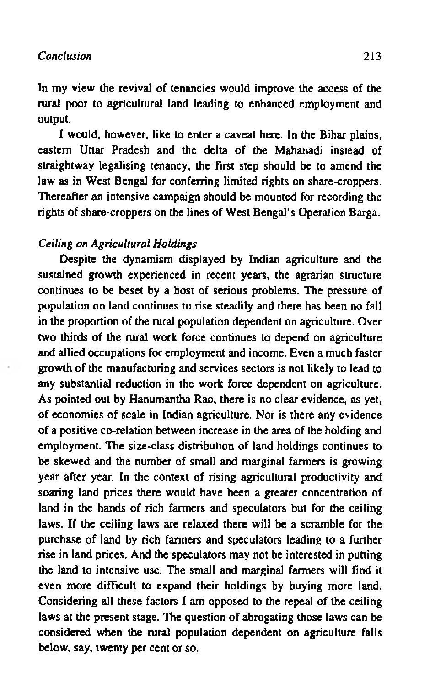

###### Conclusion 213

In my view the revival of tenancies would improve the access of the rural poor to agricultural land leading to enhanced employment and output.

I would, however, like to enter a caveat here. In the Bihar plains, eastern Uttar Pradesh and the delta of the Mahanadi instead of straightway legalising tenancy, the first step should be to amend the law as in West Bengal for conferring limited rights on share-croppers. Thereafter an intensive campaign should be mounted for recording the rights of share-croppers on the lines of West Bengal’s Operation Barga.

Ceiling on Agricultural Holdings

Despite the dynamism displayed by Indian agriculture and the sustained growth experienced in recent years, the agrarian structure continues to be beset by a host of serious problems. The pressure of population on land continues to rise steadily and there has been no fall in the proportion of the rural population dependent on agriculture. Over two thirds of the rural work force continues to depend on agriculture and allied occupations for employment and income. Even a much faster growth of the manufacturing and services sectors is not likely to lead to any substantial reduction in the work force dependent on agriculture. As pointed out by Hanumantha Rao, there is no clear evidence, as yet, of economies of scale in Indian agriculture. Nor is there any evidence of a positive co-relation between increase in the area of the holding and employment. The size-class distribution of land holdings continues to be skewed and the number of small and marginal farmers is growing year after year. In the context of rising agricultural productivity and soaring land prices there would have been a greater concentration of land in the hands of rich farmers and speculators but for the ceiling laws. If the ceiling laws are relaxed there will be a scramble for the purchase of land by rich farmers and speculators leading to a further rise in land prices. And the speculators may not be interested in putting the land to intensive use. The small and marginal farmers will find it even more difficult to expand their holdings by buying more land. Considering all these factors I am opposed to the repeal of the ceiling laws at the present stage. The question of abrogating those laws can be considered when the rural population dependent on agriculture falls below, say, twenty per cent or so.

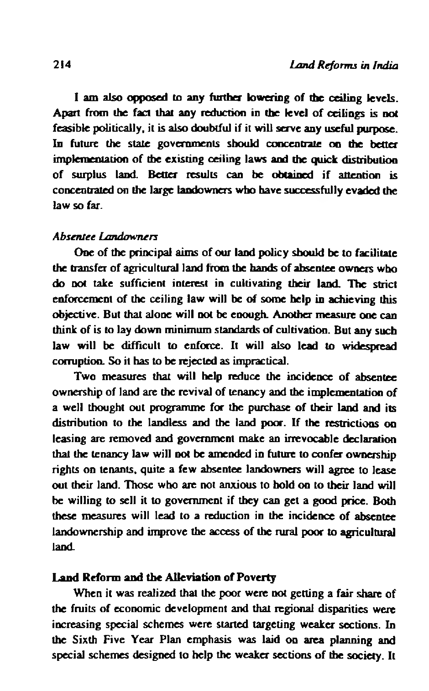

###### 214 Land Reforms in India

I am also opposed to any further lowering of the ceiling levels. Apart from the fact that any reduction in the level of ceilings is not feasible politically, it is also doubtful if it will serve any useful purpose. In future the state governments should concentrate on the better implementation of the existing ceiling laws and the quick distribution of surplus land. Better results can be obtained if attention is concentrated on the large landowners who have successfully evaded the law so far.

Absentee Landowners

One of the principal aims of our land policy should be to facilitate the transfer of agricultural land from the hands of absentee owners who do not take sufficient interest in cultivating their land. The strict enforcement of the ceiling law will be of some help in achieving this objective. But that alone will not be enough. Another measure one can think of is to lay down minimum standards of cultivation. But any such law will be difficult to enforce. It will also lead to widespread corruption. So it has to be rejected as impractical.

Two measures that will help reduce the incidence of absentee ownership of land are the revival of tenancy and the implementation of a well thought out programme for the purchase of their land and its distribution to the landless and the land poor. If the restrictions on leasing are removed and government make an irrevocable declaration that the tenancy law will not be amended in future to confer ownership rights on tenants, quite a few absentee landowners will agree to lease out their land. Those who are not anxious to hold on to their land will be willing to sell it to government if they can get a good price. Both these measures will lead to a reduction in the incidence of absentee landownership and improve the access of the rural poor to agricultural land.

###### Land Reform and the Alleviation of Poverty

When it was realized that the poor were not getting a fair share of the fruits of economic development and that regional disparities were increasing special schemes were started targeting weaker sections. In the Sixth Five Year Plan emphasis was laid on area planning and special schemes designed to help the weaker sections of the society. It

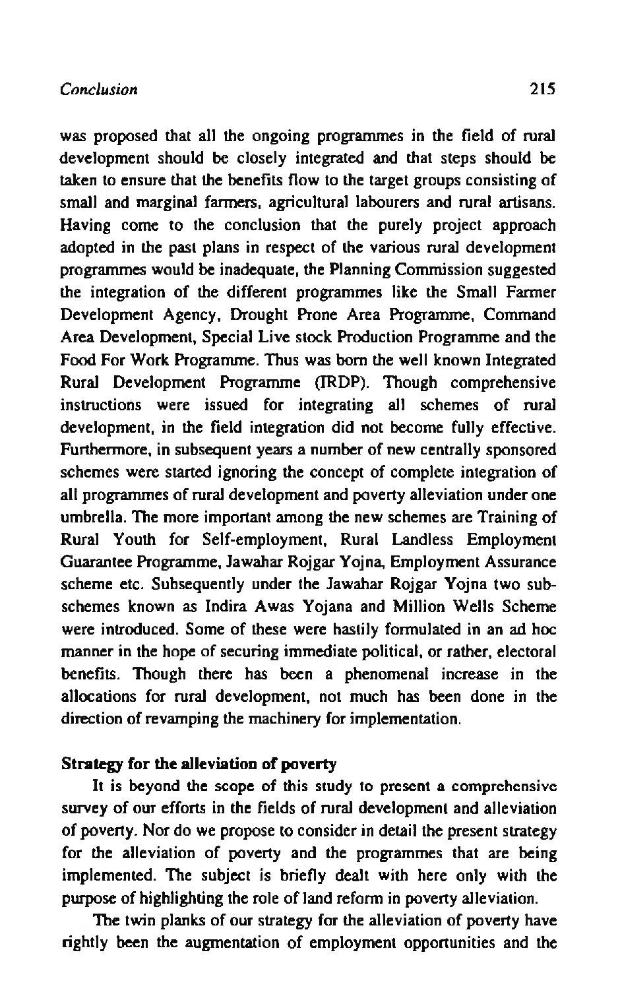

###### Conclusion 215

was proposed that all the ongoing programmes in the field of rural development should be closely integrated and that steps should be taken to ensure that the benefits flow to the target groups consisting of small and marginal farmers, agricultural labourers and rural artisans. Having come to the conclusion that the purely project approach adopted in the past plans in respect of the various rural development programmes would be inadequate, the Planning Commission suggested the integration of the different programmes like the Small Farmer Development Agency, Drought Prone Area Programme, Command Area Development, Special Live stock Production Programme and the Food For Work Programme. Thus was bom the well known Integrated Rural Development Programme (IRDP). Though comprehensive instructions were issued for integrating all schemes of rural development, in the field integration did not become fully effective. Furthermore, in subsequent years a number of new centrally sponsored schemes were started ignoring the concept of complete integration of all programmes of rural development and poverty alleviation under one umbrella. The more important among the new schemes are Training of Rural Youth for Self-employment, Rural Landless Employment Guarantee Programme, Jawahar Rojgar Yojna, Employment Assurance scheme etc. Subsequently under the Jawahar Rojgar Yojna two subschemes known as Indira Awas Yojana and Million Wells Scheme were introduced. Some of these were hastily formulated in an ad hoc manner in the hope of securing immediate political, or rather, electoral benefits. Though there has been a phenomenal increase in the allocations for rural development, not much has been done in the direction of revamping the machinery for implementation.

###### Strategy for the alleviation of poverty

It is beyond the scope of this study to present a comprehensive survey of our efforts in the fields of rural development and alleviation of poverty. Nor do we propose to consider in detail the present strategy for the alleviation of poverty and the programmes that are being implemented. The subject is briefly dealt with here only with the purpose of highlighting the role of land reform in poverty alleviation.

The twin planks of our strategy for the alleviation of poverty have rightly been the augmentation of employment opportunities and the

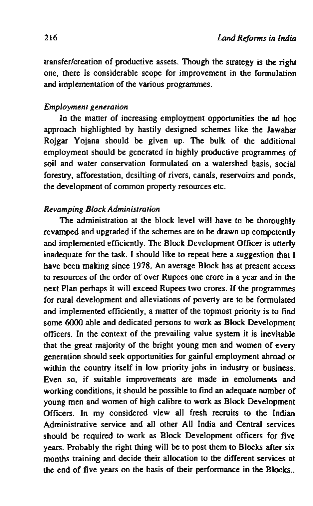

###### 216 Land Reforms in India

transfer/creation of productive assets. Though the strategy is the right one, there is considerable scope for improvement in the formulation and implementation of the various programmes.

Employment generation

In the matter of increasing employment opportunities the ad hoc approach highlighted by hastily designed schemes like the Jawahar Rojgar Yojana should be given up. The bulk of the additional employment should be generated in highly productive programmes of soil and water conservation formulated on a watershed basis, social forestry, afforestation, desilting of rivers, canals, reservoirs and ponds, the development of common property resources etc.

Revamping Block Administration

The administration at the block level will have to be thoroughly revamped and upgraded if the schemes are to be drawn up competently and implemented efficiently. The Block Development Officer is utterly inadequate for the task. I should like to repeat here a suggestion that I have been making since 1978. An average Block has at present access to resources of the order of over Rupees one crore in a year and in the next Plan perhaps it will exceed Rupees two crores. If the programmes for rural development and alleviations of poverty are to be formulated and implemented efficiently, a matter of the topmost priority is to find some 6000 able and dedicated persons to work as Block Development officers. In the context of the prevailing value system it is inevitable that the great majority of the bright young men and women of every generation should seek opportunities for gainful employment abroad or within the country itself in low priority jobs in industry or business. Even so, if suitable improvements are made in emoluments and working conditions, it should be possible to find an adequate number of young men and women of high calibre to work as Block Development Officers. In my considered view all fresh recruits to the Indian Administrative service and all other All India and Central services should be required to work as Block Development officers for five years. Probably the right thing will be to post them to Blocks after six months training and decide their allocation to the different services at the end of five years on the basis of their performance in the Blocks..

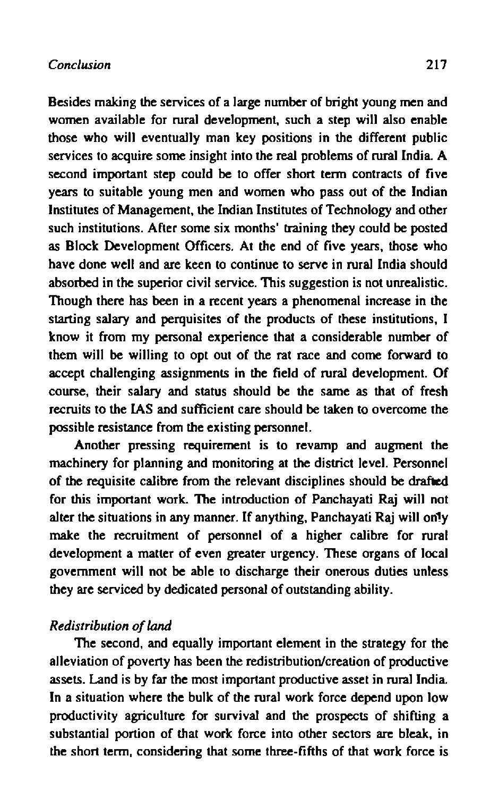

###### Conclusion 217

Besides making the services of a large number of bright young men and women available for rural development, such a step will also enable those who will eventually man key positions in the different public services to acquire some insight into the real problems of rural India. A second important step could be to offer short term contracts of five years to suitable young men and women who pass out of the Indian Institutes of Management, the Indian Institutes of Technology and other such institutions. After some six months* training they could be posted as Block Development Officers. At the end of five years, those who have done well and are keen to continue to serve in rural India should absorbed in the superior civil service. This suggestion is not unrealistic. Though there has been in a recent years a phenomenal increase in the starting salary and perquisites of the products of these institutions, I know it from my personal experience that a considerable number of them will be willing to opt out of the rat race and come forward to accept challenging assignments in the field of rural development. Of course, their salary and status should be the same as that of fresh recruits to the IAS and sufficient care should be taken to overcome the possible resistance from the existing personnel.

Another pressing requirement is to revamp and augment the machinery for planning and monitoring at the district level. Personnel of the requisite calibre from the relevant disciplines should be drafted for this important work. The introduction of Panchayati Raj will not alter the situations in any manner. If anything, Panchayati Raj will only make the recruitment of personnel of a higher calibre for rural development a matter of even greater urgency. These organs of local government will not be able to discharge their onerous duties unless they are serviced by dedicated personal of outstanding ability.

Redistribution o f land

The second, and equally important element in the strategy for the alleviation of poverty has been the redistribution/creation of productive assets. Land is by far the most important productive asset in rural India. In a situation where the bulk of the rural work force depend upon low productivity agriculture for survival and the prospects of shifting a substantial portion of that work force into other sectors are bleak, in the short term, considering that some three-fifths of that work force is

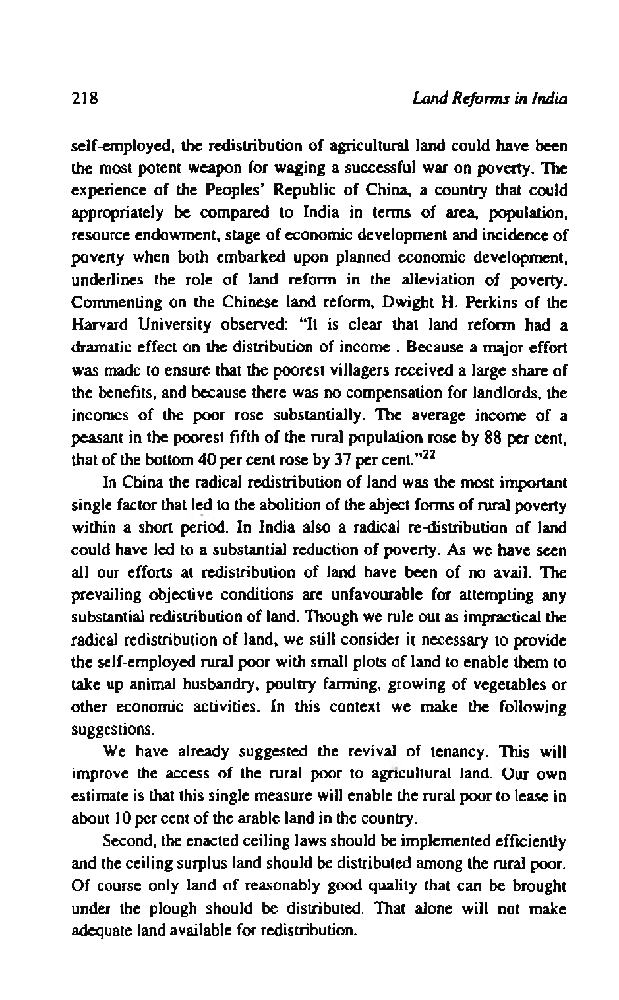

###### 218 Land Reforms in India

self-employed, the redistribution of agricultural land could have been the most potent weapon for waging a successful war on poverty. The experience of the Peoples’ Republic of China, a country that could appropriately be compared to India in terms of area, population, resource endowment, stage of economic development and incidence of poverty when both embarked upon planned economic development, underlines the role of land reform in the alleviation of poverty. Commenting on the Chinese land reform, Dwight H. Perkins of the Harvard University observed: “It is clear that land reform had a dramatic effect on the distribution of income . Because a major effort was made to ensure that the poorest villagers received a large share of the benefits, and because there was no compensation for landlords, the incomes of the poor rose substantially. The average income of a peasant in the poorest fifth of the rural population rose by 88 per cent, that of the bottom 40 per cent rose by 37 per cent.”22

In China the radical redistribution of land was the most important single factor that led to the abolition of the abject forms of rural poverty within a short period. In India also a radical re-distribution of land could have led to a substantial reduction of poverty. As we have seen all our efforts at redistribution of land have been of no avail. The prevailing objective conditions are unfavourable for attempting any substantial redistribution of land. Though we rule out as impractical the radical redistribution of land, we still consider it necessary to provide the self-employed rural poor with small plots of land to enable them to take up animal husbandry, poultry farming, growing of vegetables or other economic activities. In this context we make the following suggestions.

We have already suggested the revival of tenancy. This will improve the access of the rural poor to agricultural land. Uur own estimate is that this single measure will enable the rural poor to lease in about 10 per cent of the arable land in the country.

Second, the enacted ceiling laws should be implemented efficiently and the ceiling surplus land should be distributed among the rural poor. Of course only land of reasonably good quality that can be brought under the plough should be distributed. That alone will not make adequate land available for redistribution.

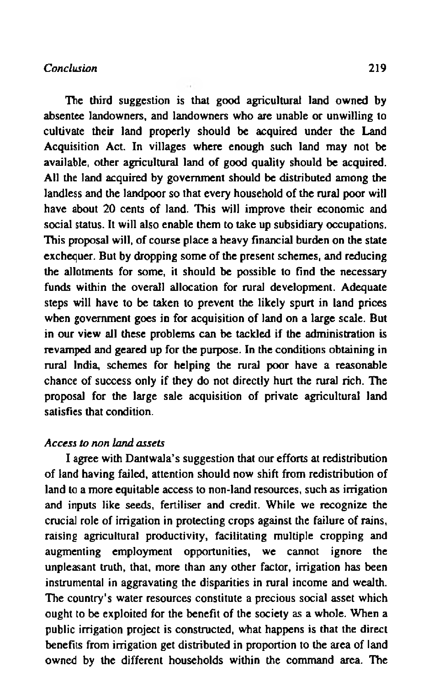

###### Conclusion 219

The third suggestion is that good agricultural land owned by absentee landowners, and landowners who are unable or unwilling to cultivate their land properly should be acquired under the Land Acquisition Act. In villages where enough such land may not be available, other agricultural land of good quality should be acquired. All the land acquired by government should be distributed among the landless and the landpoor so that every household of the rural poor will have about 20 cents of land. This will improve their economic and social status. It will also enable them to take up subsidiary occupations. This proposal will, of course place a heavy financial burden on the state exchequer. But by dropping some of the present schemes, and reducing the allotments for some, it should be possible to find the necessary funds within the overall allocation for rural development. Adequate steps will have to be taken to prevent the likely spurt in land prices when government goes in for acquisition of land on a large scale. But in our view all these problems can be tackled if the administration is revamped and geared up for the purpose. In the conditions obtaining in rural India, schemes for helping the rural poor have a reasonable chance of success only if they do not directly hurt the rural rich. The proposal for the large sale acquisition of private agricultural land satisfies that condition.

Access to non land assets

I agree with Dantwala’s suggestion that our efforts at redistribution of land having failed, attention should now shift from redistribution of land to a more equitable access to non-land resources, such as irrigation and inputs like seeds, fertiliser and credit. While we recognize the crucial role of irrigation in protecting crops against the failure of rains, raising agricultural productivity, facilitating multiple cropping and augmenting employment opportunities, we cannot ignore the unpleasant truth, that, more than any other factor, irrigation has been instrumental in aggravating the disparities in rural income and wealth. The country’s water resources constitute a precious social asset which ought to be exploited for the benefit of the society as a whole. When a public irrigation project is constructed, what happens is that the direct benefits from irrigation get distributed in proportion to the area of land owned by the different households within the command area. The

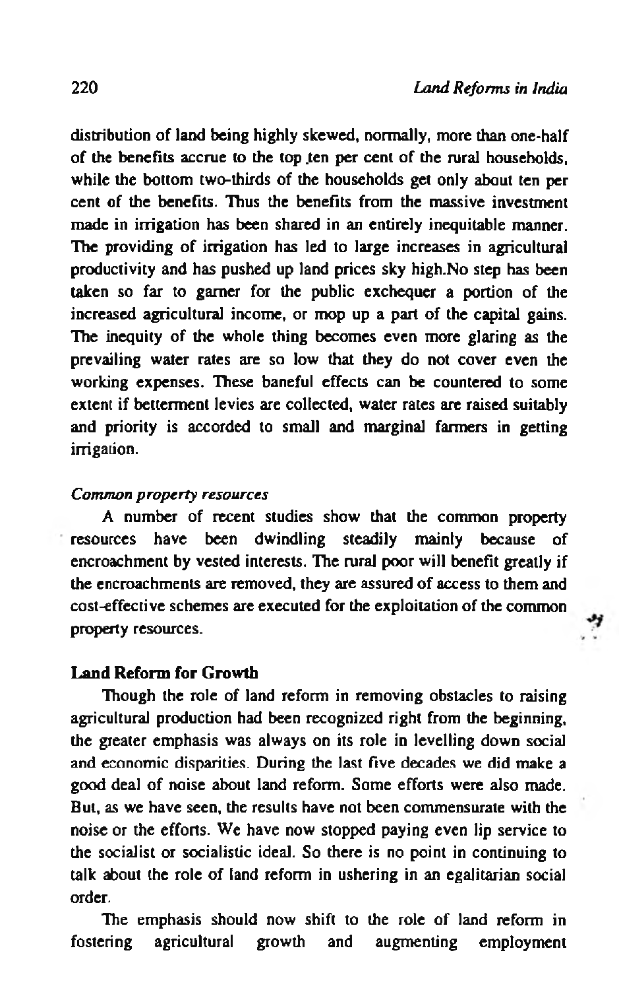

###### 220 Land Reforms in India

distribution of land being highly skewed, normally, more than one-half of the benefits accrue to the top .ten per cent of the rural households, while the bottom two-thirds of the households get only about ten per cent of the benefits. Thus the benefits from the massive investment made in irrigation has been shared in an entirely inequitable manner. The providing of irrigation has led to large increases in agricultural productivity and has pushed up land prices sky high.No step has been taken so far to garner for the public exchequer a portion of the increased agricultural income, or mop up a part of the capital gains. The inequity of the whole thing becomes even more glaring as the prevailing water rates are so low that they do not cover even the working expenses. These baneful effects can be countered to some extent if betterment levies are collected, water rates are raised suitably and priority is accorded to small and marginal farmers in getting irrigation.

Common property resources

A number of recent studies show that the common property resources have been dwindling steadily mainly because of encroachment by vested interests. The rural poor will benefit greatly if the encroachments are removed, they are assured of access to them and cost-effective schemes are executed for the exploitation of the common property resources.

###### Land Reform for Growth

Though the role of land reform in removing obstacles to raising agricultural production had been recognized right from the beginning, the greater emphasis was always on its role in levelling down social and economic disparities. During the last five decades we did make a good deal of noise about land reform. Some efforts were also made. But, as we have seen, the results have not been commensurate with the noise or the efforts. We have now stopped paying even lip service to the socialist or socialistic ideal. So there is no point in continuing to talk about the role of land reform in ushering in an egalitarian social order.

The emphasis should now shift to the role of land reform in fostering agricultural growth and augmenting employment

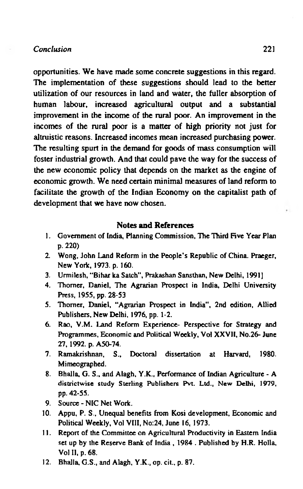

###### Conclusion 221

opportunities. We have made some concrete suggestions in this regard. The implementation of these suggestions should lead to the better utilization of our resources in land and water, the fuller absorption of human labour, increased agricultural output and a substantial improvement in the income of the rural poor. An improvement in the incomes of the rural poor is a matter of high priority not just for altruistic reasons. Increased incomes mean increased purchasing power. The resulting spurt in the demand for goods of mass consumption will foster industrial growth. And that could pave the way for the success of the new economic policy that depends on the market as the engine of economic growth. We need certain minimal measures of land reform to facilitate the growth of the Indian Economy on the capitalist path of development that we have now chosen.

###### Notes and References

- 1. Government of India, Planning Commission, The Third Five Year Plan p. 220)
- 2. Wong, John Land Reform in the People’s Republic of China. Praeger, New York, 1973. p. 160.
- 3. Urmilesh, “Bihar ka Satch”, Prakashan Sansthan, New Delhi, 1991}
- 4. Thomer, Daniel, The Agrarian Prospect in India, Delhi University Press, 1955, pp. 28-53
- 5. Thomer, Daniel, “Agrarian Prospect in India”, 2nd edition, Allied Publishers, New Delhi, 1976, pp. 1-2.
- 6. Rao, V.M. Land Reform Experience- Perspective for Strategy and Programmes, Economic and Political Weekly, Vol XXVII, No.26- June 27,1992. p. A50-74.
- 7. Ramakrishnan, S., Doctoral dissertation at Harvard, 1980. Mimeographed.
- 8. Bhalla, G. S., and Alagh, Y.K., Performance of Indian Agriculture - A districtwise study Sterling Publishers Pvt. Ltd., New Delhi, 1979, pp. 42-55.
- 9. Source - NIC Net Work.
- 10. Appu, P. S., Unequal benefits from Kosi development, Economic and Political Weekly, Vol VIII, No:24, June 16, 1973.
- 11. Report of the Committee on Agricultural Productivity in Eastern India set up by the Reserve Bank of India , 1984 . Published by H.R. Holla, Vol II, p. 68.
- 12. Bhalla, G.S., and Alagh, Y.K., op. cit., p. 87.

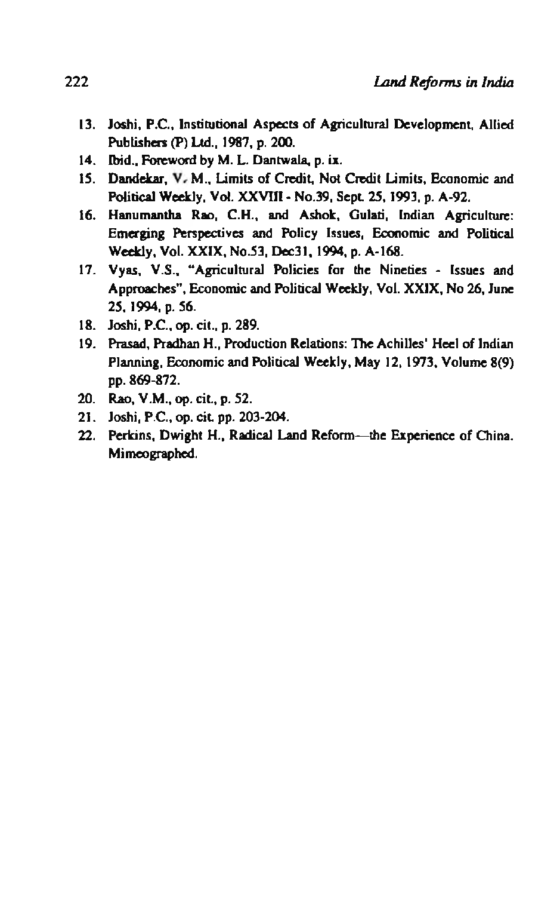

###### 222 Land Reforms in India

- 13. Joshi, P.C., Institutional Aspects of Agricultural Development, Allied Publishers (P) Ltd., 1987, p. 200.
- 14. Ibid., Foreword by M. L. Dantwala, p. ix.
- 15. Dandekar, M., Limits of Credit, Not Credit Limits, Economic and Political Weekly, Vol. XXVm - No.39, Sept. 25,1993, p. A-92.
- 16. Hanumantha Rao, C.H., and Ashok, Gulati, Indian Agriculture: Emerging Perspectives and Policy Issues, Economic and Political Weekly, Vol. XXIX, No.53, Dec31, 1994, p. A-168.
- 17. Vyas, V.S., “Agricultural Policies for the Nineties - Issues and Approaches”, Economic and Political Weekly, Vol. XXIX, No 26, June 25,1994, p. 56.
- 18. Joshi, P.C., op. cit., p. 289.
- 19. Prasad, Pradhan H., Production Relations: The Achilles’ Heel of Indian Planning, Economic and Political Weekly, May 12,1973, Volume 8(9) pp. 869-872.
- 20. Rao, V.M., op. cit., p. 52.
- 21. Joshi, P.C., op. cit. pp. 203-204.
- 22. Perkins, Dwight H., Radical Land Reform—the Experience of China. Mimeographed.

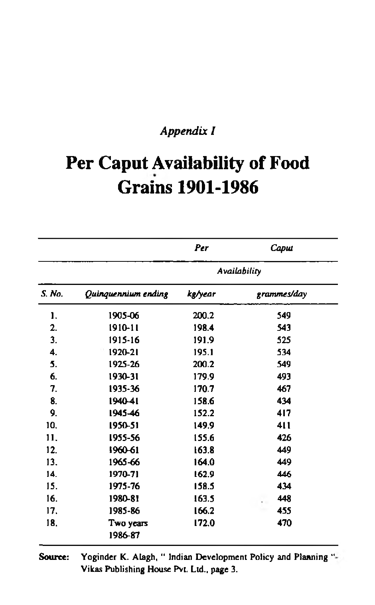

Appendix I

### Per Caput Availability of Food Grains 1901-1986

Per Caput

Availability

S. No. Quinquennium ending kg/year grammes/day

- 1. 1905-06 200.2 549
- 2. 1910-11 198.4 543
- 3. 1915-16 191.9 525
- 4. 1920-21 195.1 534
- 5. 1925-26 200.2 549
- 6. 1930-31 179.9 493
- 7. 1935-36 170.7 467
- 8. 1940-41 158.6 434
- 9. 1945-46 152.2 417
- 10. 1950-51 149.9 411
- 11. 1955-56 155.6 426
- 12. 1960-61 163.8 449
- 13. 1965-66 164.0 449
- 14. 1970-71 162.9 446
- 15. 1975-76 158.5 434
- 16. 1980-81 163.5 448
- 17. 1985-86 166.2 455
- 18. Two years 1986-87

172.0 470

Source: Yoginder K. Alagh, “ Indian Development Policy and Planning “■

Vikas Publishing House Pvt. Ltd., page 3.

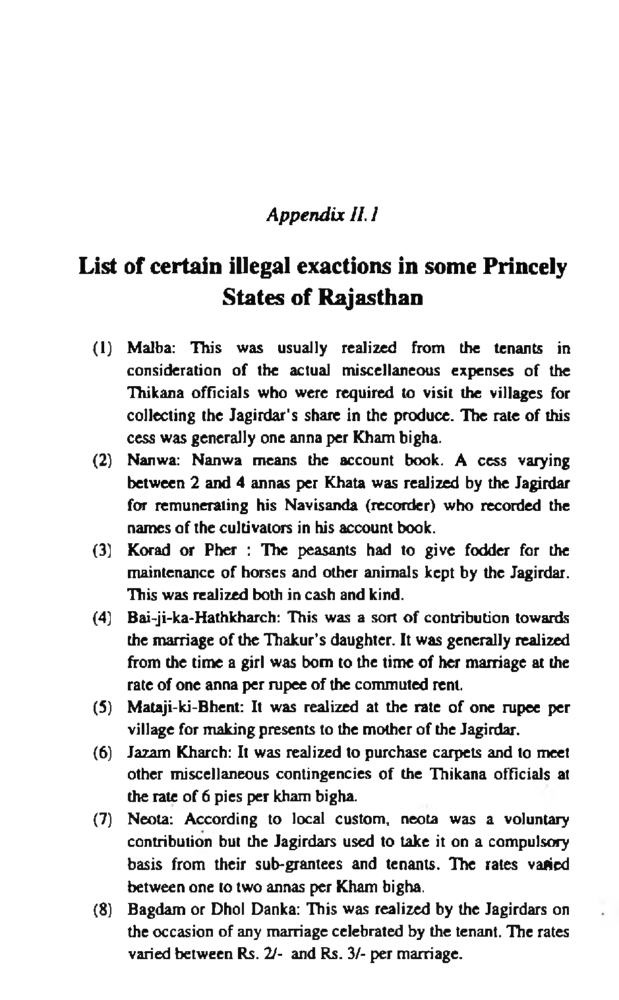

Appendix II. I

##### List of certain illegal exactions in some Princely States of Rajasthan

- (1) Malba: This was usually realized from the tenants in consideration of the actual miscellaneous expenses of the Thikana officials who were required to visit the villages for collecting the Jagirdar’s share in the produce. The rate of this cess was generally one anna per Kham bigha.
- (2) Nanwa: Nanwa means the account book. A cess varying between 2 and 4 annas per Khata was realized by the Jagirdar for remunerating his Navisanda (recorder) who recorded the names of the cultivators in his account book.
- (3) Korad or Pher : The peasants had to give fodder for the maintenance of horses and other animals kept by the Jagirdar. This was realized both in cash and kind.
- (4) Bai-ji-ka-Hathkharch: This was a sort of contribution towards the marriage of the Thakur’s daughter. It was generally realized from the time a girl was bom to the time of her marriage at the rate of one anna per rupee of the commuted rent.
- (5) Mataji-ki-Bhent: It was realized at the rate of one rupee per village for making presents to the mother of the Jagirdar.
- (6) Jazam Kharch: It was realized to purchase carpets and to meet other miscellaneous contingencies of the Thikana officials at the rate of 6 pies per kham bigha.
- (7) Neota: According to local custom, neota was a voluntary contribution but the Jagirdars used to take it on a compulsory basis from their sub-grantees and tenants. The rates varied between one to two annas per Kham bigha.
- (8) Bagdam or Dhol Danka: This was realized by the Jagirdars on the occasion of any marriage celebrated by the tenant. The rates varied between Rs. 21- and Rs. 3/- per marriage.

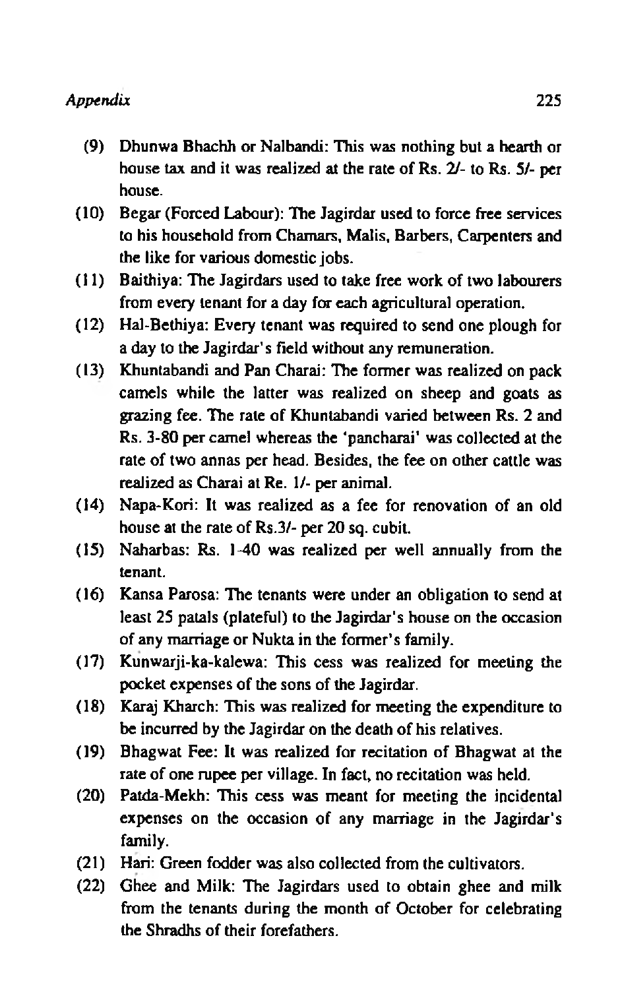

###### Appendix 225

- (9) Dhunwa Bhachh or Nalbandi: This was nothing but a hearth or house tax and it was realized at the rate of Rs. 2J- to Rs. 5/- per house.
- (10) Begar (Forced Labour): The Jagirdar used to force free services to his household from Chamars, Malis, Barbers, Carpenters and the like for various domestic jobs.
- (11) Baithiya: The Jagirdars used to take free work of two labourers from every tenant for a day for each agricultural operation.
- (12) Hal-Bethiya: Every tenant was required to send one plough for a day to the Jagirdar’s field without any remuneration.
- (13) Khuntabandi and Pan Charai: The former was realized on pack camels while the latter was realized on sheep and goats as grazing fee. The rate of Khuntabandi varied between Rs. 2 and Rs. 3-80 per camel whereas the ‘pancharai’ was collected at the rate of two annas per head. Besides, the fee on other cattle was realized as Charai at Re. 1/- per animal.
- (14) Napa-Kori: It was realized as a fee for renovation of an old house at the rate of Rs.3/- per 20 sq. cubit.
- (15) Naharbas: Rs. 1-40 was realized per well annually from the tenant.
- (16) Kansa Parosa: The tenants were under an obligation to send at least 25 patals (plateful) to the Jagirdar’s house on the occasion of any marriage or Nukta in the former’s family.
- (17) Kunwarji-ka-kalewa: This cess was realized for meeting the pocket expenses of the sons of the Jagirdar.
- (18) Karaj Kharch: This was realized for meeting the expenditure to be incurred by the Jagirdar on the death of his relatives.
- (19) Bhagwat Fee: It was realized for recitation of Bhagwat at the rate of one rupee per village. In fact, no recitation was held.
- (20) Patda-Mekh: This cess was meant for meeting the incidental expenses on the occasion of any marriage in the Jagirdar’s family.
- (21) Hari: Green fodder was also collected from the cultivators.
- (22) Ghee and Milk: The Jagirdars used to obtain ghee and milk from the tenants during the month of October for celebrating the Shradhs of their forefathers.

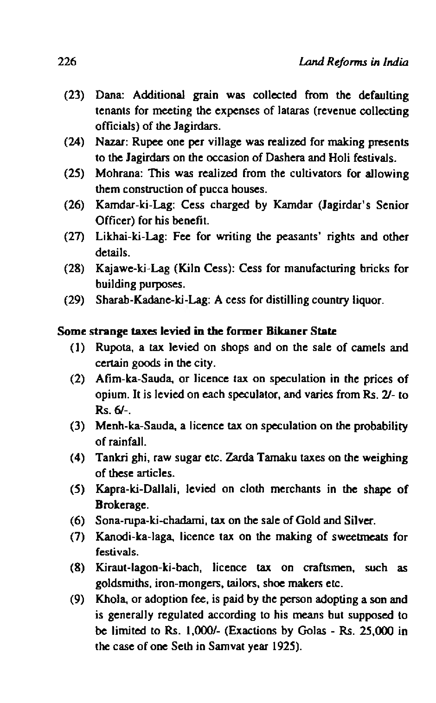

226 Land Reforms in India

- (23) Dana: Additional grain was collected from the defaulting tenants for meeting the expenses of lataras (revenue collecting officials) of the Jagirdars.
- (24) Nazar: Rupee one per village was realized for making presents to the Jagirdars on the occasion of Dashera and Holi festivals.
- (25) Mohrana: This was realized from the cultivators for allowing them construction of pucca houses.
- (26) Kamdar-ki-Lag: Cess charged by Kamdar (Jagirdar’s Senior Officer) for his benefit.
- (27) Likhai-ki-Lag: Fee for writing the peasants’ rights and other details.
- (28) Kajawe-ki-Lag (Kiln Cess): Cess for manufacturing bricks for building purposes.
- (29) Sharab-Kadane-ki-Lag: A cess for distilling country liquor.

###### Some strange taxes levied in the former Bikaner State

- (1) Rupota, a tax levied on shops and on the sale of camels and certain goods in the city.
- (2) Afim-ka-Sauda, or licence tax on speculation in the prices of opium. It is levied on each speculator, and varies from Rs. 21- to Rs. 6/-.
- (3) Menh-ka-Sauda, a licence tax on speculation on the probability of rainfall.
- (4) Tankri ghi, raw sugar etc. Zarda Tamaku taxes on the weighing of these articles.
- (5) Kapra-ki-Dallali, levied on cloth merchants in the shape of Brokerage.
- (6) Sona-rupa-ki-chadami, tax on the sale of Gold and Silver.
- (7) Kanodi-ka-laga, licence tax on the making of sweetmeats for festivals.
- (8) Kiraut-lagon-ki-bach, licence tax on craftsmen, such as goldsmiths, iron-mongers, tailors, shoe makers etc.
- (9) Khola, or adoption fee, is paid by the person adopting a son and is generally regulated according to his means but supposed to be limited to Rs. 1,000/- (Exactions by Golas - Rs. 25,000 in the case of one Seth in Sam vat year 1925).

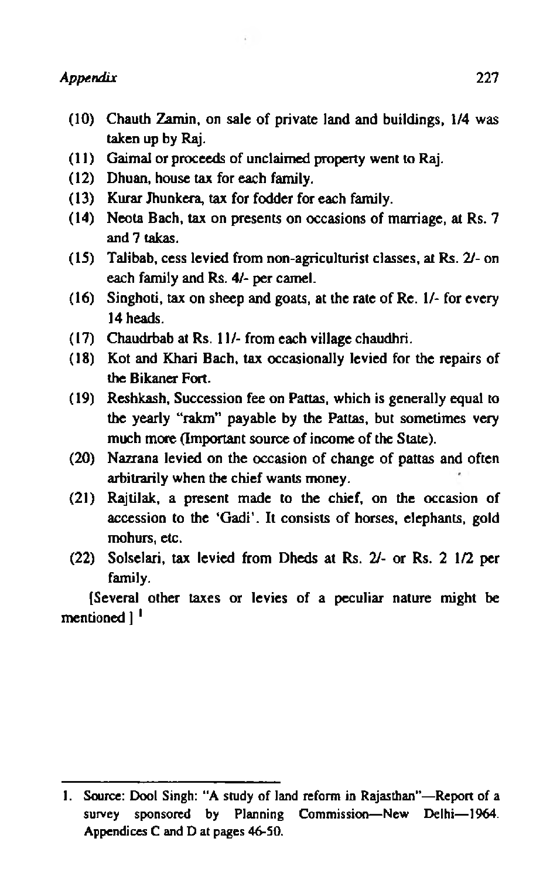

###### Appendix 227

- (10) Chauth Zamin, on sale of private land and buildings, 1/4 was taken up by Raj.
- (11) Gaimal or proceeds of unclaimed property went to Raj.
- (12) Dhuan, house tax for each family.
- (13) Kurar Jhunkera, tax for fodder for each family.
- (14) Neota Bach, tax on presents on occasions of marriage, at Rs. 7 and 7 takas.
- (15) Talibab, cess levied from non-agriculturist classes, at Rs. 2/- on each family and Rs. 4/- per camel.
- (16) Singhoti, tax on sheep and goats, at the rate of Re. 1/- for every 14 heads.
- (17) Chaudrbab at Rs. 11/- from each village chaudhri.
- (18) Kot and Khari Bach, tax occasionally levied for the repairs of the Bikaner Fort.
- (19) Reshkash, Succession fee on Pattas, which is generally equal to the yearly “rakm” payable by the Pattas, but sometimes very much more (Important source of income of the State).
- (20) Nazrana levied on the occasion of change of pattas and often arbitrarily when the chief wants money.
- (21) Rajtilak, a present made to the chief, on the occasion of accession to the ‘Gadi’. It consists of horses, elephants, gold mohurs, etc.
- (22) Solselari, tax levied from Dheds at Rs. 2/- or Rs. 2 1/2 per family.

[Several other taxes or levies of a peculiar nature might be mentioned ] 1

1. Source: Dool Singh: “A study of land reform in Rajasthan”—Report of a survey sponsored by Planning Commission—New Delhi—1964. Appendices C and D at pages 46-50.

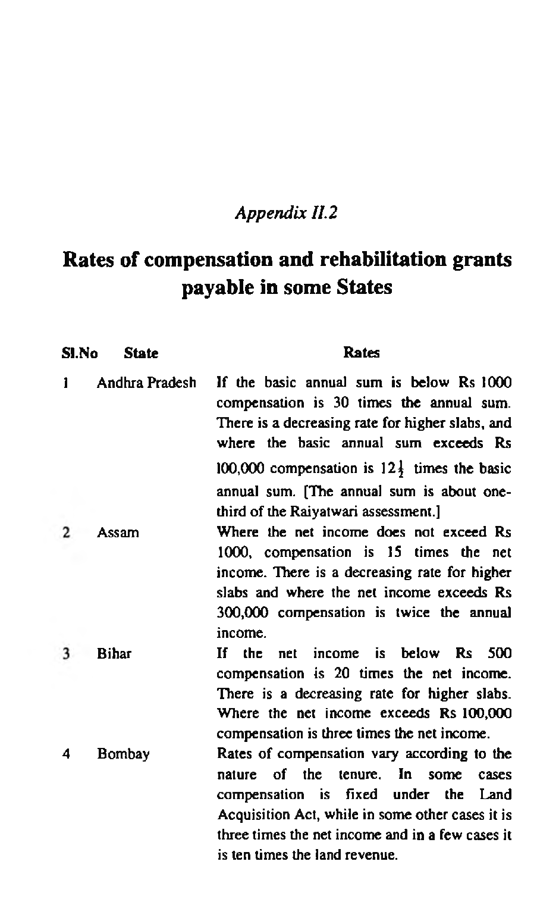

Appendix II. 2

##### Rates of compensation and réhabilitation grants payable in some States

###### Sl.No State Rates 1 Andhra Pradesh

If the basic annual sum is below Rs 1000 compensation is 30 times the annual sum. There is a decreasing rate for higher slabs, and where the basic annual sum exceeds Rs 100.000 compensation is 12^ times the basic annual sum. [The annual sum is about onethird of the Raiyatwari assessment.] Where the net income does not exceed Rs 1000, compensation is 15 times the net income. There is a decreasing rate for higher slabs and where the net income exceeds Rs 300.000 compensation is twice the annual income. If the net income is below Rs 500 compensation is 20 times the net income. There is a decreasing rate for higher slabs. Where the net income exceeds Rs 100,000 compensation is three times the net income. Rates of compensation vary according to the nature of the tenure. In some cases compensation is fixed under the Land Acquisition Act, while in some other cases it is three times the net income and in a few cases it is ten times the land revenue.

Assam

Bihar

- 4 Bombay

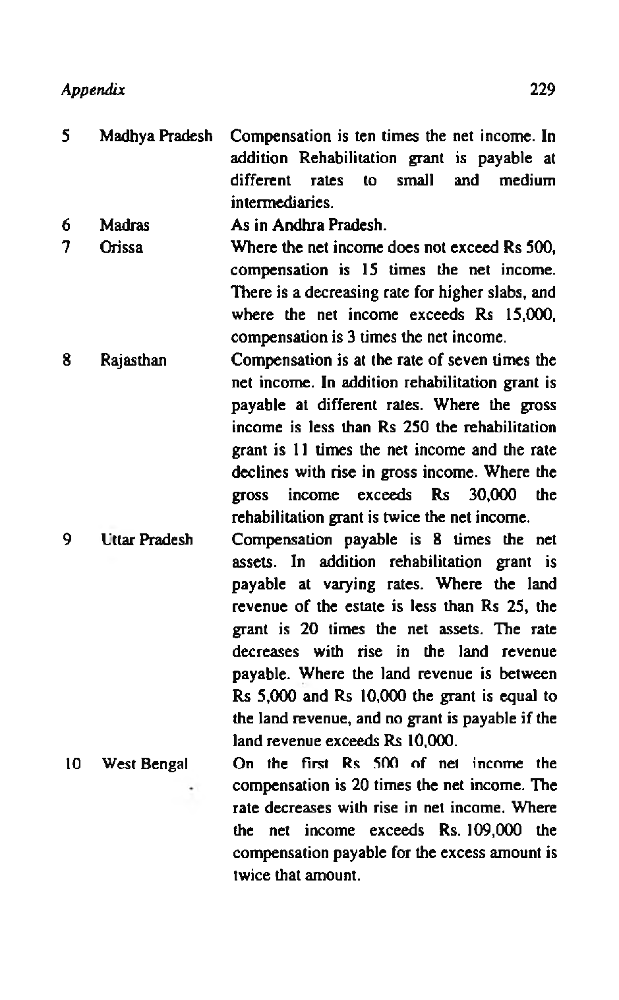

###### Appendix 229

- 5 Madhya Pradesh
- 6 Madras
- 7 Orissa
- 8 Rajasthan
- 9 Uttar Pradesh
- 10 West Bengal

Compensation is ten times the net income. In addition Rehabilitation grant is payable at different rates to small and medium intermediaries. As in Andhra Pradesh. Where the net income does not exceed Rs 500, compensation is 15 times the net income. There is a decreasing rate for higher slabs, and where the net income exceeds Rs 15,000, compensation is 3 times the net income. Compensation is at the rate of seven times the net income. In addition rehabilitation grant is payable at different rates. Where the gross income is less than Rs 250 the rehabilitation grant is 11 times the net income and the rate declines with rise in gross income. Where the gross income exceeds Rs 30,000 the rehabilitation grant is twice the net income. Compensation payable is 8 times the net assets. In addition rehabilitation grant is payable at varying rates. Where the land revenue of the estate is less than Rs 25, the grant is 20 times the net assets. The rate decreases with rise in the land revenue payable. Where the land revenue is between Rs 5,000 and Rs 10,000 the grant is equal to the land revenue, and no grant is payable if the land revenue exceeds Rs 10,000. On the first Rs 500 of net income the compensation is 20 times the net income. The rate decreases with rise in net income. Where the net income exceeds Rs. 109,000 the compensation payable for the excess amount is twice that amount.

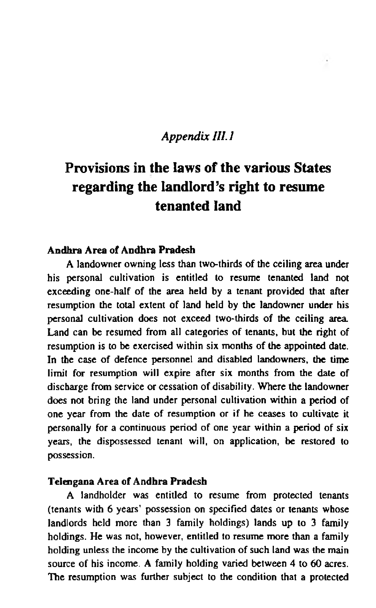

Appendix III. 1

##### Provisions in the laws of the various States regarding the landlord’s right to resume tenanted land

###### Andhra Area of Andhra Pradesh

A landowner owning less than two-thirds of the ceiling area under his personal cultivation is entitled to resume tenanted land not exceeding one-half of the area held by a tenant provided that after resumption the total extent of land held by the landowner under his personal cultivation does not exceed two-thirds of the ceiling area. Land can be resumed from all categories of tenants, but the right of resumption is to be exercised within six months of the appointed date. In the case of defence personnel and disabled landowners, the time limit for resumption will expire after six months from the date of discharge from service or cessation of disability. Where the landowner does not bring the land under personal cultivation within a period of one year from the date of resumption or if he ceases to cultivate it personally for a continuous period of one year within a period of six years, the dispossessed tenant will, on application, be restored to possession.

###### Telengana Area of Andhra Pradesh

A landholder was entitled to resume from protected tenants (tenants with 6 years’ possession on specified dates or tenants whose landlords held more than 3 family holdings) lands up to 3 family holdings. He was not, however, entitled to resume more than a family holding unless the income by the cultivation of such land was the main source of his income. A family holding varied between 4 to 60 acres. The resumption was further subject to the condition that a protected

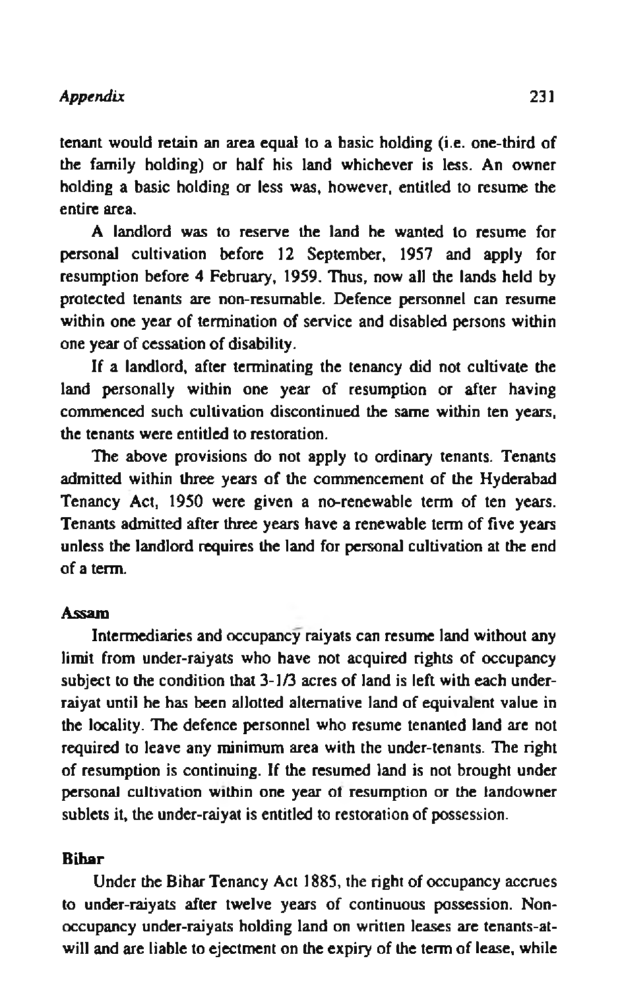

###### Appendix 231

tenant would retain an area equal to a basic holding (i.e. one-third of the family holding) or half his land whichever is less. An owner holding a basic holding or less was, however, entitled to resume the entire area.

A landlord was to reserve the land he wanted to resume for personal cultivation before 12 September, 1957 and apply for resumption before 4 February, 1959. Thus, now all the lands held by protected tenants are non-resumable. Defence personnel can resume within one year of termination of service and disabled persons within one year of cessation of disability.

If a landlord, after terminating the tenancy did not cultivate the land personally within one year of resumption or after having commenced such cultivation discontinued the same within ten years, the tenants were entitled to restoration.

The above provisions do not apply to ordinary tenants. Tenants admitted within three years of the commencement of the Hyderabad Tenancy Act, 1950 were given a no-renewable term of ten years. Tenants admitted after three years have a renewable term of five years unless the landlord requires the land for personal cultivation at the end of a term.

###### Assam

Intermediaries and occupancy raiyats can resume land without any limit from under-raiyats who have not acquired rights of occupancy subject to the condition that 3-1/3 acres of land is left with each underraiyat until he has been allotted alternative land of equivalent value in the locality. The defence personnel who resume tenanted land are not required to leave any minimum area with the under-tenants. The right of resumption is continuing. If the resumed land is not brought under personal cultivation within one year of resumption or the landowner sublets it, the under-raiyat is entitled to restoration of possession.

###### Bihar

Under the Bihar Tenancy Act 1885, the right of occupancy accrucs to under-raiyats after twelve years of continuous possession. Nonoccupancy under-raiyats holding land on written leases are tenants-atwill and are liable to ejectment on the expiry of the term of lease, while

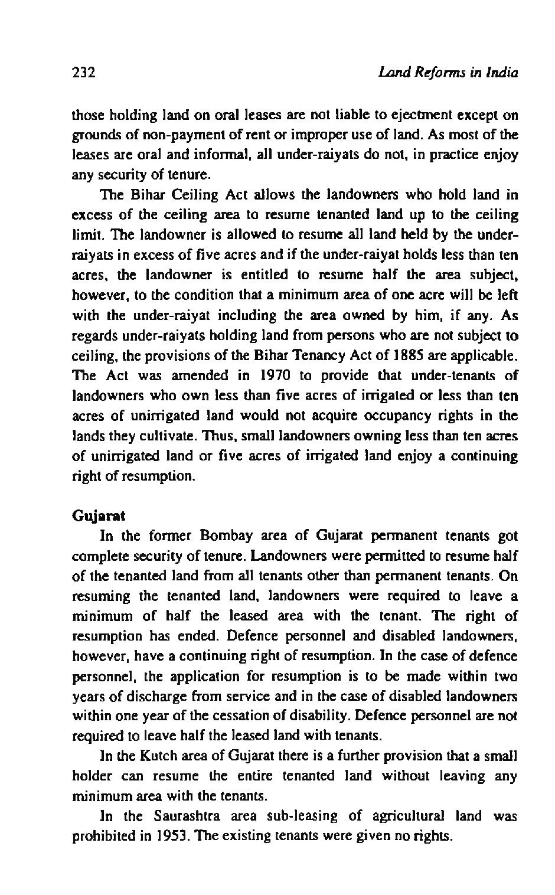

###### 232 Land Reforms in India

those holding land on oral leases are not liable to ejectment except on grounds of non-payment of rent or improper use of land. As most of the leases are oral and informal, all under-raiyats do not, in practice enjoy any security of tenure.

The Bihar Ceiling Act allows the landowners who hold land in excess of the ceiling area to resume tenanted land up to the ceiling limit. The landowner is allowed to resume all land held by the underraiyats in excess of five acres and if the under-raiyat holds less than ten acres, the landowner is entitled to resume half the area subject, however, to the condition that a minimum area of one acre will be left with the under-raiyat including the area owned by him, if any. As regards under-raiyats holding land from persons who are not subject to ceiling, the provisions of the Bihar Tenancy Act of 1885 are applicable. The Act was amended in 1970 to provide that under-tenants of landowners who own less than five acres of irrigated or less than ten acres of unirrigated land would not acquire occupancy rights in the lands they cultivate. Thus, small landowners owning less than ten acres of unirrigated land or five acres of irrigated land enjoy a continuing right of resumption.

###### Gujarat

In the former Bombay area of Gujarat permanent tenants got complete security of tenure. Landowners were permitted to resume half of the tenanted land from all tenants other than permanent tenants. On resuming the tenanted land, landowners were required to leave a minimum of half the leased area with the tenant. The right of resumption has ended. Defence personnel and disabled landowners, however, have a continuing right of resumption. In the case of defence personnel, the application for resumption is to be made within two years of discharge from service and in the case of disabled landowners within one year of the cessation of disability. Defence personnel are not required to leave half the leased land with tenants.

In the Kutch area of Gujarat there is a further provision that a small holder can resume the entire tenanted land without leaving any minimum area with the tenants.

In the Saurashtra area sub-leasing of agricultural land was prohibited in 1953. The existing tenants were given no rights.

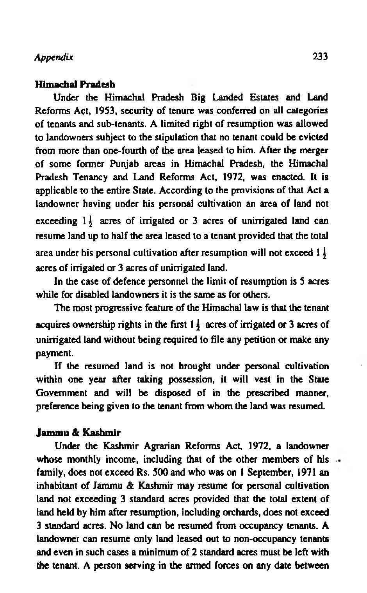

###### Appendix 233

###### Himachal Pradesh

Under the Himachal Pradesh Big Landed Estates and Land Reforms Act, 1953, security of tenure was conferred on all categories of tenants and sub-tenants. A limited right of resumption was allowed to landowners subject to the stipulation that no tenant could be evicted from more than one-fourth of the area leased to him. After the merger of some former Punjab areas in Himachal Pradesh, the Himachal Pradesh Tenancy and Land Reforms Act, 1972, was enacted. It is applicable to the entire State. According to the provisions of that Act a landowner having under his personal cultivation an area of land not exceeding 1\ acres of irrigated or 3 acres of unirrigated land can resume land up to half the area leased to a tenant provided that the total area under his personal cultivation after resumption will not exceed 1\ acres of irrigated or 3 acres of unirrigated land.

In the case of defence personnel the limit of resumption is 5 acres while for disabled landowners it is the same as for others.

The most progressive feature of the Himachal law is that the tenant acquires ownership rights in the first 1\ acres of irrigated or 3 acres of unirrigated land without being required to file any petition or make any payment.

If the resumed land is not brought under personal cultivation within one year after taking possession, it will vest in the State Government and will be disposed of in the prescribed manner, preference being given to the tenant from whom the land was resumed.

###### Jammu & Kashmir

Under the Kashmir Agrarian Reforms Act, 1972, a landowner whose monthly income, including that of the other members of his family, does not exceed Rs. 500 and who was on 1 September, 1971 an inhabitant of Jammu & Kashmir may resume for personal cultivation land not exceeding 3 standard acres provided that the total extent of land held by him after resumption, including orchards, does not exceed 3 standard acres. No land can be resumed from occupancy tenants. A landowner can resume only land leased out to non-occupancy tenants and even in such cases a minimum of 2 standard acres must be left with the tenant. A person serving in the armed forces on any date between

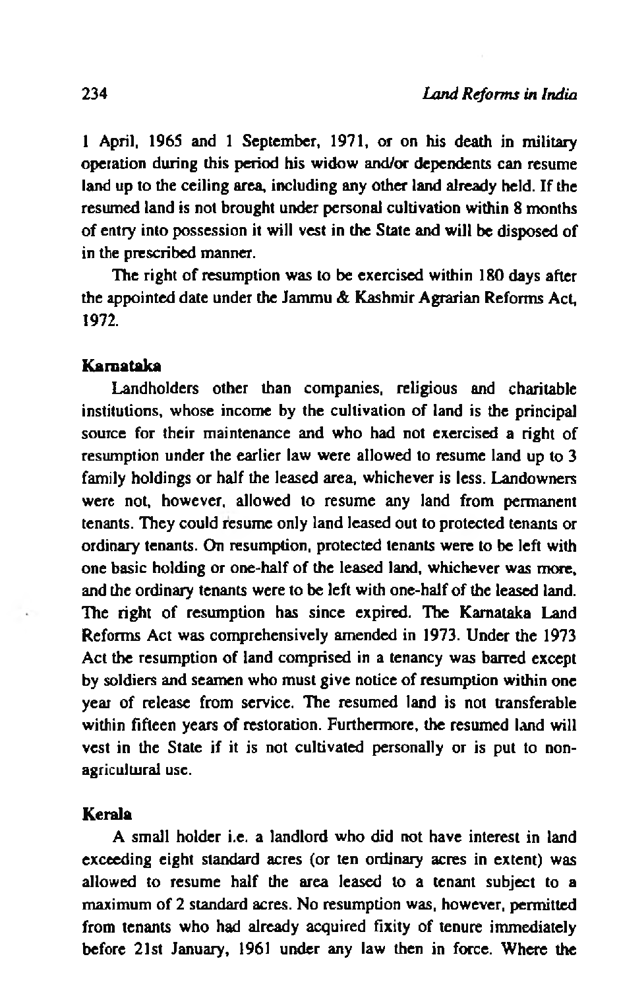

###### 234 Land Reforms in India

1 April, 1965 and 1 September, 1971, or on his death in military operation during this period his widow and/or dependents can resume land up to the ceiling area, including any other land already held. If the resumed land is not brought under personal cultivation within 8 months of entry into possession it will vest in the State and will be disposed of in the prescribed manner.

The right of resumption was to be exercised within 180 days after the appointed date under the Jammu & Kashmir Agrarian Reforms Act, 1972.

###### Karnataka

Landholders other than companies, religious and charitable institutions, whose income by the cultivation of land is the principal source for their maintenance and who had not exercised a right of resumption under the earlier law were allowed to resume land up to 3 family holdings or half the leased area, whichever is less. Landowners were not, however, allowed to resume any land from permanent tenants. They could resume only land leased out to protected tenants or ordinary tenants. On resumption, protected tenants were to be left with one basic holding or one-half of the leased land, whichever was more, and the ordinary tenants were to be left with one-half of the leased land. The right of resumption has since expired. The Karnataka Land Reforms Act was comprehensively amended in 1973. Under the 1973 Act the resumption of land comprised in a tenancy was barred except by soldiers and seamen who must give notice of resumption within one year of release from service. The resumed land is not transferable within fifteen years of restoration. Furthermore, the resumed land will vest in the State if it is not cultivated personally or is put to nonagricultural use.

###### Kerala

A small holder i.e. a landlord who did not have interest in land exceeding eight standard acres (or ten ordinary acres in extent) was allowed to resume half the area leased to a tenant subject to a maximum of 2 standard acres. No resumption was, however, permitted from tenants who had already acquired fixity of tenure immediately before 21st January, 1961 under any law then in force. Where the

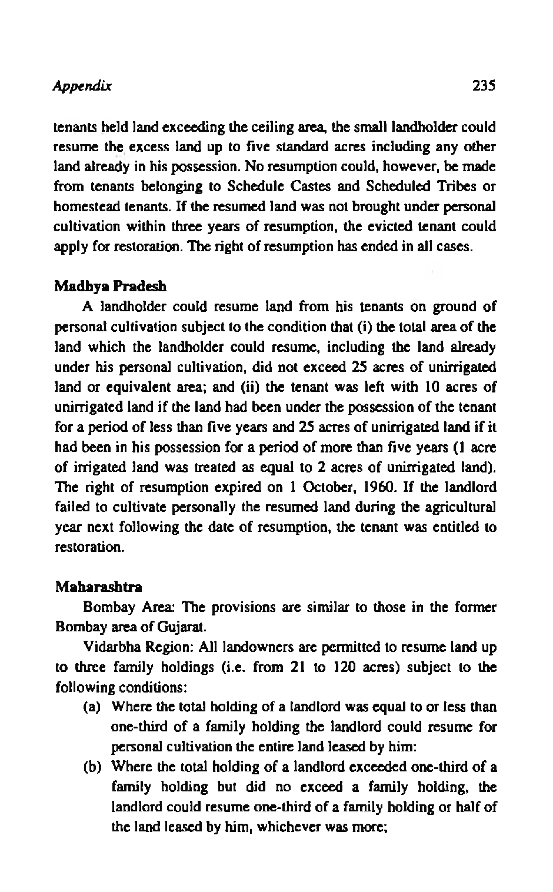

###### Appendix 235

tenants held land exceeding the ceiling area, the small landholder could resume the excess land up to five standard acres including any other land already in his possession. No resumption could, however, be made from tenants belonging to Schedule Castes and Scheduled Tribes or homestead tenants. If the resumed land was not brought under personal cultivation within three years of resumption, the evicted tenant could apply for restoration. The right of resumption has ended in all cases.

###### Madhya Pradesh

A landholder could resume land from his tenants on ground of personal cultivation subject to the condition that (i) the total area of the land which the landholder could resume, including the land already under his personal cultivation, did not exceed 25 acres of unirrigated land or equivalent area; and (ii) the tenant was left with 10 acres of unirrigated land if the land had been under the possession of the tenant for a period of less than five years and 25 acres of unirrigated land if it had been in his possession for a period of more than five years (1 acre of irrigated land was treated as equal to 2 acres of unirrigated land). The right of resumption expired on 1 October, 1960. If the landlord failed to cultivate personally the resumed land during the agricultural year next following the date of resumption, the tenant was entitled to restoration.

###### Maharashtra

Bombay Area: The provisions are similar to those in the former Bombay area of Gujarat.

Vidarbha Region: All landowners are permitted to resume land up to three family holdings (i.e. from 21 to 120 acres) subject to the following conditions:

- (a) Where the total holding of a landlord was equal to or less than one-third of a family holding the landlord could resume for personal cultivation the entire land leased by him:
- (b) Where the total holding of a landlord exceeded one-third of a family holding but did no exceed a family holding, the landlord could resume one-third of a family holding or half of the land leased by him, whichever was more;

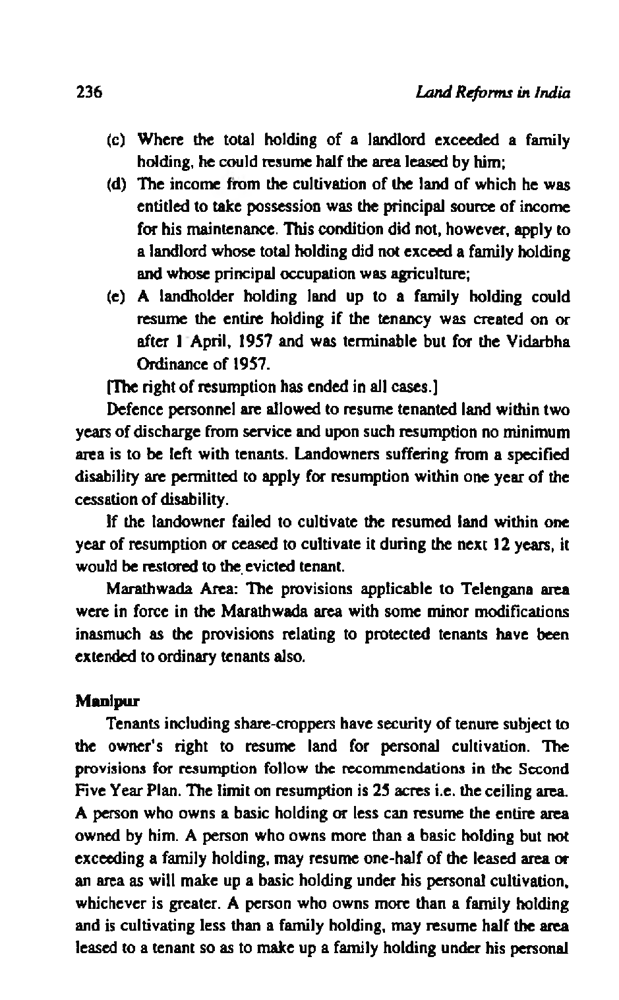

###### 236 Land Reforms in India

- (c) Where the total holding of a landlord exceeded a family holding, he could resume half the area leased by him;
- (d) The income from the cultivation of the land of which he was entitled to take possession was the principal source of income for his maintenance. This condition did not, however, apply to a landlord whose total holding did not exceed a family holding and whose principal occupation was agriculture;
- (e) A landholder holding land up to a family holding could resume the entire holding if the tenancy was created on or after 1 April, 1957 and was terminable but for the Vidarbha Ordinance of 1957.

[The right of resumption has ended in all cases.] Defence personnel are allowed to resume tenanted land within two yean of discharge from service and upon such resumption no minimum area is to be left with tenants. Landowners suffering from a specified disability are permitted to apply for resumption within one year of the cessation of disability.

If the landowner failed to cultivate the resumed land within one year of resumption or ceased to cultivate it during the next 12 years, it would be restored to the. evicted tenant.

Marathwada Area: The provisions applicable to Telengana area were in force in the Marathwada area with some minor modifications inasmuch as the provisions relating to protected tenants have been extended to ordinary tenants also.

###### Manipur

Tenants including share-croppers have security of tenure subject to the owner’s right to resume land for personal cultivation. The provisions for resumption follow the recommendations in the Second Five Year Plan. The limit on resumption is 25 acres i.e. the ceiling area. A person who owns a basic holding or less can resume the entire area owned by him. A person who owns more than a basic holding but not exceeding a family holding, may resume one-half of the leased area or an area as will make up a basic holding under his personal cultivation, whichever is greater. A person who owns more than a family holding and is cultivating less than a family holding, may resume half the area leased to a tenant so as to make up a family holding under his personal

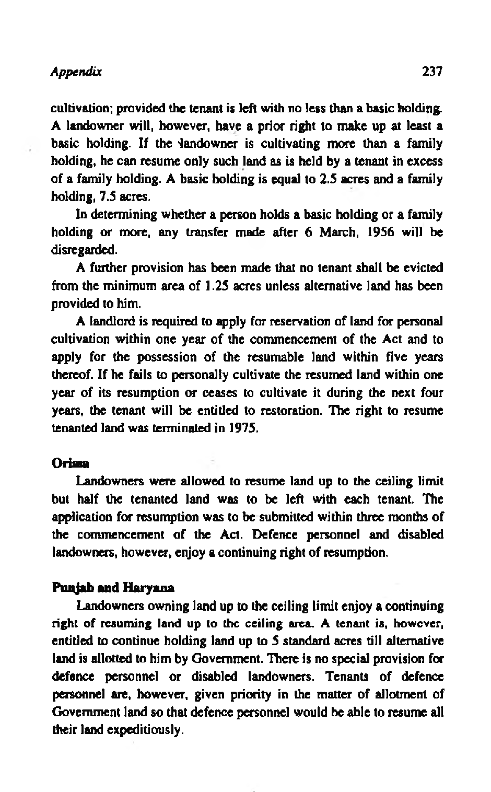

###### Appendix 237

cultivation; provided the tenant is left with no less than a basic holding. A landowner will, however, have a prior right to make up at least a basic holding. If the landowner is cultivating more than a family holding, he can resume only such land as is held by a tenant in excess of a family holding. A basic holding is equal to 2.5 acres and a family holding, 7.5 acres.

In determining whether a person holds a basic holding or a family holding or more, any transfer made after 6 March, 1956 will be disregarded.

A further provision has been made that no tenant shall be evicted from the minimum area of 1.25 acres unless alternative land has been provided to him.

A landlord is required to apply for reservation of land for personal cultivation within one year of the commencement of the Act and to apply for the possession of the resumable land within five years thereof. If he fails to personally cultivate the resumed land within one year of its resumption or ceases to cultivate it during the next four years, the tenant will be entitled to restoration. The right to resume tenanted land was terminated in 1975.

###### Orissa

Landowners were allowed to resume land up to the ceiling limit but half the tenanted land was to be left with each tenant. The application for resumption was to be submitted within three months of the commencement of the Act. Defence personnel and disabled landowners, however, enjoy a continuing right of resumption.

###### Punjab and Haryana

Landowners owning land up to the ceiling limit enjoy a continuing right of resuming land up to the ceiling area. A tenant is, however, entitled to continue holding land up to 5 standard acres till alternative land is allotted to him by Government. There is no special provision for defence personnel or disabled landowners. Tenants of defence personnel are, however, given priority in the matter of allotment of Government land so that defence personnel would be able to resume all their land expeditiously.

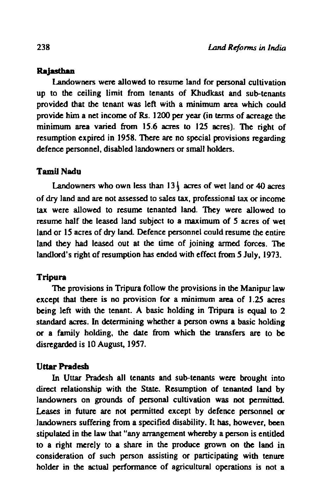

###### 238 Land Reforms in India

###### Rajasthan

Landowners were allowed to resume land for personal cultivation up to the ceiling limit from tenants of Khudkast and sub-tenants provided that the tenant was left with a minimum area which could provide him a net income of Rs. 1200 per year (in terms of acreage the minimum area varied from 15.6 acres to 125 acres). The right of resumption expired in 1958. There are no special provisions regarding defence personnel, disabled landowners or small holders.

###### Tamil Nadu

Landowners who own less than 13 J acres of wet land or 40 acres of dry land and are not assessed to sales tax, professional tax or income tax were allowed to resume tenanted land. They were allowed to resume half the leased land subject to a maximum of 5 acres of wet land or 15 acres of dry land. Defence personnel could resume the entire land they had leased out at the time of joining armed forces. The landlord’s right of resumption has ended with effect from 5 July, 1973.

###### Tripura

The provisions in Tripura follow the provisions in the Manipur law except that there is no provision for a minimum area of 1.25 acres being left with the tenant. A basic holding in Tripura is equal to 2 standard acres. In determining whether a person owns a basic holding or a family holding, the date from which the transfers are to be disregarded is 10 August, 1957.

###### Uttar Pradesh

In Uttar Pradesh all tenants and sub-tenants were brought into direct relationship with the State. Resumption of tenanted land by landowners on grounds of personal cultivation was not permitted. Leases in future are not permitted except by defence personnel or landowners suffering from a specified disability. It has, however, been stipulated in the law that “any arrangement whereby a person is entitled to a right merely to a share in the produce grown on the land in consideration of such person assisting or participating with tenure holder in the actual performance of agricultural operations is not a

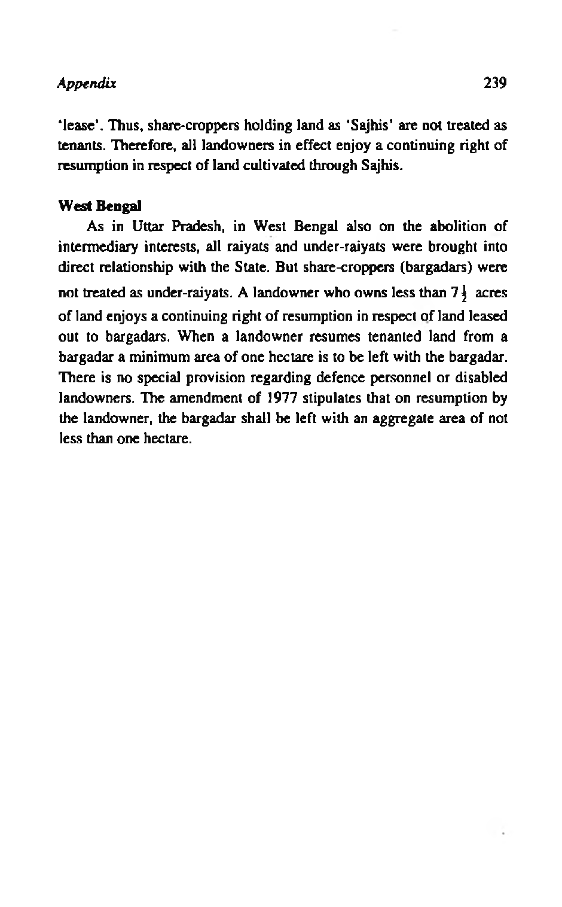

###### Appendix 239

‘lease*. Thus, share-croppers holding land as ‘Sajhis’ are not treated as tenants. Therefore, all landowners in effect enjoy a continuing right of resumption in respect of land cultivated through Sajhis.

###### West Bengal

As in Uttar Pradesh, in West Bengal also on the abolition of intermediary interests, all raiyats and under-raiyats were brought into direct relationship with the State. But share-croppers (bargadars) were not treated as under-raiyats. A landowner who owns less than 7 \ acres of land enjoys a continuing right of resumption in respect of land leased out to bargadars. When a landowner resumes tenanted land from a bargadar a minimum area of one hectare is to be left with the bargadar. There is no special provision regarding defence personnel or disabled landowners. The amendment of 1977 stipulates that on resumption by the landowner, the bargadar shall be left with an aggregate area of not less than one hectare.

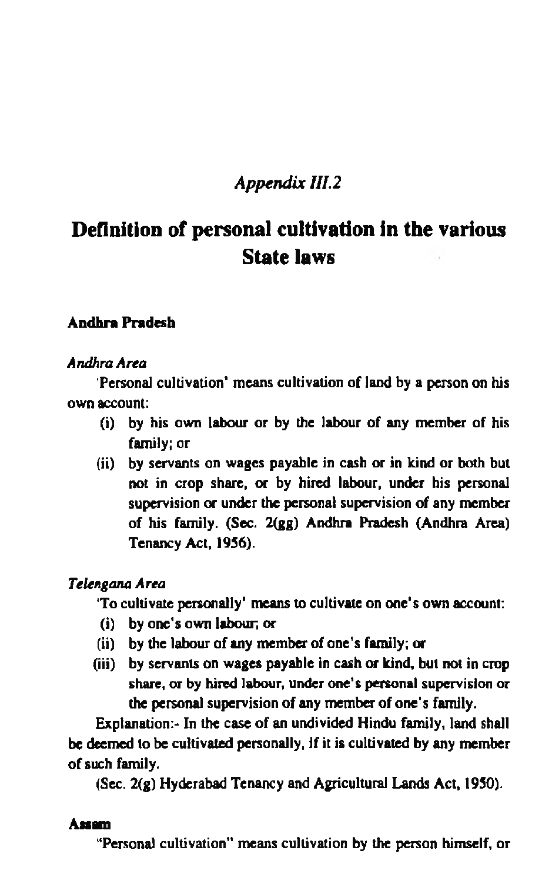

Appendix I1I.2

##### Definition of personal cultivation in the various State laws

###### Andhra Pradesh

Andhra Area

'Personal cultivation’ means cultivation of land by a person on his own account:

- (i) by his own labour or by the labour of any member of his family; or
- (ii) by servants on wages payable in cash or in kind or both but not in crop share, or by hired labour, under his personal supervision or under the personal supervision of any member of his family. (Sec. 2(gg) Andhra Pradesh (Andhra Area) Tenancy Act, 1956).

Telengana Area To cultivate personally' means to cultivate on one's own account:

- (i) by one’s own labour, or
- (ii) by the labour of any member of one’s family; or
- (iii) by servants on wages payable in cash or kind, but not in crop share, or by hired labour, under one’s personal supervision or the personal supervision of any member of one’s family.

Explanation:- In the case of an undivided Hindu family, land shall be deemed to be cultivated personally, If it is cultivated by any member of such family.

(Sec. 2(g) Hyderabad Tenancy and Agricultural Lands Act, 1950).

###### Assam

“Personal cultivation” means cultivation by the person himself, or

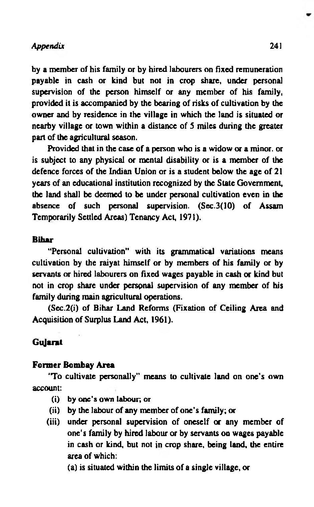

###### Appendix 241

by a member of his family or by hired labourers on fixed remuneration payable in cash or kind but not in crop share, under personal supervision of the person himself or any member of his family, provided it is accompanied by the bearing of risks of cultivation by the owner and by residence in the village in which the land is situated or nearby village or town within a distance of 5 miles during the greater part of the agricultural season.

Provided that in the case of a person who is a widow or a minor, or is subject to any physical or mental disability or is a member of the defence forces of the Indian Union or is a student below the age of 21 years of an educational institution recognized by the State Government, the land shall be deemed to be under personal cultivation even in the absence of such personal supervision. (Sec.3(10) of Assam Temporarily Settled Areas) Tenancy Act, 1971).

###### Bihar

“Personal cultivation” with its grammatical variations means cultivation by the raiyat himself or by members of his family or by servants or hired labourers on fixed wages payable in cash or kind but not in crop share under personal supervision of any member of his family during main agricultural operations.

(Sec.2(i) of Bihar Land Reforms (Fixation of Ceiling Area and Acquisition of Surplus Land Act, 1961).

Gujarat

Former Bombay Area

‘To cultivate personally” means to cultivate land on one’s own account:

- (i) by one’s own labour, or
- (ii) by the labour of any member of one’s family; or
- (iii) under personal supervision of oneself or any member of one’s family by hired labour or by servants on wages payable in cash or kind, but not in crop share, being land, the entire area of which: (a) is situated within the limits of a single village, or

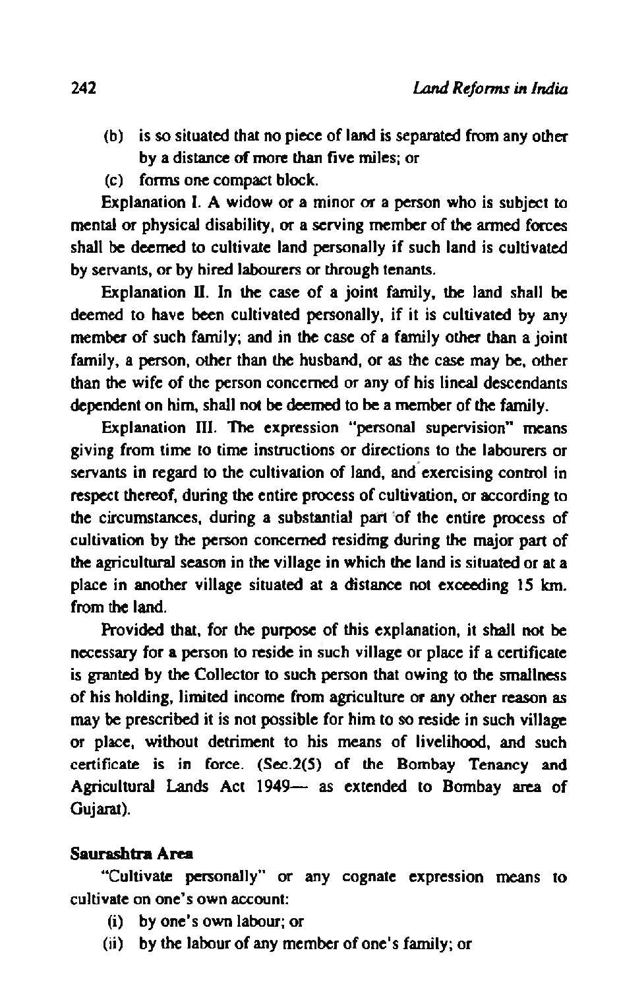

###### 242 Land Reforms in India

- (b) is so situated that no piece of land is separated from any other by a distance of more than five miles; or
- (c) forms one compact block. Explanation I. A widow or a minor or a person who is subject to

mental or physical disability, or a serving member of the armed forces shall be deemed to cultivate land personally if such land is cultivated by servants, or by hired labourers or through tenants.

Explanation n. In the case of a joint family, the land shall be deemed to have been cultivated personally, if it is cultivated by any member of such family; and in the case of a family other than a joint family, a person, other than the husband, or as the case may be, other than the wife of the person concerned or any of his lineal descendants dependent on him, shall not be deemed to be a member of the family.

Explanation III. The expression “personal supervision” means giving from time to time instructions or directions to the labourers or servants in regard to the cultivation of land, and exercising control in respect thereof, during the entire process of cultivation, or according to the circumstances, during a substantial part of the entire process of cultivation by the person concerned residing during the major part of the agricultural season in the village in which the land is situated or at a place in another village situated at a distance not exceeding 15 km. from the land.

Provided that, for the purpose of this explanation, it shall not be necessary for a person to reside in such village or place if a certificate is granted by the Collector to such person that owing to the smallness of his holding, limited income from agriculture or any other reason as may be prescribed it is not possible for him to so reside in such village or place, without detriment to his means of livelihood, and such certificate is in force. (Sec.2(5) of the Bombay Tenancy and Agricultural Lands Act 1949— as extended to Bombay area of Gujarat).

###### Saurashtra Area

“Cultivate personally” or any cognate expression means to cultivate on one’s own account:

- (i) by one’s own labour; or
- (ii) by the labour of any member of one’s family; or

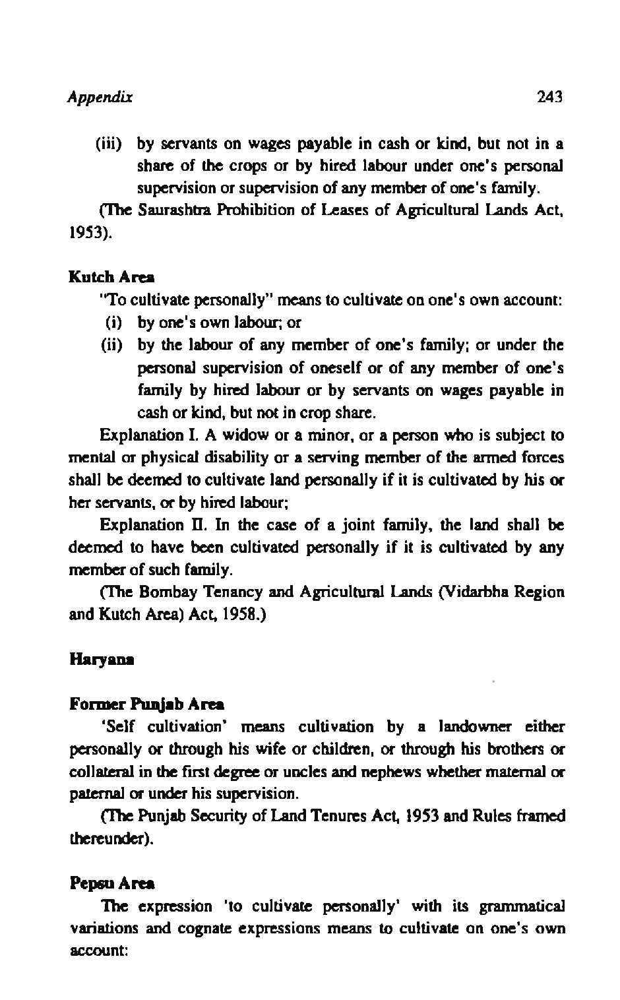

###### Appendix 243

- (iii) by servants on wages payable in cash or kind, but not in a share of the crops or by hired labour under one’s personal supervision or supervision of any member of one’s family.

(The Saurashtra Prohibition of Leases of Agricultural Lands Act, 1953).

###### Kutch Area

‘To cultivate personally” means to cultivate on one’s own account:

- (i) by one’s own labour; or
- (ii) by the labour of any member of one’s family; or under the personal supervision of oneself or of any member of one’s family by hired labour or by servants on wages payable in cash or kind, but not in crop share.

Explanation I. A widow or a minor, or a person who is subject to mental or physical disability or a serving member of the armed forces shall be deemed to cultivate land personally if it is cultivated by his or her servants, or by hired labour;

Explanation n. In the case of a joint family, the land shall be deemed to have been cultivated personally if it is cultivated by any member of such family.

(The Bombay Tenancy and Agricultural Lands (Vidarbha Region and Kutch Area) Act, 1958.)

Haryana

Former Punjab Area

‘Self cultivation’ means cultivation by a landowner either personally or through his wife or children, or through his brothers or collateral in the first degree or uncles and nephews whether maternal or paternal or under his supervision.

(The Punjab Security of Land Tenures Act, 1953 and Rules framed thereunder).

###### Pepsu Area

The expression ‘to cultivate personally* with its grammatical variations and cognate expressions means to cultivate on one’s own account:

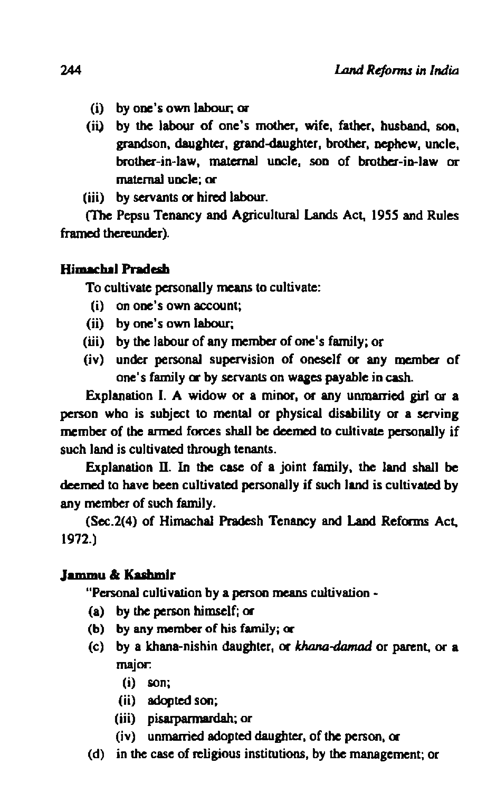

###### 244 Land Reforms in India

- (i) by one’s own labour, or
- (ii) by the labour of one’s mother, wife, father, husband, son, grandson, daughter, grand-daughter, brother, nephew, uncle, brother-in-law, maternal uncle, son of brother-in-law or maternal uncle; or
- (iii) by servants or hired labour. (The Pepsu Tenancy and Agricultural Lands Act, 1955 and Rules

framed thereunder).

###### Himachal Pradesh

To cultivate personally means to cultivate:

- (i) on one’s own account;
- (ii) by one’s own labour;
- (iii) by the labour of any member of one’s family; or
- (iv) under personal supervision of oneself or any member of one’s family or by servants on wages payable in cash.

- Explanation I. A widow or a minor, or any unmarried girl or a person who is subject to mental or physical disability or a serving member of the armed forces shall be deemed to cultivate personally if such land is cultivated through tenants.
- Explanation II. In the case of a joint family, the land shall be deemed to have been cultivated personally if such land is cultivated by any member of such family.

(Sec.2(4) of Himachal Pradesh Tenancy and Land Reforms Act, 1972.)

###### Jammu & Kashmir

“Personal cultivation by a person means cultivation -

- (a) by the person himself; or
- (b) by any member of his family; or
- (c) by a khana-nishin daughter, or khana-damad or parent, or a major

- (i) son;
- (ii) adopted son;
- (iii) pisarparmardah; or
- (iv) unmarried adopted daughter, of the person, or

- (d) in the case of religious institutions, by the management; or

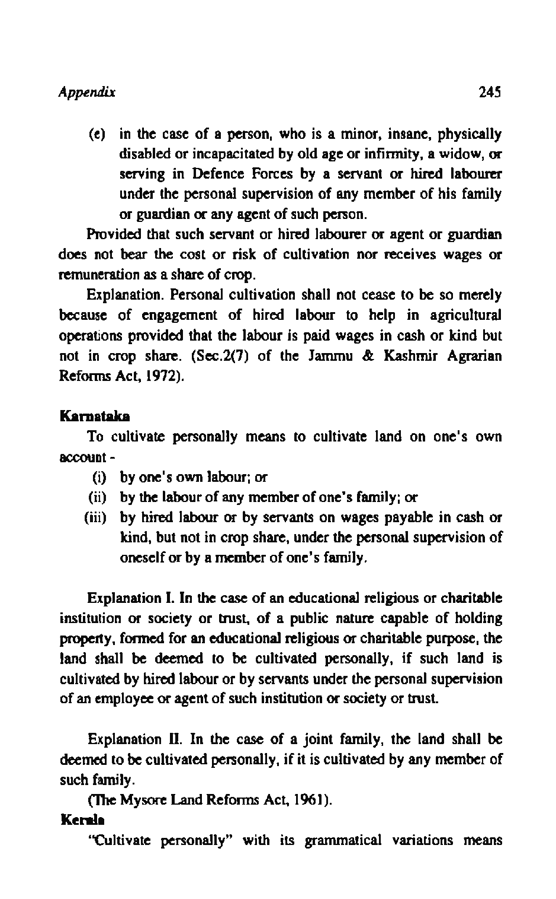

###### Appendix 245

(c) in the case of a person, who is a minor, insane, physically disabled or incapacitated by old age or infirmity, a widow, or serving in Defence Forces by a servant or hired labourer under the personal supervision of any member of his family or guardian or any agent of such person.

Provided that such servant or hired labourer or agent or guardian does not bear the cost or risk of cultivation nor receives wages or remuneration as a share of crop.

Explanation. Personal cultivation shall not cease to be so merely because of engagement of hired labour to help in agricultural operations provided that the labour is paid wages in cash or kind but not in crop share. (Sec.2(7) of the Jammu & Kashmir Agrarian Reforms Act, 1972).

###### Karnataka

To cultivate personally means to cultivate land on one’s own account -

- (i) by one’s own labour; or
- (ii) by the labour of any member of one’s family; or
- (iii) by hired labour or by servants on wages payable in cash or kind, but not in crop share, under the personal supervision of oneself or by a member of one’s family.

- Explanation I. In the case of an educational religious or charitable institution or society or trust, of a public nature capable of holding property, formed for an educational religious or charitable purpose, the land shall be deemed to be cultivated personally, if such land is cultivated by hired labour or by servants under the personal supervision of an employee or agent of such institution or society or trust.
- Explanation II. In the case of a joint family, the land shall be deemed to be cultivated personally, if it is cultivated by any member of such family.

(The Mysore Land Reforms Act, 1961). Kerala

“Cultivate personally** with its grammatical variations means

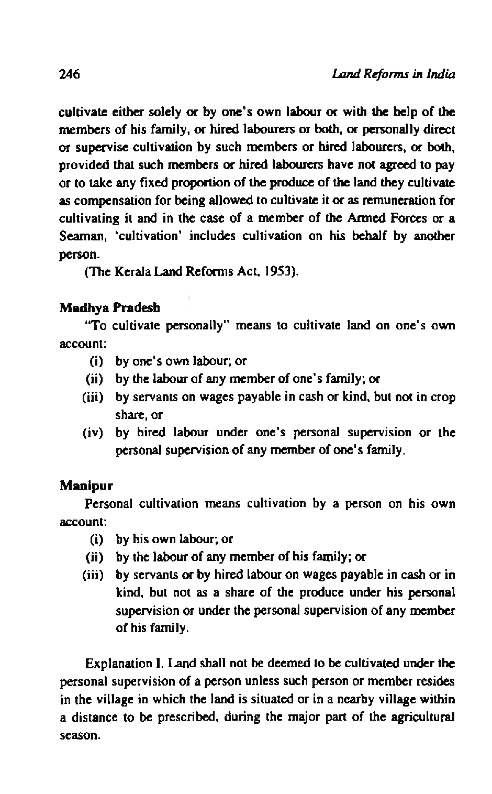

###### 246 Land Reforms in India

cultivate either solely or by one’s own labour or with the help of the members of his family, or hired labourers or both, or personally direct or supervise cultivation by such members or hired labourers, or both, provided that such members or hired labourers have not agreed to pay or to take any fixed proportion of the produce of the land they cultivate as compensation for being allowed to cultivate it or as remuneration for cultivating it and in the case of a member of the Armed Forces or a Seaman, ‘cultivation’ includes cultivation on his behalf by another person.

(The Kerala Land Reforms Act, 1953).

###### Madhya Pradesh

“To cultivate personally” means to cultivate land on one’s own account:

- (i) by one’s own labour; or
- (ii) by the labour of any member of one’s family; or
- (iii) by servants on wages payable in cash or kind, but not in crop share, or
- (iv) by hired labour under one’s personal supervision or the personal supervision of any member of one’s family.

###### Manipur

Personal cultivation means cultivation by a person on his own account:

- (i) by his own labour; or
- (ii) by the labour of any member of his family; or
- (iii) by servants or by hired labour on wages payable in cash or in kind, but not as a share of the produce under his personal supervision or under the personal supervision of any member of his family.

Explanation I. Land shall not be deemed to be cultivated under the personal supervision of a person unless such person or member resides in the village in which the land is situated or in a nearby village within a distance to be prescribed, during the major part of the agricultural season.

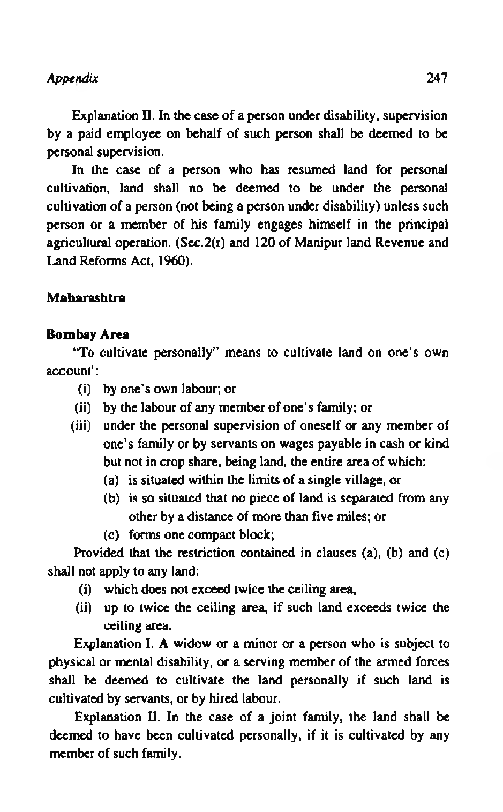

###### Appendix 247

Explanation II. In the case of a person under disability, supervision by a paid employee on behalf of such person shall be deemed to be personal supervision.

In the case of a person who has resumed land for personal cultivation, land shall no be deemed to be under the personal cultivation of a person (not being a person under disability) unless such person or a member of his family engages himself in the principal agricultural operation. (Sec.2(r) and 120 of Manipur land Revenue and Land Reforms Act, 1960).

Maharashtra

Bombay Area

“To cultivate personally” means to cultivate land on one’s own account’:

- (i) by one’s own labour; or
- (ii) by the labour of any member of one’s family; or
- (iii) under the personal supervision of oneself or any member of one’s family or by servants on wages payable in cash or kind but not in crop share, being land, the entire area of which:

- (a) is situated within the limits of a single village, or
- (b) is so situated that no piece of land is separated from any other by a distance of more than five miles; or
- (c) forms one compact block;

Provided that the restriction contained in clauses (a), (b) and (c) shall not apply to any land:

- (i) which does not exceed twice the ceiling area,
- (ii) up to twice the ceiling area, if such land exceeds twice the ceiling area.

- Explanation I. A widow or a minor or a person who is subject to

physical or mental disability, or a serving member of the armed forces shall be deemed to cultivate the land personally if such land is cultivated by servants, or by hired labour.

- Explanation II. In the case of a joint family, the land shall be

deemed to have been cultivated personally, if it is cultivated by any member of such family.

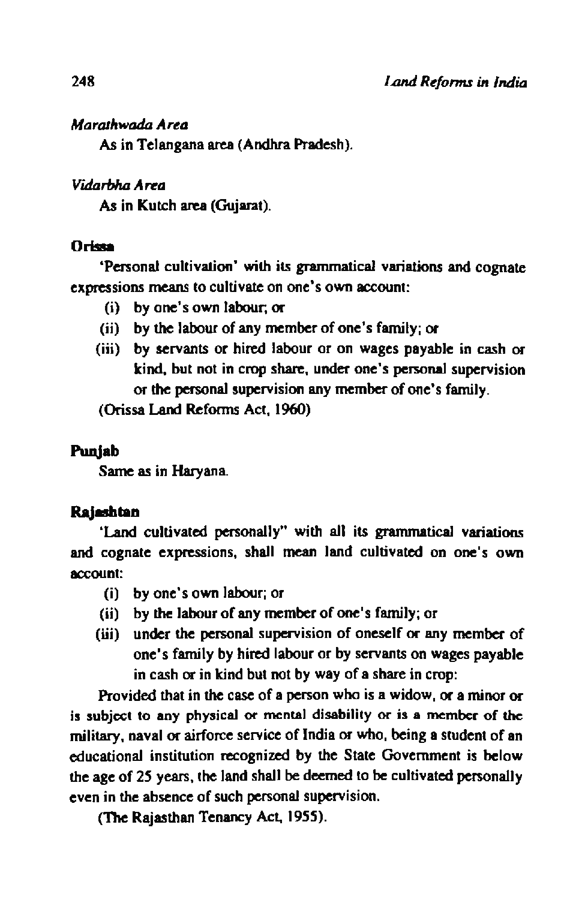

###### 248 Land Reforms in India

Marathwada Area As in Telangana area (Andhra Pradesh).

Vidarbha Area As in Kutch area (Gujarat).

###### Orissa

4Personal cultivation* with its grammatical variations and cognate expressions means to cultivate on one's own account:

- (i) by one’s own labour, or
- (ii) by the labour of any member of one’s family; or
- (iii) by servants or hired labour or on wages payable in cash or kind, but not in crop share, under one's personal supervision or the personal supervision any member of one's family.

(Orissa Land Reforms Act, 1960)

###### Punjab

Same as in Haryana.

###### Rajashtan

‘Land cultivated personally” with all its grammatical variations and cognate expressions, shall mean land cultivated on one's own account:

- (i) by one’s own labour; or
- (ii) by the labour of any member of one’s family; or
- (iii) under the personal supervision of oneself or any member of one's family by hired labour or by servants on wages payable in cash or in kind but not by way of a share in crop:

Provided that in the case of a person who is a widow, or a minor or is subjcct to any physical or mental disability or is a member of the military, naval or airforce service of India or who, being a student of an educational institution recognized by the State Government is below the age of 25 years, the land shall be deemed to be cultivated personally even in the absence of such personal supervision.

(The Rajasthan Tenancy Act, 1955).

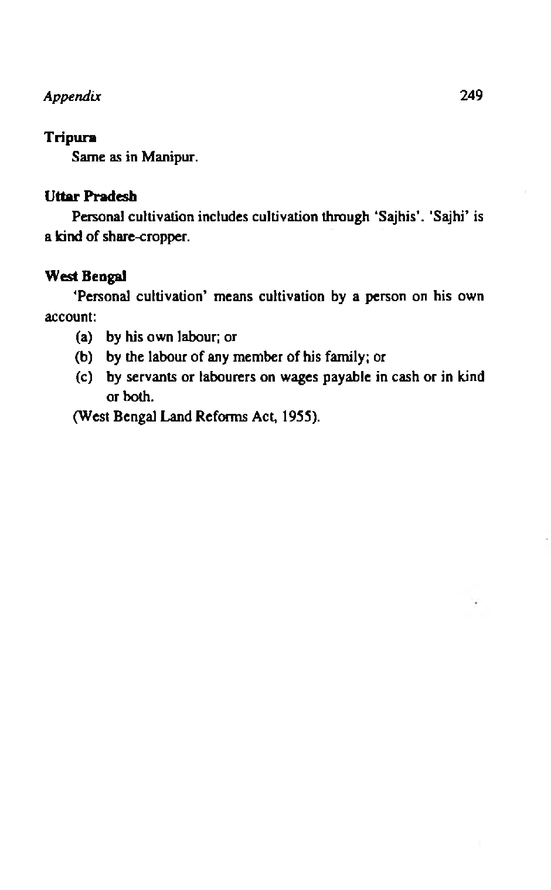

###### Appendix 249

###### Tripura

Same as in Manipur.

###### Uttar Pradesh

Personal cultivation includes cultivation through ‘Sajhis’. ‘Sajhi’ is a kind of share-cropper.

###### West Bengal

‘Personal cultivation’ means cultivation by a person on his own account:

- (a) by his own labour; or
- (b) by the labour of any member of his family; or
- (c) by servants or labourers on wages payable in cash or in kind or both.

(West Bengal Land Reforms Act, 1955).

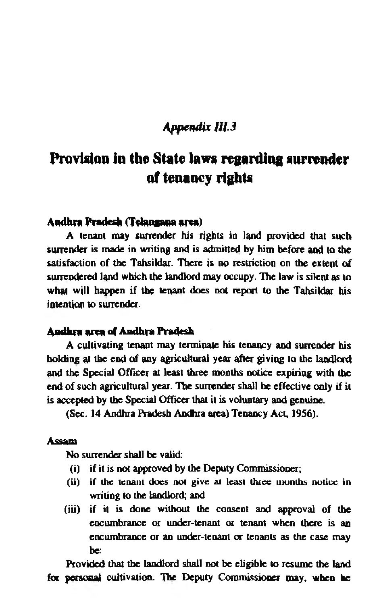

Appendix ¡113

##### Provision in the State law« regarding surrender of tenancy rights

###### Andhra Pradesh (Tetansapa area)

A tenant may surrender his rights in land provided that such surrender is made in writing and is admitted by him before and to the satisfaction of the Tahsildar. There is no restriction on the extent of surrendered land which the landlord may occupy. The law is silent as to what will happen if the tenant does not report to the Tahsildar his intention to surrender.

Andhra area of Andhra Pradesh

A cultivating tenant may terminate his tenancy and surrender his holding 91 the end of any agricultural year after giving to the landlord and the Special Officer at least three months notice expiring with the end of such agricultural year. The surrender shall be effective only if it is accepted by the Special Officer that it is voluntary and genuine.

(Sec. 14 Andhra Pradesh Andhra area) Tenancy Act, 1956).

###### Assam

No surrender shall be valid: (i) if it is not approved by the Deputy Commissioner; (ii) if the tenant does not give at least three months notice in writing to the landlord; and

(iii) if it is done without the consent and approval of the encumbrance or under-tenant or tenant when there is an encumbrance or an under-tenant or tenants as the case may be:

Provided that the landlord shall not be eligible to resume the land for personal cultivation. The Deputy Commissioner may, when he

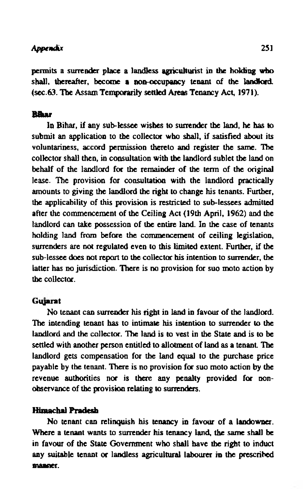

###### Appendix 251

permits a surrender place a landless agriculturist in the holding who shall, thereafter, become a non-occupancy tenant of the landlord (sec.63. The Assam Temporarily settled Areas Tenancy Act, 1971).

###### ft&ar

In Bihar, if any sub-lessee wishes to surrender the land, he has to submit an application to the collector who shall, if satisfied about its voluntariness, accord permission thereto and register the same. The collector shall then, in consultation with the landlord sublet the land on behalf of the landlord for the remainder of the term of the original lease. The provision for consultation with the landlord practically amounts to giving the landlord the right to change his tenants. Further, the applicability of this provision is restricted to sub-lessees admitted after the commencement of the Ceiling Act (19th April, 1962) and the landlord can take possession of the entire land. In the case of tenants holding land from before the commencement of ceiling legislation, surrenders are not regulated even to this limited extent. Further, if the sub-lessee does not report to the collector his intention to surrender, the latter has no jurisdiction. There is no provision for suo moto action by the collector.

###### Giyarat

No tenant can surrender his right in land in favour of the landlord. The intending tenant has to intimate his intention to surrender to the landlord and the collector. The land is to vest in the State and is to be settled with another person entitled to allotment of land as a tenant The landlord gets compensation for the land equal to the purchase price payable by the tenant. There is no provision for suo moto action by the revenue authorities nor is there any penalty provided for nonobservance of the provision relating to surrenders.

###### Himachal Pradesh

No tenant can relinquish his tenancy in favour of a landowner. Where a tenant wants to surrender his tenancy land, the same shall be in favour of the State Government who shall have the right to induct any suitable tenant or landless agricultural labourer in the prescribed manner.

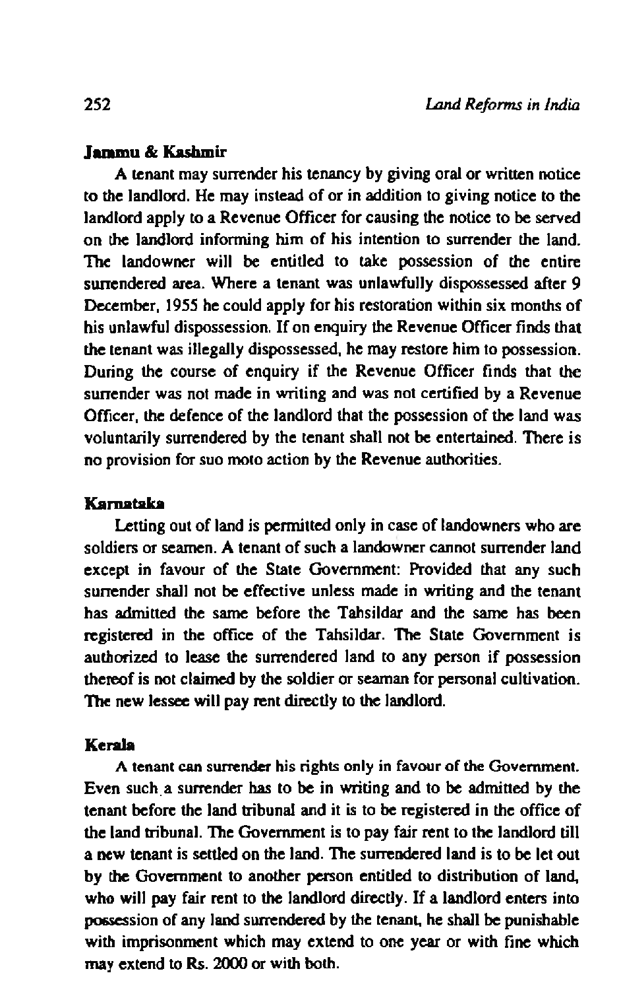

252 Land Reforms in India

###### Jammu & Kashmir

A tenant may surrender his tenancy by giving oral or written notice to the landlord. He may instead of or in addition to giving notice to the landlord apply to a Revenue Officer for causing the notice to be served on the landlord informing him of his intention to surrender the land. The landowner will be entitled to take possession of the entire surrendered area. Where a tenant was unlawfully dispossessed after 9 December, 1955 he could apply for his restoration within six months of his unlawful dispossession. If on enquiry the Revenue Officer finds that the tenant was illegally dispossessed, he may restore him to possession. During the course of enquiry if the Revenue Officer finds that the surrender was not made in writing and was not certified by a Revenue Officer, the defence of the landlord that the possession of the land was voluntarily surrendered by the tenant shall not be entertained. There is no provision for suo moto action by the Revenue authorities.

###### Karnataka

Letting out of land is permitted only in case of landowners who are soldiers or seamen. A tenant of such a landowner cannot surrender land except in favour of the State Government: Provided that any such surrender shall not be effective unless made in writing and the tenant has admitted the same before the Tahsildar and the same has been registered in the office of the Tahsildar. The State Government is authorized to lease the surrendered land to any person if possession thereof is not claimed by the soldier or seaman for personal cultivation. The new lessee will pay rent directly to the landlord.

###### Kerala

A tenant can surrender his rights only in favour of the Government. Even such, a surrender has to be in writing and to be admitted by the tenant before the land tribunal and it is to be registered in the office of the land tribunal. The Government is to pay fair rent to the landlord till a new tenant is settled on the land. The surrendered land is to be let out by the Government to another person entitled to distribution of land, who will pay fair rent to the landlord directly. If a landlord enters into possession of any land surrendered by the tenant, he shall be punishable with imprisonment which may extend to one year or with fine which may extend to Rs. 2000 or with both.

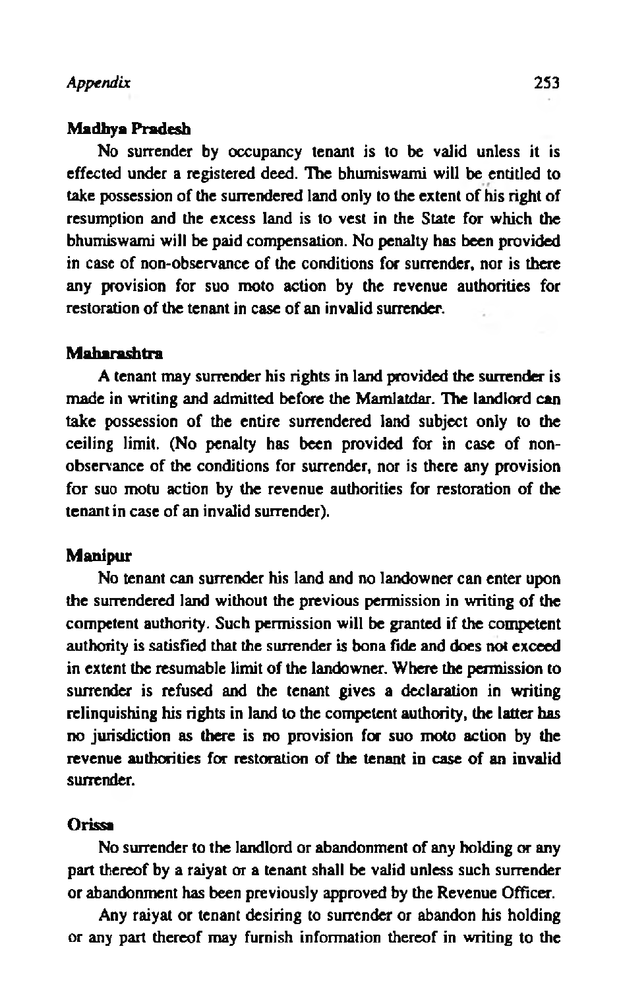

Appendix 253

###### Madhya Pradesh

No surrender by occupancy tenant is to be valid unless it is effected under a registered deed. The bhumiswami will be entitled to take possession of the surrendered land only to the extent of his right of resumption and the excess land is to vest in the State for which the bhumiswami will be paid compensation. No penalty has been provided in case of non-observance of the conditions for surrender, nor is there any provision for suo moto action by the revenue authorities for restoration of the tenant in case of an invalid surrender.

###### Maharashtra

A tenant may surrender his rights in land provided the surrender is made in writing and admitted before the Mamlatdar. The landlord can take possession of the entire surrendered land subject only to the ceiling limit. (No penalty has been provided for in case of nonobservance of the conditions for surrender, nor is there any provision for suo motu action by the revenue authorities for restoration of the tenant in case of an invalid surrender).

###### Manipur

No tenant can surrender his land and no landowner can enter upon the surrendered land without the previous permission in writing of the competent authority. Such permission will be granted if the competent authority is satisfied that the surrender is bona fide and does not exceed in extent the resumable limit of the landowner. Where the permission to surrender is refused and the tenant gives a declaration in writing relinquishing his rights in land to the competent authority, the latter has no jurisdiction as there is no provision for suo moto action by the revenue authorities for restoration of the tenant in case of an invalid surrender.

###### Orissa

No surrender to the landlord or abandonment of any holding or any part thereof by a raiyat or a tenant shall be valid unless such surrender or abandonment has been previously approved by the Revenue Officer.

Any raiyat or tenant desiring to surrender or abandon his holding or any part thereof may furnish information thereof in writing to the

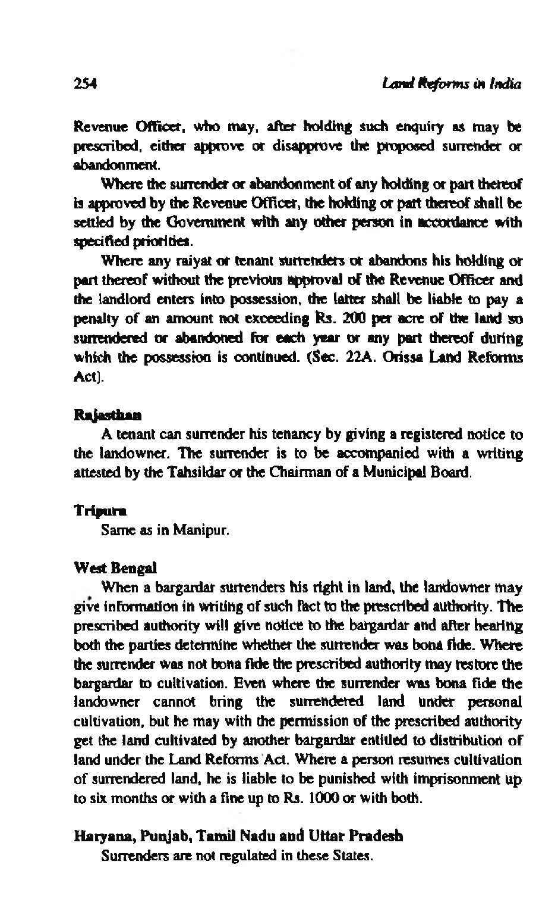

###### 254 Land Rtforms in India

Revenue Officer, who may, after holding such enquiry as may be prescribed, either approve or disapprove the proposed surrender or abandonment.

Where the surrender or abandonment of any holding or pan thereof is approved by the Revenue Officer, the holding or part thereof shall be settled by the Government with any other person in accordance with specified priorities.

Where any raiyat or tenant surrenders or abandons his holding or part thereof without the previous approval of the Revenue Officer and the landlord enters into possession, the latter shall be liable to pay a penalty of an amount not exceeding Rs. 200 per acre of the land so surrendered or abandoned for each year or any part thereof during which the possession is continued. (Sec. 22A. Orissa Land Reforms Act).

###### Rajasthan

A tenant can surrender his tenancy by giving a registered notice to the landowner. The surrender is to be accompanied with a writing attested by the Tahsildar or the Chairman of a Municipal Board.

###### Tripura

Same as in Manipur.

###### West Bengal

When a bargardar surrenders his right in land, the landowner may give information in writing of such fact to the prescribed authority, th e prescribed authority will give notice to the bargardar and after hearing both the parties determine whether the surrender was bona fide. Where the surrender was not bona fide the prescribed authority may restore the bargardar to cultivation. Even where the surrender was bona fide the landowner cannot bring the surrendered land under personal cultivation, but he may with the permission of the prescribed authority get the land cultivated by another bargardar entitled to distribution of land under the Land Reforms Act. Where a person resumes cultivation of surrendered land, he is liable to be punished with imprisonment up to six months or with a fine up to Rs. 1000 or with both.

Haryana, Punjab, Tamil Nadu and Uttar Pradesh Surrenders are not regulated in these States.

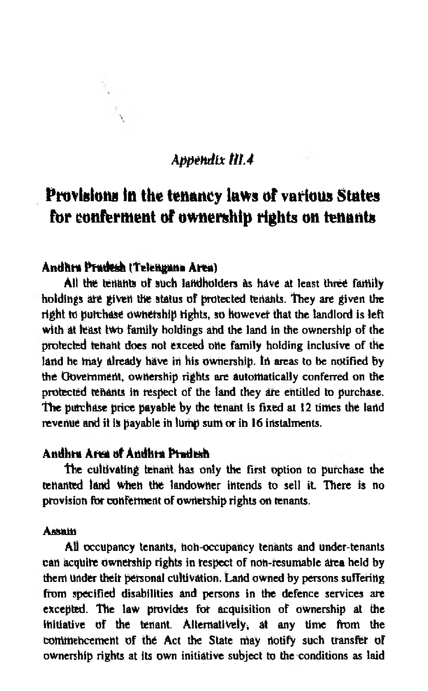

AppéHdlX tít.4

##### Provisions In the tenancy laws of various States for conferment of ownership rights on tenants

Àndhtn Pnutaà (îeleh#âna Aft*)

All the tenant* of such landholders às hâve at least three family holdings are given the status of protected tenants. They are given the right W puítháse ownership Hghts, so however that the landlord is left with at least two family holdings ahd the land in the ownership of the protected tehaht does not exceed one family holding inclusive of the land he tnaÿ àlready hâve iri his ownership, trt areas to be notified by the Government, ownership rights are automatically conferred on the protected teñáhts ih respect of the land they áre entitled to purchase, th e purchase price payable by the tenant is fixed at 12 times the land revenue and it is payable ih lump sum or ih 16 iristalments.

Andhra Attd of Attdhft* ttadtth

Hie cultivât!tig tenant has only the first option to purchase the tenanted land When the landowner intends to sell it There is no provision for conferment of ownership rights on tenants.

A sbñiti

All occupancy tenants, hoh-occupancy tenants and Under-tenants can acquire ownership rights in respect of noh-resumable área held by them under their personal cultivation. Land owned by persons suffering from specified disabilities and persons in the defence services are excepted. The law provides for acquisition of ownership at the initiative of the tenant. Alternatively* at any time ftom the commencement Of thé Act the State may notify such transfer of ownership rights at its own initiative subject to the conditions as laid

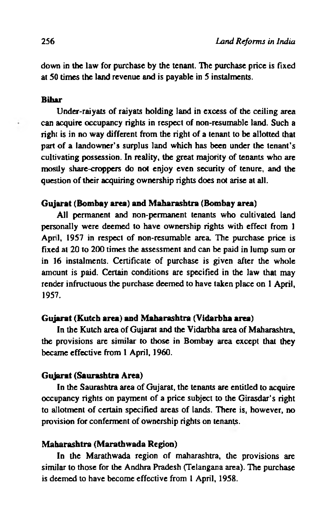

256 Land Reforms in India

down in the law for purchase by the tenant. The purchase price is fixed at 50 times the land revenue and is payable in 5 instalments.

###### Bihar

Under-raiyats of raiyats holding land in excess of the ceiling area can acquire occupancy rights in respect of non-resumable land. Such a right is in no way different from the right of a tenant to be allotted that part of a landowner’s surplus land which has been under the tenant’s cultivating possession. In reality, the great majority of tenants who are mostly share-croppers do not enjoy even security of tenure, and the question of their acquiring ownership rights does not arise at all.

###### Gujarat (Bombay area) and Maharashtra (Bombay area)

All permanent and non-permanent tenants who cultivated land personally were deemed to have ownership rights with effect from 1 April, 1957 in respect of non-resumable area. The purchase price is fixed at 20 to 200 times the assessment and can be paid in lump sum or in 16 instalments. Certificate of purchase is given after the whole amount is paid. Certain conditions are specified in the law that may render infructuous the purchase deemed to have taken place on 1 April, 1957.

###### Gujarat (Kutch area) and Maharashtra (Vidarbha area)

In the Kutch area of Gujarat and the Vidarbha area of Maharashtra, the provisions are similar to those in Bombay area except that they became effective from 1 April, 1960.

###### Gujarat (Saurashtra Area)

In the Saurashtra area of Gujarat, the tenants are entitled to acquire occupancy rights on payment of a price subject to the Girasdar’s right to allotment of certain specified areas of lands. There is, however, no provision for conferment of ownership rights on tenants.

###### Maharashtra (Marathwada Region)

In the Marathwada region of maharashtra, the provisions are similar to those for the Andhra Pradesh (Telangana area). The purchase is deemed to have become effective from 1 April, 1958.

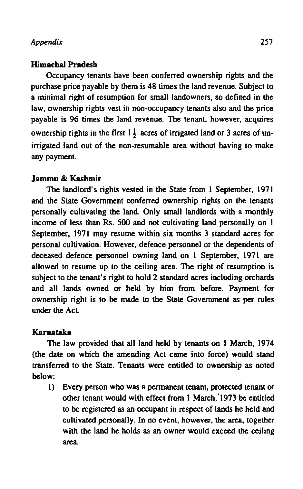

###### Appendix 257

###### Himachal Pradesh

Occupancy tenants have been conferred ownership rights and the purchase price payable by them is 48 times the land revenue. Subject to a minimal right of resumption for small landowners, so defined in the law, ownership rights vest in non-occupancy tenants also and the price payable is 96 times the land revenue. The tenant, however, acquires ownership rights in the first 1 ^ acres of irrigated land or 3 acres of unirrigated land out of the non-resumable area without having to make any payment.

###### Jammu & Kashmir

The landlord’s rights vested in the State from 1 September, 1971 and the State Government conferred ownership rights on the tenants personally cultivating the land. Only small landlords with a monthly income of less than Rs. 500 and not cultivating land personally on 1 September, 1971 may resume within six months 3 standard acres for personal cultivation. However, defence personnel or the dependents of deceased defence personnel owning land on 1 September, 1971 are allowed to resume up to the ceiling area. The right of resumption is subject to the tenant’s right to hold 2 standard acres including orchards and all lands owned or held by him from before. Payment for ownership right is to be made to the State Government as per rules under the Act.

###### Karnataka

The law provided that all land held by tenants on 1 March, 1974 (the date on which the amending Act came into force) would stand transferred to the State. Tenants were entitled to ownership as noted below:

1) Every person who was a permanent tenant, protected tenant or other tenant would with effect from 1 March/1973 be entitled to be registered as an occupant in respect of lands he held and cultivated personally. In no event, however, the area, together with the land he holds as an owner would exceed the ceiling area.

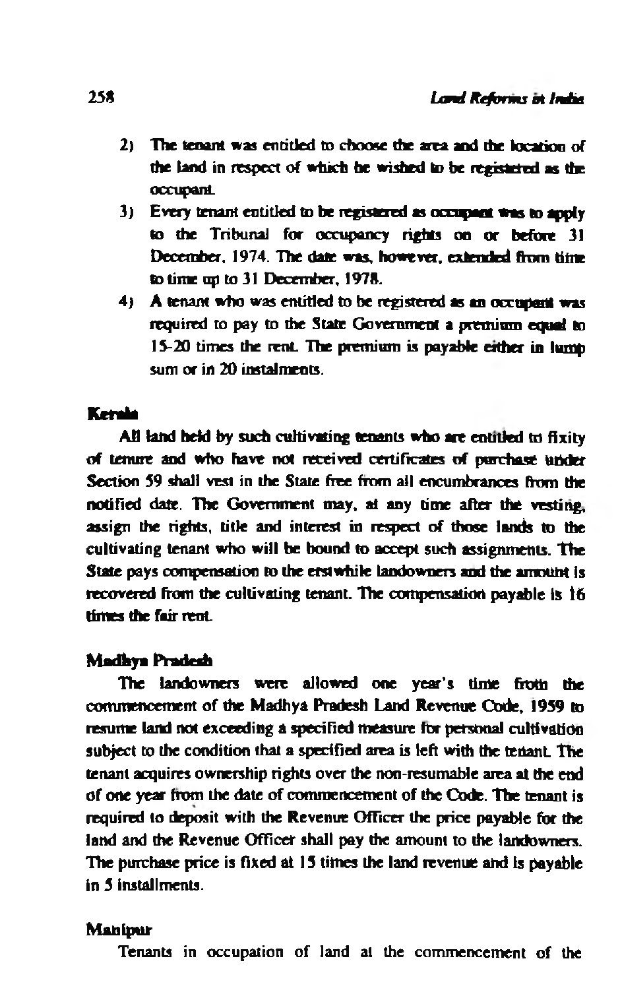

258 Land Reforms at frwha

- 2) The tenant was entitled to choose the area and the location of the land in respect of which he wished to be registered as the occupant.
- 3) Every tenant entitled to be registered as occupant Was to apply to the Tribunal for occupancy rights on or before 31 December, 1974. The dale was, however, extended fh*n time to time op to 31 December, I97S.
- 4) A tenant who was entitled to be registered as an occupant was required to pay to the State Government a premium equal to 15-20 times the rent The premium is payable either in tump sum or in 20 instalments.

###### Kerala

All land held by such cultivating tenants who are entitled to fixity of tenure and who have not received certificates of purchase kinder Section 59 shall vest in the State free from ail encumbrances from the notified date. The Government may, at any time after the vesting, assign the rights, title and interest in respect of those lands to the cultivating tenant who will be bound to accept such assignments. The State pays compensation to the erstwhile landowners and the amount is recovered from the cultivating tenant The compensation payable is 16 times the fair rent.

###### Madhya Pradesh

The landowners were allowed one year’s time from the commencement of the Madhya Pradesh Land Revenue Code, 1959 to resume land not exceeding a specified measure for personal cultivation subject to the condition that a specified area is left with the tenant The tenant acquires ownership rights over the non-resumable area at the end of one year from the date of commencement of the Code. The tenant is required to deposit with the Revenue Officer the price payable for the land and the Revenue Officer shall pay the amount to the landowners. The purchase price is fixed at 15 titties the land revenue and is payable in 5 installments.

###### Manipur

Tenants in occupation of land at the commencement of the

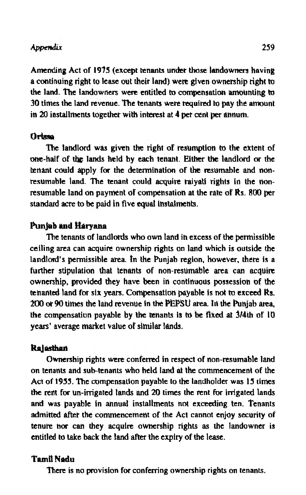

###### Appendix 259

Amending Act of 1975 (except tenants under those landowners having a continuing right to lease out their land) were given ownership right to the land. The landowners were entitled to compensation amounting to 30 times the land revenue. The tenants were required to pay the amount in 20 installments together with interest at 4 per cent per annum.

###### Orissa

The landlord was given the right of resumption to the extent of one-half of the lands held by each tenant. Either the landlord or the tenant could apply for the determination of the resumable and nortresumable land. The tenant could acquire raiyati rights in the nonresumable land on payment of compensation at the rate of Rs. BOO per standard acre to be paid in five equal instalments.

###### Punjab and Haryana

The tenants of landlords who own land ih excess of the permissible ceiling area can acquire ownership rights on land which is outside the landlord’s permissible area, tn the iPunjab region, however, there is a further stipulation that tenants of non-resumable area can acquire ownership, provided they have been in continuous possession of the tenanted land for six years. Compensation payable is not to exceed Rs. 200 or 90 times the land revenue in the P6PSU area. In the t^njab area, the compensation payable by the tenants is to be fixed at 3/4th of 10 years’ average market value of similar lands.

###### kajftsthan

Ownership rights were conferred in respect of non-resumable land on tenants and sub-tenants who held land at the commencement of the Act of 1955. The compensation payable to the landholder was 15 times the rertt for un-irrigated lands and 20 times the rent for irrigated lands and was payable in annual installments not exceeding ten. Tenants admitted after the commencement of the Act cannot enjoy security of tenure nor can they acquire ownership rights as the landowner is entitled to take back the land after the expiry of the lease.

###### Tamtl Nadu

There is no provision for conferring ownership rights on tenants.

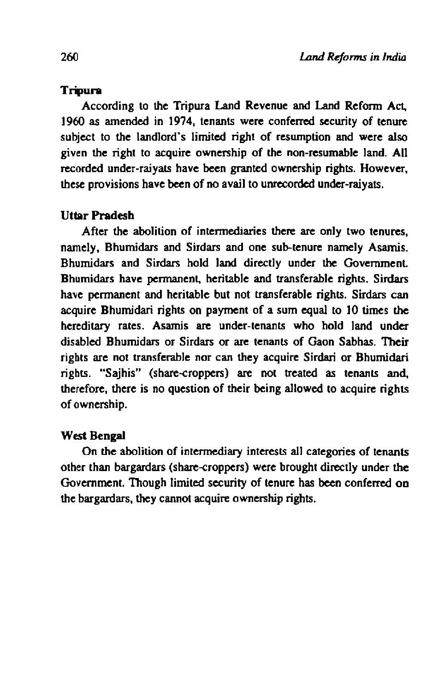

###### 260 Land Reforms in India

###### Tripura

According to the Tripura Land Revenue and Land Reform Act, 1960 as amended in 1974, tenants were conferred security of tenure subject to the landlord's limited right of resumption and were also given the right to acquire ownership of the non-resumable land. All recorded under-raiyats have been granted ownership rights. However, these provisions have been of no avail to unrecorded under-raiyats.

###### Uttar Pradesh

After the abolition of intermediaries there are only two tenures, namely, Bhumidars and Sirdars and one sub-tenure namely Asamis. Bhumidars and Sirdars hold land directly under the Government. Bhumidars have permanent, heritable and transferable rights. Sirdars have permanent and heritable but not transferable rights. Sirdars can acquire Bhumidari rights on payment of a sum equal to 10 times the hereditary rates. Asamis are under-tenants who hold land under disabled Bhumidars or Sirdars or are tenants of Gaon Sabhas. Their rights are not transferable nor can they acquire Sirdari or Bhumidari rights. “Sajhis" (share-croppers) are not treated as tenants and, therefore, there is no question of their being allowed to acquire rights of ownership.

###### West Bengal

On the abolition of intermediary interests all categories of tenants other than bargardars (share-croppers) were brought directly under the Government. Though limited security of tenure has been conferred on the bargardars, they cannot acquire ownership rights.

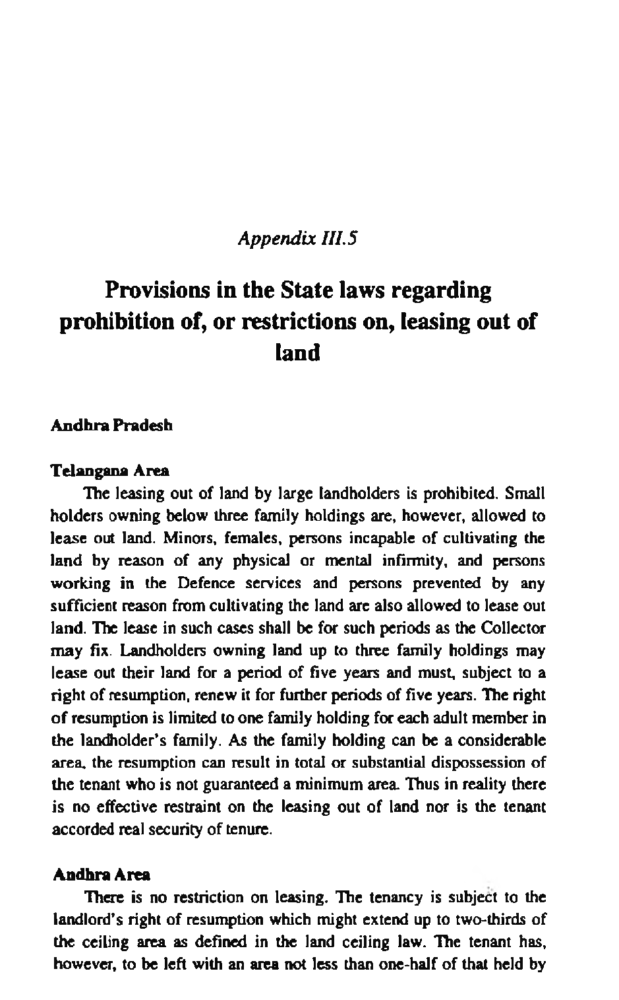

Appendix III. 5

##### Provisions in the State laws regarding prohibition of, or restrictions on, leasing out of land

Andhra Pradesh

Telangana Area

The leasing out of land by large landholders is prohibited. Small holders owning below three family holdings are, however, allowed to lease out land. Minors, females, persons incapable of cultivating the land by reason of any physical or mental infirmity, and persons working in the Defence services and persons prevented by any sufficient reason from cultivating the land are also allowed to lease out land. The lease in such cases shall be for such periods as the Collector may fix. Landholders owning land up to three family holdings may lease out their land for a period of five years and must, subject to a right of resumption, renew it for further periods of five years. The right of resumption is limited to one family holding for each adult member in the landholder’s family. As the family holding can be a considerable area, the resumption can result in total or substantial dispossession of the tenant who is not guaranteed a minimum area. Thus in reality there is no effective restraint on the leasing out of land nor is the tenant accorded real security of tenure.

###### Andhra Area

There is no restriction on leasing. The tenancy is subject to the landlord’s right of resumption which might extend up to two-thirds of the ceiling area as defined in the land ceiling law. The tenant has, however, to be left with an area not less than one-half of that held by

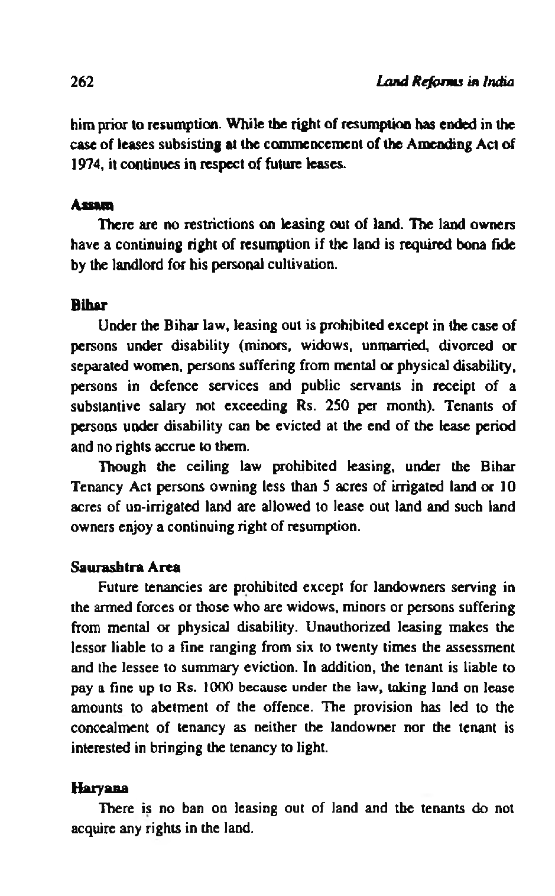

###### 262 Land Reforms in India

him prior to resumption. While the right of resumption has ended in the case of leases subsisting at the commencement of the Amending Act of 1974, it continues in respect of future leases.

###### Assam

There are no restrictions on leasing out of land. The land owners have a continuing right of resumption if the land is required bona fide by the landlord for his persona) cultivation.

###### Bihar

Under the Bihar law, leasing out is prohibited except in the case of persons under disability (minors, widows, unmarried, divorced or separated women, persons suffering from mental or physical disability, persons in defence services and public servants in receipt of a substantive salary not exceeding Rs. 250 per month). Tenants of persons under disability can be evicted at the end of the lease period and no rights accrue to them.

Though the ceiling law prohibited leasing, under the Bihar Tenancy Act persons owning less than 5 acres of irrigated land or 10 acres of un-irrigated land are allowed to lease out land and such land owners enjoy a continuing right of resumption.

###### Saurashtra Area

Future tenancies are prohibited except for landowners serving in the armed forces or those who are widows, minors or persons suffering from mental or physical disability. Unauthorized leasing makes the lessor liable to a fine ranging from six to twenty times the assessment and the lessee to summary eviction. In addition, the tenant is liable to pay a fine up to Rs. 1000 because under the law, taking land on lease amounts to abetment of the offence. The provision has led to the concealment of tenancy as neither the landowner nor the tenant is interested in bringing the tenancy to light.

###### Haryana

There is no ban on leasing out of land and the tenants do not acquire any rights in the land.

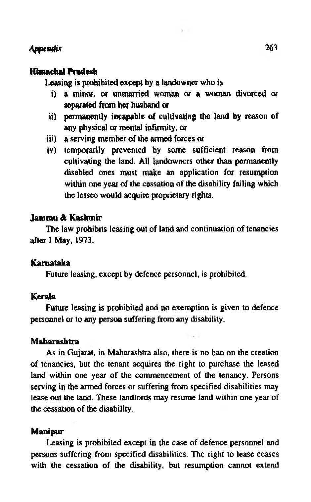

Appendix 263

###### Himachal Pradesh

Leasing is prohibited except by a landowner who is

- i) a minor, or unmarried woman or a woman divorced or separated from her husband or
- ii) permanently incapable of cultivating the land by reason of any physical or mental infirmity, or
- iii) a serving member of the armed forces or
- iv) temporarily prevented by some sufficient reason from cultivating the land. AU landowners other than permanently disabled ones must make an application for resumption within one year of the cessation of the disability failing which the lessee would acquire proprietary rights.

###### Jammu & Kashmir

The law prohibits leasing out of land and continuation of tenancies after 1 May, 1973.

###### Karnataka

Future leasing, except by defence personnel, is prohibited.

###### Kerala

Future leasing is prohibited and no exemption is given to defence personnel or to any person suffering from any disability.

###### Maharashtra

As in Gujarat, in Maharashtra also, there is no ban on the creation of tenancies, but the tenant acquires the right to purchase the leased land within one year of the commencement of the tenancy. Persons serving in the armed forces or suffering from specified disabilities may lease out the land. These landlords may resume land within one year of the cessation of the disability.

###### Manipur

Leasing is prohibited except in the case of defence personnel and persons suffering from specified disabilities. The right to lease ceases with the cessation of the disability, but resumption cannot extend

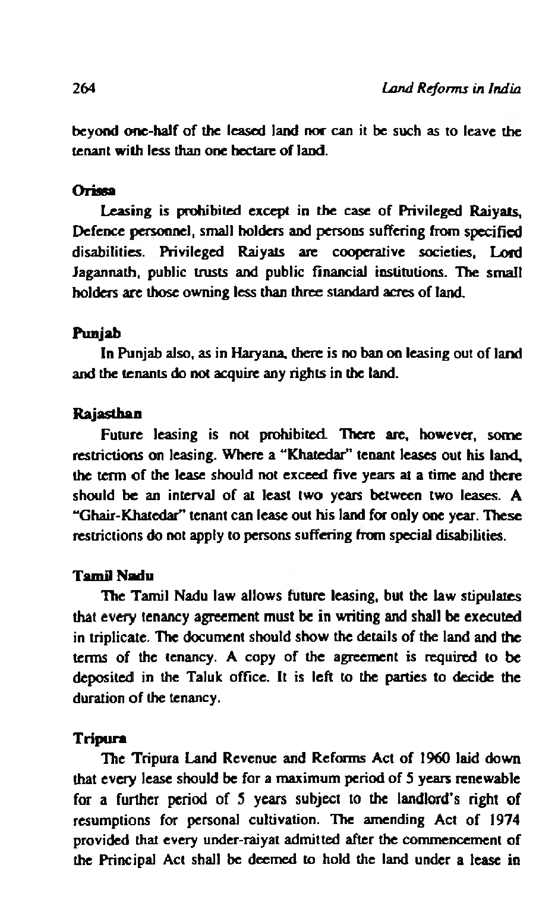

###### 264 Land Reforms in India

beyond one-half of the leased land nor can it be such as to leave the tenant with less than one hectare of land.

###### Orissa

Leasing is prohibited except in the case of Privileged Raiyats, Defence personnel, small holders and persons suffering from specified disabilities. Privileged Raiyats are cooperative societies, Lord Jagannath, public trusts and public financial institutions. The small holders are those owning less than three standard acres of land

###### Punjab

In Punjab also, as in Haryana, there is no ban on leasing out of land and the tenants do not acquire any rights in the land.

###### Rajasthan

Future leasing is not prohibited. There are, however, some restrictions on leasing. Where a “Khatedar” tenant leases out his land, the term of the lease should not exceed five years at a time and there should be an interval of at least two years between two leases. A “Ghair-Khatedar” tenant can lease out his land for only one year. These restrictions do not apply to persons suffering from special disabilities.

###### Tamil Nadu

The Tamil Nadu law allows future leasing, but the law stipulates that every tenancy agreement must be in writing and shall be executed in triplicate. The document should show the details of the land and the terms of the tenancy. A copy of the agreement is required to be deposited in the Taluk office. It is left to the parties to decide the duration of the tenancy.

###### Tripura

The Tripura Land Revenue and Reforms Act of 1960 laid down that every lease should be for a maximum period of 5 years renewable for a further period of 5 years subject to the landlord’s right of resumptions for personal cultivation. The amending Act of 1974 provided that every under-raiyat admitted after the commencement of the Principal Act shall be deemed to hold the land under a lease in

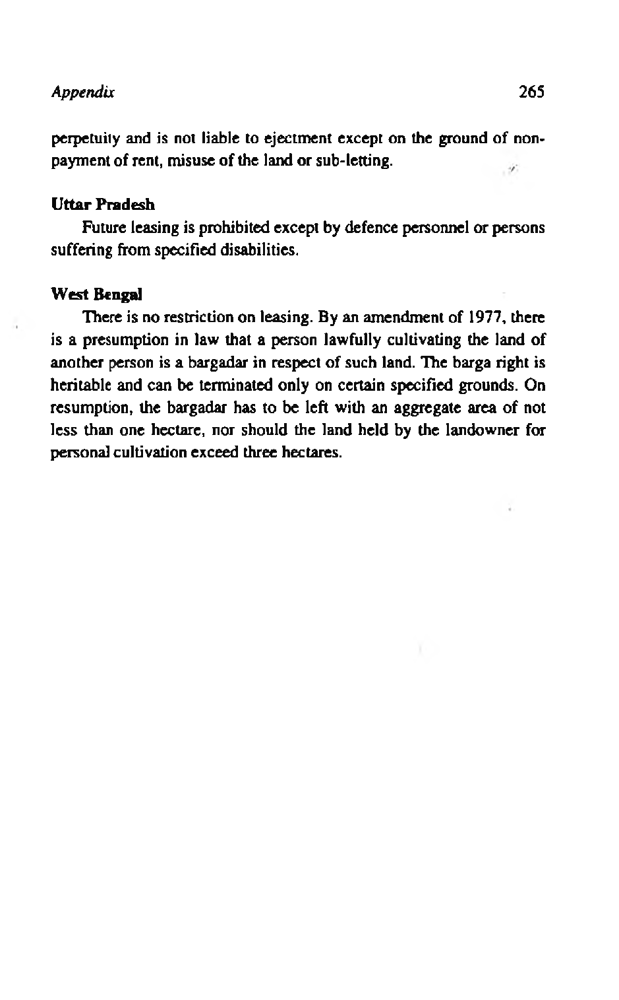

Appendix 265

perpetuity and is not liable to ejectment except on the ground of nonpayment of rent, misuse of the land or sub-letting.

###### Uttar Pradesh

Future leasing is prohibited except by defence personnel or persons suffering from specified disabilities.

###### West Bengal

There is no restriction on leasing. By an amendment of 1977, there is a presumption in law that a person lawfully cultivating the land of another person is a bargadar in respect of such land. The barga right is heritable and can be terminated only on certain specified grounds. On resumption, the bargadar has to be left with an aggregate area of not less than one hectare, nor should the land held by the landowner for personal cultivation exceed three hectares.

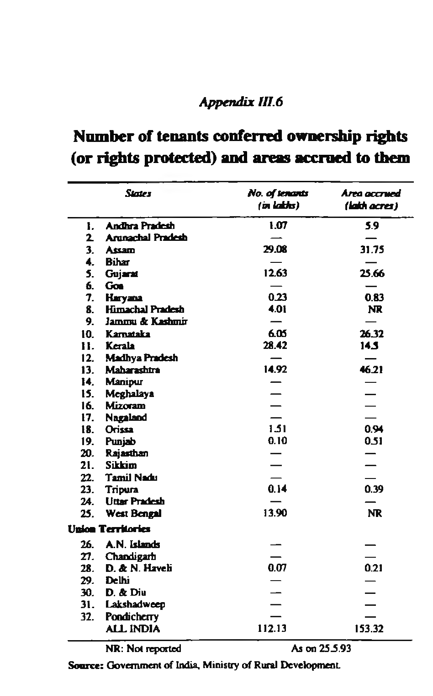

Appendix III. 6

##### Number of tenants conferred ownership rights (or rights protected) and areas accrued to them

Skiffi No. o f tenants (in lakhs)

Areaaccnted (lakh acres)

- 1. Andhra Pradesh 1.07 5.9
- 2. Aranachal Pradesh — —
- 3. Assam 29.08 31.75
- 4. Bihar — —
- 5. Gujarat 12.63 25.66
- 6. Goa — —
- 7. Havana 0.23 0.83
- 8. Himachal Pradesh 4.01 NR
- 9. Jammu & Kashmir — —
- 10. Karnataka 6.05 2632
- 11. Kerala 28.42 143
- 12. Madhya Pradesh — —
- 13. Maharashtra 14.92 46.21
- 14. Manipur — —
- 15. Meghalaya — —
- 16. Mizoram — —
- 17. Nagaland — —
- 18. Orissa 1.51 0.94
- 19. Punjab 0.10 0.51
- 20. Rajasthan — —
- 21. Sikkim — —
- 22. Tamil Nadu — —
- 23. Tripura 0.14 0.39
- 24. Uttar Pradesh — —
- 25. West Bengal

Union Territories

13.90 NR

- 26. A.N. Islands

— —

- 27. Chandigarh — —
- 28. D. & N. Haveli 0.07 0.21
- 29. Delhi — —
- 30. D. & Diu — —
- 31. Lakshadweep — —
- 32. Pondicherry — ALL INDIA 112.13 153.32 NR: Noi reported As on 25.5.93

Source: Government of India, Ministry of Rural Development

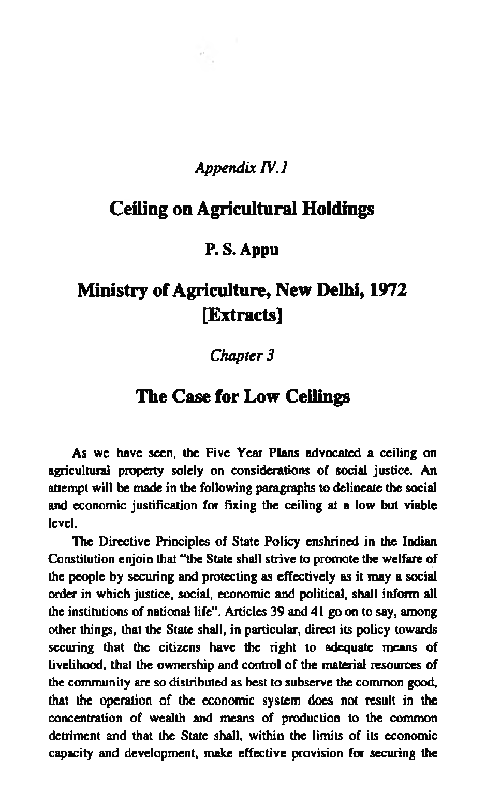

Appendix IV. 1

##### Ceiling on Agricultural Holdings

P. S. Appu

##### Ministry of Agriculture, New Delhi, 1972 [Extracts]

Chapter 3

##### The Case for Low Ceilings

As we have seen, the Five Year Plans advocated a ceiling on agricultural property solely on considerations of social justice. An attempt will be made in the following paragraphs to delineate the social and economic justification for fixing the ceiling at a low but viable level.

The Directive Principles of State Policy enshrined in the Indian Constitution enjoin that “the State shall strive to promote the welfare of the people by securing and protecting as effectively as it may a social order in which justice, social, economic and political, shall inform all the institutions of national life**. Articles 39 and 41 go on to say, among other things, that the State shall, in particular, direct its policy towards securing that the citizens have the right to adequate means of livelihood, that the ownership and control of the material resources of the community are so distributed as best to subserve the common good, that the operation of the economic system does not result in the concentration of wealth and means of production to the common detriment and that the State shall, within the limits of its economic capacity and development, make effective provision for securing the

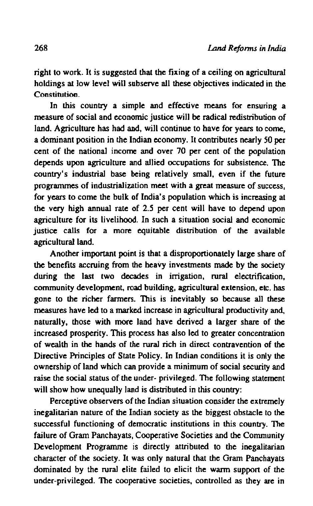

###### 268 Land Reforms in India

right to work. It is suggested that the fixing of a ceiling on agricultural holdings at low level will subserve all these objectives indicated in the Constitution.

In this country a simple and effective means for ensuring a measure of social and economic justice will be radical redistribution of land. Agriculture has had and, will continue to have for years to come, a dominant position in the Indian economy. It contributes nearly 50 per cent of the national income and over 70 per cent of the population depends upon agriculture and allied occupations for subsistence. The country’s industrial base being relatively small, even if the future programmes of industrialization meet with a great measure of success, for years to come the bulk of India's population which is increasing at the very high annual rate of 2.5 per cent will have to depend upon agriculture for its livelihood. In such a situation social and economic justice calls for a more equitable distribution of the available agricultural land.

Another important point is that a disproportionately large share of the benefits accruing from the heavy investments made by the society during the last two decades in irrigation, rural electrification, community development, road building, agricultural extension, etc. has gone to the richer farmers. This is inevitably so because all these measures have led to a marked increase in agricultural productivity and, naturally, those with more land have derived a larger share of the increased prosperity. This process has also led to greater concentration of wealth in the hands of the rural rich in direct contravention of the Directive Principles of State Policy. In Indian conditions it is only the ownership of land which can provide a minimum of social security and raise the social status of the under- privileged. The following statement will show how unequally land is distributed in this country:

Perceptive observers of the Indian situation consider the extremely inegalitarian nature of the Indian society as the biggest obstacle to the successful functioning of democratic institutions in this country. The failure of Gram Panchayats, Cooperative Societies and the Community Development Programme is directly attributed to the inegalitarian character of the society. It was only natural that the Gram Panchayats dominated by the rural elite failed to elicit the warm support of the under-privileged. The cooperative societies, controlled as they are in

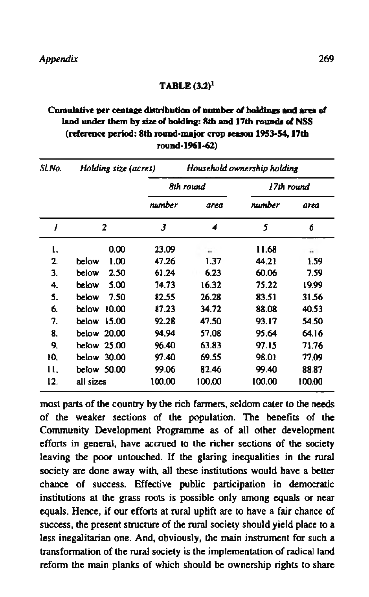

###### Appendix 269

TABLE (3.2)1

Cumulative per centage dlstributioa of number of boldines and area of land under them by size of bolding: 8tfa and 17th rounds of NSS (reference period: 8th round-major crop season 1953-54,17th round-1961-62)

Sl.No. Holding size (acres) Household ownership holding 8th round 17th round number area number area 1 2 3 4 5 6

- 1. 0.00 23.09 11.68
- 2. below 1.00 47.26 1.37 44.21 1.59
- 3. below 2.50 61.24 6.23 60.06 7.59
- 4. below 5.00 74.73 16.32 75.22 19.99
- 5. below 7.50 82.55 26.28 83.51 31.56
- 6. below 10.00 87.23 34.72 88.08 40.53
- 7. below 15.00 92.28 47.50 93.17 54.50
- 8. below 20.00 94.94 57.08 95.64 64.16
- 9. below 25.00 96.40 63.83 97.15 7176
- 10. below 30.00 97.40 69.55 98.01 77.09
- 11. below 50.00 99.06 82.46 99.40 88.87
- 12. all sizes 100.00 100.00 100.00 100.00

most parts of the country by the rich farmers, seldom cater to the needs of the weaker sections of the population. The benefits of the Community Development Programme as of all other development efforts in general, have accrued to the richer sections of the society leaving the poor untouched. If the glaring inequalities in the rural society are done away with, all these institutions would have a better chance of success. Effective public participation in democratic institutions at the grass roots is possible only among equals or near equals. Hence, if our efforts at rural uplift are to have a fair chance of success, the present structure of the rural society should yield place to a less inegalitarian one. And, obviously, the main instrument for such a transformation of the rural society is the implementation of radical land reform the main planks of which should be ownership rights to share

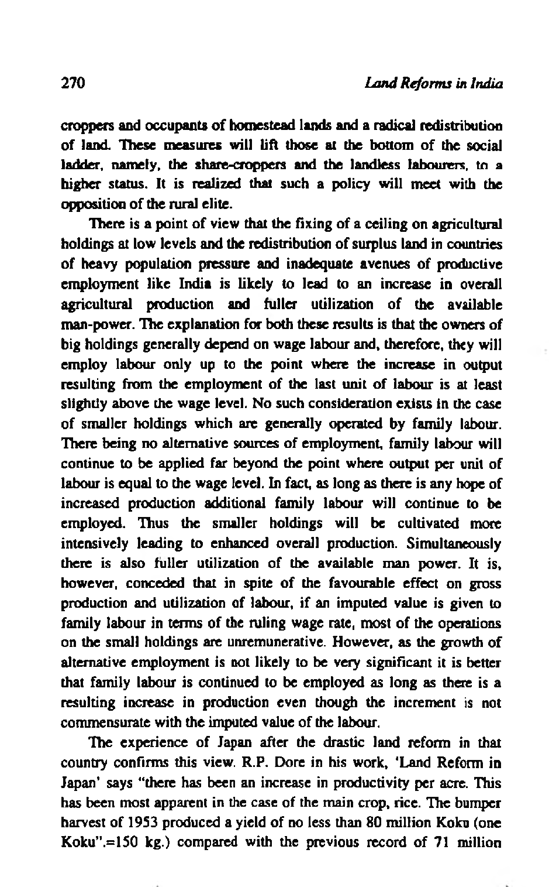

###### 270 Land Reforms in India

croppers and occupants of homestead lands and a radical redistribution of land These measures will lift those at the bottom of the social ladder, namely, the share-croppers and the landless labourers, to a higher status. It is realized that such a policy will meet with the opposition of the rural elite.

There is a point of view that the fixing of a ceiling on agricultural holdings at low levels and the redistribution of surplus land in countries of heavy population pressure and inadequate avenues of productive employment like India is likely to lead to an increase in overall agricultural production and fuller utilization of the available man-power. The explanation for both these results is that the owners of big holdings generally depend on wage labour and, therefore, they will employ labour only up to the point where the increase in output resulting from the employment of the last unit of labour is at least slightly above the wage level. No such consideration exists in the case of smaller holdings which are generally operated by family labour. There being no alternative sources of employment, family labour will continue to be applied far beyond the point where output per unit of labour is equal to the wage level. In fact, as long as there is any hope of increased production additional family labour will continue to be employed. Thus the smaller holdings will be cultivated more intensively leading to enhanced overall production. Simultaneously there is also fuller utilization of the available man power. It is, however, conceded that in spite of the favourable effect on gross production and utilization of labour, if an imputed value is given to family labour in terms of the ruling wage rate, most of the operations on the small holdings are unremunerative. However, as the growth of alternative employment is not likely to be very significant it is better that family labour is continued to be employed as long as there is a resulting increase in production even though the increment is not commensurate with the imputed value of the labour.

The experience of Japan after the drastic land reform in that country confirms this view. R.P. Dore in his work, ‘Land Reform in Japan’ says “there has been an increase in productivity per acre. This has been most apparent in the case of the main crop, rice. The bumper harvest of 1953 produced a yield of no less than 80 million Koku (one Koku”.=150 kg.) compared with the previous record of 71 million

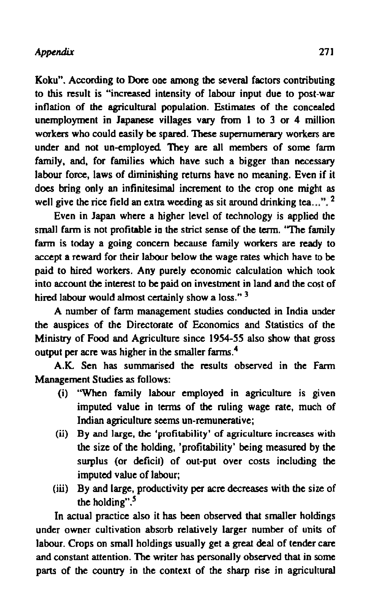

###### Appendix 271

Koku”. According to Dore one among the several factors contributing to this result is “increased intensity of labour input due to post-war inflation of the agricultural population. Estimates of the concealed unemployment in Japanese villages vary from 1 to 3 or 4 million workers who could easily be spared. These supernumerary workers are under and not un-employed They are all members of some farm family, and, for families which have such a bigger than necessary labour force, laws of diminishing returns have no meaning. Even if it does bring only an infinitesimal increment to the crop one might as well give the rice field an extra weeding as sit around drinking t e a . 2

Even in Japan where a higher level of technology is applied the small farm is not profitable in the strict sense of the term. “The family farm is today a going concern because family workers are ready to accept a reward for their labour below the wage rates which have to be paid to hired workers. Any purely economic calculation which took into account the interest to be paid on investment in land and the cost of hired labour would almost certainly show a loss.” 3

A number of farm management studies conducted in India under the auspices of the Directorate of Economics and Statistics of the Ministry of Food and Agriculture since 1954-55 also show that gross output per acre was higher in the smaller farms.4

A.K. Sen has summarised the results observed in the Farm Management Studies as follows:

- (i) “When family labour employed in agriculture is given imputed value in terms of the ruling wage rate, much of Indian agriculture seems un-remunerative;
- (ii) By and large, the ‘profitability* of agriculture increases with the size of the holding, 'profitability* being measured by the surplus (or deficit) of out-put over costs including the imputed value of labour;
- (iii) By and large, productivity per acre decreases with the size of the holding”.5

In actual practice also it has been observed that smaller holdings under owner cultivation absorb relatively larger number of units of labour. Crops on small holdings usually get a great deal of tender care and constant attention. The writer has personally observed that in some parts of the country in the context of the sharp rise in agricultural

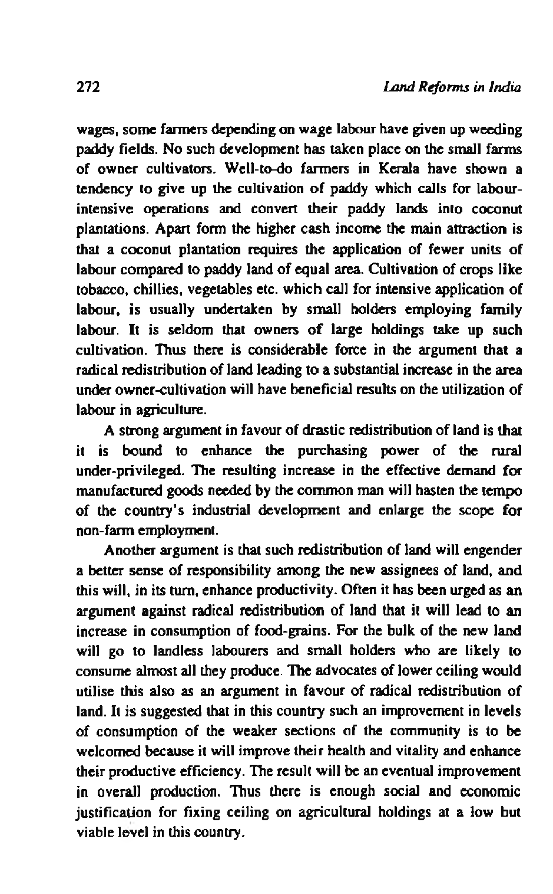

###### 272 Land Reforms in India

wages, some farmers depending on wage labour have given up weeding paddy fields. No such development has taken place on the small farms of owner cultivators. Well-to-do farmers in Kerala have shown a tendency to give up the cultivation of paddy which calls for labourintensive operations and convert their paddy lands into coconut plantations. Apart form the higher cash income the main attraction is that a coconut plantation requires the application of fewer units of labour compared to paddy land of equal area. Cultivation of crops like tobacco, chillies, vegetables etc. which call for intensive application of labour, is usually undertaken by small holders employing family labour. It is seldom that owners of large holdings take up such cultivation. Thus there is considerable force in the argument that a radical redistribution of land leading to a substantial increase in the area under owner-cultivation will have beneficial results on the utilization of labour in agriculture.

A strong argument in favour of drastic redistribution of land is that it is bound to enhance the purchasing power of the rural under-privileged. The resulting increase in the effective demand for manufactured goods needed by the common man will hasten the tempo of the country’s industrial development and enlarge the scope for non-farm employment.

Another argument is that such redistribution of land will engender a better sense of responsibility among the new assignees of land, and this will, in its turn, enhance productivity. Often it has been urged as an argument against radical redistribution of land that it will lead to an increase in consumption of food-grains. For the bulk of the new land will go to landless labourers and small holders who are likely to consume almost all they produce. The advocates of lower ceiling would utilise this also as an argument in favour of radical redistribution of land. It is suggested that in this country such an improvement in levels of consumption of the weaker sections of the community is to be welcomed because it will improve their health and vitality and enhance their productive efficiency. The result will be an eventual improvement in overall production. Thus there is enough social and economic justification for fixing ceiling on agricultural holdings at a low but viable level in this country.

###### Appendix 273

###### Notes

- 1. Government of India, the National Sample Survey, Number 144. 8.
- 2. R.P. Dore, Land Reform in Japan, üxtord University Press, pp. 213-214.
- 3. Ibid., p. 300.
- 4. Directorate of Economics and Statistics, Ministry of Food & Agriculture, “Farm Management in India”, April, 1966.
- 5. A.K.Sen, An Aspect of Indian Agriculture, Economic Weekly, Annual Number, 1962. 243.

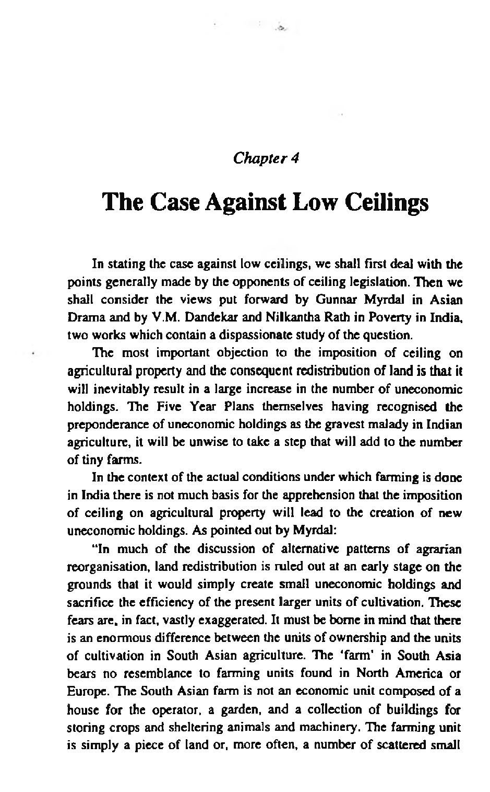

###### Chapter 4

### The Case Against Low Ceilings

In stating the case against low ceilings, we shall first deal with the points generally made by the opponents of ceiling legislation. Then we shall consider the views put forward by Gunnar Myrdal in Asian Drama and by V.M. Dandekar and Nilkantha Rath in Poverty in India, two works which contain a dispassionate study of the question.

The most important objection to the imposition of ceiling on agricultural property and the consequent redistribution of land is that it will inevitably result in a large increase in the number of uneconomic holdings. The Five Year Plans themselves having recognised the preponderance of uneconomic holdings as the gravest malady in Indian agriculture, it will be unwise to take a step that will add to the number of tiny farms.

In the context of the actual conditions under which farming is done in India there is not much basis for the apprehension that the imposition of ceiling on agricultural property will lead to the creation of new uneconomic holdings. As pointed out by Myrdal:

“In much of the discussion of alternative patterns of agrarian reorganisation, land redistribution is ruled out at an early stage on the grounds that it would simply create small uneconomic holdings and sacrifice the efficiency of the present larger units of cultivation. These fears are, in fact, vastly exaggerated. It must be borne in mind that there is an enormous difference between the units of ownership and the units of cultivation in South Asian agriculture. The ‘farm’ in South Asia bears no resemblance to farming units found in North America or Europe. The South Asian farm is not an economic unit composed of a house for the operator, a garden, and a collection of buildings for storing crops and sheltering animals and machinery. The farming unit is simply a piece of land or, more often, a number of scattered small

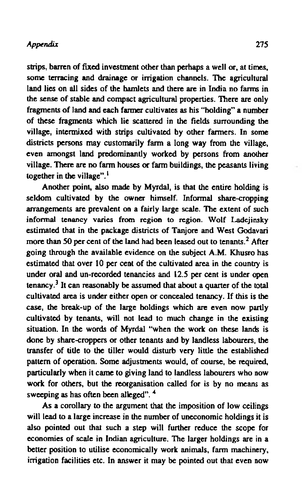

###### Appendix 275

strips, barren of fixed investment other than perhaps a well or, at times, some terracing and drainage or irrigation channels. The agricultural land lies on all sides of the hamlets and there are in India no farms in the sense of stable and compact agricultural properties. There are only fragments of land and each farmer cultivates as his “holding” a number of these fragments which lie scattered in the fields surrounding the village, intermixed with strips cultivated by other farmers. In some districts persons may customarily farm a long way from the village, even amongst land predominantly worked by persons from another village. There are no farm houses or farm buildings, the peasants living together in the village”.1

Another point, also made by Myrdal, is that the entire holding is seldom cultivated by the owner himself. Informal share-cropping arrangements are prevalent on a fairly large scale. The extent of such informal tenancy varies from region to region. Wolf Ladcjinsky estimated that in the package districts of Tanjore and West Godavari more than 50 per cent of the land had been leased out to tenants.2 After going through the available evidence on the subject A.M. Khusro has estimated that over 10 per cent of the cultivated area in the country is under oral and un-recorded tenancies and 12.5 per cent is under open tenancy.3 It can reasonably be assumed that about a quarter of the total cultivated area is under either open or concealed tenancy. If this is the case, the break-up of the large holdings which are even now partly cultivated by tenants, will not lead to much change in the existing situation. In the words of Myrdal “when the work on these lands is done by share-croppers or other tenants and by landless labourers, the transfer of title to the tiller would disturb very little the established pattern of operation. Some adjustments would, of course, be required, particularly when it came to giving land to landless labourers who now work for others, but the reorganisation called for is by no means as sweeping as has often been alleged”. 4

As a corollary to the argument that the imposition of low ceilings will lead to a large increase in the number of uneconomic holdings it is also pointed out that such a step will further reduce the scope for economies of scale in Indian agriculture. The larger holdings are in a better position to utilise economically work animals, farm machinery, irrigation facilities etc. In answer it may be pointed out that even now

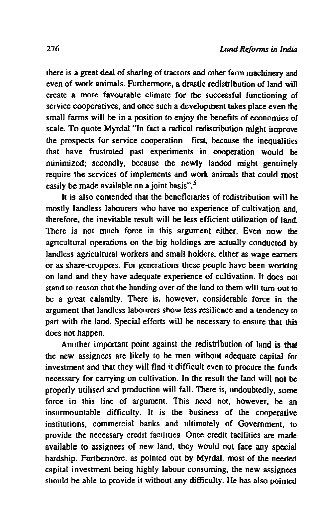

###### 276 Land Reforms in India

there is a great deal of sharing of tractors and other farm machinery and even of work animals. Furthermore, a drastic redistribution of land will create a more favourable climate for the successful functioning of service cooperatives, and once such a development takes place even the small farms will be in a position to enjoy the benefits of economies of scale. To quote Myrdal “In fact a radical redistribution might improve the prospects for service cooperation—first, because the inequalities that have frustrated past experiments in cooperation would be minimized; secondly, because the newly landed might genuinely require the services of implements and work animals that could most easily be made available on a joint basis”.5

It is also contended that the beneficiaries of redistribution will be mostly landless labourers who have no experience of cultivation and, therefore, the inevitable result will be less efficient utilization of land. There is not much force in this argument either. Even now the agricultural operations on the big holdings are actually conducted by landless agricultural workers and small holders, either as wage earners or as share-croppers. For generations these people have been working on land and they have adequate experience of cultivation. It does not stand to reason that the handing over of the land to them will turn out to be a great calamity. There is, however, considerable force in the argument that landless labourers show less resilience and a tendency to part with the land. Special efforts will be necessary to ensure that this does not happen.

Another important point against the redistribution of land is that the new assignees are likely to be men without adequate capital for investment and that they will find it difficult even to procure the funds necessary for carrying on cultivation. In the result the land will not be properly utilised and production will fall. There is, undoubtedly, some force in this line of argument. This need not, however, be an insurmountable difficulty. It is the business of the cooperative institutions, commercial banks and ultimately of Government, to provide the necessary credit facilities. Once credit facilities are made available to assignees of new land, they would not face any special hardship. Furthermore, as pointed out by Myrdal, most of the needed capital investment being highly labour consuming, the new assignees should be able to provide it without any difficulty. He has also pointed

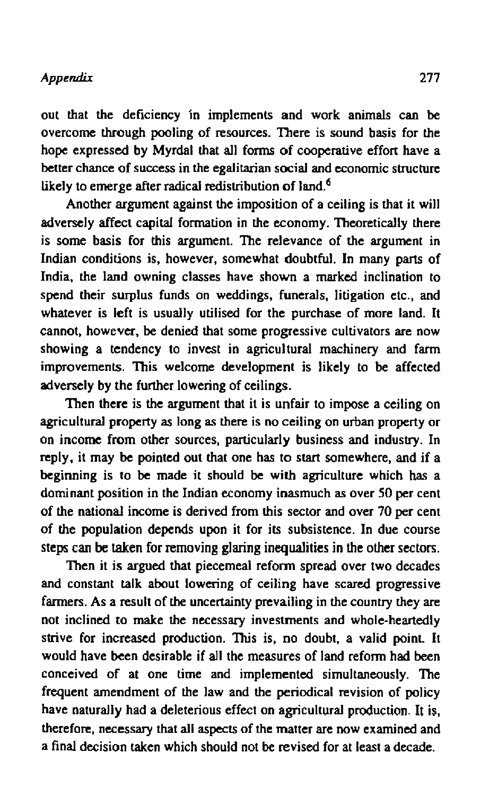

###### Appendix 277

out that the deficiency in implements and work animals can be overcome through pooling of resources. There is sound basis for the hope expressed by Myrdal that all forms of cooperative effort have a better chance of success in the egalitarian social and economic structure likely to emerge after radical redistribution of land.6

Another argument against the imposition of a ceiling is that it will adversely affect capital formation in the economy. Theoretically there is some basis for this argument. The relevance of the argument in Indian conditions is, however, somewhat doubtful. In many parts of India, the land owning classes have shown a marked inclination to spend their surplus funds on weddings, funerals, litigation etc., and whatever is left is usually utilised for the purchase of more land. It cannot, however, be denied that some progressive cultivators are now showing a tendency to invest in agricultural machinery and farm improvements. This welcome development is likely to be affected adversely by the further lowering of ceilings.

Then there is the argument that it is unfair to impose a ceiling on agricultural property as long as there is no ceiling on urban property or on income from other sources, particularly business and industry. In reply, it may be pointed out that one has to start somewhere, and if a beginning is to be made it should be with agriculture which has a dominant position in the Indian economy inasmuch as over 50 per cent of the national income is derived from this sector and over 70 per cent of the population depends upon it for its subsistence. In due course steps can be taken for removing glaring inequalities in the other sectors.

Then it is argued that piecemeal reform spread over two decades and constant talk about lowering of ceiling have scared progressive farmers. As a result of the uncertainty prevailing in the country they are not inclined to make the necessary investments and whole-heartedly strive for increased production. This is, no doubt, a valid point. It would have been desirable if all the measures of land reform had been conceived of at one time and implemented simultaneously. The frequent amendment of the law and the periodical revision of policy have naturally had a deleterious effect on agricultural production. It is, therefore, necessary that all aspects of the matter are now examined and a final decision taken which should not be revised for at least a decade.

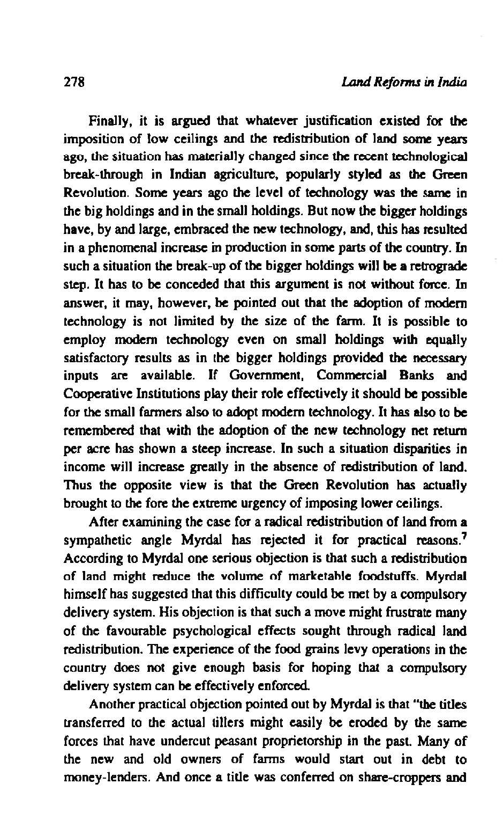

###### 278 Land Reforms in India

Finally, it is argued that whatever justification existed for the imposition of low ceilings and the redistribution of land some years ago, the situation has materially changed since the recent technological break-through in Indian agriculture, popularly styled as the Green Revolution. Some years ago the level of technology was the same in the big holdings and in the small holdings. But now the bigger holdings have, by and large, embraced the new technology, and, this has resulted in a phenomena] increase in production in some parts of the country. In such a situation the break-up of the bigger holdings will be a retrograde step. It has to be conceded that this argument is not without force. In answer, it may, however, be pointed out that the adoption of modem technology is not limited by the size of the farm. It is possible to employ modem technology even on small holdings with equally satisfactory results as in the bigger holdings provided the necessary inputs are available. If Government, Commercial Banks and Cooperative Institutions play their role effectively it should be possible for the small farmers also to adopt modem technology. It has also to be remembered that with the adoption of the new technology net return per acre has shown a steep increase. In such a situation disparities in income will increase greatly in the absence of redistribution of land. Thus the opposite view is that the Green Revolution has actually brought to the fore the extreme urgency of imposing lower ceilings.

After examining the case for a radical redistribution of land from a sympathetic angle Myrdal has rejected it for practical reasons.7 According to Myrdal one serious objection is that such a redistribution of land might reduce the volume of marketable foodstuffs. Myrdal himself has suggested that this difficulty could be met by a compulsory delivery system. His objection is that such a move might frustrate many of the favourable psychological effects sought through radical land redistribution. The experience of the food grains levy operations in the country does not give enough basis for hoping that a compulsory delivery system can be effectively enforced.

Another practical objection pointed out by Myrdal is that “the titles transferred to the actual tillers might easily be eroded by the same forces that have undercut peasant proprietorship in the past. Many of the new and old owners of farms would start out in debt to money-lenders. And once a title was conferred on share-croppers and

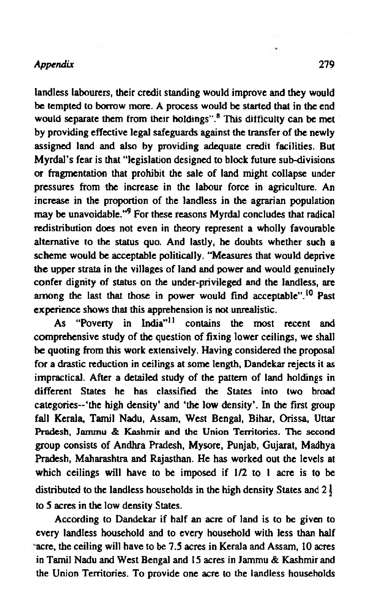

###### Appendix 279

landless labourers, their credit standing would improve and they would be tempted to borrow more. A process would be started that in the end would separate them from their holdings”.8 This difficulty can be met by providing effective legal safeguards against the transfer of the newly assigned land and also by providing adequate credit facilities. But Myrdal’s fear is that “legislation designed to block future sub-divisions or fragmentation that prohibit the sale of land might collapse under pressures from the increase in the labour force in agriculture. An increase in the proportion of the landless in the agrarian population may be unavoidable.”9 For these reasons Myrdal concludes that radical redistribution does not even in theory represent a wholly favourable alternative to the status quo. And lastly, he doubts whether such a scheme would be acceptable politically. “Measures that would deprive the upper strata in the villages of land and power and would genuinely confer dignity of status on the under-privileged and the landless, are among the last that those in power would find acceptable”.10 Past experience shows that this apprehension is not unrealistic.

As “Poverty in India”11 contains the most recent and comprehensive study of the question of fixing lower ceilings, we shall be quoting from this work extensively. Having considered the proposal for a drastic reduction in ceilings at some length, Dandekar rejects it as impractical. After a detailed study of the pattern of land holdings in different States he has classified the States into two broad categories-4the high density’ and ‘the low density*. In the first group fall Kerala, Tamil Nadu, Assam, West Bengal, Bihar, Orissa, Uttar Pradesh, Jammu & Kashmir and the Union Territories. The second group consists of Andhra Pradesh, Mysore, Punjab, Gujarat, Madhya Pradesh, Maharashtra and Rajasthan. He has worked out the levels at which ceilings will have to be imposed if 1/2 to 1 acre is to be distributed to the landless households in the high density States and 2 \ to 5 acres in the low density States.

According to Dandekar if half an acre of land is to be given to every landless household and to every household with less than half acre, the ceiling will have to be 7.5 acres in Kerala and Assam, 10 acres in Tamil Nadu and West Bengal and 15 acres in Jammu & Kashmir and the Union Territories. To provide one acre to the landless households

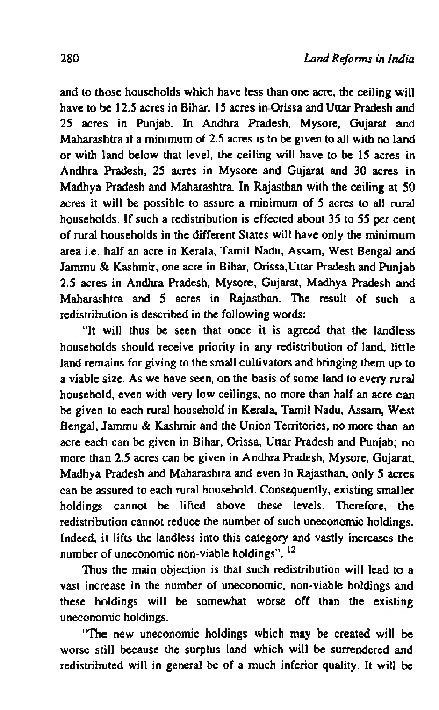

###### 280 Land Reforms in India

and to those households which have less than one acre, the ceiling will have to be 12.5 acres in Bihar, 15 acres in Orissa and Uttar Pradesh and 25 acres in Punjab. In Andhra Pradesh, Mysore, Gujarat and Maharashtra if a minimum of 2.5 acres is to be given to all with no land or with land below that level, the ceiling will have to be 15 acres in Andhra Pradesh, 25 acres in Mysore and Gujarat and 30 acres in Madhya Pradesh and Maharashtra. In Rajasthan with the ceiling at 50 acres it will be possible to assure a minimum of 5 acres to all rural households. If such a redistribution is effected about 35 to 55 per cent of rural households in the different States will have only the minimum area i.e. half an acre in Kerala, Tamil Nadu, Assam, West Bengal and Jammu & Kashmir, one acre in Bihar, Orissa,Uttar Pradesh and Punjab 2.5 acres in Andhra Pradesh, Mysore, Gujarat, Madhya Pradesh and Maharashtra and 5 acres in Rajasthan. The result of such a redistribution is described in the following words:

“It will thus be seen that once it is agreed that the landless households should receive priority in any redistribution of land, little land remains for giving to the small cultivators and bringing them up to a viable size. As we have seen, on the basis of some land to every rural household, even with very low ceilings, no more than half an acre can be given to each rural household in Kerala, Tamil Nadu, Assam, West Bengal, Jammu & Kashmir and the Union Territories, no more than an acre each can be given in Bihar, Orissa, Uttar Pradesh and Punjab; no more than 2.5 acres can be given in Andhra Pradesh, Mysore, Gujarat, Madhya Pradesh and Maharashtra and even in Rajasthan, only 5 acres can be assured to each rural household. Consequently, existing smaller holdings cannot be lifted above these levels. Therefore, the redistribution cannot reduce the number of such uneconomic holdings. Indeed, it lifts the landless into this category and vastly increases the number of uneconomic non-viable holdings’*.12

Thus the main objection is that such redistribution will lead to a vast increase in the number of uneconomic, non-viable holdings and these holdings will be somewhat worse off than the existing uneconomic holdings.

“The new uneconomic holdings which may be created will be worse still because the surplus land which will be surrendered and redistributed will in general be of a much inferior quality. It will be

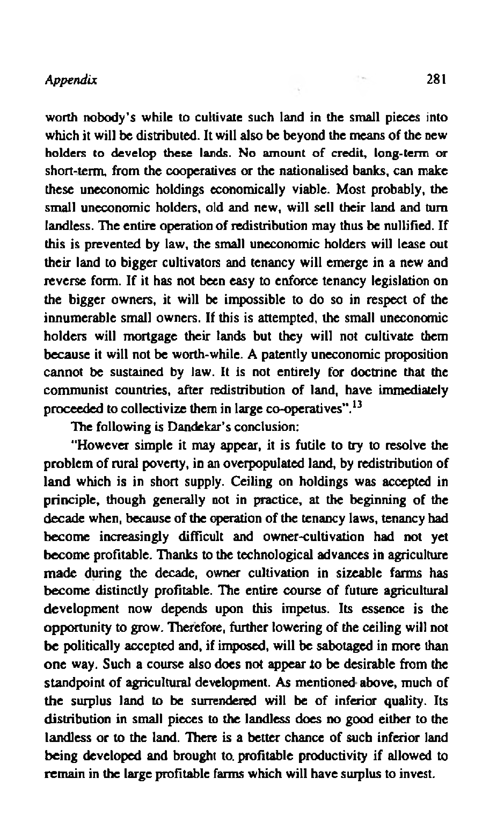

###### Appendix 281

worth nobody's while to cultivate such land in the small pieces into which it will be distributed. It will also be beyond the means of the new holders to develop these lands. No amount of credit, long-term or short-term, from the cooperatives or the nationalised banks, can make these uneconomic holdings economically viable. Most probably, the small uneconomic holders, old and new, will sell their land and turn landless. The entire operation of redistribution may thus be nullified. If this is prevented by law, the small uneconomic holders will lease out their land to bigger cultivators and tenancy will emerge in a new and reverse form. If it has not been easy to enforce tenancy legislation on the bigger owners, it will be impossible to do so in respect of the innumerable small owners. If this is attempted, the small uneconomic holders will mortgage their lands but they will not cultivate them because it will not be worth-while. A patently uneconomic proposition cannot be sustained by law. It is not entirely for doctrine that the communist countries, after redistribution of land, have immediately proceeded to collectivize them in large co-operatives”.13

The following is Dandekar’s conclusion: “However simple it may appear, it is futile to try to resolve the problem of rural poverty, in an overpopulated land, by redistribution of land which is in short supply. Ceiling on holdings was accepted in principle, though generally not in practice, at the beginning of the decade when, because of the operation of the tenancy laws, tenancy had become increasingly difficult and owner-cultivation had not yet become profitable. Thanks to the technological advances in agriculture made during the decade, owner cultivation in sizeable farms has become distinctly profitable. The entire course of future agricultural development now depends upon this impetus. Its essence is the opportunity to grow. Therefore, further lowering of the ceiling will not be politically accepted and, if imposed, will be sabotaged in more than one way. Such a course also does not appear to be desirable from the standpoint of agricultural development. As mentioned above, much of the surplus land to be surrendered will be of inferior quality. Its distribution in small pieces to the landless does no good either to the landless or to the land. There is a better chance of such inferior land being developed and brought to. profitable productivity if allowed to remain in the large profitable farms which will have surplus to invest.

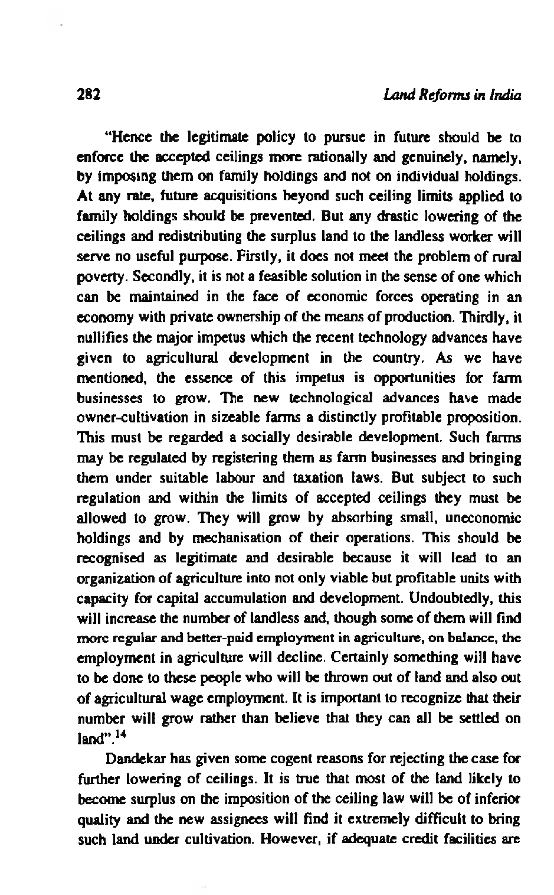

###### 282 Land Reforms in India

“Hence the legitimate policy to pursue in future should be to enforce the accepted ceilings more rationally and genuinely, namely, by imposing them on family holdings and not on individual holdings. At any rate, future acquisitions beyond such ceiling limits applied to family holdings should be prevented. But any drastic lowering of the ceilings and redistributing the surplus land to the landless worker will serve no useful purpose. Firstly, it does not meet the problem of rural poverty. Secondly, it is not a feasible solution in the sense of one which can be maintained in the face of economic forces operating in an economy with private ownership of the means of production. Thirdly, it nullifies the major impetus which the recent technology advances have given to agricultural development in the country. As we have mentioned, the essence of this impetus is opportunities for farm businesses to grow. The new technological advances have made owner-cultivation in sizeable farms a distinctly profitable proposition. This must be regarded a socially desirable development. Such farms may be regulated by registering them as farm businesses and bringing them under suitable labour and taxation laws. But subject to such regulation and within the limits of accepted ceilings they must be allowed to grow. They will grow by absorbing small, uneconomic holdings and by mechanisation of their operations. This should be recognised as legitimate and desirable because it will lead to an organization of agriculture into not only viable but profitable units with capacity for capital accumulation and development. Undoubtedly, this will increase the number of landless and, though some of them will find more regular and better-paid employment in agriculture, on balance, the employment in agriculture will decline. Certainly something will have to be done to these people who will be thrown out of land and also out of agricultural wage employment. It is important to recognize that their number will grow rather than believe that they can all be settled on land”.M

Dandekar has given some cogent reasons for rejecting the case for further lowering of ceilings. It is true that most of the land likely to become surplus on the imposition of the ceiling law will be of inferior quality and the new assignees will find it extremely difficult to bring such land under cultivation. However, if adequate credit facilities are

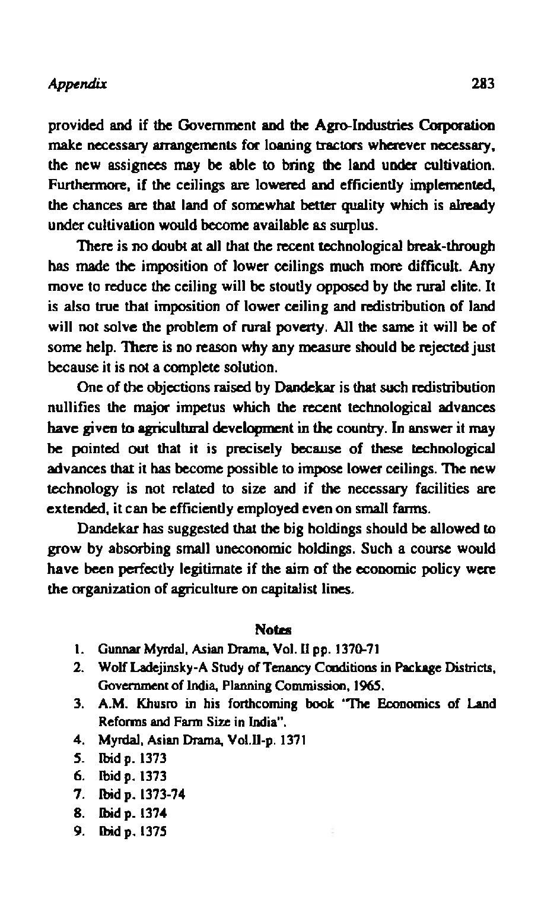

###### Appendix 283

provided and if the Government and the Agro-Industries Corporation make necessary arrangements for loaning tractors wherever necessary, the new assignees may be able to bring the land under cultivation. Furthermore, if the ceilings are lowered and efficiently implemented, the chances are that land of somewhat better quality which is already under cultivation would become available as surplus.

There is no doubt at all that the recent technological break-through has made the imposition of lower ceilings much more difficult. Any move to reduce the ceiling will be stoutly opposed by the rural elite. It is also true that imposition of lower ceiling and redistribution of land will not solve the problem of rural poverty. All the same it will be of some help. There is no reason why any measure should be rejected just because it is not a complete solution.

One of the objections raised by Dandekar is that such redistribution nullifies the major impetus which the recent technological advances have given to agricultural development in the country. In answer it may be pointed out that it is precisely because of these technological advances that it has become possible to impose lower ceilings. The new technology is not related to size and if the necessary facilities are extended, it can be efficiently employed even on small farms.

Dandekar has suggested that the big holdings should be allowed to grow by absorbing small uneconomic holdings. Such a course would have been perfectly legitimate if the aim of the economic policy were the organization of agriculture on capitalist lines.

Notes

- 1. Gunnar Myrdal, Asian Drama, Vol. II pp. 1370-71
- 2. Wolf Ladejinsky-A Study of Tenancy Conditions in Package Districts, Government of India, Planning Commission, 1965.
- 3. A.M. Khusro in his forthcoming book ‘The Economics of Land Reforms and Farm Size in India”.
- 4. Myrdal, Asian Drama, Vol.II-p. 1371
- 5. Ibid p. 1373
- 6. Ibid p. 1373
- 7. Ibid p. 1373-74
- 8. Ibid p. 1374
- 9. Ibid p. 1375

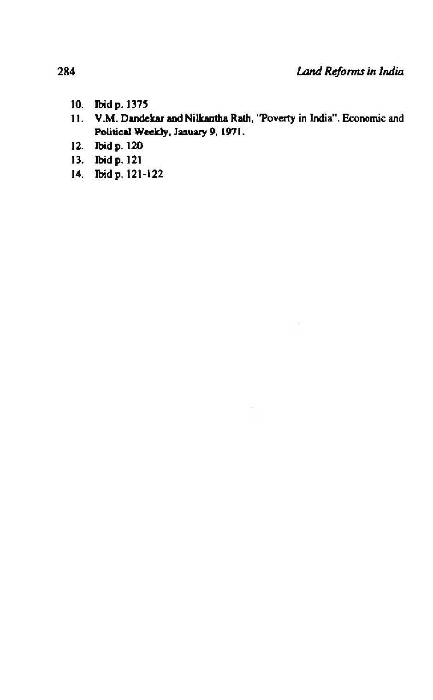

###### 284 Land Reforms in India

- 10. Ibid p. 1375
- 11. V.M. Dandekar and Nilkantha Rath, “Poverty in India". Economic and Political Weekly, January 9, 1971.
- 12. Ibid p. 120
- 13. Ibid p. 121
- 14. Ibid p. 121-122

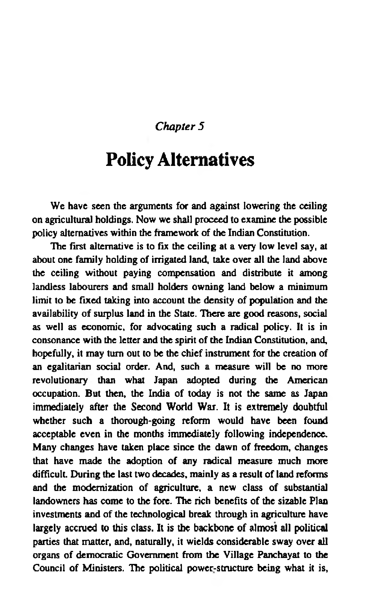

###### Chapter 5

### Policy Alternatives

We have seen the arguments for and against lowering the ceiling on agricultural holdings. Now we shall proceed to examine the possible policy alternatives within the framework of the Indian Constitution.

The first alternative is to fix the ceiling at a very low level say, at about one family holding of irrigated land, take over all the land above the ceiling without paying compensation and distribute it among landless labourers and small holders owning land below a minimum limit to be fixed taking into account the density of population and the availability of surplus land in the State. There are good reasons, social as well as economic, for advocating such a radical policy. It is in consonance with the letter and the spirit of the Indian Constitution, and, hopefully, it may turn out to be the chief instrument for the creation of an egalitarian social order. And, such a measure will be no more revolutionary than what Japan adopted during the American occupation. But then, the India of today is not the same as Japan immediately after the Second World War. It is extremely doubtful whether such a thorough-going reform would have been found acceptable even in the months immediately following independence. Many changes have taken place since the dawn of freedom, changes that have made the adoption of any radical measure much more difficult. During the last two decades, mainly as a result of land reforms and the modernization of agriculture, a new class of substantial landowners has come to the fore. The rich benefits of the sizable Plan investments and of the technological break through in agriculture have largely accrued to this class. It is the backbone of almost all political parties that matter, and, naturally, it wields considerable sway over all organs of democratic Government from the Village Panchayat to the Council of Ministers. The political power-structure being what it is,

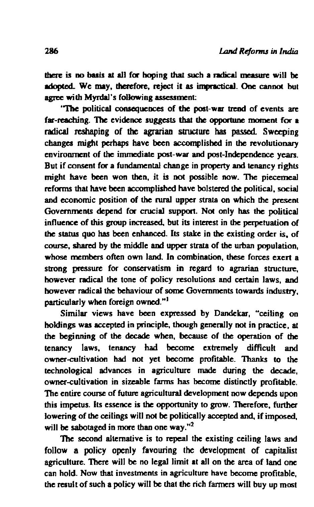

###### 286 Land Reforms in India

there is no basis at all for hoping that such a radical measure will be adopted. We may, therefore, reject it as impractical. One cannot but agree with Myrdal’s following assessment:

‘The political consequences of the post-war trend of events are far-reaching. The evidence suggests that the opportune moment for a radical reshaping of the agrarian structure has passed. Sweeping changes might perhaps have been accomplished in the revolutionary environment of the immediate post-war and post-Independence years. But if consent for a fundamental change in property and tenancy rights might have been won then, it is not possible now. The piecemeal reforms that have been accomplished have bolstered the political, social and economic position of the rural upper strata on which the present Governments depend for crucial support. Not only has the political influence of this group increased, but its interest in the perpetuation of the status quo has been enhanced. Its stake in the existing order is, of course, shared by the middle and upper strata of the urban population, whose members often own land. In combination, these forces exert a strong pressure for conservatism in regard to agrarian structure, however radical the tone of policy resolutions and certain laws, and however radical the behaviour of some Governments towards industry, particularly when foreign owned.”1

Similar views have been expressed by Dandekar, “ceiling on holdings was accepted in principle, though generally not in practice, at the beginning of the decade when, because of the operation of the tenancy laws, tenancy had become extremely difficult and owner-cultivation had not yet become profitable. Thanks to the technological advances in agriculture made during the decade, owner-cultivation in sizeable farms has become distinctly profitable. The entire course of future agricultural development now depends upon this impetus. Its essence is the opportunity to grow. Therefore, further lowering of the ceilings will not be politically accepted and, if imposed, will be sabotaged in more than one way.”2

The second alternative is to repeal the existing ceiling laws and follow a policy openly favouring the development of capitalist agriculture. There will be no legal limit at all on the area of land one can hold. Now that investments in agriculture have become profitable, the result of such a policy will be that the rich farmers will buy up most

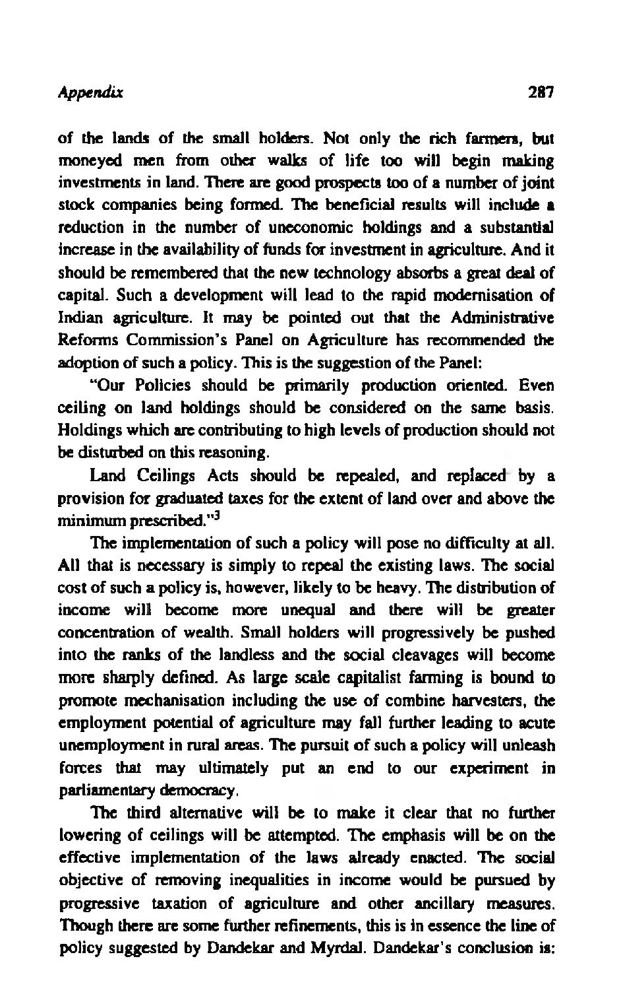

###### Appendix 287

of the lands of the small holders. Not only the rich farmers, but moneyed men from other walks of life too will begin making investments in land. There are good prospects too of a number of joint stock companies being formed. The beneficial results will include a reduction in the number of uneconomic holdings and a substantial increase in the availability of funds for investment in agriculture. And it should be remembered that the new technology absorbs a great deal of capital. Such a development will lead to the rapid modernisation of Indian agriculture. It may be pointed out that the Administrative Reforms Commission's Panel on Agriculture has recommended the adoption of such a policy. This is the suggestion of the Panel:

“Our Policies should be primarily production oriented. Even ceiling on land holdings should be considered on the same basis. Holdings which are contributing to high levels of production should not be disturbed on this reasoning.

Land Ceilings Acts should be repealed, and replaced by a provision for graduated taxes for the extent of land over and above the minimum prescribed.”3

The implementation of such a policy will pose no difficulty at all. All that is necessary is simply to repeal the existing laws. The social cost of such a policy is, however, likely to be heavy. The distribution of income will become more unequal and there will be greater concentration of wealth. Small holders will progressively be pushed into the ranks of the landless and the social cleavages will become more sharply defined. As large scale capitalist fanning is bound to promote mechanisation including the use of combine harvesters, the employment potential of agriculture may fall further leading to acute unemployment in rural areas. The pursuit of such a policy will unleash forces that may ultimately put an end to our experiment in parliamentary democracy.

The third alternative will be to make it clear that no further lowering of ceilings will be attempted. The emphasis will be on the effective implementation of the laws already enacted. The social objective of removing inequalities in income would be pursued by progressive taxation of agriculture and other ancillary measures. Though there are some further refinements, this is in essence the line of policy suggested by Dandekar and Myrdal. Dandekar’s conclusion is:

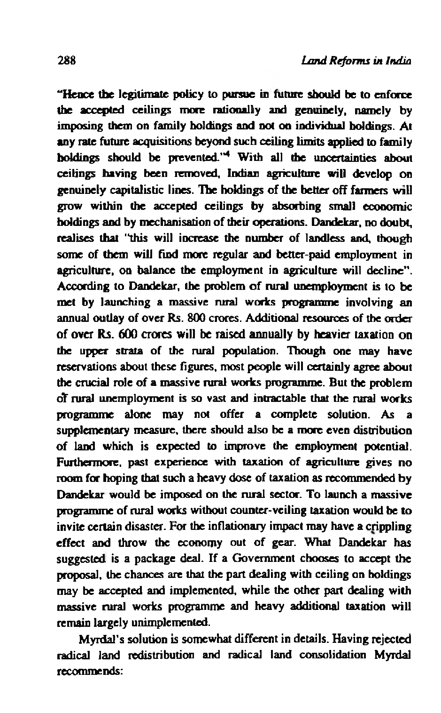

###### 288 Land Reforms in India

“Hence the legitimate policy to pursue in future should be to enforce the accepted ceilings more rationally and genuinely, namely by imposing them on family holdings and not on individual holdings. At any rate future acquisitions beyond such ceiling limits applied to family holdings should be prevented/"4 With all the uncertainties about ceilings having been removed, Indian agriculture will develop on genuinely capitalistic lines. The holdings of the better off fanners will grow within the accepted ceilings by absorbing small economic holdings and by mechanisation of their operations. Dandekar, no doubt, realises that “this will increase the number of landless and, though some of them will find more regular and better-paid employment in agriculture, on balance the employment in agriculture will decline”. According to Dandekar, the problem of rural unemployment is to be met by launching a massive rural works programme involving an annua] outlay of over Rs. 800 crores. Additional resources of the order of over Rs. 600 crores will be raised annually by heavier taxation on the upper strata of the rural population. Though one may have reservations about these figures, most people will certainly agree about the crucial role of a massive rural works programme. But the problem oT rural unemployment is so vast and intractable that the rural works programme alone may not offer a complete solution. As a supplementary measure, there should also be a more even distribution of land which is expected to improve the employment potential. Furthermore, past experience with taxation of agriculture gives no room for hoping that such a heavy dose of taxation as recommended by Dandekar would be imposed on the rural sector. To launch a massive programme of rural works without counter-veiling taxation would be to invite certain disaster. For the inflationary impact may have a crippling effect and throw the economy out of gear. What Dandekar has suggested is a package deal. If a Government chooses to accept the proposal, the chances are that the part dealing with ceiling on holdings may be accepted and implemented, while the other part dealing with massive rural works programme and heavy additional taxation will remain largely unimplemented.

Myrdal’s solution is somewhat different in details. Having rejected radical land redistribution and radical land consolidation Myrdal recommends:

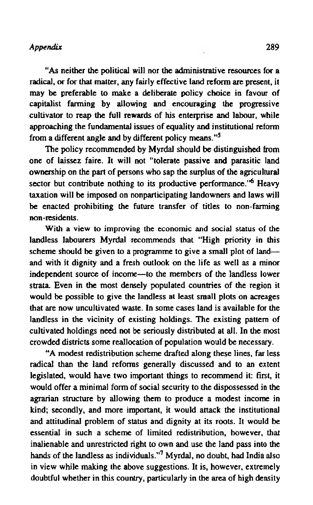

Appendix 289

“As neither the political will nor the administrative resources for a radical, or for that matter, any fairly effective land reform are present, it may be preferable to make a deliberate policy choice in favour of capitalist farming by allowing and encouraging the progressive cultivator to reap the full rewards of his enterprise and labour, while approaching the fundamental issues of equality and institutional reform from a different angle and by different policy means.”5

The policy recommended by Myrdal should be distinguished from one of laissez faire. It will not “tolerate passive and parasitic land ownership on the part of persons who sap the surplus of the agricultural sector but contribute nothing to its productive performance/*6 Heavy taxation will be imposed on nonparticipating landowners and laws will be enacted prohibiting the future transfer of titles to non-farming non-residents.

With a view to improving the economic and social status of the landless labourers Myrdal recommends that “High priority in this scheme should be given to a programme to give a small plot of landand with it dignity and a fresh outlook on the life as well as a minor independent source of income—to the members of the landless lower strata. Even in the most densely populated countries of the region it would be possible to give the landless at least small plots on acreages that are now uncultivated waste. In some cases land is available for the landless in the vicinity of existing holdings. The existing pattern of cultivated holdings need not be seriously distributed at all. In the most crowded districts some reallocation of population would be necessary.

“A modest redistribution scheme drafted along these lines, far less radical than the land reforms generally discussed and to an extent legislated, would have two important things to recommend it: first, it would offer a minimal form of social security to the dispossessed in the agrarian structure by allowing them to produce a modest income in kind; secondly, and more important, it would attack the institutional and attitudinal problem of status and dignity at its roots. It would be essential in such a scheme of limited redistribution, however, that inalienable and unrestricted right to own and use the land pass into the hands of the landless as individuals.”7 Myrdal, no doubt, had India also in view while making the above suggestions. It is, however, extremely doubtful whether in this country, particularly in the area of high density

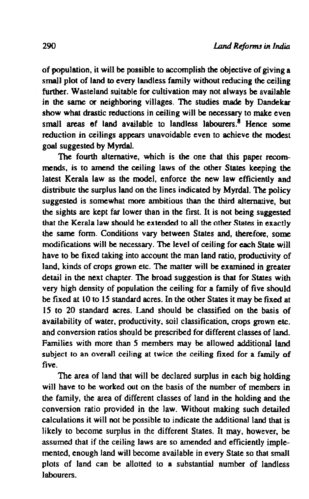

###### 290 Land Reforms in India

of population, it will be possible to accomplish the objective of giving a small plot of land to every landless family without reducing the ceiling further. Wasteland suitable for cultivation may not always be available in the same or neighboring villages. The studies made by Dandekar show what drastic reductions in ceiling will be necessary to make even small areas of land available to landless labourers.8 Hence some reduction in ceilings appears unavoidable even to achieve the modest goal suggested by Myrdal.

The fourth alternative, which is the one that this paper recommends, is to amend the ceiling laws of the other States keeping the latest Kerala law as the model, enforce the new law efficiently and distribute the surplus land on the lines indicated by Myrdal. The policy suggested is somewhat more ambitious than the third alternative, but the sights are kept far lower than in the first. It is not being suggested that the Kerala law should be extended to all the other States in exactly the same form. Conditions vary between States and, therefore, some modifications will be necessary. The level of ceiling for each State will have to be fixed taking into account the man land ratio, productivity of land, kinds of crops grown etc. The matter will be examined in greater detail in the next chapter. The broad suggestion is that for States with very high density of population the ceiling for a family of five should be fixed at 10 to 15 standard acres. In the other States it may be fixed at 15 to 20 standard acres. Land should be classified on the basis of availability of water, productivity, soil classification, crops grown etc. and conversion ratios should be prescribed for different classes of land. Families with more than 5 members may be allowed additional land subject to an overall ceiling at twice the ceiling fixed for a family of five.

The area of land that will be declared surplus in each big holding will have to be worked out on the basis of the number of members in the family, the area of different classes of land in the holding and the conversion ratio provided in the law. Without making such detailed calculations it will not be possible to indicate the additional land that is likely to become surplus in the different States. It may, however, be assumed that if the ceiling laws are so amended and efficiently implemented, enough land will become available in every State so that small plots of land can be allotted to a substantial number of landless labourers.

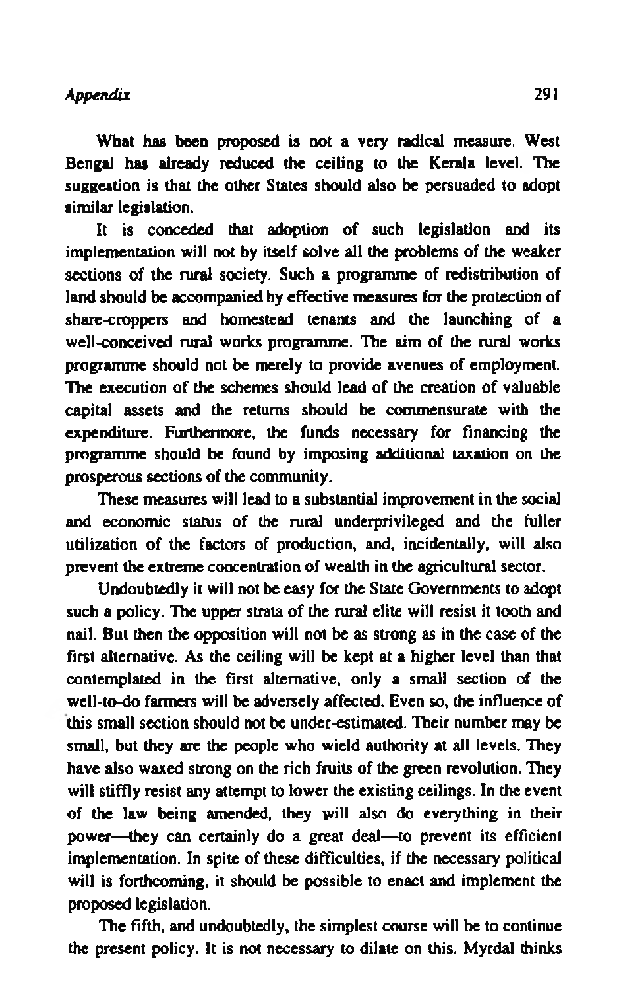

###### Appendix 291

What has been proposed is not a very radical measure. West Bengal has already reduced the ceiling to the Kerala level. The suggestion is that the other States should also be persuaded to adopt similar legislation.

It is conceded that adoption of such legislation and its implementation will not by itself solve all the problems of the weaker sections of the rural society. Such a programme of redistribution of land should be accompanied by effective measures for the protection of share-croppers and homestead tenants and the launching of a well-conceived rural works programme. The aim of the rural works programme should not be merely to provide avenues of employment. The execution of the schemes should lead of the creation of valuable capital assets and the returns should be commensurate with the expenditure. Furthermore, the funds necessary for financing the programme should be found by imposing additional taxation on the prosperous sections of the community.

These measures will lead to a substantial improvement in the social and economic status of the rural underprivileged and the fuller utilization of the factors of production, and, incidentally, will also prevent the extreme concentration of wealth in the agricultural sector.

Undoubtedly it will not be easy for the State Governments to adopt such a policy. The upper strata of the rural elite will resist it tooth and nail. But then the opposition will not be as strong as in the case of the first alternative. As the ceiling will be kept at a higher level than that contemplated in the first alternative, only a small section of the well-to-do farmers will be adversely affected. Even so, the influence of this small section should not be under-estimated. Their number may be small, but they are the people who wield authority at all levels. They have also waxed strong on the rich fruits of the green revolution. They will stiffly resist any attempt to lower the existing ceilings. In the event of the law being amended, they will also do everything in their power—they can certainly do a great deal—to prevent its efficient implementation. In spite of these difficulties, if the necessary political will is forthcoming, it should be possible to enact and implement the proposed legislation.

The fifth, and undoubtedly, the simplest course will be to continue the present policy. It is not necessary to dilate on this. Myrdal thinks

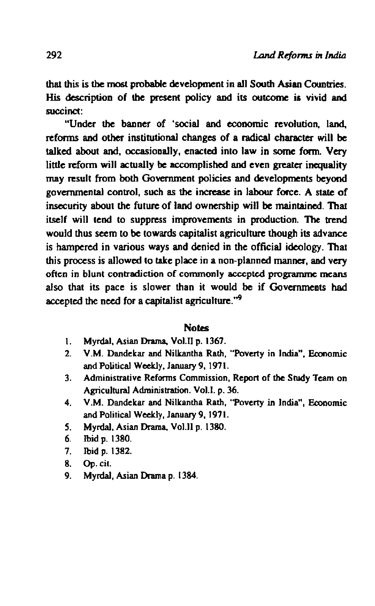

###### 292 Land Reforms in India

that this is the most probable development in all South Asian Countries. His description of the present policy and its outcome is vivid and succinct:

“Under the banner of ‘social and economic revolution, land, reforms and other institutional changes of a radical character will be talked about and, occasionally, enacted into law in some form. Very little reform will actually be accomplished and even greater inequality may result from both Government policies and developments beyond governmental control, such as the increase in labour force. A state of insecurity about the future of land ownership will be maintained. That itself will tend to suppress improvements in production. The trend would thus seem to be towards capitalist agriculture though its advance is hampered in various ways and denied in the official ideology. That this process is allowed to take place in a non-planned manner, and very often in blunt contradiction of commonly acccpted programme means also that its pace is slower than it would be if Governments had accepted the need for a capitalist agriculture.”9

Notes

- 1. Myrdal, Asian Drama, Vol.II p. 1367.
- 2. V.M. Dandekar and Nilkantha Rath, "Poverty in India”, Economic and Political Weekly, January 9,1971.
- 3. Administrative Reforms Commission, Report of the Study Team on Agricultural Administration. Vol.I. p. 36.
- 4. V.M. Dandekar and Nilkantha Rath, “Poverty in India”, Economic and Political Weekly, January 9,1971.
- 5. Myrdal, Asian Drama, Vol.II p. 1380.
- 6. Ibid p. 1380.
- 7. Ibid p. 1382.
- 8. Op. cit.
- 9. Myrdal, Asian Drama p. 1384.

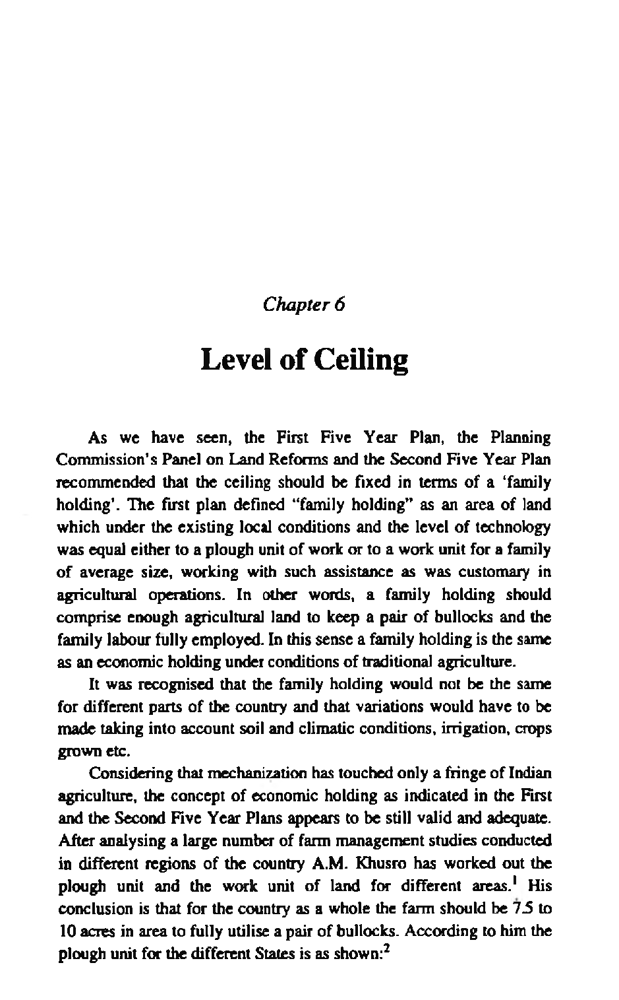

###### Chapter 6

### Level of Ceiling

As we have seen, the First Five Year Plan, the Planning Commission’s Panel on Land Reforms and the Second Five Year Plan recommended that the ceiling should be fixed in terms of a ‘family holding’. The first plan defined “family holding” as an area of land which under the existing local conditions and the level of technology was equal either to a plough unit of work or to a work unit for a family of average size, working with such assistance as was customary in agricultural operations. In other words, a family holding should comprise enough agricultural land to keep a pair of bullocks and the family labour fully employed. In this sense a family holding is the same as an economic holding under conditions of traditional agriculture.

It was recognised that the family holding would not be the same for different parts of the country and that variations would have to be made taking into account soil and climatic conditions, irrigation, crops grown etc.

Considering that mechanization has touched only a fringe of Indian agriculture, the concept of economic holding as indicated in the First and the Second Five Year Plans appears to be still valid and adequate. After analysing a large number of farm management studies conducted in different regions of the country A.M. Khusro has worked out the plough unit and the work unit of land for different areas.1 His conclusion is that for the country as a whole the farm should be 7.5 to 10 acres in area to fully utilise a pair of bullocks. According to him the plough unit for the different States is as shown:2

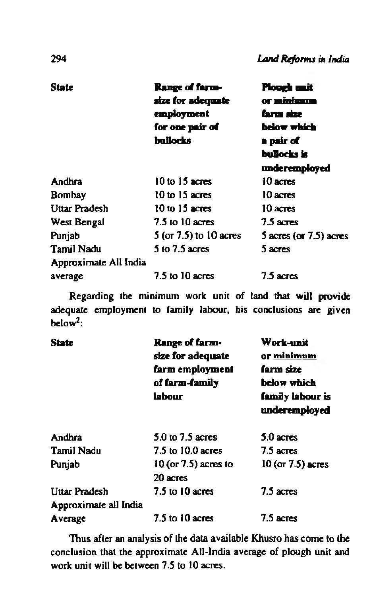

###### 294 Land Reforms in India

State Range of farm- Plough nut size for adequate or minimum employment farm size for one pair of below which bollocks a pair of

bullocks is underemployed

Andhra 10 to 15 acres 10 acres Bombay lOto 15 acres 10 acres Uttar Pradesh lOto 15 acres 10 acres West Bengal 7.5 to 10 acres 7.5 acres Punjab 5 (or 7.5) to 10 acres 5 acres (or 7.5) acres Tamil Nadu Approximate All India

5 to 7.5 acres 5 acres

average 7.5 to 10 acres 7.5 acres

Regarding the minimum work unit of land that will provide adequate employment below2:

to family labour, his conclusions are given

State Range of farm- Work-unh size for adequate Or minimum farm employment farm size of farm-family below which labour family labour is

underemployed

Andhra 5.0 to 7.5 acres 5.0 acres Tamil Nadu 7.5 to 10.0 acres 7.5 acres Punjab 10 (or 7.5) acres to

10 (or 7.5) acres

20 acres

7.5 to 10 acres 7.5 acres

Uttar Pradesh Approximate all India

Average 7.5 to 10 acres 7.5 acres

Thus after an analysis of the data available Khusro has come to the conclusion that the approximate All-India average of plough unit and work unit will be between 7.5 to 10 acres.

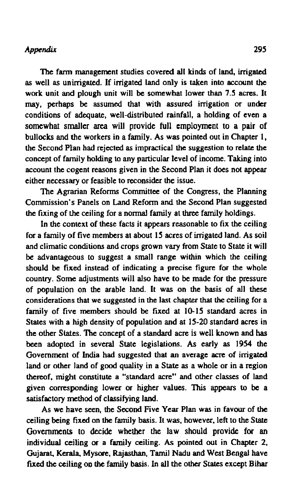

###### Appendix 295

The farm management studies covered all kinds of land, irrigated as well as unirrigated. If irrigated land only is taken into account the work unit and plough unit will be somewhat lower than 7.5 acres. It may, perhaps be assumed that with assured irrigation or under conditions of adequate, well-distributed rainfall, a holding of even a somewhat smaller area will provide full employment to a pair of bullocks and the workers in a family. As was pointed out in Chapter 1, the Second Plan had rejected as impractical the suggestion to relate the concept of family holding to any particular level of income. Taking into account the cogent reasons given in the Second Plan it does not appear either necessary or feasible to reconsider the issue.

The Agrarian Reforms Committee of the Congress, the Planning Commission’s Panels on Land Reform and the Second Plan suggested the fixing of the ceiling for a normal family at three family holdings.

In the context of these facts it appears reasonable to fix the ceiling for a family of five members at about 15 acres of irrigated land. As soil and climatic conditions and crops grown vary from State to State it will be advantageous to suggest a small range within which the ceiling should be fixed instead of indicating a precise figure for the whole country. Some adjustments will also have to be made for the pressure of population on the arable land. It was on the basis of all these considerations that we suggested in the last chapter that the ceiling for a family of five members should be fixed at 10-15 standard acres in States with a high density of population and at 15-20 standard acres in the other States. The concept of a standard acre is well known and has been adopted in several State legislations. As early as 1954 the Government of India had suggested that an average acre of irrigated land or other land of good quality in a State as a whole or in a region thereof, might constitute a “standard acre” and other classes of land given corresponding lower or higher values. This appears to be a satisfactory method of classifying land.

As we have seen, the Second Five Year Plan was in favour of the ceiling being fixed on the family basis. It was, however, left to the State Governments to decide whether the law should provide for an individual ceiling or a family ceiling. As pointed out in Chapter 2, Gujarat, Kerala, Mysore, Rajasthan, Tamil Nadu and West Bengal have fixed the ceiling on the family basis. In all the other States except Bihar

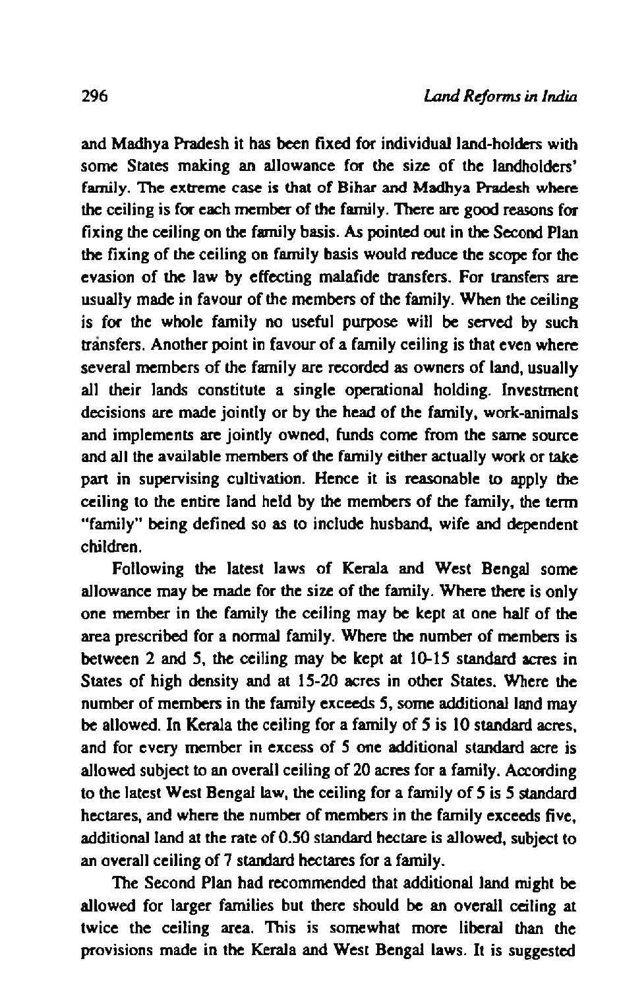

###### 296 Land Reforms in India

and Madhya Pradesh it has been fixed for individual land-holders with some States making an allowance for the size of the landholders’ family. The extreme case is that of Bihar and Madhya Pradesh where the ceiling is for each member of the family. There are good reasons for fixing the ceiling on the family basis. As pointed out in the Second Plan the fixing of the ceiling on family basis would reduce the scope for the evasion of the law by effecting malafide transfers. For transfers are usually made in favour of the members of the family. When the ceiling is for the whole family no useful purpose will be served by such transfers. Another point in favour of a family ceiling is that even where several members of the family are recorded as owners of land, usually all their lands constitute a single operational holding. Investment decisions are made jointly or by the head of the family, work-animals and implements are jointly owned, funds come from the same source and all the available members of the family either actually work or take part in supervising cultivation. Hence it is reasonable to apply the ceiling to the entire land held by the members of the family, the term “family” being defined so as to include husband, wife and dependent children.

Following the latest laws of Kerala and West Bengal some allowance may be made for the size of the family. Where there is only one member in the family the ceiling may be kept at one half of the area prescribed for a normal family. Where the number of members is between 2 and 5, the ceiling may be kept at 10-15 standard acres in States of high density and at 15-20 acres in other States. Where the number of members in the family exceeds 5, some additional land may be allowed. In Kerala the ceiling for a family of 5 is 10 standard acres, and for every member in excess of 5 one additional standard acre is allowed subject to an overall ceiling of 20 acres for a family. According to the latest West Bengal law, the ceiling for a family of 5 is 5 standard hectares, and where the number of members in the family exceeds five, additional land at the rate of 0.50 standard hectare is allowed, subject to an overall ceiling of 7 standard hectares for a family.

The Second Plan had recommended that additional land might be allowed for larger families but there should be an overall ceiling at twice the ceiling area. This is somewhat more liberal than the provisions made in the Kerala and West Bengal laws. It is suggested

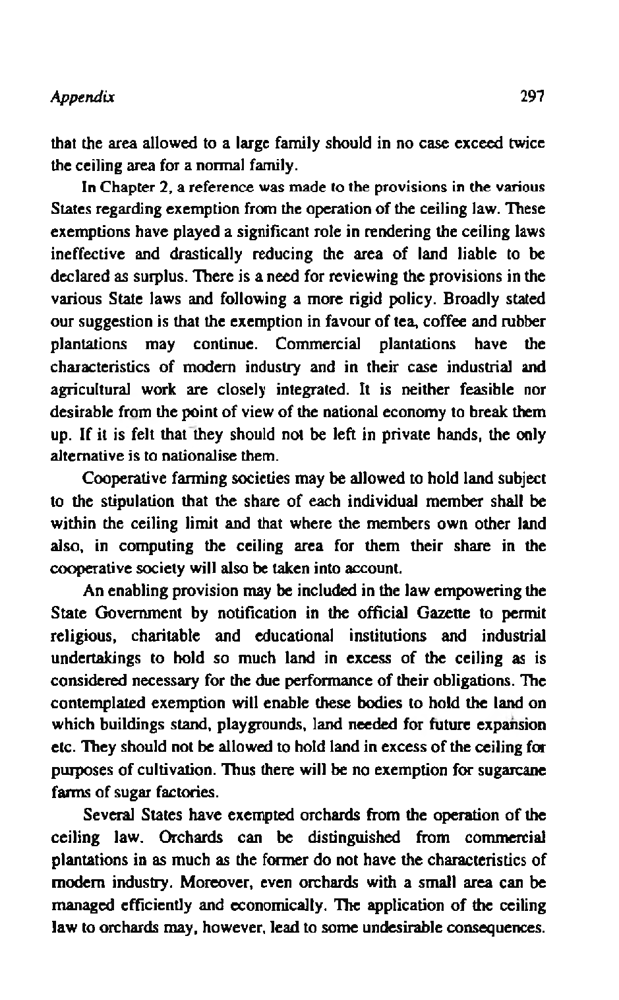

Appendix 297

that the area allowed to a large family should in no case exceed twice the ceiling area for a normal family.

In Chapter 2, a reference was made to the provisions in the various States regarding exemption from the operation of the ceiling law. These exemptions have played a significant role in rendering the ceiling laws ineffective and drastically reducing the area of land liable to be declared as surplus. There is a need for reviewing the provisions in the various State laws and following a more rigid policy. Broadly stated our suggestion is that the exemption in favour of tea, coffee and rubber plantations may continue. Commercial plantations have the characteristics of modem industry and in their case industrial and agricultural work are closely integrated. It is neither feasible nor desirable from the point of view of the national economy to break them up. If it is felt that they should not be left in private hands, the only alternative is to nationalise them.

Cooperative farming societies may be allowed to hold land subject to the stipulation that the share of each individual member shall be within the ceiling limit and that where the members own other land also, in computing the ceiling area for them their share in the cooperative society will also be taken into account.

An enabling provision may be included in the law empowering the State Government by notification in the official Gazette to permit religious, charitable and educational institutions and industrial undertakings to hold so much land in excess of the ceiling as is considered necessary for the due performance of their obligations. The contemplated exemption will enable these bodies to hold the land on which buildings stand, playgrounds, land needed for future expansion etc. They should not be allowed to hold land in excess of the ceiling for purposes of cultivation. Thus there will be no exemption for sugarcane farms of sugar factories.

Several States have exempted orchards from the operation of the ceiling law. Orchards can be distinguished from commercial plantations in as much as the former do not have the characteristics of modem industry. Moreover, even orchards with a small area can be managed efficiently and economically. The application of the ceiling law to orchards may, however, lead to some undesirable consequences.

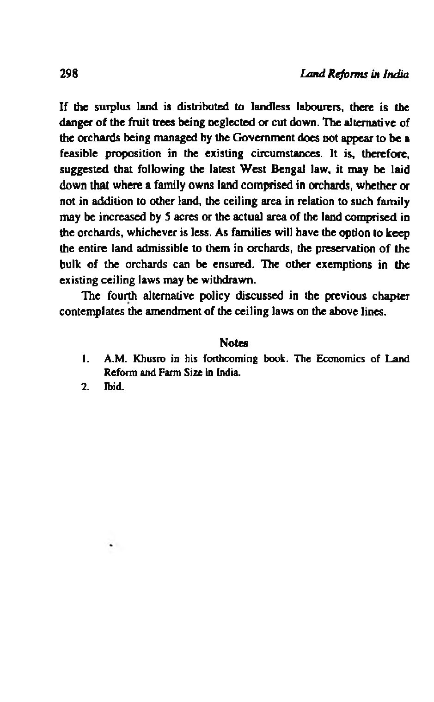

###### 298 Land Reforms in India

If the surplus land is distributed to landless labourers, there is the danger of the fruit trees being neglected or cut down. The alternative of the orchards being managed by the Government does not appear to be a feasible proposition in the existing circumstances. It is, therefore, suggested that following the latest West Bengal law, it may be laid down that where a family owns land comprised in orchards, whether or not in addition to other land, the ceiling area in relation to such family may be increased by 5 acres or the actual area of the land comprised in the orchards, whichever is less. As families will have the option to keep the entire land admissible to them in orchards, the preservation of the bulk of the orchards can be ensured. The other exemptions in the existing ceiling laws may be withdrawn.

The fourth alternative policy discussed in the previous chapter contemplates the amendment of the ceiling laws on the above lines.

###### Notes

- 1. A.M. Khusro in his forthcoming book. The Economics of Land Reform and Farm Size in India.
- 2. Ibid.

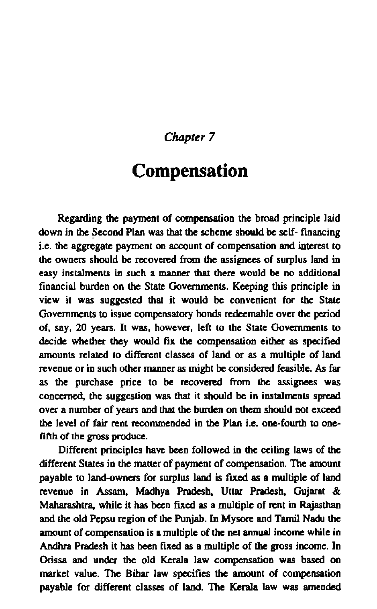

###### Chapter 7

### Compensation

Regarding the payment of compensation the broad principle laid down in the Second Plan was that the scheme should be self- financing i.e. the aggregate payment on account of compensation and interest to the owners should be recovered from the assignees of surplus land in easy instalments in such a manner that there would be no additional financial burden on the State Governments. Keeping this principle in view it was suggested that it would be convenient for the State Governments to issue compensatory bonds redeemable over the period of, say, 20 years. It was, however, left to the State Governments to decide whether they would fix the compensation either as specified amounts related to different classes of land or as a multiple of land revenue or in such other manner as might be considered feasible. As far as the purchase price to be recovered from the assignees was concerned, the suggestion was that it should be in instalments spread over a number of years and that the burden on them should not exceed the level of fair rent recommended in the Plan i.e. one-fourth to onefifth of the gross produce.

Different principles have been followed in the ceiling laws of the different States in the matter of payment of compensation. The amount payable to land-owners for surplus land is fixed as a multiple of land revenue in Assam, Madhya Pradesh, Uttar Pradesh, Gujarat & Maharashtra, while it has been fixed as a multiple of rent in Rajasthan and the old Pepsu region of the Punjab. In Mysore and Tamil Nadu the amount of compensation is a multiple of the net annual income while in Andhra Pradesh it has been fixed as a multiple of the gross income. In Orissa and under the old Kerala law compensation was based on market value. The Bihar law specifies the amount of compensation payable for different classes of land. The Kerala law was amended

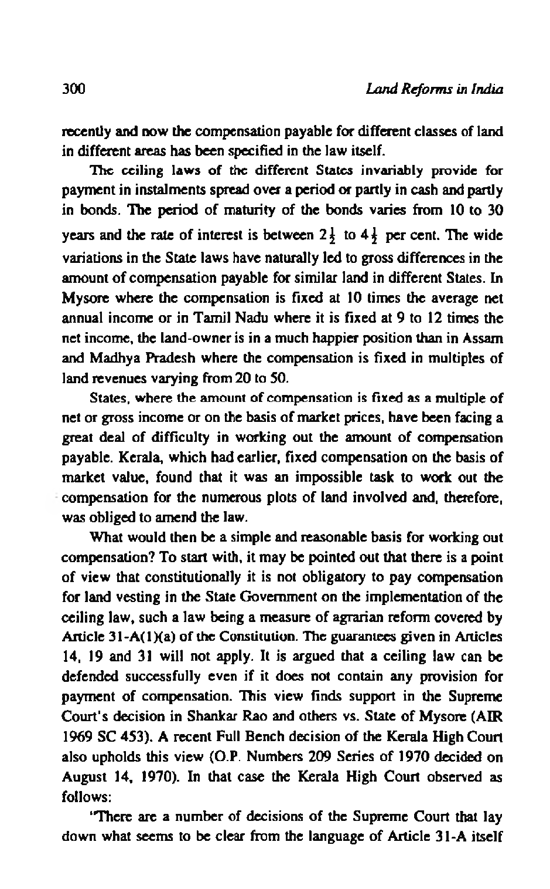

###### 300 Land Reforms in India

recently and now the compensation payable for different classes of land in different areas has been specified in the law itself.

The ceiling laws of the different States invariably provide for payment in instalments spread over a period or partly in cash and partly in bonds. The period of maturity of the bonds varies from 10 to 30 years and the rate of interest is between 2 \ to 4^ per cent. The wide variations in the State laws have naturally led to gross differences in the amount of compensation payable for similar land in different States. In Mysore where the compensation is fixed at 10 times the average net annual income or in Tamil Nadu where it is fixed at 9 to 12 times the net income, the land-owner is in a much happier position than in Assam and Madhya Pradesh where the compensation is fixed in multiples of land revenues varying from 20 to 50.

States, where the amount of compensation is fixed as a multiple of net or gross income or on the basis of market prices, have been facing a great deal of difficulty in working out the amount of compensation payable. Kerala, which had earlier, fixed compensation on the basis of market value, found that it was an impossible task to work out the compensation for the numerous plots of land involved and, therefore, was obliged to amend the law.

What would then be a simple and reasonable basis for working out compensation? To start with, it may be pointed out that there is a point of view that constitutionally it is not obligatory to pay compensation for land vesting in the State Government on the implementation of the ceiling law, such a law being a measure of agrarian reform covered by Article 31-A(lXa) of the Constitution. The guarantees given in Articles 14, 19 and 31 will not apply. It is argued that a ceiling law can be defended successfully even if it does not contain any provision for payment of compensation. This view finds support in the Supreme Court’s decision in Shankar Rao and others vs. State of Mysore (AIR 1969 SC 453). A recent Full Bench decision of the Kerala High Court also upholds this view (O.P. Numbers 209 Series of 1970 decided on August 14, 1970). In that case the Kerala High Court observed as follows:

“There are a number of decisions of the Supreme Court that lay down what seems to be clear from the language of Article 31-A itself

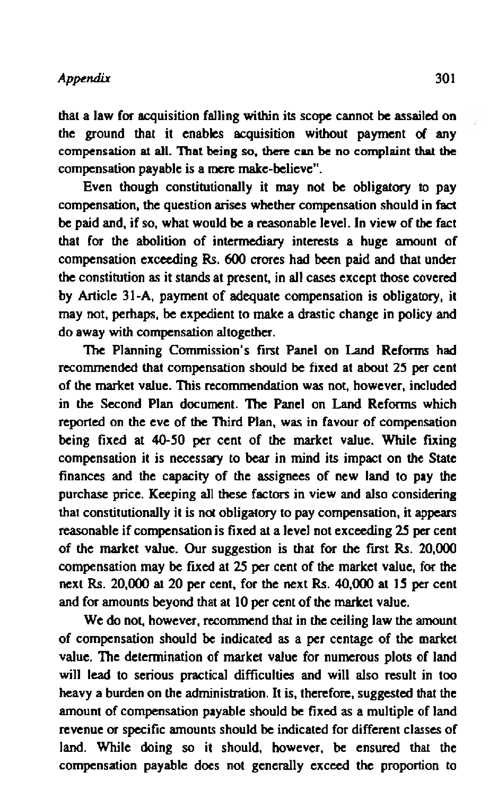

Appendix 301

that a law for acquisition falling within its scope cannot be assailed on the ground that it enables acquisition without payment of any compensation at all. That being so, there can be no complaint that the compensation payable is a mere make-believe”.

Even though constitutionally it may not be obligatory to pay compensation, the question arises whether compensation should in fact be paid and, if so, what would be a reasonable level. In view of the fact that for the abolition of intermediary interests a huge amount of compensation exceeding Rs. 600 crores had been paid and that under the constitution as it stands at present, in all cases except those covered by Article 31-A, payment of adequate compensation is obligatory, it may not, perhaps, be expedient to make a drastic change in policy and do away with compensation altogether.

The Planning Commission’s first Panel on Land Reforms had recommended that compensation should be fixed at about 25 per cent of the market value. This recommendation was not, however, included in the Second Plan document. The Panel on Land Reforms which reported on the eve of the Third Plan, was in favour of compensation being fixed at 40-50 per cent of the market value. While fixing compensation it is necessary to bear in mind its impact on the State finances and the capacity of the assignees of new land to pay the purchase price. Keeping all these factors in view and also considering that constitutionally it is not obligatory to pay compensation, it appears reasonable if compensation is fixed at a level not exceeding 25 per cent of the market value. Our suggestion is that for the first Rs. 20,000 compensation may be fixed at 25 per cent of the market value, for the next Rs. 20,000 at 20 per cent, for the next Rs. 40,000 at 15 per cent and for amounts beyond that at 10 per cent of the market value.

We do not, however, recommend that in the ceiling law the amount of compensation should be indicated as a per centage of the market value. The determination of market value for numerous plots of land will lead to serious practical difficulties and will also result in too heavy a burden on the administration. It is, therefore, suggested that the amount of compensation payable should be fixed as a multiple of land revenue or specific amounts should be indicated for different classes of land. While doing so it should, however, be ensured that the compensation payable does not generally exceed the proportion to

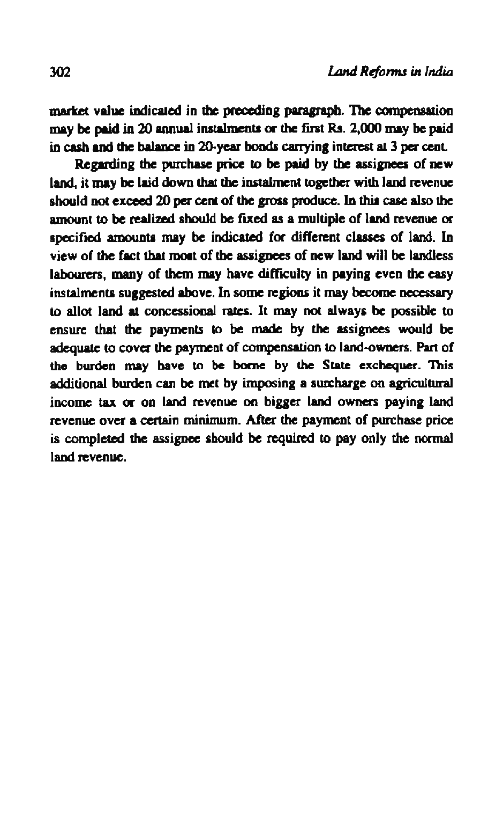

###### 302 Land Reforms in India

market value indicated in the preceding paragraph. The compensation may be paid in 20 annual instalments or the first Rs. 2,000 may be paid in cash and the balance in 20-year bonds carrying interest at 3 per cent.

Regarding the purchase price to be paid by the assignees of new land, it may be laid down that the instalment together with land revenue should not exceed 20 per cent of the gross produce. In this case also the amount to be realized should be fixed as a multiple of land revenue or specified amounts may be indicated for different classes of land. In view of the fact that most of the assignees of new land will be landless labourers, many of them may have difficulty in paying even the easy instalments suggested above. In some regions it may become necessary to allot land at concessional rates. It may not always be possible to ensure that the payments lo be made by the assignees would be adequate to cover the payment of compensation to land-owners. Fart of the burden may have to be borne by the State exchequer. This additional burden can be met by imposing a surcharge on agricultural income tax or on land revenue on bigger land owners paying land revenue over a certain minimum. After the payment of purchase price is completed the assignee should be required to pay only the normal land revenue.

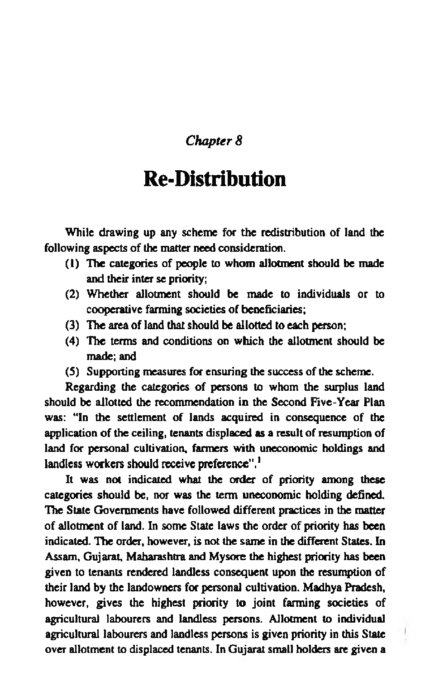

Chapter 8

### Re-Distribution

While drawing up any scheme for the redistribution of land the following aspects of the matter need consideration.

- (1) The categories of people to whom allotment should be made and their inter se priority;
- (2) Whether allotment should be made to individuals or to cooperative farming societies of beneficiaries;
- (3) The area of land that should be allotted to each person;
- (4) The terms and conditions on which the allotment should be made; and
- (5) Supporting measures for ensuring the success of the scheme. Regarding the categories of persons to whom the surplus land

should be allotted the recommendation in the Second Five-Year Plan was: “In the settlement of lands acquired in consequence of the application of the ceiling, tenants displaced as a result of resumption of land for personal cultivation, farmers with uneconomic holdings and landless workers should receive preference".1

It was not indicated what the order of priority among these categories should be, nor was the term uneconomic holding defined. The State Governments have followed different practices in the matter of allotment of land. In some State laws the order of priority has been indicated. The order, however, is not the same in the different States. In Assam, Gujarat, Maharashtra and Mysore the highest priority has been given to tenants rendered landless consequent upon the resumption of their land by the landowners for personal cultivation. Madhya Pradesh, however, gives the highest priority to joint farming societies of agricultural labourers and landless persons. Allotment to individual agricultural labourers and landless persons is given priority in this State over allotment to displaced tenants. In Gujarat small holders are given a

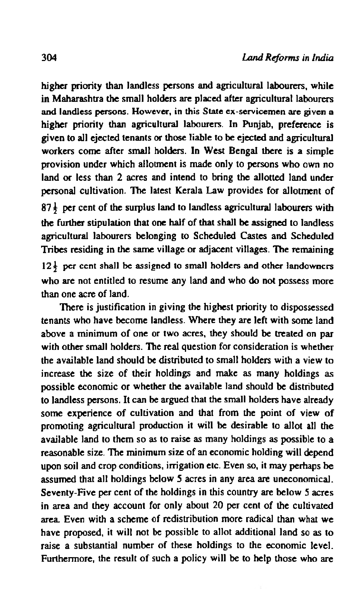

304 Land Reforms in India

higher priority than landless persons and agricultural labourers, while in Maharashtra the small holders are placed after agricultural labourers and landless persons. However, in this State ex-servicemen are given a higher priority than agricultural labourers. In Punjab, preference is given to all ejected tenants or those liable to be ejected and agricultural workers come after small holders. In West Bengal there is a simple provision under which allotment is made only to persons who own no land or less than 2 acres and intend to bring the allotted land under personal cultivation. The latest Kerala Law provides for allotment of 87 \ per cent of the surplus land to landless agricultural labourers with the further stipulation that one half of that shall be assigned to landless agricultural labourers belonging to Scheduled Castes and Scheduled Tribes residing in the same village or adjacent villages. The remaining 12^ per ccnt shall be assigned to small holders and other landowners who are not entitled to resume any land and who do not possess more than one acre of land.

There is justification in giving the highest priority to dispossessed tenants who have become landless. Where they are left with some land above a minimum of one or two acres, they should be treated on par with other small holders. The real question for consideration is whether the available land should be distributed to small holders with a view to increase the size of their holdings and make as many holdings as possible economic or whether the available land should be distributed to landless persons. It can be argued that the small holders have already some experience of cultivation and that from the point of view of promoting agricultural production it will be desirable to allot all the available land to them so as to raise as many holdings as possible to a reasonable size. The minimum size of an economic holding will depend upon soil and crop conditions, irrigation etc. Even so, it may perhaps be assumed that all holdings below 5 acres in any area are uneconomical. Seventy-Five per cent of the holdings in this country are below 5 acres in area and they account for only about 20 per cent of the cultivated area. Even with a scheme of redistribution more radical than what we have proposed, it will not be possible to allot additional land so as to raise a substantial number of these holdings to the economic level. Furthermore, the result of such a policy will be to help those who are

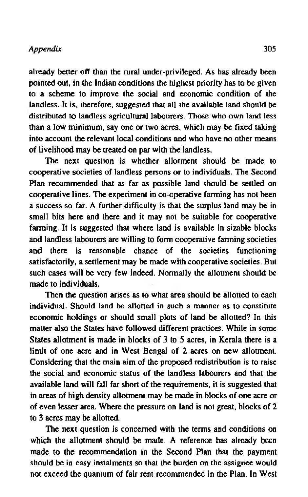

Appendix 305

already better off than the rural under-privileged. As has already been pointed out, in the Indian conditions the highest priority has to be given to a scheme to improve the social and economic condition of the landless. It is, therefore, suggested that all the available land should be distributed to landless agricultural labourers. Those who own land less than a low minimum, say one or two acres, which may be fixed taking into account the relevant local conditions and who have no other means of livelihood may be treated on par with the landless.

The next question is whether allotment should be made to cooperative societies of landless persons or to individuals. The Second Plan recommended that as far as possible land should be settled on cooperative lines. The experiment in co-operative farming has not been a success so far. A further difficulty is that the surplus land may be in small bits here and there and it may not be suitable for cooperative farming. It is suggested that where land is available in sizable blocks and landless labourers are willing to form cooperative farming societies and there is reasonable chance of the societies functioning satisfactorily, a settlement may be made with cooperative societies. But such cases will be very few indeed. Normally the allotment should be made to individuals.

Then the question arises as to what area should be allotted to each individual. Should land be allotted in such a manner as to constitute economic holdings or should small plots of land be allotted? In this matter also the States have followed different practices. While in some States allotment is made in blocks of 3 to 5 acres, in Kerala there is a limit of one acre and in West Bengal of 2 acres on new allotment. Considering that the main aim of the proposed redistribution is to raise the social and economic status of the landless labourers and that the available land will fall far short of the requirements, it is suggested that in areas of high density allotment may be made in blocks of one acre or of even lesser area Where the pressure on land is not great, blocks of 2 to 3 acres may be allotted.

The next question is concerned with the terms and conditions on which the allotment should be made. A reference has already been made to the recommendation in the Second Plan that the payment should be in easy instalments so that the burden on the assignee would not exceed the quantum of fair rent recommended in the Plan. In West

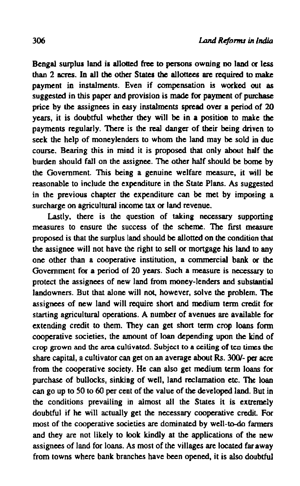

###### 306 Land Reforms in India

Bengal surplus land is allotted free to persons owning no land or less than 2 acres. In all the other States the allottees are required to make payment in instalments. Even if compensation is worked out as suggested in this paper and provision is made for payment of purchase price by the assignees in easy instalments spread over a period of 20 years, it is doubtful whether they will be in a position to make the payments regularly. There is the real danger of their being driven to seek the help of moneylenders to whom the land may be sold in due course. Bearing this in mind it is proposed that only about half the burden should fall on the assignee. The other half should be borne by the Government. This being a genuine welfare measure, it will be reasonable to include the expenditure in the State Plans. As suggested in the previous chapter the expenditure can be met by imposing a surcharge on agricultural income tax or land revenue.

Lastly, there is the question of taking necessary supporting measures to ensure the success of the scheme. The first measure proposed is that the surplus land should be allotted on the condition that the assignee will not have the right to sell or mortgage his land to any one other than a cooperative institution, a commercial bank or the Government for a period of 20 years. Such a measure is necessary to protect the assignees of new land from money-lenders and substantial landowners. But that alone will not, however, solve the problem. The assignees of new land will require short and medium term credit for starting agricultural operations. A number of avenues are available for extending credit to them. They can get short term crop loans form cooperative societies, the amount of loan depending upon the kind of crop grown and the area cultivated. Subject to a ceiling of ten times the share capital, a cultivator can get on an average about Rs. 300/- per acre from the cooperative society. He can also get medium term loans for purchase of bullocks, sinking of well, land reclamation etc. The loan can go up to 50 to 60 per cent of the value of the developed land. But in the conditions prevailing in almost all the States it is extremely doubtful if he will actually get the necessary cooperative credit. For most of the cooperative societies are dominated by well-to-do farmers and they are not likely to look kindly at the applications of the new assignees of land for loans. As most of the villages are located faraway from towns where bank branches have been opened, it is also doubtful

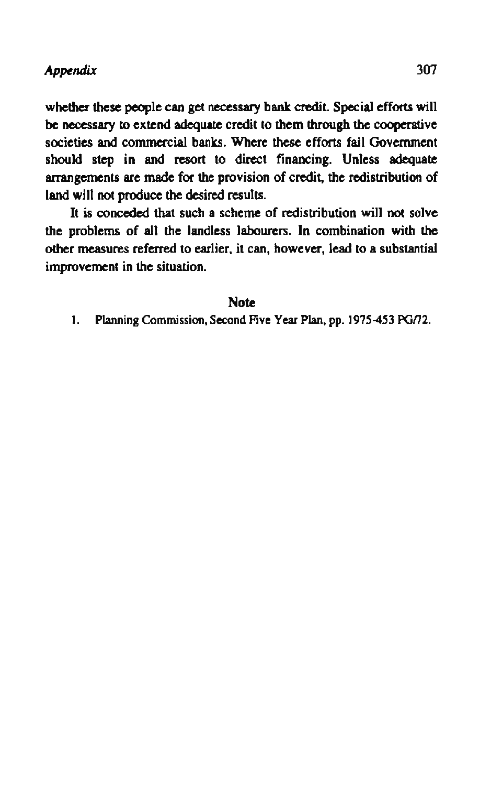

###### Appendix 307

whether these people can get necessary bank credit Special efforts will be necessary to extend adequate credit to them through the cooperative societies and commercial banks. Where these efforts fail Government should step in and resort to direct financing. Unless adequate arrangements are made for the provision of credit, the redistribution of land will not produce the desired results.

It is conceded that such a scheme of redistribution will not solve the problems of all the landless labourers. In combination with the other measures referred to earlier, it can, however, lead to a substantial improvement in the situation.

Note

1. Planning Commission, Second Five Year Plan, pp. 1975-453 PG/72.

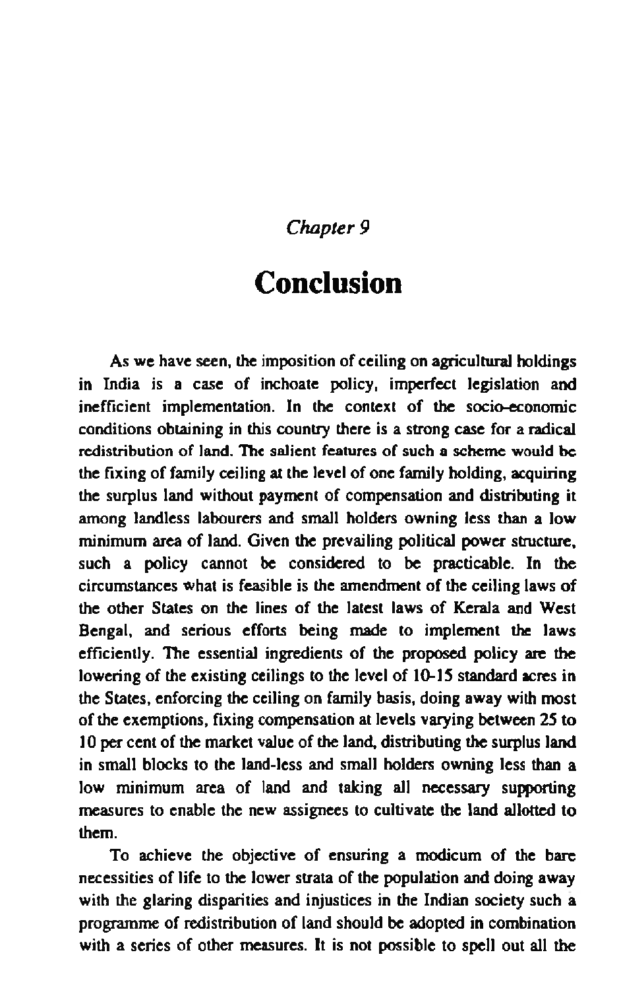

Chapter 9

### Conclusion

As wc have seen, the imposition of ceiling on agricultural holdings in India is a case of inchoate policy, imperfect legislation and inefficient implementation. In the context of the socio-economic conditions obtaining in this country there is a strong case for a radical redistribution of land. Hie salient features of such a schemc would be the fixing of family ceiling at the level of one family holding, acquiring the surplus land without payment of compensation and distributing it among landless labourers and small holders owning less than a low minimum area of land. Given the prevailing political power structure, such a policy cannot be considered to be practicable. In the circumstances what is feasible is the amendment of the ceiling laws of the other States on the lines of the latest laws of Kerala and West Bengal, and serious efforts being made to implement the laws efficiently. The essential ingredients of the proposed policy are the lowering of the existing ceilings to the level of 10-15 standard acres in the States, enforcing the ceiling on family basis, doing away with most of the exemptions, fixing compensation at levels varying between 25 to 10 per cent of the market value of the land, distributing the surplus land in small blocks to the land-less and small holders owning less than a low minimum area of land and taking all necessary supporting measures to enable the new assignees to cultivate the land allotted to them.

To achieve the objective of ensuring a modicum of the bare necessities of life to the lower strata of the population and doing away with the glaring disparities and injustices in the Indian society such a programme of redistribution of land should be adopted in combination with a series of other measures. It is not possible to spell out all the

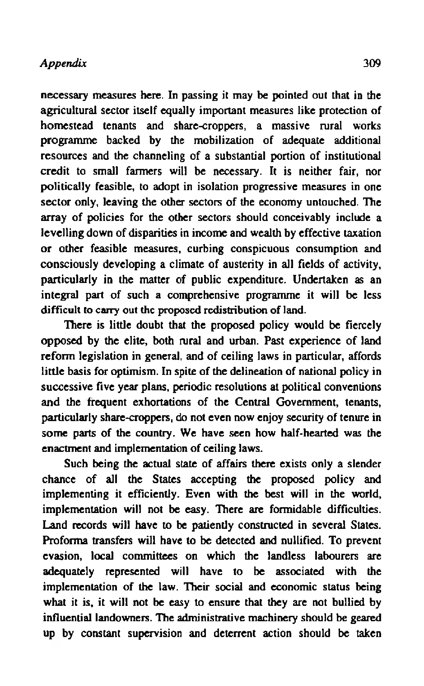

Appendix 309

necessary measures here. In passing it may be pointed out that in the agricultural sector itself equally important measures like protection of homestead tenants and share-croppers, a massive rural works programme backed by the mobilization of adequate additional resources and the channeling of a substantial portion of institutional credit to small farmers will be necessary. It is neither fair, nor politically feasible, to adopt in isolation progressive measures in one sector only, leaving the other sectors of the economy untouched. The array of policies for the other sectors should conceivably include a levelling down of disparities in income and wealth by effective taxation or other feasible measures, curbing conspicuous consumption and consciously developing a climate of austerity in all fields of activity, particularly in the matter of public expenditure. Undertaken as an integral part of such a comprehensive programme it will be less difficult to carry out the proposed redistribution of land.

There is little doubt that the proposed policy would be fiercely opposed by the elite, both rural and urban. Past experience of land reform legislation in general, and of ceiling laws in particular, affords little basis for optimism. In spite of the delineation of national policy in successive five year plans, periodic resolutions at political conventions and the frequent exhortations of the Central Government, tenants, particularly share-croppers, do not even now enjoy security of tenure in some parts of the country. We have seen how half-hearted was the enactment and implementation of ceiling laws.

Such being the actual state of affairs there exists only a slender chance of all the States accepting the proposed policy and implementing it efficiently. Even with the best will in the world, implementation will not be easy. There are formidable difficulties. Land records will have to be patiendy constructed in several States. Proforma transfers will have to be detected and nullified. To prevent evasion, local committees on which the landless labourers are adequately represented will have to be associated with the implementation of the law. Their social and economic status being what it is, it will not be easy to ensure that they are not bullied by influential landowners. The administrative machinery should be geared up by constant supervision and deterrent action should be taken

###### 310 Land Reforms in India

promptly against government servants who are found to have acted in collusion with persons trying to evade the law. All these difficulties can be overcome if at the political level the policy is accepted without any mental reservations whatsoever, sincere and dynamic ministers of high political stature head the State Revenue Departments and hand-picked civil servants arc entrusted with its implementation.

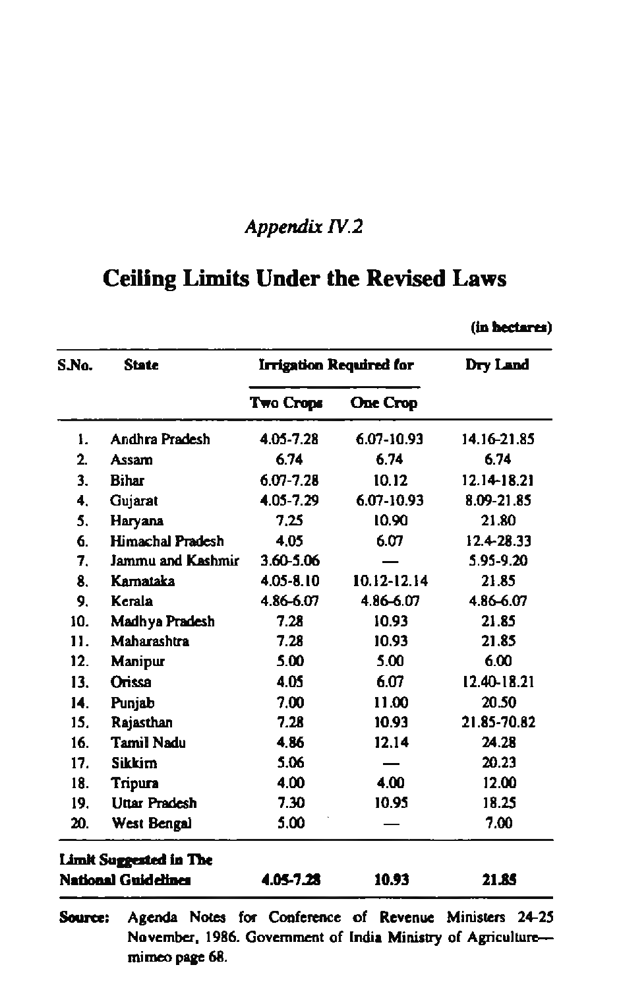

Appendix IV.2

##### Ceiling Limits Under the Revised Laws

(in hectares)

###### S.No. State Irrigation Required for Dry Land Two Crops One Crop

- 1. Andhra Pradesh 4.05-7.28 6.07-10.93 14.16-21.85
- 2. Assam 6.74 6.74 6.74
- 3. Bihar 6.07-7.28 10.12 12.14-18.21
- 4. Gujarat 4.05-7.29 6.07-10.93 8.09-21.85
- 5. Haryana 7.25 10.90 21.80
- 6. Himachal Pradesh 4.05 6.07 12.4-28.33
- 7. Jammu and Kashmir 3.60-5.06 — 5.95-9.20
- 8. Karnataka 4.05-8.10 10.12-12.14 21.85
- 9. Kerala 4.86-6.07 4.86-6.07 4.86-6.07
- 10. Madhya Pradesh 7.28 10.93 21.85
- 11. Maharashtra 7.28 10.93 21.85
- 12. Manipur 5.00 5.00 6.00
- 13. Orissa 4.05 6.07 12.40-18.21
- 14. Punjab 7.00 11.00 20.50
- 15. Rajasthan 7.28 10.93 21.85-70.82
- 16. Tamil Nadu 4.86 12.14 24.28
- 17. Sikkim 5.06 — 20.23
- 18. Tripura 4.00 4.00 12.00
- 19. Uttar Pradesh 7.30 10.95 18.25
- 20. West Bengal 5.00 ' — 7.00

###### Limit Suggested in The National Guidelines 4.05-7.28 10.93 21.85

Source: Agenda Notes for Conference of Revenue Ministers 24-25 November, 1986. Government of India Ministry of Agriculturemimeo page 68.

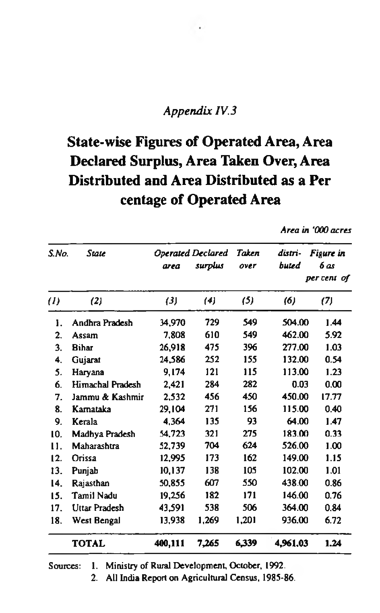

Appendix IV. 3

##### State*wise Figures of Operated Area, Area Declared Surplus, Area Taken Over, Area Distributed and Area Distributed as a Per centage of Operated Area

Area in ‘000 acres

distri- Figure in buted 6 as

Taken over

S.No. State Operated Declared area surplus

percent of

(1) (2) (3) (4) (5) (6) (7)

- 1. Andhra Pradesh 34,970 729 549 504.00 1.44
- 2. Assam 7,808 610 549 462.00 5.92
- 3. Bihar 26,918 475 396 277.00 1.03
- 4. Gujarat 24,586 252 155 132.00 0.54
- 5. Haryana 9,174 121 115 113.00 1.23
- 6. Himachal Pradesh 2,421 284 282 0.03 0.00
- 7. Jammu & Kashmir 2,532 456 450 450.00 17.77
- 8. Karnataka 29,104 271 156 115.00 0.40
- 9. Kerala 4,364 135 93 64.00 1.47
- 10. Madhya Pradesh 54.723 321 275 183.00 0.33
- 11. Maharashtra 52,739 704 624 526.00 1.00
- 12. Orissa 12,995 173 162 149.00 1.15
- 13. Punjab 10,137 138 105 102.00 1.01
- 14. Rajasthan 50,855 607 550 438.00 0.86
- 15. Tamil Nadu 19,256 182 171 146.00 0.76

- 17. Uttar Pradesh 43,591 538 506 364.00 0.84
- 18. West Bengal 13,938 1,269 1,201 936.00 6.72 TOTAL 400,111 7,265 6339 4,961.03 1.24

Sources: 1. Ministry of Rural Development, October, 1992.

2. All India Report on Agricultural Census, 1985-86.

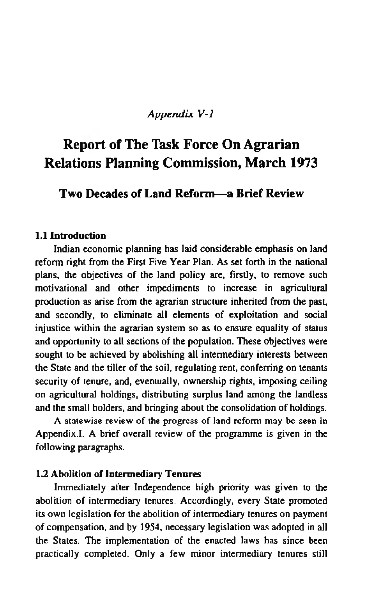

Appendix V-l

##### Report of The Task Force On Agrarian Relations Planning Commission, March 1973

Two Decades of Land Reform—a Brief Review

1.1 Introduction

Indian economic planning has laid considerable emphasis on land reform right from the First Five Year Plan. As set forth in the national plans, the objectives of the land policy are, firstly, to remove such motivational and other impediments to increase in agricultural production as arise from the agrarian structure inherited from the past, and secondly, to eliminate all elements of exploitation and social injustice within the agrarian system so as to ensure equality of status and opportunity to all sections of the population. These objectives were sought to be achieved by abolishing all intermediary interests between the State and the tiller of the soil, regulating rent, conferring on tenants security of tenure, and, eventually, ownership rights, imposing ceiling on agricultural holdings, distributing surplus land among the landless and the small holders, and bringing about the consolidation of holdings.

A state wise review of the progress of land reform may be seen in Appendix.I. A brief overall review of the programme is given in the following paragraphs.

###### \2Abolition of Intermediary Tenures

Immediately after Independence high priority was given to the abolition of intermediary tenures. Accordingly, every State promoted its own legislation for the abolition of intermediary tenures on payment of compensation, and by 1954, necessary legislation was adopted in all the States. The implementation of the enacted laws has since been practically completed. Only a few minor intermediary tenures still

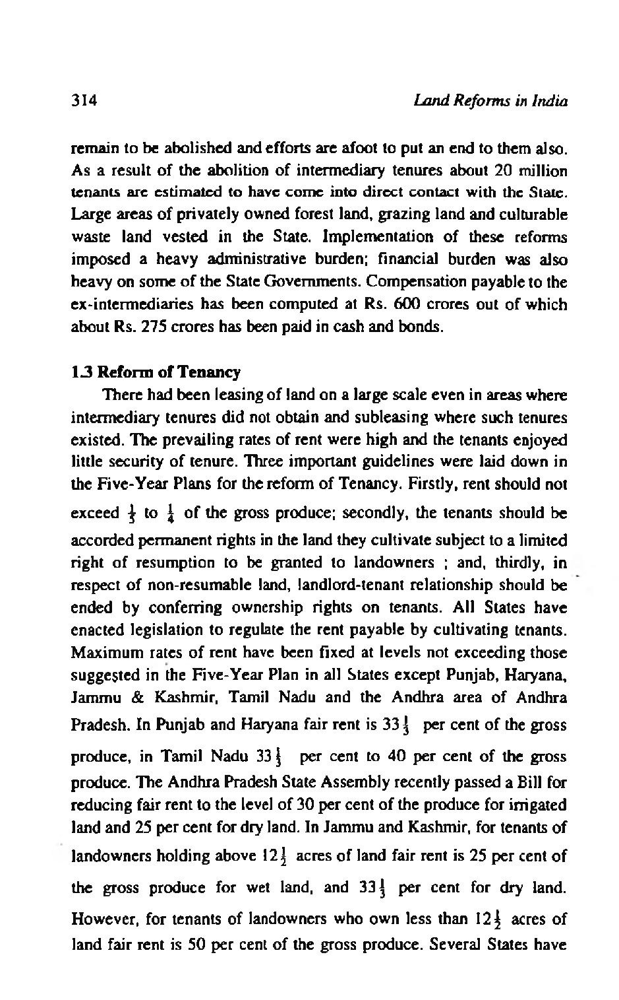

###### 314 Land Reforms in India

remain to be abolished and efforts are afoot to put an end to them also. As a result of the abolition of intermediary tenures about 20 million

tenants arc estimated to have come into direct contact with the State.

Large areas of privately owned forest land, grazing land and culturable waste land vested in the State. Implementation of these reforms imposed a heavy administrative burden; financial burden was also heavy on some of the State Governments. Compensation payable to the ex-intermediaries has been computed at Rs. 600 crores out of which about Rs. 275 crores has been paid in cash and bonds.

###### 13 Reform of Tenancy

There had been leasing of land on a large scale even in areas where intermediary tenures did not obtain and subleasing where such tenures existed. The prevailing rates of rent were high and the tenants enjoyed little security of tenure. Three important guidelines were laid down in the Five-Year Plans for the reform of Tenancy. Firstly, rent should not exceed ^ to \ of the gross produce; secondly, the tenants should be accorded permanent rights in the land they cultivate subject to a limited right of resumption to be granted to landowners ; and, thirdly, in respect of non-resumable land, landlord-tenant relationship should be ended by conferring ownership rights on tenants. All States have enacted legislation to regulate the rent payable by cultivating tenants. Maximum rates of rent have been fixed at levels not exceeding those suggested in the Five-Year Plan in all States except Punjab, Haryana, Jammu & Kashmir, Tamil Nadu and the Andhra area of Andhra Pradesh. In Punjab and Haryana fair rent is 33^ per cent of the gross produce, in Tamil Nadu 33 J per cent to 40 per cent of the gross produce. The Andhra Pradesh State Assembly recently passed a Bill for reducing fair rent to the level of 30 per cent of the produce for irrigated land and 25 per cent for dry land. In Jammu and Kashmir, for tenants of landowners holding above 12\ acres of land fair rent is 25 per cent of the gross produce for wet land, and 33 \ per cent for dry land. However, for tenants of landowners who own less than 12\ acres of land fair rent is 50 per cent of the gross produce. Several States have

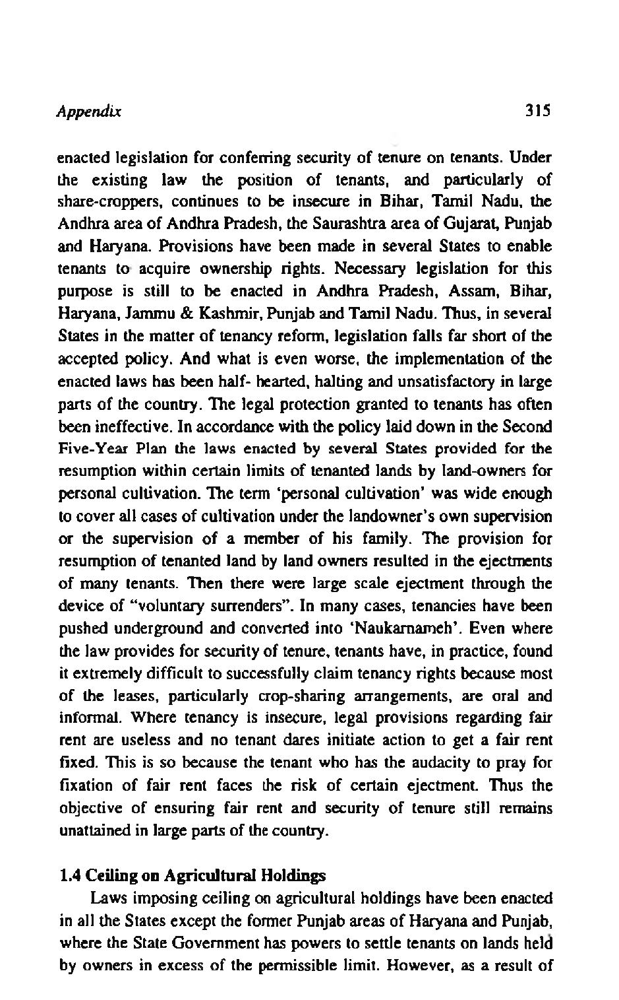

###### Appendix 315

enacted legislation for conferring security of tenure on tenants. Under the existing law the position of tenants, and particularly of share-croppers, continues to be insecure in Bihar, Tamil Nadu, the Andhra area of Andhra Pradesh, the Saurashtra area of Gujarat, Punjab and Haryana. Provisions have been made in several States to enable tenants to acquire ownership rights. Necessary legislation for this purpose is still to be enacted in Andhra Pradesh, Assam, Bihar, Haryana, Jammu & Kashmir, Punjab and Tamil Nadu. Thus, in several States in the matter of tenancy reform, legislation falls far short of the accepted policy. And what is even worse, the implementation of the enacted laws has been half- hearted, halting and unsatisfactory in large parts of the country. The legal protection granted to tenants has often been ineffective. In accordance with the policy laid down in the Second Five-Year Plan the laws enacted by several States provided for the resumption within certain limits of tenanted lands by land-owners for personal cultivation. The term ‘personal cultivation’ was wide enough to cover all cases of cultivation under the landowner’s own supervision or the supervision of a member of his family. The provision for resumption of tenanted land by land owners resulted in the ejectments of many tenants. Then there were large scale ejectment through the device of “voluntary surrenders”. In many cases, tenancies have been pushed underground and converted into ‘Naukamameh*. Even where the law provides for security of tenure, tenants have, in practice, found it extremely difficult to successfully claim tenancy rights because most of the leases, particularly crop-sharing arrangements, are oral and informal. Where tenancy is insecure, legal provisions regarding fair rent are useless and no tenant dares initiate action to get a fair rent fixed. This is so because the tenant who has the audacity to pray for fixation of fair rent faces the risk of certain ejectment. Thus the objective of ensuring fair rent and security of tenure still remains unattained in large parts of the country.

###### 1.4 Ceiling on Agricultural Holdings

Laws imposing ceiling on agricultural holdings have been enacted in all the States except the former Punjab areas of Haryana and Punjab, where the State Government has powers to settle tenants on lands held by owners in excess of the permissible limit. However, as a result of

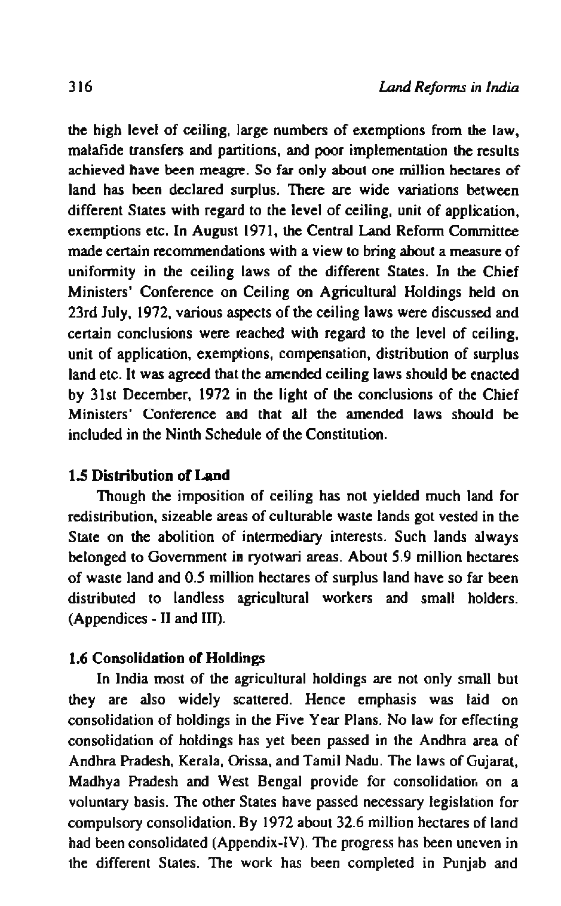

###### 316 Land Reforms in India

the high level of ceiling, large numbers of exemptions from the law, malafide transfers and partitions, and poor implementation the results achieved have been meagre. So far only about one million hectares of land has been declared surplus. There are wide variations between different States with regard to the level of ceiling, unit of application, exemptions etc. In August 1971, the Central Land Reform Committee made certain recommendations with a view to bring about a measure of uniformity in the ceiling laws of the different States. In the Chief Ministers’ Conference on Ceiling on Agricultural Holdings held on 23rd July, 1972, various aspects of the ceiling laws were discussed and certain conclusions were reached with regard to the level of ceiling, unit of application, exemptions, compensation, distribution of surplus land etc. It was agreed that the amended ceiling laws should be enacted by 31st December, 1972 in the light of the conclusions of the Chief Ministers’ Conference and that all the amended laws should be included in the Ninth Schedule of the Constitution.

- 1.5 Distribution of Land Though the imposition of ceiling has not yielded much land for

redistribution, sizeable areas of culturable waste lands got vested in the State on the abolition of intermediary interests. Such lands always belonged to Government in ryotwari areas. About 5.9 million hectares of waste land and 0.5 million hectares of surplus land have so far been distributed to landless agricultural workers and small holders. (Appendices - II and III).

- 1.6 Consolidation of Holdings In India most of the agricultural holdings are not only small but

they are also widely scattered. Hence emphasis was laid on consolidation of holdings in the Five Year Plans. No law for effecting consolidation of holdings has yet been passed in the Andhra area of Andhra Pradesh, Kerala, Orissa, and Tamil Nadu. The laws of Gujarat, Madhya Pradesh and West Bengal provide for consolidation on a voluntary basis. The other States have passed necessary legislation for compulsory consolidation. By 1972 about 32.6 million hectares of land had been consolidated (Appendix-IV). The progress has been uneven in the different States. The work has been completed in Punjab and

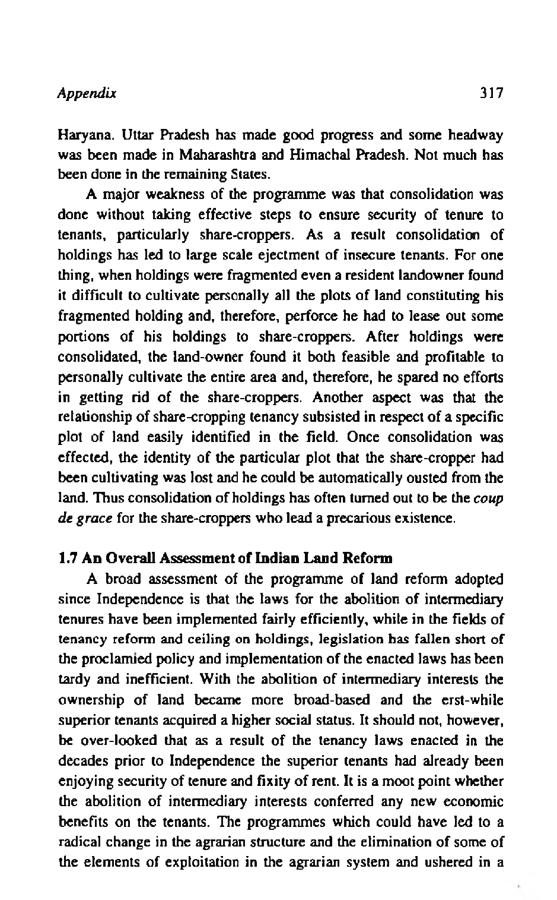

###### Appendix 317

Haryana. Uttar Pradesh has made good progress and some headway was been made in Maharashtra and Himachal Pradesh. Not much has been done in the remaining States.

A major weakness of the programme was that consolidation was done without taking effective steps to ensure security of tenure to tenants, particularly share-croppers. As a result consolidation of holdings has led to large scale ejectment of insecure tenants. For one thing, when holdings were fragmented even a resident landowner found it difficult to cultivate personally all the plots of land constituting his fragmented holding and, therefore, perforce he had to lease out some portions of his holdings to share-croppers. After holdings were consolidated, the land-owner found it both feasible and profitable to personally cultivate the entire area and, therefore, he spared no efforts in getting rid of the share-croppers. Another aspect was that the relationship of share-cropping tenancy subsisted in respect of a specific plot of land easily identified in the field. Once consolidation was effected, the identity of the particular plot that the share-cropper had been cultivating was lost and he could be automatically ousted from the land. Thus consolidation of holdings has often turned out to be the coup de grace for the share-croppers who lead a precarious existence.

- 1.7 An Overall Assessment of Indian Land Reform A broad assessment of the programme of land reform adopted

since Independence is that the laws for the abolition of intermediary tenures have been implemented fairly efficiently, while in the fields of tenancy reform and ceiling on holdings, legislation has fallen short of the proclaimed policy and implementation of the enacted laws has been tardy and inefficient. With the abolition of intermediary interests the ownership of land became more broad-based and the erst-while superior tenants acquired a higher social status. It should not, however, be over-looked that as a result of the tenancy laws enacted in the decades prior to Independence the superior tenants had already been enjoying security of tenure and fixity of rent. It is a moot point whether the abolition of intermediary interests conferred any new economic benefits on the tenants. The programmes which could have led to a radical change in the agrarian structure and the elimination of some of the elements of exploitation in the agrarian system and ushered in a

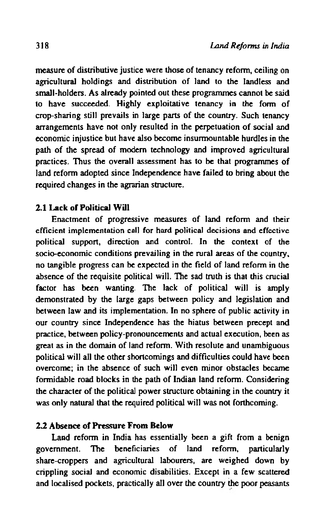

###### 318 Land Reforms in India

measure of distributive justice were those of tenancy reform, ceiling on agricultural holdings and distribution of land to the landless and small-holders. As already pointed out these programmes cannot be said to have succeeded. Highly exploitative tenancy in the form of crop-sharing still prevails in large parts of the country. Such tenancy arrangements have not only resulted in the perpetuation of social and economic injustice but have also become insurmountable hurdles in the path of the spread of modem technology and improved agricultural practices. Thus the overall assessment has to be that programmes of land reform adopted since Independence have failed to bring about the required changes in the agrarian structure.

- 2.1 Lack of Political Will Enactment of progressive measures of land reform and their

cfficicnt implementation call for hard political decisions and effective political support, direction and control. In the context of the socio-economic conditions prevailing in the rural areas of the country, no tangible progress can be expected in the field of land reform in the absence of the requisite political will. The sad truth is that this crucial factor has been wanting. The lack of political will is amply demonstrated by the large gaps between policy and legislation and between law and its implementation. In no sphere of public activity in our country since Independence has the hiatus between precept and practice, between policy-pronouncements and actual execution, been as great as in the domain of land reform. With resolute and unambiguous political will all the other shortcomings and difficulties could have been overcome; in the absence of such will even minor obstacles became formidable road blocks in the path of Indian land reform. Considering the character of the political power structure obtaining in the country it was only natural that the required political will was not forthcoming.

- 22 Absence of Pressure From Below Land reform in India has essentially been a gift from a benign

government. The beneficiaries of land reform, particularly share-croppers and agricultural labourers, are weighed down by crippling social and economic disabilities. Except in a few scattered and localised pockets, practically all over the country the poor peasants

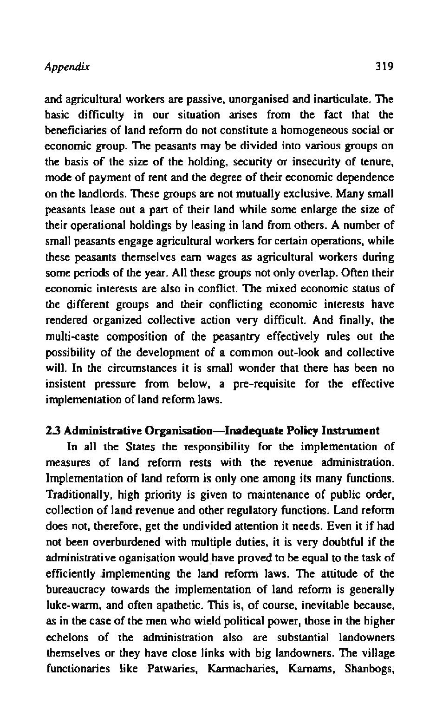

###### Appendix 319

and agricultural workers are passive, unorganised and inarticulate. TTie basic difficulty in our situation arises from the fact that the beneficiaries of land reform do not constitute a homogeneous social or economic group. The peasants may be divided into various groups on the basis of the size of the holding, security or insecurity of tenure, mode of payment of rent and the degree of their economic dependence on the landlords. These groups are not mutually exclusive. Many small peasants lease out a part of their land while some enlarge the size of their operational holdings by leasing in land from others. A number of small peasants engage agricultural workers for certain operations, while these peasants themselves earn wages as agricultural workers during some periods of the year. All these groups not only overlap. Often their economic interests are also in conflict. The mixed economic status of the different groups and their conflicting economic interests have rendered organized collective action very difficult. And finally, the multi-caste composition of the peasantry effectively rules out the possibility of the development of a common out-look and collective will. In the circumstances it is small wonder that there has been no insistent pressure from below, a pre-requisite for the effective implementation of land reform laws.

- 23 Administrative Organisation—Inadequate Policy Instrument In all the States the responsibility for the implementation of

measures of land reform rests with the revenue administration. Implementation of land reform is only one among its many functions. Traditionally, high priority is given to maintenance of public order, collection of land revenue and other regulatory functions. Land reform does not, therefore, get the undivided attention it needs. Even it if had not been overburdened with multiple duties, it is very doubtful if the administrative oganisation would have proved to be equal to the task of efficiently implementing the land reform laws. The attitude of the bureaucracy towards the implementation of land reform is generally luke-warm, and often apathetic. This is, of course, inevitable because, as in the case of the men who wield political power, those in the higher echelons of the administration also are substantial landowners themselves or they have close links with big landowners. The village functionaries like Patwaries, Karmacharies, Kamams, Shanbogs,

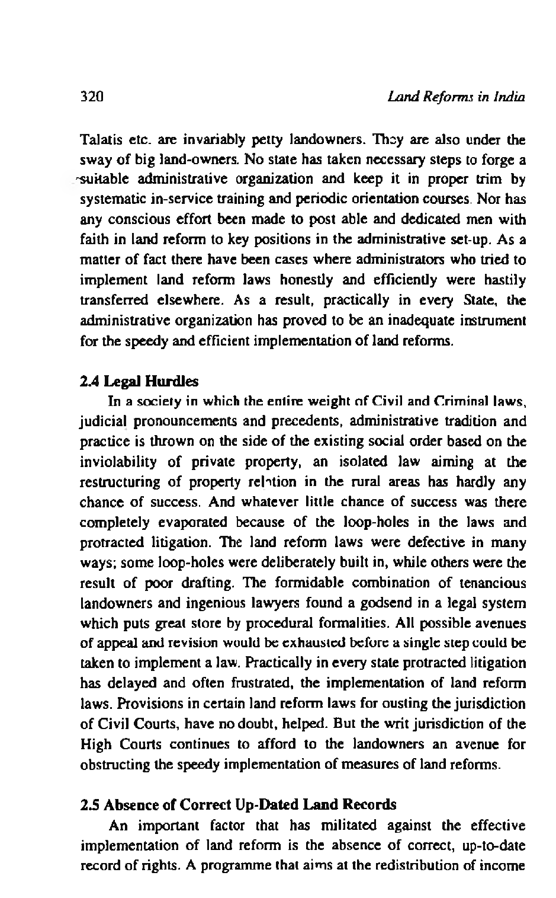

###### 320 Land Reforms in India

Talatis etc. are invariably petty landowners. Thsy are also under the sway of big land-owners. No state has taken necessary steps to forge a

-suitable administrative organization and keep it in proper trim by systematic in-service training and periodic orientation courses. Nor has any conscious effort been made to post able and dedicated men with faith in land reform to key positions in the administrative set-up. As a matter of fact there have been cases where administrators who tried to implement land reform laws honestly and efficiently were hastily transferred elsewhere. As a result, practically in every State, the administrative organization has proved to be an inadequate instrument for the speedy and efficient implementation of land reforms.

- 2.4 Legal Hurdles In a society in which the entire weight of Civil and Criminal laws,

judicial pronouncements and precedents, administrative tradition and practice is thrown on the side of the existing social order based on the inviolability of private property, an isolated law aiming at the restructuring of property rehtion in the rural areas has hardly any chance of success. And whatever little chance of success was there completely evaporated because of the loop-holes in the laws and protracted litigation. The land reform laws were defective in many ways; some loop-holes were deliberately built in, while others were the result of poor drafting. The formidable combination of tenancious landowners and ingenious lawyers found a godsend in a legal system which puts great store by procedural formalities. All possible avenues of appeal and revision would be exhausted before a single step could be taken to implement a law. Practically in every state protracted litigation has delayed and often frustrated, the implementation of land reform laws. Provisions in certain land reform laws for ousting the jurisdiction of Civil Courts, have no doubt, helped. But the writ jurisdiction of the High Courts continues to afford to the landowners an avenue for obstructing the speedy implementation of measures of land reforms.

- 2.5 Absence of Correct Up-Dated Land Records An important factor that has militated against the effective

implementation of land reform is the absence of correct, up-to-date record of rights. A programme that aims at the redistribution of income

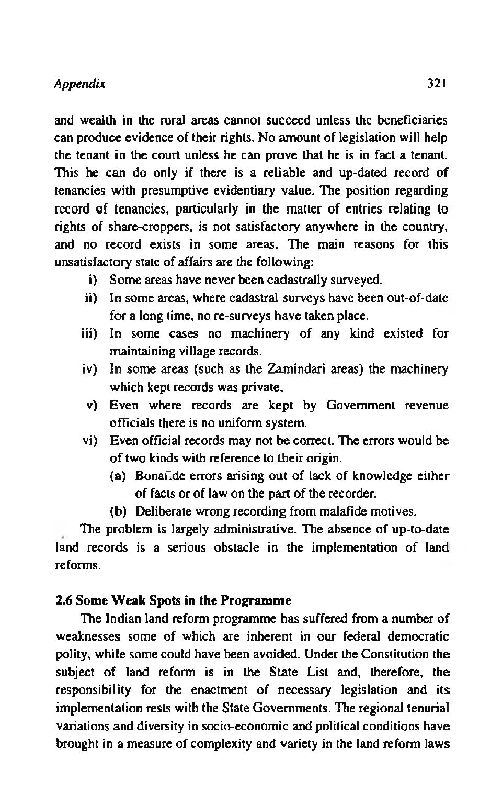

###### Appendix 321

and wealth in the rural areas cannot succeed unless the beneficiaries can produce evidence of their rights. No amount of legislation will help the tenant in the court unless he can prove that he is in fact a tenant. This he can do only if there is a reliable and up-dated record of tenancies with presumptive evidentiary value. The position regarding record of tenancies, particularly in the matter of entries relating to rights of share-croppers, is not satisfactory anywhere in the country, and no record exists in some areas. The main reasons for this unsatisfactory state of affairs are the following:

- i) Some areas have never been cadastrally surveyed.
- ii) In some areas, where cadastral surveys have been out-of-date for a long time, no re-surveys have taken place.
- iii) In some cases no machinery of any kind existed for maintaining village records.
- iv) In some areas (such as the Zamindari areas) the machinery which kept records was private.
- v) Even where records are kept by Government revenue officials there is no uniform system.
- vi) Even official records may not be correct. The errors would be of two kinds with reference to their origin.

- (a) Bonaf.de errors arising out of lack of knowledge either of facts or of law on the part of the recorder.
- (b) Deliberate wrong recording from malafide motives.

The problem is largely administrative. The absence of up-to-date land records is a serious obstacle in the implementation of land reforms.

- 2.6 Some Weak Spots in the Programme The Indian land reform programme has suffered from a number of

weaknesses some of which are inherent in our federal democratic polity, while some could have been avoided. Under the Constitution the subject of land reform is in the State List and, therefore, the responsibility for the enactment of necessary legislation and its implementation rests with the State Governments. The regional tenurial variations and diversity in socio-economic and political conditions have brought in a measure of complexity and variety in the land reform laws

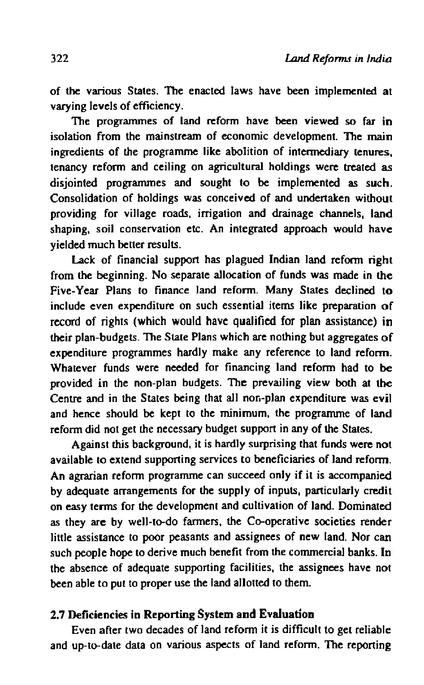

###### 322 Land Reforms in India

of the various States. The enacted laws have been implemented at varying levels of efficiency.

The programmes of land reform have been viewed so far in isolation from the mainstream of economic development. The main ingredients of the programme like abolition of intermediary tenures, tenancy reform and ceiling on agricultural holdings were treated as disjointed programmes and sought to be implemented as such. Consolidation of holdings was conceived of and undertaken without providing for village roads, irrigation and drainage channels, land shaping, soil conservation etc. An integrated approach would have yielded much better results.

Lack of financial support has plagued Indian land reform right from the beginning. No separate allocation of funds was made in the Five-Year Plans to finance land reform. Many States declined to include even expenditure on such essential items like preparation of record of rights (which would have qualified for plan assistance) in their plan-budgets. The State Plans which are nothing but aggregates of expenditure programmes hardly make any reference to land reform. Whatever funds were needed for financing land reform had to be provided in the non-plan budgets. The prevailing view both at the Centre and in the States being that all nor.-plan expenditure was evil and hence should be kept to the minimum, the programme of land reform did not get the necessary budget support in any of the States.

Against this background, it is hardly surprising that funds were not available to extend supporting services to beneficiaries of land reform. An agrarian reform programme can succeed only if it is accompanied by adequate arrangements for the supply of inputs, particularly credit on easy terms for the development and cultivation of land. Dominated as they are by well-to-do farmers, the Co-operative societies render little assistance to poor peasants and assignees of new land. Nor can such people hope to derive much benefit from the commercial banks. In the absence of adequate supporting facilities, the assignees have not been able to put to proper use the land allotted to them.

- 2.7 Deficiencies in Reporting System and Evaluation Even after two decades of land reform it is difficult to get reliable

and up-to-date data on various aspects of land reform. The reporting

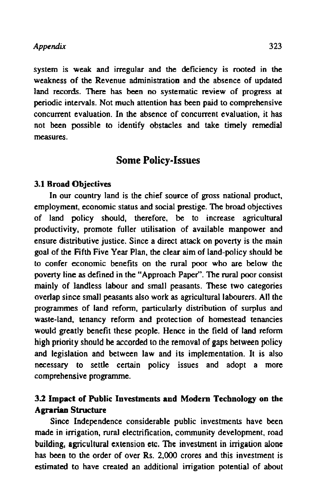

###### Appendix 323

system is weak and irregular and the deficiency is rooted in the weakness of the Revenue administration and the absence of updated land records. There has been no systematic review of progress at periodic intervals. Not much attention has been paid to comprehensive concurrent evaluation. In the absence of concurrent evaluation, it has not been possible to identify obstacles and take timely remedial measures.

###### Some Policy-Issues

- 3.1 Broad Objectives In our country land is the chief source of gross national product,

employment, economic status and social prestige. The broad objectives of land policy should, therefore, be to increase agricultural productivity, promote fuller utilisation of available manpower and ensure distributive justice. Since a direct attack on poverty is the main goal of the Fifth Five Year Plan, the clear aim of land-policy should be to confer economic benefits on the rural poor who are below the poverty line as defined in the “Approach Paper”. The rural poor consist mainly of landless labour and small peasants. These two categories overlap since small peasants also work as agricultural labourers. All the programmes of land reform, particularly distribution of surplus and waste-land, tenancy reform and protection of homestead tenancies would greatly benefit these people. Hence in the field of land reform high priority should be accorded to the removal of gaps between policy and legislation and between law and its implementation. It is also necessary to settle certain policy issues and adopt a more comprehensive programme.

- 3.2 Impact of Public Investments and Modern Technology on the Agrarian Structure

Since Independence considerable public investments have been made in irrigation, rural electrification, community development, road building, agricultural extension etc. The investment in irrigation alone has been to the order of over Rs. 2,000 crores and this investment is estimated to have created an additional irrigation potential of about

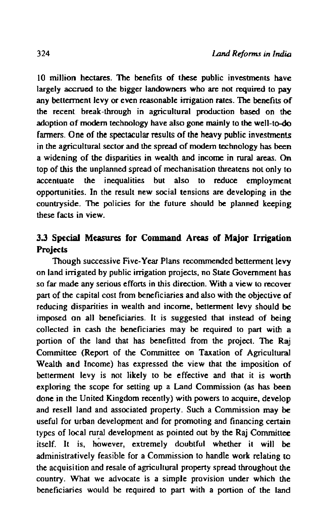

###### 324 Land Reforms in India

10 million hectares. The benefits of these public investments have largely accrued to the bigger landowners who are not required to pay any betterment levy or even reasonable irrigation rates. The benefits of the recent break-through in agricultural production based on the adoption of modem technology have also gone mainly to the well-to-do farmers. One of the spectacular results of the heavy public investments in the agricultural sector and the spread of modem technology has been a widening of the disparities in wealth and income in rural areas. On top of this the unplanned spread of mechanisation threatens not only to accentuate the inequalities but also to reduce employment opportunities. In the result new social tensions are developing in the countryside. The policies for the future should be planned keeping these facts in view.

- 3.3 Special Measures for Command Areas of Major Irrigation Projects

Though successive Five-Year Plans recommended betterment levy on land irrigated by public irrigation projects, no State Government has so far made any serious efforts in this direction. With a view to recover part of the capital cost from beneficiaries and also with the objective of reducing disparities in wealth and income, betterment levy should be imposed on all beneficiaries. It is suggested that instead of being collected in cash the beneficiaries may be required to part with a portion of the land that has benefited from the project. The Raj Committee (Report of the Committee on Taxation of Agricultural Wealth and Income) has expressed the view that the imposition of betterment levy is not likely to be effective and that it is worth exploring the scope for setting up a Land Commission (as has been done in the United Kingdom recently) with powers to acquire, develop and resell land and associated property. Such a Commission may be useful for urban development and for promoting and financing certain types of local rural development as pointed out by the Raj Committee itself. It is, however, extremely doubtful whether it will be administratively feasible for a Commission to handle work relating to the acquisition and resale of agricultural property spread throughout the country. What we advocate is a simple provision under which the beneficiaries would be required to part with a portion of the land

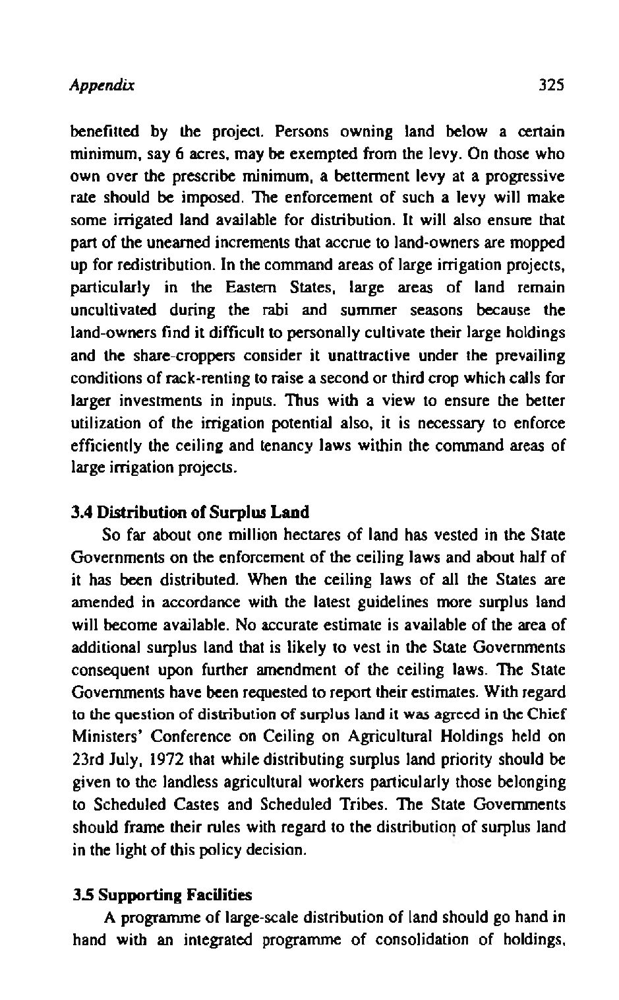

###### Appendix 325

benefitted by the project. Persons owning land below a certain minimum, say 6 acres, may be exempted from the levy. On those who own over the prescribe minimum, a betterment levy at a progressive rate should be imposed. The enforcement of such a levy will make some irrigated land available for distribution. It will also ensure that part of the unearned increments that accrue to land-owners are mopped up for redistribution. In the command areas of large irrigation projects, particularly in the Eastern States, large areas of land remain uncultivated during the rabi and summer seasons because the land-owners find it difficult to personally cultivate their large holdings and the share-croppers consider it unattractive under the prevailing conditions of rack-renting to raise a second or third crop which calls for larger investments in inputs. Thus with a view to ensure the better utilization of the irrigation potential also, it is necessary to enforce efficiently the ceiling and tenancy laws within the command areas of large irrigation projects.

- 3.4 Distribution of Surplus Land So far about one million hectares of land has vested in the State

Governments on the enforcement of the ceiling laws and about half of it has been distributed. When the ceiling laws of all the States are amended in accordance with the latest guidelines more surplus land will become available. No accurate estimate is available of the area of additional surplus land that is likely to vest in the State Governments consequent upon further amendment of the ceiling laws. The State Governments have been requested to report their estimates. With regard to the question of distribution of surplus land it was agreed in the Chief Ministers’ Conference on Ceiling on Agricultural Holdings held on 23rd July, 1972 that while distributing surplus land priority should be given to the landless agricultural workers particularly those belonging to Scheduled Castes and Scheduled Tribes. The State Governments should frame their rules with regard to the distribution of surplus land in the light of this policy decision.

- 3.5 Supporting Facilities A programme of large-scale distribution of land should go hand in

hand with an integrated programme of consolidation of holdings,

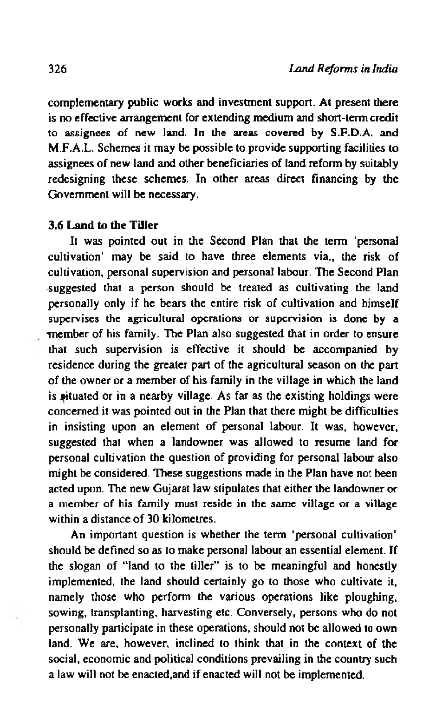

###### 326 Land Reforms in India

complementary public works and investment support. At present there is no effective arrangement for extending medium and short-term credit to assignees of new land. In the areas covered by S.F.D.A. and M.F.A.L. Schemes it may be possible to provide supporting facilities to assignees of new land and other beneficiaries of land reform by suitably redesigning these schemes. In other areas direct financing by the Government will be necessary.

- 3.6 Land to the Tiller It was pointed out in the Second Plan that the term ‘personal

cultivation’ may be said lo have three elements via., the risk of cultivation, personal supervision and personal labour. The Second Plan suggested that a person should be treated as cultivating the land personally only if he bears the entire risk of cultivation and himself supervises the agricultural operations or supervision is done by a •member of his family. The Plan also suggested that in order to ensure that such supervision is effective it should be accompanied by residence during the greater part of the agricultural season on the part of the owner or a member of his family in the village in which the land is situated or in a nearby village. As far as the existing holdings were concerned it was pointed out in the Plan that there might be difficulties in insisting upon an element of personal labour. It was, however, suggested that when a landowner was allowed to resume land for personal cultivation the question of providing for personal labour also might be considered. These suggestions made in the Plan have not been acted upon. The new Gujarat law stipulates that either the landowner or a member of his family must reside in the same village or a village within a distance of 30 kilometres.

An important question is whether the term ‘personal cultivation’ should be defined so as to make personal labour an essential element. If the slogan of “land to the tiller” is to be meaningful and honestly implemented, the land should certainly go to those who cultivate it, namely those who perform the various operations like ploughing, sowing, transplanting, harvesting etc. Conversely, persons who do not personally participate in these operations, should not be allowed to own land. We are, however, inclined to think that in the context of the social, economic and political conditions prevailing in the country such a law will not be enacted,and if enacted will not be implemented.

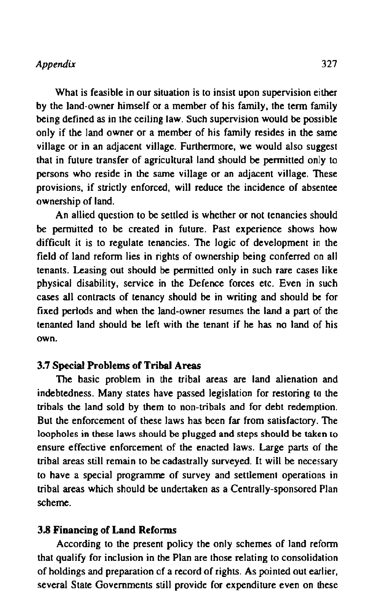

###### Appendix 327

What is feasible in our situation is to insist upon supervision either by the land-owner himself or a member of his family, the term family being defined as in the ceiling law. Such supervision would be possible only if the land owner or a member of his family resides in the same village or in an adjacent village. Furthermore, we would also suggest that in future transfer of agricultural land should be permitted only to persons who reside in the same village or an adjacent village. These provisions, if strictly enforced, will reduce the incidence of absentee ownership of land.

An allied question to be settled is whether or not tenancies should be permitted to be created in future. Past experience shows how difficult it is to regulate tenancies. The logic of development in the field of land reform lies in rights of ownership being conferred on all tenants. Leasing out should be permitted only in such rare cases like physical disability, service in the Defence forces etc. Even in such cases all contracts of tenancy should be in writing and should be for fixed periods and when the land-owner resumes the land a part of the tenanted land should be left with the tenant if he has no land of his own.

- 3.7 Special Problems of Tribal Areas The basic problem in the tribal areas are land alienation and

indebtedness. Many states have passed legislation for restoring to the tribals the land sold by them to non-tribals and for debt redemption. But the enforcement of these laws has been far from satisfactory. The loopholes in these laws should be plugged and steps should be taken to ensure effective enforcement of the enacted laws. Large parts of the tribal areas still remain to be cadastrally surveyed. It will be necessary to have a special programme of survey and settlement operations in tribal areas which should be undertaken as a Centrally-sponsored Plan scheme.

- 3.8 Financing of Land Reforms According to the present policy the only schemes of land reform

that qualify for inclusion in the Plan are those relating to consolidation of holdings and preparation of a record of rights. As pointed out earlier, several State Governments still provide for expenditure even on these

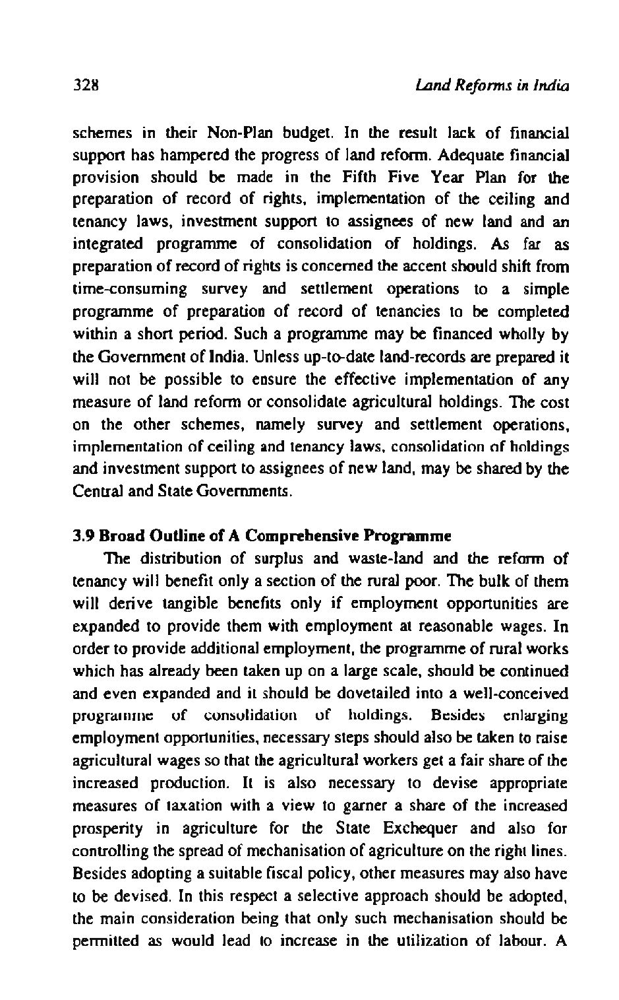

###### 328 Land Reforms in India

schemes in their Non-Plan budget. In the result lack of financial support has hampered the progress of land reform. Adequate financial provision should be made in the Fifth Five Year Plan for the preparation of record of rights, implementation of the ceiling and tenancy laws, investment support to assignees of new land and an integrated programme of consolidation of holdings. As far as preparation of record of rights is concerned the accent should shift from time-consuming survey and settlement operations to a simple programme of preparation of record of tenancies to be completed within a short period. Such a programme may be financed wholly by the Government of India. Unless up-to-date land-records are prepared it will not be possible to ensure the effective implementation of any measure of land reform or consolidate agricultural holdings. The cost on the other schemes, namely survey and settlement operations, implementation of ceiling and tenancy laws, consolidation of holdings and investment support to assignees of new land, may be shared by the Central and State Governments.

- 3.9 Broad Outline of A Comprehensive Programme The distribution of surplus and waste-land and the reform of

tenancy will benefit only a section of the rural poor. The bulk of them will derive tangible benefits only if employment opportunities are expanded to provide them with employment at reasonable wages. In order to provide additional employment, the programme of rural works which has already been taken up on a large scale, should be continued and even expanded and it should be dovetailed into a well-conceived programme of consolidation of holdings. Besides enlarging employment opportunities, necessary steps should also be taken to raise agricultural wages so that the agricultural workers get a fair share of the increased production. It is also necessary to devise appropriate measures of taxation with a view to garner a share of the increased prosperity in agriculture for the State Exchequer and also for controlling the spread of mechanisation of agriculture on the right lines. Besides adopting a suitable fiscal policy, other measures may also have to be devised. In this respect a selective approach should be adopted, the main consideration being that only such mechanisation should be permitted as would lead to increase in the utilization of labour. A

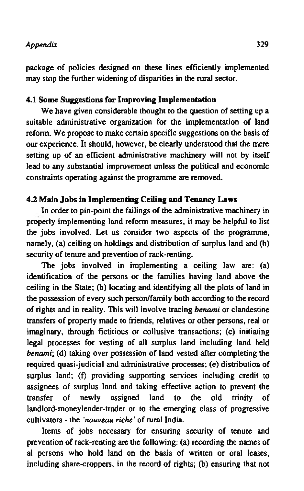

###### Appendix 329

package of policies designed on these lines efficiently implemented may stop the further widening of disparities in the rural sector.

- 4.1 Some Suggestions for Improving Implementation We have given considerable thought to the question of setting up a

suitable administrative organization for the implementation of land reform. We propose to make certain specific suggestions on the basis of our experience. It should, however, be clearly understood that the mere setting up of an efficient administrative machinery will not by itself lead to any substantial improvement unless the political and economic constraints operating against the programme are removed.

###### 42 Main Jobs in Implementing Ceiling and Tenancy Laws

In order to pin-point the failings of the administrative machinery in properly implementing land reform measures, it may be helpful to list the jobs involved. Let us consider two aspects of the programme, namely, (a) ceiling on holdings and distribution of surplus land and (b) security of tenure and prevention of rack-renting.

The jobs involved in implementing a ceiling law are: (a) identification of the persons or the families having land above the ceiling in the State; (b) locating and identifying all the plots of land in the possession of every such person/family both according to the record of rights and in reality. This will involve tracing benami or clandestine transfers of property made to friends, relatives or other persons, real or imaginary, through fictitious or collusive transactions; (c) initiating legal processes for vesting of all surplus land including land held benamix(d) taking over possession of land vested after completing the required quasi-judicial and administrative processes; (e) distribution of surplus land; (0 providing supporting services including credit to assignees of surplus land and taking effective action to prevent the transfer of newly assigned land to the old trinity of landlord-moneylender-trader or to the emerging class of progressive cultivators - the ‘nouveau riche’ of rural India.

Items of jobs necessary for ensuring security of tenure and prevention of rack-renting are the following: (a) recording the names of al persons who hold land on the basis of written or oral leases, including share-croppers, in the record of rights; (b) ensuring that not

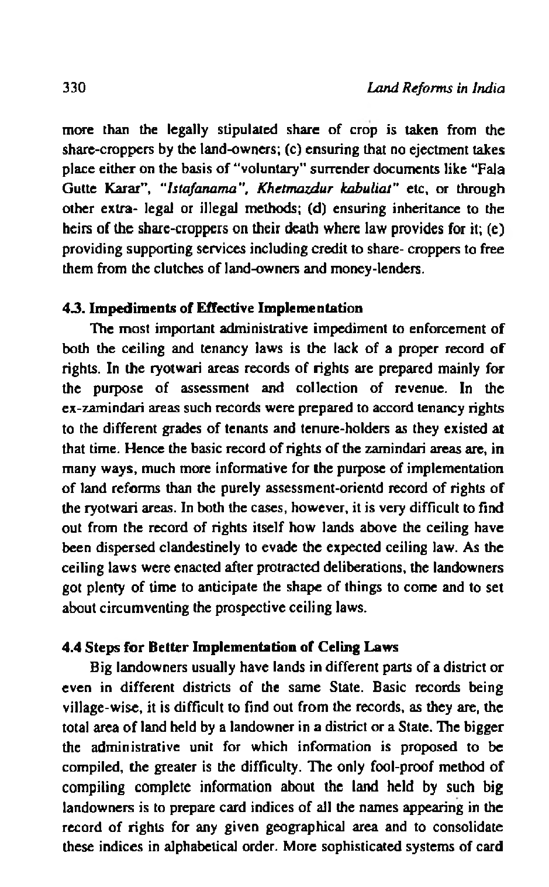

###### 330 Land Reforms in India

more than the legally stipulated share of crop is taken from the share-croppers by the land-owners; (c) ensuring that no ejectment takes place either on the basis of “voluntary” surrender documents like “Fala Gutte Karar”, ,,Istafanama,\ Khetmazdur kabuliat” etc, or through other extra- legal or illegal methods; (d) ensuring inheritance to the heirs of the share-croppers on their death where law provides for it; (e) providing supporting services including credit to share- croppers to free them from the clutches of land-owners and money-lenders.

###### 43. Impediments of Effective Implementation

The most important administrative impediment to enforcement of both the ceiling and tenancy laws is the lack of a proper record of rights. In the ryotwari areas records of rights are prepared mainly for the purpose of assessment and collection of revenue. In the ex-zamindari areas such records were prepared to accord tenancy rights to the different grades of tenants and tenure-holders as they existed at that time. Hence the basic record of rights of the zamindari areas are, in many ways, much more informative for the purpose of implementation of land reforms than the purely assessment-orientd record of rights of the ryotwari areas. In both the cases, however, it is very difficult to find out from the record of rights itself how lands above the ceiling have been dispersed clandestinely to evade the expected ceiling law. As the ceiling laws were enacted after protracted deliberations, the landowners got plenty of time to anticipate the shape of things to come and to set about circumventing the prospective ceiling laws.

###### 4.4 Steps for Better Implementation of Celing Laws

Big landowners usually have lands in different parts of a district or even in different districts of the same State. Basic records being village-wise, it is difficult to find out from the records, as they are, the total area of land held by a landowner in a district or a State. The bigger the administrative unit for which information is proposed to be compiled, the greater is the difficulty. The only fool-proof method of compiling complete information about the land held by such big landowners is to prepare card indices of all the names appearing in the record of rights for any given geographical area and to consolidate these indices in alphabetical order. More sophisticated systems of card

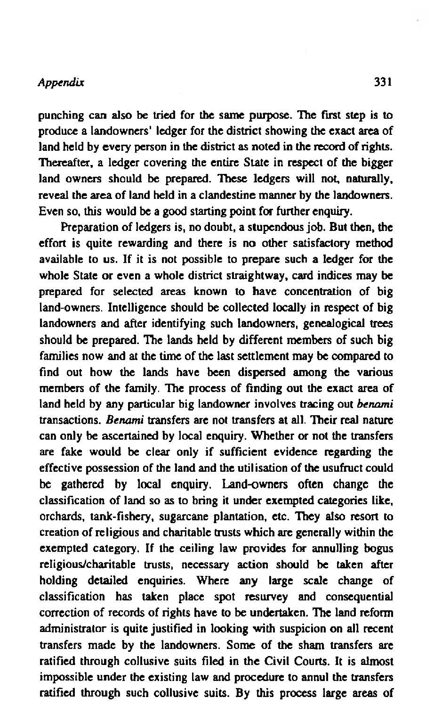

###### Appendix 331

punching can also be tried for the same purpose. The first step is to produce a landowners’ ledger for the district showing the exact area of land held by every person in the district as noted in the record of rights. Thereafter, a ledger covering the entire State in respect of the bigger land owners should be prepared. These ledgers will not, naturally, reveal the area of land held in a clandestine manner by the landowners. Even so, this would be a good starting point for further enquiry.

Preparation of ledgers is, no doubt, a stupendous job. But then, the effort is quite rewarding and there is no other satisfactory method available to us. If it is not possible to prepare such a ledger for the whole State or even a whole district straightway, card indices may be prepared for selected areas known to have concentration of big land-owners. Intelligence should be collected locally in respect of big landowners and after identifying such landowners, genealogical trees should be prepared. The lands held by different members of such big families now and at the time of the last settlement may be compared to find out how the lands have been dispersed among the various members of the family. The process of finding out the exact area of land held by any particular big landowner involves tracing out benami transactions. Benami transfers are not transfers at all. Their real nature can only be ascertained by local enquiry. Whether or not the transfers are fake would be clear only if sufficient evidence regarding the effective possession of the land and the utilisation of the usufruct could be gathered by local enquiry. Land-owners often change the classification of land so as to bring it under exempted categories like, orchards, tank-fishery, sugarcane plantation, etc. They also resort to creation of religious and charitable trusts which are generally within the exempted category. If the ceiling law provides for annulling bogus religious/charitable Ousts, necessary action should be taken after holding detailed enquiries. Where any large scale change of classification has taken place spot resurvey and consequential correction of records of rights have to be undertaken. The land reform administrator is quite justified in looking with suspicion on all recent transfers made by the landowners. Some of the sham transfers are ratified through collusive suits filed in the Civil Courts. It is almost impossible under the existing law and procedure to annul the transfers ratified through such collusive suits. By this process large areas of

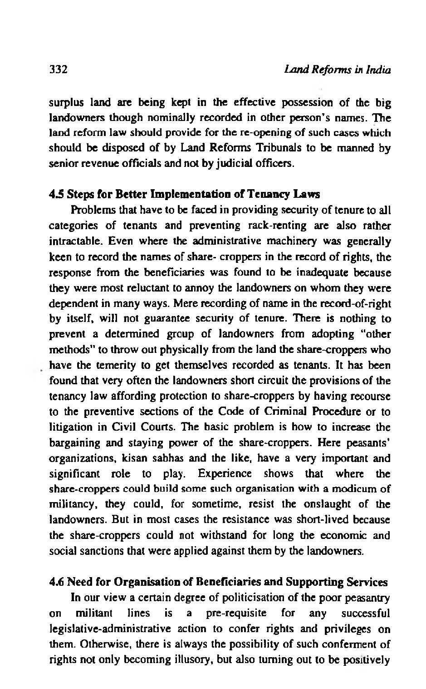

###### 332 Land Reforms in India

surplus land arc being kept in the effective possession of the big landowners though nominally recorded in other person’s names. The land reform law should provide for the re-opening of such cases which should be disposed of by Land Reforms Tribunals to be manned by senior revenue officials and not by judicial officers.

- 4.5 Steps for Better Implementation of Tenancy Laws Problems that have to be faced in providing security of tenure to all

categories of tenants and preventing rack-renting are also rather intractable. Even where the administrative machinery was generally keen to record the names of share- croppers in the record of rights, the response from the beneficiaries was found to be inadequate because they were most reluctant to annoy the landowners on whom they were dependent in many ways. Mere recording of name in the record-of-right by itself, will not guarantee security of tenure. There is nothing to prevent a determined group of landowners from adopting “other methods” to throw out physically from the land the share-croppers who have the temerity to get themselves recorded as tenants. It has been found that very often the landowners short circuit the provisions of the tenancy law affording protection to share-croppers by having recourse to the preventive sections of the Code of Criminal Procedure or to litigation in Civil Courts. The basic problem is how to increase the bargaining and staying power of the share-croppers. Here peasants’ organizations, kisan sabhas and the like, have a very important and significant role to play. Experience shows that where the

share-croppers could build some such organisation with a modicum of

militancy, they could, for sometime, resist the onslaught of the landowners. But in most cases the resistance was short-lived because the share-croppers could not withstand for long the economic and social sanctions that were applied against them by the landowners.

- 4.6 Need for Organisation of Beneficiaries and Supporting Services In our view a certain degree of politicisation of the poor peasantry

on militant lines is a pre-requisite for any successful legislative-administrative action to confer rights and privileges on them. Otherwise, there is always the possibility of such conferment of rights not only becoming illusory, but also turning out to be positively

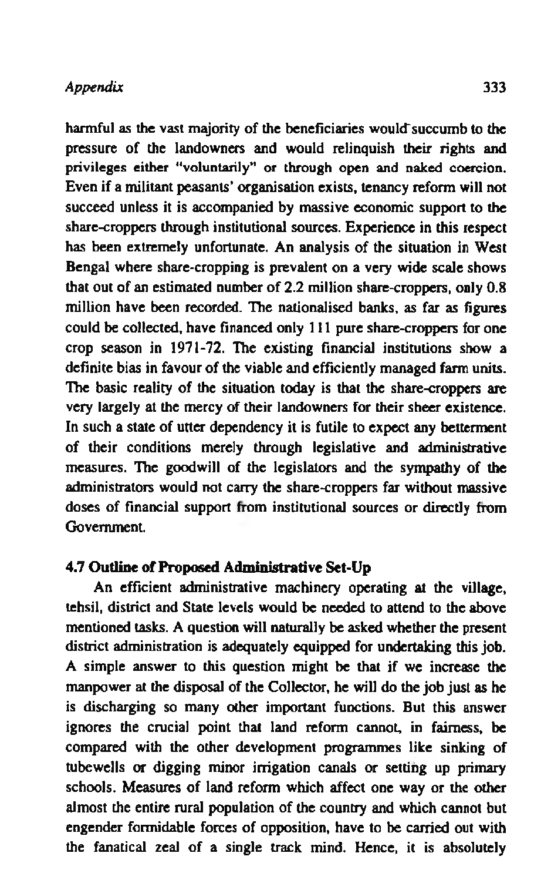

###### Appendix 333

harmful as the vast majority of the beneficiaries would"succumb to the pressure of the landowners and would relinquish their rights and privileges either “voluntarily” or through open and naked coercion. Even if a militant peasants’ organisation exists, tenancy reform will not succeed unless it is accompanied by massive economic support to the share-croppers through institutional sources. Experience in this respect has been extremely unfortunate. An analysis of the situation in West Bengal where share-cropping is prevalent on a very wide scale shows that out of an estimated number of 2.2 million share-croppers, only 0.8 million have been recorded. The nationalised banks, as far as figures could be collected, have financed only 111 pure share-croppers for one crop season in 1971-72. The existing financial institutions show a definite bias in favour of the viable and efficiently managed farm units. The basic reality of the situation today is that the share-croppers are very largely at the mercy of their landowners for their sheer existence. In such a state of utter dependency it is futile to expect any betterment of their conditions merely through legislative and administrative measures. The goodwill of the legislators and the sympathy of the administrators would not carry the share-croppers far without massive doses of financial support from institutional sources or directly from Government.

- 4.7 Outline of Proposed Administrative Set-Up An efficient administrative machinery operating at the village,

tehsil, district and State levels would be needed to attend to the above mentioned tasks. A question will naturally be asked whether the present district administration is adequately equipped for undertaking this job. A simple answer to this question might be that if we increase the manpower at the disposal of the Collector, he will do the job just as he is discharging so many other important functions. But this answer ignores the crucial point that land reform cannot, in fairness, be compared with the other development programmes like sinking of tubewells or digging minor irrigation canals or setting up primary schools. Measures of land reform which affect one way or the other almost the entire rural population of the country and which cannot but engender formidable forces of opposition, have to be carried out with the fanatical zeal of a single track mind. Hence, it is absolutely

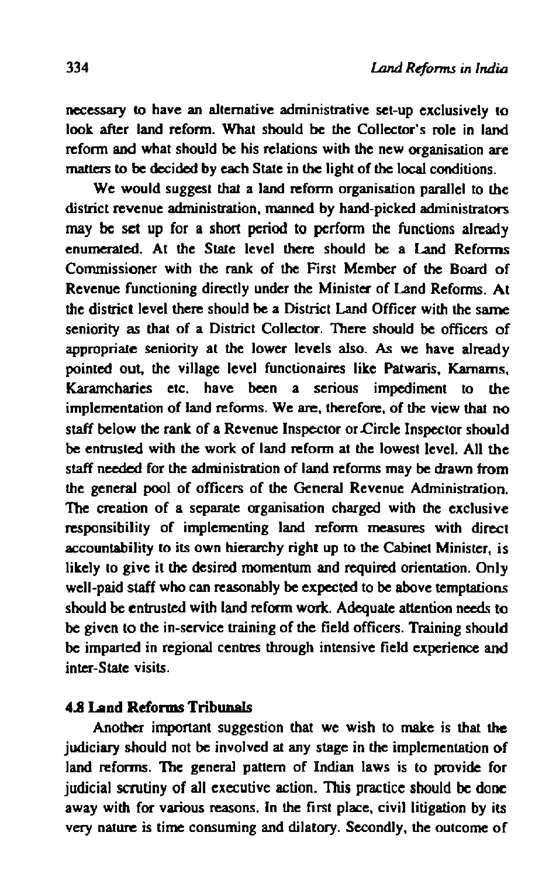

334 Land Reforms in India

necessary to have an alternative administrative set-up exclusively to look after land reform. What should be the Collector’s role in land reform and what should be his relations with the new organisation are matters to be decided by each State in the light of the local conditions.

We would suggest that a land reform organisation parallel to the district revenue administration, manned by hand-picked administrators may be set up for a short period to perform the functions already enumerated. At the State level there should be a Land Reforms Commissioner with the rank of the First Member of the Board of Revenue functioning directly under the Minister of Land Reforms. At the district level there should be a District Land Officer with the same seniority as that of a District Collector. There should be officers of appropriate seniority at the lower levels also. As we have already pointed out, the village level functionaires like Patwaris, Kamams, Karamcharies etc. have been a serious impediment to the implementation of land reforms. We are, therefore, of the view that no staff below the rank of a Revenue Inspector or-Circle Inspector should be entrusted with the work of land reform at the lowest level. All the staff needed for the administration of land reforms may be drawn from the general pool of officers of the General Revenue Administration. The creation of a separate organisation charged with the exclusive responsibility of implementing land reform measures with direct accountability to its own hierarchy right up to the Cabinet Minister, is likely to give it the desired momentum and required orientation. Only well-paid staff who can reasonably be expected to be above temptations should be entrusted with land reform work. Adequate attention needs to be given to the in-service training of the field officers. Training should be imparted in regional centres through intensive field experience and inter-State visits.

- 4.8 Land Reforms Tribunals Another important suggestion that we wish to make is that the

judiciary should not be involved at any stage in the implementation of land reforms. The general pattern of Indian laws is to provide for judicial sciutiny of all executive action. This practicc should be done away with for various reasons. In the first place, civil litigation by its very nature is time consuming and dilatory. Secondly, the outcome of

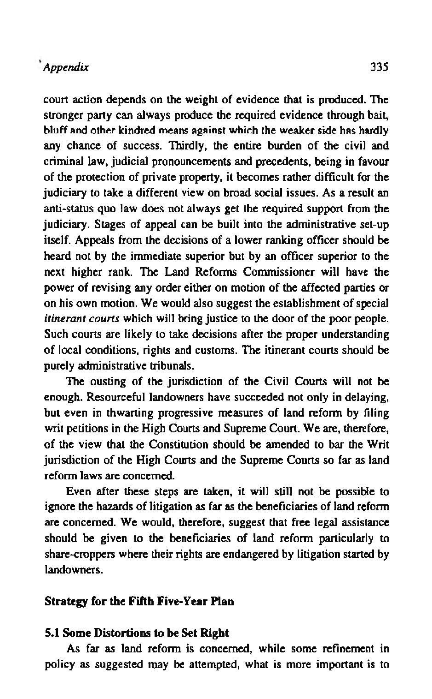

###### Appendix 335

court action depends on the weight of evidence that is produced. The stronger party can always produce the required evidence through bait, bluff and other kindred means against which the weaker side has hardly any chance of success. Thirdly, the entire burden of the civil and criminal law, judicial pronouncements and precedents, being in favour of the protection of private property, it becomes rather difficult for the judiciary to take a different view on broad social issues. As a result an anti-status quo law does not always get the required support from the judiciary. Stages of appeal can be built into the administrative set-up itself. Appeals from the decisions of a lower ranking officer should be heard not by the immediate superior but by an officer superior to the next higher rank. The Land Reforms Commissioner will have the power of revising any order either on motion of the affected parties or on his own motion. We would also suggest the establishment of special itinerant courts which will bring justice to the door of the poor people. Such courts are likely to take decisions after the proper understanding of local conditions, rights and customs. The itinerant courts should be purely administrative tribunals.

The ousting of the jurisdiction of the Civil Courts will not be enough. Resourceful landowners have succeeded not only in delaying, but even in thwarting progressive measures of land reform by filing writ petitions in the High Courts and Supreme Court. We are, therefore, of the view that the Constitution should be amended to bar the Writ jurisdiction of the High Courts and the Supreme Courts so far as land reform laws are concerned.

Even after these steps are taken, it will still not be possible to ignore the hazards of litigation as far as the beneficiaries of land reform are concerned. We would, therefore, suggest that free legal assistance should be given to the beneficiaries of land reform particularly to share-croppers where their rights are endangered by litigation started by landowners.

Strategy for the Fifth Five-Year Plan

5.1 Some Distortions to be Set Right

As far as land reform is concerned, while some refinement in policy as suggested may be attempted, what is more important is to

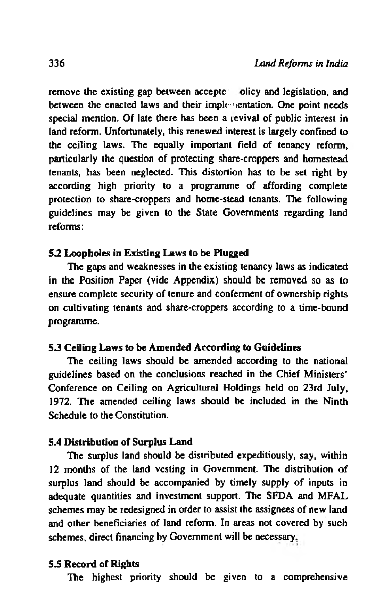

###### 336 Land Reforms in India

remove the existing gap between acceptc olicy and legislation, and between the enacted laws and their implementation. One point needs special mention. Of late there has been a levival of public interest in land reform. Unfortunately, this renewed interest is largely confined to the ceiling laws. The equally important field of tenancy reform, particularly the question of protecting share-croppers and homestead tenants, has been neglected. This distortion has to be set right by according high priority to a programme of affording complete protection to share-croppers and home-stead tenants. The following guidelines may be given to the State Governments regarding land reforms:

###### 5.2 Loopholes in Existing Laws to be Plugged

The gaps and weaknesses in the existing tenancy laws as indicated in the Position Paper (vide Appendix) should be removed so as to ensure complete security of tenure and conferment of ownership rights on cultivating tenants and share-croppers according to a time-bound programme.

###### 5 3 Ceiling Laws to be Amended According to Guidelines

The ceiling laws should be amended according to the national guidelines based on the conclusions reached in the Chief Ministers’ Conference on Ceiling on Agricultural Holdings held on 23rd July, 1972. The amended ceiling laws should be included in the Ninth Schedule to the Constitution.

- 5.4 Distribution of Surplus Land The surplus land should be distributed expeditiously, say, within

12 months of the land vesting in Government. The distribution of surplus land should be accompanied by timely supply of inputs in adequate quantities and investment support. The SFDA and MFAL schemes may be redesigned in order to assist the assignees of new land and other beneficiaries of land reform. In areas not covered by such schemes, direct financing by Government will be necessary.

- 5.5 Record of Rights The highest priority should be given to a comprehensive

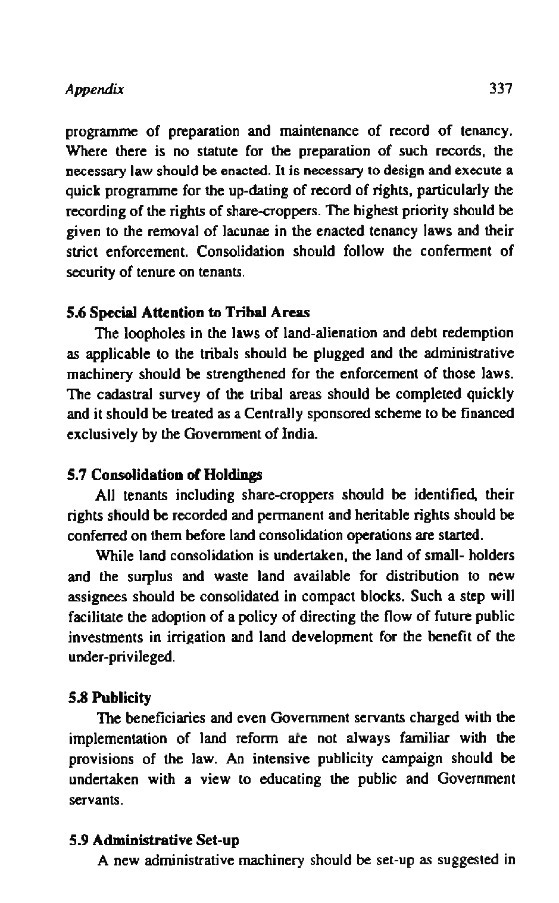

###### Appendix 337

programme of preparation and maintenance of record of tenancy. Where there is no statute for the preparation of such records, the necessary law should be enacted. It is necessary to design and execute a quick programme for the up-dating of record of rights, particularly the recording of the rights of share-croppers. The highest priority should be given to the removal of lacunae in the enacted tenancy laws and their strict enforcement. Consolidation should follow the conferment of security of tenure on tenants.

- 5.6 Special Attention to Tribal Areas The loopholes in the laws of land-alienation and debt redemption

as applicable to the tribals should be plugged and the administrative machinery should be strengthened for the enforcement of those laws. The cadastral survey of the tribal areas should be completed quickly and it should be treated as a Centrally sponsored scheme to be financed exclusively by the Government of India.

- 5.7 Consolidation of Holdings All tenants including share-croppers should be identified, their

rights should be recorded and permanent and heritable rights should be conferred on them before land consolidation operations are started.

While land consolidation is undertaken, the land of small- holders and the surplus and waste land available for distribution to new assignees should be consolidated in compact blocks. Such a step will facilitate the adoption of a policy of directing the flow of future public investments in irrigation and land development for the benefit of the under-privileged.

- 5.8 Publicity The beneficiaries and even Government servants charged with the

implementation of land reform are not always familiar with the provisions of the law. An intensive publicity campaign should be undertaken with a view to educating the public and Government servants.

- 5.9 Administrative Set-up A new administrative machinery should be set-up as suggested in

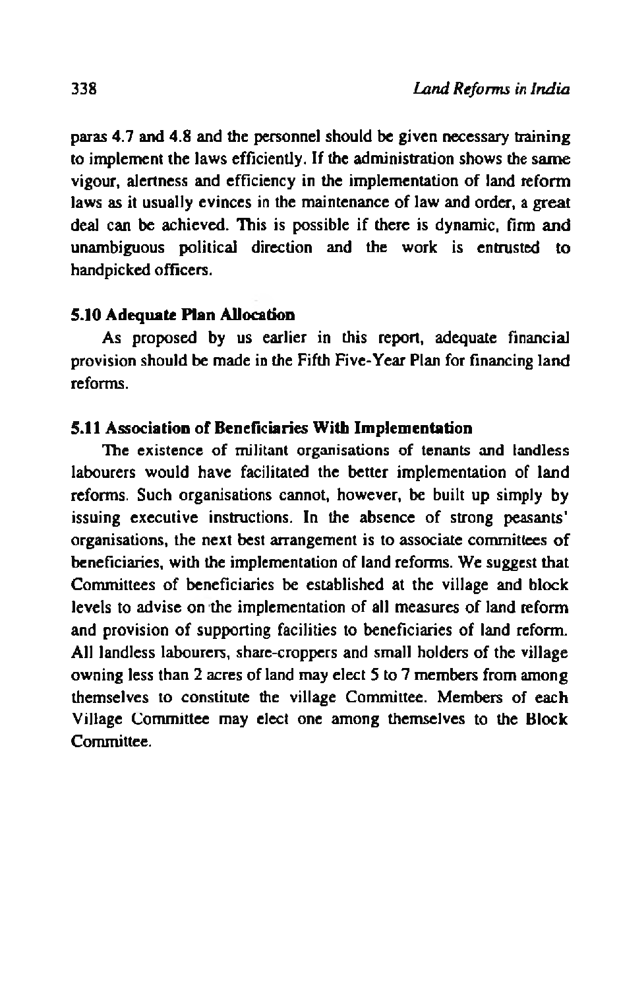

###### 338 Land Reforms in India

paras 4.7 and 4.8 and the personnel should be given necessary training to implement the laws efficiently. If the administration shows the same vigour, alertness and efficiency in the implementation of land reform laws as it usually evinces in the maintenance of law and order, a great deal can be achieved. This is possible if there is dynamic, firm and unambiguous political direction and the work is entrusted to handpicked officers.

- 5.10 Adequate Plan Allocation As proposed by us earlier in this report, adequate financial

provision should be made in the Fifth Five-Year Plan for financing land reforms.

- 5.11 Association of Beneficiaries With Implementation The existence of militant organisations of tenants and landless

labourers would have facilitated the better implementation of land reforms. Such organisations cannot, however, be built up simply by issuing executive instructions. In the absence of strong peasants’ organisations, the next best arrangement is to associate committees of beneficiaries, with the implementation of land reforms. We suggest that Committees of beneficiaries be established at the village and block levels to advise on the implementation of all measures of land reform and provision of supporting facilities to beneficiaries of land reform. All landless labourers, share-croppers and small holders of the village owning less than 2 acres of land may elect 5 to 7 members from among themselves to constitute the village Committee. Members of each Village Committee may elect one among themselves to the Block Committee.

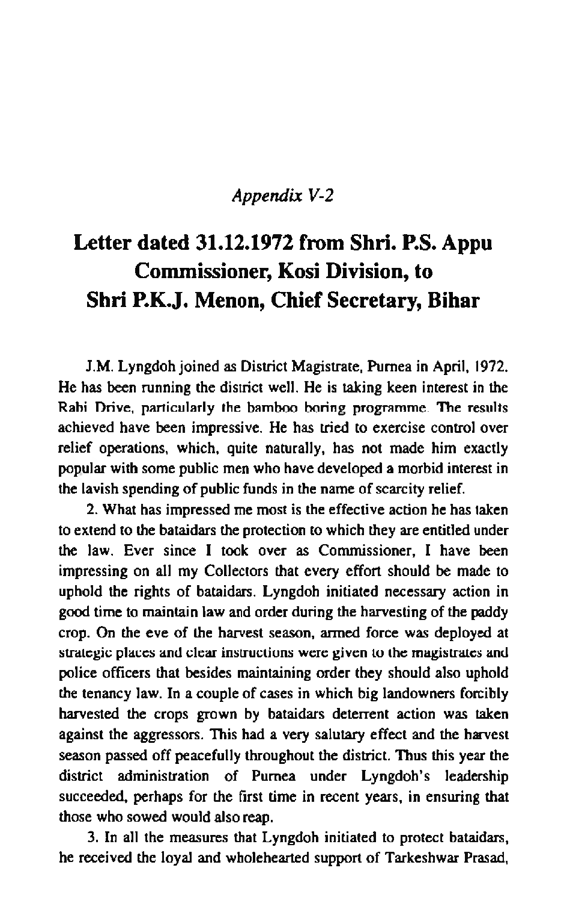

Appendix V-2

##### Letter dated 31.12.1972 from Shri. P.S. Appu Commissioner, Kosi Division, to Shri P.K.J. Menon, Chief Secretary, Bihar

J.M. Lyngdoh joined as District Magistrate, Pumea in April, 1972. He has been running the district well. He is taking keen interest in the Rahi Drive, particularly the bamboo boring programme. The results achieved have been impressive. He has tried to exercise control over relief operations, which, quite naturally, has not made him exactly popular with some public men who have developed a morbid interest in the lavish spending of public funds in the name of scarcity relief.

- 2. What has impressed me most is the effective action he has taken to extend to the bataidars the protection to which they are entitled under the law. Ever since I took over as Commissioner, I have been impressing on all my Collectors that every effort should be made to uphold the rights of bataidars. Lyngdoh initiated necessary action in good time to maintain law and order during the harvesting of the paddy crop. On the eve of the harvest season, armed force was deployed at strategic places and clear instructions were given to the magistrates and police officers that besides maintaining order they should also uphold the tenancy law. In a couple of cases in which big landowners forcibly harvested the crops grown by bataidars deterrent action was taken against the aggressors. This had a very salutary effect and the harvest season passed off peacefully throughout the district. Thus this year the district administration of Pumea under Lyngdoh’s leadership succeeded, perhaps for the first time in recent years, in ensuring that those who sowed would also reap.
- 3. In all the measures that Lyngdoh initiated to protect bataidars, he received the loyal and wholehearted support of Tarkeshwar Prasad,

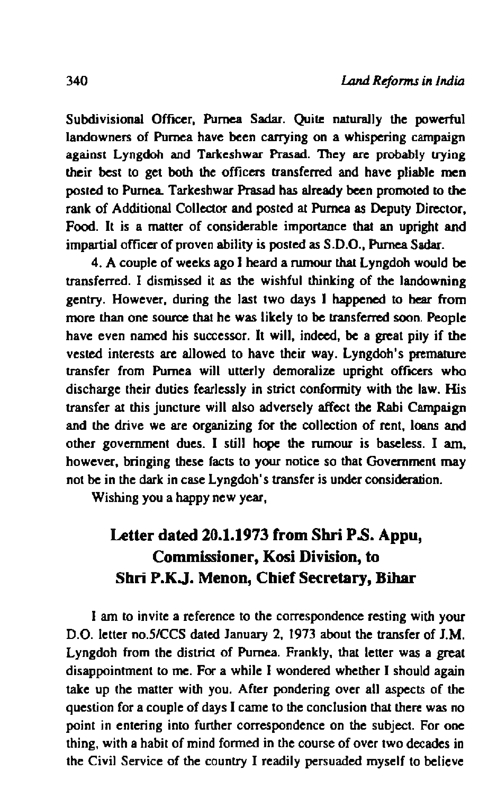

###### 340 Land Reforms in India

Subdivision^ Officer, Pumea Sadar. Quite naturally the powerful landowners of Pumea have been carrying on a whispering campaign against Lyngdoh and Tarkeshwar Prasad. They are probably trying their best to get both the officers transferred and have pliable men posted to Pumea. Tarkeshwar Prasad has already been promoted to the rank of Additional Collector and posted at Pumea as Deputy Director, Food. It is a matter of considerable importance that an upright and impartial officer of proven ability is posted as S.D.O., Pumea Sadar.

4. A couple of weeks ago I heard a rumour that Lyngdoh would be

transferred. I dismissed it as the wishful thinking of the landowning gentry. However, during the last two days I happened to hear from more than one source that he was likely to be transferred soon. People have even named his successor. It will, indeed, be a great pity if the vested interests are allowed to have their way. Lyngdoh’s premature transfer from Pumea will utterly demoralize upright officers who discharge their duties fearlessly in strict conformity with the law. His transfer at this juncture will also adversely affect the Rabi Campaign and the drive we are organizing for the collection of rent, loans and other government dues. I still hope the rumour is baseless. I am, however, bringing these facts to your notice so that Government may not be in the dark in case Lyngdoh’s transfer is under consideration.

Wishing you a happy new year,

###### Letter dated 20.1.1973 from Shri PJS. Appu, Commissioner, Kosi Division, to Shri P.K J . Menon, Chief Secretary, Bihar

I am to invite a reference to the correspondence resting with your D.O. letter no.5/CCS dated January 2, 1973 about the transfer of J.M. Lyngdoh from the district of Pumea. Frankly, that letter was a great disappointment to me. For a while I wondered whether I should again take up the matter with you. After pondering over all aspects of the question for a couple of days I came to the conclusion that there was no point in entering into further correspondence on the subject. For one thing, with a habit of mind formed in the course of over two decades in the Civil Service of the country I readily persuaded myself to believe

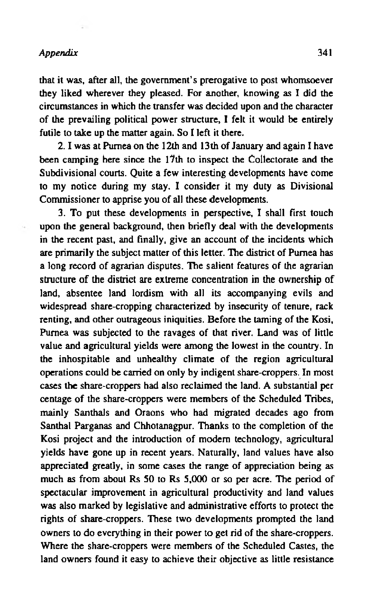

###### Appendix 341

that it was, after all, the government’s prerogative to post whomsoever they liked wherever they pleased. For another, knowing as I did the circumstances in which the transfer was decided upon and the character of the prevailing political power structure, I felt it would be entirely futile to take up the matter again. So I left it there.

- 2 .1 was at Pumea on the 12th and 13th of January and again I have

been camping here since the 17th to inspect the Collectorate and the Subdivisional courts. Quite a few interesting developments have come to my notice during my stay. I consider it my duty as Divisional Commissioner to apprise you of all these developments.

- 3. To put these developments in perspective, I shall first touch

upon the general background, then briefly deal with the developments in the recent past, and finally, give an account of the incidents which are primarily the subject matter of this letter. The district of Pumea has a long record of agrarian disputes. The salient features of the agrarian structure of the district are extreme concentration in the ownership of land, absentee land lordism with all its accompanying evils and widespread share-cropping characterized by insecurity of tenure, rack renting, and other outrageous iniquities. Before the taming of the Kosi, Pumea was subjected to the ravages of that river. Land was of little value and agricultural yields were among the lowest in the country. In the inhospitable and unhealthy climate of the region agricultural operations could be carried on only by indigent share-croppers. In most cases the share-croppers had also reclaimed the land. A substantial per centage of the share-croppers were members of the Scheduled Tribes, mainly Santhals and Oraons who had migrated decades ago from Santhal Parganas and Chhotanagpur. Thanks to the completion of the Kosi project and the introduction of modem technology, agricultural yields have gone up in recent years. Naturally, land values have also appreciated greatly, in some cases the range of appreciation being as much as from about Rs 50 to Rs 5,000 or so per acre. The period of spectacular improvement in agricultural productivity and land values was also marked by legislative and administrative efforts to protect the rights of share-croppers. These two developments prompted the land owners to do everything in their power to get rid of the share-croppers. Where the share-croppers were members of the Scheduled Castes, the land owners found it easy to achieve their objective as little resistance

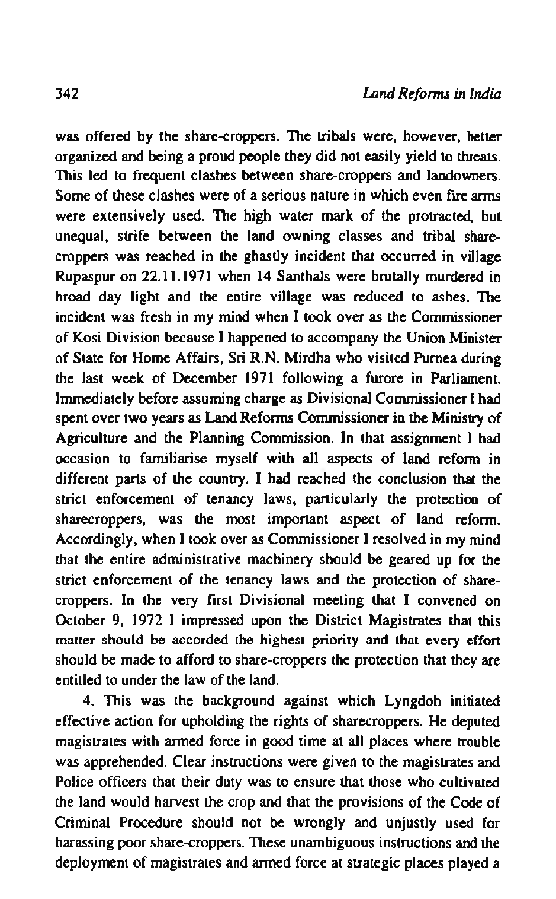

###### 342 Land Reforms in India

was offered by the share-croppers. The tribals were, however, better organized and being a proud people they did not easily yield to threats. This led to frequent clashes between share-croppers and landowners. Some of these clashes were of a serious nature in which even fire arms were extensively used. The high water mark of the protracted, but unequal, strife between the land owning classes and tribal sharecroppers was reached in the ghastly incident that occurred in village Rupaspur on 22.11.1971 when 14 Santhals were brutally murdered in broad day light and the entire village was reduced to ashes. The incident was fresh in my mind when I took over as the Commissioner of Kosi Division because I happened to accompany the Union Minister of State for Home Affairs, Sri R.N. Mirdha who visited Pumea during the last week of December 1971 following a furore in Parliament. Immediately before assuming charge as Divisional Commissioner I had spent over two years as Land Reforms Commissioner in the Ministry of Agriculture and the Planning Commission. In that assignment 1 had occasion to familiarise myself with all aspects of land reform in different parts of the country. I had reached the conclusion that the strict enforcement of tenancy laws, particularly the protection of sharecroppers, was the most important aspect of land reform. Accordingly, when I took over as Commissioner I resolved in my mind that the entire administrative machinery should be geared up for the strict enforcement of the tenancy laws and the protection of sharecroppers. In the very first Divisional meeting that I convened on October 9, 1972 I impressed upon the District Magistrates that this matter should be accorded the highest priority and that every effort should be made to afford to share-croppers the protection that they are entitled to under the law of the land.

4. This was the background against which Lyngdoh initiated

effective action for upholding the rights of sharecroppers. He deputed magistrates with armed force in good time at all places where trouble was apprehended. Clear instructions were given to the magistrates and Police officers that their duty was to ensure that those who cultivated the land would harvest the crop and that the provisions of the Code of Criminal Procedure should not be wrongly and unjustly used for harassing poor share-croppers. These unambiguous instructions and the deployment of magistrates and armed force at strategic places played a

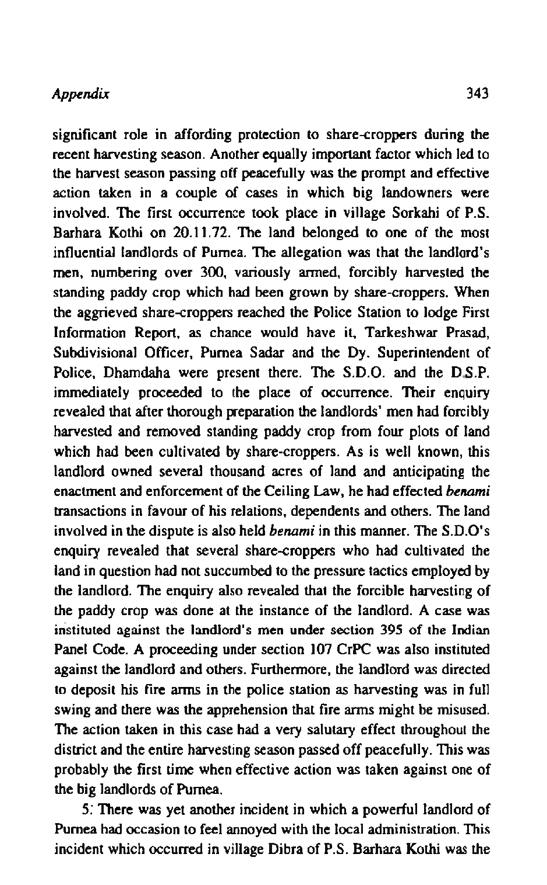

###### Appendix 343

significant role in affording protection to share-croppers during the recent harvesting season. Another equally important factor which led to the harvest season passing off peacefully was the prompt and effective action taken in a couple of cases in which big landowners were involved. The first occurrence took place in village Sorkahi of P.S. Barhara Kothi on 20.11.72. The land belonged to one of the most influential landlords of Pumea. The allegation was that the landlord’s men, numbering over 300, variously armed, forcibly harvested the standing paddy crop which had been grown by share-croppers. When the aggrieved share-croppers reached the Police Station to lodge First Information Report, as chance would have it, Tarkeshwar Prasad, Subdivisional Officer, Pumea Sadar and the Dy. Superintendent of Police, Dhamdaha were present there. The S.D.O. and the D S.P. immediately proceeded to the place of occurrence. Their enquiry revealed that after thorough preparation the landlords’ men had forcibly harvested and removed standing paddy crop from four plots of land which had been cultivated by share-croppers. As is well known, this landlord owned several thousand acres of land and anticipating the enactment and enforcement of the Ceiling Law, he had effected benami transactions in favour of his relations, dependents and others. The land involved in the dispute is also held benami in this manner. The S.D.O’s enquiry revealed that several share-croppers who had cultivated the land in question had not succumbed to the pressure tactics employed by the landlord. The enquiry also revealed that the forcible harvesting of the paddy crop was done at the instance of the landlord. A case was instituted against the landlord’s men under section 395 of the Indian Panel Code. A proceeding under section 107 CrPC was also instituted against the landlord and others. Furthermore, the landlord was directed to deposit his fire arms in the police station as harvesting was in full swing and there was the apprehension that fire arms might be misused. The action taken in this case had a very salutary effect throughout the district and the entire harvesting season passed off peacefully. This was probably the first time when effective action was taken against one of the big landlords of Pumea.

5.' There was yet another incident in which a powerful landlord of Pumea had occasion to feel annoyed with the local administration. This incident which occurred in village Dibra of P.S. Barhara Kothi was the

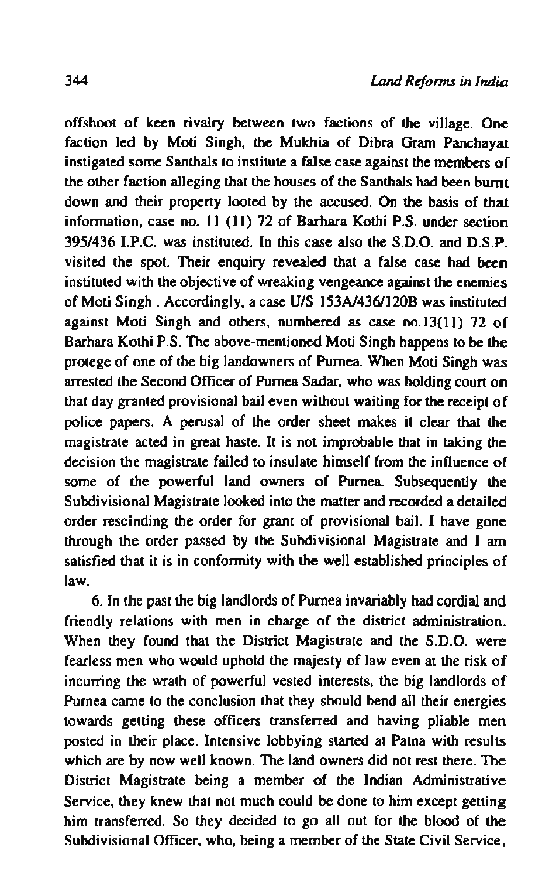

###### 344 Land Reforms in India

offshoot of keen rivalry between two factions of the village. One faction led by Moti Singh, the Mukhia of Dibra Gram Panchayat instigated some Santhals to institute a false case against the members of the other faction alleging that the houses of the Santhals had been burnt down and their property looted by the accused. On the basis of that information, case no. 11 (11) 72 of Barhara Kothi P.S. under section 395/436 I.P.C. was instituted. In this case also the S.D.O. and D.S.P. visited the spot. Their enquiry revealed that a false case had been instituted with the objective of wreaking vengeance against the enemies of Moti Singh . Accordingly, a case U/S 153A/436/120B was instituted against Moti Singh and others, numbered as case no. 13(11) 72 of Barhara Kothi P.S. The above-mentioned Moti Singh happens to be the protege of one of the big landowners of Pumea. When Moti Singh was arrested the Second Officer of Pumea Sadar, who was holding court on that day granted provisional bail even without waiting for the receipt of police papers. A perusal of the order sheet makes it clear that the magistrate acted in great haste. It is not improbable that in taking the decision the magistrate failed to insulate himself from the influence of some of the powerful land owners of Pumea. Subsequently the Subdivisional Magistrate looked into the matter and recorded a detailed order rescinding the order for grant of provisional bail. I have gone through the order passed by the Subdivisional Magistrate and I am satisfied that it is in conformity with the well established principles of law.

6. In the past the big landlords of Pumea invariably had cordial and

friendly relations with men in charge of the district administration. When they found that the District Magistrate and the S.D.O. were fearless men who would uphold the majesty of law even at the risk of incurring the wrath of powerful vested interests, the big landlords of Purnea came to the conclusion that they should bend all their energies towards getting these officers transferred and having pliable men posted in their place. Intensive lobbying started at Patna with results which are by now well known. The land owners did not rest there. The District Magistrate being a member of the Indian Administrative Service, they knew that not much could be done to him except getting him transferred. So they decided to go all out for the blood of the Subdivisional Officer, who, being a member of the State Civil Service,

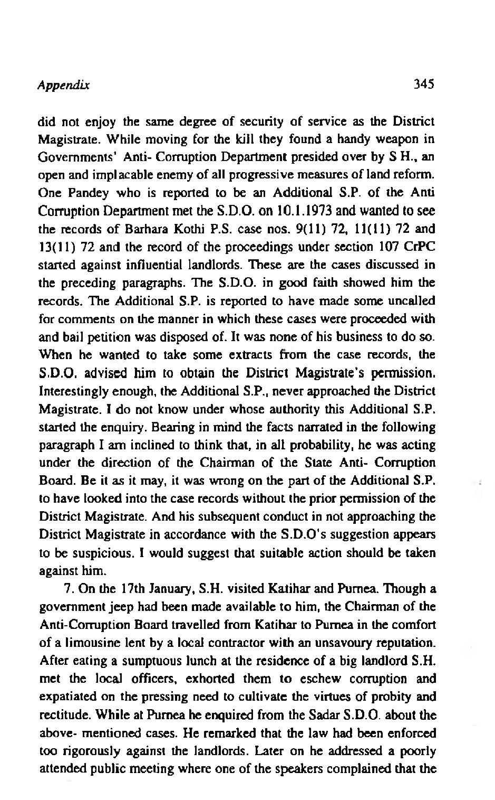

###### Appendix 345

did not enjoy the same degree of security of service as the District Magistrate. While moving for the kill they found a handy weapon in Governments’ Anti- Corruption Department presided over by S H., an open and implacable enemy of all progressive measures of land reform. One Pandey who is reported to be an Additional S.P. of the Anti Corruption Department met the S.D.O. on 10.1.1973 and wanted to see the records of Barhara Kothi P.S. case nos. 9(11) 72, 11(11) 72 and 13(11) 72 and the record of the proceedings under section 107 CrPC started against influential landlords. These are the cases discussed in the preceding paragraphs. The S.D.O. in good faith showed him the records. The Additional S.P. is reported to have made some uncalled for comments on the manner in which these cases were proceeded with and bail petition was disposed of. It was none of his business to do so. When he wanted to take some extracts from the case records, the S.D.O. advised him to obtain the District Magistrate’s permission. Interestingly enough, the Additional S.P., never approached the District Magistrate. I do not know under whose authority this Additional S.P. started the enquiry. Bearing in mind the facts narrated in the following paragraph I am inclined to think that, in all probability, he was acting under the direction of the Chairman of the State Anti- Corruption Board. Be it as it may, it was wrong on the part of the Additional S.P. to have looked into the case records without the prior permission of the District Magistrate. And his subsequent conduct in not approaching the District Magistrate in accordance with the S.D.O’s suggestion appears to be suspicious. I would suggest that suitable action should be taken against him.

7. On the 17th January, S.H. visited Katihar and Pumea. Though a

government jeep had been made available to him, the Chairman of the Anti-Corruption Board travelled from Katihar to Pumea in the comfort of a limousine lent by a local contractor with an unsavoury reputation. After eating a sumptuous lunch at the residence of a big landlord S.H. met the local officers, exhorted them to eschew corruption and expatiated on the pressing need to cultivate the virtues of probity and rectitude. While at Pumea he enquired from the Sadar S.D.O. about the above- mentioned cases. He remarked that the law had been enforced too rigorously against the landlords. Later on he addressed a poorly attended public meeting where one of the speakers complained that the

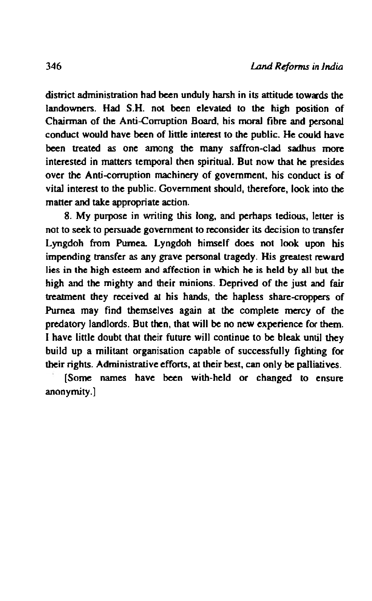

###### 346 Land Reforms in India

district administration had been unduly harsh in its attitude towards the landowners. Had S.H. not been elevated to the high position of Chairman of the Anti-Corruption Board, his moral fibre and personal conduct would have been of little interest to the public. He could have been treated as one among the many saffron-clad sadhus more interested in matters temporal then spiritual. But now that he presides over the Anti-corruption machinery of government, his conduct is of vital interest to the public. Government should, therefore, look into the matter and take appropriate action.

8. My purpose in writing this long, and perhaps tedious, letter is

not to seek to persuade government to reconsider its decision to transfer Lyngdoh from Pumea. Lyngdoh himself does not look upon his impending transfer as any grave personal tragedy. His greatest reward lies in the high esteem and affection in which he is held by all but the high and the mighty and their minions. Deprived of the just and fair treatment they received at his hands, the hapless share-croppers of Pumea may find themselves again at the complete mercy of the predatory landlords. But then, that will be no new experience for them. 1 have little doubt that their future will continue to be bleak until they build up a militant organisation capable of successfully fighting for their rights. Administrative efforts, at their best, can only be palliatives.

[Some names have been with-held or changed to ensure anonymity.]

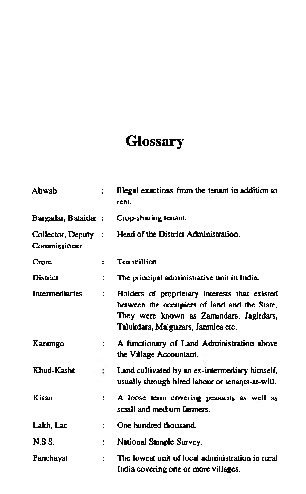

### Glossary

Illegal exactions from the tenant in addition to rent

Abwab :

Crop-sharing tenant. Head of the District Administration.

Bargadar, Bataidar :

Collector, Deputy : Commissioner

Crore : District : Intermediaries :

Ten million The principal administrative unit in India

Holders of proprietary interests that existed between the occupiers of land and the State. They were known as Zamindars, Jagirdars, Talukdars, Malguzars, Janmies etc.

Kanungo :

A functionary of Land Administration above the Village Accountant.

Khud-Kasht

Land cultivated by an ex-intermediary himself, usually through hired labour or tenaijts-at-will.

A loose term covering peasants as well as small and medium farmers.

Kisan :

One hundred thousand. National Sample Survey. The lowest unit of local administration in rural India covering one or more villages.

Lakh, Lac

N.S.S. Panchayat

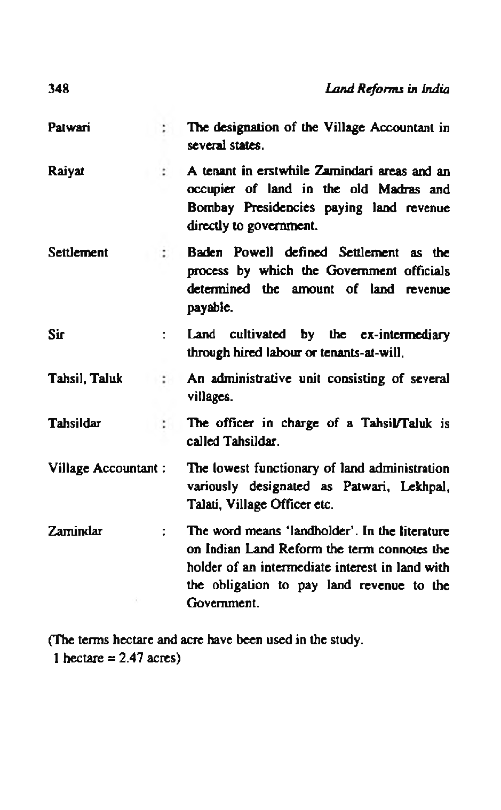

###### 348 Land Reforms in India

Patwari

The designation of the Village Accountant in several states.

Raiyat

A tenant in erstwhile Zamindari areas and an occupier of land in the old Madras and Bombay Presidencies paying land revenue directly to government

Settlement

Baden Powell defined Settlement as the process by which the Government officials determined the amount of land revenue payable.

Land cultivated by the ex-intermediary through hired labour or tenants-at-will.

Sir :

Tahsil, Taluk

An administrative unit consisting of several villages.

Tahsildar

The officer in charge of a Tahsil/Taluk is called Tahsildar.

Village Accountant:

The lowest functionary of land administration variously designated as Patwari, Lekhpal, Talati, Village Officer etc.

Zamindar :

The word means ‘landholder’. In the literature on Indian Land Reform the term connotes the holder of an intermediate interest in land with the obligation to pay land revenue to the Government.

(The terms hectare and acre have been used in the study. 1 hectare = 2.47 acres)

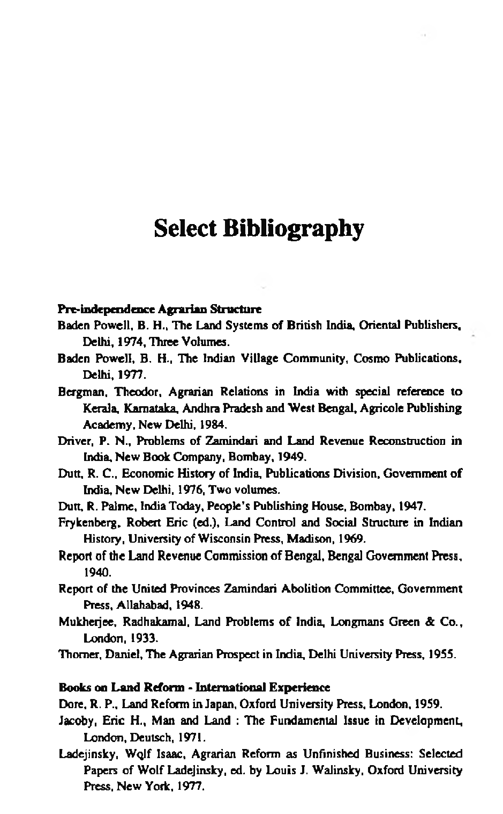

### Select Bibliography

###### Pre-independence Agrarian Structure

Baden Powell, B. H., The Land Systems of British India, Oriental Publishers, Delhi, 1974, Three Volumes. Baden Powell, B. H., The Indian Village Community, Cosmo Publications, Delhi, 1977.

Bergman, Theodor, Agrarian Relations in India with special reference to Kerala, Karnataka, Andhra Pradesh and West Bengal, Agricole Publishing Academy, New Delhi, 1984.

Driver, P. N., Problems of Zamindari and Land Revenue Reconstruction in India, New Book Company, Bombay, 1949. Dutt, R. C., Economic History of India, Publications Division, Government of

India, New Delhi, 1976, Two volumes. Dutt, R. Palme, India Today, People’s Publishing House, Bombay, 1947. Frykenberg, Robert Eric (ed.), Land Control and Social Structure in Indian

History, University of Wisconsin Press, Madison, 1969.

###### Report of the Land Revenue Commission of Bengal, Bengal Government Press,

1940. Report of the United Provinces Zamindari Abolition Committee, Government Press, Allahabad, 1948. Mukheijee, Radhakamal, Land Problems of India, Longmans Green & Co., London, 1933. Thomer, Daniel, The Agrarian Prospect in India, Delhi University Press, 1955.

###### Books on Land Reform - International Experience

Dore, R. P., Land Reform in Japan, Oxford University Press, London, 1959.

###### Jacoby, Eric H., Man and Land : The Fundamental Issue in Development,

London, Deutsch, 1971.

Ladejinsky, Wqlf Isaac, Agrarian Reform as Unfinished Business: Selected Papers of Wolf Ladejinsky, ed. by Louis J. Walinsky, Oxford University Press, New York, 1977.

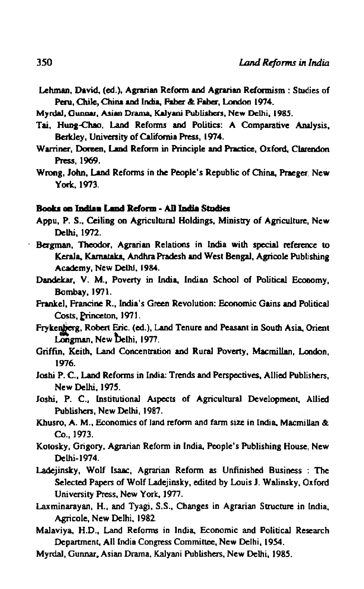

###### 350 Land Reforms in India

Lehman, David, (ed.). Agrarian Reform and Agrarian Reformism : Studies of Peru, Chile, China and India, Faber & Faber, London 1974.

M yrdal, G unoar, A sian D ram a, Kalyani Publishers, N ew Delhi, 1985.

Tai, Hung-Chao, Land Reforms and Politics: A Comparative Analysis, Berkley, University of California Press, 1974. Warriner, Doreen, Land Reform in Principle and Practice, Oxford, Clarendon Press, 1969. Wrong, John, Land Reforms in the People’s Republic of China, Praeger, New York, 1973.

###### Books on Indian Land Reform - All India Studies

Appu, P. S., Ceiling on Agricultural Holdings, Ministry of Agriculture, New Delhi. 1972.

• Bergman, Theodor, Agrarian Relations in India with special reference to Kerala, Karnataka, Andhra Pradesh and West Bengal, Agricole Publishing Academy, New Delhi, 1984.

Dandekar, V. M., Poverty in India, Indian School of Political Economy, Bombay, 1971. Frankel, Francine R., India’s Green Revolution: Economic Gains and Political Costs, frinceton, 1971. Frykenjjprg. Robert Eric, (ed.), Land Tenure and Peasant in South Asia, Orient Longman, Newbelhi, 1977. Griffin, Keith, Land Concentration and Rural Poverty, Macmillan, London, 1976. Joshi P. C., Land Reforms in India: Trends and Perspectives, Allied Publishers, New Delhi, 1975. Joshi, P. C., Institutional Aspects of Agricultural Development, Allied Publishers, New Delhi, 1987. Khusro, A. M., Economics of land reform and farm size in India, Macmillan & Co., 1973. Kotosky, Grigory, Agrarian Reform in India, People’s Publishing House, New Delhi-1974.

Ladejinsky, Wolf Isaac, Agrarian Reform as Unfinished Business : The Selected Papers of Wolf Ladejinsky, edited by Louis J. Walinsky, Oxford University Press, New York, 1977.

Laxminarayan, H., and Tyagi, S.S., Changes in Agrarian Structure in India, Agricole, New Delhi, 1982. Malaviya, H.D., Land Reforms in India, Economic and Political Research Department, All India Congress Committee, New Delhi, 1954. Myrdal, Gunnar,. Asian Drama, Kalyani Publishers, New Delhi, 1985.

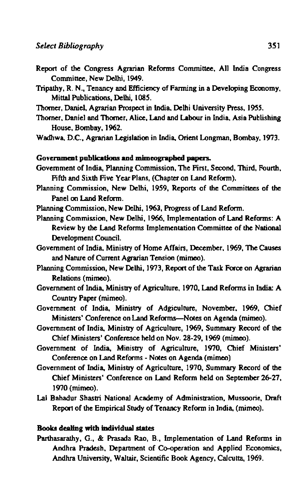

###### Select Bibliography 351

Report of the Congress Agrarian Reforms Committee, All India Congress Committee, New Delhi, 1949. Tripathy, R. N., Tenancy and Efficiency of Farming in a Developing Economy,

Mittal Publications, Delhi, 1085. Thomer, Daniel, Agrarian Prospect in India, Delhi University Press, 1955. Thomer, Daniel and Thomer, Alice, Land and Labour in India, Asia Publishing

House, Bombay, 1962. Wadhwa, D.C., Agrarian Legislation in India, Orient Longman, Bombay, 1973.

###### Government publications and mimeographed papers.

Government of India, Planning Commission, The First, Second, Third, Fourth, Fifth and Sixth Five Year Plans, (Chapter on Land Reform). Planning Commission, New Delhi, 1959, Reports of the Committees of the

Panel on Land Reform. Planning Commission, New Delhi, 1963, Progress of Land Reform. Planning Commission, New Delhi, 1966, Implementation of Land Reforms: A

Review by the Land Reforms Implementation Committee of the National Development Council.

Government of India, Ministry of Home Affairs, December, 1969, The Causes and Nature of Current Agrarian Tension (mimeo). Planning Commission, New Delhi, 1973, Report of the Task Force on Agrarian Relations (mimeo). Government of India, Ministry of Agriculture, 1970, Land Reforms in India: A Country Paper (mimeo).

Government of India, Ministry of Adgiculture, November, 1969, Chief Ministers’ Conference on Land Reforms—Notes on Agenda (mimeo).

- Government of India, Ministry of Agriculture, 1969, Summary Record of the Chief Ministers’ Conference held on Nov. 28-29,1969 (mimeo).
- Government of India, Ministry of Agriculture, 1970, Chief Ministers* Conference on Land Reforms - Notes on Agenda (mimeo)

Government of India, Ministry of Agriculture, 1970, Summary Record of the Chief Ministers’ Conference on Land Reform held on September 26-27, 1970 (mimeo).

Lai Bahadur Shastri National Academy of Administration, Mussoorie, Draft Report of the Empirical Study of Tenancy Reform in India, (mimeo).

###### Books dealing with individual states

Parthasarathy, G., & Prasada Rao, B., Implementation of Land Reforms in Andhra Pradesh, Department of Co-operation and Applied Economics, Andhra University, Waltair, Scientific Book Agency, Calcutta, 1969.

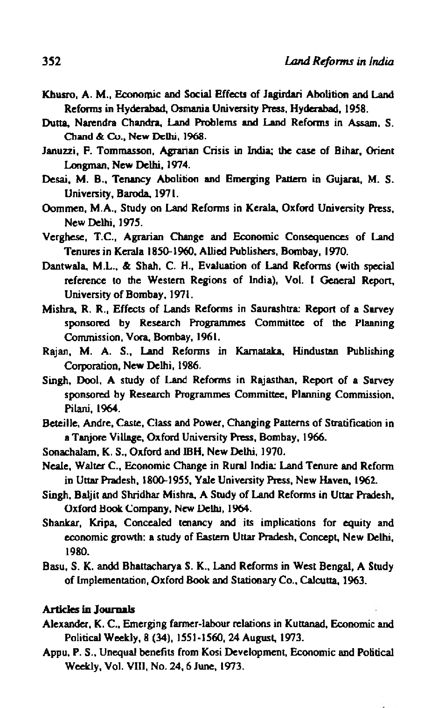

###### 352 Land Reforms in India

Khusro, A. M., Economic and Social Effects of Jagirdari Abolition and Land Reforms in Hyderabad, Osmania University Press, Hyderabad, 1958. Dutta, Narendra Chandra, Land Problems and Land Reforms in Assam, S.

Chand & Co., New Delhi, 1968. Januzzi, F. Tommasson, Agrarian Crisis in India; the case of Bihar, Orient Longman, New Delhi, 1974. Desai, M. B., Tenancy Abolition and Emerging Pattern in Gujarat, M. S. University, Baroda, 1971. Oommen, M.A., Study on Land Reforms in Kerala, Oxford University Press, New Delhi, 1975. Verghese, T.C., Agrarian Change and Economic Consequences of Land Tenures in Kerala 1850-1960, Allied Publishers, Bombay, 1970.

Dantwala, M.L., & Shah, C. H., Evaluation of Land Reforms (with special reference to the Western Regions of India), Vol. I General Report, University of Bombay, 1971.

Mishra, R. R., Effects of Lands Reforms in Saurashtra: Report of a Survey sponsored by Research Programmes Committee of the Planning Commission, Vora, Bombay, 1961.

Rajan, M. A. S., Land Reforms in Karnataka, Hindustan Publishing Corporation, New Delhi, 1986.

Singh, Dool, A study of Land Reforms in Rajasthan, Report of a Survey sponsored by Research Programmes Committee, Planning Commission, Pilani, 1964.

Beteille, Andre, Caste, Class and Power, Changing Patterns of Stratification in

a Tanjore Village, Oxford University Press, Bombay, 1966. Sonachalam, K. S., Oxford and IBH, New Delhi, 1970. Neale, Walter C., Economic Change in Rural India; Land Tenure and Reform

in Uttar Pradesh, 1800-1955, Yale University Press, New Haven, 1962. Singh, Baljit and Shridhar Mishra, A Study of Land Reforms in Uttar Pradesh, Oxford Book Company, New Delhi, 1964.

Shankar, Kripa, Concealed tenancy and its implications for equity and economic growth: a study of Eastern Uttar Pradesh, Concept, New Delhi, 1980.

Basu, S. K. andd Bhattacharya S. K., Land Reforms in West Bengal, A Study of Implementation, Oxford Book and Stationary Co., Calcutta, 1963.

###### Articles in Journals

Alexander, K. C., Emerging farmer-labour relations in Kuttanad, Economic and Political Weekly, 8 (34), 1551-1560, 24 August, 1973. Appu, P. S., Unequal benefits from Kosi Development, Economic and Political Weekly, Vol. VIU, No. 24,6 June, 1973.

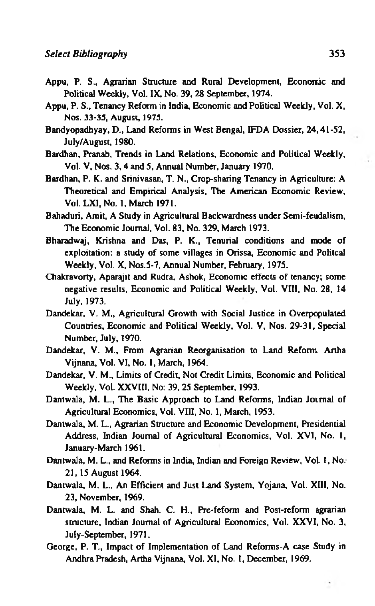

###### Select Bibliography 353

Appu, P. S., Agrarian Structure and Rural Development* Economic and Political Weekly, Vol. IX No. 39,28 September, 1974. Appu, P. S., Tenancy Reform in India, Economic and Political Weekly, Vol. X, Nos. 33-35, August, 1973. Bandyopadhyay, D., Land Reforms in West Bengal, IFDA Dossier, 24,41-52, July/August, 1980. Bardhan, Pranab, Trends in Land Relations, Economic and Political Weekly, Vol. V, Nos. 3,4 and 5, Annual Number, January 1970.

Bardhan, P. K. and Srinivasan, T. N., Crop-sharing Tenancy in Agriculture: A Theoretical and Empirical Analysis, The American Economic Review, Vol.LXI, No. 1, March 1971.

Bahaduri, Amit, A Study in Agricultural Backwardness under Semi-feudalism, The Economic Journal, Vol. 83, No. 329, March 1973.

Bharadwaj, Krishna and Das, P. K , Tenurial conditions and mode of exploitation: a study of some villages in Orissa, Economic and Politcal Weekly, Vol. X, Nos.5-7, Annual Number, February, 1975.

Chakravorty, Aparajit and Rudra, Ashok, Economic effects of tenancy; some negative results, Economic and Political Weekly, Vol. VIII, No. 28, 14 July, 1973.

Dandekar, V. M.t Agricultural Growth with Social Justice in Overpopulated Countries, Economic and Political Weekly, Vol. V, Nos. 29-31, Special Number, July, 1970.

Dandekar, V. M., From Agrarian Reorganisation to Land Reform, Artha Vijnana, Vol. VI, No. 1, March, 1964. Dandekar, V. M., Limits of Credit, Not Credit Limits, Economic and Political Weekly, Vol. XXVIII, No: 39, 25 September, 1993. Dantwala, M. L., The Basic Approach to Land Reforms, Indian Journal of Agricultural Economics, Vol. VIII, No. 1, March, 1953.

Dantwala, M. L., Agrarian Structure and Economic Development, Presidential Address, Indian Journal of Agricultural Economics, Vol. XVI, No. 1, January-March 1961.

Dantwala, M. L., and Reforms in India, Indian and Foreign Review, Vol. 1, No.21,15 August 1964. Dantwala, M. L., An Efficient and Just Land System, Yojana, Vol. XIII, No. 23, November, 1969.

Dantwala, M. L. and Shah, C. H., Pre-feform and Post-reform agrarian structure, Indian Journal of Agricultural Economics, Vol. XXVI, No. 3, July-September, 1971.

George, P. T., Impact of Implementation of Land Reforms-A case Study in Andhra Pradesh, Artha Vijnana, Vol. XI, No. 1, December, 1969.

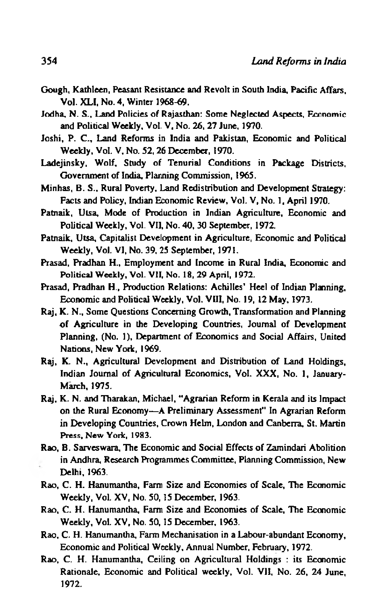

###### 354 Land Reforms in India

Gough, Kathleen, Peasant Resistance and Revolt in South India, Pacific Affars, Vol. XU, No. 4, Winter 1968-69. Jodha, N. S., Land Policies of Rajasthan: Some Neglected Aspect«, Economic and Political Weekly, Vol. V, No. 26,27 June, 1970. Joshi, P. C., Land Reforms in India and Pakistan, Economic and Political Weekly, Vol. V, No. 52,26 December, 1970. Ladejinsky, Wolf, Study of Tenurial Conditions in Package Districts, Government of India, Planning Commission, 1965.

Minhas, B. S., Rural Poverty, Land Redistribution and Development Strategy: Facts and Policy, Indian Economic Review, Vol. V, No. 1, April 1970. Patnaik, Utsa, Mode of Production in Indian Agriculture, Economic and

Political Weekly, Vol. VII, No. 40, 30 September, 1972. Patnaik, Utsa, Capitalist Development in Agriculture, Economic and Political Weekly, Vol. VI, No. 39, 25 September, 1971. Prasad, Pradhan H., Employment and Income in Rural India, Economic and Political Weekly, Vol. VII, No. 18, 29 April, 1972. Prasad, Pradhan H., Production Relations: Achilles’ Heel of Indian Planning, Economic and Political Weekly, Vol. VIII, No. 19, 12 May, 1973.

Raj, K. N., Some Questions Concerning Growth, Transformation and Planning of Agriculture in the Developing Countries, Journal of Development Planning, (No. 1), Department of Economics and Social Affairs, United Nations, New York, 1969.

Raj, K. N., Agricultural Development and Distribution of Land Holdings, Indian Journal of Agricultural Economics, Vol. XXX, No. 1, JanuaryMarch, 1975.

Raj, K. N. and Tharakan, Michael, “Agrarian Reform in Kerala and its Impact on the Rural Economy—A Preliminary Assessment” In Agrarian Reform in Developing Countries, Crown Helm, London and Canberra, St. Martin Press, New York, 1983.

- Rao, B. Sarveswara, The Economic and Social Effects of Zamindari Abolition in Andhra, Research Programmes Committee, Planning Commission, New Delhi, 1963.
- Rao, C. H. Hanumantha, Farm Size and Economies of Scale, The Economic Weekly, Vol. XV, No. 50,15 December, 1963.

Rao, C. H. Hanumantha, Farm Size and Economies of Scale, The Economic Weekly, Vol. XV, No. 50,15 December, 1963. Rao, C. H. Hanumantha, Farm Mechanisation in a Labour-abundant Economy, Economic and Political Weekly, Annual Number, February, 1972.

Rao, C. H. Hanumantha, Ceiling on Agricultural Holdings : its Economic Rationale, Economic and Political weekly. Vol. VII, No. 26, 24 June, 1972.

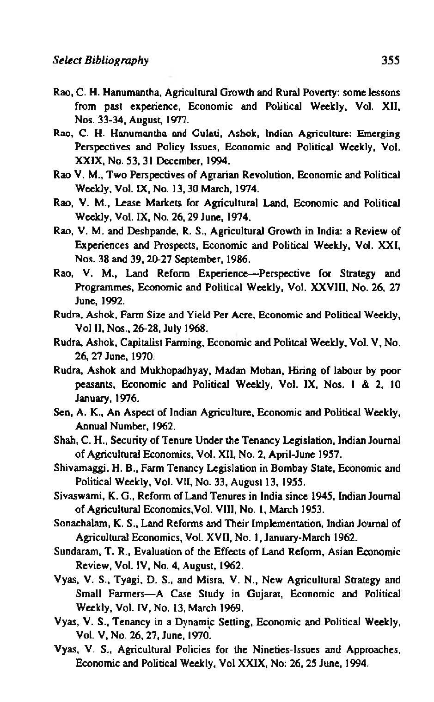

###### Select Bibliography 355

Rao, C. H. Hanumantha, Agricultural Growth and Rural Poverty: some lessons from past experience, Economic and Political Weekly, Vol. XII, Nos. 33-34, August, 1977.

Rao, C. H. Hanumantha and Gulati, Ashok, Indian Agriculture: Emerging Perspectives and Policy Issues, Economic and Political Weekly, Vol. XXIX, No. 53, 31 December, 1994.

Rao V. M., Two Perspectives of Agrarian Revolution, Economic and Political Weekly, Vol. DC, No. 13,30 March, 1974. Rao, V. M., Lease Markets for Agricultural Land, Economic and Political Weekly, Vol. IX, No. 26,29 June, 1974.

Rao, V. M. and Deshpande, R. S., Agricultural Growth in India: a Review of Experiences and Prospects, Economic and Political Weekly, Vol. XXI, Nos. 38 and 39,20-27 September, 1986.

Rao, V. M., Land Reform Experience—Perspective for Strategy and Programmes, Economic and Political Weekly, Vol. XXVIII, No. 26, 27 June, 1992.

Rudra, Ashok, Farm Size and Yield Per Acre, Economic and Political Weekly, Vol II, Nos., 26-28, July 1968. Rudra, Ashok, Capitalist Farming, Economic and Politcal Weekly, Vol. V, No. 26, 27 June, 1970.

Rudra, Ashok and Mukhopadhyay, Madan Mohan, Hiring of labour by poor peasants, Economic and Political Weekly, Vol. IX, Nos. 1 & 2, 10 January, 1976.

Sen, A. K., An Aspect of Indian Agriculture, Economic and Political Weekly, Annual Number, 1962. Shah, C. H., Security of Tenure Under the Tenancy Legislation, Indian Journal of Agricultural Economics, Vol. XII, No. 2, April-June 1957. Shivamaggi, H. B., Farm Tenancy Legislation in Bombay State, Economic and Political Weekly, Vol. VII, No. 33, August 13,1955. Sivaswami, K. G., Reform of Land Tenures in India since 1945, Indian Journal of Agricultural Economics,Vol. VIII, No. 1, March 1953. Sonachalam, K. S., Land Reforms and Their Implementation, Indian Journal of Agricultural Economics, Vol. XVII, No. 1, January-March 1962. Sundaram, T. R., Evaluation of the Effects of Land Reform, Asian Economic Review, Vol. IV, No. 4, August, 1962.

Vyas, V. S., Tyagi, D. S., and Misra, V. N., New Agricultural Strategy and Small Farmers—A Case Study in Gujarat, Economic and Political Weekly, Vol. IV, No. 13, March 1969.

Vyas, V. S., Tenancy in a Dynamic Setting, Economic and Political Weekly, Vol. V, No. 26, 27, June,' 197o'. Vyas, V. S., Agricultural Policies for the Nineties-Issues and Approaches, Economic and Political Weekly, Vol XXIX, No: 26, 25 June, 1994.

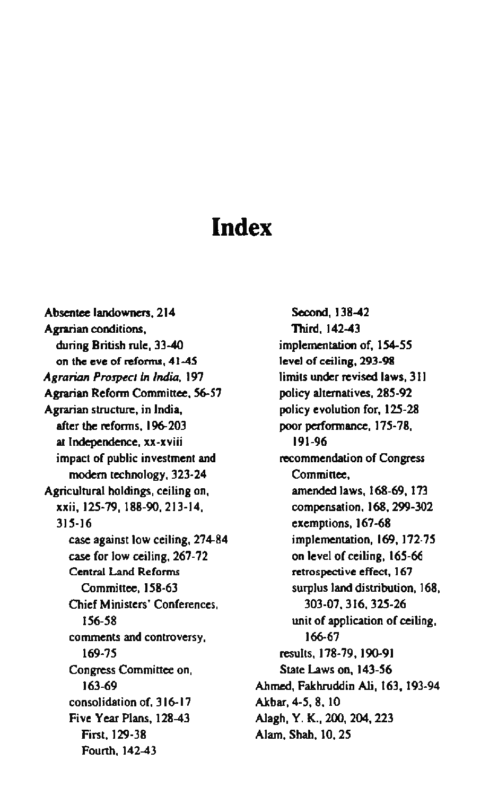

### Index

Second, 138-42 Third. 142-43

Absentee landowners, 214 Agrarian conditions,

during British rule, 33-40 on the eve of reforms, 41-45

implementation of, 154-55 level of ceiling, 293-98 limits under revised laws, 311 policy alternatives, 285-92 policy evolution for, 125-28 poor performance, 175-78,

Agrarian Prospect in India, 197 Agrarian Reform Committee, 56-57 Agrarian structure, in India,

after the reforms, 196-203 at Independence, xx-xviii impact of public investment and modem technology, 323-24

191-96

recommendation of Congress Committee, amended laws, 168-69,173 compensation, 168,299-302 exemptions, 167-68 implementation, 169,172-75 on level of ceiling, 165-66 retrospective effect, 167 surplus land distribution, 168,

Agricultural holdings, ceiling on, xxii, 125-79,188-90,213-14, 315-16

case against low ceiling, 274-84 case for low ceiling, 267-72 Central Land Reforms

Committee, 158-63 Chief Ministers’ Conferences, 156-58 comments and controversy, 169-75 Congress Committee on, 163-69

303-07, 316, 325-26 unit of application of ceiling, 166-67

results, 178-79,190-91 State Laws on, 143-56

Ahmed, Fakhruddin Ali, 163,193-94 Akbar, 4-5, 8,10 Alagh, Y. K., 200, 204, 223 Alam, Shah, 10,25

consolidation of, 316-17 Five Year Plans, 128-43

First, 129-38 Fourth, 142-43

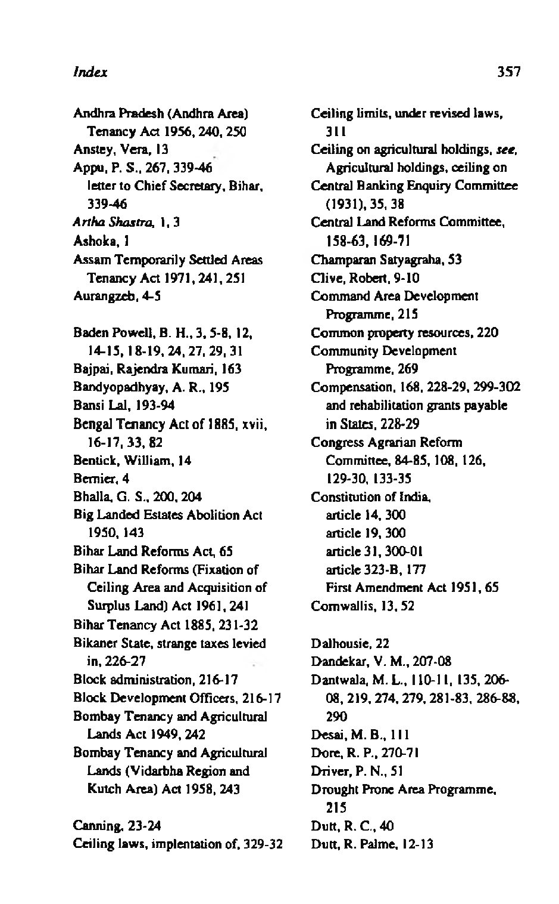

###### Index 357

Ceiling limits, under revised laws, 311

Andhra Pradesh (Andhra Area)

Tenancy Act 1956,240,250 Anstey, Vera, 13 Appu, P. S., 267,339-46

Ceiling on agricultural holdings, see. Agricultural holdings, ceiling on Central Banking Enquiry Committee

letter to Chief Secretary, Bihar, 339-46

(1931), 35,38 Central Land Reforms Committee,

Artha Shastra, 1, 3 Ashoka, 1 Assam Temporarily Settled Areas

158-63,169-71 Champaran Satyagraha, 53 Clive, Robert, 9-10 Command Area Development

Tenancy Act 1971,241,251 Aurangzeb, 4-5

Programme, 215 Common property resources, 220 Community Development

Baden Powell, B. H., 3,5-8, 12, 14-15,18-19, 24,27,29,31 Bajpai, Rajendra Kumari, 163 Bandyopadhyay, A. R., 195 Bansi Lai, 193-94 Bengal Tcnancy Act of 1885, xvii,

Programme, 269

Compensation, 168,228-29, 299-302 and rehabilitation grants payable in States, 228*29

16-17,33, 82 Bentick, William, 14 Bernier, 4 Bhalla, G. S., 200, 204 Big Landed Estates Abolition Act

Congress Agrarian Reform Committee, 84-85,108,126, 129-30, 133-35 Constitution of India, article 14, 300 article 19, 300 article 31, 300-01 article 323-B, 177 First Amendment Act 1951, 65

1950, 143 Bihar Land Reforms Act, 65 Bihar Land Reforms (Fixation of

Ceiling Area and Acquisition of Surplus Land) Act 1961,241

Cornwallis, 13,52

Bihar Tenancy Act 1885, 231-32 Bikaner State, strange taxes levied

Dalhousie, 22 Dandekar, V. M., 207-08 Dantwala, M. L., 110-11, 135, 206-

in, 226-27 Block administration, 216-17 Block Development Officers, 216-17 Bombay Tenancy and Agricultural

OS, 219, 274, 279,281-83, 286-8«, 290

Lands Act 1949, 242

Desai,M. B., Ill Dore, R. P., 270-71 Driver, P. N., 51 Drought Prone Area Programme,

Bombay Tenancy and Agricultural Lands (Vidarbha Region and Kutch Area) Act 1958,243

215 Dutt, R. C., 40 Dutt, R. Palme, 12-13

Canning, 23-24 Ceiling laws, implentation of, 329-32

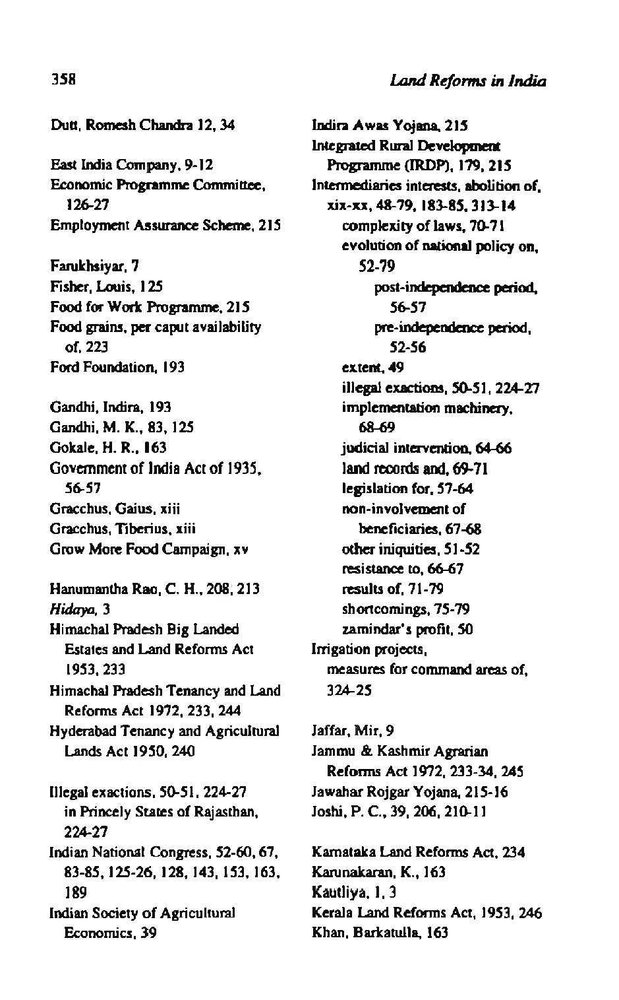

###### 358 Land Reforms in India

Dutt, Romesh Chandra 12,34

Indira Awas Yojana, 215 Integrated Rural Development

East India Company, 9-12 Economic Programme Committee,

Programme (IRDP), 179,215 Intermediaries interests, abolition of,

126-27 Employment Assurance Scheme, 215

xix-xx, 48-79,183-85,313-14 complexity of laws, 70-71 evolution of national policy on,

Farukhsiyar, 7 Fisher, Louis, 125 Food for Work Programme, 215 Food grains, per caput availability

52-79 post-independence period, 56-57 pre-independence period,

of, 223 Ford Foundation, 193

52-56 extent, 49 illegal exactions, 50-51,224-27 implementation machinery,

Gandhi, Indira, 193 Gandhi, M. K., 83,125 Gokale, H. R., 163 Government of India Act of 1935,

68-69 judicial intervention, 64-66 land records and, 69*71 legislation for, 57-64 non-involvement of

56-57 Gracchus, Gaius, xiii Gracchus, Tiberius, xiii Grow More Food Campaign, xv

beneficiaries, 67-68 other iniquities, 51-52 resistance to, 66-67 results of, 71-79 shortcomings, 75-79 zamindar’s profit, 50

Hanumantha Rao, C. H., 208, 213 Hidaya, 3 Himachal Pradesh Big Landed

Estates and Land Reforms Act 1953,233

Irrigation projects, measures for command areas of, 324-25

Himachal Pradesh Tenancy and Land Reforms Act 1972, 233, 244 Hyderabad Tenancy and Agricultural Lands Act 1950, 240

Jaffar, Mir, 9 Jammu & Kashmir Agrarian

Reforms Act 1972,233-34, 245 Jawahar Rojgar Yojana, 215-16 Joshi, P. C., 39,206,210-11

Illegal exactions, 50-51, 224-27 in Princely States of Rajasthan, 224-27

Indian National Congress, 52-60,67, 83-85,125-26, 128, 143,153, 163, 189

Karnataka Land Reforms Act, 234 Karunakaran, K, 163

###### Kautliya, 1,3

Kerala Land Reforms Act, 1953, 246 Khan, Barkatulla, 163

Indian Society of Agricultural Economics, 39

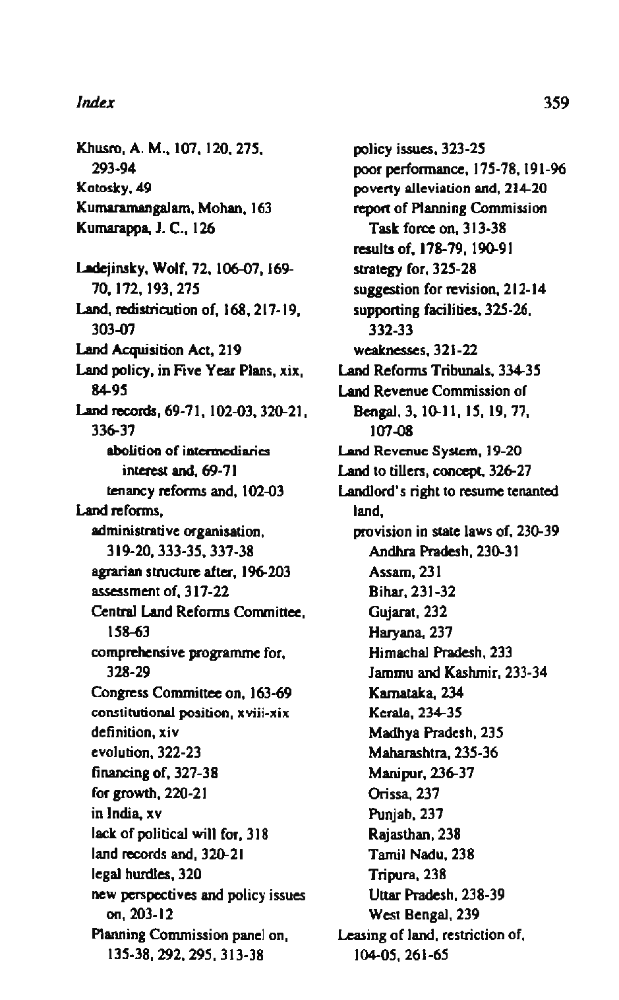

###### Index 359

Khusro, A. M., 107, 120, 275,

policy issues, 323-25 poor performance, 175-78,191-96

293-94 Kotosky, 49

poverty alleviation and, 214-20

Kumaramangalam, Mohan, 163 Kumarappa, J. C.f 126

report of Planning Commission

Task force on, 313-38 results of. 178-79,190-91 strategy for, 325-28 suggestion for revision, 212-14 supporting facilities, 325-26,

Ladejinsky, Wolf, 72,106-07,16970,172,193,275 Land, redistricution of, 168,217-19,

303-07 Land Acquisition Act, 219 Land policy, in Five Year Plans, xix,

332-33

weaknesses, 321-22 Land Reforms Tribunals, 334-35 Land Revenue Commission of

84-95 Land records, 69-71,102-03,320-21, 336-37 abolition of intermediaries interest and, 69-71

Bengal, 3,10-11,15,19,77, 107-08

Land R evenue System , 19-20

Land to tillers, concept, 326-27 Landlord's right to resume tenanted

tenancy reforms and, 102-03 Land reforms,

land, provision in state laws of, 230-39

administrative organisation, 319-20,333-35, 337-38 agrarian structure after, 196-203 assessment of, 317-22 Central Land Reforms Committee,

Andhra Pradesh, 230-31 Assam, 231 Bihar, 231-32 Gujarat, 232 Haryana, 237 Himachal Pradesh, 233 Jammu and Kashmir, 233-34 Karnataka, 234 Kerala, 234-35 Madhya Pradesh, 235 Maharashtra, 235-36 Manipur, 236-37 Orissa, 237 Punjab, 237 Rajasthan, 238 Tamil Nadu, 238 Tripura, 238 Uttar Pradesh, 238-39 West Bengal, 239

158-63 comprehensive programme for,

328-29 Congress Committee on, 163-69 constitutional position, xviii-xix definition, xiv evolution, 322-23 financing of, 327-38 for growth, 220-21 in India, xv lack of political will for, 318 land records and, 320-21 legal hurdles, 320 new perspectives and policy issues

on, 203-12 Planning Commission panel on, 135-38, 292, 295,313-38

Leasing of land, restriction of, 104-05, 261-65

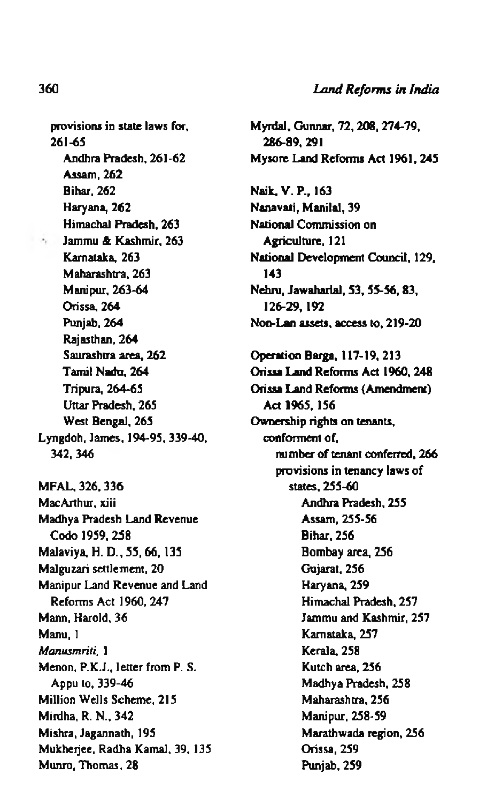

###### 360 Land Reforms in India

Myrdal, Gunnar, 72,208,274-79, 286-89, 291 Mysore Land Reforms Act 1961,245

provisions in state laws for, 261-65

Andhra Pradesh, 261-62 Assam, 262 Bihar, 262 Haryana, 262 Himachal Pradesh, 263 Jammu & Kashmir, 263 Karnataka, 263 Maharashtra, 263 Manipur, 263-64 Orissa, 264 Punjab, 264 Rajasthan, 264 Saurashtra area, 262 Tamil Nadu, 264 Tripura, 264-65 Uttar Pradesh, 265 West Bengal, 265

Naik. V. P., 163 Nanavati, Manilal, 39 National Commission on

Agriculture, 121 National Development Council, 129, 143 Nehni, Jawaharlal, 53.55-56,83, 126-29.192 Non-Lan assets, access to, 219-20

Operation Barga, 117-19,213 Orissa Land Reforms Act 1960,248 Orissa Land Reforms (Amendment)

Act 1965,156 Ownership rights on tenants,

Lyngdoh, James, 194-95,339-40, 342,346

conforment of, number of tenant conferred, 266 provisions in tenancy laws of

MFAL, 326, 336 MacArthur, xiii Madhya Pradesh Land Revenue

states, 255-60 Andhra Pradesh, 255 Assam, 255-56 Bihar, 256 Bombay area, 256 Gujarat, 256 Haryana, 259 Himachal Pradesh, 257 Jammu and Kashmir, 257 Karnataka, 257 Kerala. 258 Kutch area, 256 Madhya Pradesh, 258 Maharashtra, 256 Manipur. 258-59 Marathwada region, 256 Orissa, 259 Punjab, 259

Codo 1959, 258 Malaviya, H. D.,55,66,135 Malguzari settlement, 20 Manipur Land Revenue and Land

Reforms Act 1960, 247 Mann, Harold, 36 Manu, 1 Manusmriti, 1 Menon, P.K.J., letter from P. S.

Appu to, 339-46 Million Wells Scheme, 215 Mirdha, R. N., 342 Mishra, Jagannath, 195 Mukherjee, Radha Kama], 39, 135 Munro, Thomas, 28

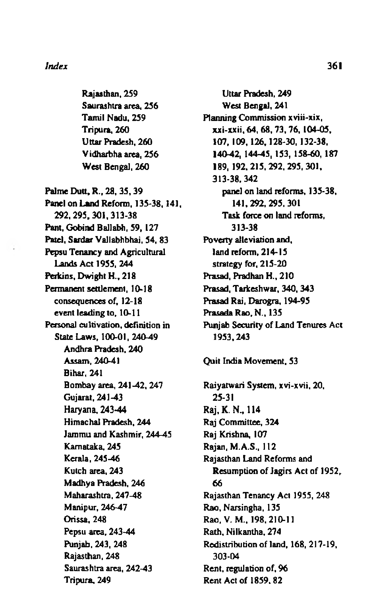

###### Index 361

Uttar Pradesh, 249 West Bengal, 241

Rajasthan, 259 Saurashtra area, 256 Tamil Nadu, 259 Tripura, 260 Uttar Pradesh, 260 Vidharbha area, 256 West Bengal, 260

Planning Commission xviii-xix, xxi-xxii, 64,68,73,76,104-05, 107,109,126,128-30,132-38, 140-42, 144-45,153, 158-60,187 189,192,215,292,295, 301, 313-38,342

panel on land reforms, 135-38, 141,292, 295, 301 Task force on land reforms, 313-38 Poverty alleviation and,

Palme Dutt. R., 28, 35,39 Panel on Land Reform, 135-38,141,

292,295,301,313-38 Pant, Gobind Ballabh, 59,127 Patel, Sardar Vallabhbhai, 54, 83 Pepsu Tenancy and Agricultural

land reform, 214-15 strategy for, 215-20 Prasad, Pradhan H., 210 Prasad, Tarkeshwar, 340,343 Prasad Rai, Darogra, 194-95 PrasadaRao, N., 135 Punjab Security of Land Tenures Act

Lands Act 1955, 244 Perkins, Dwight H., 218 Permanent settlement, 10-18 consequences of, 12-18 event leading to, 10-11

Personal cultivation, definition in State Laws, 100-01, 240-49 Andhra Pradesh, 240 Assam, 240-41 Bihar, 241 Bombay area, 241-42,247 Gujarat, 241-43 Haryana, 243-44 Himachal Pradesh, 244 Jammu and Kashmir, 244-45 Karnataka, 245 Kerala, 245-46 Kutch area, 243 Madhya Pradesh, 246 Maharashtra, 247-48 Manipur, 246-47 Orissa, 248 Pepsu area, 243-44 Punjab, 243, 248 Rajasthan, 248 Saurashtra area, 242-43 Tripura, 249

1953,243

Quit India Movement, 53

Raiyatwari System, xvi-xvii, 20,

25-31 Raj, K. N., 114 Raj Committee, 324 Raj Krishna, 107 Rajan, M.A.S., 112 Rajasthan Land Reforms and

Resumption of Jagirs Act of 1952» 66

Rajasthan Tenancy Act 1955, 248 Rao, Narsingha, 135 Rao, V. M., 198,210-11 Rath, Nilkantha, 274 Redistribution of land, 168, 217-19,

303-04 Rent, regulation of, 96 Rent Act of 1859,82

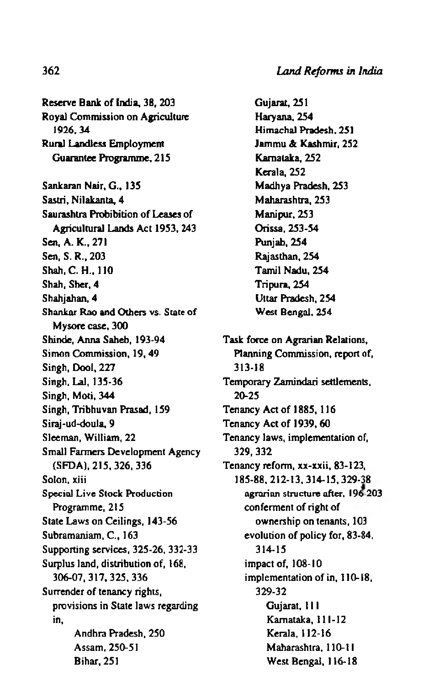

###### 362 Land Reforms in India

Reserve Bank of India, 38, 203 Royal Commission on Agriculture

Gujarat, 251 Haryana, 254 Himachal Pradesh, 251 Jammu & Kashmir, 252 Karnataka, 252 Kerala, 252 Madhya Pradesh, 253 Maharashtra, 253 Manipur, 253 Orissa, 253-54 Punjab, 254 Rajasthan, 254 Tamil Nadu, 254 Tripura, 254 Uttar Pradesh, 254 West Bengal, 254

1926.34 Rural Landless Employment Guarantee Programme, 215

Sankaran Nair, G., 135 Sastri, Nilakanta, 4 Saurashtra Probibition of Leases of

Agricultural Lands Act 1953, 243 Sen, A. K., 271 Sen, S. R., 203 Shah, C. H.. 110 Shah, Sher, 4 Shahjahan, 4

Shankar Rao and O thers vs. State of

Mysore case, 300 Shinde, Anna Saheb, 193-94 Simon Commission, 19,49 Singh, Dool, 227 Singh. Lai, 135-36 Singh, Moti, 344 Singh, Tribhuvan Prasad, 159 Siraj-ud-doula, 9 Sleeman, William, 22 Small Farmers Development Agcncy

Task force on Agrarian Relations, Planning Commission, report of, 313-18

Temporary Zamindari settlements,

20-25 Tenancy Act of 1885,116 Tenancy Act of 1939,60 Tenancy laws, implementation of,

329, 332 Tenancy reform, xx-xxii, 83-123,

(SFDA), 215, 326,336 Solon, xiii

185-88, 212-13, 314-15,329-38 agrarian structure after, 196 203 conferment of right of

Special Live Stock Production

Programme, 215 State Laws on Ceilings, 143-56 Subramaniam, C., 163 Supporting services, 325-26, 332-33 Surplus land, distribution of, 168,

ownership on tenants, 103 evolution of policy for, 83-84,

314-15 impact of, 108-10 implementation of in, 110-18,

306-07,317, 325, 336 Surrender of tenancy rights, provisions in State laws regarding in,

329-32 Gujarat, 111 Karnataka, 111-12 Kerala, 112-16 Maharashtra, 110-11 West Bengal, 116-18

Andhra Pradesh, 250 Assam, 250-51 Bihar, 251

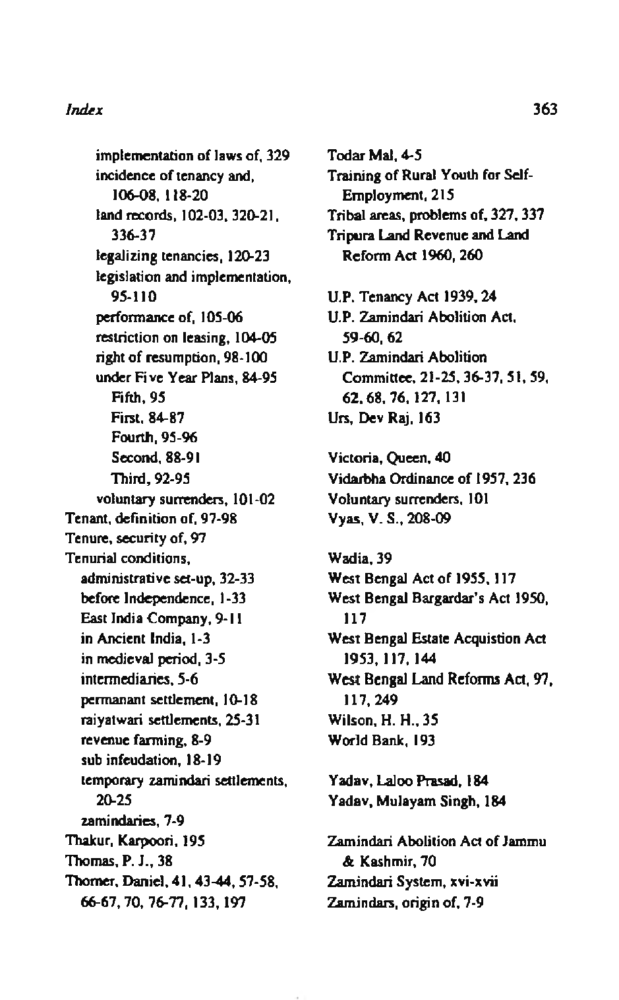

###### Index 363

Todar Mai, 4-5 Training of Rural Youth for Self-

implementation of laws of, 329 incidence of tenancy and,

Employment, 215 Tribal areas, problems of, 327,337 Tripura Land Revenue and Land

106-08, 118-20 land records, 102-03.320-21,

336-37 legalizing tenancies, 120-23 legislation and implementation,

Reform Act 1960, 260

95-110 performance of, 105-06 restriction on leasing, 104-05 right of resumption, 98-100 under Five Year Plans, 84-95

U.P. Tenancy Act 1939,24 U.P. Zamindari Abolition Act,

59-60,62

U.P. Zamindari Abolition Committee, 21-25, 36-37,51,59, 62.68,76,127,131

Fifth, 95 First, 84-87 Fourth, 95-96 Second, 88-91 Third, 92-95

Urs, Dev Raj, 163

Victoria, Queen, 40 Vidarbha Ordinance of 1957,236 Voluntary surrenders, 101 Vyas, V. S., 208-09

voluntary surrenders, 101-02 Tenant, definition of, 97-98 Tenure, security of, 97 Tenurial conditions,

Wadia, 39 West Bengal Act of 1955,117 West Bengal Bargardar’s Act 1950,

administrative set-up, 32-33 before Independence, 1-33 East India Company, 9-11 in Ancient India, 1-3 in medieval period, 3-5 intermediaries, 5-6 permanant settlement, 10-18 raiyatwari settlements, 25-31 revenue farming, 8-9 sub infeudation, 18-19 temporary zamindari settlements,

117 West Bengal Estate Acquistion Act 1953,117, 144 West Bengal Land Reforms Act, 97, 117,249

Wilson, H. H., 35 World Bank, 193

Yadav, Laloo Prasad, 184 Yadav, Mulayam Singh, 184

20-25

zamindari es, 7-9 Thakur, Karpoori, 195 Thomas, P. J., 38 Thomer, Daniel, 41,43-44,57-58,

Zamindari Abolition Act of Jammu

& Kashmir, 70 Zamindari System, xvi-xvii Zamindars, origin of, 7-9

66-67,70, 76-77,133,197

