Land Tenure and Property Rights: Theory and Implications for Development Policy Author(s): Gershon Feder and David Feeny Source: The World Bank Economic Review, Jan., 1991, Vol. 5, No. 1 (Jan., 1991), pp. 135-153 Published by: Oxford University Press Stable URL: https://www.jstor.org/stable/3989973

JSTOR is a not-for-profit service that helps scholars, researchers, and students discover, use, and build upon a wide range of content in a trusted digital archive. We use information technology and tools to increase productivity and facilitate new forms of scholarship. For more information about JSTOR, please contact support@jstor.org.

Your use of the JSTOR archive indicates your acceptance of the Terms & Conditions of Use, available at https://about.jstor.org/terms

Oxford University Press is collaborating with JSTOR to digitize, preserve and extend access to The World Bank Economic Review

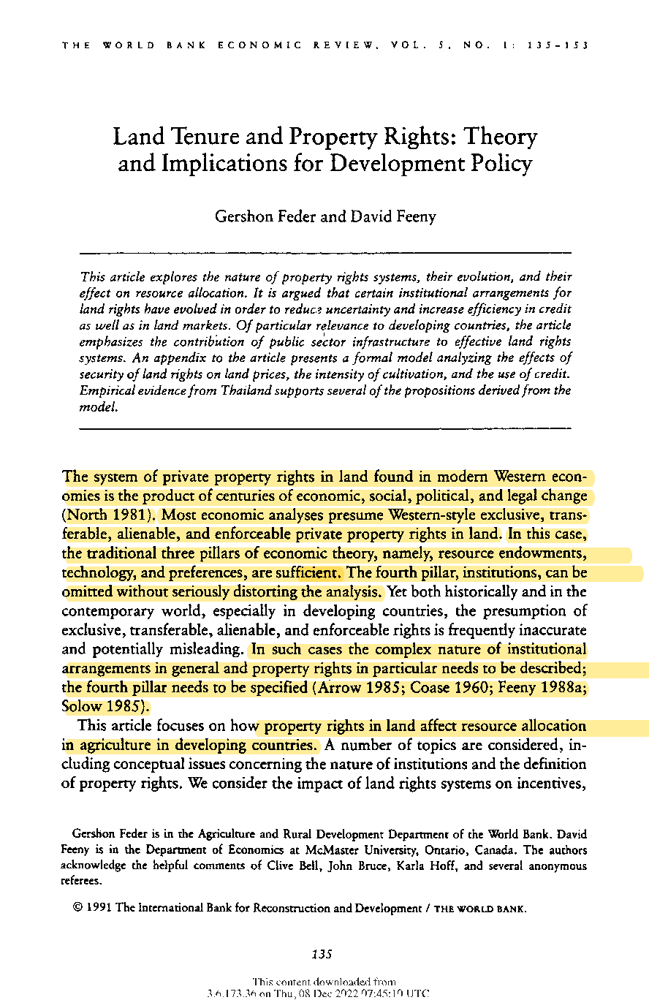

THE WO RLD BANK ECONOMIC REV I EW, VOL. 5, NO. 1: 135 -1 53

Land Tenure and Property Rights: Theory and Implications for Development Policy

Gershon Feder and David Feeny

This article explores the nature of property rights systems, their evolution, and their effect on resource allocation. It is argued that certain institutional arrangements for

land rights have evolved in order to reduc,? uncertainty and increase efficiency in credit

as well as in land markets. Of particular relevance to developing countries, the article emphasizes the contribution of public sector infrastructure to effective land rights

systems. An appendix to the article presents a formal model analyzing the effects of

security of land rights on land prices, the intensity of cultivation, and the use of credit.

Empirical evidence from Thailand supports several of the propositions derived from the

model.

The system of private property rights in land found in modem Western econ-

omies is the product of centuries of economic, social, political, and legal change (North 1981). Most economic analyses presume Western-style exclusive, trans-

ferable, alienable, and enforceable private property rights in land. In this case,

the traditional three pillars of economic theory, namely, resource endowments,

technology, and preferences, are sufficient. The fourth pillar, institutions, can be

omitted without seriously distorting the analysis. Yet both historically and in the

contemporary world, especially in developing countries, the presumption of exclusive, transferable, alienable, and enforceable rights is frequently inaccurate and potentially misleading. In such cases the complex nature of institutional

arrangements in general and property rights in particular needs to be described; the fourth pillar needs to be specified (Arrow 1985; Coase 1960; Feeny 1988a;

Solow 1985).

This article focuses on how property rights in land affect resource allocation

in agriculture in developing countries. A number of topics are considered, in-

cluding conceptual issues concerning the nature of institutions and the definition

of property rights. We consider the impact of land rights systems on incentives,

Gershon Feder is in the Agriculture and Rural Development Department of the World Bank. David

Feeny is in the Deparmnent of Economics at McMaster University, Ontario, Canada. The authors

acknowledge the helpful comments of Clive Bell, John Bruce, Karla Hoff, and several anonymous

referees.

? 1991 The International Bank for Reconstruction and Development / THE WORLD BANK.

135

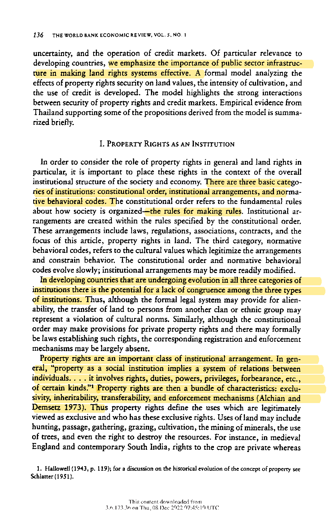

136 THE WORLD BANK ECONOMIC REVIEW, VOL. 5, NO. I

uncertainty, and the operation of credit markets. Of particular relevance to developing countries, we emphasize the importance of public sector infrastruc-

ture in making land rights systems effective. A formal model analyzing the

effects of property rights security on land values, the intensity of cultivation, and

the use of credit is developed. The model highlights the strong interactions

between security of property rights and credit markets. Empirical evidence from Thailand supporting some of the propositions derived from the model is summa-

rized briefly.

I. PROPERTY RIGHTS AS AN INSTITUTION

In order to consider the role of property rights in general and land rights in particular, it is important to place these rights in the context of the overall institutional structure of the society and economy. There are three basic catego-

ries of institutions: constitutional order, institutional arrangements, and norma-

tive behavioral codes. The constitutional order refers to the fundamental rules about how society is organized-the rules for making rules. Institutional arrangements are created within the rules specified by the constitutional order. These arrangements include laws, regulations, associations, contracts, and the

focus of this article, property rights in land. The third category, normative

behavioral codes, refers to the cultural values which legitimize the arrangements

and constrain behavior. The constitutional order and normative behavioral codes evolve slowly; institutional arrangements may be more readily modified.

In developing countries that are undergoing evolution in all three categories of institutions there is the potential for a lack of congruence among the three types

of institutions. Thus, although the formal legal system may provide for alienability, the transfer of land to persons from another dan or ethnic group may represent a violation of cultural norms. Similarly, although the constitutional order may make provisions for private property rights and there may formally

be laws establishing such rights, the corresponding registration and enforcement mechanisms may be largely absent.

Property rights are an important class of institutional arrangement. In gen-

eral, "property as a social institution implies a system of relations between

individuals..., it involves rights, duties, powers, privileges, forbearance, etc., of certain kinds:' Property rights are then a bundle of characteristics: exclu-

sivity, inheritability, transferability, and enforcement mechanisms (Alchian and

Demsetz 1973). Thus property rights define the uses which are legitimately viewed as exclusive and who has these exclusive rights. Uses of land may include

hunting, passage, gathering, grazing, cultivation, the mining of minerals, the use

of trees, and even the right to destroy the resources. For instance, in medieval England and contemporary South India, rights to the crop are private whereas

1. Hallowell (1943, p. 119); for a discussion on the historical evolution of the concept of property see

Schlatter (1951).

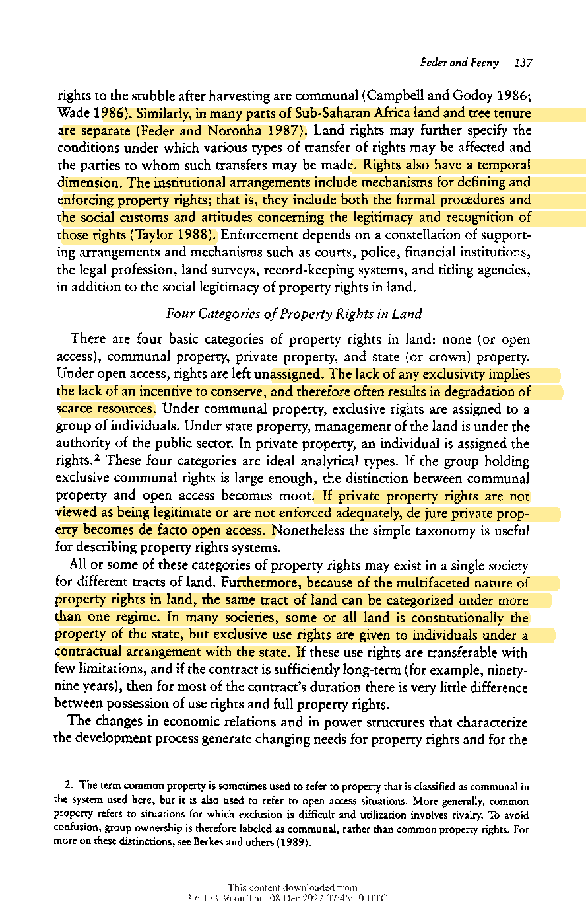

Feder and Feeny 137

rights to the stubble after harvesting are communal (Campbell and Godoy 1986;

Wade 1986). Similarly, in many parts of Sub-Saharan Africa land and tree tenure

are separate (Feder and Noronha 1987). Land rights may further specify the

conditions under which various types of transfer of rights may be affected and

the parties to whom such transfers may be made. Rights also have a temporal dimension. The institutional arrangements include mechanisms for defining and

enforcing property rights; that is, they include both the formal procedures and

the social customs and attitudes concerning the legitimacy and recognition of those rights (Taylor 1988). Enforcement depends on a constellation of supporting arrangements and mechanisms such as courts, police, financial institutions, the legal profession, land surveys, record-keeping systems, and titling agencies,

in addition to the social legitimacy of property rights in land.

Four Categories of Property Rights in Land

There are four basic categories of property rights in land: none (or open access), communal property, private property, and state (or crown) property.

Under open access, rights are left unassigned. The lack of any exclusivity implies

the lack of an incentive to conserve, and therefore often results in degradation of

scarce resources. Under communal property, exclusive rights are assigned to a

group of individuals. Under state property, management of the land is under the

authority of the public sector. In private property, an individual is assigned the

rights.2 These four categories are ideal analytical types. If the group holding

exclusive communal rights is large enough, the distinction between communal property and open access becomes moot. If private property rights are not viewed as being legitimate or are not enforced adequately, de jure private property becomes de facto open access. Nonetheless the simple taxonomy is useful

for describing property rights systems.

All or some of these categories of property rights may exist in a single society for different tracts of land. Furthermore, because of the multifaceted nature of

property rights in land, the same tract of land can be categorized under more than one regime. In many societies, some or all land is constitutionally the property of the state, but exclusive use rights are given to individuals under a

contractual arrangement with the state. If these use rights are transferable with

few limitations, and if the contract is sufficiently long-term (for example, ninety-

nine years), then for most of the contract's duration there is very little difference

between possession of use rights and full property rights.

The changes in economic relations and in power structures that characterize

the development process generate changing needs for property rights and for the

2. The term common property is sometimes used to refer to property that is classified as communal in

the system used here, but it is also used to refer to open access situations. More generally, common

property refers to situations for which exclusion is difficult and utilization involves rivalry. To avoid

confusion, group ownership is therefore labeled as communal, rather than common property rights. For more on these distinctions, see Berkes and others (1989).

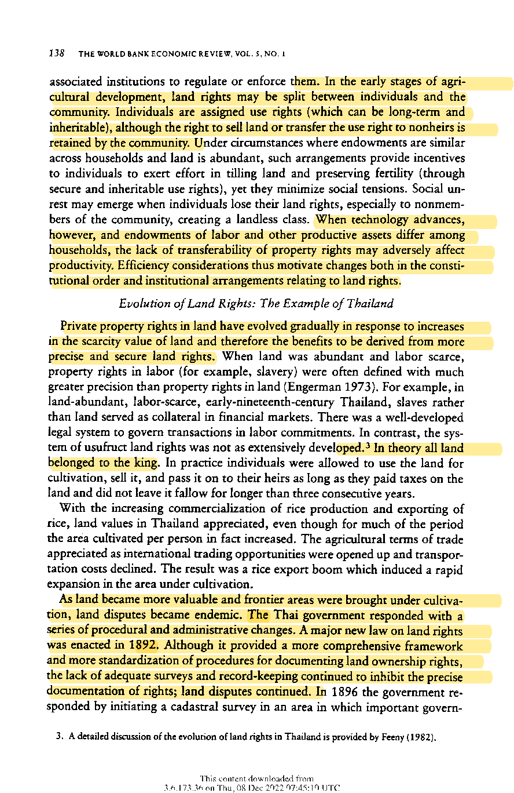

138 THE WORLD BANK ECONOMIC REVIEW, VOL. 5, NO. I

associated institutions to regulate or enforce them. In the early stages of agricultural development, land rights may be split between individuals and the community. Individuals are assigned use rights (which can be long-term and

inheritable), although the right to sell land or transfer the use right to nonheirs is

retained by the community. Under circumstances where endowments are similar

across households and land is abundant, such arrangements provide incentives to individuals to exert effort in tilling land and preserving fertility (through

secure and inheritable use rights), yet they minimize social tensions. Social un-

rest may emerge when individuals lose their land rights, especially to nonmem-

bers of the community, creating a landless class. When technology advances,

however, and endowments of labor and other productive assets differ among households, the lack of transferability of property rights may adversely affect

productivity. Efficiency considerations thus motivate changes both in the constitutional order and institutional arrangements relating to land rights.

Evolution of Land Rights: The Example of Thailand

Private property rights in land have evolved gradually in response to increases in the scarcity value of land and therefore the benefits to be derived from more

precise and secure land rights. When land was abundant and labor scarce, property rights in labor (for example, slavery) were often defined with much greater precision than property rights in land (Engerman 1973). For example, in land-abundant, labor-scarce, early-nineteenth-century Thailand, slaves rather than land served as collateral in financial markets. There was a well-developed legal system to govern transactions in labor commitments. In contrast, the sys-

tem of usufruct land rights was not as extensively developed.3 In theory all land

belonged to the king. In practice individuals were allowed to use the land for

cultivation, sell it, and pass it on to their heirs as long as they paid taxes on the

land and did not leave it fallow for longer than three consecutive years.

With the increasing commercialization of rice production and exporting of rice, land values in Thailand appreciated, even though for much of the period the area cultivated per person in fact increased. The agricultural terms of trade appreciated as international trading opportunities were opened up and transportation costs declined. The result was a rice export boom which induced a rapid

expansion in the area under cultivation.

As land became more valuable and frontier areas were brought under cultivation, land disputes became endemic. The Thai government responded with a series of procedural and administrative changes. A major new law on land rights

was enacted in 1892. Although it provided a more comprehensive framework

and more standardization of procedures for documenting land ownership rights,

the lack of adequate surveys and record-keeping continued to inhibit the precise documentation of rights; land disputes continued. In 1896 the government responded by initiating a cadastral survey in an area in which important govern-

3. A detailed discussion of the evolution of land rights in Thailand is provided by Feeny (1982).

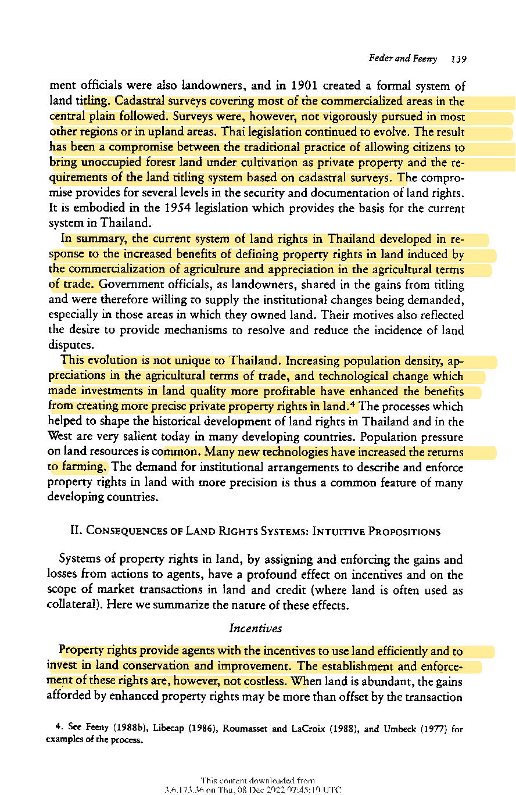

Feder and Feeny 139

ment officials were also landowners, and in 1901 created a formal system of

land titling. Cadastral surveys covering most of the commercialized areas in the central plain followed. Surveys were, however, not vigorously pursued in most other regions or in upland areas. Thai legislation continued to evolve. The result has been a compromise between the traditional practice of allowing citizens to bring unoccupied forest land under cultivation as private property and the requirements of the land titling system based on cadastral surveys. The compro-

mise provides for several levels in the security and documentation of land rights.

It is embodied in the 1954 legislation which provides the basis for the current

system in Thailand.

In summary, the current system of land rights in Thailand developed in response to the increased benefits of defining property rights in land induced by the commercialization of agriculture and appreciation in the agricultural terms of trade. Govemment officials, as landowners, shared in the gains from titling and were therefore willing to supply the institutional changes being demanded, especially in those areas in which they owned land. Their motives also reflected the desire to provide mechanisms to resolve and reduce the incidence of land

disputes.

This evolution is not unique to Thailand. Increasing population density, ap-

preciations in the agricultural terms of trade, and technological change which made investments in land quality more profitable have enhanced the benefits

from creating more precise private property rights in land.4 The processes which

helped to shape the historical development of land rights in Thailand and in the West are very salient today in many developing countries. Population pressure on land resources is common. Many new technologies have increased the returns to farming. The demand for institutional arrangements to describe and enforce property rights in land with more precision is thus a common feature of many

developing countries.

II. CONSEQUENCES OF LAND RIGHTS SYSTEMS: INTUITIVE PROPOSITIONS

Systems of property rights in land, by assigning and enforcing the gains and

losses from actions to agents, have a profound effect on incentives and on the

scope of market transactions in land and credit (where land is often used as

collateral). Here we summarize the nature of these effects.

Incentives

Property rights provide agents with the incentives to use land efficiently and to

invest in land conservation and improvement. The establishment and enforce-

ment of these rights are, however, not costless. When land is abundant, the gains

afforded by enhanced property rights may be more than offset by the transaction

4. See Feeny (1988b), Libecap (1986), Roumasset and LaCroix (1988), and Umbeck (1977) for

examples of the process.

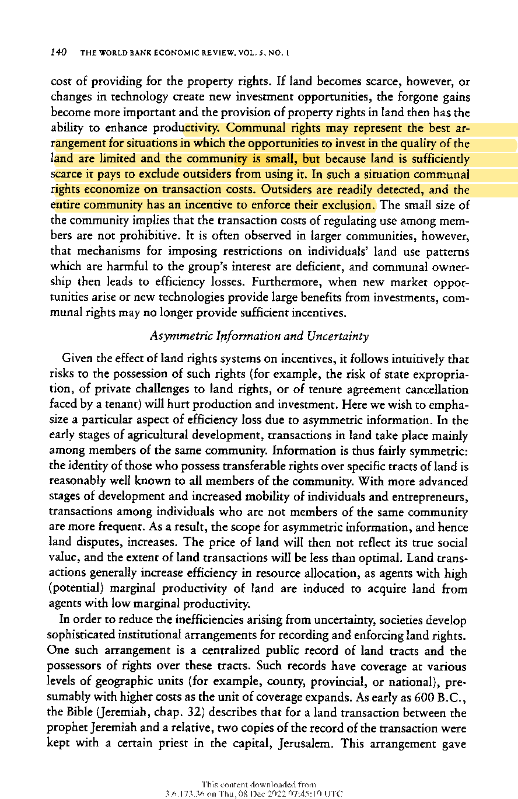

140 THE WORLD BANK ECONOMIC REVIEW, VOL. 5, NO. I

cost of providing for the property rights. If land becomes scarce, however, or changes in technology create new investment opportunities, the forgone gains

become more important and the provision of property rights in land then has the

ability to enhance productivity. Communal rights may represent the best ar-

rangement for situations in which the opportunities to invest in the quality of the

land are limited and the community is small, but because land is sufficiently

scarce it pays to exclude outsiders from using it. In such a situation communal rights economize on transaction costs. Outsiders are readily detected, and the entire community has an incentive to enforce their exclusion. The small size of

the community implies that the transaction costs of regulating use among mem-

bers are not prohibitive. It is often observed in larger communities, however,

that mechanisms for imposing restrictions on individuals' land use patterns

which are harmful to the group's interest are deficient, and communal owner-

ship then leads to efficiency losses. Furthermore, when new market oppor-

tunities arise or new technologies provide large benefits from investments, com-

munal rights may no longer provide sufficient incentives.

Asymmetric Information and Uncertainty

Given the effect of land rights systems on incentives, it follows intuitively that

risks to the possession of such rights (for example, the risk of state expropriation, of private challenges to land rights, or of tenure agreement cancellation

faced by a tenant) will hurt production and investment. Here we wish to empha-

size a particular aspect of efficiency loss due to asymmetric information. In the early stages of agricultural development, transactions in land take place mainly

among members of the same community. Information is thus fairly symmetric:

the identity of those who possess transferable rights over specific tracts of land is

reasonably well known to all members of the community. With more advanced stages of development and increased mobility of individuals and entrepreneurs, transactions among individuals who are not members of the same community

are more frequent. As a result, the scope for asymmetric information, and hence

land disputes, increases. The price of land will then not reflect its true social

value, and the extent of land transactions will be less than optimal. Land transactions generally increase efficiency in resource allocation, as agents with high

(potential) marginal productivity of land are induced to acquire land from

agents with low marginal productivity.

In order to reduce the inefficiencies arising from uncertainty, societies develop sophisticated institutional arrangements for recording and enforcing land rights.

One such arrangement is a centralized public record of land tracts and the

possessors of rights over these tracts. Such records have coverage at various

levels of geographic units (for example, county, provincial, or national), pre-

sumably with higher costs as the unit of coverage expands. As early as 600 B.C., the Bible (Jeremiah, chap. 32) describes that for a land transaction between the

prophet Jeremiah and a relative, two copies of the record of the transaction were

kept with a certain priest in the capital, Jerusalem. This arrangement gave

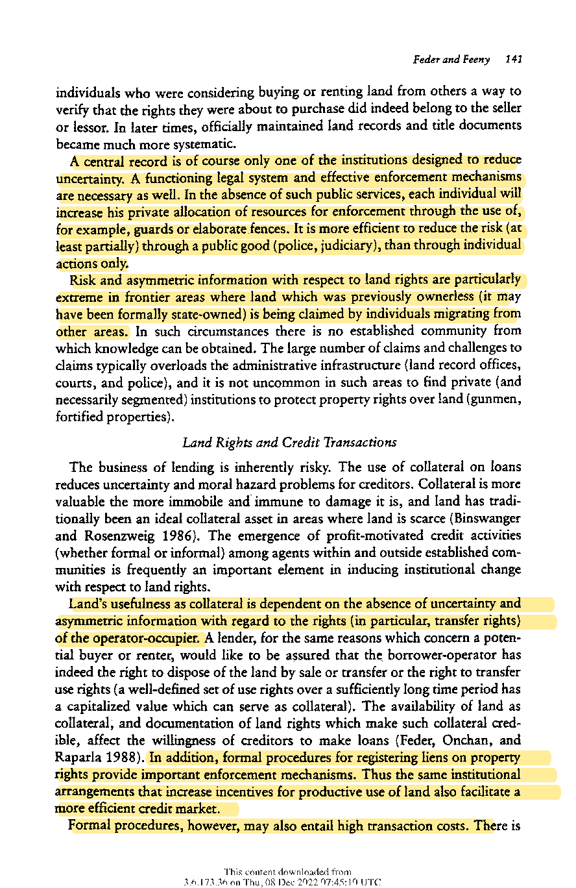

Feder and Feeny 141

individuals who were considering buying or renting land from others a way to

verify that the rights they were about to purchase did indeed belong to the seller

or lessor. In later times, officially maintained land records and title documents

became much more systematic.

A central record is of course only one of the institutions designed to reduce uncertainty. A functioning legal system and effective enforcement mechanisms are necessary as well. In the absence of such public services, each individual will increase his private allocation of resources for enforcement through the use of,

for example, guards or elaborate fences. It is more efficient to reduce the risk (at

least partially) through a public good (police, judiciary), than through individual

actions only.

Risk and asymmetric information with respect to land rights are particularly extreme in frontier areas where land which was previously ownerless (it may

have been formally state-owned) is being claimed by individuals migrating from

other areas. In such circumstances there is no established community from which knowledge can be obtained. The large number of claims and challenges to

claims typically overloads the administrative infrastructure (land record offices,

courts, and police), and it is not uncommon in such areas to find private (and

necessarily segmented) institutions to protect property rights over land (gunmen,

fortified properties).

Land Rights and Credit Transactions

The business of lending is inherently risky. The use of collateral on loans reduces uncertainty and moral hazard problems for creditors. Collateral is more valuable the more immobile and immune to damage it is, and land has traditionally been an ideal collateral asset in areas where land is scarce (Binswanger and Rosenzweig 1986). The emergence of profit-motivated credit activities (whether formal or informal) among agents within and outside established communities is frequently an important element in inducing institutional change

with respect to land rights.

Land's usefulness as collateral is dependent on the absence of uncertainty and

asymmetric information with regard to the rights (in particular, transfer rights)

of the operator-occupier. A lender, for the same reasons which concern a potential buyer or renter, would like to be assured that the borrower-operator has

indeed the right to dispose of the land by sale or transfer or the right to transfer use rights (a well-defined set of use rights over a sufficiently long time period has

a capitalized value which can serve as collateral). The availability of land as collateral, and documentation of land rights which make such collateral credible, affect the willingness of creditors to make loans (Feder, Onchan, and Raparla 1988). In addition, formal procedures for registering liens on property rights provide important enforcement mechanisms. Thus the same institutional arrangements that increase incentives for productive use of land also facilitate a

more efficient credit market.

Formal procedures, however, may also entail high transaction costs. There is

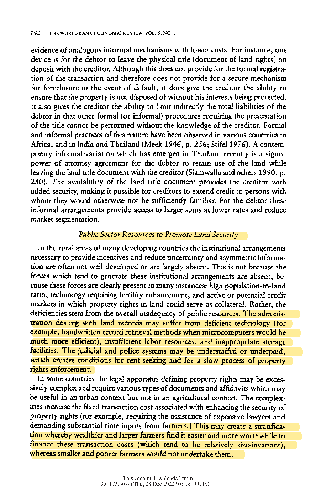

142 THE WORLD BANK ECONOMIC REVIEW, VOL. S. NO. 1

evidence of analogous informal mechanisms with lower costs. For instance, one device is for the debtor to leave the physical title (document of land rights) on

deposit with the creditor. Although this does not provide for the formal registra-

tion of the transaction and therefore does not provide for a secure mechanism for foreclosure in the event of default, it does give the creditor the ability to

ensure that the property is not disposed of without his interests being protected. It also gives the creditor the ability to limit indirectly the total liabilities of the

debtor in that other formal (or informal) procedures requiring the presentation

of the title cannot be performed without the knowledge of the creditor. Formal

and informal practices of this nature have been observed in various countries in Africa, and in India and Thailand (Meek 1946, p. 256; Stifel 1976). A contemporary informal variation which has emerged in Thailand recently is a signed power of attorney agreement for the debtor to retain use of the land while leaving the land title document with the creditor (Siamwalla and others 1990, p. 280). The availability of the land title document provides the creditor with

added security, making it possible for creditors to extend credit to persons with

whom they would otherwise not be sufficiently familiar. For the debtor these informal arrangements provide access to larger sums at lower rates and reduce

market segmentation.

Public Sector Resources to Promote Land Security

In the rural areas of many developing countries the institutional arrangements necessary to provide incentives and reduce uncertainty and asymmetric informa-

tion are often not well developed or are largely absent. This is not because the forces which tend to generate these institutional arrangements are absent, because these forces are clearly present in many instances: high population-to-land

ratio, technology requiring fertility enhancement, and active or potential credit

markets in which property rights in land could serve as collateral. Rather, the deficiencies stem from the overall inadequacy of public resources. The administration dealing with land records may suffer from deficient technology (for example, handwritten record retrieval methods when microcomputers would be much more efficient), insufficient labor resources, and inappropriate storage

facilities. The judicial and police systems may be understaffed or underpaid,

which creates conditions for rent-seeking and for a slow process of property

rights enforcement.

In some countries the legal apparatus defining property rights may be exces-

sively complex and require various types of documents and affidavits which may

be useful in an urban context but not in an agricultural context. The complex-

ities increase the fixed transaction cost associated with enhancing the security of

property rights (for example, requiring the assistance of expensive lawyers and demanding substantial time inputs from farmers.) This may create a stratifica-

tion whereby wealthier and larger farmers find it easier and more worthwhile to

finance these transaction costs (which tend to be relatively size-invariant),

whereas smaller and poorer farmers would not undertake them.

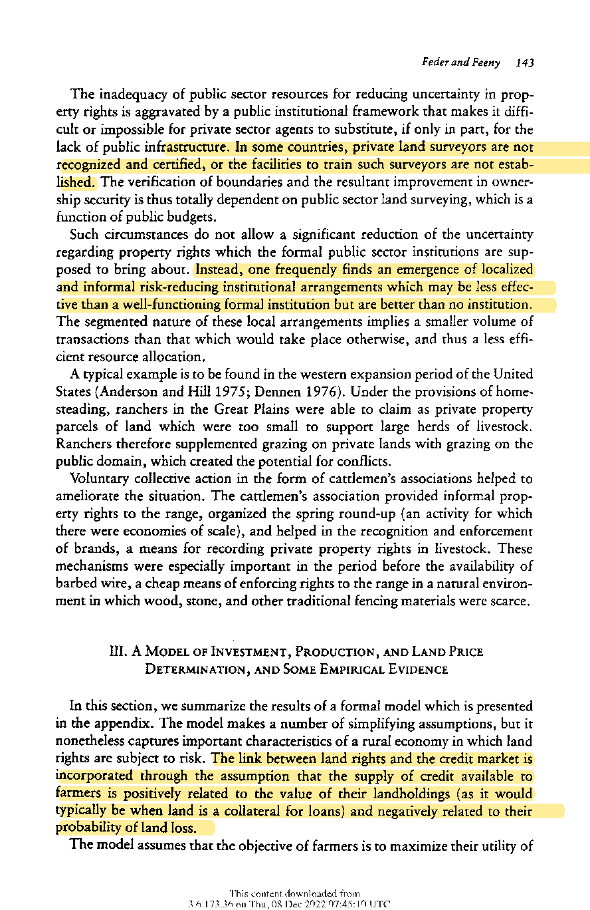

Feder and Feeny 143

The inadequacy of public sector resources for reducing uncertainty in prop-

erty rights is aggravated by a public institutional framework that makes it diffi-

cult or impossible for private sector agents to substitute, if only in part, for the lack of public infrastructure. In some countries, private land surveyors are not recognized and certified, or the facilities to train such surveyors are not established. The verification of boundaries and the resultant improvement in owner-

ship security is thus totally dependent on public sector land surveying, which is a

function of public budgets.

Such circumstances do not allow a significant reduction of the uncertainty

regarding property rights which the formal public sector institutions are supposed to bring about. Instead, one frequently finds an emergence of localized and informal risk-reducing institutional arrangements which may be less effec-

tive than a well-functioning formal institution but are better than no institution.

The segmented nature of these local arrangements implies a smaller volume of

transactions than that which would take place otherwise, and thus a less effi-

cient resource allocation.

A typical example is to be found in the western expansion period of the United

States (Anderson and Hill 1975; Dennen 1976). Under the provisions of homesteading, ranchers in the Great Plains were able to claim as private property

parcels of land which were too small to support large herds of livestock.

Ranchers therefore supplemented grazing on private lands with grazing on the

public domain, which created the potential for conflicts.

Voluntary collective action in the form of cattlemen's associations helped to

ameliorate the situation. The cattlemen's association provided informal property rights to the range, organized the spring round-up (an activity for which there were economies of scale), and helped in the recognition and enforcement

of brands, a means for recording private property rights in livestock. These

mechanisms were especially important in the period before the availability of

barbed wire, a cheap means of enforcing rights to the range in a natural environ-

ment in which wood, stone, and other traditional fencing materials were scarce.

III. A MODEL OF INVESTMENT, PRODUCTION, AND LAND PRICE

DETERMINATION, AND SOME EMPIRICAL EVIDENCE

In this section, we summarize the results of a formal model which is presented

in the appendix. The model makes a number of simplifying assumptions, but it

nonetheless captures important characteristics of a rural economy in which land

rights are subject to risk. The link between land rights and the credit market is incorporated through the assumption that the supply of credit available to

farmers is positively related to the value of their landholdings (as it would

typically be when land is a collateral for loans) and negatively related to their probability of land loss.

The model assumes that the objective of farmers is to maximize their utility of

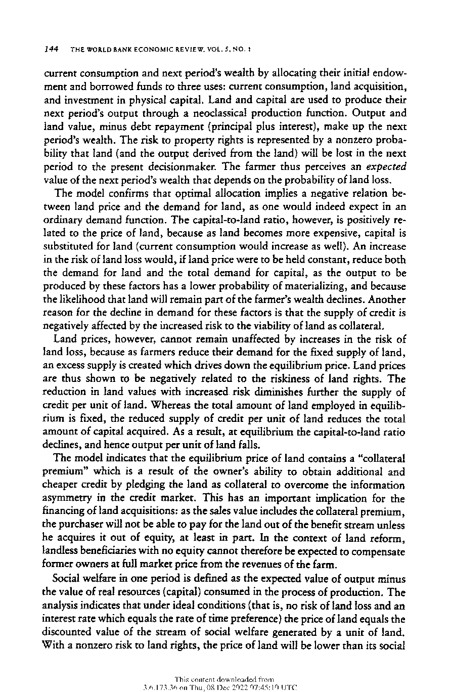

144 THE WORLD BANK ECONOMIC REVIEW, VOL. 5, NO. I

current consumption and next period's wealth by allocating their initial endow-

ment and borrowed funds to three uses: current consumption, land acquisition, and investment in physical capital. Land and capital are used to produce their

next period's output through a neoclassical production function. Output and

land value, minus debt repayment (principal plus interest), make up the next

period's wealth. The risk to property rights is represented by a nonzero probability that land (and the output derived from the land) will be lost in the next

period to the present decisionmaker. The farmer thus perceives an expected

value of the next period's wealth that depends on the probability of land loss.

The model confirms that optimal allocation implies a negative relation between land price and the demand for land, as one would indeed expect in an ordinary demand function. The capital-to-land ratio, however, is positively related to the price of land, because as land becomes more expensive, capital is substituted for land (current consumption would increase as well). An increase

in the risk of land loss would, if land price were to be held constant, reduce both

the demand for land and the total demand for capital, as the output to be produced by these factors has a lower probability of materializing, and because

the likelihood that land will remain part of the farmer's wealth declines. Another reason for the decline in demand for these factors is that the supply of credit is

negatively affected by the increased risk to the viability of land as collateral.

Land prices, however, cannot remain unaffected by increases in the risk of land loss, because as farmers reduce their demand for the fixed supply of land, an excess supply is created which drives down the equilibrium price. Land prices are thus shown to be negatively related to the riskiness of land rights. The reduction in land values with increased risk diminishes further the supply of credit per unit of land. Whereas the total amount of land employed in equilibrium is fixed, the reduced supply of credit per unit of land reduces the total amount of capital acquired. As a result, at equilibrium the capital-to-land ratio

declines, and hence output per unit of land falls.

The model indicates that the equilibrium price of land contains a "collateral premium" which is a result of the owner's ability to obtain additional and cheaper credit by pledging the land as collateral to overcome the information

asymmetry in the credit market. This has an important implication for the

financing of land acquisitions: as the sales value includes the collateral premium,

the purchaser will not be able to pay for the land out of the benefit stream unless

he acquires it out of equity, at least in part. In the context of land reform,

landless beneficiaries with no equity cannot therefore be expected to compensate

former owners at full market price from the revenues of the farm.

Social welfare in one period is defined as the expected value of output minus the value of real resources (capital) consumed in the process of production. The analysis indicates that under ideal conditions (that is, no risk of land loss and an

interest rate which equals the rate of time preference) the pnrce of land equals the

discounted value of the stream of social welfare generated by a unit of land.

With a nonzero risk to land rights, the price of land will be lower than its social

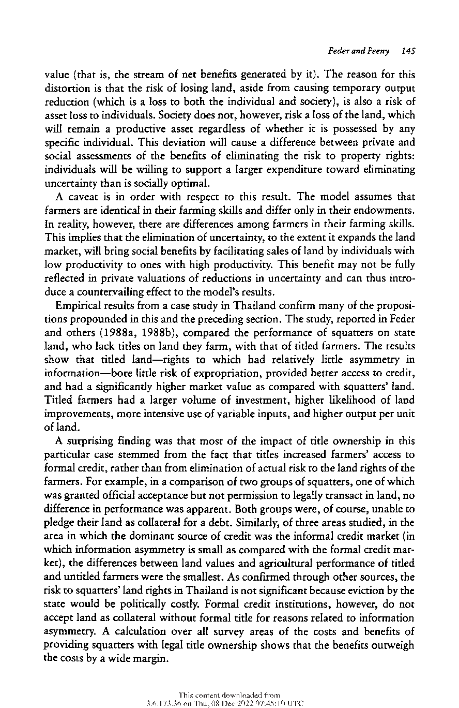

Feder and Feeny 14S

value (that is, the stream of net benefits generated by it). The reason for this

distortion is that the risk of losing land, aside from causing temporary output

reduction (which is a loss to both the individual and society), is also a risk of asset loss to individuals. Society does not, however, risk a loss of the land, which will remain a productive asset regardless of whether it is possessed by any specific individual. This deviation will cause a difference between private and social assessments of the benefits of eliminating the risk to property rights:

individuals will be willing to support a larger expenditure toward eliminating

uncertainty than is socially optimal.

A caveat is in order with respect to this result. The model assumes that

farmers are identical in their farming skills and differ only in their endowments.

In reality, however, there are differences among farmers in their farming skills.

This implies that the elimination of uncertainty, to the extent it expands the land

market, will bring social benefits by facilitating sales of land by individuals with low productivity to ones with high productivity. This benefit may not be fully

reflected in private valuations of reductions in uncertainty and can thus intro-

duce a countervailing effect to the model's results.

Empirical results from a case study in Thailand confirm many of the proposi-

tions propounded in this and the preceding section. The study, reported in Feder and others (1988a, 1988b), compared the performance of squatters on state land, who lack titles on land they farm, with that of titled farmers. The results show that titled land-rights to which had relatively little asymmetry in

information-bore little risk of expropriation, provided better access to credit,

and had a significantly higher market value as compared with squatters' land.

Titled farmers had a larger volume of investment, higher likelihood of land

improvements, more intensive use of variable inputs, and higher output per unit of land.

A surprising finding was that most of the impact of title ownership in this

particular case stemmed from the fact that titles increased farmers' access to formal credit, rather than from elimination of actual risk to the land rights of the

farmers. For example, in a comparison of two groups of squatters, one of which

was granted official acceptance but not permission to legally transact in land, no

difference in performance was apparent. Both groups were, of course, unable to pledge their land as collateral for a debt. Similarly, of three areas studied, in the

area in which the dominant source of credit was the informal credit market (in which information asymmetry is small as compared with the formal credit market), the differences between land values and agricultural performance of titled

and untitled farmers were the smallest. As confirmed through other sources, the

risk to squatters' land rights in Thailand is not significant because eviction by the state would be politically costly. Formal credit institutions, however, do not

accept land as collateral without formal title for reasons related to information asymmetry. A calculation over all survey areas of the costs and benefits of providing squatters with legal title ownership shows that the benefits outweigh the costs by a wide margin.

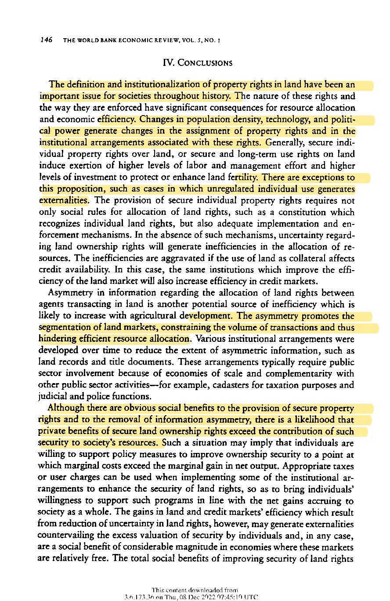

146 THE WORLD BANK ECONOMIC REVIEW, VOL. 5, NO. I

IV. CONCLUSIONS

The definition and institutionalization of property rights in land have been an important issue for societies throughout history. The nature of these rights and

the way they are enforced have significant consequences for resource allocation and economic efficiency. Changes in population density, technology, and political power generate changes in the assignment of property rights and in the institutional arrangements associated with these rights. Generally, secure individual property rights over land, or secure and long-term use rights on land

induce exertion of higher levels of labor and management effort and higher

levels of investment to protect or enhance land fertility. There are exceptions to

this proposition, such as cases in which unregulated individual use generates

externalities. The provision of secure individual property rights requires not

only social rules for allocation of land rights, such as a constitution which recognizes individual land rights, but also adequate implementation and enforcement mechanisms. In the absence of such mechanisms, uncertainty regarding land ownership rights will generate inefficiencies in the allocation of resources. The inefficiencies are aggravated if the use of land as collateral affects credit availability. In this case, the same institutions which improve the effi-

ciency of the land market will also increase efficiency in credit markets.

Asymmetry in information regarding the allocation of land rights between agents transacting in land is another potential source of inefficiency which is likely to increase with agricultural development. The asymmetry promotes the segmentation of land markets, constraining the volume of transactions and thus hindering efficient resource allocation. Various institutional arrangements were developed over time to reduce the extent of asymmetric information, such as land records and title documents. These arrangements typically require public sector involvement because of economies of scale and complementarity with other public sector activities-for example, cadasters for taxation purposes and

judicial and police functions.

Although there are obvious social benefits to the provision of secure property rights and to the removal of information asymmetry, there is a likelihood that

private benefits of secure land ownership rights exceed the contribution of such

security to society's resources. Such a situation may imply that individuals are willing to support policy measures to improve ownership security to a point at which marginal costs exceed the marginal gain in net output. Appropriate taxes

or user charges can be used when implementing some of the institutional ar-

rangements to enhance the security of land rights, so as to bring individuals'

willingness to support such programs in line with the net gains accruing to

society as a whole. The gains in land and credit markets' efficiency which result

from reduction of uncertainty in land rights, however, may generate externalities

countervailing the excess valuation of security by individuals and, in any case, are a social benefit of considerable magnitude in economies where these markets

are relatively free. The total social benefits of improving security of land rights

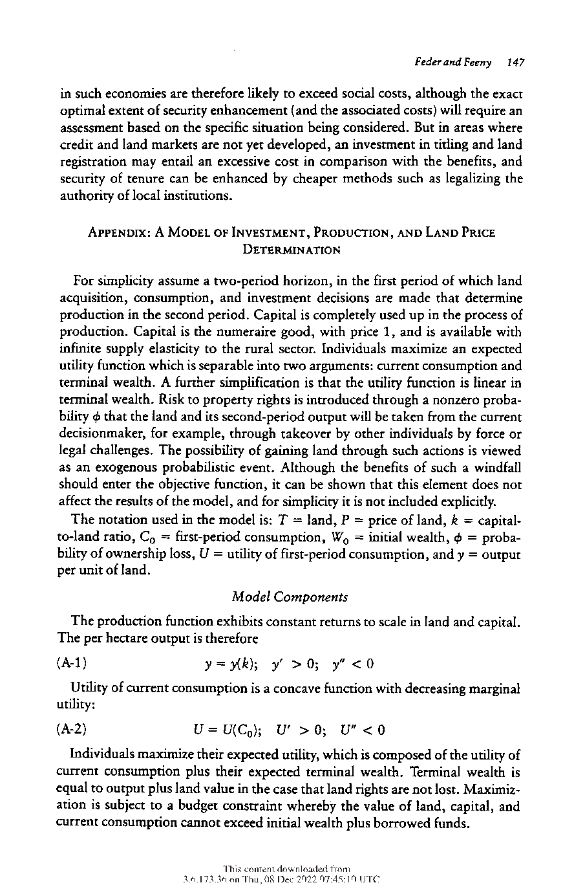

Feder and Feeny 147

in such economies are therefore likely to exceed social costs, although the exact

optimal extent of security enhancement (and the associated costs) will require an

assessment based on the specific situation being considered. But in areas where

credit and land markets are not yet developed, an investment in tiding and land

registration may entail an excessive cost in comparison with the benefits, and security of tenure can be enhanced by cheaper methods such as legalizing the

authority of local institutions.

APPENDIX: A MODEL OF INVESTMENT, PRODUCTION, AND LAND PRICE

DETERMINATION

For simplicity assume a two-period horizon, in the first period of which land

acquisition, consumption, and investment decisions are made that determine

production in the second period. Capital is completely used up in the process of

production. Capital is the numeraire good, with price 1, and is available with

infinite supply elasticity to the rural sector. Individuals maximize an expected

utility function which is separable into two arguments: current consumption and terminal wealth. A further simplification is that the utility function is linear in terminal wealth. Risk to property rights is introduced through a nonzero proba-

bility c that the land and its second-period output will be taken from the current

decisionmaker, for example, through takeover by other individuals by force or legal challenges. The possibility of gaining land through such actions is viewed

as an exogenous probabilistic event. Although the benefits of such a windfall

should enter the objective function, it can be shown that this element does not

affect the results of the model, and for simplicity it is not included explicitly.

The notation used in the model is: T = land, P = price of land, k = capital-

to-land ratio, CO = first-period consumption, WO = initial wealth, 4 = proba-

bility of ownership loss, U = utility of first-period consumption, and y = output

per unit of land.

Model Components

The production function exhibits constant returns to scale in land and capital. The per hectare output is therefore

(A-1) y = y(k); y' > 0; y" < 0

Utility of current consumption is a concave function with decreasing marginal

utility:

(A-2) U= U(Co); U, > 0; U" < 0

Individuals maximize their expected utility, which is composed of the utility of

current consumption plus their expected terminal wealth. Terminal wealth is

equal to output plus land value in the case that land rights are not lost. Maximiz-

ation is subject to a budget constraint whereby the value of land, capital, and current consumption cannot exceed initial wealth plus borrowed funds.

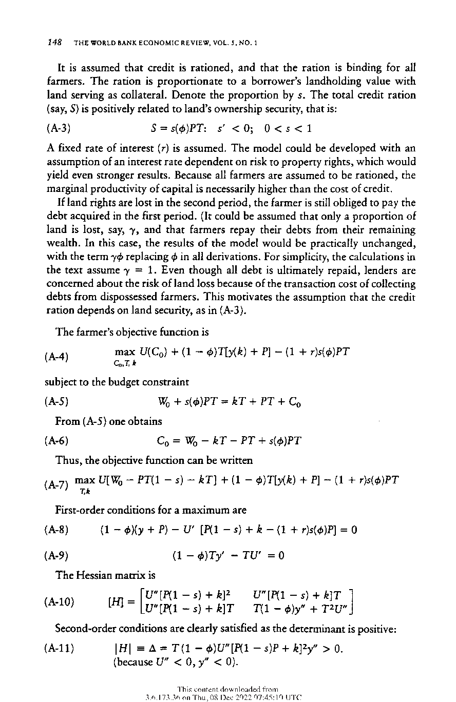

148 THE WORLD BANK ECONOMIC REVIEW, VOL. 5, NO. 1

It is assumed that credit is rationed, and that the ration is binding for all farmers. The ration is proportionate to a borrower's landholding value with

land serving as collateral. Denote the proportion by s. The total credit ration

(say, S) is positively related to land's ownership security, that is:

- (A-3) S = s(k)PT: s' < 0; 0 < s < 1

A fixed rate of interest (r) is assumed. The model could be developed with an assumption of an interest rate dependent on risk to property rights, which would yield even stronger results. Because all farmers are assumed to be rationed, the marginal productivity of capital is necessarily higher than the cost of credit.

If land rights are lost in the second period, the farmer is still obliged to pay the debt acquired in the first period. (It could be assumed that only a proportion of

land is lost, say, "y, and that farmers repay their debts from their remaining

wealth. In this case, the results of the model would be practically unchanged,

with the term 'y4 replacing 4 in all derivations. For simplicity, the calculations in

the text assume y = 1. Even though all debt is ultimately repaid, lenders are concerned about the risk of land loss because of the transaction cost of collecting debts from dispossessed farmers. This motivates the assumption that the credit ration depends on land security, as in (A-3).

The farmer's objective function is

- (A-4) max U(CO) + (1 - 0)T[y(k) + P] - (1 + r)s(ct))PT

Co, T, k

subject to the budget constraint

(A-S) Wo + s(q5)PT = kT + PT + Co

From (A-5) one obtains

- (A-6) Co = Wo-kT-PT + s(?)PT Thus, the objective function can be written
- (A-7) max U[W0 - PT(1 - s) - kT] + (1 - O)T[y(k) + P] - (1 + r)s(/)PT

T, k

First-order conditions for a maximum are

- (A-8) (1 - )(y + P)- U' [P(l-s) + k -(1 + r)s(O)P] =
- (A-9) (1- - - TU' = 0 The Hessian matrix is
- (A-10) [H-] = U"F[P(l - s) + k]2 U" [P(1 - s) + k]T1 [U" [P(1 - s) + k]T T(1 - .)y" + T2U"A

Second-order conditions are clearly satisfied as the determinant is positive:

(A-li) HI A = T(1 - 4)U"[P(l - s)P + k]2y" > 0.

(because U" < 0, y" < 0).

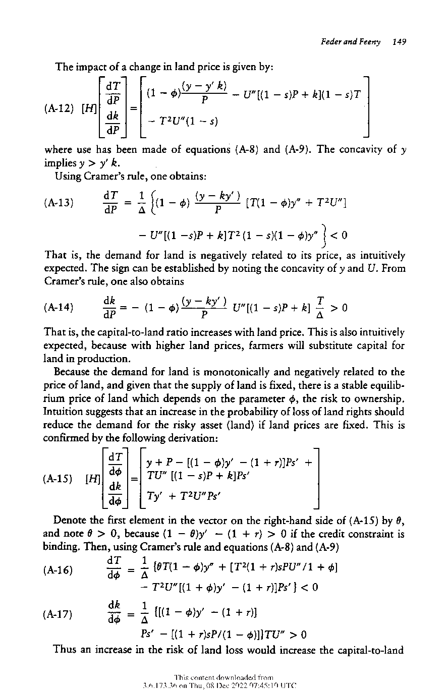

Feder and Feeny 149

The impact of a change in land price is given by:

(dTA -) .F-- y U"[(1-s)P + k](l-s)Tj

### dk j L_T2U"(l - s)

where use has been made of equations (A-8) and (A-9). The concavity of y

implies y > y' k. Using Cramer's rule, one obtains:

# (A-13) dT = [(1 - y) ( pY ) [T(l - O)y" + T2U"]

- U"[(1 -s)P + k]T2 (1 - s)(1 - k)y" 3< o

That is, the demand for land is negatively related to its price, as intuitively

expected. The sign can be established by noting the concavity of y and U. From

Cramer's rule, one also obtains

## (A-14) dkdP= - (1-)W(Y -PL\kY ) U'"[(1-JJAs)P + k] > O

That is, the capital-to-land ratio increases with land price. This is also intuitively

expected, because with higher land prices, farmers will substitute capital for

land in production.

Because the demand for land is monotonically and negatively related to the

price of land, and given that the supply of land is fixed, there is a stable equilib-

rium price of land which depends on the parameter 4, the risk to ownership.

Intuition suggests that an increase in the probability of loss of land rights should

reduce the demand for the risky asset (land) if land prices are fixed. This is

confirmed by the following derivation:

dT Y + P -[(1 - OWy - (1 + r)]Ps' +

- (A-15)LJIdk i [H] ddf TU" [(1 -s)P + k]Ps' dj Ty' + T2U"pS'

Denote the first element in the vector on the right-hand side of (A-1S) by 0,

and note 0 > 0, because (1 - 0)y' - (1 + r) > 0 if the credit constraint is

binding. Then, using Cramer's rule and equations (A-8) and (A-9)

- (A-16) dT = {OT(1 - .)y" + [T2(1 + r)sPU"/1 + 0]

-T2U"[(l + 4)y' - (1 + r)]Ps' I < 0

- (A-17) d = [(1 -cO)Y' -(1 + r)]

Ps' - [(1 + r)sP/(l - ck)]ITU" > 0

Thus an increase in the risk of land loss would increase the capital-to-land

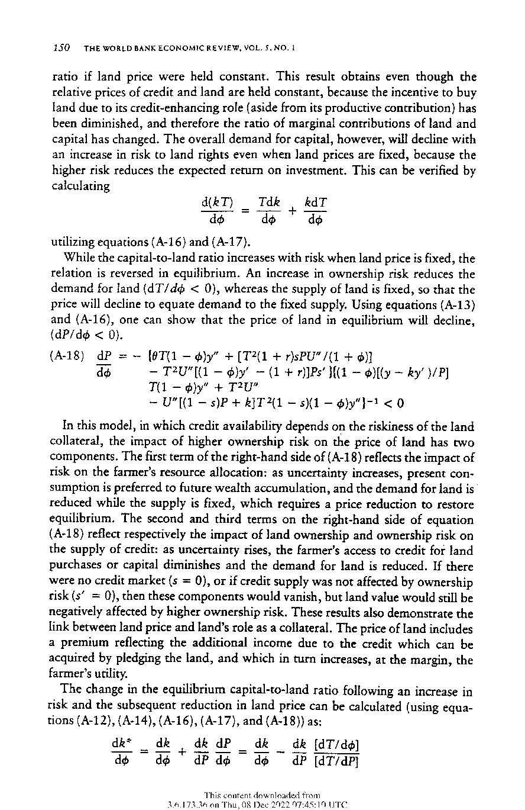

150 THE WORLD BANK ECONOMIC REVIEW, VOL. 5, NO. 1

ratio if land price were held constant. This result obtains even though the

relative prices of credit and land are held constant, because the incentive to buy

land due to its credit-enhancing role (aside from its productive contribution) has

been diminished, and therefore the ratio of marginal contributions of land and capital has changed. The overall demand for capital, however, will decline with an increase in risk to land rights even when land prices are fixed, because the higher risk reduces the expected return on investment. This can be verified by

calculating

d(kT) Tdk kdT

do d4 do

utilizing equations (A-16) and (A-17).

While the capital-to-land ratio increases with risk when land price is fixed, the

relation is reversed in equilibrium. An increase in ownership risk reduces the demand for land (dT/d4 < 0), whereas the supply of land is fixed, so that the price will decline to equate demand to the fixed supply. Using equations (A-13)

and (A-16), one can show that the price of land in equilibrium will decline,

(dP/do < 0).

- (A-18) dP = - {OT(1 - k)y" + [T2(1 + r)sPU" /(1 + +)]

do - T2U"[(l - k)y' - (1 + r)]Ps' }{(l - 4)[(y - ky' )/P]

T(l - c)y" + T2U"

- U"[(1 - s)P + k]T2(1 - s)(1 - 4)y"h' < 0

In this model, in which credit availability depends on the riskiness of the land

collateral, the impact of higher ownership risk on the price of land has two

components. The first term of the right-hand side of (A-1 8) reflects the impact of

risk on the farmer's resource allocation: as uncertainty increases, present con-

sumption is preferred to future wealth accumulation, and the demand for land is

reduced while the supply is fixed, which requires a price reduction to restore

equilibrium. The second and third terms on the right-hand side of equation

(A-1 8) reflect respectively the impact of land ownership and ownership risk on the supply of credit: as uncertainty rises, the farmer's access to credit for land

purchases or capital diminishes and the demand for land is reduced. If there

were no credit market (s = 0), or if credit supply was not affected by ownership

risk (s' = 0), then these components would vanish, but land value would still be

negatively affected by higher ownership risk. These results also demonstrate the

link between land price and land's role as a collateral. The price of land includes

a premium reflecting the additional income due to the credit which can be

acquired by pledging the land, and which in tum increases, at the margin, the

farmer's utility.

The change in the equilibrium capital-to-land ratio following an increase in

risk and the subsequent reduction in land price can be calculated (using equa-

tions (A-12), (A-14), (A-16), (A-17), and (A-18)) as:

dk* dk dk dP dk dk [dT/dc]

#### do dq dP d) d) dP [dT/dP]

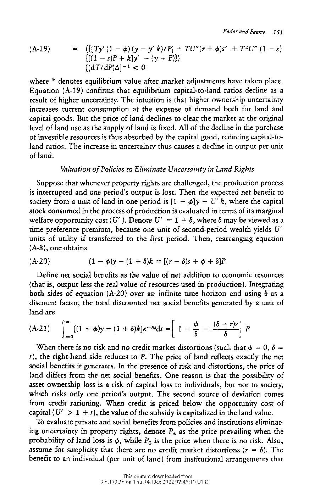

Feder and Feeny 151

- (A-19) = ({[Ty' (1-4) (y - y' k)/P] + TU"(r + 4)s' + T2U" (1 - s) [[(1 - s)P + k]y' - (y + P))) [(dT/dP)A]-1 <0

where * denotes equilibrium value after market adjustments have taken place.

Equation (A-19) confirms that equilibrium capital-to-land ratios decline as a

result of higher uncertainty. The intuition is that higher ownership uncertainty increases current consumption at the expense of demand both for land and

capital goods. But the price of land declines to clear the market at the original level of land use as the supply of land is fixed. All of the decline in the purchase of investible resources is thus absorbed by the capital good, reducing capital-to-

land ratios. The increase in uncertainty thus causes a decline in output per unit

of land.

Valuation of Policies to Eliminate Uncertainty in Land Rights Suppose that whenever property rights are challenged, the production process

is interrupted and one period's output is lost. Then the expected net benefit to

society from a unit of land in one period is [1 - O]y - U' k, where the capital

stock consumed in the process of production is evaluated in terms of its marginal welfare opportunity cost (U' ). Denote U' = 1 + 6, where a may be viewed as a

time preference premium, because one unit of second-period wealth yields U' units of utility if transferred to the first period. Then, rearranging equation

(A-8), one obtains

- (A-20) (1 - )y -(1 + 6)k =[(r - 6)s + q5 + 61P

Define net social benefits as the value of net addition to economic resources

(that is, output less the real value of resources used in production). Integrating

both sides of equation (A-20) over an infinite time horizon and using a as a

discount factor, the total discounted net social benefits generated by a unit of

land are

- (A-21) i[(1 - O)y - (1 + b)k]e-6tdt =[ 1 + , ( - )s P

When there is no risk and no credit market distortions (such that 4 = 0, 6 =

r), the right-hand side reduces to P. The price of land reflects exactly the net social benefits it generates. In the presence of risk and distortions, the price of

land differs from the net social benefits. One reason is that the possibility of

asset ownership loss is a risk of capital loss to individuals, but not to society, which risks only one period's output. The second source of deviation comes

from credit rationing. When credit is priced below the opportunity cost of

capital (U' > 1 + r), the value of the subsidy is capitalized in the land value. To evaluate private and social benefits from policies and institutions eliminat-

ing uncertainty in property rights, denote P,, as the price prevailing when the probability of land loss is 4, while PO is the price when there is no risk. Also, assume for simplicity that there are no credit market distortions (r = 8). The

benefit to an individual (per unit of land) from institutional arrangements that

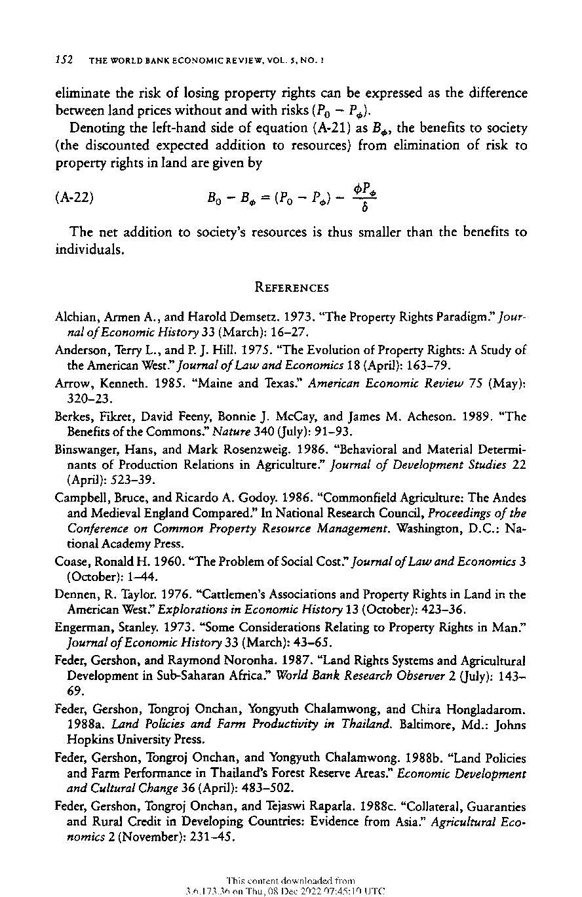

152 THE WORLD BANK ECONOMIC REVIEW, VOL. 5, NO. I

eliminate the risk of losing property rights can be expressed as the difference

between land prices without and with risks (PO - PO).

Denoting the left-hand side of equation (A-21) as BO, the benefits to society (the discounted expected addition to resources) from elimination of risk to

property rights in land are given by

(A-22) Bo - B-0 = (Po -PO) -

The net addition to society's resources is thus smaller than the benefits to

individuals.

REFERENCES

Alchian, Armen A., and Harold Demsetz. 1973. "The Property Rights Paradigm." Jour-

nal of Economic History 33 (March): 16-27.

Anderson, Terry L., and P. J. Hill. 1975. "The Evolution of Property Rights: A Study of

the American West?' Journal of Law and Economics 18 (April): 163-79.

Arrow, Kenneth. 1985. "Maine and Texas." American Economic Review 75 (May):

320-23.

Berkes, Fikret, David Feeny, Bonnie J. McCay, and James M. Acheson. 1989. "The

Benefits of the Commons?' Nature 340 July): 91-93.

Binswanger, Hans, and Mark Rosenzweig. 1986. "Behavioral and Material Determi-

nants of Production Relations in Agriculture?' Journal of Development Studies 22

(April): 523-39.

Campbell, Bruce, and Ricardo A. Godoy. 1986. "Commonfield Agriculture: The Andes

and Medieval England Compared?' In National Research Council, Proceedings of the

Conference on Common Property Resource Management. Washington, D.C.: Na-

tional Academy Press.

Coase, Ronald H. 1960. "The Problem of Social Cost." Journal of Law and Economics 3

(October): 1-44. Dennen, R. Taylor. 1976. "Cattlemen's Associations and Property Rights in Land in the

American West." Explorations in Economic History 13 (October): 423-36.

Engerman, Stanley. 1973. "Some Considerations Relating to Property Rights in Man."

Journal of Economic History 33 (March): 43-65.

Feder, Gershon, and Raymond Noronha. 1987. "Land Rights Systems and Agricultural

Development in Sub-Saharan Africa." World Bank Research Observer 2 July): 143-

69.

Feder, Gershon, Tongroj Onchan, Yongyuth Chalamwong, and Chira Hongladarom. 1988a. Land Policies and Farm Productivity in Thailand. Baltimore, Md.: Johns

Hopkins University Press.

Feder, Gershon, Tongroj Onchan, and Yongyuth Chalamwong. 1988b. "Land Policies and Farm Performance in Thailand's Forest Reserve Areas." Economic Development

and Cultural Change 36 (April): 483-502. Feder, Gershon, Tongroj Onchan, and Tejaswi Raparla. 1988c. "Collateral, Guaranties

and Rural Credit in Developing Countries: Evidence from Asia." Agricultural Eco-

nomics 2 (November): 231-45.

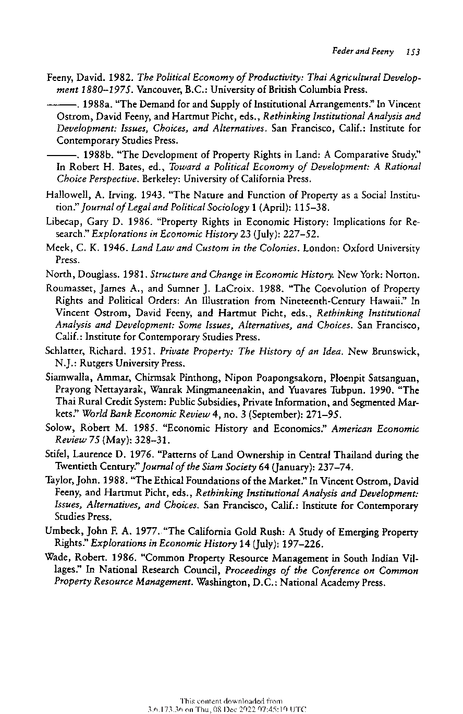

Feder and Feeny 153

Feeny, David. 1982. The Political Economy of Productivity: Thai Agricultural Develop-

ment 1880-1975. Vancouver, B.C.: University of British Columbia Press.

. 1988a. "The Demand for and Supply of Institutional Arrangements.' In Vincent Ostrom, David Feeny, and Hartmut Picht, eds., Rethinking Institutional Analysis and Development: Issues, Choices, and Alternatives. San Francisco, Calif.: Institute for

Contemporary Studies Press.

. 1988b. "The Development of Property Rights in Land: A Comparative Study-' In Robert H. Bates, ed., Toward a Political Economy of Development: A Rational

Choice Perspective. Berkeley: University of California Press.

Hallowell, A. Irving. 1943. "The Nature and Function of Property as a Social Institution." Journal of Legal and Political Sociology 1 (April): 1 15-3 8.

Libecap, Gary D. 1986. "Property Rights in Economic History: Implications for Re-

search." Explorations in Economic History 23 (July): 227-52.

Meek, C. K. 1946. Land Law and Custom in the Colonies. London: Oxford University

Press.

North, Douglass. 1981. Structure and Change in Economic History. New York: Norton. Roumasset, James A., and Sumner J. LaCroix. 1988. "The Coevolution of Property

Rights and Political Orders: An Illustration from Nineteenth-Century Hawaii?' In

Vincent Ostrom, David Feeny, and Hartmut Picht, eds., Rethinking Institutional

Analysis and Development: Some Issues, Alternatives, and Choices. San Francisco,

Calif.: Institute for Contemporary Studies Press.

Schlatter, Richard. 1951. Private Property: The History of an Idea. New Brunswick,

N.J.: Rutgers University Press.

Siamwalla, Ammar, Chirmsak Pinthong, Nipon Poapongsakorn, Ploenpit Satsanguan,

Prayong Nettayarak, Wanrak Mingmaneenakin, and Yuavares Tubpun. 1990. "The

Thai Rural Credit System: Public Subsidies, Private Information, and Segmented Markets'" World Bank Economic Review 4, no. 3 (September): 271-95.

Solow, Robert M. 1985. "Economic History and Economics."' American Economic

Review 75 (May): 328-31.

Stifel, Laurence D. 1976. "Patterns of Land Ownership in Central Thailand during the

Twentieth Century." Journal of the Siam Society 64 (January): 237-74.

Taylor, John. 1988. "The Ethical Foundations of the Market?' In Vincent Ostrom, David Feeny, and Hartmut Picht, eds., Rethinking Institutional Analysis and Development: Issues, Alternatives, and Choices. San Francisco, Calif.: Institute for Contemporary

Studies Press.

Umbeck, John F. A. 1977. "The California Gold Rush: A Study of Emerging Property Rights?' Explorations in Economic History 14 (July): 197-226.

Wade, Robert. 1986. "Common Property Resource Management in South Indian Villages." In National Research Council, Proceedings of the Conference on Common

Property Resource Management. Washington, D.C.: National Academy Press.

