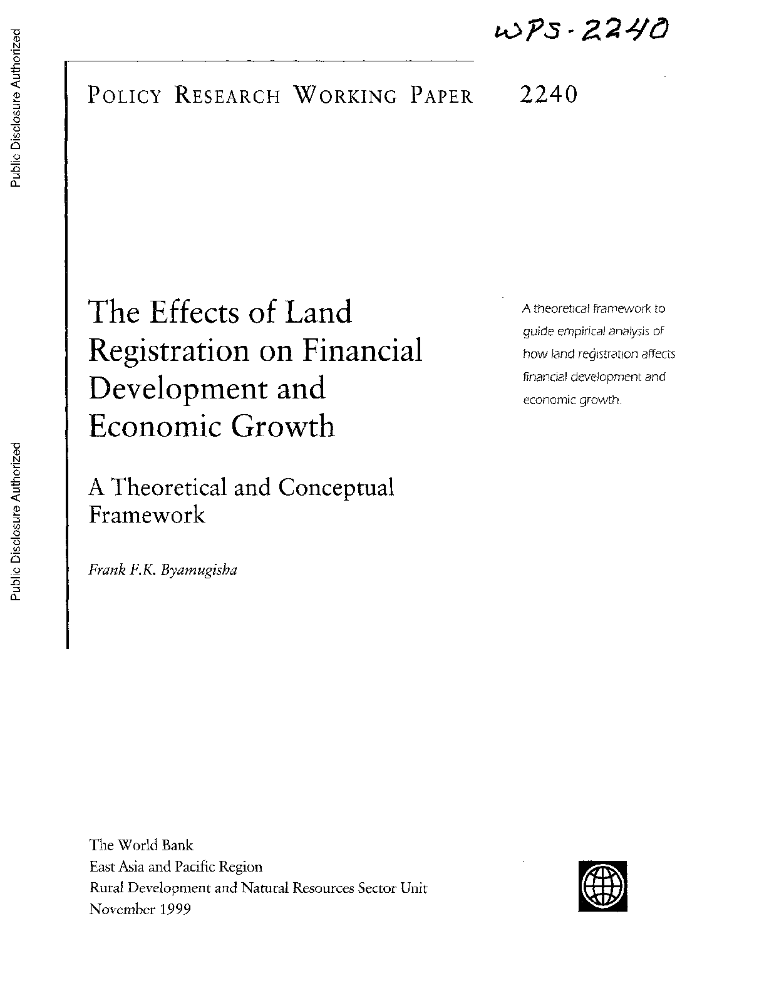

Public Disclosure AuthorizedPublic Disclosure Authorized

POLICY RESEARCH WORKING PAPER 2240

The Effectsof Land A theoretical framework to

guide empiricalanalysisof Registration on Financial how land registratnonaffects Developmentand financialdevelopment

economic growth.

# Economic Growth

## A Theoretical and Conceptual Framework

##### FrankF.K.Byamugisha

The World Bank East Asia and Pacific Region Rural Development and Natural Resources Sector Unit November 1999

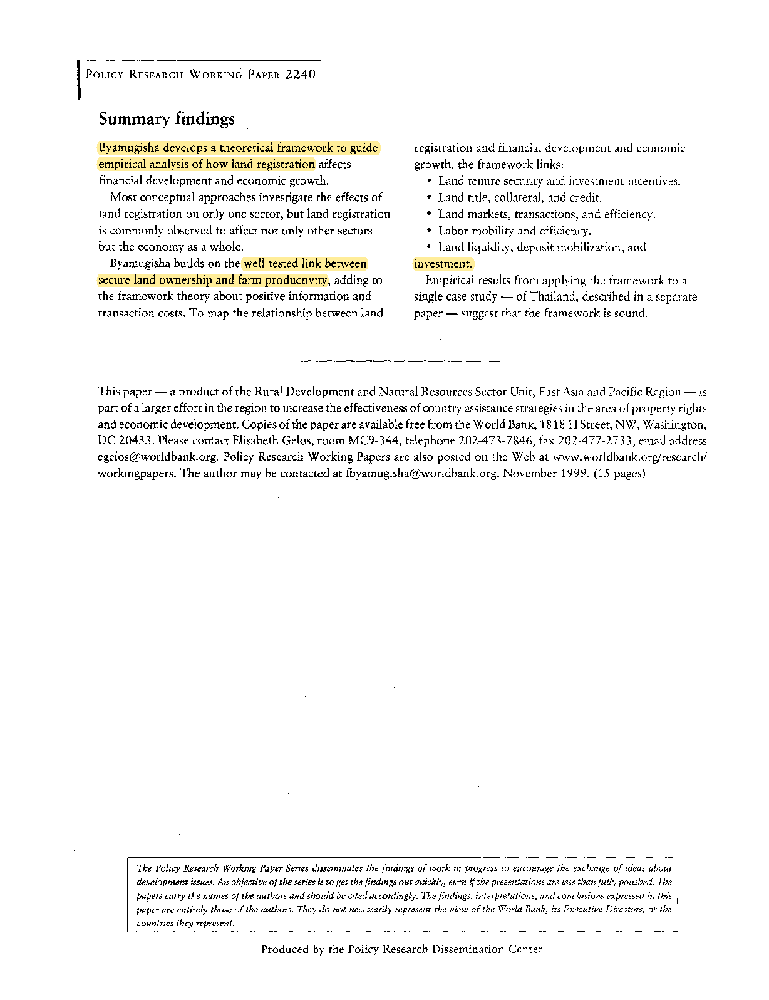

POLICYRESEARCHWORKINGPAPER2240

### Summaryfindings

Byamugishadevelops a theoretical framework to guide registration and financial development and economic empirical analysisof how land registration affects growth, the framework links: financial development and economic growth. * Land tenure security and investment incentives.

Most conceptual approaches investigate the effects of * Land title, collateral, and credit. land registration on only one sector, but land registration * Land markets, transactions, and efficiency. is commonly observed to affect not only other sectors * Labor mobility and efficiency. but the economy as a whole. * Land liquidity, deposit mobilization, and

Byamugishabuilds on the well-tested link between investment. secure land ownership and farm productivity, adding to Empirical results from applying the framework to a the framework theory about positive information and singlecase study - of Thailand, described in a separate transaction costs. To map the relationship between land paper - suggest that the framework is sound.

This paper - a product of the Rural Development and Natural Resources Sector Unit, East Asia and PacificRegion - is part of a larger effort in the region to increase the effectivenessof country assistancestrategiesin the area of property rights and economic development. Copies of the paper are availablefree from the World Bank, 1818 H Street,NW, Washington, DC 20433. Please contact Elisabeth Gelos, room MC9-344, telephone 202-473-7846, fax 202-477-2733, email address egelos@worldbank.org. Policy Research Working Papers are also posted on the Web at www.worldbank.org/research/ workingpapers. The author may be contacted at fbyamugisha@worldbank.org. November 1999. (15 pages)

The Policy Research Working PaperSeries disseminates the findings of work in progressto encourage the excbange of ideas about development issues.An objective of the seriesisto get the findings out quickly, even if the presentationsarelessthan fully polished. The

paperscarrythenamesoftheauthorsandshouldbecitedaccordingly.Thefindings,interpretations,andconclusionsexpressedinthis

paper are entirely those of the authors. They do not necessarilyrepresent the view of the WorldBank, its Executive Directors, or the countries they represent.

Produced by the Policy Research Dissemination Center

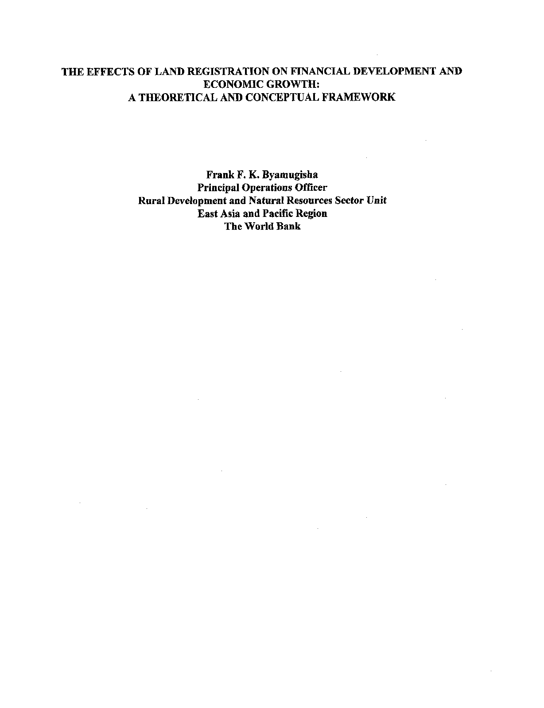

THE EFFECTS OF LAND REGISTRATION ON FINANCIAL DEVELOPMENT AND ECONOMIC GROWTH: A THEORETICAL AND CONCEPTUAL FRAMEWORK

Frank F. K. Byamugisha Principal Operations Officer Rural Development and Natural Resources Sector Unit East Asia and Pacific Region The World Bank

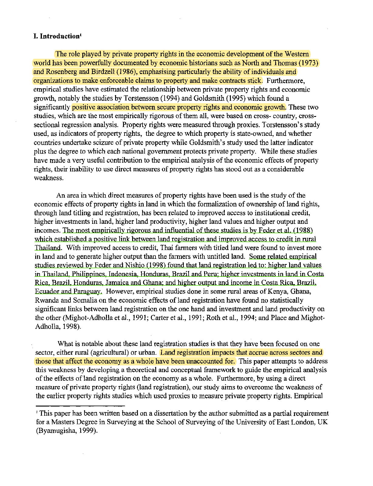

###### I. Introduction'

The role played by private property rights in the economic development of the Western world has been powerfully documented by economichistorians such as North and Thomas (1973) and Rosenberg and Birdzell (1986), emphasising particularly the ability of individuals and organizations to make enforceable claims to property and make contracts stick. Furthermore, empirical studies have estimated the relationship between private property rights and economic growth, notably the studies by Torstensson (1994) and Goldsmith (1995) which found a significantly positive association between secure property rights and economic growth. These two studies, which are the most empirically rigorous of them all, were based on cross- country, crosssectional regression analysis. Property rights were measured through proxies. Torstensson's study used, as indicators of property rights, the degree to which property is state-owned, and whether countries undertake seizure of private property while Goldsmith's study used the latter indicator plus the degree to which each national government protects private property. While these studies have made a very useful contribution to the empirical analysis of the economic effects of property rights, their inability to use direct measures of property rights has stood out as a considerable weakness.

An area in which direct measures of property rights have been used is the study of the economic effects of property rights in land in which the formalization of ownership of land rights, through land titling and registration, has been related to improved access to institutional credit, higher investments in land, higher land productivity, higher land values and higher output and incomes. The most empirically rigorous and influential of these studies is by Feder et al. (1988) which established a positive link between land registration and improved access to credit in rural Thailand. With improved access to credit, Thai farmers with titled land were found to invest more in land and to generate higher output than the farmers with untitled land. Some related empirical studies reviewed by Feder and Nishio (1998) found that land registration led to: higher land values in Thailand, Philippines, Indonesia, Honduras, Brazil and Peru; higher investments in land in Costa Rica, Brazil, Honduras, Jamaica and Ghana; and higher output and income in Costa Rica, Brazil, Ecuador and Paraguay. However, empirical studies done in some rural areas of Kenya, Ghana, Rwanda and Somalia on the economic effects of land registration have found no statistically significant links between land registration on the one hand and investment and land productivity on the other (Mighot-Adholla et al., 1991; Carter et al., 1991;Roth et al., 1994; and Place and MighotAdholla, 1998).

What is notable about these land registration studies is that they have been focused on one sector, either rural (agricultural) or urban. Land registration impacts that accrue across sectors and those that affect the economy as a whole have been unaccounted for. This paper attempts to address this weakness by developing a theoretical and conceptual framework to guide the empirical analysis of the effects of land registration on the economy as a whole. Furthermore, by using a direct measure of private property rights (land registration), our study aims to overcome the weakness of the earlier property rights studies which used proxies to measure private property rights. Empirical

IThis paper has been written based on a dissertation by the author submitted as a partial requirement for a Masters Degree in Surveying at the School of Surveying of the University of East London, UK (Byamugisha, 1999).

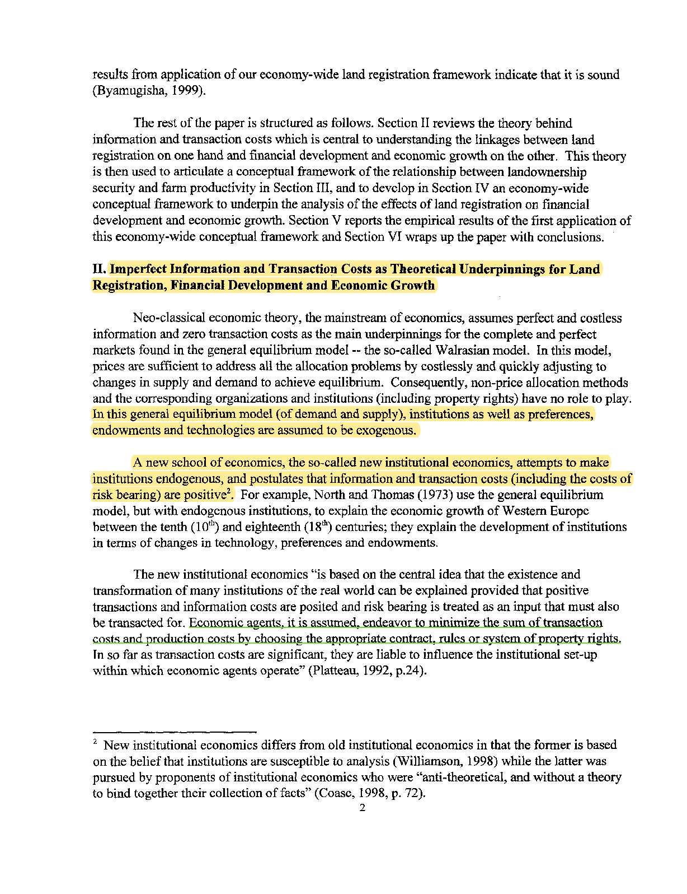

results from application of our economy-wide land registration framework indicate that it is sound (Byamugisha, 1999).

The rest of the paper is structured as follows. Section II reviews the theory behind information and transaction costs which is central to understanding the linkages between land registration on one hand and financial development and economic growth on the other. This theory is then used to articulate a conceptual framework of the relationship between landownership security and farm productivity in Section III, and to develop in Section IV an economy-wide conceptual framework to underpin the analysis of the effects of land registration on financial development and economic growth. Section V reports the empirical results of the first application of this economy-wide conceptual framework and Section VI wraps up the paper with conclusions.

###### II. Imperfect Information and Transaction Costs as Theoretical Underpinnings for Land Registration, Financial Development and Economic Growth

Neo-classical economic theory, the mainstream of economics, assumes perfect and costless information and zero transaction costs as the main underpinnings for the complete and perfect markets found in the general equilibrium model -- the so-called Walrasian model. In this model, prices are sufficient to address all the allocation problems by costlessly and quickly adjusting to changes in supply and demand to achieve equilibrium. Consequently, non-price allocation methods and the corresponding organizations and institutions(including property rights) have no role to play. In this general equilibrium model (of demand and supply), institutions as well as preferences, endowments and technologies are assumed to be exogenous.

A new school of economics, the so-called new institutional economics, attempts to make institutions endogenous, and postulates that information and transaction costs (including the costs of risk bearing) are positive2. For example, North and Thomas (1973) use the general equilibrium model, but with endogenous institutions, to explain the economic growth of Western Europe betweenthetenth(1Oth) and eighteenth(18th) centuries;theyexplainthe developmentof institutions in terms of changes in technology, preferences and endowments.

The new institutional economics "is based on the central idea that the existence and transformation of many institutions of the real world can be explained provided that positive transactions and information costs are posited and risk bearing is treated as an input that must also be transacted for. Economic agents, it is assumed, endeavor to minimize the sum of transaction costs and production costs by choosing the appropriate contract, rules or system of property rights. In so far as transaction costs are significant,they are liable to influence the institutional set-up within which economic agents operate" (Platteau, 1992, p.24).

2 New institutional economics differs from old institutional economics in that the former is based on the belief that institutions are susceptible to analysis (Williamson, 1998) while the latter was pursued by proponents of institutional economics who were "anti-theoretical, and without a theory to bind together their collection of facts" (Coase, 1998, p. 72).

2

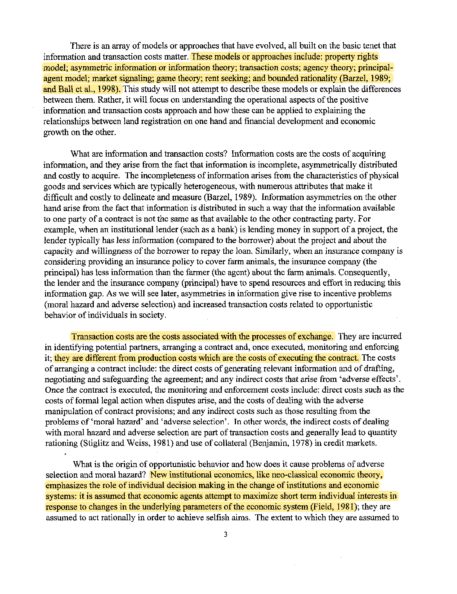

There is an array of models or approaches that have evolved, all built on the basic tenet that information and transaction costs matter. These models or approaches include: property rights model; asymmetric information or information theory; transaction costs; agency theory; principalagent model; market signaling; game theory; rent seeking; and bounded rationality (Barzel, 1989; and Ball et al., 1998). This study will not attempt to describe these models or explain the differences between them. Rather, it will focus on understandingthe operational aspects of the positive information and transaction costs approach and how these can be applied to explaining the relationships between land registration on one hand and financial development and economic growth on the other.

What are information and transaction costs? Information costs are the costs of acquiring information, and they arise from the fact that information is incomplete, asymmetrically distributed and costly to acquire. The incompleteness of information arises from the characteristics of physical goods and services which are typically heterogeneous, with numerous attributes that make it difficult and costly to delineate and measure (Barzel, 1989). Information asymmetries on the other hand arise from the fact that information is distributed in such a way that the information available to one party of a contract is not the same as that available to the other contracting party. For example, when an institutional lender (such as a bank) is lending money in support of a project, the lender typically has less information (compared to the borrower) about the project and about the capacity and willingness of the borrower to repay the loan. Similarly, when an insurance company is considering providing an insurance policy to cover farm animals, the insurance company (the principal) has less information than the farmer (the agent) about the farm animals. Consequently, the lender and the insurance company (principal) have to spend resources and effort in reducing this information gap. As we will see later, asymmetriesin information give rise to incentive problems (moral hazard and adverse selection) and increased transaction costs related to opportunistic behavior of individuals in society.

Transaction costs are the costs associated with the processes of exchange. They are incurred in identifying potential partners, arranging a contract and, once executed, monitoring and enforcing it; they are different from production costs which are the costs of executing the contract. The costs of arranging a contract include: the direct costs of generating relevant information and of drafting, negotiating and safeguarding the agreement; and any indirect costs that arise from 'adverse effects'. Once the contract is executed, the monitoring and enforcement costs include: direct costs such as the costs of formal legal action when disputes arise, and the costs of dealing with the adverse manipulation of contract provisions; and any indirect costs such as those resulting from the problems of 'moral hazard' and 'adverse selection'. In other words, the indirect costs of dealing with moral hazard and adverse selection are part of transaction costs and generally lead to quantity rationing (Stiglitz and Weiss, 1981) and use of collateral (Benjamin, 1978)in credit markets.

What is the origin of opportunistic behavior and how does it cause problems of adverse selection and moral hazard? New institutional economics, like neo-classical economic theory, emphasizes the role of individual decision making in the change of institutions and economic systems: it is assumed that economic agents attempt to maximize short term individual interests in response to changes in the underlying parameters of the economic system (Field, 1981); they are assumed to act rationally in order to achieve selfish aims. The extent to which they are assumed to

3

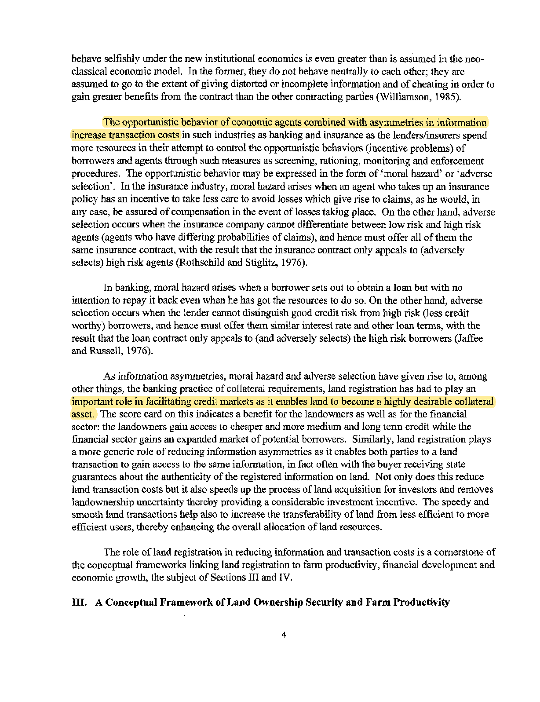

behave selfishly under the new institutional economics is even greater than is assumed in the neoclassical economic model. In the former, they do not behave neutrally to each other; they are assumed to go to the extent of giving distorted or incomplete information and of cheating in order to gain greater benefits from the contract than the other contracting parties (Williamson, 1985).

The opportunistic behavior of economic agents combined with asymmetries in information increase transaction costs in such industries as banking and insurance as the lenders/insurers spend more resources in their attempt to control the opportunistic behaviors (incentive problems) of borrowers and agents through such measures as screening, rationing, monitoring and enforcement procedures. The opportunistic behavior may be expressed in the form of 'moral hazard' or 'adverse selection'. In the insurance industry, moral hazard arises when an agent who takes up an insurance policy has an incentive to take less care to avoid losses which give rise to claims, as he would, in any case, be assured of compensation in the event of losses taking place. On the other hand, adverse selection occurs when the insurance company cannot differentiate between low risk and high risk agents (agents who have differing probabilities of claims), and hence must offer all of them the same insurance contract, with the result that the insurance contract only appeals to (adversely selects) high risk agents (Rothschild and Stiglitz, 1976).

In banking, moral hazard arises when a borrower sets out to obtain a loan but with no intention to repay it back even when he has got the resources to do so. On the other hand, adverse selection occurs when the lender cannot distinguish good credit risk from high risk (less credit worthy) borrowers, and hence must offer them similar interest rate and other loan terms, with the result that the loan contract only appeals to (and adversely selects) the high risk borrowers (Jaffee and Russell, 1976).

As information asymmetries, moral hazard and adverse selection have given rise to, among other things, the banking practice of collateral requirements, land registration has had to play an important role in facilitating credit markets as it enables land to become a highly desirable collateral asset. The score card on this indicates a benefit for the landowners as well as for the financial sector: the landowners gain access to cheaper and more medium and long term credit while the financial sector gains an expanded market of potential borrowers. Similarly, land registration plays a more generic role of reducing information asymmetries as it enables both parties to a land transaction to gain access to the same information, in fact often with the buyer receiving state guarantees about the authenticity of the registered information on land. Not only does this reduce land transaction costs but it also speeds up the process of land acquisition for investors and removes landownership uncertainty thereby providing a considerable investment incentive. The speedy and smooth land transactions help also to increase the transferability of land from less efficient to more efficient users, thereby enhancing the overall allocation of land resources.

The role of land registration in reducing information and transaction costs is a cornerstone of the conceptual frameworks linking land registration to farm productivity, financial development and economic growth, the subject of Sections III and IV.

###### III. A Conceptual Framework of Land Ownership Security and Farm Productivity

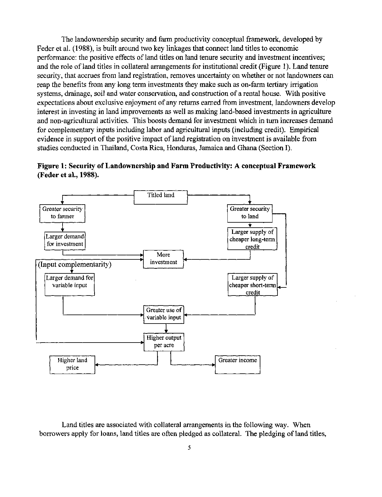

The landownership security and farm productivity conceptual framework, developed by Feder et al. (1988), is built around two key linkages that connect land titles to economic performance: the positive effects of land titles on land tenure security and investment incentives; and the role of land titles in collateral arrangements for institutional credit (Figure 1). Land tenure security, that accrues from land registration, removes uncertainty on whether or not landowners can reap the benefits from any long term investments they make such as on-farm tertiary irrigation systems, drainage, soil and water conservation, and construction of a rental house. With positive expectations about exclusive enjoyment of any returns earned from investment, landowners develop interest in investing in land improvements as well as making land-based investments in agriculture and non-agricultural activities. This boosts demand for investment which in turn increases demand for complementary inputs including labor and agricultural inputs (including credit). Empirical evidence in support of the positive impact of land registration on investment is available from studies conducted in Thailand, Costa Rica, Honduras, Jamaica and Ghana (Section I).

###### Figure 1: Security of Landownership and Farm Productivity: A conceptual Framework (Feder et al., 1988).

###### :;0 - ~~~~~~~~~~Titledlarnd . J

Greatersecurity Greatersecurim tofarrner toland

Largerdemand Largersupplyof varier in cheaperlong-term

for investmrent rei

credit

Higherland Greaterincome priceiMi

Land titles are associated with collateral arrangements in the following way. When borrowers apply for loans, land titles are often pledged as collateral. The pledging of land titles,

5

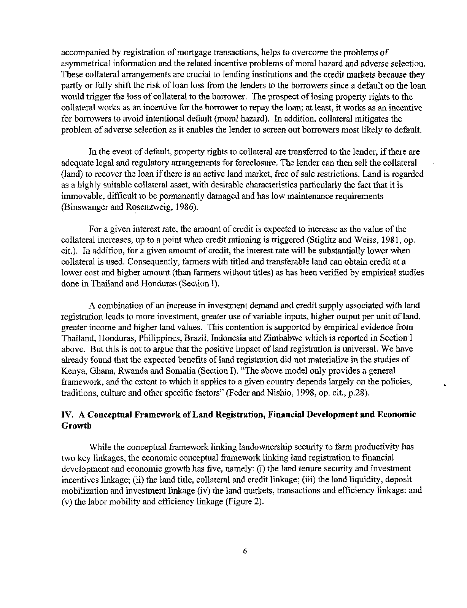

accompanied by registration of mortgage transactions, helps to overcome the problems of asymmetrical informnationand the related incentive problems of moral hazard and adverse selection. These collateral arrangements are crucial to lending institutions and the credit markets because they partly or fully shift the risk of loan loss from the lendersto the borrowers since a default on the loan would trigger the loss of collateral to the borrower. The prospect of losing property rights to the collateral works as an incentive for the borrower to repay the loan; at least, it works as an incentive for borrowers to avoid intentional default (moral hazard). In addition, collateral mitigates the problem of adverse selection as it enables the lender to screen out borrowers most likely to default.

In the event of default, property rights to collateral are transferred to the lender, if there are adequate legal and regulatory arrangements for foreclosure. The lender can then sell the collateral (land) to recover the loan if there is an active land market, free of sale restrictions. Land is regarded as a highly suitable collateral asset, with desirable characteristics particularly the fact that it is immovable, difficult to be permanently damaged and has low maintenance requirements (Binswanger and Rosenzweig, 1986).

For a given interest rate, the amount of credit is expected to increase as the value of the collateral increases, up to a point when credit rationing is triggered (Stiglitz and Weiss, 1981, op. cit.). In addition, for a given amount of credit, the interest rate will be substantially lower when collateral is used. Consequently, farmers with titled and transferable land can obtain credit at a lower cost and higher amount (than farmers without titles) as has been verified by empirical studies done in Thailand and Honduras (Section I).

A combination of an increase in investment demandand credit supply associated with land registration leads to more investment, greater use of variable inputs, higher output per unit of land, greater income and higher land values. This contention is supported by empirical evidence from Thailand, Honduras, Philippines, Brazil, Indonesia and Zimbabwe which is reported in Section I above. But this is not to argue that the positive impact of land registration is universal. We have already found that the expected benefits of land registration did not materialize in the studies of Kenya, Ghana, Rwanda and Somalia (Section I). "The above model only provides a general framework, and the extent to which it applies to a given country depends largely on the policies, traditions, culture and other specific factors" (Feder and Nishio, 1998, op. cit., p.28).

###### IV. A Conceptual Framework of Land Registration, Financial Development and Economic Growth

While the conceptual framework linking landownership security to farm productivity has two key linkages, the economic conceptual framework linking land registration to financial development and economic growth has five, namely: (i) the land tenure security and investment incentives linkage; (ii) the land title, collateral and credit linkage; (iii) the land liquidity, deposit mobilization and investment linkage (iv) the land markets, transactions and efficiency linkage; and (v) the labor mobility and efficiency linkage (Figure 2).

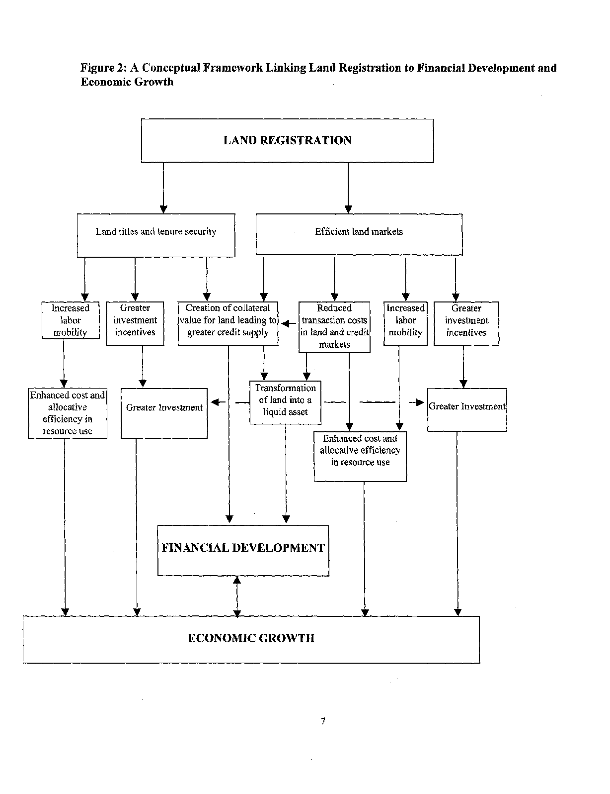

###### Figure 2: A Conceptual Framework Linking Land Registration to Financial Development and Economic Growth

###### LAND REGISTRATION

Landtitles andtenuresecurity Efficientlandmarkets

Increased Greater Creationof collateral Reduced Increased Greater

labor investment valuefor landleadingto + transactioncosts labor investment mobility incentives greatercreditsupply inlandandcredit mobility incentives

markets

w s> 1~~~~~~~Transformahtion

Enhancedcostand Trans in allocative GreaterInvestment of landintoa GreaterInvestment

efficiency in liquid asset

resourceuse

Enhancedcostand allocativeefficiency

inresourceuse

###### FINANCIAL DEVELOPMENT

###### ECONOMIC GROWTH

7

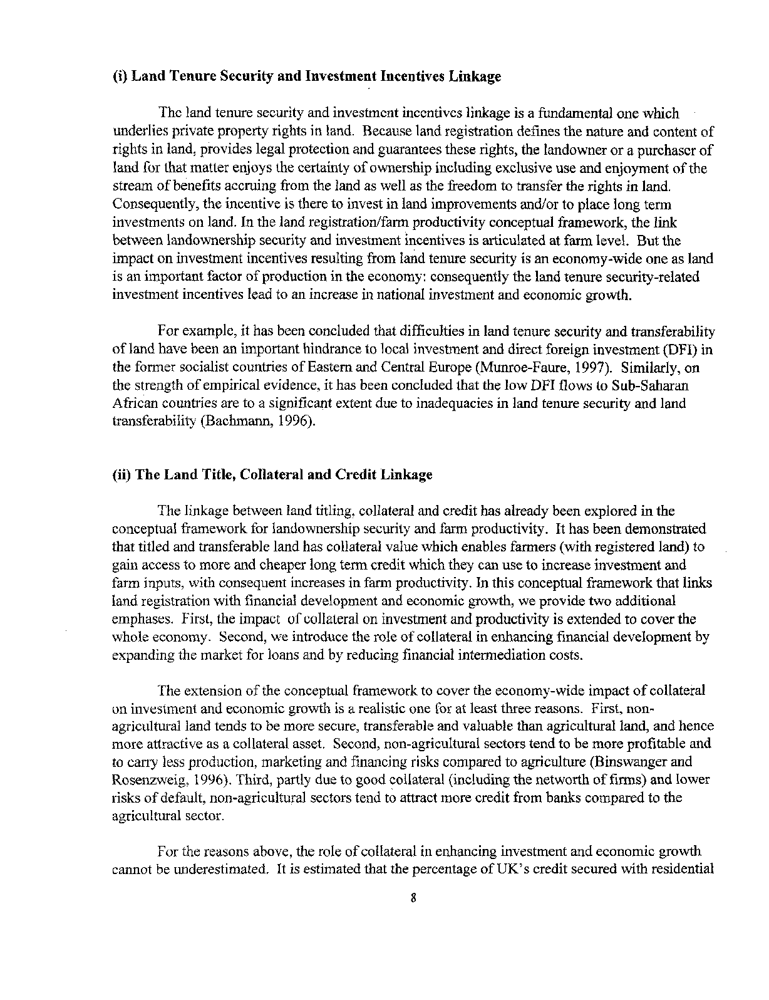

###### (i) Land Tenure Security and Investment Incentives Linkage

The land tenure security and investment incentives linkage is a fundamental one which underlies private property rights in land. Because land registration defines the nature and content of rights in land, provides legal protection and guarantees these rights, the landowner or a purchaser of land for that matter enjoys the certainty of ownership including exclusive use and enjoyment of the stream of benefits accruing from the land as well as the freedom to transfer the rights in land. Consequently, the incentive is there to invest in land improvements and/or to place long term investments on land. In the land registration/farn productivity conceptual framework, the link between landownership security and investment incentives is articulated at farm level. But the impact on investment incentives resulting from land tenure security is an economy-wide one as land is an important factor of production in the economy: consequently the land tenure security-related investment incentives lead to an increase in national investment and economic growth.

For example, it has been concluded that difficulties in land tenure security and transferability of land have been an important hindrance to local investment and direct foreign investment (DFI) in the former socialist countries of Eastern and Central Europe (Munroe-Faure, 1997). Similarly, on the strength of empirical evidence, it has been concluded that the low DFI flows to Sub-Saharan African countries are to a significant extent due to inadequacies in land tenure security and land transferability (Bachmann, 1996).

###### (ii) The Land Title, Collateral and Credit Linkage

The linkage between land titling, collateral and credit has already been explored in the conceptual framework for landownership security and farm productivity. It has been demonstrated that titled and transferable land has collateral value which enables farmers (with registered land) to gain access to more and cheaper long term credit which they can use to increase investment and farm inputs, with consequent increases in farm productivity. In this conceptual framework that links land registration with financial development and economic growth, we provide two additional emphases. First, the impact of collateral on investment and productivity is extended to cover the whole economy. Second, we introduce the role of collateral in enhancing financial development by expanding the market for loans and by reducing financial intermediation costs.

The extension of the conceptual frameworkto cover the economy-wide impact of collateral on investment and economic growth is a realistic one for at least three reasons. First, nonagricultural land tends to be more secure, transferable and valuable than agricultural land, and hence more attractive as a collateral asset. Second, non-agricultural sectors tend to be more profitable and to carry less production, marketing and financing risks compared to agriculture (Binswanger and Rosenzweig, 1996). Third, partly due to good collateral (including the networth of firms) and lower risks of default, non-agricultural sectors tend to attract more credit from banks compared to the agricultural sector.

For the reasons above, the role of collateral in enhancing investment and economic growth cannot be underestimated. It is estimated that the percentage of UK's credit secured with residential

8

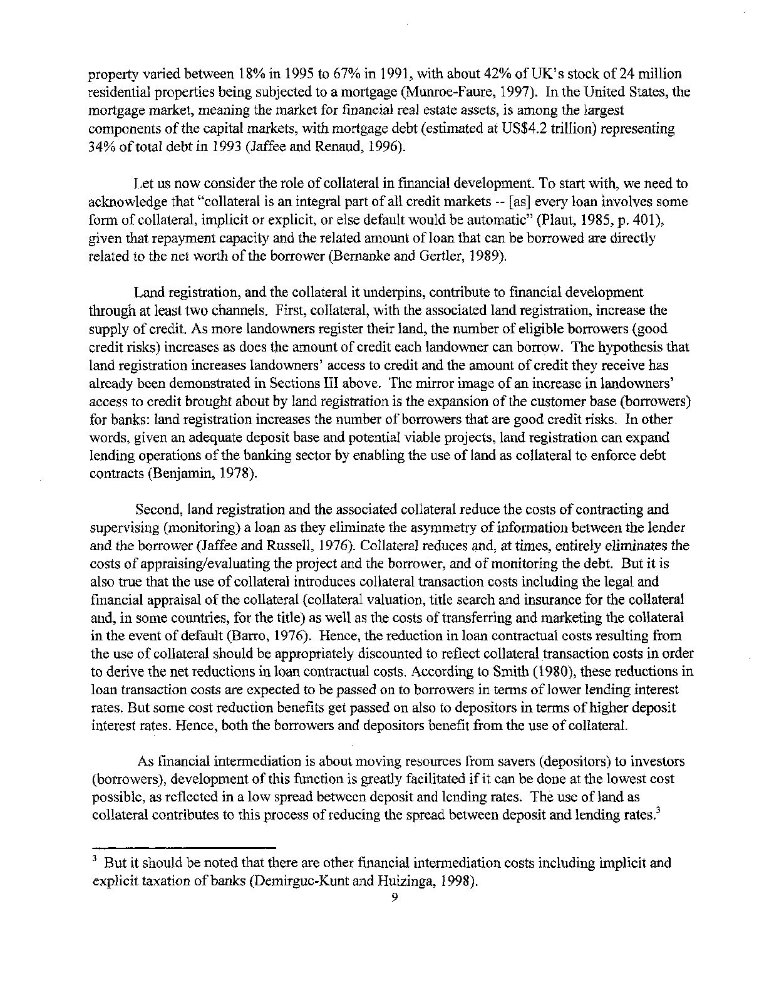

property varied between 18% in 1995 to 67% in 1991, with about 42% of UK's stock of 24 million residential properties being subjected to a mortgage (Munroe-Faure, 1997). In the United States,the mortgage market, meaning the market for financial real estate assets, is among the largest components of the capital markets, with mortgage debt (estimated at US$4.2 trillion) representing 34% of total debt in 1993 (Jaffee and Renaud, 1996).

Let us now consider the role of collateral in financial development. To start with, we need to acknowledge that "collateral is an integral part of all credit markets -- [as] every loan involves some form of collateral, implicit or explicit, or else default would be automatic" (Plaut, 1985, p. 401), given that repayment capacity and the related amount of loan that can be borrowed are directly related to the net worth of the borrower (Bernanke and Gertler, 1989).

Land registration, and the collateral it underpins, contribute to financial development through at least two channels. First, collateral, with the associated land registration, increase the supply of credit. As more landowners register their land, the number of eligible borrowers (good credit risks) increases as does the amount of credit each landowner can borrow. The hypothesis that land registration increases landowners' accessto credit and the amount of credit they receive has already been demonstrated in Sections III above. The mirror image of an increase in landowners' access to credit brought about by land registration is the expansion of the customer base (borrowers) for banks: land registration increases the number of borrowersthat are good credit risks. In other words, given an adequate deposit base and potential viable projects, land registration can expand lending operations of the banking sector by enabling the use of land as collateral to enforce debt contracts (Benjamin, 1978).

Second, land registration and the associated collateral reduce the costs of contracting and supervising (monitoring) a loan as they eliminatethe asymmetry of information between the lender and the borrower (Jaffee and Russell, 1976). Collateral reduces and, at times, entirely eliminates the costs of appraising/evaluating the project and the borrower, and of monitoring the debt. But it is also true that the use of collateral introduces collateral transaction costs including the legal and financial appraisal of the collateral (collateral valuation, title search and insurance for the collateral and, in some countries, for the title) as well as the costs of transferring and marketing the collateral in the event of default (Barro, 1976). Hence, the reduction in loan contractual costs resulting from the use of collateral should be appropriately discounted to reflect collateral transaction costs in order to derive the net reductions in loan contractual costs. According to Smith (1980), these reductions in loan transaction costs are expected to be passed on to borrowers in terms of lower lending interest rates. But some cost reduction benefits get passed on also to depositors in terms of higher deposit interest rates. Hence, both the borrowers and depositors benefit from the use of collateral.

As financial intermediation is about moving resources from savers (depositors) to investors (borrowers), development of this function is greatly facilitated if it can be done at the lowest cost possible, as reflected in a low spread between deposit and lending rates. The use of land as collateral contributes to this process of reducing the spread between deposit and lending rates.3

3 But it should be noted that there are other financial intermediation costs including implicit and explicit taxation of banks (Demirguc-Kunt and Huizinga, 1998).

9

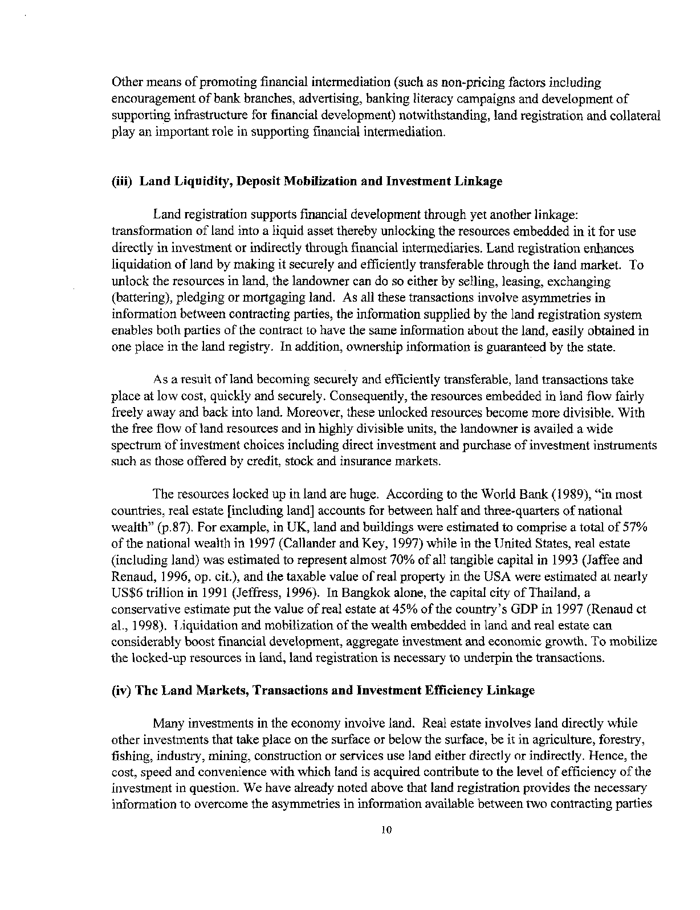

Other means of promoting financial intermediation (such as non-pricing factors including encouragement of bank branches, advertising, banking literacy campaigns and development of supporting infrastructure for financial development) notwithstanding, land registration and collateral play an important role in supporting financial intermediation.

###### (iii) Land Liquidity, Deposit Mobilization and Investment Linkage

Land registration supports financial development through yet another linkage: transformation of land into a liquid asset thereby unlocking the resources embedded in it for use directly in investment or indirectly through financial intermediaries. Land registration enhances liquidation of land by making it securely and efficiently transferable through the land market. To unlock the resources in land, the landownercan do so either by selling, leasing, exchanging (battering), pledging or mortgaging land. As all these transactions involve asymmetries in information between contracting parties, the information supplied by the land registration system enables both parties of the contract to have the same information about the land, easily obtained in one place in the land registry. In addition, ownership information is guaranteed by the state.

As a result of land becoming securely and efficiently transferable, land transactions take place at low cost, quickly and securely. Consequently, the resources embedded in land flow fairly freely away and back into land. Moreover, these unlocked resources become more divisible. With the free flow of land resources and in highly divisible units, the landowner is availed a wide spectrum of investment choices including direct investment and purchase of investment instruments such as those offered by credit, stock and insurance markets.

The resources locked up in land are huge. According to the World Bank (1989), "in most countries, real estate [including land] accounts for between half and three-quarters of national wealth" (p.87). For example, in UK, land and buildings were estimated to comprise a total of 57% of the national wealth in 1997 (Callander and Key, 1997)while in the United States, real estate (including land) was estimated to represent almost 70% of all tangible capital in 1993 (Jaffee and Renaud, 1996, op. cit.), and the taxable value of real property in the USA were estimated at nearly US$6 trillion in 1991 (Jeffress, 1996). In Bangkok alone, the capital city of Thailand, a conservative estimate put the value of real estate at 45% of the country's GDP in 1997 (Renaud et al., 1998). Liquidation and mobilization of the wealth embedded in land and real estate can considerably boost financial development, aggregate investment and economic growth. To mobilize the locked-up resources in land, land registration is necessary to underpin the transactions.

###### (iv) The Land Markets, Transactions and Investment Efficiency Linkage

Many investments in the economy involve land. Real estate involves land directly while other investments that take place on the surface or below the surface, be it in agriculture, forestry, fishing, industry, mining, construction or services use land either directly or indirectly. Hence, the cost, speed and convenience with which land is acquired contribute to the level of efficiency of the investment in question. We have already noted above that land registration provides the necessary information to overcome the asymmetries in information available between two contracting parties

10

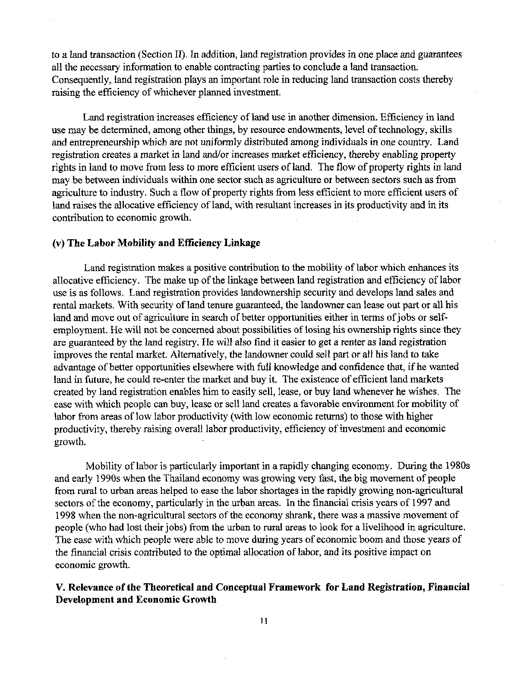

to a land transaction (Section II). In addition, land registration provides in one place and guarantees all the necessary information to enable contracting parties to conclude a land transaction. Consequently, land registration plays an important role in reducing land transaction costs thereby raising the efficiency of whichever planned investment.

Land registration increases efficiency of land use in another dimension. Efficiency in land use may be determined, among other things, by resource endowments, level of technology, skills and entrepreneurship which are not uniformly distributed among individuals in one country. Land registration creates a market in land and/or increases market efficiency, thereby enabling property rights in land to move from less to more efficient users of land. The flow of property rights in land may be between individuals within one sector such as agriculture or between sectors such as from agriculture to industry. Such a flow of property rights from less efficient to more efficient users of land raises the allocative efficiency of land, with resultant increases in its productivity and in its contribution to economic growth.

#### (v) The Labor Mobility and Efficiency Linkage

Land registration makes a positive contribution to the mobility of labor which enhances its allocative efficiency. The make up of the linkage between land registration and efficiency of labor use is as follows. Land registration provides landownership security and develops land sales and rental markets. With security of land tenure guaranteed, the landowner can lease out part or all his land and move out of agriculture in search of better opportunities either in terms of jobs or selfemployment. He will not be concernedabout possibilities of losing his ownership rights since they are guaranteed by the land registry. He will also find it easier to get a renter as land registration improves the rental market. Alternatively, the landownercould sell part or all his land to take advantage of better opportunities elsewhere with full knowledge and confidence that, if he wanted land in future, he could re-enter the market and buy it. The existence of efficient land markets created by land registration enables him to easily sell, lease, or buy land whenever he wishes. The ease with which people can buy, lease or sell land creates a favorable environment for mobility of labor from areas of low labor productivity (with low economic returns) to those with higher productivity, thereby raising overall labor productivity, efficiency of investment and economic growth.

Mobility of labor is particularly important in a rapidly changing economy. During the 1980s and early 1990swhen the Thailand economy was growing very fast, the big movement of people from rural to urban areas helped to ease the labor shortages in the rapidly growing non-agricultural sectors of the economy, particularly in the urban areas. In the financial crisis years of 1997 and 1998 when the non-agricultural sectors of the economy shrank, there was a massive movement of people (who had lost their jobs) from the urban to rural areas to look for a livelihood in agriculture. The ease with which people were able to move during years of economic boom and those years of the financial crisis contributed to the optimal allocation of labor, and its positive impact on economic growth.

V. Relevance of the Theoretical and Conceptual Framework for Land Registration, Financial Development and Economic Growth

11

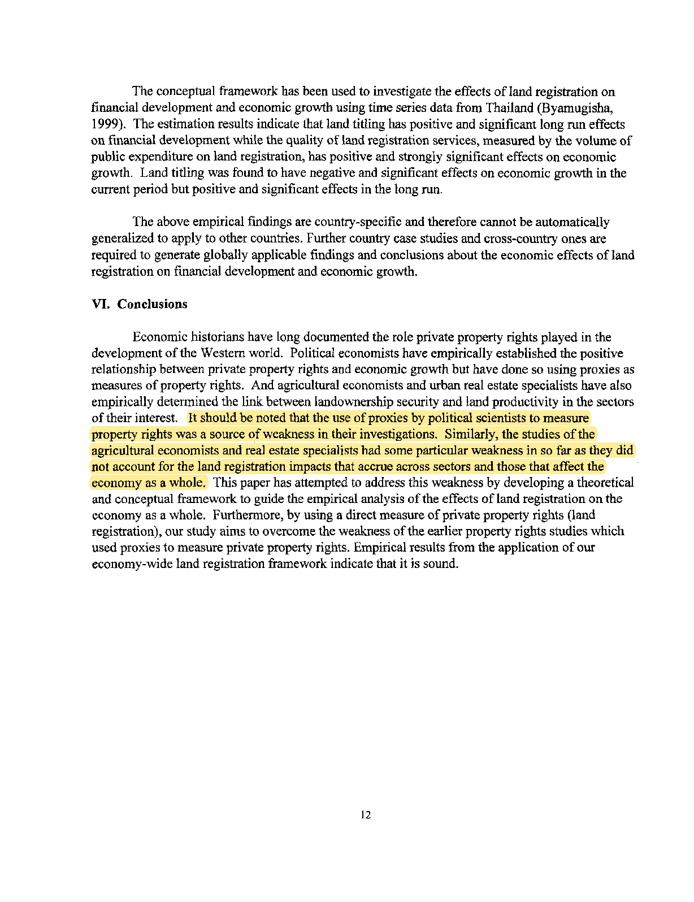

The conceptual framework has been used to investigate the effects of land registration on financial development and economic growth using time series data from Thailand (Byamugisha, 1999). The estimation results indicate that land titling has positive and significant long run effects on financial development while the quality of land registration services, measured by the volume of public expenditure on land registration, has positive and strongly significant effects on economic growth. Land titling was found to have negative and significant effects on economic growth in the current period but positive and significant effects in the long run.

The above empirical findings are country-specific and therefore cannot be automatically generalized to apply to other countries. Further country case studies and cross-country ones are required to generate globally applicable findings and conclusions about the economic effects of land registration on financial development and economic growth.

###### VI. Conclusions

Economic historians have long documentedthe role private property rights played in the development of the Western world. Political economists have empirically established the positive relationship between private property rights and economic growth but have done so using proxies as measures of property rights. And agricultural economists and urban real estate specialists have also empirically determined the link between landownership security and land productivity in the sectors of their interest. It should be noted that the use of proxies by political scientists to measure property rights was a source of weakness in their investigations. Similarly, the studies of the agricultural economists and real estate specialists had some particular weakness in so far as they did not account for the land registration impacts that accrue across sectors and those that affect the economy as a whole. This paper has attempted to address this weakness by developing a theoretical and conceptual framework to guide the empirical analysis of the effects of land registration on the economy as a whole. Furthermore, by using a direct measure of private property rights (land registration), our study aims to overcome the weakness of the earlier property rights studies which used proxies to measure private property rights. Empirical results from the application of our economy-wide land registration framework indicate that it is sound.

12

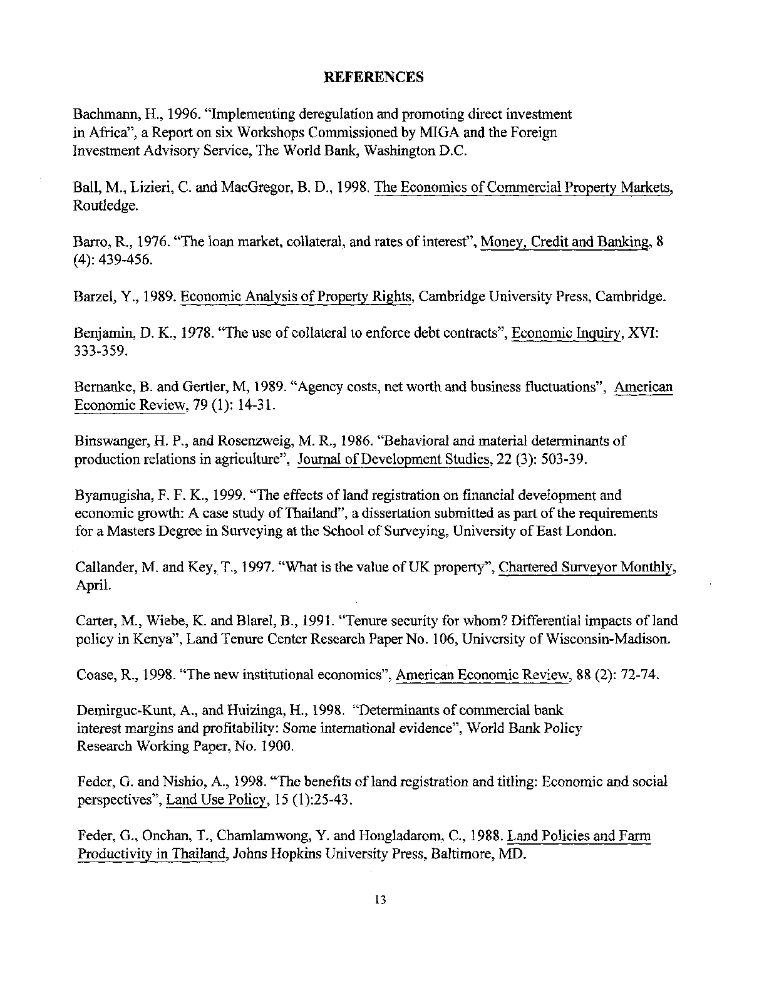

###### REFERENCES

Bachmann, H., 1996. "Implementing deregulation and promoting direct investment in Africa", a Report on six Workshops Commissioned by MIGA and the Foreign Investment Advisory Service, The World Bank, Washington D.C.

Ball, M., Lizieri, C. and MacGregor, B. D., 1998.The Economics of Commercial Property Markets, Routledge.

Barro, R., 1976. "The loan market, collateral, and rates of interest", Money, Credit and Banking, 8

(4): 439-456. Barzel, Y., 1989. Economic Analysis of Property Rights, Cambridge University Press, Cambridge. Benjamin, D. K., 1978. "The use of collateral to enforce debt contracts", Economic Inquiry, XVI: 333-359. Bernanke, B. and Gertler, M, 1989."Agency costs, net worth and business fluctuations", American Economic Review, 79 (1): 14-31. Binswanger, H. P., and Rosenzweig, M. R., 1986. "Behavioral and material determinants of production relations in agriculture", Journal of Development Studies, 22 (3): 503-39. Byamugisha, F. F. K., 1999. "The effects of land registration on financial development and economic growth: A case study of Thailand", a dissertation submitted as part of the requirements for a Masters Degree in Surveying at the School of Surveying, University of East London. Callander, M. and Key, T., 1997. "What is the value of UK property", Chartered Surveyor Monthly, April. Carter, M., Wiebe, K. and Blarel, B., 1991. "Tenure security for whom? Differential impacts of land policy in Kenya", Land Tenure Center Research Paper No. 106, University of Wisconsin-Madison. Coase, R., 1998. "The new institutional economics", American Economic Review, 88 (2): 72-74. Demirguc-Kunt, A., and Huizinga, H., 1998. "Determinants of commercial bank interest margins and profitability: Some international evidence", World Bank Policy Research Working Paper, No. 1900. Feder, G. and Nishio, A., 1998. "The benefits of land registration and titling: Economic and social perspectives", Land Use Policy, 15 (1):25-43. Feder, G., Onchan, T., Chamlamwong, Y. and Hongladarom,C., 1988. Land Policies and Farm Productivity in Thailand, Johns Hopkins University Press, Baltimore, MD.

13

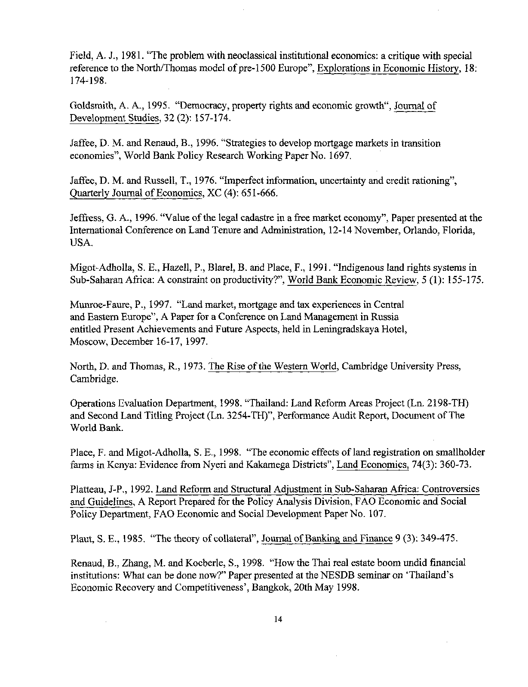

Field, A. J., 1981. "The problem with neoclassical institutional economics: a critique with special reference to the North/Thomas model of pre-1500 Europe", Explorations in Economic History, 18: 174-198.

Goldsmith, A. A., 1995. "Democracy, property rights and economic growth", Journal of Development Studies, 32 (2): 157-174.

Jaffee, D. M. and Renaud, B., 1996."Strategies to develop mortgage markets in transition economies", World Bank Policy Research WorkingPaper No. 1697.

Jaffee, D. M. and Russell, T., 1976. "Imperfect information, uncertainty and credit rationing", Quarterly Journal of Economics, XC (4): 651-666.

Jeffress, G. A., 1996. "Value of the legal cadastre in a free market economy", Paper presented at the International Conference on Land Tenure and Administration, 12-14November, Orlando, Florida, USA.

Migot-Adholla, S. E., Hazell, P., Blarel, B. and Place, F., 1991. "Indigenous land rights systems in Sub-Saharan Africa: A constraint on productivity?", World Bank Economic Review, 5 (1): 155-175.

Munroe-Faure, P., 1997. "Land market, mortgage and tax experiences in Central and Eastern Europe", A Paper for a Conference on Land Management in Russia entitled Present Achievements and Future Aspects, held in Leningradskaya Hotel, Moscow, December 16-17, 1997.

North, D. and Thomas, R., 1973. The Rise of the Western World, Cambridge University Press, Cambridge.

Operations Evaluation Department, 1998. "Thailand: Land Reform Areas Project (Ln. 2198-TH) and Second Land Titling Project (Ln. 3254-TH)", Performance Audit Report, Document of The World Bank.

Place, F. and Migot-Adholla, S. E., 1998. "The economic effects of land registration on smallholder farrns in Kenya: Evidence from Nyeri and Kakamega Districts", Land Economics, 74(3): 360-73.

Platteau, J-P., 1992. Land Reform and Structural Adjustment in Sub-Saharan Africa: Controversies and Guidelines, A Report Prepared for the Policy Analysis Division, FAO Economic and Social Policy Department, FAO Economic and Social Development Paper No. 107.

Plaut, S. E., 1985. "The theory of collateral", Journal of Banking and Finance 9 (3): 349-475. Renaud, B., Zhang, M. and Koeberle, S., 1998. "How the Thai real estate boom undid financial institutions: What can be done now?" Paper presented at the NESDB seminar on 'Thailand's Economic Recovery and Competitiveness', Bangkok, 20th May 1998.

14

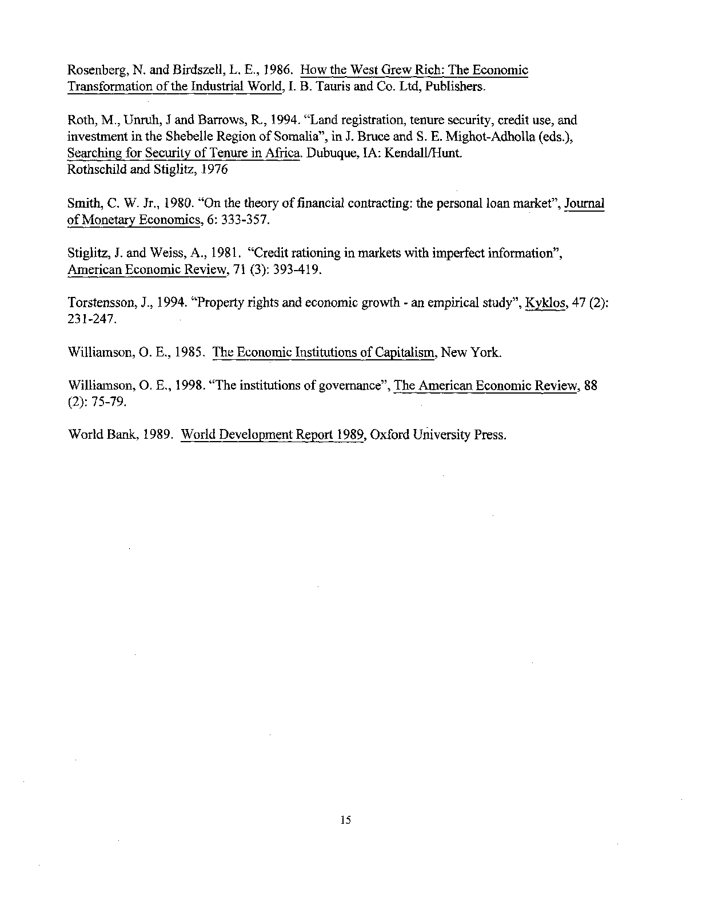

Rosenberg, N. and Birdszell, L. E., 1986. How the West Grew Rich: The Economic Transformation of the Industrial World, T.B. Tauris and Co. Ltd, Publishers.

Roth, M., Unruh, J and Barrows, R., 1994. "Land registration, tenure security, credit use, and investment in the Shebelle Region of Somalia", in J. Bruce and S. E. Mighot-Adholla (eds.), Searching for Security of Tenure in Africa. Dubuque, IA: Kendall/Hunt. Rothschild and Stiglitz, 1976

Smith, C. W. Jr., 1980. "On the theory of financial contracting: the personal loan market", Journal of Monetary Economics, 6: 333-357.

Stiglitz, J. and Weiss, A., 1981. "Credit rationing in markets with imperfect information", American Economic Review, 71 (3): 393-419.

Torstensson, J., 1994. "Property rights and economic growth - an empirical study", Kyklos, 47 (2): 231-247.

Williamson, 0. E., 1985. The Economic Institutions of Capitalism, New York. Williamson, 0. E., 1998. "The institutions of governance", The American Economic Review, 88

(2): 75-79. World Bank, 1989. World Development Report 1989, Oxford University Press.

15

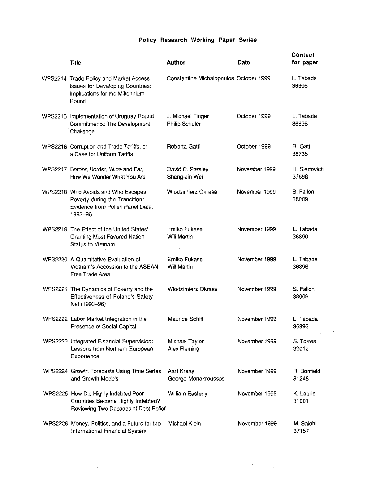

- WPS2214TradePolicyandMarketAccess ConstantineMichalopoulosOctober1999 L. Tabada Issuesfor DevelopingCountries: 36896 Implicationsforthe Millennium Round
- WPS2215Implementationof UruguayRound J.MichaelFinger October1999 L.Tabada Commitments:TheDevelopment PhilipSchuler 36896 Challenge
- WPS2216CorruptionandTradeTariffs,or RobertaGatti October1999 R.Gatti a CaseforUniformTariffs 38735
- WPS2217Border,Border,WideandFar, DavidC.Parsley November1999 H.Sladovich HowWeWonderWhatYouAre Shang-JinWei 37698
- WPS2218WhoAvoidsandWhoEscapes WlodzimierzOkrasa November1999 S.Fallon PovertyduringtheTransition: 38009 EvidencefromPolishPanelData, 1993-96
- WPS2219TheEffectof the UnitedStates' EmikoFukase November1999 L. Tabada GrantingMostFavoredNation WillMartin 36896 Statusto Vietnam
- WPS2220A QuantitativeEvaluationof EmikoFukase November1999 L.Tabada Vietnam'sAccessionto theASEAN WillMartin 36896 FreeTradeArea
- WPS2221The Dynamicsof Povertyandthe WlodzimierzOkrasa November1999 S.Fallon Effectivenessof Poland'sSafety 38009 Net(1993-96)
- WPS2222LaborMarketIntegrationinthe MauriceSchiff November1999 L.Tabada Presenceof SocialCapital 36896
- WPS2223IntegratedFinancialSupervision: MichaelTaylor November1999 S.Torres LessonsfromNorthernEuropean AlexFleming 39012 Experience
- WPS2224GrowthForecastsUsingTimeSeries Aart Kraay November1999 R. Bonfield andGrowthModels GeorgeMonokroussos 31248
- WPS2225HowDidHighlyIndebtedPoor WilliamEasterly November1999 K.Labrie CountriesBecomeHighlyIndebted? 31001 ReviewingTwoDecadesof DebtRelief
- WPS2226Money,Politics,anda Futureforthe MichaelKlein November1999 M.Salehi InternationalFinancialSystem 37157

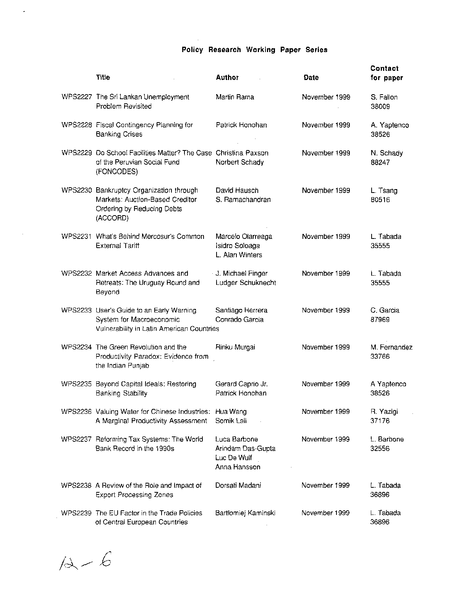

- WPS2227TheSriLankanUnemployment MartinRama November1999 S.Fallon ProblemRevisited 38009
- WPS2228FiscalContingencyPlanningfor PatrickHonohan November1999 A.Yaptenco BankingCrises 38526
- WPS2229DoSchoolFacilitiesMatter?TheCase ChristinaPaxson November1999 N. Schady of thePeruvianSocialFund NorbertSchady 88247 (FONCODES)
- WPS2230BankruptcyOrganizationthrough DavidHausch November1999 L. Tsang Markets:Auction-BasedCreditor S.Ramachandran 80516 Orderingby ReducingDebts (ACCORD)
- WPS2231What'sBehindMercosur'sCommon MarceloOlarreaga November1999 L.Tabada ExternalTariff IsidroSoloaga 35555 L.AlanWinters
- WPS2232MarketAccessAdvancesand J. MichaelFinger November1999 L.Tabada Retreats:TheUruguayRoundand LudgerSchuknecht 35555 Beyond
- WPS2233User'sGuideto an EarlyWarning SantiagoHerrera November1999 C. Garcia Systemfor Macroeconomic ConradoGarcia 87969 Vulnerabilityin LatinAmericanCountries
- WPS2234TheGreenRevolutionandthe RinkuMurgai November1999 M.Fernandez ProductivityParadox:Evidencefrom 33766 the IndianPunjab
- WPS2235BeyondCapitalIdeals:Restoring GerardCaprioJr. November1999 A Yaptenco BankingStability PatrickHonohan 38526
- WPS2236ValuingWaterforChineseIndustries: HuaWang November1999 R.Yazigi A MarginalProductivityAssessment SomikLall 37176
- WPS2237ReformingTaxSystems:TheWorld LucaBarbone November1999 L. Barbone BankRecordinthe1990s ArindamDas-Gupta 32556 LucDeWulf AnnaHansson
- WPS2238A Reviewof theRoleandImpactof DorsatiMadani November1999 L. Tabada ExportProcessingZones 36896
- WPS2239The EUFactorintheTradePolicies BartlomiejKaminski November1999 L. Tabada of CentralEuropeanCountries 36896

## /<-4A

